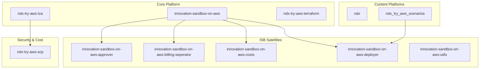

# Repository Inventory for NDX Try Architecture

**Generated:** 2026-02-03
**Total Repositories:** 12
**Survey Scope:** IaC types, entry points, GitHub workflows, documentation, and architecture components

---

## Executive Summary

This document provides a comprehensive inventory of all 12 repositories that comprise the NDX (National Digital Exchange) and Innovation Sandbox on AWS ecosystem. The system implements a sophisticated AWS multi-account cloud platform for UK local government experimentation with AWS services.

---

## Summary Table

| Repository | Type | IaC | Docs | Workflows | Status |
|---|---|---|---|---|---|
| innovation-sandbox-on-aws | TypeScript/Node.js | CDK + CloudFormation | ✓ | None | Core Platform |
| innovation-sandbox-on-aws-approver | TypeScript/Node.js | CDK | ✓ | Deploy | Satellite |
| innovation-sandbox-on-aws-billing-seperator | TypeScript/Node.js | CDK | None | CI/Deploy | **Temporary Workaround** |
| innovation-sandbox-on-aws-costs | TypeScript/Node.js | CDK | ✓ | CI/Deploy | Satellite |
| innovation-sandbox-on-aws-deployer | TypeScript/Node.js | CDK | ✓ | CI | Satellite |
| innovation-sandbox-on-aws-utils | Python | Scripts | None | None | Utility |
| ndx | TypeScript/Node.js | Eleventy + CDK | ✓ | CI/Infra/Test | Web Platform |
| ndx_try_aws_scenarios | TypeScript/Node.js | CloudFormation | ✓ | Build/Deploy | Scenario Platform |
| ndx-try-aws-isb | Empty | None | None | None | **Placeholder/Archive** |
| ndx-try-aws-lza | YAML Config | Landing Zone Accelerator | None | None | Infrastructure Config |
| ndx-try-aws-scp | Terraform | Cost Defense | ✓ | Terraform | Security/Cost Control |
| ndx-try-aws-terraform | Terraform | Organization | None | None | Infrastructure Config |

---

## Detailed Repository Findings

### 1. innovation-sandbox-on-aws

**Purpose:** Core Innovation Sandbox on AWS solution - enables cloud administrators to set up and recycle temporary sandbox environments with automated security, governance, spend management, and account recycling.

**Key Features:**
- Web-based UI for managing sandbox accounts
- Automated security and governance policy implementation
- Account recycling/cleanup mechanisms
- Support for multiple deployment scenarios

**IaC Type:** TypeScript/Node.js with CDK and CloudFormation
- Entry Points: `deployment/` directory (build scripts)
- Main: `package.json` (AWS CDK configuration)
- CDK stacks: Located in `source/infrastructure/`

**GitHub Actions Workflows:** None configured

**Documentation:**
- Location: `/docs/`
  - `diagrams/` - Architecture diagrams
  - `openapi/` - API specifications
- README: Comprehensive with deployment guides, prerequisites, environment setup

**Key Files:**
- `package.json` - Dependencies and scripts
- `.env.example` - Environment variable template
- `CHANGELOG.md`, `CONTRIBUTING.md`, `CODE_OF_CONDUCT.md`
- `.pre-commit-config.yaml` - Code quality controls

**Architecture:** Multi-stack CloudFormation deployment (AccountPool, IDC, Data, Compute stacks)

---

### 2. innovation-sandbox-on-aws-approver

**Purpose:** Automated lease approval system for Innovation Sandbox using intelligent risk scoring (19-rule scoring engine).

**Key Features:**
- Score-based approval with 80%+ instant approval target
- Domain verification (UK local government domains)
- AI-powered email analysis (Amazon Bedrock - Nova Micro)
- Business hours & queue management
- Slack Workflow notifications for manual escalations
- Less than 5% false negative rate for malicious requests

**IaC Type:** TypeScript/Node.js with AWS CDK
- Entry Points:
  - `cdk/` - CDK infrastructure
  - `src/` - Lambda handler implementation
- Main: `dist/handler.js`
- CDK Config: `cdk.json`

**GitHub Actions Workflows:**
- `deploy.yml` - Deployment pipeline

**Documentation:**
- Location: `/docs/`
  - `approver-access-management.md` - Permission management
  - `operator-onboarding-canvas.md` - Operator training
  - `runbooks/` - Operational procedures
- README: Detailed explaining risk scoring, features, configuration

**Architecture:**
- EventBridge listener for `LeaseRequested` events
- Lambda-based scoring engine
- DynamoDB storage for configuration
- Slack integration for operator notifications

---

### 3. innovation-sandbox-on-aws-billing-seperator

**Purpose:** **⚠️ TEMPORARY WORKAROUND** for billing attribution and quota exhaustion issues. Enforces 72-hour hard cooldown on sandbox accounts. Should be archived once native cooldown support is added to ISB (tracking issue #70).

**Key Features:**
- Hard 72-hour quarantine for billing period boundaries
- CloudTrail-triggered account quarantine
- EventBridge cross-account event routing
- SQS queue for processing
- Org management account integration

**IaC Type:** TypeScript/Node.js with AWS CDK
- Entry Points:
  - `bin/` - CDK entry point
  - `lib/` - Stack implementations (hub-stack.ts, org-mgmt-stack.ts)
- CDK Config: `cdk.json`, `cdk.context.example.json`

**GitHub Actions Workflows:**
- `deploy.yml` - Deployment
- `pr-check.yml` - Pull request validation

**Documentation:**
- Location: No /docs directory
- README: Explains architecture, explains when to delete

**Architecture:**
- Cross-account EventBridge rule forwarding
- Custom event bus in hub account
- EventBridge rule → SQS → Lambda for account quarantine

**Status:** DEPRECATED - Awaiting archival once ISB issue #70 is resolved

---

### 4. innovation-sandbox-on-aws-costs

**Purpose:** Event-driven lease cost collection service. Automatically collects billing data when Innovation Sandbox leases terminate, storing reports in S3 with presigned URLs.

**Key Features:**
- Triggered by `LeaseTerminated` events
- 24-hour delay for billing data settlement
- Cross-account Cost Explorer access (assumes role in org management)
- JWT authentication for Lambda-to-Lambda calls
- CSV cost report generation with presigned URLs
- 3-year S3 retention policy
- 7-day valid presigned URL generation

**IaC Type:** TypeScript/Node.js
- Entry Points:
  - `infra/` - CDK infrastructure stacks
  - `src/` - Lambda handler implementation

**GitHub Actions Workflows:**
- `ci.yml` - Continuous integration
- `deploy.yml` - Deployment pipeline

**Documentation:**
- Location: `/docs/`
  - `api-contracts.md` - Event schema documentation
  - `TESTING.md` - Test procedures

**Architecture:**
- EventBridge rule triggered on LeaseTerminated
- Scheduler Lambda creates one-shot schedule (24hr delay)
- Cost Collector Lambda queries Cost Explorer
- S3 bucket storage with lifecycle policies
- Cross-account IAM role assumption

---

### 5. innovation-sandbox-on-aws-deployer

**Purpose:** AWS Lambda function that auto-deploys CloudFormation templates and CDK applications to sandbox sub-accounts when leases are approved.

**Key Features:**
- Event-driven deployment on LeaseApproved events
- **CDK scenario auto-detection** (cdk.json presence check)
- Sparse cloning from GitHub (efficient bandwidth)
- CDK synthesis to CloudFormation
- Parameter enrichment from DynamoDB
- Cross-account STS role assumption
- Success/failure event emission

**IaC Type:** TypeScript/Node.js with CDK
- Entry Points:
  - `infrastructure/` - CDK infrastructure
  - `src/` - Lambda handler implementation

**GitHub Actions Workflows:**
- `ci.yml` - Continuous integration

**Documentation:**
- Location: `/docs/`
  - `architecture-innovation-sandbox-on-aws-deployer-2025-12-03.md`
  - `prd-innovation-sandbox-on-aws-deployer-2025-12-03.md`
  - `product-brief-deployment-extension-2025-12-04.md`
  - `sprint-plan-innovation-sandbox-on-aws-deployer-2025-12-03.md`

**Architecture:**
- EventBridge source account (hub)
- GitHub API integration for CDK detection
- Sparse git clone for CDK projects
- npm ci --ignore-scripts for secure dependency installation
- CloudFormation stack deployment in target accounts
- DynamoDB parameter enrichment from lease data

**Special Capability:** Supports both CDK (TypeScript/JavaScript) and CloudFormation templates with automatic detection

---

### 6. innovation-sandbox-on-aws-utils

**Purpose:** Utility scripts for managing the Innovation Sandbox ecosystem.

**Key Features:**
- Python-based pool account creation automation
- SSO authentication handling
- Sequential pool account naming (pool-001, pool-002, etc.)
- Integration with Innovation Sandbox Lambda for account registration
- Billing view management
- Status polling for account cleanup completion

**IaC Type:** Pure Python Scripts
- Entry Point: `create_sandbox_pool_account.py`
- No CDK/CloudFormation

**GitHub Actions Workflows:** None

**Documentation:**
- Location: No /docs directory
- README: Comprehensive usage guide with step-by-step examples

**Key Functionality:**
1. SSO Authentication validation
2. Pool account enumeration
3. Account creation via AWS Organizations
4. OU placement (Entry → Ready via cleanup)
5. Billing view registration
6. ISB Lambda invocation for registration
7. Status polling with configurable timeouts

**Architecture:** Direct AWS SDK (boto3) calls with SSO profiles

---

### 7. ndx

**Purpose:** National Digital Exchange (NDX) website - informational platform describing the NDX initiative using static site generation.

**Key Features:**
- Static site with Eleventy (11ty) v3.x
- GOV.UK Frontend design system
- Discover section (news, events, case studies)
- Cloud services catalogue
- Access request system
- Cloud Maturity Model and Assessment Tool
- Comprehensive accessibility testing

**IaC Type:** TypeScript/Node.js with Eleventy + AWS CDK for infrastructure
- Entry Points:
  - `src/` - Website source files (templates, assets, data)
  - `infra/` - AWS CDK infrastructure
  - `lib/` - TypeScript libraries
- Package Manager: Yarn

**GitHub Actions Workflows:**
- `accessibility.yml` - Pa11y/accessibility testing
- `ci.yaml` - Continuous integration
- `infra.yaml` - Infrastructure deployment
- `scorecard.yml` - OpenSSF scorecard
- `test.yml` - Unit/component testing

**Documentation:**
- Location: `/docs/`
  - `accessibility-audit.md` - WCAG compliance audit
  - `adr/` - Architecture Decision Records
  - `architecture.md` - System architecture
  - `component-inventory.md` - GOV.UK components used
  - `development-guide.md` - Developer guide
  - `govuk-component-audit.md` - GOV.UK audit results
  - `infrastructure-architecture.md` - Infrastructure design
  - `index.md` - Documentation index

**Testing:**
- Unit tests (Jest)
- E2E tests (Playwright)
- Accessibility testing (Pa11y)
- Lighthouse CI performance testing

**Architecture:** Eleventy static site with AWS CDK infrastructure for hosting

---

### 8. ndx_try_aws_scenarios

**Purpose:** Zero-cost AWS evaluation platform for UK local government with 6+ pre-built scenarios for hands-on cloud exploration.

**Key Features:**
- 7 Scenarios: Council Chatbot, Planning AI, FOI Redaction, Smart Car Park, Text to Speech, QuickSight Dashboard, LocalGov Drupal
- One-click CloudFormation deployment
- Innovation Sandbox integration
- Evidence pack generation (committee-ready PDFs with ROI analysis)
- GOV.UK Design System (WCAG 2.2 AA compliant)
- Fully free/zero-cost

**IaC Type:** TypeScript/Node.js with Eleventy + CloudFormation Templates
- Entry Points:
  - `src/` - Website source (Eleventy templates, assets)
  - `cloudformation/` - AWS deployment templates
    - `scenarios/` - Per-scenario templates (7 scenarios)
    - `functions/` - Lambda functions
    - `layers/` - Lambda layers
    - `screenshot-automation/` - Automation for evidence packs
- CloudFormation Files: 275+ template files across scenarios

**GitHub Actions Workflows:**
- `build-deploy.yml` - Build and deploy pipeline
- `docker-build.yml` - Docker container builds

**Documentation:**
- Location: `/docs/`
  - `deployment-endpoints.yaml` - Service endpoints
  - `documentation-standards.md` - Writing guide
  - `epic-25-tech-spec.md` - Technical specifications
  - `localgov-drupal-cdk-notes.md` - Drupal-specific notes
  - `ops/` - Operational procedures
  - `prd-*.md` - Product requirements
  - `screenshot-pipeline-architecture.md` - Evidence pack generation
  - `screenshots/` - Screenshot collections
  - `templates/` - Documentation templates

**Scenarios Deployed:**
1. `council-chatbot` - 24/7 AI resident support
2. `foi-redaction` - Sensitive data redaction
3. `localgov-drupal` - Full Drupal stack
4. `planning-ai` - Planning application processing
5. `quicksight-dashboard` - Service analytics
6. `smart-car-park` - IoT parking availability
7. `text-to-speech` - Accessibility audio generation

---

### 9. ndx-try-aws-isb

**Purpose:** **⚠️ EMPTY/PLACEHOLDER** repository for Innovation Sandbox configuration.

**Status:** EMPTY/PLACEHOLDER
- Only contains: `.git/`, `.gitignore`, `LICENSE`
- No source code
- No documentation
- No workflows

**Note:** ISB files are in separate repositories (innovation-sandbox-on-aws, etc.)

---

### 10. ndx-try-aws-lza

**Purpose:** Landing Zone Accelerator (LZA) configuration files for NDX:Try AWS environment structure.

**Key Features:**
- AWS LZA v1.1.0 configuration
- Organizational account structure via YAML
- Multi-account governance setup
- OU definitions for Innovation Sandbox accounts
- Service Control Policies configuration
- IAM policies and roles
- Network configuration

**IaC Type:** AWS Landing Zone Accelerator - YAML Configuration
- Configuration Files:
  - `accounts-config.yaml` - Account definitions
  - `global-config.yaml` - Global settings
  - `iam-config.yaml` - IAM configuration
  - `network-config.yaml` - Network setup
  - `organization-config.yaml` - Organization structure
  - `replacements-config.yaml` - Variable replacements
  - `security-config.yaml` - Security settings

**Directory Structure:**
- `backup-policies/` - Backup service policies
- `declarative-policies/` - Custom declarative policies
- `dynamic-partitioning/` - Dynamic partition configs
- `event-bus-policies/` - EventBridge policies
- `iam-policies/` - IAM policy definitions
- `rcp-policies/` - Resource Control Policies
- `service-control-policies/` - SCPs configuration

**GitHub Actions Workflows:** None

**Documentation:**
- Location: No /docs directory
- README: Brief explaining LZA usage
- Recent Updates documented in README (v1.0.0 → v1.1.0)

**Recent Changes (per README):**
- 2025-12-19: Upgraded to LZA v1.1.0
- 2025-12-15: Directory restructuring for GitHub configuration
- 2025-11-17: OUs added for InnovationSandbox

---

### 11. ndx-try-aws-scp

**Purpose:** Comprehensive cost defense system using 5-layer defense-in-depth architecture to protect against cost attacks in 24-hour sandbox leases.

**Key Features:**
- **5 Defense Layers:**
  1. Service Control Policies (prevention)
  2. Service Quotas (hard limits)
  3. AWS Budgets (detection with aggressive alerting)
  4. Cost Anomaly Detection (ML-based)
  5. DynamoDB Billing Enforcer (auto-remediation)

- **Cost Protection:**
  - $50/day limit with 10%, 50%, 100% alerts
  - $1000/month budget
  - 10 service-specific budgets (CloudWatch, Lambda, DynamoDB, Bedrock, etc.)
  - EC2 instance type allowlist (t2, t3, t3a, m5, m6i)
  - GPU/accelerated instance blocking
  - 20+ expensive services blocked (SageMaker, EMR, Redshift, MSK)

**IaC Type:** Terraform
- Entry Points:
  - `environments/` - Deployment environments
    - `ndx-production/` - Production configuration
  - `modules/` - Reusable Terraform modules
    - `scp-manager/` - Service Control Policy management
    - `service-quotas-manager/` - Service quota templates
    - `budgets-manager/` - AWS Budget configurations
    - `cost-anomaly-detection/` - Cost anomaly detection setup
    - `dynamodb-billing-enforcer/` - DynamoDB enforcement Lambda

**GitHub Actions Workflows:**
- `terraform.yaml` - Terraform deployment/validation

**Documentation:**
- Location: `/docs/`
  - `EVENTBRIDGE_EVENTS.md` - Event schemas
  - `GITHUB_ACTIONS_SETUP.md` - CI/CD setup
  - `SCP_CONSOLIDATION_ANALYSIS.md` - Policy analysis

**Test Coverage:** `tests/` directory with Terraform validation tests

---

### 12. ndx-try-aws-terraform

**Purpose:** General Terraform configuration for NDX:Try AWS organization management.

**Key Features:**
- S3 bucket provisioning for remote Terraform state
- Billing data visibility management
- AWS organization configuration

**IaC Type:** Terraform (minimal configuration)
- Files:
  - `main.tf` - Primary resource definitions
  - `terraform.tf` - Terraform and provider configuration
  - `.terraform.lock.hcl` - Dependency lock file

**GitHub Actions Workflows:** None

**Documentation:**
- Location: No /docs directory
- README: Brief explaining that LZA and ISB configs are in separate repos

**Current Scope:**
- S3 backend for Terraform state
- Billing view configuration for specified users

**Note:** This is a minimal "glue" repository for org-level config

---

## Cross-Repository Analysis

### IaC Technology Distribution

| Technology | Count | Repos |
|---|---|---|
| TypeScript/Node.js CDK | 5 | innovation-sandbox-on-aws-approver, -billing-seperator, -costs, -deployer, ndx |
| CloudFormation Templates | 2 | innovation-sandbox-on-aws, ndx_try_aws_scenarios |
| Terraform | 2 | ndx-try-aws-scp, ndx-try-aws-terraform |
| AWS LZA (YAML) | 1 | ndx-try-aws-lza |
| Python Scripts | 1 | innovation-sandbox-on-aws-utils |
| Static Site (Eleventy) | 2 | ndx, ndx_try_aws_scenarios |

### Architecture Component Roles

### Workflow Automation Coverage

| Type | Count | Repos |
|---|---|---|
| CI Pipelines | 4 | innovation-sandbox-on-aws-costs, -deployer, ndx, ndx_try_aws_scenarios |
| Deployment Pipelines | 4 | innovation-sandbox-on-aws-approver, -billing-seperator, -costs, ndx_try_aws_scenarios |
| Infrastructure | 2 | ndx, ndx-try-aws-scp |
| Accessibility Testing | 1 | ndx |
| Docker Builds | 1 | ndx_try_aws_scenarios |
| **No Workflows** | 5 | innovation-sandbox-on-aws, innovation-sandbox-on-aws-utils, ndx-try-aws-isb, ndx-try-aws-lza, ndx-try-aws-terraform |

### Documentation Quality Summary

| Level | Count | Repositories |
|---|---|---|
| Comprehensive | 6 | innovation-sandbox-on-aws-approver, innovation-sandbox-on-aws-costs, innovation-sandbox-on-aws-deployer, ndx, ndx_try_aws_scenarios, ndx-try-aws-scp |
| Adequate | 2 | innovation-sandbox-on-aws, innovation-sandbox-on-aws-utils |
| Minimal/Missing | 4 | innovation-sandbox-on-aws-billing-seperator, ndx-try-aws-isb, ndx-try-aws-lza, ndx-try-aws-terraform |

---

## Notable Findings & Observations

### Architecture Patterns

1. **Event-Driven Satellites**: ISB satellites use EventBridge for loose coupling with core platform
2. **CDK as Standard**: Most TypeScript/Node.js projects use AWS CDK for infrastructure
3. **CloudFormation Template Distribution**: ndx_try_aws_scenarios centralizes 275+ templates for 7 scenarios
4. **Terraform for Cost Defense**: Specialized Terraform modules for granular cost control
5. **LZA for Organization**: Central YAML-based organization structure management

### Deprecated/Temporary Components

- **innovation-sandbox-on-aws-billing-separator**: Explicitly marked for archival pending ISB issue #70 resolution
- **ndx-try-aws-isb**: Empty placeholder repository

### Strengths

- Consistent use of TypeScript/Node.js for Lambda functions
- Strong GitHub Actions automation for deployment-critical repos
- Comprehensive READMEs in core components
- Multi-layer security approach (SCPs, quotas, budgets, anomaly detection)
- Accessibility-first design (GOV.UK Frontend, WCAG 2.2 AA)

### Areas for Improvement

1. **Documentation Standardization**: Inconsistent levels of detail across repos
2. **Workflow Coverage**: Several core infrastructure repos lack CI/CD automation
3. **Architecture Documentation**: Missing detailed diagrams in configuration-heavy repos

---

## Quick Reference: File Locations

### CDK Projects
- `innovation-sandbox-on-aws-approver/cdk/`
- `innovation-sandbox-on-aws-billing-seperator/lib/` and `bin/`
- `innovation-sandbox-on-aws-costs/infra/`
- `innovation-sandbox-on-aws-deployer/infrastructure/`
- `ndx/infra/`

### CloudFormation Templates
- `innovation-sandbox-on-aws/source/infrastructure/`
- `ndx_try_aws_scenarios/cloudformation/scenarios/` (7 scenarios, 275+ files)

### Terraform Configurations
- `ndx-try-aws-scp/environments/ndx-production/` (primary)
- `ndx-try-aws-scp/modules/` (5 reusable modules)
- `ndx-try-aws-terraform/` (minimal org-level config)

### LZA Configuration
- `ndx-try-aws-lza/` (7 YAML config files, 7+ policy directories)

### Documentation Hubs
- `ndx/docs/` (most comprehensive - 12+ files)
- `ndx-try-aws-scp/docs/` (cost defense specifics)
- `innovation-sandbox-on-aws-deployer/docs/` (architecture and PRDs)
- `ndx_try_aws_scenarios/docs/` (scenario deployment)

---

## Summary Statistics

**Total IaC Artifacts:**
- 275+ CloudFormation templates
- 12+ CDK stack definitions
- 10+ Terraform modules
- 7+ LZA YAML configurations
- 1 Python automation script

**Key Statistics:**
- 12 repositories surveyed
- 10 with some form of documentation
- 7 with GitHub Actions workflows
- 7 unique AWS scenarios
- 5 ISB satellite components

---

**Related Documents:**
- [01-upstream-analysis.md](./01-upstream-analysis.md) - Innovation Sandbox upstream fork analysis
