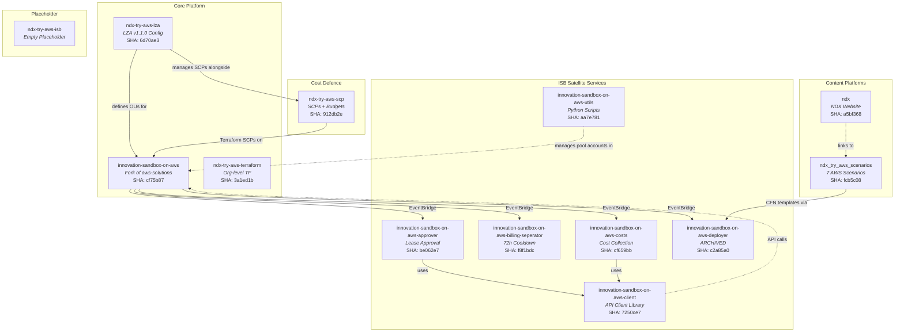

# Repository Inventory

> **Last Updated**: 2026-03-02
> **Source**: [co-cddo GitHub Organisation](https://github.com/co-cddo)
> **Total Repositories**: 13

## Executive Summary

The NDX (National Digital Exchange) Innovation Sandbox ecosystem spans 13 repositories under the `co-cddo` GitHub organisation. These repositories collectively implement a multi-account AWS sandbox platform for UK local government experimentation, comprising a forked upstream AWS Solution, custom satellite Lambda services, a Terraform-managed cost defence layer, Landing Zone Accelerator configuration, scenario content platforms, and supporting utilities.

---

## Summary Table

| Repository | Language | IaC | Archived | Last Push | Role |
|---|---|---|---|---|---|
| innovation-sandbox-on-aws | TypeScript | CDK + CFN | No | 2026-02-28 | Core ISB platform (fork) |
| innovation-sandbox-on-aws-approver | TypeScript | CDK | No | 2026-03-02 | Lease approval scoring |
| innovation-sandbox-on-aws-billing-seperator | TypeScript | CDK | No | 2026-03-02 | 72h billing cooldown |
| innovation-sandbox-on-aws-client | TypeScript | -- | No | 2026-02-28 | ISB API client library |
| innovation-sandbox-on-aws-costs | TypeScript | CDK | No | 2026-03-02 | Lease cost collection |
| innovation-sandbox-on-aws-deployer | TypeScript | CDK | **Yes** | 2026-02-28 | Scenario deployer (archived) |
| innovation-sandbox-on-aws-utils | Python | Scripts | No | 2026-03-02 | Pool account tooling |
| ndx | TypeScript | CDK + Eleventy | No | 2026-03-02 | NDX public website |
| ndx_try_aws_scenarios | TypeScript | CFN + Eleventy | No | 2026-03-02 | Scenario microsite + CFN |
| ndx-try-aws-isb | -- | -- | No | 2025-11-21 | Placeholder (empty) |
| ndx-try-aws-lza | YAML | LZA | No | 2025-12-19 | Landing Zone config |
| ndx-try-aws-scp | Terraform | Terraform | No | 2026-03-02 | Cost defence SCPs + budgets |
| ndx-try-aws-terraform | Terraform | Terraform | No | 2026-02-28 | Org-level Terraform glue |

---

## Detailed Repository Profiles

### 1. innovation-sandbox-on-aws

| Property | Value |
|---|---|
| **SHA** | `cf75b87` |
| **Origin** | Fork of [aws-solutions/innovation-sandbox-on-aws](https://github.com/aws-solutions/innovation-sandbox-on-aws) |
| **Description** | Core Innovation Sandbox on AWS solution -- manages temporary sandbox environments with automated security, governance, spend controls, and account recycling via a web UI |
| **Language** | TypeScript (98.6%) |
| **IaC** | AWS CDK synthesised to CloudFormation |
| **Workflows** | None |

**Key Files**: `source/infrastructure/lib/` (CDK stacks: AccountPool, IDC, Data, Compute, SandboxAccount), `source/frontend/` (Vite web UI), `source/lambdas/` (API handlers), `deployment/` (build scripts), `docs/openapi/` (API spec v1.1.4).

**Architecture**: Four CloudFormation stacks -- AccountPool (org management account, OU/SCP lifecycle), IDC (IAM Identity Center integration), Data (DynamoDB tables, AppConfig), Compute (Lambda functions, API Gateway, Step Functions, EventBridge, CloudFront frontend).

---

### 2. innovation-sandbox-on-aws-approver

| Property | Value |
|---|---|
| **SHA** | `be062e7` |
| **Description** | Score-based lease approval system using a 19-rule scoring engine |
| **Language** | TypeScript |
| **IaC** | AWS CDK (`cdk/`) |
| **Workflows** | `deploy.yml` |

**Purpose**: Listens for `LeaseRequested` EventBridge events and automatically approves or escalates lease requests. Implements domain verification for UK local government email addresses, AI-powered email analysis via Amazon Bedrock (Nova Micro), and Slack Workflow notifications for manual escalation. Targets 80%+ instant approval with less than 5% false negative rate.

**Key Files**: `src/` (Lambda handler), `cdk/` (CDK stack), `docs/runbooks/` (operational procedures).

---

### 3. innovation-sandbox-on-aws-billing-seperator

| Property | Value |
|---|---|
| **SHA** | `f8f1bdc` |
| **Description** | Quarantines sandbox accounts for 72 hours after cleanup to ensure billing separation |
| **Language** | TypeScript |
| **IaC** | AWS CDK (`lib/hub-stack.ts`, `lib/org-mgmt-stack.ts`) |
| **Workflows** | `deploy.yml`, `pr-check.yml` |

**Purpose**: Temporary workaround for billing attribution issues. Enforces a 72-hour hard cooldown on sandbox accounts via CloudTrail-triggered quarantine. Cross-account EventBridge routing from org management to hub account. Should be archived once ISB issue #70 is resolved.

---

### 4. innovation-sandbox-on-aws-client

| Property | Value |
|---|---|
| **SHA** | `7250ce7` |
| **Description** | Lightweight HTTP client for the ISB API |
| **Language** | TypeScript |
| **IaC** | None (library package) |
| **Workflows** | None |

**Purpose**: Provides typed methods for ISB API operations (leases, accounts, templates) with JWT authentication, token caching, and automatic renewal. Distributed as a tarball via GitHub Releases (`@co-cddo/isb-client`). Used by satellite services (approver, costs, billing-separator) to interact with the ISB API.

---

### 5. innovation-sandbox-on-aws-costs

| Property | Value |
|---|---|
| **SHA** | `cf659bb` |
| **Description** | Event-driven lease cost collection service |
| **Language** | TypeScript |
| **IaC** | CDK (`infra/`) |
| **Workflows** | `ci.yml`, `deploy.yml` |

**Purpose**: Triggered by `LeaseTerminated` EventBridge events. Waits 24 hours for billing data settlement, then queries Cost Explorer via cross-account role assumption in the org management account. Generates CSV cost reports stored in S3 with 3-year retention and 7-day presigned URL access. Uses JWT authentication for Lambda-to-Lambda API calls.

**Key Files**: `src/` (Lambda handlers), `infra/` (CDK stacks), `docs/api-contracts.md` (event schemas).

---

### 6. innovation-sandbox-on-aws-deployer

| Property | Value |
|---|---|
| **SHA** | `c2a85a0` |
| **Description** | Lambda that deploys CloudFormation templates to sandbox sub-accounts when leases are approved |
| **Language** | TypeScript |
| **IaC** | CDK (`infrastructure/`) |
| **Workflows** | `ci.yml` |
| **Status** | **ARCHIVED** -- superseded by ISB blueprint pattern |

**Purpose**: Event-driven deployment triggered on `LeaseApproved` events. Supported both CDK (auto-detection via `cdk.json`) and CloudFormation templates. Used sparse GitHub cloning for bandwidth efficiency. Now archived in favour of native ISB blueprint deployment.

---

### 7. innovation-sandbox-on-aws-utils

| Property | Value |
|---|---|
| **SHA** | `aa7e781` |
| **Description** | Python utilities for managing Innovation Sandbox pool accounts |
| **Language** | Python |
| **IaC** | None (scripts) |
| **Workflows** | CI workflow |

**Purpose**: Operational scripts for pool account lifecycle: `create_sandbox_pool_account.py` (sequential account creation via AWS Organizations), `assign_lease.py`, `terminate_lease.py`, `force_release_account.py`, `create_user.py`, `clean_console_state.py`. Uses boto3 with SSO profiles.

---

### 8. ndx

| Property | Value |
|---|---|
| **SHA** | `a5bf368` |
| **Description** | National Digital Exchange public website |
| **Language** | TypeScript / Eleventy v3.x |
| **IaC** | CDK (`infra/`) |
| **Workflows** | `ci.yaml`, `infra.yaml`, `test.yml`, `accessibility.yml`, `scorecard.yml` |

**Purpose**: Static GOV.UK Design System website describing the NDX initiative. Includes Discover section (news, events, case studies), cloud services catalogue, access request system, Cloud Maturity Model and Assessment Tool. WCAG 2.2 AA compliant with Pa11y, Playwright, Lighthouse CI testing.

**Key Files**: `src/` (templates, assets), `infra/` (CDK stack for CloudFront/S3 hosting), `docs/adr/` (Architecture Decision Records).

---

### 9. ndx_try_aws_scenarios

| Property | Value |
|---|---|
| **SHA** | `fcb5c08` |
| **Description** | Zero-cost AWS evaluation platform for UK local government |
| **Language** | TypeScript / Eleventy |
| **IaC** | CloudFormation (275+ templates in `cloudformation/scenarios/`) |
| **Workflows** | `build-deploy.yml`, `docker-build.yml` |

**Purpose**: Provides 7 pre-built scenarios for hands-on cloud exploration: Council Chatbot, Planning AI, FOI Redaction, Smart Car Park, Text to Speech, QuickSight Dashboard, LocalGov Drupal. Each scenario has one-click CloudFormation deployment and evidence pack generation (committee-ready PDFs with ROI analysis).

---

### 10. ndx-try-aws-isb

| Property | Value |
|---|---|
| **SHA** | `70bb7ec` |
| **Description** | Empty placeholder repository |
| **Status** | Contains only `.git/`, `.gitignore`, `LICENSE` |

---

### 11. ndx-try-aws-lza

| Property | Value |
|---|---|
| **SHA** | `6d70ae3` |
| **Description** | Landing Zone Accelerator v1.1.0 configuration for NDX:Try AWS |
| **Language** | YAML |
| **IaC** | AWS LZA |
| **Workflows** | None |

**Purpose**: Defines the entire AWS Organization structure, OU hierarchy, account definitions, IAM policies, network config, security settings, service control policies, and backup policies. Seven core YAML config files plus policy directories.

**Key Files**: `accounts-config.yaml`, `organization-config.yaml`, `security-config.yaml`, `global-config.yaml`, `iam-config.yaml`, `network-config.yaml`, `service-control-policies/`.

---

### 12. ndx-try-aws-scp

| Property | Value |
|---|---|
| **SHA** | `912db2e` |
| **Description** | 5-layer cost defence system for Innovation Sandbox |
| **Language** | Terraform + Python (Lambda) |
| **IaC** | Terraform |
| **Workflows** | `terraform.yaml` |

**Purpose**: Implements defence-in-depth cost protection: SCPs (service/compute restrictions), AWS Budgets (per-account daily/monthly limits), DynamoDB billing mode enforcement (auto-delete On-Demand tables). Three Terraform modules: `scp-manager`, `budgets-manager`, `dynamodb-billing-enforcer`.

**Key Files**: `environments/ndx-production/main.tf`, `modules/scp-manager/`, `modules/budgets-manager/`, `modules/dynamodb-billing-enforcer/`.

---

### 13. ndx-try-aws-terraform

| Property | Value |
|---|---|
| **SHA** | `3a1ed1b` |
| **Description** | General Terraform configuration for org-level resources |
| **Language** | Terraform |
| **IaC** | Terraform |
| **Workflows** | CI workflow |

**Purpose**: Minimal glue repository for org-level Terraform state management (S3 backend) and billing view configuration. Contains `main.tf`, `terraform.tf`.

---

---

## Repository Relationship Diagram

```mermaid
flowchart TB
    subgraph core["Core Platform"]
        ISB["innovation-sandbox-on-aws<br/><i>Fork of aws-solutions</i><br/>SHA: cf75b87"]
        LZA["ndx-try-aws-lza<br/><i>LZA v1.1.0 Config</i><br/>SHA: 6d70ae3"]
        TF["ndx-try-aws-terraform<br/><i>Org-level TF</i><br/>SHA: 3a1ed1b"]
    end

    subgraph satellites["ISB Satellite Services"]
        CLIENT["innovation-sandbox-on-aws-client<br/><i>API Client Library</i><br/>SHA: 7250ce7"]
        APPROVER["innovation-sandbox-on-aws-approver<br/><i>Lease Approval</i><br/>SHA: be062e7"]
        BILLING["innovation-sandbox-on-aws-billing-seperator<br/><i>72h Cooldown</i><br/>SHA: f8f1bdc"]
        COSTS["innovation-sandbox-on-aws-costs<br/><i>Cost Collection</i><br/>SHA: cf659bb"]
        DEPLOYER["innovation-sandbox-on-aws-deployer<br/><i>ARCHIVED</i><br/>SHA: c2a85a0"]
        UTILS["innovation-sandbox-on-aws-utils<br/><i>Python Scripts</i><br/>SHA: aa7e781"]
    end

    subgraph content["Content Platforms"]
        NDX["ndx<br/><i>NDX Website</i><br/>SHA: a5bf368"]
        SCENARIOS["ndx_try_aws_scenarios<br/><i>7 AWS Scenarios</i><br/>SHA: fcb5c08"]
    end

    subgraph costdefence["Cost Defence"]
        SCP["ndx-try-aws-scp<br/><i>SCPs + Budgets</i><br/>SHA: 912db2e"]
    end

    subgraph legacy["Placeholder"]
        ISB_PH["ndx-try-aws-isb<br/><i>Empty Placeholder</i>"]
    end

    ISB -->|EventBridge| APPROVER
    ISB -->|EventBridge| COSTS
    ISB -->|EventBridge| DEPLOYER
    ISB -->|EventBridge| BILLING
    CLIENT -.->|API calls| ISB
    APPROVER -->|uses| CLIENT
    COSTS -->|uses| CLIENT
    SCENARIOS -->|CFN templates via| DEPLOYER
    LZA -->|defines OUs for| ISB
    LZA -->|manages SCPs alongside| SCP
    SCP -->|Terraform SCPs on| ISB
    NDX -.->|links to| SCENARIOS
    UTILS -.->|manages pool accounts in| ISB
```

---

## Technology Distribution

| Technology | Count | Repositories |
|---|---|---|
| TypeScript CDK | 6 | ISB core, approver, billing-separator, costs, deployer, ndx |
| CloudFormation | 2 | ISB core, ndx_try_aws_scenarios |
| Terraform | 2 | ndx-try-aws-scp, ndx-try-aws-terraform |
| AWS LZA (YAML) | 1 | ndx-try-aws-lza |
| Python Scripts | 1 | innovation-sandbox-on-aws-utils |
| Eleventy SSG | 2 | ndx, ndx_try_aws_scenarios |

## Workflow Coverage

| Category | Repos |
|---|---|
| **CI/CD Pipelines** | approver, billing-separator, costs, deployer, ndx, ndx_try_aws_scenarios, ndx-try-aws-scp, ndx-try-aws-terraform, innovation-sandbox-on-aws-utils |
| **No Workflows** | innovation-sandbox-on-aws, innovation-sandbox-on-aws-client, ndx-try-aws-isb, ndx-try-aws-lza |

---

## Key Observations

1. **Extension Architecture**: CDDO extends ISB through external satellite Lambda services rather than modifying the upstream fork, preserving upgrade compatibility.

2. **Event-Driven Integration**: Satellites communicate with the core ISB via Amazon EventBridge events (`LeaseRequested`, `LeaseApproved`, `LeaseTerminated`).

3. **Shared Client Library**: The `@co-cddo/isb-client` package provides a typed API client used by multiple satellite services.

4. **Dual SCP Management**: SCPs are managed by both LZA (YAML) and Terraform (`ndx-try-aws-scp`), requiring careful coordination to avoid drift.

5. **Archived Repository**: `innovation-sandbox-on-aws-deployer` is archived (superseded by ISB blueprint pattern).

6. **Scale**: 110 pool accounts (pool-001 to pool-121, with gaps) across 117 total AWS accounts.

---

*Generated from source analysis on 2026-03-02. See [01-upstream-analysis.md](./01-upstream-analysis.md) for fork divergence details.*
