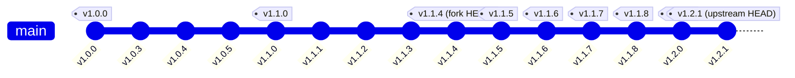
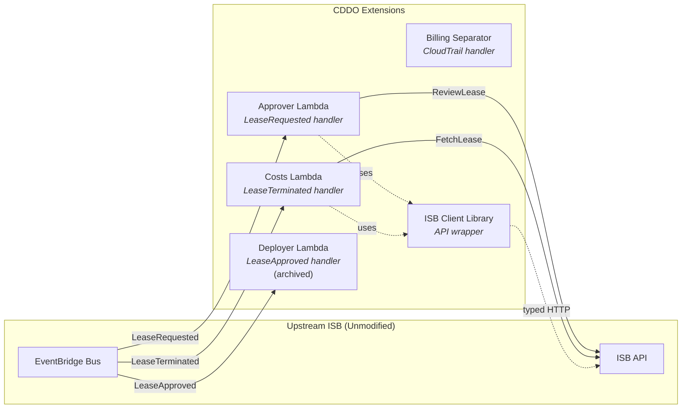

# Upstream Analysis: Innovation Sandbox on AWS

> **Last Updated**: 2026-03-06
> **Source**: [co-cddo/innovation-sandbox-on-aws](https://github.com/co-cddo/innovation-sandbox-on-aws)
> **Captured SHA**: `cf75b87`

## Executive Summary

The co-cddo fork of Innovation Sandbox on AWS is currently at version v1.1.4 (SHA `cf75b87`) and is **12 commits behind** the upstream `aws-solutions/innovation-sandbox-on-aws` (SHA `18dce92`). The fork contains no source code modifications -- CDDO uses an extension architecture with external satellite services rather than modifying the upstream codebase. The 12 missing upstream commits represent versions v1.1.5 through v1.2.1, including security patches, dependency upgrades, and a feature release (v1.2.0).

---

## Fork Status

| Property | Value |
|---|---|
| **Upstream URL** | `https://github.com/aws-solutions/innovation-sandbox-on-aws` |
| **Upstream SHA** | `18dce92` |
| **Fork SHA** | `cf75b87` |
| **Commits Ahead** | 0 |
| **Commits Behind** | 12 |
| **Checked At** | 2026-03-06 |
| **Fork Version** | v1.1.4 (2025-12-16) |
| **Upstream Version** | v1.2.1 |

### Divergence Diagram



---

## Missing Upstream Changes (v1.1.5 -- v1.2.1)

The 12 commits behind upstream represent six releases: three security patch releases (v1.1.5--v1.1.7), a further patch release (v1.1.8), a feature release (v1.2.0), and a follow-up patch (v1.2.1).

### v1.2.1

| Change | Detail |
|---|---|
| Release | New patch release -- changelog details need investigation |

This is the latest upstream tag (SHA `18dce92`, branch `release/v1.2.1`). The specific changes in this release need to be reviewed against the upstream release notes.

### v1.2.0

| Change | Detail |
|---|---|
| Release | Feature release (minor version bump) -- changelog details need investigation |

As a minor version bump, v1.2.0 likely contains new features or significant changes beyond security patches. This release should be carefully reviewed before merging to understand any new functionality, configuration changes, or breaking changes.

### v1.1.8

| Change | Detail |
|---|---|
| Release | Patch release -- changelog details need investigation |

### v1.1.7 (2026-01-20)

| Change | Detail |
|---|---|
| aws-nuke upgrade | Upgraded to v3.63.2, resolves SCP-protected log group deletion issues |

This is operationally significant -- the aws-nuke upgrade fixes an issue where account cleanup fails on SCP-protected CloudWatch log groups, which directly affects the NDX sandbox pool account recycling workflow.

### v1.1.6 (2026-01-12)

| Change | Detail |
|---|---|
| @remix-run/router | Security upgrade |
| glib2 | Security upgrade |
| libcap | Security upgrade |
| python3 | Security upgrade |

### v1.1.5 (2026-01-05)

| Change | Detail |
|---|---|
| qs library | Security vulnerability fix |

---

## Version History

| Version | Date | Type | Key Changes |
|---|---|---|---|
| **v1.2.1** | -- | Patch | Needs investigation |
| **v1.2.0** | -- | Feature | Minor version bump -- needs investigation |
| **v1.1.8** | -- | Patch | Needs investigation |
| **v1.1.7** | 2026-01-20 | Security | aws-nuke v3.63.2 (SCP log group fix) |
| **v1.1.6** | 2026-01-12 | Security | @remix-run/router, glib2, libcap, python3 |
| **v1.1.5** | 2026-01-05 | Security | qs library vulnerability |
| **v1.1.4** | 2025-12-16 | Security | aws-nuke CVE-2025-61729, CVE-2025-61727 |
| **v1.1.3** | 2025-12-10 | Security | jws, mdast-util-to-hast, curl, glib2, python3 |
| **v1.1.2** | 2025-11-20 | Security | js-yaml, glob |
| **v1.1.1** | 2025-11-14 | Bug fix + Security | Cost report group fix, libcap |
| **v1.1.0** | 2025-10-29 | Feature | Lease unfreezing, cost groups, lease assignment, account prioritisation, template visibility |
| **v1.0.5** | 2025-10-09 | Bug fix + Security | WAF SizeRestrictions fix, expat |
| **v1.0.4** | 2025-08-22 | Feature | CloudFront access logs, eu-central-2 AppConfig layer |
| **v1.0.0** | 2025-05-22 | Initial | Initial release |

---

## Fork Code Divergence

**Assessment: Zero source code divergence.**

The co-cddo fork is a clean fork with no modifications to upstream source code. Analysis confirms:

- No custom branches detected
- No source file modifications
- Configuration files (global-config.yaml, nuke-config.yaml) remain at upstream defaults
- Git remotes correctly configured with both `origin` (co-cddo) and `upstream` (aws-solutions)

### CDDO Extension Strategy

Rather than modifying the upstream codebase, CDDO extends ISB functionality through **external satellite services** that integrate via EventBridge:



This approach provides:

1. **Upstream compatibility** -- no merge conflicts when pulling upstream changes
2. **Independent release cycles** -- satellite services deploy independently
3. **Clean separation of concerns** -- UK-specific logic stays outside the upstream codebase
4. **Easy upgrade path** -- `git merge upstream/main` with no conflicts expected

---

## Global Configuration (Deployed)

The ISB deployment uses the following global configuration (from `source/infrastructure/lib/components/config/global-config.yaml`):

| Setting | Value |
|---|---|
| Maintenance Mode | `true` |
| Max Budget | $50 USD |
| Require Max Budget | `true` |
| Max Duration | 168 hours (7 days) |
| Require Max Duration | `true` |
| Max Leases Per User | 3 concurrent |
| Lease Record TTL | 30 days |
| Cleanup Failed Attempts to Quarantine | 3 |
| Cleanup Success Attempts to Finish | 2 |

---

## Upstream Solution Architecture

The upstream ISB solution consists of four CloudFormation stacks deployed across up to three AWS accounts:

| Stack | Account | Purpose |
|---|---|---|
| **AccountPool** | Org Management (955063685555) | OU lifecycle, SCP management, account registration |
| **IDC** | Org Management or delegated | IAM Identity Center groups, SSO application |
| **Data** | Hub (568672915267) | DynamoDB tables, AppConfig configuration profiles |
| **Compute** | Hub (568672915267) | Lambda functions, API Gateway, Step Functions, EventBridge, CloudFront |

### Key AWS Services Used

- **Frontend**: CloudFront + S3 (Vite web application)
- **API**: API Gateway + WAF + Lambda (RBAC-based REST API)
- **Data**: DynamoDB (accounts, leases, templates) + AppConfig (global/nuke/reporting configs)
- **Events**: EventBridge (lifecycle events) + SES (email notifications)
- **Cleanup**: Step Functions + CodeBuild + aws-nuke Docker image
- **Auth**: IAM Identity Center with SAML 2.0

---

## Upgrade Recommendation

The fork should be updated to v1.2.1 to receive:

1. **New features and improvements** (v1.2.0, v1.2.1) -- v1.2.0 is a minor version bump likely containing new features or significant changes. Both releases need changelog investigation before merging to understand any new functionality, configuration changes, or potential breaking changes.

2. **aws-nuke v3.63.2** (v1.1.7) -- fixes SCP-protected log group deletion failures during account cleanup. This directly impacts the NDX pool account recycling workflow and may be the cause of some accounts being stuck in the Quarantine OU.

3. **Patch release** (v1.1.8) -- specific changes need investigation.

4. **Security patches** (v1.1.5, v1.1.6) -- qs library vulnerability, @remix-run/router, glib2, libcap, python3 upgrades.

**Before upgrading**, the v1.2.0 release notes should be reviewed to assess whether new features require configuration changes or affect the CDDO satellite services (EventBridge event schemas, API changes, etc.).

The upgrade should be low-risk given zero code divergence. The recommended approach:

```bash
cd repos/innovation-sandbox-on-aws
git fetch upstream
git merge upstream/main
# Expected: fast-forward merge, no conflicts
```

---

## References

- [AWS Solutions Library -- Innovation Sandbox](https://aws.amazon.com/solutions/implementations/innovation-sandbox-on-aws/)
- [Implementation Guide](https://docs.aws.amazon.com/solutions/latest/innovation-sandbox-on-aws/solution-overview.html)
- [Upstream GitHub](https://github.com/aws-solutions/innovation-sandbox-on-aws)
- [Upstream Releases](https://github.com/aws-solutions/innovation-sandbox-on-aws/releases)
- [co-cddo Fork](https://github.com/co-cddo/innovation-sandbox-on-aws)

---

*Generated from source analysis on 2026-03-06. See [00-repo-inventory.md](./00-repo-inventory.md) for full repository inventory.*
