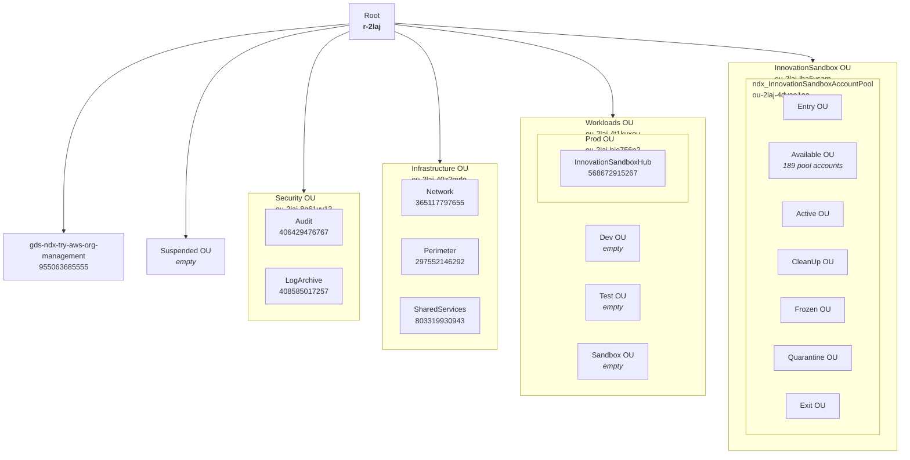
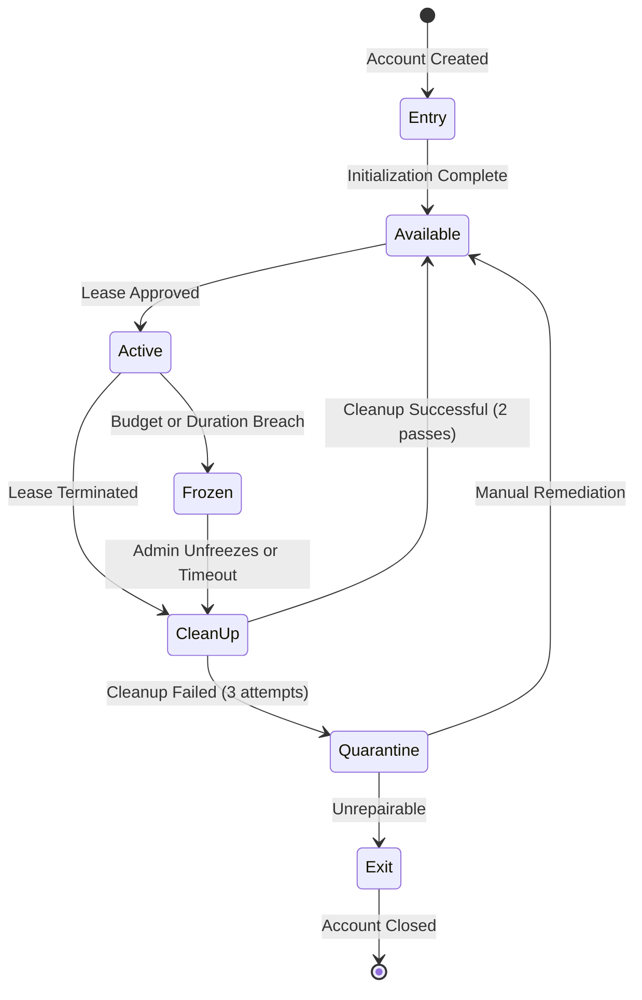
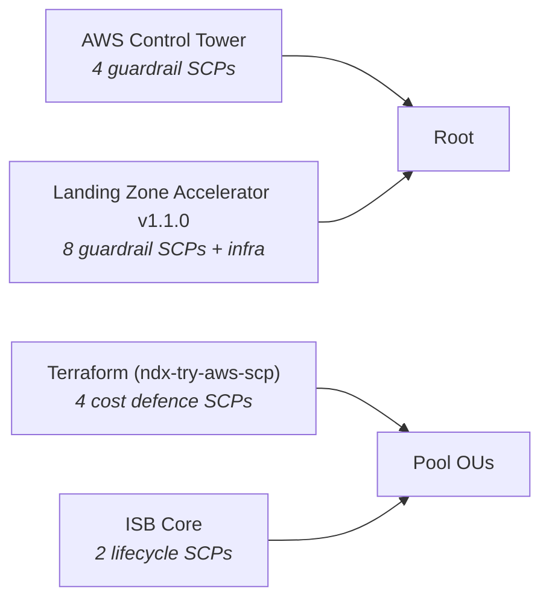

# AWS Organization Structure

> **Last Updated**: 2026-03-06
> **Source**: [AWS Organizations API](https://console.aws.amazon.com/organizations/) via `.state/discovered-accounts.json`, `.state/org-ous.json`, `.state/org-roots.json`
> **Captured SHA**: N/A (live AWS state)

## Executive Summary

The NDX:Try AWS infrastructure operates within a single AWS Organization (`o-4g8nrlnr9s`) managed by CDDO under the Department for Science, Innovation and Technology (DSIT). The organization contains 247 accounts (7 infrastructure + 240 sandbox pool), governed by AWS Control Tower and Landing Zone Accelerator v1.1.0. The OU hierarchy implements a standard landing zone pattern with a dedicated Innovation Sandbox OU containing a 7-stage account lifecycle pool. Account pool health is monitored via CloudWatch custom metrics published by the [OU metrics stop-gap service](./25-ou-metrics.md).

---

## Organization Overview

| Property | Value |
|---|---|
| Organization ID | `o-4g8nrlnr9s` |
| Feature Set | ALL |
| Root ID | `r-2laj` |
| Management Account | `955063685555` (gds-ndx-try-aws-org-management) |
| Management Email | `ndx-try-provider+gds-ndx-try-aws@dsit.gov.uk` |
| Total Accounts | **247** |
| Infrastructure Accounts | 7 |
| Pool Accounts | 240 |

### Enabled Policy Types

| Policy Type | Status |
|---|---|
| SERVICE_CONTROL_POLICY | Enabled |
| RESOURCE_CONTROL_POLICY | Enabled |
| TAG_POLICY | Enabled |
| BACKUP_POLICY | Enabled |
| AISERVICES_OPT_OUT_POLICY | Enabled |
| DECLARATIVE_POLICY_EC2 | Enabled |
| S3_POLICY | Enabled |

---

## Organization Hierarchy


```mermaid
flowchart TB
    root["Root<br/><b>r-2laj</b>"]

    root --> mgmt["gds-ndx-try-aws-org-management<br/>955063685555"]
    root --> security_ou
    root --> infra_ou
    root --> workloads_ou
    root --> isb_ou
    root --> suspended_ou

    subgraph security_ou["Security OU<br/>ou-2laj-8q61vv13"]
        audit["Audit<br/>406429476767"]
        logarchive["LogArchive<br/>408585017257"]
    end

    subgraph infra_ou["Infrastructure OU<br/>ou-2laj-40z2mrlg"]
        network["Network<br/>365117797655"]
        perimeter["Perimeter<br/>297552146292"]
        shared["SharedServices<br/>803319930943"]
    end

    subgraph workloads_ou["Workloads OU<br/>ou-2laj-4t1kuxou"]
        prod_ou
        dev_ou["Dev OU<br/><i>empty</i>"]
        test_ou["Test OU<br/><i>empty</i>"]
        sandbox_ou["Sandbox OU<br/><i>empty</i>"]
    end

    subgraph prod_ou["Prod OU<br/>ou-2laj-bje756n2"]
        hub["InnovationSandboxHub<br/>568672915267"]
    end

    subgraph isb_ou["InnovationSandbox OU<br/>ou-2laj-lha5vsam"]
        pool_ou
    end

    subgraph pool_ou["ndx_InnovationSandboxAccountPool<br/>ou-2laj-4dyae1oa"]
        entry["Entry OU"]
        available["Available OU<br/><i>189 pool accounts</i>"]
        active["Active OU"]
        cleanup["CleanUp OU"]
        frozen["Frozen OU"]
        quarantine["Quarantine OU"]
        exit_ou["Exit OU"]
    end

    suspended_ou["Suspended OU<br/><i>empty</i>"]
```

---

## Infrastructure Accounts

| Account Name | Account ID | Email | OU | Purpose |
|---|---|---|---|---|
| gds-ndx-try-aws-org-management | 955063685555 | ndx-try-provider+gds-ndx-try-aws@dsit.gov.uk | Root | Organization root, Control Tower, LZA pipeline |
| Audit | 406429476767 | ndx-try-provider+gds-ndx-try-aws-audit@dsit.gov.uk | Security | Security Hub, Config aggregation |
| LogArchive | 408585017257 | ndx-try-provider+gds-ndx-try-aws-log-archive@dsit.gov.uk | Security | Centralized CloudWatch/S3 log storage |
| Network | 365117797655 | ndx-try-provider+gds-ndx-try-aws-network@dsit.gov.uk | Infrastructure | Transit Gateway, Route 53, VPC routing |
| Perimeter | 297552146292 | ndx-try-provider+gds-ndx-try-aws-perimeter@dsit.gov.uk | Infrastructure | WAF, Shield, edge security |
| SharedServices | 803319930943 | ndx-try-provider+gds-ndx-try-aws-shared-services@dsit.gov.uk | Infrastructure | ECR, shared tooling |
| InnovationSandboxHub | 568672915267 | ndx-try-provider+gds-ndx-try-aws-isb-hub@dsit.gov.uk | Workloads/Prod | ISB control plane |

---

## Pool Accounts (240 Total)

The sandbox pool contains 240 accounts. All accounts follow the email pattern `ndx-try-provider+gds-ndx-try-aws-pool-NNN@dsit.gov.uk`.

### Pool Account Distribution by OU (Live State)

| OU | Account Count | Status |
|---|---|---|
| Available | 189 | Ready to be leased |
| Active | 3 | Currently leased to users |
| Frozen | 0 | Budget/duration breach |
| CleanUp | 0 | Resources being destroyed |
| Quarantine | 46 | Cleanup failed / billing cooldown |
| Entry | 0 | Being initialized |
| Exit | 0 | Being removed |

### Account Lifecycle State Machine

Pool accounts move through a 7-stage lifecycle managed by ISB via OU placement:


```mermaid
stateDiagram-v2
    [*] --> Entry: Account Created
    Entry --> Available: Initialization Complete
    Available --> Active: Lease Approved
    Active --> Frozen: Budget or Duration Breach
    Active --> CleanUp: Lease Terminated
    Frozen --> CleanUp: Admin Unfreezes or Timeout
    CleanUp --> Available: Cleanup Successful (2 passes)
    CleanUp --> Quarantine: Cleanup Failed (3 attempts)
    Quarantine --> Available: Manual Remediation
    Quarantine --> Exit: Unrepairable
    Exit --> [*]: Account Closed
```

| OU | OU ID | Purpose | SCP Behaviour |
|---|---|---|---|
| **Entry** | ou-2laj-2by9v0sr | New accounts awaiting LZA initialization | LZA quarantine SCP blocks all non-LZA actions |
| **Available** | ou-2laj-oihxgbtr | Accounts ready for lease assignment | Write-protected (read-only) |
| **Active** | ou-2laj-sre4rnjs | Accounts with active leases | Cost avoidance SCPs applied |
| **CleanUp** | ou-2laj-x3o8lbk8 | Accounts being cleaned by aws-nuke | ISB control plane access only |
| **Frozen** | ou-2laj-jpffue7g | Budget/duration breach -- frozen | Baseline SCPs only |
| **Quarantine** | ou-2laj-mmagoake | Failed cleanup or billing cooldown | Write-protected (read-only) |
| **Exit** | ou-2laj-s1t02mrz | Accounts pending removal | Locked down |

---

## OU Hierarchy Detail

### Root-Level OUs

| OU Name | OU ID | Child OUs | Direct Accounts |
|---|---|---|---|
| Security | ou-2laj-8q61vv13 | None | 2 (Audit, LogArchive) |
| Infrastructure | ou-2laj-40z2mrlg | None | 3 (Network, Perimeter, SharedServices) |
| Workloads | ou-2laj-4t1kuxou | Prod, Dev, Test, Sandbox | 0 |
| InnovationSandbox | ou-2laj-lha5vsam | ndx_InnovationSandboxAccountPool | 0 |
| Suspended | ou-2laj-vn184pt1 | None | 0 |

### Workloads Sub-OUs

| OU Name | OU ID | Accounts |
|---|---|---|
| Prod | ou-2laj-bje756n2 | 1 (InnovationSandboxHub) |
| Dev | ou-2laj-gjg1p2n2 | 0 (empty) |
| Test | ou-2laj-tkyylaag | 0 (empty) |
| Sandbox | ou-2laj-zei1pn6x | 0 (empty) |

### Innovation Sandbox Pool Sub-OUs

| OU Name | OU ID | Accounts |
|---|---|---|
| ndx_InnovationSandboxAccountPool | ou-2laj-4dyae1oa | 0 (parent only) |
| Entry | ou-2laj-2by9v0sr | 0 |
| Available | ou-2laj-oihxgbtr | 189 |
| Active | ou-2laj-sre4rnjs | 3 |
| CleanUp | ou-2laj-x3o8lbk8 | 0 |
| Frozen | ou-2laj-jpffue7g | 0 |
| Quarantine | ou-2laj-mmagoake | 46 |
| Exit | ou-2laj-s1t02mrz | 0 |

**Note on current state**: At the time of discovery (2026-03-06), 3 accounts have active leases and 46 accounts are in Quarantine (likely from billing separation cooldown periods). The pool has grown significantly from 110 to 240 accounts since the initial capture, indicating increased provisioning for anticipated demand.

---

## Email Naming Convention

All accounts use email sub-addressing under a single DSIT domain:

```
ndx-try-provider+gds-ndx-try-aws-<purpose>@dsit.gov.uk
```

| Purpose Suffix | Account |
|---|---|
| (none) | Org management |
| audit | Audit |
| log-archive | LogArchive |
| network | Network |
| perimeter | Perimeter |
| shared-services | SharedServices |
| isb-hub | InnovationSandboxHub |
| pool-NNN | Pool accounts (001-240+) |

---

## Governance Stack

The organization is managed by three complementary governance systems:


```mermaid
flowchart LR
    CT["AWS Control Tower<br/><i>4 guardrail SCPs</i>"]
    LZA["Landing Zone Accelerator v1.1.0<br/><i>8 guardrail SCPs + infra</i>"]
    TF["Terraform (ndx-try-aws-scp)<br/><i>4 cost defence SCPs</i>"]
    ISB["ISB Core<br/><i>2 lifecycle SCPs</i>"]

    CT --> root["Root"]
    LZA --> root
    TF --> pool["Pool OUs"]
    ISB --> pool
```

See [05-service-control-policies.md](./05-service-control-policies.md) for complete SCP analysis.

---

## Related Documents

- [03-hub-account-resources.md](./03-hub-account-resources.md) -- Hub account resource inventory
- [04-cross-account-trust.md](./04-cross-account-trust.md) -- IAM trust relationships
- [05-service-control-policies.md](./05-service-control-policies.md) -- SCP inventory and mappings
- [00-repo-inventory.md](./00-repo-inventory.md) -- Repository inventory

---

*Generated from AWS Organizations state captured 2026-03-06. See [00-repo-inventory.md](./00-repo-inventory.md) for full inventory.*
