# AWS Organization Structure

**Document Version:** 1.0
**Date:** 2026-02-03
**Organization ID:** o-4g8nrlnr9s

---

## Executive Summary

The NDX:Try AWS infrastructure is deployed within a single AWS Organization managed by the Central Digital & Data Office (CDDO). The organization uses AWS Landing Zone Accelerator (LZA) with AWS Control Tower for governance, implementing a multi-account strategy with dedicated accounts for security, infrastructure, workloads, and Innovation Sandbox pool management.

---

## Organization Overview

| Property | Value |
|----------|-------|
| Organization ID | `o-4g8nrlnr9s` |
| Feature Set | ALL (all features enabled) |
| Root ID | `r-2laj` |
| Management Account ID | `955063685555` |
| Management Account Email | `ndx-try-provider+gds-ndx-try-aws@dsit.gov.uk` |

### Enabled Policy Types

| Policy Type | Status |
|-------------|--------|
| SERVICE_CONTROL_POLICY | ✅ Enabled |
| RESOURCE_CONTROL_POLICY | ✅ Enabled |
| TAG_POLICY | ✅ Enabled |
| BACKUP_POLICY | ✅ Enabled |
| AISERVICES_OPT_OUT_POLICY | ✅ Enabled |
| DECLARATIVE_POLICY_EC2 | ✅ Enabled |
| S3_POLICY | ✅ Enabled |

---

## Organization Hierarchy

```mermaid
flowchart TB
    subgraph root["Root (r-2laj)"]
        direction TB
        mgmt["🏛️ gds-ndx-try-aws-org-management<br/>955063685555"]

        subgraph security["Security OU"]
            audit["🔒 Audit<br/>406429476767"]
            logarchive["📁 LogArchive<br/>408585017257"]
        end

        subgraph infra["Infrastructure OU"]
            network["🌐 Network<br/>365117797655"]
            perimeter["🛡️ Perimeter<br/>297552146292"]
            shared["🔧 SharedServices<br/>803319930943"]
        end

        subgraph workloads["Workloads OU"]
            subgraph prod["Prod OU"]
                hub["⭐ InnovationSandboxHub<br/>568672915267"]
            end
            dev["Dev OU (empty)"]
            test["Test OU (empty)"]
            sandbox["Sandbox OU (empty)"]
        end

        subgraph isb["InnovationSandbox OU"]
            subgraph pool["ndx_InnovationSandboxAccountPool OU"]
                entry["Entry OU (empty)"]
                available["🟢 Available OU"]
                active["🔵 Active OU (empty)"]
                cleanup["🔴 CleanUp OU (empty)"]
                frozen["❄️ Frozen OU (empty)"]
                quarantine["⚠️ Quarantine OU"]
                exit["Exit OU (empty)"]
            end
        end

        suspended["Suspended OU (empty)"]
    end

    available --> pool001["pool-003<br/>340601547583"]
    available --> pool002["pool-004<br/>982203978489"]
    available --> pool003["pool-005<br/>680464296760"]
    available --> pool004["pool-006<br/>404584456509"]
    available --> pool005["pool-009<br/>848960887562"]

    quarantine --> q1["pool-001<br/>449788867583"]
    quarantine --> q2["pool-002<br/>831494785845"]
    quarantine --> q3["pool-007<br/>417845783913"]
    quarantine --> q4["pool-008<br/>221792773038"]
```



---

## Account Inventory

### Summary by OU

| OU | Account Count | Purpose |
|----|---------------|---------|
| Root (no OU) | 1 | Organization Management |
| Security | 2 | Audit & Log Archive |
| Infrastructure | 3 | Network, Perimeter, Shared Services |
| Workloads/Prod | 1 | Innovation Sandbox Hub |
| InnovationSandbox/Available | 5 | Pool accounts ready for leases |
| InnovationSandbox/Quarantine | 4 | Pool accounts in cooldown/quarantine |
| **Total** | **16** | |

### Complete Account List

| Account Name | Account ID | Email | OU | Status |
|--------------|------------|-------|----|----|
| gds-ndx-try-aws-org-management | 955063685555 | ndx-try-provider+gds-ndx-try-aws@dsit.gov.uk | Root | Management Account |
| Audit | 406429476767 | ndx-try-provider+gds-ndx-try-aws-audit@dsit.gov.uk | Security | Security audit & compliance |
| LogArchive | 408585017257 | ndx-try-provider+gds-ndx-try-aws-log-archive@dsit.gov.uk | Security | Centralized logging |
| Network | 365117797655 | ndx-try-provider+gds-ndx-try-aws-network@dsit.gov.uk | Infrastructure | Network services |
| Perimeter | 297552146292 | ndx-try-provider+gds-ndx-try-aws-perimeter@dsit.gov.uk | Infrastructure | Edge/perimeter security |
| SharedServices | 803319930943 | ndx-try-provider+gds-ndx-try-aws-shared-services@dsit.gov.uk | Infrastructure | Shared tooling |
| InnovationSandboxHub | 568672915267 | ndx-try-provider+gds-ndx-try-aws-isb-hub@dsit.gov.uk | Workloads/Prod | ISB control plane |
| pool-001 | 449788867583 | ndx-try-provider+gds-ndx-try-aws-pool-001@dsit.gov.uk | ISB/Quarantine | Sandbox pool account |
| pool-002 | 831494785845 | ndx-try-provider+gds-ndx-try-aws-pool-002@dsit.gov.uk | ISB/Quarantine | Sandbox pool account |
| pool-003 | 340601547583 | ndx-try-provider+gds-ndx-try-aws-pool-003@dsit.gov.uk | ISB/Available | Sandbox pool account |
| pool-004 | 982203978489 | ndx-try-provider+gds-ndx-try-aws-pool-004@dsit.gov.uk | ISB/Available | Sandbox pool account |
| pool-005 | 680464296760 | ndx-try-provider+gds-ndx-try-aws-pool-005@dsit.gov.uk | ISB/Available | Sandbox pool account |
| pool-006 | 404584456509 | ndx-try-provider+gds-ndx-try-aws-pool-006@dsit.gov.uk | ISB/Available | Sandbox pool account |
| pool-007 | 417845783913 | ndx-try-provider+gds-ndx-try-aws-pool-007@dsit.gov.uk | ISB/Quarantine | Sandbox pool account |
| pool-008 | 221792773038 | ndx-try-provider+gds-ndx-try-aws-pool-008@dsit.gov.uk | ISB/Quarantine | Sandbox pool account |
| pool-009 | 848960887562 | ndx-try-provider+gds-ndx-try-aws-pool-009@dsit.gov.uk | ISB/Available | Sandbox pool account |

### Email Naming Convention

All accounts follow the pattern:
```
ndx-try-provider+gds-ndx-try-aws-<purpose>@dsit.gov.uk
```

This uses email sub-addressing (`+` notation) for account separation while maintaining a single domain.

---

## OU Structure Detail

### Root Level OUs

| OU Name | OU ID | Purpose |
|---------|-------|---------|
| Security | ou-2laj-8q61vv13 | Security & compliance services |
| Infrastructure | ou-2laj-40z2mrlg | Core infrastructure services |
| Workloads | ou-2laj-4t1kuxou | Application workloads |
| InnovationSandbox | ou-2laj-lha5vsam | ISB account management |
| Suspended | ou-2laj-vn184pt1 | Suspended/archived accounts |

### Workloads Sub-OUs

| OU Name | OU ID | Purpose |
|---------|-------|---------|
| Prod | ou-2laj-bje756n2 | Production workloads |
| Dev | ou-2laj-gjg1p2n2 | Development (empty) |
| Test | ou-2laj-tkyylaag | Testing (empty) |
| Sandbox | ou-2laj-zei1pn6x | General sandbox (empty) |

### Innovation Sandbox Account Pool OUs

The Innovation Sandbox uses a nested OU structure for account lifecycle management:

| OU Name | OU ID | Purpose | Current Accounts |
|---------|-------|---------|------------------|
| ndx_InnovationSandboxAccountPool | ou-2laj-4dyae1oa | Parent OU for pool accounts | 0 |
| Entry | ou-2laj-2by9v0sr | New accounts awaiting initialization | 0 |
| Available | ou-2laj-oihxgbtr | Accounts ready for lease assignment | 5 |
| Active | ou-2laj-sre4rnjs | Accounts with active leases | 0 |
| CleanUp | ou-2laj-x3o8lbk8 | Accounts being cleaned (AWS Nuke) | 0 |
| Frozen | ou-2laj-jpffue7g | Accounts frozen (budget/duration breach) | 0 |
| Quarantine | ou-2laj-mmagoake | Failed cleanup or billing cooldown | 4 |
| Exit | ou-2laj-s1t02mrz | Accounts pending removal | 0 |

### Account Lifecycle State Diagram


---

## Account Purpose Details

### Management Account (955063685555)
- **Role**: Organization root account
- **Services**: AWS Organizations, AWS Control Tower, LZA Pipeline
- **Access**: Highly restricted, break-glass only

### Security Accounts

#### Audit (406429476767)
- **Role**: Security Hub aggregation, Config aggregation
- **Services**: AWS Security Hub, AWS Config
- **Access**: Security team read-only

#### LogArchive (408585017257)
- **Role**: Centralized log storage
- **Services**: CloudWatch Logs, S3 log buckets
- **Access**: Log retention compliance

### Infrastructure Accounts

#### Network (365117797655)
- **Role**: Transit Gateway, VPC routing
- **Services**: Transit Gateway, Route 53
- **Access**: Network operations

#### Perimeter (297552146292)
- **Role**: Edge security, WAF
- **Services**: AWS WAF, Shield
- **Access**: Security perimeter management

#### SharedServices (803319930943)
- **Role**: Shared tooling and services
- **Services**: ECR, shared Lambda layers
- **Access**: Platform team

### Innovation Sandbox Hub (568672915267)
- **Role**: ISB control plane
- **Services**: Lambda, DynamoDB, API Gateway, Step Functions
- **Access**: ISB operators
- **Key Resources**: See [03-hub-account-resources.md](./03-hub-account-resources.md)

### Pool Accounts (pool-001 through pool-009)
- **Role**: Temporary sandbox environments
- **Services**: User workloads (within SCP limits)
- **Access**: Lease holders only
- **Lifecycle**: Managed by ISB automation

---

## Related Documents

- [03-hub-account-resources.md](./03-hub-account-resources.md) - Hub account resource inventory
- [04-cross-account-trust.md](./04-cross-account-trust.md) - IAM trust relationships
- [05-service-control-policies.md](./05-service-control-policies.md) - SCP inventory and mappings
- [40-lza-configuration.md](./40-lza-configuration.md) - LZA YAML configuration analysis

---

## Issues Discovered

1. **4 pool accounts in Quarantine**: pool-001, pool-002, pool-007, pool-008 are all in the Quarantine OU, suggesting either cleanup failures or the 72-hour billing cooldown is in effect.

2. **No accounts in Active OU**: At time of discovery, no leases were active.

3. **Empty environment OUs**: Dev, Test, and Sandbox OUs under Workloads are empty, suggesting all workloads are in Prod.
