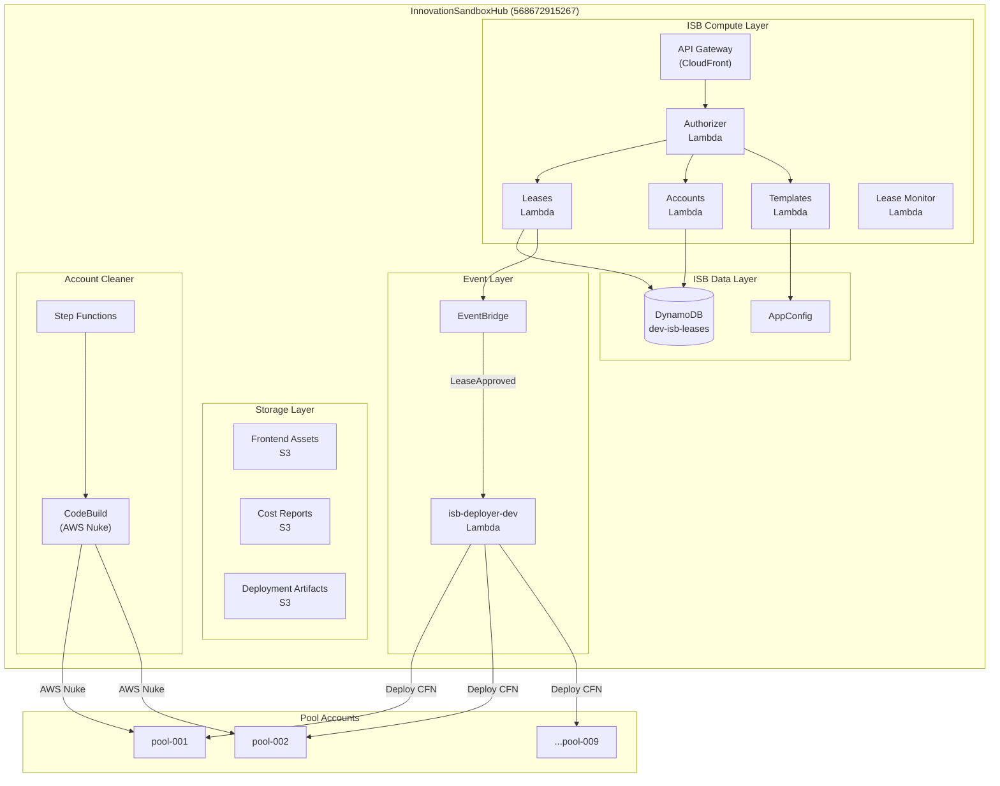

# Hub Account Resources

**Document Version:** 1.0
**Date:** 2026-02-03
**Account ID:** 568672915267
**Account Name:** InnovationSandboxHub
**Region:** eu-west-2 (London)

---

## Executive Summary

The Innovation Sandbox Hub account (568672915267) hosts the control plane for the entire ISB ecosystem. This account contains the core ISB Lambda functions, DynamoDB tables, API Gateway, and EventBridge rules that orchestrate the sandbox lease lifecycle. It also hosts the deployer satellite component and various LZA/Control Tower resources.

---

## Resource Inventory

### CloudFormation Stacks

| Stack Name | Purpose | Status |
|------------|---------|--------|
| **isb-deployer-dev** | ISB Deployer Lambda infrastructure | Active |
| **isb-deployer-bootstrap-dev** | CDK bootstrap for deployer | Active |
| **ndx-try-isb-compute-*** | Core ISB compute resources (multiple) | LZA managed |
| **AWSAccelerator-*** | LZA managed infrastructure | LZA managed |
| **StackSet-AWSControlTowerBP-*** | Control Tower baselines | Control Tower managed |

#### ISB-Specific Stacks

```
isb-deployer-dev
isb-deployer-bootstrap-dev
```

#### LZA Stacks (AWSAccelerator-*)

```
AWSAccelerator-NetworkVpcStack-568672915267-eu-west-2
AWSAccelerator-CustomizationsStack-568672915267-eu-west-2
AWSAccelerator-ResourcePolicyEnforcementStack-568672915267-eu-west-2
AWSAccelerator-NetworkAssociationsGwlbStack-568672915267-eu-west-2
AWSAccelerator-NetworkAssociationsStack-568672915267-eu-west-2
AWSAccelerator-SecurityResourcesStack-568672915267-eu-west-2
AWSAccelerator-NetworkVpcDnsStack-568672915267-eu-west-2
AWSAccelerator-NetworkVpcEndpointsStack-568672915267-eu-west-2
AWSAccelerator-SecurityStack-568672915267-eu-west-2
AWSAccelerator-OperationsStack-568672915267-eu-west-2
AWSAccelerator-NetworkPrepStack-568672915267-eu-west-2
AWSAccelerator-LoggingStack-568672915267-eu-west-2
AWSAccelerator-DependenciesStack-568672915267-eu-west-2
AWSAccelerator-KeyStack-568672915267-eu-west-2
AWSAccelerator-CDKToolkit
```

---

### Lambda Functions

| Function Name | Runtime | Purpose |
|---------------|---------|---------|
| **isb-deployer-dev** | nodejs20.x | Deploys CloudFormation to sandbox accounts |
| AWSAccelerator-SecurityRe-* | nodejs20.x | Security Hub event logging |
| AWSAccelerator-LoggingSta-* | nodejs20.x | CloudWatch log subscriptions |
| AWSAccelerator-Operations-* | nodejs20.x | SSM parameter operations |
| AWSAccelerator-SecuritySt-* | nodejs20.x | GuardDuty, SecurityHub, Macie setup |
| aws-controltower-NotificationForwarder | python3.13 | Control Tower notifications |

#### ISB-Related Lambda Functions (from ndx-try-isb-compute stack)

Based on IAM roles discovered, the following Lambda functions exist:

| Function Type | Role Pattern | Purpose |
|---------------|-------------|---------|
| Accounts Lambda | AccountsLambdaFunction | Account management API |
| Leases Lambda | LeasesLambdaFunction | Lease CRUD operations |
| Lease Templates Lambda | LeaseTemplatesLambdaFunction | Template management |
| Lease Monitoring | LeaseMonitoringFunction | Budget/duration checks |
| Authorizer | AuthorizerLambdaFunction | API Gateway authorization |
| Configurations | ConfigurationsLambdaFunction | AppConfig management |
| Cost Reporting | CostReportingLambdaFunction | Cost tracking |
| Group Cost Reporting | GroupCostReportingLambdaFunction | Department cost reports |
| Email Notification | EmailNotificationFunction | SES notifications |
| SSO Handler | SsoHandlerFunction | IAM Identity Center ops |
| Account Cleaner | AccountCleanerInitializeCleanup | AWS Nuke orchestration |
| Account Drift Monitoring | AccountDriftMonitoring | Detect config drift |
| Log Archiving | LogArchivingFunction | Move logs to S3 |
| JWT Secret Rotator | JwtSecretRotatorFunction | JWT key rotation |
| Deployment UUID | DeploymentUUIDLambdaFunction | Solution tracking |
| Anonymized Metrics | AnonymizedMetricsReporting | AWS telemetry |

---

### DynamoDB Tables

| Table Name | Purpose | Key Schema |
|------------|---------|------------|
| **dev-isb-leases** | Stores lease data | (needs schema inspection) |

Note: Additional tables may exist but were not returned in the list-tables call. The core ISB solution typically uses multiple tables for accounts, configurations, and leases.

---

### EventBridge Rules

| Rule Name | State | Purpose |
|-----------|-------|---------|
| **isb-deployer-lease-approved-dev** | ENABLED | Triggers deployer on LeaseApproved events |
| AWSAccelerator-LoggingSta-NewCloudWatchLogsCreateEv-* | ENABLED | Log subscription |
| AWSAccelerator-SecurityRe-SecurityHubEventsLogSecur-* | ENABLED | Security Hub events |
| AWSControlTowerManagedRule | ENABLED | Control Tower governance |
| aws-controltower-ConfigComplianceChangeEventRule | ENABLED | Config compliance |

### Event Pattern: isb-deployer-lease-approved-dev

This rule listens for `LeaseApproved` events and triggers the deployer Lambda to provision CloudFormation stacks in the newly assigned sandbox account.

---

### S3 Buckets

| Bucket Name | Purpose | Created |
|-------------|---------|---------|
| **approver-domain-list-568672915267** | Domain whitelist for approver | 2025-12-22 |
| **dev-isb-deployer-artifacts** | CDK/CFN templates for deployment | 2025-12-04 |
| **isb-deployer-artifacts-568672915267** | Deployment artifacts | 2025-12-04 |
| **isb-lease-costs-568672915267-us-west-2** | Lease cost reports | 2026-02-03 |
| **ndx-static-prod** | NDX website static assets | 2025-11-21 |
| **ndx-try-isb-compute-cloudfrontuiapiisbfrontendbuck-*** | ISB frontend assets | 2025-11-06 |
| **ndx-try-isb-compute-cloudfrontuiapiisbfrontendacce-*** | CloudFront access logs | 2025-11-06 |
| **ndx-try-isb-compute-groupcostreportinglambdagroupc-*** | Group cost reports | 2025-11-06 |
| **ndx-try-isb-compute-logarchivingisblogsarchivec37d-*** | ISB log archive | 2025-11-06 |
| **ndx-try-screenshots-us-east-1** | Scenario screenshots | 2025-12-29 |
| **aws-accelerator-s3-access-logs-568672915267-*** | LZA access logs | Various |
| **cdk-hnb659fds-assets-568672915267-*** | CDK assets | Various |

---

### SNS Topics

| Topic ARN | Purpose |
|-----------|---------|
| arn:aws:sns:eu-west-2:568672915267:aws-controltower-SecurityNotifications | Control Tower security alerts |

---

### SQS Queues

| Queue URL | Purpose |
|-----------|---------|
| .../AWSAccelerator-LoggingStack-568-NewCloudWatchLogsCreateEventLo-*.fifo | CloudWatch log events (FIFO) |
| .../AWSAccelerator-LoggingStack-56867-NewCloudWatchLogsCreateEventLambd-* | Log event processing |

---

### API Gateway

No REST APIs were found in the Hub account in eu-west-2. The ISB frontend API may be deployed via:
- CloudFront distribution with Lambda@Edge
- A different AWS region
- HTTP API (not REST API)

---

### Step Functions

No Step Functions state machines were found in eu-west-2. However, based on IAM roles, the Account Cleaner uses Step Functions for orchestrating the AWS Nuke cleanup workflow. This may be in a different region or use a different naming convention.

---

## Architecture Diagram



---

## Resource Naming Conventions

### ISB Resources

| Pattern | Example | Purpose |
|---------|---------|---------|
| `isb-deployer-*` | isb-deployer-dev | Deployer component |
| `dev-isb-*` | dev-isb-leases | Dev environment ISB resources |
| `ndx-try-isb-*` | ndx-try-isb-compute-* | Core ISB stacks |

### LZA Resources

| Pattern | Example | Purpose |
|---------|---------|---------|
| `AWSAccelerator-*` | AWSAccelerator-LoggingStack-* | LZA managed |
| `StackSet-AWSControlTower*` | StackSet-AWSControlTowerBP-* | Control Tower |
| `aws-controltower-*` | aws-controltower-NotificationForwarder | Control Tower |

### CDK Resources

| Pattern | Example | Purpose |
|---------|---------|---------|
| `cdk-hnb659fds-assets-*` | cdk-hnb659fds-assets-568672915267-* | CDK asset buckets |

---

## Key Observations

### Current State (2026-02-03)

1. **Single DynamoDB Table**: Only `dev-isb-leases` table visible, suggesting a dev/staging environment or simplified schema.

2. **Deployer Active**: The `isb-deployer-dev` Lambda and EventBridge rule are deployed and active.

3. **No Active Step Functions**: No state machines found in eu-west-2, though cleanup functionality exists based on IAM roles.

4. **Multi-Region Assets**: Some S3 buckets are in us-east-1 and us-west-2, indicating multi-region deployment for:
   - CDK assets (us-east-1, us-west-2)
   - Lease costs (us-west-2)
   - Screenshots (us-east-1)

5. **Fresh Cost Bucket**: `isb-lease-costs-568672915267-us-west-2` created 2026-02-03, indicating the costs component was recently deployed.

---

## Related Documents

- [02-aws-organization.md](./02-aws-organization.md) - Organization structure
- [04-cross-account-trust.md](./04-cross-account-trust.md) - Trust relationships
- [10-isb-core-architecture.md](./10-isb-core-architecture.md) - ISB architecture deep-dive
- [23-deployer.md](./23-deployer.md) - Deployer component analysis
