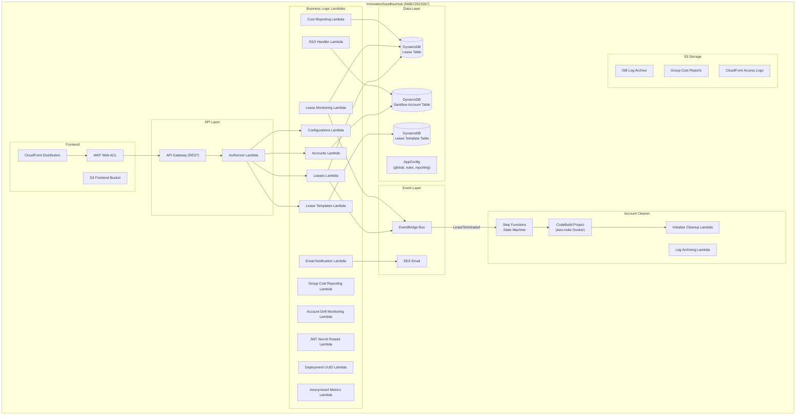

# Hub Account Resources

> **Last Updated**: 2026-03-02
> **Source**: [innovation-sandbox-on-aws](https://github.com/co-cddo/innovation-sandbox-on-aws) CDK stacks + AWS resource discovery
> **Captured SHA**: `cf75b87`

## Executive Summary

The Innovation Sandbox Hub account (568672915267, `InnovationSandboxHub`) hosts the ISB control plane and all CDDO satellite services. It contains four ISB CloudFormation stacks (AccountPool, IDC, Data, Compute) plus CDK stacks for the deployer, approver, billing separator, and costs services. The account also hosts Landing Zone Accelerator infrastructure stacks, the NDX website static assets, and the scenarios screenshot pipeline. Sandbox operations are deployed across us-east-1 and us-west-2 regions.

---

## Account Details

| Property | Value |
|---|---|
| Account ID | `568672915267` |
| Account Name | InnovationSandboxHub |
| Email | `ndx-try-provider+gds-ndx-try-aws-isb-hub@dsit.gov.uk` |
| OU | Workloads / Prod (`ou-2laj-bje756n2`) |
| Regions | us-east-1, us-west-2 |

---

## ISB Core Stacks

The upstream ISB solution deploys four CloudFormation stacks. In the NDX deployment these use the namespace `ndx`:

| Stack | Deployed To | Purpose |
|---|---|---|
| **InnovationSandbox-AccountPool** | Org Management (955063685555) | OU creation, SCP lifecycle, account registration |
| **InnovationSandbox-IDC** | Org Management (955063685555) | IAM Identity Center groups, SSO application, permission sets |
| **InnovationSandbox-Data** | Hub (568672915267) | DynamoDB tables, AppConfig configuration |
| **InnovationSandbox-Compute** | Hub (568672915267) | Lambda functions, API Gateway, EventBridge, Step Functions, CloudFront |

### Compute Stack Resources

The Compute stack (`ndx-try-isb-compute`) is the largest stack and contains the core ISB business logic:

```mermaid
flowchart TB
    subgraph hub["InnovationSandboxHub (568672915267)"]
        subgraph frontend["Frontend"]
            cf["CloudFront Distribution"]
            s3_fe["S3 Frontend Bucket"]
            waf["WAF Web ACL"]
        end

        subgraph api["API Layer"]
            apigw["API Gateway (REST)"]
            authorizer["Authorizer Lambda"]
        end

        subgraph lambdas["Business Logic Lambdas"]
            leases["Leases Lambda"]
            accounts["Accounts Lambda"]
            templates["Lease Templates Lambda"]
            configs["Configurations Lambda"]
            sso["SSO Handler Lambda"]
            email["Email Notification Lambda"]
            cost_report["Cost Reporting Lambda"]
            group_cost["Group Cost Reporting Lambda"]
            monitor["Lease Monitoring Lambda"]
            drift["Account Drift Monitoring Lambda"]
            jwt["JWT Secret Rotator Lambda"]
            deploy_uuid["Deployment UUID Lambda"]
            metrics["Anonymized Metrics Lambda"]
        end

        subgraph data["Data Layer"]
            ddb_accounts[("DynamoDB<br/>Sandbox Account Table")]
            ddb_leases[("DynamoDB<br/>Lease Table")]
            ddb_templates[("DynamoDB<br/>Lease Template Table")]
            appconfig["AppConfig<br/>(global, nuke, reporting)"]
        end

        subgraph events["Event Layer"]
            eb["EventBridge Bus"]
            ses["SES Email"]
        end

        subgraph cleanup["Account Cleaner"]
            sfn["Step Functions<br/>State Machine"]
            cb["CodeBuild Project<br/>(aws-nuke Docker)"]
            init_lambda["Initialize Cleanup Lambda"]
            log_archive["Log Archiving Lambda"]
        end

        subgraph storage["S3 Storage"]
            s3_logs["ISB Log Archive"]
            s3_gcost["Group Cost Reports"]
            s3_access["CloudFront Access Logs"]
        end
    end

    cf --> waf --> apigw
    apigw --> authorizer
    authorizer --> leases & accounts & templates & configs
    leases --> ddb_leases & eb
    accounts --> ddb_accounts
    templates --> ddb_templates
    monitor --> ddb_leases & eb
    eb -->|LeaseTerminated| sfn
    sfn --> cb --> init_lambda
    cost_report --> ddb_leases
    sso --> ddb_accounts
    email --> ses
```

### Lambda Functions (ISB Core)

| Function | Runtime | Purpose |
|---|---|---|
| Accounts Lambda | Node.js 22 | Account registration, status queries, OU management |
| Leases Lambda | Node.js 22 | Lease CRUD, approval/termination workflow |
| Lease Templates Lambda | Node.js 22 | Template management (PUBLIC/PRIVATE visibility) |
| Lease Monitoring | Node.js 22 | Periodic budget/duration threshold checks |
| Authorizer Lambda | Node.js 22 | JWT-based API Gateway authorization |
| Configurations Lambda | Node.js 22 | AppConfig read/write (global, nuke, reporting) |
| Cost Reporting Lambda | Node.js 22 | Individual lease cost tracking |
| Group Cost Reporting Lambda | Node.js 22 | Departmental cost aggregation |
| Email Notification Lambda | Node.js 22 | SES email dispatch for lease events |
| SSO Handler Lambda | Node.js 22 | IAM Identity Center user/group operations |
| Account Cleaner Initialize | Node.js 22 | Step Functions cleanup orchestration |
| Account Drift Monitoring | Node.js 22 | Detect configuration drift in pool accounts |
| Log Archiving Lambda | Node.js 22 | Move CloudWatch logs to S3 archive |
| JWT Secret Rotator | Node.js 22 | Periodic JWT signing key rotation |
| Deployment UUID Lambda | Node.js 22 | Solution tracking identifier |
| Anonymized Metrics | Node.js 22 | AWS telemetry reporting |

### Data Layer (Data Stack)

| Resource | Name Pattern | Purpose |
|---|---|---|
| DynamoDB Table | `{namespace}-isb-sandboxAccounts` | Account status and metadata |
| DynamoDB Table | `{namespace}-isb-leases` | Lease records with TTL |
| DynamoDB Table | `{namespace}-isb-leaseTemplates` | Template definitions |
| AppConfig Application | `{namespace}-isb-config` | Hosted configuration |
| AppConfig Profile | Global Config | Lease limits, cleanup params, auth settings |
| AppConfig Profile | Nuke Config | aws-nuke protected resource filters |
| AppConfig Profile | Reporting Config | Cost group definitions |

---

## CDDO Satellite Stacks

In addition to the core ISB stacks, the hub account hosts CDDO's custom satellite services:

| Stack | Purpose | EventBridge Trigger |
|---|---|---|
| **isb-deployer-dev** | CloudFormation deployment to sandbox accounts | `LeaseApproved` (archived) |
| **Approver infrastructure** | Score-based lease approval | `LeaseRequested` |
| **Billing Separator (hub)** | 72-hour quarantine enforcement | CloudTrail events |
| **Costs infrastructure** | Lease cost collection | `LeaseTerminated` |

---

## S3 Buckets

| Bucket Name Pattern | Purpose | Region |
|---|---|---|
| `approver-domain-list-568672915267` | UK gov domain allowlist for approver | us-east-1 |
| `dev-isb-deployer-artifacts` | CDK/CFN templates for deployer | us-east-1 |
| `isb-deployer-artifacts-568672915267` | Deployment artifacts | us-east-1 |
| `isb-lease-costs-568672915267-us-west-2` | Lease cost CSV reports (3yr retention) | us-west-2 |
| `ndx-static-prod` | NDX website static assets | us-east-1 |
| `ndx-try-isb-compute-*-frontend-*` | ISB web UI assets | us-east-1 |
| `ndx-try-isb-compute-*-accesslogs-*` | CloudFront access logs | us-east-1 |
| `ndx-try-isb-compute-*-groupcostreporting-*` | Group cost reports | us-east-1 |
| `ndx-try-isb-compute-*-logarchiving-*` | ISB log archive | us-east-1 |
| `ndx-try-screenshots-us-east-1` | Scenario screenshot pipeline | us-east-1 |
| `aws-accelerator-s3-access-logs-*` | LZA access logs | us-east-1 |
| `cdk-hnb659fds-assets-*` | CDK bootstrap assets | us-east-1, us-west-2 |

---

## EventBridge Rules

| Rule | State | Trigger |
|---|---|---|
| `isb-deployer-lease-approved-dev` | ENABLED | `LeaseApproved` events |
| LZA CloudWatch log subscription rules | ENABLED | New log group creation |
| Security Hub event logging rules | ENABLED | Security Hub findings |
| Control Tower managed rules | ENABLED | Config compliance changes |

---

## LZA Infrastructure Stacks

The hub account also contains 15+ Landing Zone Accelerator stacks managing baseline infrastructure:

| Stack Pattern | Purpose |
|---|---|
| `AWSAccelerator-NetworkVpcStack-*` | VPC networking |
| `AWSAccelerator-SecurityStack-*` | GuardDuty, SecurityHub, Macie setup |
| `AWSAccelerator-LoggingStack-*` | CloudWatch log subscriptions |
| `AWSAccelerator-OperationsStack-*` | SSM parameter operations |
| `AWSAccelerator-CustomizationsStack-*` | Custom configurations |
| `AWSAccelerator-KeyStack-*` | KMS key management |
| `AWSAccelerator-DependenciesStack-*` | Cross-stack dependencies |
| `AWSAccelerator-CDKToolkit` | CDK bootstrap |

---

## Resource Naming Conventions

| Pattern | Example | Owner |
|---|---|---|
| `ndx-try-isb-compute-*` | ndx-try-isb-compute-LeasesLambda* | ISB Core |
| `isb-deployer-*` | isb-deployer-dev | CDDO Deployer |
| `dev-isb-*` | dev-isb-leases | ISB Dev environment |
| `AWSAccelerator-*` | AWSAccelerator-LoggingStack-* | LZA |
| `StackSet-AWSControlTower*` | StackSet-AWSControlTowerBP-* | Control Tower |
| `aws-controltower-*` | aws-controltower-NotificationForwarder | Control Tower |
| `cdk-hnb659fds-*` | cdk-hnb659fds-assets-568672915267-* | CDK Bootstrap |

---

## Related Documents

- [02-aws-organization.md](./02-aws-organization.md) -- Organization structure
- [04-cross-account-trust.md](./04-cross-account-trust.md) -- Trust relationships from hub
- [05-service-control-policies.md](./05-service-control-policies.md) -- SCPs applied to pool accounts
- [01-upstream-analysis.md](./01-upstream-analysis.md) -- ISB version and stack analysis

---

*Generated from CDK source analysis and AWS resource discovery on 2026-03-02. See [00-repo-inventory.md](./00-repo-inventory.md) for full inventory.*
