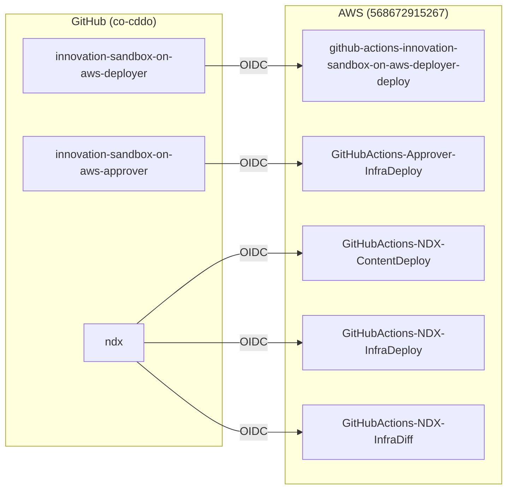
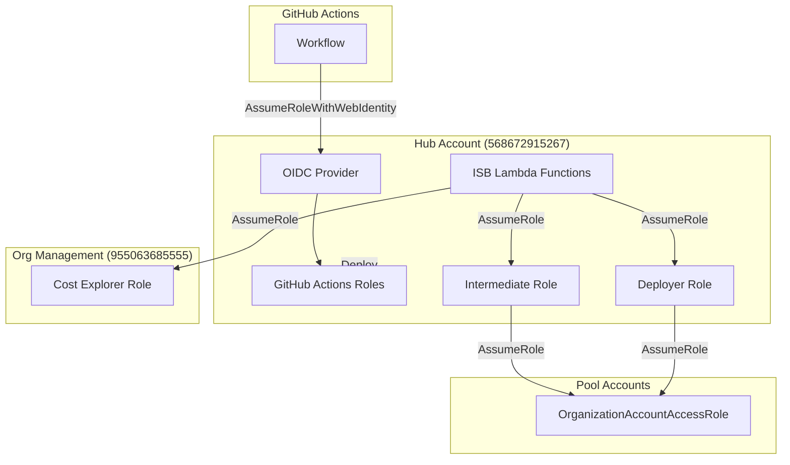

# Cross-Account Trust Relationships

**Document Version:** 1.0
**Date:** 2026-02-03
**Primary Account:** 568672915267 (InnovationSandboxHub)

---

## Executive Summary

The NDX:Try AWS infrastructure uses GitHub OIDC for CI/CD deployments and cross-account IAM roles for operational access between accounts. This document catalogs all trust relationships discovered in the Hub account.

---

## GitHub OIDC Provider

### Provider Configuration

| Property | Value |
|----------|-------|
| Provider ARN | `arn:aws:iam::568672915267:oidc-provider/token.actions.githubusercontent.com` |
| Provider URL | `https://token.actions.githubusercontent.com` |
| Audience | `sts.amazonaws.com` |

This OIDC provider enables GitHub Actions workflows to assume IAM roles without long-lived credentials.

---

## GitHub Actions IAM Roles

### Role Inventory

| Role Name | Purpose | Repository |
|-----------|---------|------------|
| `github-actions-innovation-sandbox-on-aws-deployer-deploy` | Deploy ISB Deployer Lambda | co-cddo/innovation-sandbox-on-aws-deployer |
| `GitHubActions-Approver-InfraDeploy` | Deploy Approver CDK infrastructure | co-cddo/innovation-sandbox-on-aws-approver |
| `GitHubActions-NDX-ContentDeploy` | Deploy NDX website content to S3 | co-cddo/ndx |
| `GitHubActions-NDX-InfraDeploy` | Deploy NDX website CDK infrastructure | co-cddo/ndx |
| `GitHubActions-NDX-InfraDiff` | CDK diff for NDX PRs | co-cddo/ndx |

### Trust Relationship Pattern

All GitHub Actions roles use this trust policy pattern:

```json
{
  "Version": "2012-10-17",
  "Statement": [
    {
      "Effect": "Allow",
      "Principal": {
        "Federated": "arn:aws:iam::568672915267:oidc-provider/token.actions.githubusercontent.com"
      },
      "Action": "sts:AssumeRoleWithWebIdentity",
      "Condition": {
        "StringEquals": {
          "token.actions.githubusercontent.com:aud": "sts.amazonaws.com"
        },
        "StringLike": {
          "token.actions.githubusercontent.com:sub": "repo:co-cddo/<repo-name>:*"
        }
      }
    }
  ]
}
```

---

## Repository to Role Mapping



---

## ISB Operational Roles

### Innovation Sandbox Intermediate Role

| Property | Value |
|----------|-------|
| Role Name | `InnovationSandbox-ndx-IntermediateRole` |
| Purpose | Cross-account access from Hub to pool accounts |
| Trust | ISB Lambda functions |

This role is assumed by ISB Lambda functions to perform operations in sandbox pool accounts.

### ISB Deployer Role

| Property | Value |
|----------|-------|
| Role Name | `isb-deployer-role-prod` |
| Purpose | Deploy CloudFormation to sandbox accounts |
| Trust | ISB Deployer Lambda |

Used by the deployer Lambda to:
1. Assume role in target sandbox account
2. Deploy CloudFormation stacks
3. Create/update resources

---

## Billing Separator Roles

| Role Name | Purpose |
|-----------|---------|
| `isb-billing-sep-scheduler-role-ndx` | EventBridge Scheduler for billing cooldown |
| `isb-billing-separator-hub-QuarantineLambdaServiceRo-*` | Quarantine Lambda execution |
| `isb-billing-separator-hub-UnquarantineLambdaService-*` | Unquarantine Lambda execution |
| `isb-billing-separator-hub-LogRetentionaae0aa3c5b4d4-*` | Log retention management |

---

## ISB Core Roles (from ndx-try-isb-compute stack)

### API & Compute Roles

| Role Pattern | Purpose |
|--------------|---------|
| `ndx-try-isb-compute-AccountsLambdaFunctionFunctionR-*` | Account management API |
| `ndx-try-isb-compute-LeasesLambdaFunctionFunctionRol-*` | Lease CRUD operations |
| `ndx-try-isb-compute-LeaseTemplatesLambdaFunctionFun-*` | Template management |
| `ndx-try-isb-compute-AuthorizerLambdaFunctionFunctio-*` | API authorization |
| `ndx-try-isb-compute-ConfigurationsLambdaFunctionFun-*` | AppConfig management |

### Monitoring & Cleanup Roles

| Role Pattern | Purpose |
|--------------|---------|
| `ndx-try-isb-compute-LeaseMonitoringFunctionRole46C5-*` | Budget/duration monitoring |
| `ndx-try-isb-compute-AccountDriftMonitoringFunctionR-*` | Configuration drift detection |
| `ndx-try-isb-compute-AccountCleanerCodeBuildCleanupP-*` | AWS Nuke CodeBuild project |
| `ndx-try-isb-compute-AccountCleanerInitializeCleanup-*` | Cleanup initialization |
| `ndx-try-isb-compute-AccountCleanerStepFunctionState-*` | Step Functions state machine |

### Cost & Reporting Roles

| Role Pattern | Purpose |
|--------------|---------|
| `ndx-try-isb-compute-CostReportingLambdaFunctionRole-*` | Individual lease costs |
| `ndx-try-isb-compute-GroupCostReportingLambdaFunctio-*` | Department cost aggregation |
| `ndx-try-isb-compute-LogArchivingFunctionRole93CCD43-*` | Log archival to S3 |

### Security & Auth Roles

| Role Pattern | Purpose |
|--------------|---------|
| `ndx-try-isb-compute-SsoHandlerFunctionRoleA9C67752-*` | IAM Identity Center operations |
| `ndx-try-isb-compute-JwtSecretRotatorFunctionRole64A-*` | JWT key rotation |
| `ndx-try-isb-compute-EmailNotificationFunctionRoleB4-*` | SES email sending |

### Infrastructure Roles

| Role Pattern | Purpose |
|--------------|---------|
| `ndx-try-isb-compute-SandboxAccountLifecycleManageme-*` | Account OU management |
| `ndx-try-isb-compute-IsbSpokeConfigJsonParamResolver-*` | SSM parameter resolution |
| `ndx-try-isb-compute-IsbRestApiCloudWatchRole3E2A3B9-*` | API Gateway CloudWatch logging |
| `ndx-try-isb-compute-CustomCDKBucketDeployment8693BB-*` | CDK asset deployment |

---

## Cross-Account Access Diagram



---

## Trust Relationship Security

### GitHub OIDC Best Practices

1. **Repository Scoping**: Roles are scoped to specific repositories using `repo:co-cddo/<repo>:*`
2. **Audience Validation**: All roles verify `aud: sts.amazonaws.com`
3. **No Long-Lived Credentials**: GitHub Actions use short-lived tokens

### Cross-Account Access Patterns

1. **Hub → Pool**: Uses intermediate roles with STS AssumeRole
2. **Hub → Org Management**: Cost Explorer queries use org management role
3. **Pool → Hub**: EventBridge events route back via cross-account rules

---

## Permission Boundaries

The following permission boundaries may be in place (requires further investigation):

| Boundary | Applied To | Purpose |
|----------|-----------|---------|
| ISB User Boundary | Pool account users | Prevent ISB infrastructure modification |
| Sandbox Boundary | Lease holders | Enforce SCP-like restrictions at role level |

---

## Issues Discovered

1. **Missing Repos in OIDC**: The following repos don't have visible GitHub Actions roles:
   - innovation-sandbox-on-aws-billing-seperator
   - innovation-sandbox-on-aws-costs
   - innovation-sandbox-on-aws-utils
   - ndx_try_aws_scenarios
   - ndx-try-aws-lza
   - ndx-try-aws-scp
   - ndx-try-aws-terraform

   These may deploy to different accounts or use alternative authentication methods.

2. **Role Naming Inconsistency**: Mix of naming patterns:
   - `github-actions-*` (lowercase, hyphens)
   - `GitHubActions-*` (PascalCase, hyphens)

3. **CDK Random Suffixes**: Many roles have CDK-generated random suffixes making them hard to identify without checking the trust policy.

---

## Related Documents

- [02-aws-organization.md](./02-aws-organization.md) - Organization structure
- [03-hub-account-resources.md](./03-hub-account-resources.md) - Hub account resources
- [51-oidc-configuration.md](./51-oidc-configuration.md) - Detailed OIDC configuration
- [52-deployment-flows.md](./52-deployment-flows.md) - CI/CD deployment flows
