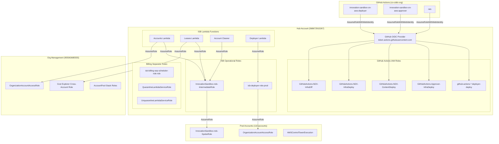
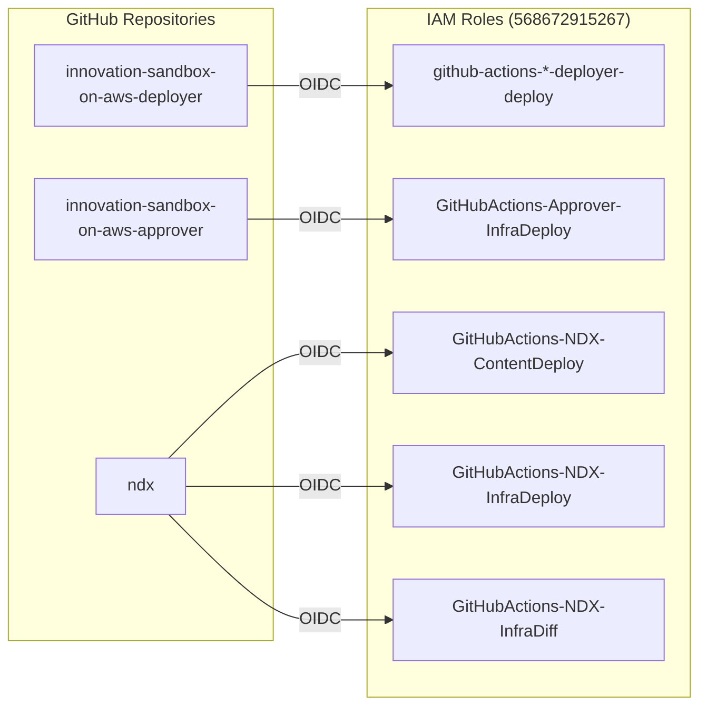
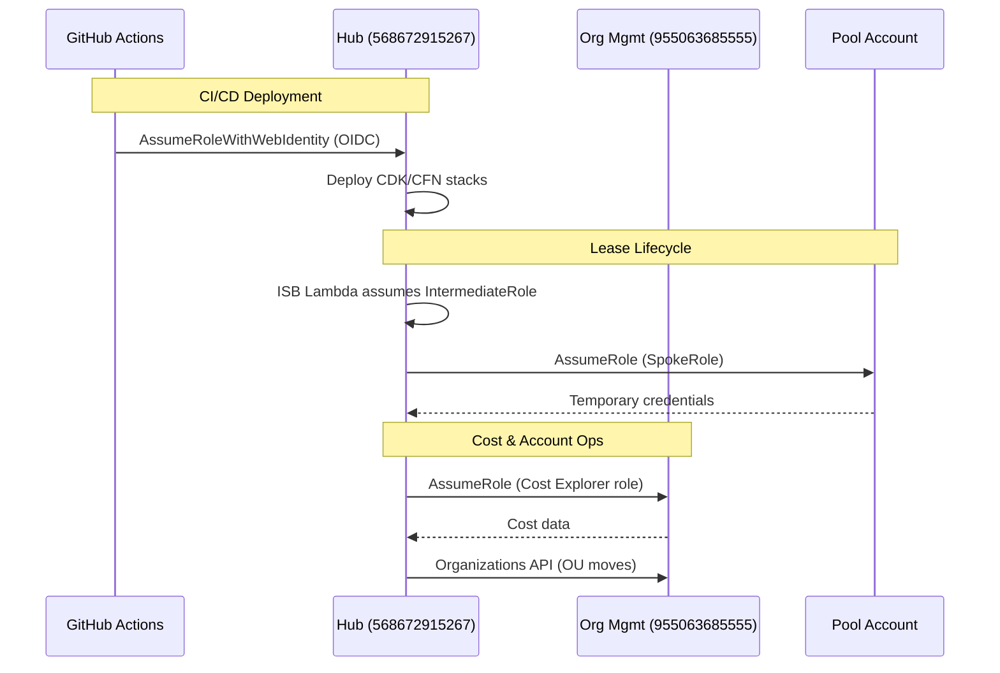

# Cross-Account Trust Relationships

> **Last Updated**: 2026-03-02
> **Source**: [innovation-sandbox-on-aws](https://github.com/co-cddo/innovation-sandbox-on-aws), [ndx-try-aws-lza](https://github.com/co-cddo/ndx-try-aws-lza), IAM role discovery
> **Captured SHA**: `cf75b87` (ISB), `6d70ae3` (LZA)

## Executive Summary

The NDX:Try AWS platform uses three cross-account trust mechanisms: GitHub OIDC for CI/CD deployments from GitHub Actions, ISB intermediate roles for hub-to-pool-account operations, and LZA/Control Tower execution roles for infrastructure management. Five GitHub Actions OIDC roles are configured in the hub account, scoped to specific co-cddo repositories. ISB Lambda functions assume an intermediate role to perform operations in the 110 sandbox pool accounts.

---

## Trust Architecture Overview


```mermaid
flowchart TB
    subgraph github["GitHub Actions (co-cddo org)"]
        gha_deployer["innovation-sandbox-on-aws-deployer"]
        gha_approver["innovation-sandbox-on-aws-approver"]
        gha_ndx["ndx"]
    end

    subgraph hub["Hub Account (568672915267)"]
        oidc["GitHub OIDC Provider<br/>token.actions.githubusercontent.com"]

        subgraph gha_roles["GitHub Actions IAM Roles"]
            r_deployer["github-actions-*-deployer-deploy"]
            r_approver["GitHubActions-Approver-InfraDeploy"]
            r_ndx_content["GitHubActions-NDX-ContentDeploy"]
            r_ndx_infra["GitHubActions-NDX-InfraDeploy"]
            r_ndx_diff["GitHubActions-NDX-InfraDiff"]
        end

        subgraph isb_roles["ISB Operational Roles"]
            intermediate["InnovationSandbox-ndx-IntermediateRole"]
            deployer_role["isb-deployer-role-prod"]
        end

        subgraph isb_lambdas["ISB Lambda Functions"]
            accounts_fn["Accounts Lambda"]
            leases_fn["Leases Lambda"]
            cleaner_fn["Account Cleaner"]
            deployer_fn["Deployer Lambda"]
        end

        subgraph billing_roles["Billing Separator Roles"]
            bs_scheduler["isb-billing-sep-scheduler-role-ndx"]
            bs_quarantine["QuarantineLambdaServiceRole"]
            bs_unquarantine["UnquarantineLambdaServiceRole"]
        end
    end

    subgraph org_mgmt["Org Management (955063685555)"]
        org_role["OrganizationAccountAccessRole"]
        cost_role["Cost Explorer Cross-Account Role"]
        acct_pool["AccountPool Stack Roles"]
    end

    subgraph pool["Pool Accounts (110 accounts)"]
        pool_org_role["OrganizationAccountAccessRole"]
        pool_isb_role["InnovationSandbox-ndx-SpokeRole"]
        pool_ct_role["AWSControlTowerExecution"]
    end

    gha_deployer -->|AssumeRoleWithWebIdentity| oidc
    gha_approver -->|AssumeRoleWithWebIdentity| oidc
    gha_ndx -->|AssumeRoleWithWebIdentity| oidc
    oidc --> r_deployer & r_approver & r_ndx_content & r_ndx_infra & r_ndx_diff

    accounts_fn & leases_fn & cleaner_fn -->|AssumeRole| intermediate
    deployer_fn -->|AssumeRole| deployer_role
    intermediate -->|AssumeRole| pool_isb_role
    deployer_role -->|AssumeRole| pool_org_role

    leases_fn -->|AssumeRole| cost_role
    accounts_fn -->|AssumeRole| org_role
```

---

## 1. GitHub OIDC Provider

| Property | Value |
|---|---|
| Provider ARN | `arn:aws:iam::568672915267:oidc-provider/token.actions.githubusercontent.com` |
| Provider URL | `https://token.actions.githubusercontent.com` |
| Audience | `sts.amazonaws.com` |
| Account | 568672915267 (Hub) |

The OIDC provider enables GitHub Actions workflows to obtain temporary AWS credentials without storing long-lived secrets. All trust relationships use `sts:AssumeRoleWithWebIdentity` with repository-scoped conditions.

### Trust Policy Pattern

All GitHub Actions roles use this trust policy structure:

```json
{
  "Version": "2012-10-17",
  "Statement": [
    {
      "Effect": "Allow",
      "Principal": {
        "Federated": "arn:aws:iam::568672915267:oidc-provider/token.actions.githubusercontent.com"
      },
      "Action": "sts:AssumeRoleWithWebIdentity",
      "Condition": {
        "StringEquals": {
          "token.actions.githubusercontent.com:aud": "sts.amazonaws.com"
        },
        "StringLike": {
          "token.actions.githubusercontent.com:sub": "repo:co-cddo/<repo-name>:*"
        }
      }
    }
  ]
}
```

---

## 2. GitHub Actions IAM Roles

| Role Name | Trusted Repository | Purpose |
|---|---|---|
| `github-actions-innovation-sandbox-on-aws-deployer-deploy` | `co-cddo/innovation-sandbox-on-aws-deployer` | Deploy ISB Deployer CDK stack |
| `GitHubActions-Approver-InfraDeploy` | `co-cddo/innovation-sandbox-on-aws-approver` | Deploy Approver CDK infrastructure |
| `GitHubActions-NDX-ContentDeploy` | `co-cddo/ndx` | Deploy NDX website content to S3 |
| `GitHubActions-NDX-InfraDeploy` | `co-cddo/ndx` | Deploy NDX website CDK infrastructure |
| `GitHubActions-NDX-InfraDiff` | `co-cddo/ndx` | CDK diff for NDX pull request reviews |

### Repository-to-Role Mapping


```mermaid
flowchart LR
    subgraph repos["GitHub Repositories"]
        deployer_repo["innovation-sandbox-<br/>on-aws-deployer"]
        approver_repo["innovation-sandbox-<br/>on-aws-approver"]
        ndx_repo["ndx"]
    end

    subgraph roles["IAM Roles (568672915267)"]
        r1["github-actions-*-deployer-deploy"]
        r2["GitHubActions-Approver-InfraDeploy"]
        r3["GitHubActions-NDX-ContentDeploy"]
        r4["GitHubActions-NDX-InfraDeploy"]
        r5["GitHubActions-NDX-InfraDiff"]
    end

    deployer_repo -->|OIDC| r1
    approver_repo -->|OIDC| r2
    ndx_repo -->|OIDC| r3
    ndx_repo -->|OIDC| r4
    ndx_repo -->|OIDC| r5
```

### Repositories Without OIDC Roles in Hub

The following repositories do not have visible GitHub Actions OIDC roles in the hub account. They may deploy to different accounts, use alternative authentication, or deploy manually:

- `innovation-sandbox-on-aws-billing-seperator`
- `innovation-sandbox-on-aws-costs`
- `innovation-sandbox-on-aws-utils`
- `ndx_try_aws_scenarios`
- `ndx-try-aws-lza` (deployed via LZA pipeline in org management)
- `ndx-try-aws-scp` (deployed via Terraform to org management)
- `ndx-try-aws-terraform`

---

## 3. ISB Operational Cross-Account Roles

### Hub-to-Pool Account Access

The ISB core uses two role chains for cross-account operations:

#### Intermediate Role (General Operations)

| Property | Value |
|---|---|
| Role Name | `InnovationSandbox-ndx-IntermediateRole` |
| Location | Hub account (568672915267) |
| Assumed By | ISB Lambda functions (Accounts, Leases, Monitoring, Cleaner) |
| Purpose | Assume spoke roles in pool accounts |

The intermediate role is a jump role -- ISB Lambdas first assume this role, then use it to assume the spoke role in the target pool account:

```
ISB Lambda -> IntermediateRole (hub) -> SpokeRole (pool account)
```

#### Deployer Role (CloudFormation Deployment)

| Property | Value |
|---|---|
| Role Name | `isb-deployer-role-prod` |
| Location | Hub account (568672915267) |
| Assumed By | ISB Deployer Lambda |
| Purpose | Deploy CloudFormation stacks in pool accounts |

#### Pool Account Spoke Roles

Each pool account contains roles that trust the hub account:

| Role | Purpose | Trust |
|---|---|---|
| `InnovationSandbox-ndx-SpokeRole` | ISB operational access (OU moves, SCP application) | Hub intermediate role |
| `OrganizationAccountAccessRole` | Full administrative access | Org management account |
| `AWSControlTowerExecution` | Control Tower provisioning | Control Tower |
| `stacksets-exec-*` | CloudFormation StackSets execution | Hub account |

### Hub-to-Org Management Access

| Purpose | Mechanism |
|---|---|
| Cost Explorer queries | ISB Cost Reporting Lambda assumes role in org management (955063685555) |
| Account registration | ISB Accounts Lambda calls Organizations API via org management role |
| OU management | ISB Account lifecycle Lambda moves accounts between OUs |

---

## 4. Billing Separator Roles

The billing separator service has its own role chain for quarantine operations:

| Role | Purpose |
|---|---|
| `isb-billing-sep-scheduler-role-ndx` | EventBridge Scheduler for timed unquarantine |
| `isb-billing-separator-hub-QuarantineLambdaServiceRole-*` | Lambda that moves accounts to Quarantine OU |
| `isb-billing-separator-hub-UnquarantineLambdaServiceRole-*` | Lambda that moves accounts back to Available OU |
| `isb-billing-separator-hub-LogRetentionaae0aa3c5b4d4-*` | CloudWatch log retention management |

---

## 5. LZA / Control Tower Execution Roles

Landing Zone Accelerator and Control Tower use privileged execution roles across all accounts:

| Role | Present In | Purpose |
|---|---|---|
| `AWSControlTowerExecution` | All accounts | Control Tower baseline provisioning |
| `AWSAccelerator-*` | All accounts | LZA stack deployment and management |
| `cdk-accel-*` | All accounts | CDK bootstrap for LZA |

These roles are exempted from all SCPs to ensure infrastructure management continues to function.

---

## 6. SCP Exemption Pattern

All ISB and infrastructure SCPs use a common exemption pattern for privileged roles:

```json
{
  "Condition": {
    "ArnNotLike": {
      "aws:PrincipalARN": [
        "arn:aws:iam::*:role/InnovationSandbox-ndx*",
        "arn:aws:iam::*:role/aws-reserved/sso.amazonaws.com/*AWSReservedSSO_ndx_IsbAdmins*",
        "arn:aws:iam::*:role/stacksets-exec-*",
        "arn:aws:iam::*:role/AWSControlTowerExecution"
      ]
    }
  }
}
```

This ensures that ISB control plane operations, ISB admin SSO sessions, StackSets execution, and Control Tower provisioning are never blocked by ISB-managed SCPs.

---

## Cross-Account Access Flow Summary


```mermaid
sequenceDiagram
    participant GHA as GitHub Actions
    participant Hub as Hub (568672915267)
    participant OrgMgmt as Org Mgmt (955063685555)
    participant Pool as Pool Account

    Note over GHA,Hub: CI/CD Deployment
    GHA->>Hub: AssumeRoleWithWebIdentity (OIDC)
    Hub->>Hub: Deploy CDK/CFN stacks

    Note over Hub,Pool: Lease Lifecycle
    Hub->>Hub: ISB Lambda assumes IntermediateRole
    Hub->>Pool: AssumeRole (SpokeRole)
    Pool-->>Hub: Temporary credentials

    Note over Hub,OrgMgmt: Cost & Account Ops
    Hub->>OrgMgmt: AssumeRole (Cost Explorer role)
    OrgMgmt-->>Hub: Cost data
    Hub->>OrgMgmt: Organizations API (OU moves)
```

---

## Security Observations

1. **Repository Scoping**: All OIDC roles are scoped to specific `co-cddo/*` repositories using `StringLike` conditions, preventing cross-repository impersonation.

2. **Audience Validation**: All OIDC roles validate `aud: sts.amazonaws.com`.

3. **No Long-Lived Credentials**: GitHub Actions use short-lived OIDC tokens; ISB uses STS temporary credentials.

4. **Role Naming Inconsistency**: Mix of `github-actions-*` (lowercase) and `GitHubActions-*` (PascalCase) naming patterns. Consider standardising.

5. **CDK Random Suffixes**: Many ISB core roles have CDK-generated random suffixes, making audit harder. The role purpose must be inferred from the prefix pattern.

---

## Related Documents

- [02-aws-organization.md](./02-aws-organization.md) -- Organization structure and account inventory
- [03-hub-account-resources.md](./03-hub-account-resources.md) -- Hub account resources
- [05-service-control-policies.md](./05-service-control-policies.md) -- SCP exemption patterns
- [00-repo-inventory.md](./00-repo-inventory.md) -- Repository inventory

---

*Generated from IAM role analysis and CDK source inspection on 2026-03-02. See [00-repo-inventory.md](./00-repo-inventory.md) for full inventory.*
