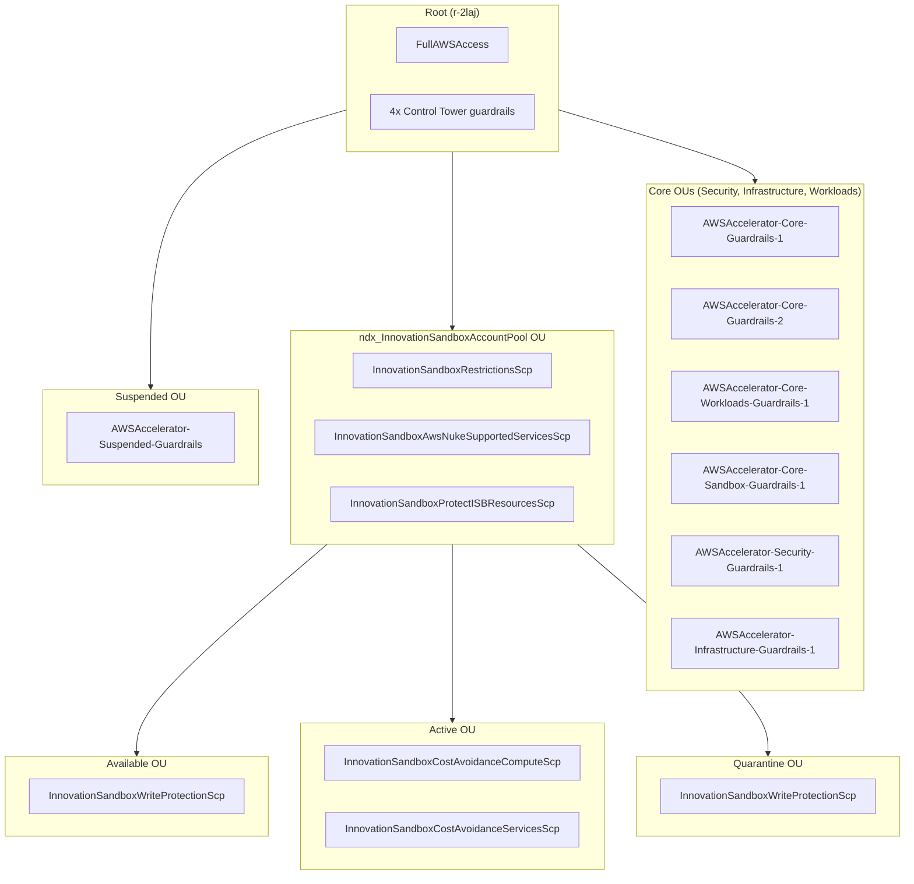
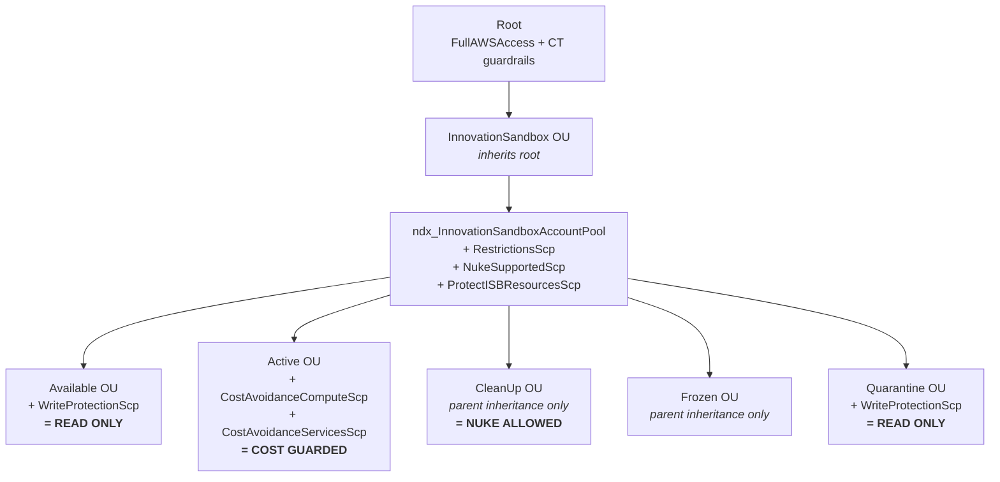

# Service Control Policies

> **Last Updated**: 2026-03-02
> **Source**: [AWS Organizations API](https://console.aws.amazon.com/organizations/) via `.state/discovered-scps.json` and `.state/scps/*.json`, [ndx-try-aws-scp](https://github.com/co-cddo/ndx-try-aws-scp)
> **Captured SHA**: `912db2e` (ndx-try-aws-scp), `6d70ae3` (ndx-try-aws-lza)

## Executive Summary

The NDX:Try AWS organization enforces 19 Service Control Policies from four management sources: AWS Control Tower (4 guardrails), Landing Zone Accelerator (8 guardrails), Terraform via ndx-try-aws-scp (4 cost/security policies), and ISB Core (2 lifecycle policies), plus the default FullAWSAccess baseline. The SCPs implement a layered defence strategy where pool accounts in the Active OU receive cost avoidance restrictions, while Available and Quarantine accounts are fully write-protected.

---

## SCP Inventory

### Summary by Management Source

| Source | Count | Management Tool | Scope |
|---|---|---|---|
| AWS (FullAWSAccess) | 1 | AWS Managed | Root |
| AWS Control Tower | 4 | Control Tower Console | Various OUs |
| Landing Zone Accelerator | 8 | LZA YAML config (`ndx-try-aws-lza`) | Core/Security/Infrastructure OUs |
| Terraform | 4 | Terraform (`ndx-try-aws-scp`) | Innovation Sandbox Pool OUs |
| ISB Core | 2 | ISB AccountPool Stack | Innovation Sandbox Pool OUs |
| **Total** | **19** | | |

### Complete SCP List

| Policy ID | Name | Source | Description |
|---|---|---|---|
| `p-FullAWSAccess` | FullAWSAccess | AWS | Allows all actions (default baseline) |
| `p-8wd7ba5z` | aws-guardrails-NllhqI | Control Tower | Managed guardrail |
| `p-nxzjmfvt` | aws-guardrails-LfCVzN | Control Tower | Managed guardrail |
| `p-trgexdi8` | aws-guardrails-ZkxPzj | Control Tower | Managed guardrail |
| `p-u1nq4ha1` | aws-guardrails-mQGCET | Control Tower | Managed guardrail |
| `p-wr0deafe` | AWSAccelerator-Core-Guardrails-1 | LZA | Protect CloudTrail, Config, LZA resources |
| `p-eybze26q` | AWSAccelerator-Core-Guardrails-2 | LZA | Protect security services, block root account |
| `p-eolruvn3` | AWSAccelerator-Core-Sandbox-Guardrails-1 | LZA | Network restrictions, storage encryption |
| `p-k3kvpq9a` | AWSAccelerator-Core-Workloads-Guardrails-1 | LZA | Network restrictions, storage encryption |
| `p-vtn1xi9m` | AWSAccelerator-Security-Guardrails-1 | LZA | Security account network/encryption |
| `p-w2ssyciy` | AWSAccelerator-Infrastructure-Guardrails-1 | LZA | Infrastructure network/firewall protection |
| `p-txuho3u8` | AWSAccelerator-Quarantine-New-Object | LZA | Block all non-LZA actions on new accounts |
| `p-s37b6cez` | AWSAccelerator-Suspended-Guardrails | LZA | Block LZA from suspended accounts |
| `p-6tw8eixp` | InnovationSandboxRestrictionsScp | Terraform | Region, security, isolation restrictions |
| `p-7pd0szg9` | InnovationSandboxAwsNukeSupportedServicesScp | Terraform | Allowlist for aws-nuke supported services |
| `p-1rzl0ufv` | InnovationSandboxCostAvoidanceComputeScp | Terraform | EC2/RDS/EKS instance type restrictions |
| `p-64setrzn` | InnovationSandboxCostAvoidanceServicesScp | Terraform | Block expensive services |
| `p-gn4fu3co` | InnovationSandboxProtectISBResourcesScp | ISB Core | Protect ISB control plane resources |
| `p-tyb1wjxv` | InnovationSandboxWriteProtectionScp | ISB Core | Deny all actions (read-only mode) |

---

## OU-to-SCP Attachment Map


```mermaid
flowchart TB
    subgraph root["Root (r-2laj)"]
        r_fa["FullAWSAccess"]
        r_ct["4x Control Tower guardrails"]
    end

    subgraph core_ous["Core OUs (Security, Infrastructure, Workloads)"]
        lza_g1["AWSAccelerator-Core-Guardrails-1"]
        lza_g2["AWSAccelerator-Core-Guardrails-2"]
        lza_wk["AWSAccelerator-Core-Workloads-Guardrails-1"]
        lza_sb["AWSAccelerator-Core-Sandbox-Guardrails-1"]
        lza_sec["AWSAccelerator-Security-Guardrails-1"]
        lza_inf["AWSAccelerator-Infrastructure-Guardrails-1"]
    end

    subgraph pool_parent["ndx_InnovationSandboxAccountPool OU"]
        p_restrict["InnovationSandboxRestrictionsScp"]
        p_nuke["InnovationSandboxAwsNukeSupportedServicesScp"]
        p_protect["InnovationSandboxProtectISBResourcesScp"]
    end

    subgraph available_ou["Available OU"]
        a_write["InnovationSandboxWriteProtectionScp"]
    end

    subgraph active_ou["Active OU"]
        ac_compute["InnovationSandboxCostAvoidanceComputeScp"]
        ac_services["InnovationSandboxCostAvoidanceServicesScp"]
    end

    subgraph quarantine_ou["Quarantine OU"]
        q_write["InnovationSandboxWriteProtectionScp"]
    end

    subgraph suspended["Suspended OU"]
        sus["AWSAccelerator-Suspended-Guardrails"]
    end

    root --> core_ous
    root --> pool_parent
    root --> suspended
    pool_parent --> available_ou
    pool_parent --> active_ou
    pool_parent --> quarantine_ou
```

### Effective SCP Stack by Account State

| Account State (OU) | Inherited SCPs | Direct SCPs | Effective Behaviour |
|---|---|---|---|
| **Available** | FullAWSAccess, RestrictionsScp, NukeSupportedScp, ProtectISBScp | **WriteProt ectionScp** | Complete write lockdown (read-only) |
| **Active** | FullAWSAccess, RestrictionsScp, NukeSupportedScp, ProtectISBScp | **CostComputeScp, CostServicesScp** | Permitted services with cost guards |
| **CleanUp** | FullAWSAccess, RestrictionsScp, NukeSupportedScp, ProtectISBScp | (none direct) | ISB/LZA roles can nuke resources |
| **Frozen** | FullAWSAccess, RestrictionsScp, NukeSupportedScp, ProtectISBScp | (none direct) | Inherits parent restrictions only |
| **Quarantine** | FullAWSAccess, RestrictionsScp, NukeSupportedScp, ProtectISBScp | **WriteProtectionScp** | Complete write lockdown |

---

## Terraform-Managed Policies (ndx-try-aws-scp)

### InnovationSandboxRestrictionsScp (`p-6tw8eixp`)

**Attached To**: ndx_InnovationSandboxAccountPool OU (all pool accounts inherit)

| Statement ID | Effect | Controls |
|---|---|---|
| `DenyRegionAccess` | Deny | Restricts actions to **us-east-1** and **us-west-2** only. Bedrock API calls are exempt from region restrictions. |
| `DenyExpensiveBedrockModels` | Deny | Blocks Anthropic Claude Opus and Sonnet models (cost control). Cheaper models (Haiku, Nova) remain available. |
| `SecurityAndIsolationRestrictions` | Deny | Blocks CloudTrail modifications, RAM sharing, SSM document sharing, WAF firewall manager changes. |
| `CostImplicationRestrictions` | Deny | Blocks billing modifications, reserved instance purchases, savings plans, Shield subscriptions. |
| `OperationalRestrictions` | Deny | Blocks region enablement, CloudHSM, Direct Connect, Route53 Domains, Storage Gateway, and 30+ other restricted services. |

**Exempt Roles**: `InnovationSandbox-ndx*`, `AWSReservedSSO_ndx_IsbAdmins*`, `stacksets-exec-*`, `AWSControlTowerExecution`.

### InnovationSandboxAwsNukeSupportedServicesScp (`p-7pd0szg9`)

**Attached To**: ndx_InnovationSandboxAccountPool OU

**Type**: Allowlist policy (denies everything NOT in the list)

This SCP ensures sandbox users can only create resources in services that aws-nuke can clean up. It allows approximately 140 services including: EC2, Lambda, DynamoDB, S3, RDS, ECS, EKS, API Gateway, CloudFormation, Bedrock, SageMaker, Redshift, ElastiCache, Kinesis, Glue, and many more. Textract is partially allowed (specific API actions only).

### InnovationSandboxCostAvoidanceComputeScp (`p-1rzl0ufv`)

**Attached To**: Active OU only

| Statement ID | Effect | Controls |
|---|---|---|
| `DenyUnallowedEC2` | Deny | EC2 instance types restricted to: t2.micro/small/medium, t3.micro/small/medium/large, t3a.micro/small/medium/large, m5.large/xlarge, m6i.large/xlarge |
| `DenyExpensiveEC2` | Deny | Blocks GPU (p*, g*), inference (inf*, trn*), deep learning (dl*), high-memory (u-*), bare metal (*.metal*), and instances larger than *.12xlarge |
| `DenyExpensiveEBS` | Deny | Blocks io1/io2 (provisioned IOPS) EBS volume types |
| `DenyLargeEBS` | Deny | Blocks EBS volumes larger than 500 GB |
| `DenyUnallowedRDS` | Deny | RDS restricted to: db.t3.*, db.t4g.*, db.m5.large/xlarge, db.m6g.large/xlarge, db.m6i.large/xlarge |
| `DenyUnallowedCache` | Deny | ElastiCache restricted to: cache.t3.*, cache.t4g.*, cache.m5.large, cache.m6g.large |
| `LimitEKSSize` | Deny | EKS node groups limited to maxSize of 5 |
| `LimitASGSize` | Deny | Auto Scaling groups limited to MaxSize of 10 |
| `DenyLambdaPC` | Deny | Blocks Lambda provisioned concurrency |

### InnovationSandboxCostAvoidanceServicesScp (`p-64setrzn`)

**Attached To**: Active OU only

| Statement ID | Effect | Blocked Services |
|---|---|---|
| `DenyExpensiveML` | Deny | SageMaker endpoints, training jobs, hyperparameter tuning |
| `DenyExpensiveData` | Deny | EMR job flows, Redshift clusters, GameLift fleets |
| `DenyExpensiveServices` | Deny | Kafka (MSK), FSx, Kinesis streams, dedicated hosts, reserved instances, Neptune, DocumentDB, MemoryDB, OpenSearch, Batch compute, Glue jobs/dev endpoints, Timestream, QLDB |

---

## ISB Core Policies

### InnovationSandboxProtectISBResourcesScp (`p-gn4fu3co`)

**Attached To**: ndx_InnovationSandboxAccountPool OU

| Statement ID | Effect | Protected Resources |
|---|---|---|
| `ProtectIsbControlPlaneResources` | Deny | ISB roles (`InnovationSandbox-ndx*`), SSO roles (`AWSReservedSSO*`), ISB-tagged resources (`*Isb-ndx*`), StackSets exec roles, SAML providers |
| `ProtectControlTowerResources` | Deny | Control Tower trails, EventBridge rules, Lambda functions, log groups, SNS topics, IAM roles |
| `DenyConfigActions` | Deny | AWS Config recorder/delivery channel modifications |
| `ProtectControlTowerTaggedConfigResources` | Deny | Config resources tagged `aws-control-tower: managed-by-control-tower` |
| `DenyControlTowerConfigTagActions` | Deny | Adding/removing `aws-control-tower` tags from Config resources |

### InnovationSandboxWriteProtectionScp (`p-tyb1wjxv`)

**Attached To**: Available OU, Quarantine OU

This is the most restrictive SCP -- a single statement that denies **all actions** on **all resources** unless the principal is an ISB control plane role, ISB admin SSO role, StackSets exec role, or AWSControlTowerExecution role.

```json
{
  "Statement": [{
    "Sid": "DenyAllExceptIsbRoles",
    "Effect": "Deny",
    "Action": "*",
    "Resource": "*",
    "Condition": {
      "ArnNotLike": {
        "aws:PrincipalARN": [
          "arn:aws:iam::*:role/InnovationSandbox-ndx*",
          "arn:aws:iam::*:role/aws-reserved/sso.amazonaws.com/*AWSReservedSSO_ndx_IsbAdmins*",
          "arn:aws:iam::*:role/stacksets-exec-*",
          "arn:aws:iam::*:role/AWSControlTowerExecution"
        ]
      }
    }
  }]
}
```

---

## LZA-Managed Policies

### AWSAccelerator-Core-Guardrails-1 (`p-wr0deafe`)

Protects LZA-managed infrastructure from unauthorized modification:

| Statement ID | Protects |
|---|---|
| `GRCFGR` | AWS Config rules tagged `Accelerator: AWSAccelerator` |
| `GRLMB` | Lambda functions named `AWSAccelerator*` |
| `GRSNS` | SNS topics named `aws-accelerator-*` |
| `GRCWLG` | CloudWatch log groups `aws-accelerator-*` and `/aws/lambda/AWSAccelerator*` |
| `GRKIN` | Kinesis/Firehose streams named `AWSAccelerator*` |
| `GREB` | EventBridge rules named `AWSAccelerator*` |

**Exempt Roles**: `AWSAccelerator*`, `AWSControlTowerExecution`, `cdk-accel*`.

### AWSAccelerator-Core-Guardrails-2 (`p-eybze26q`)

Security service and root account protections:

| Statement ID | Protects |
|---|---|
| `GRIAMR` | LZA IAM roles from modification |
| `GRIAMRT` | IAM roles tagged `Accelerator: AWSAccelerator` |
| `GRCFM` | LZA CloudFormation stacks from deletion |
| `GRSSM` | SSM parameters under `/accelerator*` |
| `GRS3` | S3 buckets `aws-accelerator*` and `cdk-accel*` |
| `GRRU` | **Root account usage** (Deny all for root principal) |
| `GRSEC` | GuardDuty, SecurityHub, Macie, IAM account settings, Organizations leave |

### AWSAccelerator-Core-Sandbox-Guardrails-1 (`p-eolruvn3`)

Network and encryption for sandbox-tier accounts:

| Statement ID | Controls |
|---|---|
| `GRNETSEC1` | Prevent deletion of Accelerator-tagged EC2 resources |
| `GRNETSEC2` | Block VPC/subnet/route/TGW creation and modification on Accelerator-tagged resources |
| `GREFS` | Enforce EFS encryption at rest |
| `GRRDS1` | Enforce RDS instance encryption |
| `GRRDS2` | Enforce Aurora cluster encryption |

### AWSAccelerator-Quarantine-New-Object (`p-txuho3u8`)

Blocks **all actions** except from LZA/Control Tower execution roles. Applied to newly created accounts until LZA pipeline completes.

### AWSAccelerator-Suspended-Guardrails (`p-s37b6cez`)

Blocks **all LZA/Control Tower provisioning** in suspended accounts. Opposite of the quarantine SCP -- it prevents infrastructure roles from operating rather than preventing user roles.

---

## SCP Inheritance Model


```mermaid
flowchart TB
    root["Root<br/>FullAWSAccess + CT guardrails"]
    isb_ou["InnovationSandbox OU<br/><i>inherits root</i>"]
    pool["ndx_InnovationSandboxAccountPool<br/>+ RestrictionsScp<br/>+ NukeSupportedScp<br/>+ ProtectISBResourcesScp"]

    available["Available OU<br/>+ WriteProtectionScp<br/><b>= READ ONLY</b>"]
    active["Active OU<br/>+ CostAvoidanceComputeScp<br/>+ CostAvoidanceServicesScp<br/><b>= COST GUARDED</b>"]
    cleanup["CleanUp OU<br/><i>parent inheritance only</i><br/><b>= NUKE ALLOWED</b>"]
    frozen["Frozen OU<br/><i>parent inheritance only</i>"]
    quarantine["Quarantine OU<br/>+ WriteProtectionScp<br/><b>= READ ONLY</b>"]

    root --> isb_ou --> pool
    pool --> available
    pool --> active
    pool --> cleanup
    pool --> frozen
    pool --> quarantine
```

---

## Dual SCP Management Analysis

SCPs in this organization are managed by two separate IaC tools:

| Aspect | LZA (YAML) | Terraform |
|---|---|---|
| **Tool** | Landing Zone Accelerator | `ndx-try-aws-scp` Terraform modules |
| **Deployment** | LZA pipeline in org management | GitHub Actions with OIDC |
| **Scope** | Core/Security/Infrastructure OUs | Innovation Sandbox Pool OUs |
| **Region Controls** | Via security-config.yaml | Via InnovationSandboxRestrictionsScp |
| **Network Controls** | Core-Guardrails series | InnovationSandboxRestrictionsScp |
| **Cost Controls** | None | CostAvoidance Compute + Services SCPs |

### Potential Overlap Areas

1. **Region restrictions**: Both LZA security config and Terraform RestrictionsScp may enforce region limits. The Terraform SCP explicitly restricts to us-east-1 and us-west-2.

2. **Network controls**: LZA Core-Sandbox-Guardrails-1 restricts VPC/networking on Accelerator-tagged resources; Terraform RestrictionsScp blocks RAM sharing and VPC peering.

3. **Encryption enforcement**: LZA guardrails enforce EFS/RDS encryption; Terraform does not duplicate this.

### Recommendations

1. **Document ownership boundaries**: Clearly delineate which team/pipeline owns which SCPs.
2. **Test effective permissions**: Use IAM Policy Simulator to validate combined SCP effects.
3. **Consider consolidation**: Evaluate whether all ISB SCPs could move to LZA for a single source of truth, or vice versa.

---

## Related Documents

- [02-aws-organization.md](./02-aws-organization.md) -- Organization structure and OU hierarchy
- [03-hub-account-resources.md](./03-hub-account-resources.md) -- Hub account resource inventory
- [04-cross-account-trust.md](./04-cross-account-trust.md) -- Role exemption patterns
- [00-repo-inventory.md](./00-repo-inventory.md) -- Repository inventory (ndx-try-aws-scp, ndx-try-aws-lza)

---

*Generated from AWS Organizations SCP data and Terraform source analysis on 2026-03-02. See [00-repo-inventory.md](./00-repo-inventory.md) for full inventory.*
