# Service Control Policies

**Document Version:** 1.0
**Date:** 2026-02-03
**Organization ID:** o-4g8nrlnr9s
**Total SCPs:** 19

---

## Executive Summary

The NDX:Try AWS organization uses a multi-layered SCP strategy with policies from three distinct sources:
1. **AWS Control Tower** - Managed guardrails (4 policies)
2. **AWS Landing Zone Accelerator** - Core and workload guardrails (8 policies)
3. **Terraform (ndx-try-aws-scp)** - Innovation Sandbox cost/security controls (5 policies)
4. **Innovation Sandbox Core** - Lifecycle protection (2 policies)

---

## SCP Inventory

### Summary by Source

| Source | Count | Management |
|--------|-------|------------|
| AWS Control Tower | 4 | AWS managed |
| LZA | 8 | LZA configuration |
| Terraform | 5 | co-cddo/ndx-try-aws-scp |
| ISB Core | 2 | innovation-sandbox-on-aws |
| AWS Managed | 1 | FullAWSAccess |
| **Total** | **19** (1 shared) | |

### Complete SCP List

| Policy ID | Name | Source | Description |
|-----------|------|--------|-------------|
| p-FullAWSAccess | FullAWSAccess | AWS | Allows all actions (baseline) |
| **Control Tower Policies** | | | |
| p-8wd7ba5z | aws-guardrails-NllhqI | Control Tower | CT managed guardrails |
| p-nxzjmfvt | aws-guardrails-LfCVzN | Control Tower | CT managed guardrails |
| p-trgexdi8 | aws-guardrails-ZkxPzj | Control Tower | CT managed guardrails |
| p-u1nq4ha1 | aws-guardrails-mQGCET | Control Tower | CT managed guardrails |
| **LZA Policies** | | | |
| p-eolruvn3 | AWSAccelerator-Core-Sandbox-Guardrails-1 | LZA | Network & storage encryption |
| p-eybze26q | AWSAccelerator-Core-Guardrails-2 | LZA | Security services & root protection |
| p-k3kvpq9a | AWSAccelerator-Core-Workloads-Guardrails-1 | LZA | Network & storage for workloads |
| p-s37b6cez | AWSAccelerator-Suspended-Guardrails | LZA | Suspended account restrictions |
| p-txuho3u8 | AWSAccelerator-Quarantine-New-Object | LZA | New account quarantine |
| p-vtn1xi9m | AWSAccelerator-Security-Guardrails-1 | LZA | Security account restrictions |
| p-w2ssyciy | AWSAccelerator-Infrastructure-Guardrails-1 | LZA | Infrastructure account restrictions |
| p-wr0deafe | AWSAccelerator-Core-Guardrails-1 | LZA | CloudTrail, Config, LZA protection |
| **Terraform Policies** | | | |
| p-1rzl0ufv | InnovationSandboxCostAvoidanceComputeScp | Terraform | EC2/RDS instance type restrictions |
| p-64setrzn | InnovationSandboxCostAvoidanceServicesScp | Terraform | Block expensive services |
| p-6tw8eixp | InnovationSandboxRestrictionsScp | Terraform | Security, isolation, regions |
| p-7pd0szg9 | InnovationSandboxAwsNukeSupportedServicesScp | Terraform | AWS Nuke compatibility |
| **ISB Core Policies** | | | |
| p-gn4fu3co | InnovationSandboxProtectISBResourcesScp | ISB | Protect ISB control plane |
| p-tyb1wjxv | InnovationSandboxWriteProtectionScp | ISB | Read-only mode for accounts |

---

## OU-to-SCP Attachment Mapping

```mermaid
flowchart TB
    subgraph root["Root"]
        fullaccess["FullAWSAccess ✓"]
    end

    subgraph isb_pool["ndx_InnovationSandboxAccountPool OU"]
        restrictions["InnovationSandboxRestrictionsScp"]
        nuke["InnovationSandboxAwsNukeSupportedServicesScp"]
        protect["InnovationSandboxProtectISBResourcesScp"]
    end

    subgraph available["Available OU"]
        write_protect["InnovationSandboxWriteProtectionScp"]
    end

    subgraph active["Active OU"]
        cost_compute["InnovationSandboxCostAvoidanceComputeScp"]
        cost_services["InnovationSandboxCostAvoidanceServicesScp"]
    end

    subgraph frozen["Frozen OU"]
        frozen_full["FullAWSAccess only"]
    end

    subgraph quarantine["Quarantine OU"]
        quar_write["InnovationSandboxWriteProtectionScp"]
    end

    root --> isb_pool
    isb_pool --> available
    isb_pool --> active
    isb_pool --> frozen
    isb_pool --> quarantine
```

### Detailed OU Attachments

#### ndx_InnovationSandboxAccountPool (ou-2laj-4dyae1oa)

| Policy | Purpose |
|--------|---------|
| FullAWSAccess | Baseline (inherited) |
| InnovationSandboxRestrictionsScp | Security & region restrictions |
| InnovationSandboxAwsNukeSupportedServicesScp | AWS Nuke compatibility |
| InnovationSandboxProtectISBResourcesScp | Protect ISB infrastructure |

#### Available OU (ou-2laj-oihxgbtr)

| Policy | Purpose |
|--------|---------|
| FullAWSAccess | Baseline |
| InnovationSandboxWriteProtectionScp | Read-only until leased |

#### Active OU (ou-2laj-sre4rnjs)

| Policy | Purpose |
|--------|---------|
| FullAWSAccess | Baseline |
| InnovationSandboxCostAvoidanceComputeScp | Instance type restrictions |
| InnovationSandboxCostAvoidanceServicesScp | Block expensive services |

Note: Active OU inherits parent policies: RestrictionsScp, AwsNukeSupportedScp, ProtectISBResourcesScp

#### Frozen OU (ou-2laj-jpffue7g)

| Policy | Purpose |
|--------|---------|
| FullAWSAccess | Baseline only |

Note: Frozen accounts appear to have minimal SCP restrictions beyond parent inheritance.

#### Quarantine OU (ou-2laj-mmagoake)

| Policy | Purpose |
|--------|---------|
| FullAWSAccess | Baseline |
| InnovationSandboxWriteProtectionScp | Prevent changes during cooldown |

---

## Policy Details

### Innovation Sandbox Cost Avoidance - Compute (p-1rzl0ufv)

**Source:** Terraform (ndx-try-aws-scp)
**Attached To:** Active OU

Controls:
- EC2 instance type allowlist (t2, t3, t3a, m5, m6i families)
- GPU/accelerated instance blocking
- EBS volume size limits
- RDS instance type restrictions
- ElastiCache node type limits
- EKS node group restrictions
- Auto Scaling constraints

### Innovation Sandbox Cost Avoidance - Services (p-64setrzn)

**Source:** Terraform (ndx-try-aws-scp)
**Attached To:** Active OU

Blocked Services:
- Amazon SageMaker
- Amazon EMR
- Amazon Redshift
- Amazon Neptune
- Amazon MSK (Kafka)
- AWS Glue
- Amazon Kinesis
- Amazon Managed Workflows for Apache Airflow
- AWS Lake Formation
- Amazon DocumentDB
- And 15+ other expensive services

### Innovation Sandbox Restrictions (p-6tw8eixp)

**Source:** Terraform (ndx-try-aws-scp)
**Attached To:** InnovationSandboxAccountPool OU (parent)

Controls:
- **Region restrictions**: Limit to approved regions (eu-west-2, etc.)
- **Account isolation**: Prevent cross-account access
- **VPC peering restrictions**: Prevent unauthorized networking
- **IAM restrictions**: Prevent creation of admin users
- **Organization access**: Block organizations API calls

### Innovation Sandbox AWS Nuke Supported Services (p-7pd0szg9)

**Source:** Terraform (ndx-try-aws-scp)
**Attached To:** InnovationSandboxAccountPool OU (parent)

Allowlist policy that restricts usage to services that AWS Nuke can clean up. This ensures accounts can be properly recycled.

### Innovation Sandbox Protect ISB Resources (p-gn4fu3co)

**Source:** Innovation Sandbox Core
**Attached To:** InnovationSandboxAccountPool OU (parent)

Protects:
- ISB-deployed CloudFormation stacks (StackSet-Isb-*)
- IAM roles used by ISB (OrganizationAccountAccessRole, etc.)
- EventBridge rules for ISB
- Other ISB control plane resources

### Innovation Sandbox Write Protection (p-tyb1wjxv)

**Source:** Innovation Sandbox Core
**Attached To:** Available OU, Quarantine OU

Restricts all resource creation and modification actions. Used for:
- Available accounts awaiting lease assignment
- Quarantined accounts in billing cooldown

---

## LZA Policy Descriptions

### AWSAccelerator-Core-Guardrails-1 (p-wr0deafe)

Restricts unauthorized modifications to:
- AWS CloudTrail
- AWS Config
- LZA managed resources

### AWSAccelerator-Core-Guardrails-2 (p-eybze26q)

Restricts:
- Security service modifications (GuardDuty, SecurityHub, Macie)
- LZA managed resources
- Root account usage

### AWSAccelerator-Core-Sandbox-Guardrails-1 (p-eolruvn3)

Restricts:
- Networking resource modifications
- Storage encryption enforcement

### AWSAccelerator-Quarantine-New-Object (p-txuho3u8)

Prevents changes to new accounts until LZA pipeline completes.

### AWSAccelerator-Suspended-Guardrails (p-s37b6cez)

Restricts LZA from accessing suspended account resources.

---

## Control Tower Policies

The four Control Tower policies (aws-guardrails-*) are automatically managed and should not be modified directly. They implement:
- Region restrictions
- Resource tagging requirements
- Security baselines
- Compliance controls

---

## SCP Inheritance Model

**Effective Permissions:**

| Account State | Effective SCPs |
|---------------|----------------|
| Available | FullAWSAccess + RestrictionsScp + NukeSupportedScp + ProtectISBScp + **WriteProtectionScp** |
| Active | FullAWSAccess + RestrictionsScp + NukeSupportedScp + ProtectISBScp + **CostComputeScp + CostServicesScp** |
| Quarantine | FullAWSAccess + RestrictionsScp + NukeSupportedScp + ProtectISBScp + **WriteProtectionScp** |

---

## IaC Source Conflicts

### Overlap Analysis

Both LZA and Terraform manage SCPs for the same organization. Potential conflicts:

| Aspect | LZA | Terraform |
|--------|-----|-----------|
| Region Controls | Via security-config.yaml | Via InnovationSandboxRestrictionsScp |
| Network Controls | Core-Guardrails | InnovationSandboxRestrictionsScp |
| Service Blocking | None specific | CostAvoidanceServicesScp |

### Recommendations

1. **Consolidate SCP Management**: Consider moving all Innovation Sandbox SCPs to LZA configuration for single source of truth.

2. **Document Ownership**: Clear documentation on which team owns which policies.

3. **Conflict Testing**: Test effective permissions with AWS IAM Policy Simulator.

---

## Issues Discovered

1. **Dual SCP Management**: Both LZA and Terraform manage SCPs, creating potential for conflicts and drift.

2. **Quarantine vs Write Protection**: Quarantine OU has WriteProtectionScp but this conflicts with the 72-hour billing separator that needs to move accounts between OUs.

3. **Missing SCPs on Some OUs**: Entry, CleanUp, Exit OUs don't have Innovation Sandbox specific SCPs attached (may rely on parent inheritance).

4. **Policy ID Opacity**: Random policy IDs (p-*) make it hard to track which policies came from which source.

---

## Related Documents

- [02-aws-organization.md](./02-aws-organization.md) - Organization structure
- [40-lza-configuration.md](./40-lza-configuration.md) - LZA configuration details
- [41-terraform-scp.md](./41-terraform-scp.md) - Terraform SCP module analysis
