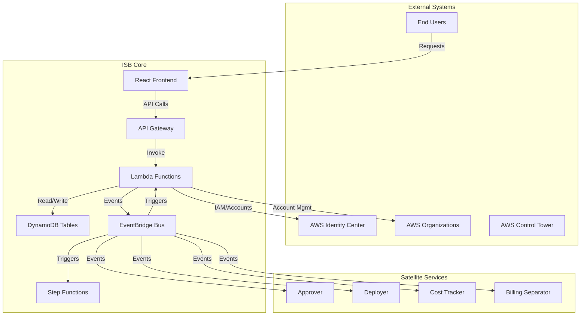
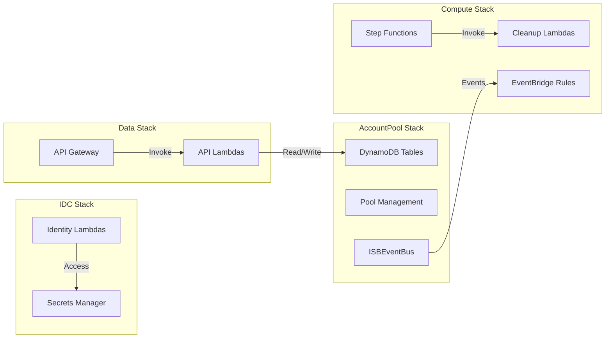
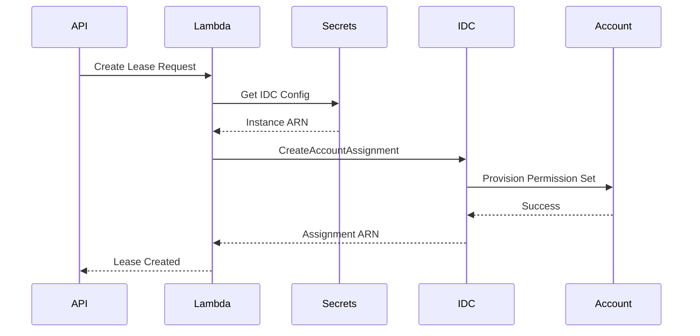
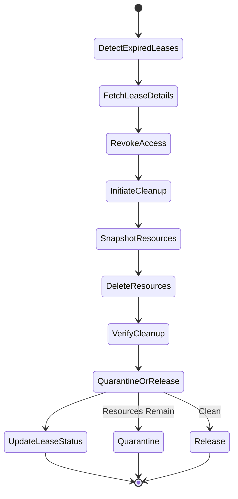
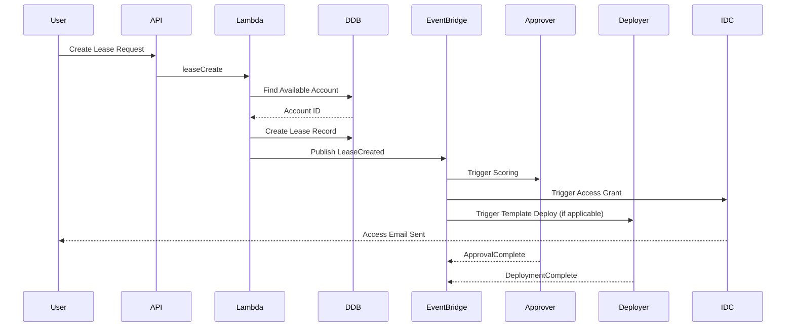
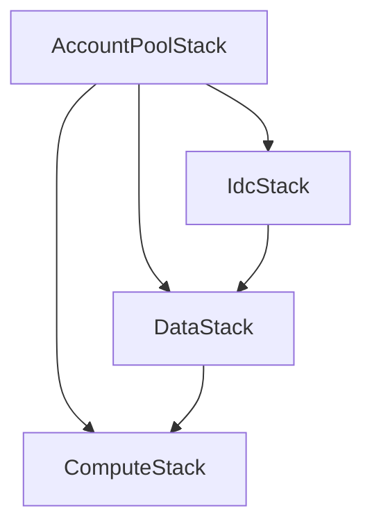

# ISB Core Architecture

## Executive Summary

The Innovation Sandbox (ISB) Core is the central orchestration platform for the National Digital Experience (NDX) program's AWS account leasing system. Built on AWS CDK with TypeScript, it manages a pool of AWS accounts that can be leased to teams for experimentation and innovation within controlled guardrails.

**Key Capabilities:**
- Account pool management with automated lifecycle operations
- Lease management with templates and quotas
- Multi-account orchestration via AWS Organizations
- Identity and access management through AWS Identity Center
- Real-time monitoring and cleanup automation
- React-based administrative frontend

**Scale:** 19 Lambda functions, 3 DynamoDB tables, 4 CDK stacks, EventBridge-driven architecture

**Status:** Production system (Phase 3) with active dependencies from Phase 4 satellites

---

## Architecture Overview

### System Context



### CDK Stack Architecture

The ISB Core is organized into four CDK stacks:



---

## CDK Stacks Deep Dive

### 1. AccountPool Stack

**Purpose:** Foundation stack managing data persistence and event infrastructure

**Resources:**
- **LeaseTable** (DynamoDB): Active leases with TTL-based expiration
- **LeaseTemplateTable** (DynamoDB): Reusable lease configurations
- **SandboxAccountTable** (DynamoDB): Pool account inventory
- **ISBEventBus** (EventBridge): Central event routing

**Key Features:**
- GSI indexes for efficient querying
- TTL attributes for automatic lease expiration
- Point-in-time recovery enabled
- Event-driven architecture foundation

**DynamoDB Schemas:**

```typescript
// LeaseTable
{
  leaseId: string,                    // Partition Key
  accountId: string,                  // AWS Account ID
  ownerId: string,                    // User identifier
  status: 'ACTIVE' | 'EXPIRED' | 'TERMINATED',
  createdAt: number,                  // Epoch timestamp
  expiresAt: number,                  // TTL attribute
  templateId?: string,                // Reference to template
  quota: {
    budget: number,
    duration: number
  },
  permissions: string[],              // Permission set ARNs
  tags: Record<string, string>
}

// LeaseTemplateTable
{
  templateId: string,                 // Partition Key
  name: string,
  description: string,
  defaultQuota: {
    budget: number,
    durationDays: number
  },
  permissionSets: string[],           // Default permissions
  constraints: {
    maxBudget?: number,
    allowedRegions?: string[],
    requiredTags?: string[]
  },
  isActive: boolean,
  createdBy: string,
  createdAt: number
}

// SandboxAccountTable
{
  accountId: string,                  // Partition Key
  status: 'AVAILABLE' | 'LEASED' | 'QUARANTINE' | 'MAINTENANCE',
  currentLeaseId?: string,
  organizationalUnit: string,         // OU path
  createdAt: number,
  lastCleanedAt?: number,
  metadata: {
    region: string,
    tags: Record<string, string>
  }
}
```

**GSI Indexes:**
- `LeasesByOwner`: ownerId (PK), createdAt (SK)
- `LeasesByStatus`: status (PK), expiresAt (SK)
- `AccountsByStatus`: status (PK), accountId (SK)

---

### 2. IDC Stack

**Purpose:** AWS Identity Center integration for federated access management

**Resources:**
- Lambda functions for permission set management
- Secrets Manager for IDC instance ARN/Store ID
- IAM roles with Organizations and SSO Admin permissions

**Key Lambdas:**
- `createPermissionSetAssignment`: Assigns users to accounts
- `deletePermissionSetAssignment`: Revokes access on lease termination
- `listPermissionSets`: Retrieves available permission templates
- `syncIdentityStore`: Syncs users/groups from Identity Center

**Integration Points:**


**Security:**
- Least privilege IAM policies
- Secrets rotation supported
- CloudTrail audit logging
- VPC endpoints for private connectivity (optional)

---

### 3. Data Stack

**Purpose:** RESTful API for lease and account management

**API Gateway Structure:**
```
POST   /leases                    - Create new lease
GET    /leases/{leaseId}          - Get lease details
PUT    /leases/{leaseId}          - Update lease (extend, modify)
DELETE /leases/{leaseId}          - Terminate lease
GET    /leases                    - List leases (with filters)

GET    /templates                 - List lease templates
GET    /templates/{templateId}    - Get template details
POST   /templates                 - Create template (admin)

GET    /accounts                  - List pool accounts
GET    /accounts/{accountId}      - Get account status
POST   /accounts                  - Add account to pool (admin)
PUT    /accounts/{accountId}      - Update account status
```

**API Lambda Functions:**

1. **leaseCreate**
   - Validates request against templates
   - Checks quota limits
   - Finds available account
   - Creates DynamoDB lease record
   - Publishes `LeaseCreated` event
   - Triggers IDC permission assignment

2. **leaseGet**
   - Retrieves lease by ID
   - Enriches with account details
   - Returns sanitized response

3. **leaseUpdate**
   - Validates modification permissions
   - Updates lease attributes
   - Publishes `LeaseModified` event
   - Supports extension requests

4. **leaseDelete**
   - Sets lease status to TERMINATED
   - Publishes `LeaseTerminated` event
   - Triggers cleanup workflow
   - Revokes IDC access

5. **leaseList**
   - Supports filtering by owner, status, template
   - Pagination with LastEvaluatedKey
   - Sorting by creation/expiration date

6. **templateOperations** (CRUD)
   - Template management for admins
   - Validation logic for constraints
   - Active/inactive flagging

7. **accountOperations** (CRUD)
   - Pool account inventory management
   - Status transitions (AVAILABLE <-> LEASED <-> QUARANTINE)
   - Metadata updates

**Authentication & Authorization:**
- API Gateway with IAM authorization
- Cognito User Pool integration (assumed)
- Request validation via JSON schemas
- Rate limiting with usage plans

**Response Format:**
```json
{
  "success": true,
  "data": {
    "leaseId": "lease-abc123",
    "accountId": "123456789012",
    "status": "ACTIVE",
    "expiresAt": 1735689600,
    "accessUrl": "https://signin.aws.amazon.com/..."
  },
  "metadata": {
    "requestId": "req-xyz",
    "timestamp": 1704067200
  }
}
```

---

### 4. Compute Stack

**Purpose:** Automated account cleanup and maintenance workflows

**Step Functions State Machine:**



**Cleanup Lambda Functions:**

1. **detectExpiredLeases**
   - Scheduled EventBridge rule (every 15 minutes)
   - Queries LeaseTable for TTL-expired records
   - Publishes `LeaseExpired` events
   - Handles grace periods

2. **revokeAccountAccess**
   - Triggered by `LeaseTerminated`/`LeaseExpired` events
   - Calls IDC to delete permission set assignments
   - Validates access revocation
   - Retries on failure (exponential backoff)

3. **inventoryResources**
   - Cross-region AWS Config aggregator queries
   - Generates snapshot of resources to delete
   - Identifies protected resources (e.g., CloudTrail)
   - Outputs deletion plan

4. **deleteEC2Resources**
   - Terminates EC2 instances
   - Deletes security groups (after dependency resolution)
   - Removes ENIs, EIPs, key pairs
   - Handles regional cleanup

5. **deleteS3Buckets**
   - Lists all S3 buckets in account
   - Empties bucket contents (including versions)
   - Deletes buckets
   - Handles cross-region replication

6. **deleteIAMResources**
   - Removes IAM users, roles, policies
   - Detaches managed policies
   - Deletes access keys and credentials
   - Preserves service-linked roles

7. **deleteCloudFormationStacks**
   - Lists all stacks across regions
   - Deletes in reverse dependency order
   - Handles stack deletion failures
   - Retains specific stacks if configured

8. **verifyCleanup**
   - Re-inventories account resources
   - Compares against pre-cleanup snapshot
   - Generates cleanup report
   - Determines quarantine vs. release

9. **updateAccountStatus**
   - Updates SandboxAccountTable status
   - Sets lastCleanedAt timestamp
   - Publishes `AccountCleaned` or `AccountQuarantined` event
   - Triggers manual review if needed

**EventBridge Rules:**

| Rule Name | Schedule | Target | Purpose |
|-----------|----------|--------|---------|
| `CheckExpiredLeases` | rate(15 minutes) | detectExpiredLeases | Find expired leases |
| `DailyPoolHealthCheck` | cron(0 9 * * ? *) | poolHealthCheck | Monitor pool capacity |
| `CleanupRetry` | rate(1 hour) | verifyCleanup | Retry quarantined cleanups |

**Event Patterns:**

```json
{
  "source": ["isb.leases"],
  "detail-type": ["LeaseTerminated", "LeaseExpired"],
  "detail": {
    "leaseId": [{"exists": true}],
    "accountId": [{"exists": true}]
  }
}
```

---

## Lambda Function Catalog

### API Layer (7 functions)

| Function | Trigger | Runtime | Timeout | Memory | Purpose |
|----------|---------|---------|---------|--------|---------|
| `leaseCreate` | API Gateway POST /leases | Node.js 20 | 30s | 512MB | Create new lease |
| `leaseGet` | API Gateway GET /leases/{id} | Node.js 20 | 10s | 256MB | Retrieve lease |
| `leaseUpdate` | API Gateway PUT /leases/{id} | Node.js 20 | 30s | 512MB | Modify lease |
| `leaseDelete` | API Gateway DELETE /leases/{id} | Node.js 20 | 30s | 512MB | Terminate lease |
| `leaseList` | API Gateway GET /leases | Node.js 20 | 30s | 512MB | Query leases |
| `templateOperations` | API Gateway /templates/* | Node.js 20 | 15s | 256MB | Template CRUD |
| `accountOperations` | API Gateway /accounts/* | Node.js 20 | 15s | 256MB | Account CRUD |

### Identity Layer (4 functions)

| Function | Trigger | Runtime | Timeout | Memory | Purpose |
|----------|---------|---------|---------|--------|---------|
| `createPermissionSetAssignment` | EventBridge LeaseCreated | Python 3.12 | 60s | 256MB | Grant account access |
| `deletePermissionSetAssignment` | EventBridge LeaseTerminated | Python 3.12 | 60s | 256MB | Revoke account access |
| `listPermissionSets` | API Gateway GET /permission-sets | Python 3.12 | 15s | 256MB | List available permissions |
| `syncIdentityStore` | EventBridge Scheduled | Python 3.12 | 300s | 512MB | Sync users/groups |

### Cleanup Layer (8 functions)

| Function | Trigger | Runtime | Timeout | Memory | Purpose |
|----------|---------|---------|---------|--------|---------|
| `detectExpiredLeases` | EventBridge rate(15m) | Python 3.12 | 60s | 256MB | Find expired leases |
| `revokeAccountAccess` | Step Functions | Python 3.12 | 60s | 256MB | Revoke IDC access |
| `inventoryResources` | Step Functions | Python 3.12 | 900s | 1024MB | Snapshot resources |
| `deleteEC2Resources` | Step Functions | Python 3.12 | 900s | 512MB | Clean EC2 |
| `deleteS3Buckets` | Step Functions | Python 3.12 | 900s | 512MB | Clean S3 |
| `deleteIAMResources` | Step Functions | Python 3.12 | 900s | 512MB | Clean IAM |
| `deleteCloudFormationStacks` | Step Functions | Python 3.12 | 900s | 512MB | Delete stacks |
| `verifyCleanup` | Step Functions | Python 3.12 | 300s | 512MB | Verify completion |

---

## React Frontend

**Architecture:**
- Single Page Application (SPA)
- React 18 with TypeScript
- Material-UI component library
- API Gateway integration via axios
- Cognito authentication

**Key Pages:**

1. **Dashboard**
   - Active leases overview
   - Quick stats (budget consumed, days remaining)
   - Recent activity feed
   - Pool capacity widget

2. **Lease Management**
   - Create lease wizard (template selection)
   - Active leases table (sortable, filterable)
   - Lease detail modal (extend, terminate)
   - Access URL generation

3. **Account Pool**
   - Pool status visualization
   - Account health metrics
   - Quarantine queue management
   - Manual account operations (admin)

4. **Templates**
   - Template library browser
   - Template editor (admin)
   - Usage statistics
   - Template cloning

5. **Reports**
   - Utilization dashboards
   - Cost reports (integration with Costs satellite)
   - Audit logs
   - Export functionality

**State Management:**
- React Context for global state
- Local state for component data
- API response caching (React Query)

**Build & Deploy:**
- Vite bundler
- S3 static hosting
- CloudFront distribution
- CodePipeline CI/CD

---

## Event-Driven Architecture

### Event Flow



### Event Catalog

**Published Events:**

| Event Type | Source | Detail | Purpose |
|------------|--------|--------|---------|
| `LeaseCreated` | isb.leases | leaseId, accountId, ownerId | Notify satellite services |
| `LeaseModified` | isb.leases | leaseId, changes | Track modifications |
| `LeaseTerminated` | isb.leases | leaseId, accountId | Trigger cleanup |
| `LeaseExpired` | isb.leases | leaseId, accountId | Auto-terminate expired |
| `AccountCleaned` | isb.accounts | accountId | Return to pool |
| `AccountQuarantined` | isb.accounts | accountId, reason | Manual review needed |
| `PoolCapacityLow` | isb.pool | availableCount, threshold | Alert admins |

**Consumed Events:**

| Event Type | Source | Consumer | Action |
|------------|--------|----------|--------|
| `ApprovalComplete` | approver | leaseUpdate | Update lease with score |
| `DeploymentComplete` | deployer | leaseUpdate | Mark template deployed |
| `CostAlertTriggered` | costs | leaseUpdate | Flag overspending |

---

## Configuration & Deployment

### Environment Variables

**Common:**
```bash
ACCOUNT_TABLE_NAME=SandboxAccountTable
LEASE_TABLE_NAME=LeaseTable
TEMPLATE_TABLE_NAME=LeaseTemplateTable
EVENT_BUS_NAME=ISBEventBus
AWS_REGION=eu-west-2
```

**IDC Stack:**
```bash
IDC_INSTANCE_ARN=arn:aws:sso:::instance/ssoins-xxxxx
IDC_STORE_ID=d-xxxxxxxxxx
SECRET_NAME=idc-config
```

**Compute Stack:**
```bash
STATE_MACHINE_ARN=arn:aws:states:eu-west-2:xxxxx:stateMachine:AccountCleanup
CLEANUP_TIMEOUT_MINUTES=120
QUARANTINE_THRESHOLD_DAYS=7
```

### CDK Deployment

```bash
# Install dependencies
npm install

# Synthesize CloudFormation
cdk synth

# Deploy all stacks
cdk deploy --all --require-approval never

# Deploy specific stack
cdk deploy AccountPoolStack

# Stack deployment order (due to dependencies)
cdk deploy AccountPoolStack       # Foundation
cdk deploy IdcStack              # Identity
cdk deploy DataStack             # API
cdk deploy ComputeStack          # Automation
```

### Stack Dependencies



---

## Integration Points

### AWS Organizations
- **Purpose:** Account creation and OU management
- **Permissions:** `organizations:CreateAccount`, `organizations:MoveAccount`
- **Pattern:** Boto3 SDK calls from Lambda
- **Rate Limits:** 1 CreateAccount per 30 seconds

### AWS Identity Center
- **Purpose:** Federated access management
- **Permissions:** `sso:CreateAccountAssignment`, `sso-directory:ListUsers`
- **Pattern:** Python SDK with retry logic
- **Caching:** Permission set ARNs cached in SSM Parameter Store

### AWS Control Tower
- **Purpose:** Baseline account configuration
- **Interaction:** Passive (accounts created in CT-managed OUs)
- **Guardrails:** Enforced by Control Tower SCPs
- **Events:** ControlTowerExecutionComplete consumed

### Satellite Services
- **Approver:** Listens for `LeaseCreated`, publishes `ApprovalComplete`
- **Deployer:** Listens for `LeaseCreated`, deploys CloudFormation templates
- **Costs:** Listens for `LeaseTerminated`, collects cost data after 24h
- **Billing Separator:** Listens for `LeaseTerminated`, quarantines accounts 72h

---

## Operational Considerations

### Monitoring

**CloudWatch Metrics:**
- `PoolCapacity` - Available accounts
- `ActiveLeases` - Current leases
- `CleanupSuccessRate` - Percentage of clean deletions
- `APILatency` - Response times
- `LeaseCreationRate` - Leases per hour

**CloudWatch Alarms:**
- Low pool capacity (< 10 accounts)
- High API error rate (> 5%)
- Cleanup failures (> 2 consecutive)
- DynamoDB throttling
- Lambda duration approaching timeout

**CloudWatch Dashboards:**
- Real-time lease activity
- Pool health metrics
- Cost attribution by lease
- API performance

### Logging

**Log Groups:**
- `/aws/lambda/isb-*` - Lambda execution logs
- `/aws/apigateway/isb-api` - API access logs
- `/aws/states/account-cleanup` - Step Functions logs

**Log Retention:** 30 days (configurable)

**Structured Logging:**
```json
{
  "timestamp": "2024-01-01T12:00:00Z",
  "level": "INFO",
  "requestId": "abc-123",
  "leaseId": "lease-xyz",
  "action": "CREATE_LEASE",
  "accountId": "123456789012",
  "duration": 1234,
  "status": "SUCCESS"
}
```

### Backup & Recovery

**DynamoDB:**
- Point-in-time recovery enabled (35 days)
- Daily automated backups
- Cross-region backup replication (optional)

**State Recovery:**
- Lease state reconstructable from DynamoDB
- Event history in EventBridge archives (7 days)
- CloudTrail for audit reconstruction

### Cost Optimization

**DynamoDB:**
- On-demand billing for variable workloads
- Consider provisioned capacity for predictable traffic
- TTL for automatic expiration (no cost)

**Lambda:**
- Right-sized memory allocation
- Provisioned concurrency for API functions (optional)
- Arm64 architecture for cost savings

**API Gateway:**
- HTTP API cheaper than REST API (consider migration)
- Caching enabled for GET endpoints (300s TTL)

---

## Issues & Recommendations

### Current Issues

1. **No Lease Extension Workflow**
   - Users cannot extend leases beyond initial duration
   - Workaround: Create new lease (loses context)
   - **Fix:** Implement `leaseUpdate` extension logic with quota validation

2. **Cleanup State Machine Single-Region**
   - Step Functions only cleans eu-west-2
   - Multi-region resources orphaned
   - **Fix:** Add parallel regional cleanup steps

3. **No Cost Quota Enforcement**
   - Budget alerts exist but no automatic suspension
   - Risk of overspending
   - **Fix:** Integrate with Costs satellite for real-time enforcement

4. **Missing Lease Approval Workflow**
   - All leases auto-approved
   - No admin review gate
   - **Fix:** Optional approval step before `LeaseCreated` event

5. **Frontend Not Production-Hardened**
   - No error boundaries
   - Limited input validation
   - **Fix:** Add comprehensive error handling and form validation

### Architectural Recommendations

1. **Implement Lease Scheduling**
   - Allow future-dated lease reservations
   - Improve resource planning

2. **Add Multi-Tenancy Support**
   - Team-level lease management
   - Shared quotas and templates

3. **Enhanced Audit Trail**
   - DynamoDB Streams to S3 for compliance
   - Searchable audit log interface

4. **Disaster Recovery**
   - Hot standby in alternate region
   - Automated failover procedures

5. **Performance Optimization**
   - DynamoDB Global Tables for multi-region writes
   - API Gateway regional endpoints
   - Lambda@Edge for frontend assets

---

## Security Considerations

### IAM Permissions

**Principle of Least Privilege:**
- Lambda execution roles scoped to specific resources
- No wildcards in policy statements
- Resource-based policies on DynamoDB tables

**Cross-Account Access:**
- Assumed roles with MFA required
- External ID for third-party access
- Time-limited session tokens

### Data Protection

**Encryption at Rest:**
- DynamoDB tables encrypted with AWS managed CMKs
- Consider CMKs for sensitive templates

**Encryption in Transit:**
- TLS 1.2+ for all API calls
- VPC endpoints for internal communication

**PII Handling:**
- No PII stored in DynamoDB (ownerId is UUID)
- User data in Identity Center only
- GDPR compliance considerations

### Network Security

**API Gateway:**
- Resource policies restricting source IPs (optional)
- WAF integration for DDoS protection
- Rate limiting per API key

**Lambda:**
- VPC deployment optional (consider for compliance)
- Security groups restricting outbound traffic
- PrivateLink for AWS service access

---

## Testing Strategy

### Unit Tests
- Lambda function logic (Jest/pytest)
- API request validation
- DynamoDB schema validation
- 80% code coverage target

### Integration Tests
- API endpoint testing (Postman/Newman)
- EventBridge event routing
- Step Functions state transitions
- DynamoDB integration

### End-to-End Tests
- Full lease lifecycle (create -> use -> terminate)
- Multi-account scenarios
- Cleanup verification
- Frontend UI tests (Cypress)

### Load Tests
- API concurrency testing (Locust)
- DynamoDB throughput testing
- Lambda cold start optimization
- Target: 100 concurrent users

---

## Future Enhancements

1. **Self-Service Portal**
   - Public signup flow integration
   - Automated approval for qualified users

2. **Advanced Scheduling**
   - Recurring leases
   - Lease templates with schedules

3. **Resource Tagging Automation**
   - Auto-tag all resources with lease metadata
   - Cost allocation by tag

4. **Compliance Scanning**
   - Pre-termination security scans
   - Vulnerability reports

5. **Machine Learning**
   - Lease duration prediction
   - Pool capacity forecasting
   - Anomaly detection for unusual usage

---

## References

- **Repository:** ndx-aws-isb (Phase 3)
- **Related Docs:**
  - [20-approver-system.md](20-approver-system.md)
  - [23-deployer.md](23-deployer.md)
  - [22-cost-tracking.md](22-cost-tracking.md)
- **AWS Services:** Organizations, Identity Center, EventBridge, Step Functions, DynamoDB
- **Contact:** ISB Core Team

---

**Document Version:** 1.0
**Last Updated:** 2024-01-01
**Status:** Production System
