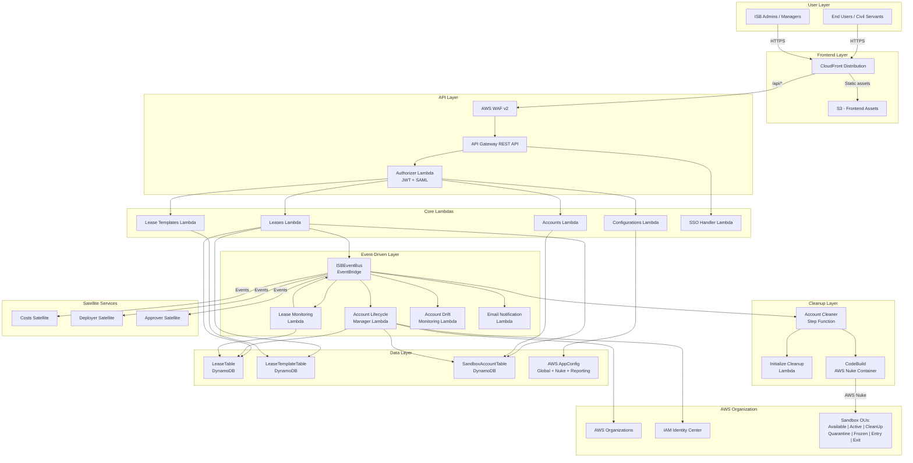
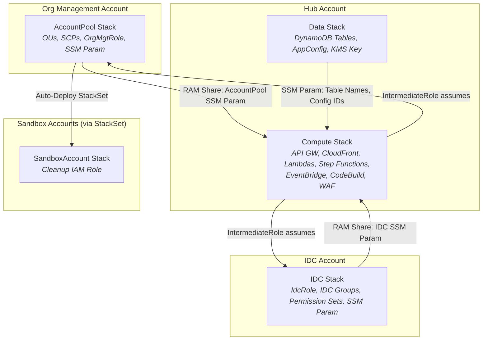
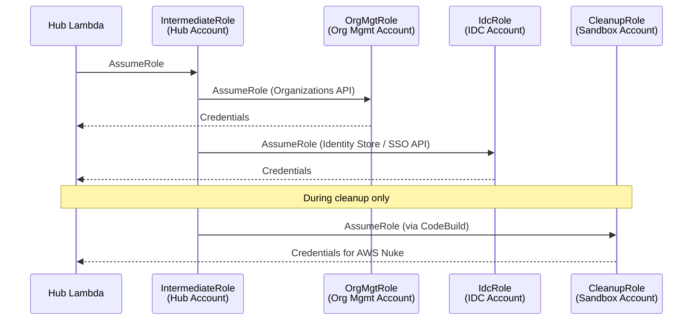

# ISB Core Architecture

> **Last Updated**: 2026-03-02
> **Source**: [co-cddo/innovation-sandbox-on-aws](https://github.com/co-cddo/innovation-sandbox-on-aws)
> **Captured SHA**: `cf75b87`

## Executive Summary

The Innovation Sandbox on AWS (ISB) is a multi-account orchestration platform built with AWS CDK and TypeScript that manages temporary AWS sandbox accounts for experimentation and learning. It is deployed across five CloudFormation stacks (AccountPool, IDC, Data, Compute, and SandboxAccount via StackSet), uses DynamoDB for state persistence, API Gateway with CloudFront for its REST API and React frontend, EventBridge for event-driven coordination, and Step Functions with CodeBuild for automated account cleanup using AWS Nuke. The CDDO fork at version 1.1.4 (solution ID SO0284) extends the upstream AWS Solutions implementation with satellite services for cost tracking, scenario deployment, and enhanced approvals.

## Architecture Overview

### System Context


```mermaid
graph TB
    subgraph "User Layer"
        USERS[End Users / Civil Servants]
        ADMINS[ISB Admins / Managers]
    end

    subgraph "Frontend Layer"
        CF[CloudFront Distribution]
        S3FE[S3 - Frontend Assets]
    end

    subgraph "API Layer"
        APIGW[API Gateway REST API]
        WAF[AWS WAF v2]
        AUTH[Authorizer Lambda<br/>JWT + SAML]
    end

    subgraph "Core Lambdas"
        LEASES[Leases Lambda]
        TEMPLATES[Lease Templates Lambda]
        ACCOUNTS[Accounts Lambda]
        CONFIG[Configurations Lambda]
        SSO[SSO Handler Lambda]
    end

    subgraph "Event-Driven Layer"
        EB[ISBEventBus<br/>EventBridge]
        ALM[Account Lifecycle<br/>Manager Lambda]
        LM[Lease Monitoring<br/>Lambda]
        ADM[Account Drift<br/>Monitoring Lambda]
        EMAIL[Email Notification<br/>Lambda]
    end

    subgraph "Cleanup Layer"
        SFN[Account Cleaner<br/>Step Function]
        INIT[Initialize Cleanup<br/>Lambda]
        CB[CodeBuild<br/>AWS Nuke Container]
    end

    subgraph "Data Layer"
        LEASE_TBL[LeaseTable<br/>DynamoDB]
        TEMPLATE_TBL[LeaseTemplateTable<br/>DynamoDB]
        ACCOUNT_TBL[SandboxAccountTable<br/>DynamoDB]
        APPCONFIG[AWS AppConfig<br/>Global + Nuke + Reporting]
    end

    subgraph "AWS Organization"
        ORGS[AWS Organizations]
        IDC[IAM Identity Center]
        OUs["Sandbox OUs:<br/>Available | Active | CleanUp<br/>Quarantine | Frozen | Entry | Exit"]
    end

    subgraph "Satellite Services"
        COSTS[Costs Satellite]
        DEPLOYER[Deployer Satellite]
        APPROVER[Approver Satellite]
    end

    USERS -->|HTTPS| CF
    ADMINS -->|HTTPS| CF
    CF -->|Static assets| S3FE
    CF -->|/api/*| WAF
    WAF --> APIGW
    APIGW --> AUTH
    AUTH --> LEASES
    AUTH --> TEMPLATES
    AUTH --> ACCOUNTS
    AUTH --> CONFIG
    APIGW --> SSO

    LEASES --> LEASE_TBL
    LEASES --> ACCOUNT_TBL
    LEASES --> TEMPLATE_TBL
    LEASES --> EB
    TEMPLATES --> TEMPLATE_TBL
    ACCOUNTS --> ACCOUNT_TBL
    CONFIG --> APPCONFIG

    EB --> ALM
    EB --> LM
    EB --> ADM
    EB --> EMAIL
    EB --> SFN
    EB -->|Events| COSTS
    EB -->|Events| DEPLOYER
    EB -->|Events| APPROVER

    ALM --> ORGS
    ALM --> IDC
    ALM --> ACCOUNT_TBL
    ALM --> LEASE_TBL
    LM --> LEASE_TBL
    LM --> EB

    SFN --> INIT
    SFN --> CB
    CB -->|AWS Nuke| OUs
```

### CDK Stack Architecture

The solution is organized into five CloudFormation stacks with clear separation of concerns. The AccountPool and IDC stacks deploy to the Organizations management account and IDC account respectively, while Data and Compute stacks deploy to the hub account. A StackSet deploys resources into each sandbox account.


```mermaid
graph TD
    subgraph "Org Management Account"
        AP["AccountPool Stack<br/><i>OUs, SCPs, OrgMgtRole, SSM Param</i>"]
    end

    subgraph "IDC Account"
        IDC_STACK["IDC Stack<br/><i>IdcRole, IDC Groups, Permission Sets, SSM Param</i>"]
    end

    subgraph "Hub Account"
        DATA["Data Stack<br/><i>DynamoDB Tables, AppConfig, KMS Key</i>"]
        COMPUTE["Compute Stack<br/><i>API GW, CloudFront, Lambdas, Step Functions,<br/>EventBridge, CodeBuild, WAF</i>"]
    end

    subgraph "Sandbox Accounts (via StackSet)"
        SA["SandboxAccount Stack<br/><i>Cleanup IAM Role</i>"]
    end

    AP -->|RAM Share: AccountPool SSM Param| COMPUTE
    IDC_STACK -->|RAM Share: IDC SSM Param| COMPUTE
    DATA -->|SSM Param: Table Names, Config IDs| COMPUTE
    AP -->|Auto-Deploy StackSet| SA
    COMPUTE -->|IntermediateRole assumes| AP
    COMPUTE -->|IntermediateRole assumes| IDC_STACK
```

**Deployment order**: AccountPool -> IDC -> Data -> Compute

**Source**: `source/infrastructure/lib/isb-account-pool-stack.ts`, `isb-idc-stack.ts`, `isb-data-stack.ts`, `isb-compute-stack.ts`

---

## CDK Stacks Deep Dive

### 1. AccountPool Stack (`InnovationSandbox-AccountPool`)

**Deploys to**: Organizations management account

**Purpose**: Creates the organizational structure, Service Control Policies, and cross-account roles for sandbox account management.

**Resources created**:

| Resource | Type | Purpose |
|----------|------|---------|
| `InnovationSandboxAccountPoolOu` | `CfnOrganizationalUnit` | Root OU for all sandbox accounts |
| `AvailableOu` | `CfnOrganizationalUnit` | Accounts ready for leasing |
| `ActiveOu` | `CfnOrganizationalUnit` | Currently leased accounts |
| `CleanUpOu` | `CfnOrganizationalUnit` | Accounts undergoing AWS Nuke cleanup |
| `QuarantineOu` | `CfnOrganizationalUnit` | Failed cleanup, manual review needed |
| `FrozenOu` | `CfnOrganizationalUnit` | Frozen leases, resources preserved |
| `EntryOu` | `CfnOrganizationalUnit` | New accounts being registered |
| `ExitOu` | `CfnOrganizationalUnit` | Accounts being decommissioned |
| `OrgMgtRole` | `IAM Role` | Assumed by hub for Organizations API calls |
| 5 SCPs | `CfnPolicy` | Security guardrails (see below) |
| `IsbStackSet` | `CfnStackSet` | Auto-deploys cleanup role to sandbox accounts |
| `AccountPoolConfiguration` | `SSM Parameter` | Shared config (OU IDs, regions) via RAM |
| `CostAllocationTagActivator` | Custom Resource | Activates ISB cost allocation tags |

**Service Control Policies**:

| SCP | Target | Purpose |
|-----|--------|---------|
| `AwsNukeSupportedServicesScp` | Root sandbox OU | Allow only AWS Nuke-supported services |
| `RestrictionsScp` | Root sandbox OU | Restrict security, isolation, cost, and operations resources |
| `ProtectISBResourcesScp` | Root sandbox OU | Protect ISB control plane resources |
| `LimitRegionsScp` | Root sandbox OU | Restrict to configured AWS regions |
| `WriteProtectionScp` | Available, CleanUp, Quarantine, Entry, Exit OUs | Block all create/modify actions |

**Parameters**: `Namespace`, `HubAccountId`, `ParentOuId`, `IsbManagedRegions`

**Source**: `source/infrastructure/lib/isb-account-pool-resources.ts`

---

### 2. IDC Stack (`InnovationSandbox-IDC`)

**Deploys to**: IAM Identity Center account (often the Org management account)

**Purpose**: Configures IAM Identity Center groups, permission sets, and cross-account roles for federated access.

**Resources created**:

| Resource | Type | Purpose |
|----------|------|---------|
| `IdcConfigurer` | Custom Resource Lambda | Creates Admin/Manager/User groups and permission sets in IDC |
| `IdcRole` | `IAM Role` | Assumed by hub for Identity Store and SSO API calls |
| `IdcConfiguration` | `SSM Parameter` | Shared config (group IDs, permission set ARNs) via RAM |

**IdcRole permissions**:
- `identitystore:GetUserId`, `DescribeUser` -- user lookup
- `identitystore:ListGroups`, `ListGroupMemberships`, `ListGroupMembershipsForMember` -- group membership
- `sso:ListPermissionSets`, `DescribePermissionSet` -- enumerate permission sets
- `sso:CreateAccountAssignment`, `DeleteAccountAssignment`, `ListAccountAssignments` -- manage account access

**Parameters**: `Namespace`, `OrgMgtAccountId`, `HubAccountId`, `IdentityStoreId`, `SsoInstanceArn`, `AdminGroupName`, `ManagerGroupName`, `UserGroupName`

**Source**: `source/infrastructure/lib/isb-idc-resources.ts`

---

### 3. Data Stack (`InnovationSandbox-Data`)

**Deploys to**: Hub account

**Purpose**: Persistent data layer with DynamoDB tables and AppConfig configuration profiles.

**DynamoDB Tables**:

| Table | Partition Key | Sort Key | GSI | TTL | Purpose |
|-------|--------------|----------|-----|-----|---------|
| `SandboxAccountTable` | `awsAccountId` (String) | -- | -- | -- | Pool account inventory |
| `LeaseTemplateTable` | `uuid` (String) | -- | -- | -- | Reusable lease configurations |
| `LeaseTable` | `userEmail` (String) | `uuid` (String) | `StatusIndex` | `ttl` | Lease records and lifecycle |

**LeaseTable GSI `StatusIndex`**: Partition key = `status`, Sort key = `originalLeaseTemplateUuid`

**AppConfig Profiles**:
- **Global Config**: Maintenance mode, lease limits, cleanup settings, auth config, email settings
- **Nuke Config**: AWS Nuke YAML configuration (protected resources, settings, exclusions)
- **Reporting Config**: Cost reporting group configuration

All tables use:
- PAY_PER_REQUEST billing mode
- Point-in-time recovery enabled
- Customer-managed KMS encryption
- Deletion protection enabled in production mode

**Parameters**: `Namespace`

**Source**: `source/infrastructure/lib/isb-data-resources.ts`

---

### 4. Compute Stack (`InnovationSandbox-Compute`)

**Deploys to**: Hub account

**Purpose**: The main operational stack containing the API, frontend, event processing, account cleanup, and observability infrastructure.

**Major components**:

| Component | Type | Source File |
|-----------|------|------------|
| `IsbRestApi` | API Gateway REST API + WAF | `components/api/rest-api-all.ts` |
| `CloudFrontUiApi` | CloudFront + S3 frontend | `components/cloudfront/cloudfront-ui-api.ts` |
| `ISBEventBus` | EventBridge custom event bus | `components/events/isb-internal-core.ts` |
| `AccountCleaner` | Step Functions + CodeBuild | `components/account-cleaner/account-cleaner.ts` |
| `IntermediateRole` | IAM Role for cross-account | `helpers/isb-roles.ts` |
| `LeaseMonitoringLambda` | Scheduled Lambda | `components/account-management/lease-monitoring-lambda.ts` |
| `AccountLifecycleManagementLambda` | Event-driven Lambda | `components/account-management/account-lifecycle-management-lambda.ts` |
| `AccountDriftMonitoringLambda` | Scheduled Lambda | `components/account-management/account-drift-monitoring-lambda.ts` |
| `EmailNotificationLambda` | Event-driven Lambda | `components/notification/email-notification.ts` |
| `CostReportingLambda` | Reporting Lambda | `components/observability/cost-reporting-lambda.ts` |
| `GroupCostReportingLambda` | Reporting Lambda | `components/observability/group-cost-reporting-lambda.ts` |
| `LogArchiving` | Log management | `components/observability/log-archiving.ts` |
| `LogInsightsQueries` | Pre-built queries | `components/observability/log-insights-queries.ts` |
| `ApplicationInsights` | CloudWatch App Insights | `components/observability/app-insights.ts` |

**Parameters**: `Namespace`, `OrgMgtAccountId`, `IdcAccountId`, `AllowListedIPRanges`, `UseStableTagging`, `AcceptSolutionTermsOfUse`

**Source**: `source/infrastructure/lib/isb-compute-resources.ts`

---

### 5. SandboxAccount Stack (via StackSet)

**Deploys to**: Every account in the sandbox OU (auto-deployed)

**Purpose**: Creates the IAM role that CodeBuild assumes during AWS Nuke cleanup.

**Resources**: Single IAM Role (`{namespace}_IsbCleanupRole`) with permissions to delete resources in the account, assumed by the hub account's IntermediateRole.

**Source**: `source/infrastructure/lib/isb-sandbox-account-resources.ts`, `isb-sandbox-account-stack.ts`

---

## Lambda Function Catalog

### API Layer

| Function | Source | Trigger | Purpose |
|----------|--------|---------|---------|
| `AuthorizerLambdaFunction` | `lambdas/api/authorizer/` | API Gateway Request Authorizer | JWT validation and role-based access control |
| `SsoHandler` | `lambdas/api/sso-handler/` | API Gateway `/auth/{action+}` (no auth) | SAML SSO login/logout, JWT token issuance |
| `LeasesLambdaFunction` | `lambdas/api/leases/` | API Gateway `/leases/*` | CRUD for leases, approval, freeze/unfreeze, terminate |
| `LeaseTemplatesLambdaFunction` | `lambdas/api/lease-templates/` | API Gateway `/leaseTemplates/*` | CRUD for lease templates |
| `AccountsLambdaFunction` | `lambdas/api/accounts/` | API Gateway `/accounts/*` | Account pool management, registration |
| `ConfigurationsLambdaFunction` | `lambdas/api/configurations/` | API Gateway `/configurations` | Global/nuke/reporting config read/write |

### Account Management Layer

| Function | Source | Trigger | Purpose |
|----------|--------|---------|---------|
| `AccountLifecycleManagementLambda` | `lambdas/account-management/account-lifecycle-management/` | EventBridge via SQS | Responds to lease events; moves accounts between OUs, manages IDC assignments |
| `LeaseMonitoringLambda` | `lambdas/account-management/lease-monitoring/` | EventBridge scheduled rule | Checks budgets and durations for active/frozen leases, publishes alerts |
| `AccountDriftMonitoringLambda` | `lambdas/account-management/account-drift-monitoring/` | EventBridge scheduled rule | Detects drift in sandbox account configurations |

### Cleanup Layer

| Function | Source | Trigger | Purpose |
|----------|--------|---------|---------|
| `InitializeCleanupLambda` | `lambdas/account-cleanup/initialize-cleanup/` | Step Functions invoke | Validates cleanup preconditions, loads config, prevents duplicate cleanups |

### Notification Layer

| Function | Source | Trigger | Purpose |
|----------|--------|---------|---------|
| `EmailNotificationLambda` | `lambdas/notification/email-notification/` | EventBridge via SQS | Sends SES emails for lease events (created, approved, denied, alerts, etc.) |

### Observability Layer

| Function | Source | Trigger | Purpose |
|----------|--------|---------|---------|
| `CostReportingLambda` | `lambdas/metrics/cost-reporting/` | Scheduled | Per-account cost reporting via Cost Explorer |
| `GroupCostReportingLambda` | `lambdas/metrics/group-cost-reporting/` | Scheduled | Aggregated cost reporting by cost report group |
| `DeploymentSummaryHeartbeat` | `lambdas/metrics/deployment-summary-heartbeat/` | Scheduled | Anonymized metrics for AWS Solutions |
| `LogArchivingLambda` | `lambdas/metrics/log-archiving/` | Scheduled | Archives logs to S3 |
| `LogSubscriberLambda` | `lambdas/metrics/log-subscriber/` | Custom Resource | Manages CloudWatch log subscriptions |

### Custom Resource Layer

| Function | Source | Trigger | Purpose |
|----------|--------|---------|---------|
| `IdcConfigurerLambda` | `lambdas/custom-resources/idc-configurer/` | CloudFormation | Creates IDC groups and permission sets |
| `DeploymentUUIDLambda` | `lambdas/custom-resources/deployment-uuid/` | CloudFormation | Generates unique deployment ID |
| `CostAllocationTagActivator` | `lambdas/custom-resources/cost-allocation-tag-activator/` | CloudFormation | Activates cost allocation tags |
| `SharedJsonParamParser` | `lambdas/custom-resources/shared-json-param-parser/` | CloudFormation | Parses shared SSM parameters from other stacks |
| `JwtSecretRotator` | `lambdas/helpers/secret-rotator/` | Secrets Manager rotation schedule | Rotates JWT signing secret every 30 days |

**Runtime**: All Lambdas are TypeScript compiled to ES modules, running on Node.js 22.

---

## REST API Endpoints

### API Gateway Structure

The API is exposed through CloudFront at `/api/*`, with a CloudFront Function stripping the `/api` prefix before forwarding to API Gateway. Authentication uses a custom Request Authorizer that validates JWT tokens.

| Method | Path | Roles | Lambda | Purpose |
|--------|------|-------|--------|---------|
| GET | `/leases` | User, Manager, Admin | Leases | List leases |
| POST | `/leases` | User, Manager, Admin | Leases | Create lease |
| GET | `/leases/{leaseId}` | User, Manager, Admin | Leases | Get lease details |
| PATCH | `/leases/{leaseId}` | Manager, Admin | Leases | Update lease |
| POST | `/leases/{leaseId}/review` | Manager, Admin | Leases | Approve/deny lease |
| POST | `/leases/{leaseId}/terminate` | Manager, Admin | Leases | Terminate lease |
| POST | `/leases/{leaseId}/freeze` | Manager, Admin | Leases | Freeze lease |
| POST | `/leases/{leaseId}/unfreeze` | Manager, Admin | Leases | Unfreeze lease |
| GET | `/leaseTemplates` | User, Manager, Admin | LeaseTemplates | List templates |
| POST | `/leaseTemplates` | Manager, Admin | LeaseTemplates | Create template |
| GET | `/leaseTemplates/{uuid}` | User, Manager, Admin | LeaseTemplates | Get template |
| PUT | `/leaseTemplates/{uuid}` | Manager, Admin | LeaseTemplates | Update template |
| DELETE | `/leaseTemplates/{uuid}` | Manager, Admin | LeaseTemplates | Delete template |
| GET | `/accounts` | Admin | Accounts | List pool accounts |
| POST | `/accounts` | Admin | Accounts | Register accounts |
| GET | `/accounts/{id}` | Admin | Accounts | Get account details |
| POST | `/accounts/{id}/retryCleanup` | Admin | Accounts | Retry failed cleanup |
| POST | `/accounts/{id}/eject` | Admin | Accounts | Eject account from pool |
| GET | `/accounts/unregistered` | Admin | Accounts | List unregistered accounts in sandbox OUs |
| GET | `/configurations` | User, Manager, Admin | Configurations | Read AppConfig settings |
| GET/POST | `/auth/{action+}` | (No auth) | SSO Handler | SAML SSO login/logout/callback |

**WAF rules**: IP allowlist, rate limiting (200 req/min per IP), AWS Managed Rules (Common, IP Reputation, Anonymous IP).

**Source**: `source/lambdas/api/authorizer/src/authorization-map.ts`, `source/infrastructure/lib/components/api/`

---

## Event-Driven Architecture

### EventBridge Event Catalog

All events flow through the `ISBEventBus` custom EventBridge bus, which has a DLQ and logs all events to CloudWatch.

| Event DetailType | Source | Trigger | Consumers |
|-----------------|--------|---------|-----------|
| `LeaseRequested` | `leases-api` | POST /leases (pending approval) | Email notification |
| `LeaseApproved` | `leases-api` | Approval or auto-approve | Account Lifecycle Manager, Email, Deployer satellite |
| `LeaseDenied` | `leases-api` | Manager denial | Email notification |
| `LeaseTerminated` | `leases-api` | Manual termination | Account Lifecycle Manager, Email, Costs satellite |
| `LeaseFrozen` | `leases-api` | Freeze request | Account Lifecycle Manager, Email |
| `LeaseUnfrozen` | `leases-api` | Unfreeze request | Account Lifecycle Manager, Email |
| `LeaseBudgetExceeded` | `lease-monitoring` | Cost exceeds maxSpend | Account Lifecycle Manager, Email |
| `LeaseExpired` | `lease-monitoring` | Duration exceeded | Account Lifecycle Manager, Email |
| `LeaseBudgetThresholdAlert` | `lease-monitoring` | Cost crosses threshold | Email notification |
| `LeaseDurationThresholdAlert` | `lease-monitoring` | Time threshold breached | Email notification |
| `LeaseFreezingThresholdAlert` | `lease-monitoring` | 90% budget threshold | Account Lifecycle Manager (auto-freeze) |
| `CleanAccountRequest` | `account-lifecycle-manager` | Lease terminal state | Account Cleaner Step Function |
| `AccountCleanupSucceeded` | `account-cleaner` | AWS Nuke success | Account Lifecycle Manager |
| `AccountCleanupFailed` | `account-cleaner` | AWS Nuke failure | Account Lifecycle Manager |
| `AccountQuarantined` | `account-lifecycle-manager` | Cleanup exhausted retries | Email notification |
| `AccountDriftDetected` | `account-drift-monitoring` | Config drift found | Account Lifecycle Manager |
| `GroupCostReportGenerated` | `group-cost-reporting` | Scheduled report | Email notification |
| `GroupCostReportGeneratedFailure` | `group-cost-reporting` | Report generation failed | Email notification |

**Source**: `source/common/events/index.ts`, `source/common/events/*.ts`

---

## Data Schemas

### LeaseTable Schema (Zod-validated)

The lease schema uses a discriminated union based on `status`:

```
LeaseKey: { userEmail: string (email), uuid: string (UUID) }

PendingLease: LeaseKey + {
  status: "PendingApproval",
  originalLeaseTemplateUuid, originalLeaseTemplateName,
  maxSpend?, leaseDurationInHours?, budgetThresholds?, durationThresholds?,
  costReportGroup?, comments?, createdBy?,
  versionNumber, createdDate, lastModifiedDate
}

ApprovalDeniedLease: PendingLease + {
  status: "ApprovalDenied",
  ttl: number (Unix timestamp for DynamoDB TTL)
}

MonitoredLease (Active | Frozen): PendingLease + {
  status: "Active" | "Frozen",
  awsAccountId, approvedBy (email | "AUTO_APPROVED"),
  startDate (ISO 8601), expirationDate? (ISO 8601),
  lastCheckedDate (ISO 8601), totalCostAccrued: number
}

ExpiredLease: MonitoredLease + {
  status: "Expired" | "BudgetExceeded" | "ManuallyTerminated" | "AccountQuarantined" | "Ejected",
  endDate (ISO 8601), ttl: number
}
```

**Source**: `source/common/data/lease/lease.ts`

### SandboxAccountTable Schema

```
SandboxAccount: {
  awsAccountId: string (12 digits),
  email?: string,
  name?: string (max 50),
  status: "Available" | "Active" | "CleanUp" | "Quarantine" | "Frozen",
  driftAtLastScan?: boolean,
  cleanupExecutionContext?: {
    stateMachineExecutionArn: string,
    stateMachineExecutionStartTime: string (ISO 8601)
  },
  versionNumber, createdDate, lastModifiedDate
}
```

**Source**: `source/common/data/sandbox-account/sandbox-account.ts`

### LeaseTemplateTable Schema

```
LeaseTemplate: {
  uuid: string (UUID),
  name: string (1-50 chars),
  description?: string,
  requiresApproval: boolean,
  createdBy: string (email),
  visibility: "PUBLIC" | "PRIVATE",
  maxSpend?: number (> 0),
  budgetThresholds?: [{ dollarsSpent: number, action: "ALERT" | "FREEZE_ACCOUNT" }],
  leaseDurationInHours?: number (> 0),
  durationThresholds?: [{ hoursRemaining: number, action: "ALERT" | "FREEZE_ACCOUNT" }],
  costReportGroup?: string (1-50 chars),
  versionNumber, createdDate, lastModifiedDate
}
```

**Source**: `source/common/data/lease-template/lease-template.ts`

---

## Cross-Account Role Chain

The ISB uses a two-hop role chain for cross-account operations:


```mermaid
sequenceDiagram
    participant Lambda as Hub Lambda
    participant IR as IntermediateRole<br/>(Hub Account)
    participant OrgRole as OrgMgtRole<br/>(Org Mgmt Account)
    participant IdcRole as IdcRole<br/>(IDC Account)
    participant SandboxRole as CleanupRole<br/>(Sandbox Account)

    Lambda->>IR: AssumeRole
    IR->>OrgRole: AssumeRole (Organizations API)
    OrgRole-->>Lambda: Credentials

    IR->>IdcRole: AssumeRole (Identity Store / SSO API)
    IdcRole-->>Lambda: Credentials

    Note over Lambda,SandboxRole: During cleanup only
    IR->>SandboxRole: AssumeRole (via CodeBuild)
    SandboxRole-->>Lambda: Credentials for AWS Nuke
```

Each role in the chain trusts only the IntermediateRole, which in turn only allows assumption by specific Lambda execution roles. The IntermediateRole ARN is verified via `aws:PrincipalArn` conditions.

---

## Configuration via AppConfig

ISB uses AWS AppConfig for runtime configuration with three profiles:

**Global Config** (`global-config.yaml`):
- `maintenanceMode`: boolean (blocks new lease requests)
- `termsOfService`: multi-line text displayed during lease request
- `leases.requireMaxBudget/maxBudget/requireMaxDuration/maxDurationHours/maxLeasesPerUser/ttl`
- `cleanup.numberOfFailedAttemptsToCancelCleanup/waitBeforeRetryFailedAttemptSeconds/numberOfSuccessfulAttemptsToFinishCleanup/waitBeforeRerunSuccessfulAttemptSeconds`
- `auth.idpSignInUrl/idpSignOutUrl/idpAudience/webAppUrl/awsAccessPortalUrl/sessionDurationInMinutes`
- `notification.emailFrom`

**Nuke Config** (`nuke-config.yaml`):
- AWS Nuke YAML with region list, settings, resource type exclusions, blocklist, and per-account filters
- Placeholders `%CLEANUP_ACCOUNT_ID%`, `%HUB_ACCOUNT_ID%`, `%CLEANUP_ROLE_NAME%` are replaced at runtime

**Reporting Config** (`reporting-config.yaml`):
- Cost report group settings

**Source**: `source/infrastructure/lib/components/config/`

---

## Security Architecture

### Authentication Flow

ISB uses SAML 2.0 SSO with IAM Identity Center, not Cognito:

1. User accesses CloudFront URL
2. Frontend checks for JWT token
3. If no token, redirects to IAM Identity Center sign-in URL (SAML 2.0)
4. User authenticates with Identity Center
5. SAML assertion sent to `/auth/saml/callback` endpoint
6. SSO Handler Lambda validates SAML assertion against stored IDP certificate
7. Lambda issues signed JWT token (signed with rotating Secrets Manager secret)
8. JWT stored in browser, sent as `Authorization: Bearer` header
9. Request Authorizer Lambda validates JWT signature and extracts roles

**Roles**: Admin, Manager, User (mapped from IDC group membership)

### WAF Protection

The REST API is protected by AWS WAF v2 with:
- IP allowlist (configurable CIDR ranges)
- Rate limiting: 200 requests per 60 seconds per IP (via `X-Forwarded-For`)
- AWS Managed Rules: Common Rule Set, Amazon IP Reputation List, Anonymous IP List

### KMS Encryption

A single customer-managed KMS key per namespace encrypts:
- All three DynamoDB tables
- EventBridge event bus
- SQS queues (including DLQs)
- S3 buckets (frontend assets, logging)
- Secrets Manager secrets (JWT secret, IDP certificate)
- CloudWatch Logs

---

## Deployment

### From Source

```bash
# Initialize environment
npm run env:init     # Creates .env file
# Edit .env with required values

# Bootstrap CDK
npm run bootstrap

# Deploy all stacks in order
npm run deploy:all
# OR individually:
npm run deploy:account-pool
npm run deploy:idc
npm run deploy:data
npm run deploy:compute
```

### Key Environment Variables

| Variable | Description |
|----------|-------------|
| `HUB_ACCOUNT_ID` | AWS account ID for the hub/compute stack |
| `ORG_MGT_ACCOUNT_ID` | Organizations management account ID |
| `IDC_ACCOUNT_ID` | IAM Identity Center account ID |
| `NAMESPACE` | Stack prefix (e.g., `ndx`) |
| `PARENT_OU_ID` | Parent OU or root ID for sandbox OU creation |
| `AWS_REGIONS` | Comma-separated list of managed regions |
| `IDENTITY_STORE_ID` | Identity Center store ID (d-xxxxxxxxxx) |
| `SSO_INSTANCE_ARN` | SSO instance ARN |
| `ADMIN/MANAGER/USER_GROUP_NAME` | IDC group names |
| `DEPLOYMENT_MODE` | `dev` or `prod` (affects deletion protection) |

**Source**: `package.json` (root)

---

## Monorepo Structure

```
root/
  package.json                    # Orchestration scripts, workspace config
  source/
    common/                       # Shared libraries (Zod schemas, events, SDK clients)
      data/                       # DynamoDB entity schemas and stores
      events/                     # EventBridge event type definitions
      isb-services/               # Business logic services
      lambda/                     # Middleware bundles, env schemas
      sdk-clients/                # Typed AWS SDK client wrappers
    frontend/                     # React SPA (see 12-isb-frontend.md)
    infrastructure/               # CDK stacks and constructs
      lib/
        components/               # Reusable CDK constructs
          account-cleaner/        # Step Function + CodeBuild
          account-management/     # Lifecycle, monitoring, drift Lambdas
          api/                    # REST API resource definitions
          cloudfront/             # CloudFront + S3 hosting
          config/                 # AppConfig setup and defaults
          events/                 # EventBridge bus and rules
          notification/           # Email notification Lambda
          observability/          # Logging, metrics, dashboards
          service-control-policies/  # SCP JSON definitions
        helpers/                  # CDK utilities, role helpers, policy generators
    lambdas/                      # Lambda handler code
      api/                        # API handlers (leases, templates, accounts, auth)
      account-cleanup/            # Initialize cleanup handler
      account-management/         # Lifecycle, monitoring, drift handlers
      custom-resources/           # CFN custom resource handlers
      metrics/                    # Cost reporting, log archiving
      notification/               # Email handler
    layers/                       # Lambda layers (shared dependencies)
  deployment/                     # CloudFormation distributable build scripts
  scripts/                        # Repository maintenance scripts
```

---

## Related Documentation

- [11-lease-lifecycle.md](./11-lease-lifecycle.md) -- Lease state machine and transitions
- [12-isb-frontend.md](./12-isb-frontend.md) -- React frontend architecture
- [13-isb-customizations.md](./13-isb-customizations.md) -- CDDO customizations vs upstream
- [20-approver-system.md](./20-approver-system.md) -- Approver satellite service
- [21-billing-separator.md](./21-billing-separator.md) -- Billing separator satellite
- [22-cost-tracking.md](./22-cost-tracking.md) -- Cost tracking satellite
- [23-deployer.md](./23-deployer.md) -- Deployer satellite service
- [05-service-control-policies.md](./05-service-control-policies.md) -- SCP analysis

---
*Generated from source analysis. See [00-repo-inventory.md](./00-repo-inventory.md) for full inventory.*
