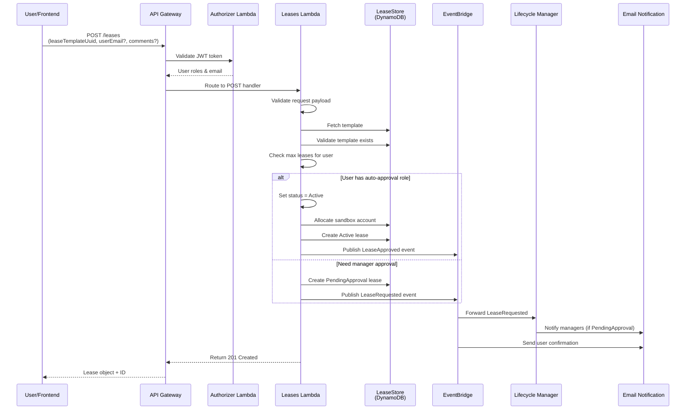
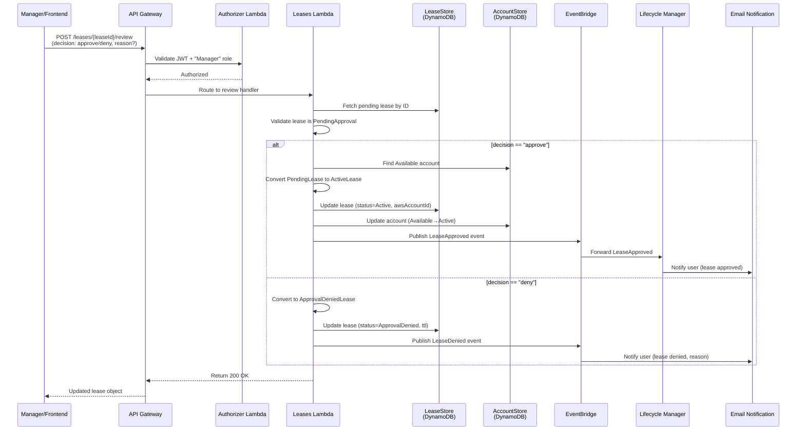
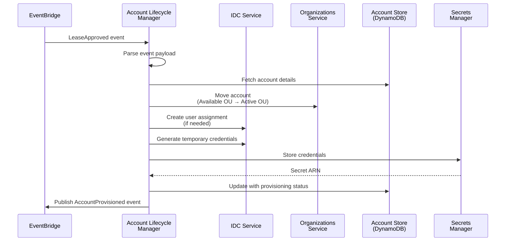
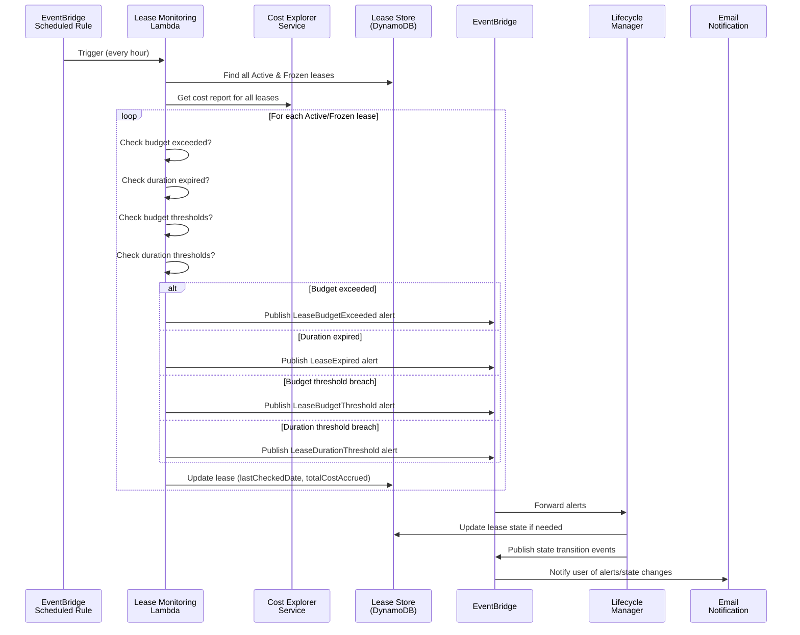
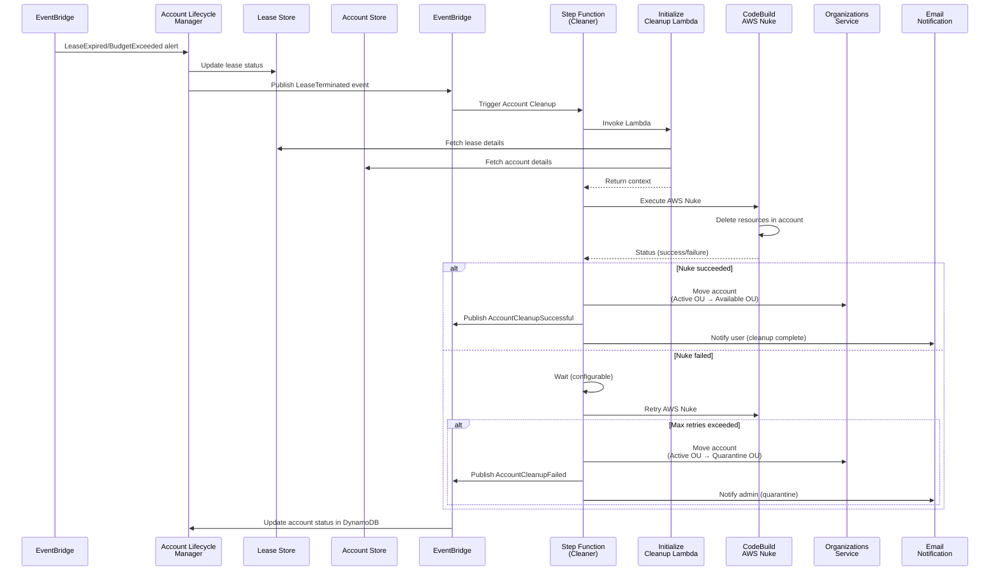
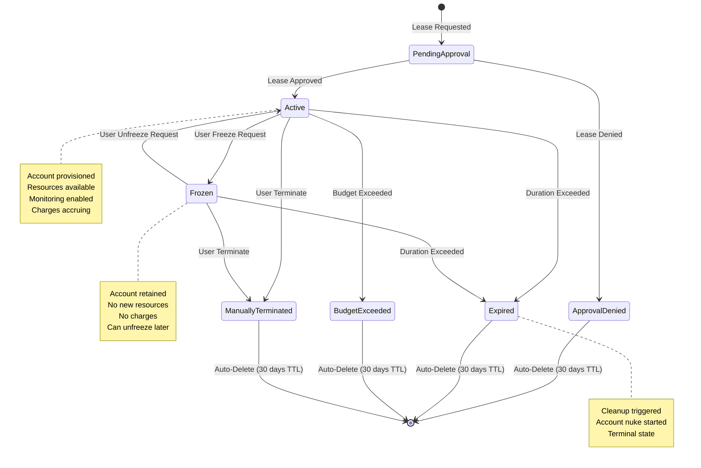

# Innovation Sandbox Core - Lease Lifecycle Documentation

## Table of Contents
1. [Lease Lifecycle Overview](#lease-lifecycle-overview)
2. [Lease Request Flow](#lease-request-flow)
3. [Lease Approval Flow](#lease-approval-flow)
4. [Account Provisioning](#account-provisioning)
5. [Lease Monitoring & State Transitions](#lease-monitoring--state-transitions)
6. [Lease Cleanup & Account Nuke](#lease-cleanup--account-nuke)
7. [Lease State Machine](#lease-state-machine)
8. [DynamoDB Interactions](#dynamodb-interactions)
9. [EventBridge Message Flows](#eventbridge-message-flows)

---

## Lease Lifecycle Overview

A lease represents a user's temporary access to a sandbox AWS account. It passes through multiple states from creation to termination.

### Lease Lifecycle States

```
PendingApproval → Active → Frozen → Expired/BudgetExceeded/ManuallyTerminated
                ↓
            ApprovalDenied
```

### State Definitions

| State | Description | Duration | Billable |
|-------|-------------|----------|----------|
| **PendingApproval** | Lease awaiting manager approval | Minutes to hours | No |
| **Active** | Lease active, account provisioned | User-defined (hours) | Yes |
| **Frozen** | Lease suspended, account retained | Indefinite | No |
| **Expired** | Lease duration exceeded | Terminal | No |
| **BudgetExceeded** | Lease budget limit exceeded | Terminal | No |
| **ManuallyTerminated** | User terminated early | Terminal | No |
| **AccountQuarantined** | Account in quarantine after drift | Terminal | No |
| **ApprovalDenied** | Manager denied request | Terminal | No |

---

## Lease Request Flow

### Sequence Diagram: Lease Request



### POST /leases Handler Logic

```typescript
// Input validation
const validRequest = {
  leaseTemplateUuid: uuid,  // Required
  userEmail?: email,         // Optional (defaults to requestor)
  comments?: string          // Optional
}

// Step 1: Load and validate template
const template = await leaseStore.get(leaseTemplateUuid)
if (!template) throw TemplateNotFound

// Step 2: Validate user permissions
const targetUser = resolveTargetUser(userEmail, requestingUser)
if (requestingUser has only "User" role && userEmail != requestingUser.email) {
  throw Unauthorized
}

// Step 3: Check lease count limits
const userLeaseCount = await leaseStore.findByUserEmail(targetUser.email)
if (userLeaseCount.length >= config.maxLeasesPerUser) {
  throw MaxLeasesExceeded
}

// Step 4: Check account availability
const availableAccounts = await accountStore.findByStatus("Available")
if (!availableAccounts.empty) {
  throw NoAccountsAvailable
}

// Step 5: Determine approval path
if (shouldAutoApprove(template, requestingUser)) {
  // Auto-approve path
  const account = availableAccounts[0]
  
  const activeLease = createActiveLease({
    userEmail: targetUser.email,
    originalLeaseTemplateUuid: template.uuid,
    awsAccountId: account.awsAccountId,
    approvedBy: "AUTO_APPROVED",
    startDate: now(),
    expirationDate: now() + template.leaseDurationInHours
  })
  
  await leaseStore.create(activeLease)
  await accountStore.update({ ...account, leaseUuid: activeLease.uuid })
  
  await eventBus.publish({
    source: "leases-api",
    detailType: "LeaseApproved",
    detail: {
      leaseId: { userEmail: activeLease.userEmail, uuid: activeLease.uuid },
      awsAccountId: activeLease.awsAccountId
    }
  })
} else {
  // Pending approval path
  const pendingLease = createPendingLease({
    userEmail: targetUser.email,
    originalLeaseTemplateUuid: template.uuid,
    comments: comments,
    createdBy: requestingUser.email
  })
  
  await leaseStore.create(pendingLease)
  
  await eventBus.publish({
    source: "leases-api",
    detailType: "LeaseRequested",
    detail: {
      leaseId: { userEmail: pendingLease.userEmail, uuid: pendingLease.uuid },
      templateId: template.uuid,
      userEmail: pendingLease.userEmail
    }
  })
}

return { status: "success", data: lease }
```

### DynamoDB Writes During Request

1. **LeaseTable**: Insert new PendingLease or ActiveLease
2. **SandboxAccountTable**: Update account status (Available → Active)
3. **No GSI updates** (StatusIndex maintains itself)

---

## Lease Approval Flow

### Sequence Diagram: Lease Approval



### PATCH /leases/{leaseId}/review Handler Logic

```typescript
// Parse leaseId (base64 composite key)
const { userEmail, uuid } = decodeLeaseId(leaseId)

// Fetch and validate lease
const lease = await leaseStore.get(userEmail, uuid)
if (!isPendingLease(lease)) {
  throw InvalidLeaseState
}

// Authorize reviewer
if (!currentUser.roles.includes("Manager")) {
  throw Unauthorized
}

if (decision === "approve") {
  // Approve path
  const availableAccount = await accountStore.findByStatus("Available").first()
  if (!availableAccount) {
    throw NoAccountsAvailable
  }
  
  const activeLease = {
    ...lease,
    status: "Active",
    awsAccountId: availableAccount.awsAccountId,
    approvedBy: currentUser.email,
    startDate: now(),
    expirationDate: now() + lease.leaseDurationInHours
  }
  
  await leaseStore.update(activeLease)
  await accountStore.update({
    ...availableAccount,
    accountStatus: "Active",
    leaseUuid: uuid
  })
  
  await eventBus.publish({
    source: "leases-api",
    detailType: "LeaseApproved",
    detail: {
      leaseId: { userEmail: lease.userEmail, uuid: lease.uuid },
      awsAccountId: activeLease.awsAccountId,
      approvedBy: currentUser.email
    }
  })
  
} else if (decision === "deny") {
  // Deny path
  const deniedLease = {
    ...lease,
    status: "ApprovalDenied",
    ttl: Math.floor(now().getTime() / 1000) + (30 * 24 * 60 * 60) // 30 days
  }
  
  await leaseStore.update(deniedLease)
  
  await eventBus.publish({
    source: "leases-api",
    detailType: "LeaseDenied",
    detail: {
      leaseId: { userEmail: lease.userEmail, uuid: lease.uuid },
      reason: reason || "Request denied by manager",
      deniedBy: currentUser.email
    }
  })
}

return { status: "success", data: updatedLease }
```

### DynamoDB Interactions During Approval

**On Approval**:
1. LeaseTable: Update lease (PendingApproval → Active)
2. SandboxAccountTable: Update account (Available → Active)
3. StatusIndex: Lease now queryable by Active status

**On Denial**:
1. LeaseTable: Update lease (PendingApproval → ApprovalDenied) + set TTL
2. No account updates
3. Lease will auto-delete after TTL expires

---

## Account Provisioning

### Sequence Diagram: Account Provisioning



### Account Provisioning Details

**Event Handler**: `account-lifecycle-manager.ts`

**On LeaseApproved**:
1. Move account from "Available" OU to "Active" OU
2. Apply Service Control Policies (SCPs) for duration/budget limits
3. Create or update IDC user assignments
4. Generate temporary credentials
5. Store credentials in Secrets Manager
6. Send provisioning confirmation to user

---

## Lease Monitoring & State Transitions

### Sequence Diagram: Lease Monitoring



### Lease Monitoring Logic

```typescript
// Runs hourly via EventBridge
async function performAccountMonitoringScan() {
  // 1. Find all monitored leases
  const activeLeases = await leaseStore.findByStatus("Active")
  const frozenLeases = await leaseStore.findByStatus("Frozen")
  const monitoredLeases = [...activeLeases, ...frozenLeases]
  
  // 2. Get cost data
  const costReport = await costExplorer.getCostForLeases(
    monitoredLeases.map(l => ({ accountId: l.awsAccountId, startDate: l.startDate }))
  )
  
  // 3. Evaluate each lease
  const eventsToPublish = []
  
  for (const lease of monitoredLeases) {
    const currentCost = costReport.getCost(lease.awsAccountId)
    const now = DateTime.now()
    
    // Check 1: Budget exceeded (highest priority)
    if (currentCost > lease.maxSpend) {
      eventsToPublish.push(
        new LeaseBudgetExceededAlert({
          leaseId: { userEmail: lease.userEmail, uuid: lease.uuid },
          accountId: lease.awsAccountId,
          budget: lease.maxSpend,
          totalSpend: currentCost
        })
      )
      continue  // Don't check other conditions
    }
    
    // Check 2: Duration expired
    if (lease.expirationDate && now > DateTime.fromISO(lease.expirationDate)) {
      eventsToPublish.push(
        new LeaseExpiredAlert({
          leaseId: { userEmail: lease.userEmail, uuid: lease.uuid },
          accountId: lease.awsAccountId
        })
      )
      continue
    }
    
    // Check 3: Budget thresholds
    for (const threshold of lease.budgetThresholds || []) {
      const thresholdAmount = lease.maxSpend * (threshold.percentage / 100)
      if (currentCost >= thresholdAmount && 
          currentCost - calculatePreviousCost(lease) < thresholdAmount) {
        eventsToPublish.push(
          new LeaseBudgetThresholdBreachedAlert({
            leaseId: { userEmail: lease.userEmail, uuid: lease.uuid },
            threshold: threshold.percentage,
            alertThreshold: thresholdAmount,
            currentSpend: currentCost
          })
        )
      }
    }
    
    // Check 4: Duration thresholds
    const remainingHours = calculateRemainingHours(lease)
    for (const threshold of lease.durationThresholds || []) {
      if (remainingHours <= threshold.remainingHours) {
        eventsToPublish.push(
          new LeaseDurationThresholdBreachedAlert({
            leaseId: { userEmail: lease.userEmail, uuid: lease.uuid },
            remainingHours: remainingHours
          })
        )
      }
    }
    
    // Check 5: Freezing threshold (if freeze enabled)
    if (config.freezeOnBudgetThreshold && currentCost > lease.maxSpend * 0.9) {
      eventsToPublish.push(
        new LeaseFreezingThresholdBreachedAlert({
          leaseId: { userEmail: lease.userEmail, uuid: lease.uuid },
          currentSpend: currentCost,
          maxSpend: lease.maxSpend
        })
      )
    }
  }
  
  // 4. Publish all events
  await eventBus.sendIsbEvents(...eventsToPublish)
  
  // 5. Update DynamoDB
  for (const lease of monitoredLeases) {
    await leaseStore.update({
      ...lease,
      totalCostAccrued: costReport.getCost(lease.awsAccountId),
      lastCheckedDate: now.toISO()
    })
  }
}
```

### Alert-to-State Transition Mapping

| Alert | Current State | New State | Action |
|-------|---------------|-----------|--------|
| BudgetExceeded | Active/Frozen | BudgetExceeded | Terminal, cleanup queued |
| LeaseExpired | Active/Frozen | Expired | Terminal, cleanup queued |
| BudgetThreshold | Active | Active | Alert sent, no state change |
| DurationThreshold | Active | Active | Alert sent, no state change |
| FreezingThreshold | Active | Frozen | Auto-freeze (if configured) |

---

## Lease Cleanup & Account Nuke

### Sequence Diagram: Lease Cleanup



### Step Function State Machine (Cleanup Orchestration)

```
Start
  ↓
AddCodeBuildExecutionResultsObject (Pass state)
  ↓
InitializeCleanupLambda (Lambda invoke)
  ↓ (success)
StartCodeBuild (CodeBuild task)
  ↓
CodeBuildResult? (Choice state)
  ├─ SUCCESS → AddSuccessfulExecution → SendSuccessEvent → Succeed
  ├─ FAILURE → Wait (retry delay)
  │   ↓
  │   RetryCodeBuild? (Choice state)
  │   ├─ RETRY_LIMIT_NOT_EXCEEDED → StartCodeBuild (loop)
  │   └─ RETRY_LIMIT_EXCEEDED → SendFailureEvent → Fail
  └─ QUEUED/IN_PROGRESS → Wait → Check again (loop)
```

### Initialize Cleanup Lambda Logic

```typescript
async function initializeCleanup(event: {
  accountId: string
  cleanupExecutionContext: {
    stateMachineExecutionArn: string
    stateMachineExecutionStartTime: string
  }
}) {
  // 1. Fetch account and lease details
  const account = await accountStore.get(event.accountId)
  const lease = await leaseStore.get(
    account.associatedLeaseUserEmail,
    account.associatedLeaseUuid
  )
  
  // 2. Fetch nuke configuration
  const nukeConfig = await appConfigService.getConfiguration(
    configProfileId: "NukeConfig"
  )
  
  // 3. Validate preconditions
  if (!account.canBeNuked()) {
    throw AccountNotInCleanableState
  }
  
  // 4. Return context for CodeBuild
  return {
    globalConfig: await appConfigService.getGlobalConfig(),
    nukeConfig: nukeConfig,
    accountId: event.accountId,
    leaseId: {
      userEmail: lease.userEmail,
      uuid: lease.uuid
    },
    resourcesPreserved: [],
    executionContext: event.cleanupExecutionContext
  }
}
```

### CodeBuild AWS Nuke Execution

**Environment Variables** (from StepFunction):
- `CLEANUP_ACCOUNT_ID` - Target account
- `STATE_MACHINE_EXECUTION_ID` - Tracking ID
- `APPCONFIG_*_IDs` - Config profile IDs

**Script**:
1. Assume role in target account
2. Download nuke configuration from AppConfig
3. Execute AWS Nuke with config
4. Log all deleted resources
5. Return exit code (0 = success, non-zero = failure)

### Account State Transitions During Cleanup

```
Active OU
  ↓
CleanUp OU (during cleanup)
  ↓
Success → Available OU
  ↓ Failure (after retries)
Quarantine OU (manual review needed)
```

### DynamoDB Updates During Cleanup

1. **LeaseTable**: Update lease
   - Status: Active/Frozen → Expired/BudgetExceeded/ManuallyTerminated
   - endDate: Set to cleanup timestamp
   - ttl: Set for 30-day retention

2. **SandboxAccountTable**: Update account
   - accountStatus: Active/Frozen → Available/Quarantine
   - leaseUuid: Cleared if returning to Available
   - lastModifiedDate: Updated

---

## Lease State Machine

### State Diagram: Complete Lease Lifecycle



### State Transition Rules

**To Active**:
- From: PendingApproval
- Requirements: Manager approval, account available
- Actions: Allocate account, apply SCPs, provision credentials
- Events: LeaseApproved

**To Frozen**:
- From: Active
- Requirements: User request
- Actions: Move OU, halt charges
- Events: LeaseFrozen

**To Unfrozen (back to Active)**:
- From: Frozen
- Requirements: Lease not expired
- Actions: Update OU, resume monitoring
- Events: LeaseUnfrozen

**To Expired**:
- From: Active, Frozen
- Requirements: Duration exceeded
- Actions: Trigger cleanup
- Events: LeaseExpired

**To BudgetExceeded**:
- From: Active, Frozen
- Requirements: Accrued cost >= maxSpend
- Actions: Trigger cleanup, freeze account
- Events: LeaseBudgetExceeded

**To ManuallyTerminated**:
- From: Active, Frozen
- Requirements: User request
- Actions: Trigger cleanup
- Events: LeaseTerminated

**To ApprovalDenied**:
- From: PendingApproval
- Requirements: Manager denial
- Actions: None (lease never activated)
- Events: LeaseDenied, TTL set (30 days)

---

## DynamoDB Interactions

### Lease Request

```
LeaseTable INSERT:
{
  userEmail: "user@example.com",
  uuid: "<random-uuid>",
  status: "PendingApproval",
  originalLeaseTemplateUuid: "<template-id>",
  originalLeaseTemplateName: "Production-Like",
  createdBy: "user@example.com",
  comments: "Need for testing new feature",
  maxSpend: 500,
  leaseDurationInHours: 48,
  budgetThresholds: [{ percentage: 75 }, { percentage: 90 }],
  durationThresholds: [{ remainingHours: 4 }],
  costReportGroup: "engineering",
  versionNumber: 2,
  createdDate: "2024-02-03T10:00:00Z",
  lastModifiedDate: "2024-02-03T10:00:00Z"
}
```

### Lease Approval (PendingApproval → Active)

```
LeaseTable UPDATE:
{
  userEmail: "user@example.com",
  uuid: "<random-uuid>",
  status: "Active",  // Changed
  awsAccountId: "123456789012",  // Added
  approvedBy: "manager@example.com",  // Added
  startDate: "2024-02-03T10:15:00Z",  // Added
  expirationDate: "2024-02-05T10:15:00Z",  // Added
  lastCheckedDate: "2024-02-03T10:15:00Z",  // Added
  totalCostAccrued: 0,  // Added
  ...previous fields
}

SandboxAccountTable UPDATE:
{
  awsAccountId: "123456789012",
  accountStatus: "Active",  // Changed from Available
  leaseUuid: "<random-uuid>",  // Added
  ouPath: "/org/Innovation-Sandbox/Active/",  // Added
  lastModifiedDate: "2024-02-03T10:15:00Z"
}

StatusIndex: New entry for quick status queries
```

### Lease Monitoring (Update Cost & Check Thresholds)

```
LeaseTable UPDATE (hourly):
{
  userEmail: "user@example.com",
  uuid: "<random-uuid>",
  lastCheckedDate: "2024-02-03T11:15:00Z",  // Updated
  totalCostAccrued: 45.67  // Updated with latest cost
  ...fields unchanged
}
```

### Lease Termination (Active → Expired/BudgetExceeded)

```
LeaseTable UPDATE:
{
  userEmail: "user@example.com",
  uuid: "<random-uuid>",
  status: "Expired",  // or "BudgetExceeded"
  endDate: "2024-02-03T14:30:00Z",  // Added
  ttl: 1714819200,  // Unix timestamp 30 days from now
  lastModifiedDate: "2024-02-03T14:30:00Z",
  ...fields unchanged
}

SandboxAccountTable UPDATE:
{
  awsAccountId: "123456789012",
  accountStatus: "CleanUp",  // During cleanup
  lastModifiedDate: "2024-02-03T14:30:00Z",
  ...fields unchanged
  // After cleanup succeeds:
  accountStatus: "Available",  // Reset
  leaseUuid: null,  // Clear association
  ouPath: "/org/Innovation-Sandbox/Available/"
}
```

### Query Patterns

**Find all active leases for a user**:
```
Query LeaseTable
Key: userEmail = "user@example.com"
Filter: status = "Active"
```

**Find all leases by status** (using GSI):
```
Query StatusIndex
Key: status = "Active"
Sort by: originalLeaseTemplateUuid
Result: All active leases (cross-user)
```

**Find leases expiring today**:
```
Query LeaseTable with concurrent queries
Filter: expirationDate < now() AND status = "Active"
```

**Find cost report groups** (for billing):
```
Scan LeaseTable (or query StatusIndex by status)
Project: costReportGroup, userEmail, totalCostAccrued
Group results by costReportGroup
```

---

## EventBridge Message Flows

### Event Schema

All ISB events follow this pattern:

```json
{
  "version": "0",
  "id": "<event-id>",
  "detail-type": "<EventDetailType>",
  "source": "<source-service>",
  "account": "<account-id>",
  "time": "<ISO8601-timestamp>",
  "region": "<region>",
  "resources": [],
  "detail": {
    // Event-specific payload
  }
}
```

### Event Catalog

#### LeaseRequested
**Source**: leases-api  
**Trigger**: POST /leases (pending approval path)  
**Targets**: Email notifications, admin dashboards

```json
{
  "detail-type": "LeaseRequested",
  "detail": {
    "leaseId": {
      "userEmail": "user@example.com",
      "uuid": "<lease-uuid>"
    },
    "templateId": "<template-uuid>",
    "userEmail": "user@example.com",
    "templateName": "Production-Like"
  }
}
```

#### LeaseApproved
**Source**: leases-api  
**Trigger**: POST /leases (auto-approve) or POST /leases/{id}/review (approve)  
**Targets**: Account provisioning, email notifications, billing system

```json
{
  "detail-type": "LeaseApproved",
  "detail": {
    "leaseId": {
      "userEmail": "user@example.com",
      "uuid": "<lease-uuid>"
    },
    "awsAccountId": "123456789012",
    "approvedBy": "manager@example.com" | "AUTO_APPROVED"
  }
}
```

#### LeaseDenied
**Source**: leases-api  
**Trigger**: POST /leases/{id}/review (deny)  
**Targets**: Email notifications

```json
{
  "detail-type": "LeaseDenied",
  "detail": {
    "leaseId": {
      "userEmail": "user@example.com",
      "uuid": "<lease-uuid>"
    },
    "reason": "Does not meet business requirements",
    "deniedBy": "manager@example.com"
  }
}
```

#### LeaseFrozen
**Source**: leases-api  
**Trigger**: POST /leases/{id}/freeze  
**Targets**: Account management (OU move), billing

```json
{
  "detail-type": "LeaseFrozen",
  "detail": {
    "leaseId": {
      "userEmail": "user@example.com",
      "uuid": "<lease-uuid>"
    },
    "awsAccountId": "123456789012"
  }
}
```

#### LeaseUnfrozen
**Source**: leases-api  
**Trigger**: POST /leases/{id}/unfreeze  
**Targets**: Account management, monitoring resume

```json
{
  "detail-type": "LeaseUnfrozen",
  "detail": {
    "leaseId": {
      "userEmail": "user@example.com",
      "uuid": "<lease-uuid>"
    },
    "awsAccountId": "123456789012"
  }
}
```

#### LeaseBudgetExceeded
**Source**: lease-monitoring  
**Trigger**: Hourly monitoring detects cost > maxSpend  
**Targets**: Account cleanup, email notifications, lifecycle manager

```json
{
  "detail-type": "LeaseBudgetExceeded",
  "detail": {
    "leaseId": {
      "userEmail": "user@example.com",
      "uuid": "<lease-uuid>"
    },
    "accountId": "123456789012",
    "budget": 500.00,
    "totalSpend": 523.45
  }
}
```

#### LeaseExpired
**Source**: lease-monitoring  
**Trigger**: Hourly monitoring detects now > expirationDate  
**Targets**: Account cleanup, email notifications, lifecycle manager

```json
{
  "detail-type": "LeaseExpired",
  "detail": {
    "leaseId": {
      "userEmail": "user@example.com",
      "uuid": "<lease-uuid>"
    },
    "accountId": "123456789012",
    "expirationDate": "2024-02-05T10:15:00Z"
  }
}
```

#### LeaseTerminated
**Source**: leases-api  
**Trigger**: POST /leases/{id}/terminate  
**Targets**: Account cleanup, email notifications

```json
{
  "detail-type": "LeaseTerminated",
  "detail": {
    "leaseId": {
      "userEmail": "user@example.com",
      "uuid": "<lease-uuid>"
    },
    "accountId": "123456789012",
    "terminatedBy": "user@example.com"
  }
}
```

#### LeaseBudgetThresholdAlert
**Source**: lease-monitoring  
**Trigger**: Hourly monitoring detects cost crossing threshold  
**Targets**: Email notifications

```json
{
  "detail-type": "LeaseBudgetThresholdAlert",
  "detail": {
    "leaseId": {
      "userEmail": "user@example.com",
      "uuid": "<lease-uuid>"
    },
    "threshold": 75,
    "alertThreshold": 375.00,
    "currentSpend": 376.45
  }
}
```

#### LeaseFreezingThresholdBreachedAlert
**Source**: lease-monitoring  
**Trigger**: Cost reaches 90% of budget (if auto-freeze enabled)  
**Targets**: Account management (auto-freeze), email notifications

```json
{
  "detail-type": "LeaseFreezingThresholdBreachedAlert",
  "detail": {
    "leaseId": {
      "userEmail": "user@example.com",
      "uuid": "<lease-uuid>"
    },
    "currentSpend": 450.00,
    "maxSpend": 500.00
  }
}
```

#### AccountCleanupSuccessful
**Source**: account-cleaner (StepFunction)  
**Trigger**: AWS Nuke completes successfully  
**Targets**: Account status update, email notifications, metrics

```json
{
  "detail-type": "AccountCleanupSucceeded",
  "detail": {
    "accountId": "123456789012",
    "cleanupExecutionContext": {
      "stateMachineExecutionArn": "arn:aws:states:...",
      "stateMachineExecutionStartTime": "2024-02-03T14:30:00Z"
    }
  }
}
```

#### AccountCleanupFailure
**Source**: account-cleaner (StepFunction)  
**Trigger**: AWS Nuke fails after max retries  
**Targets**: Account quarantine, admin alerts

```json
{
  "detail-type": "AccountCleanupFailed",
  "detail": {
    "accountId": "123456789012",
    "error": "AWS Nuke failed after 3 attempts",
    "cleanupExecutionContext": { ... }
  }
}
```

#### AccountDriftDetected
**Source**: account-drift-monitoring  
**Trigger**: Scheduled drift detection finds changes  
**Targets**: Lifecycle manager, admin alerts

```json
{
  "detail-type": "AccountDriftDetected",
  "detail": {
    "accountId": "123456789012",
    "driftDetails": {
      "services_with_changes": ["ec2", "s3"],
      "drift_description": "..."
    }
  }
}
```

### Event Routing Rules

| Event | Rule Name | Targets | Pattern |
|-------|-----------|---------|---------|
| LeaseRequested | LeaseRequestedRule | Email (Manager queue) | DetailType = "LeaseRequested" |
| LeaseApproved | LeaseApprovedRule | Email (User queue), Provisioning | DetailType = "LeaseApproved" |
| LeaseDenied | LeaseDeniedRule | Email (User queue) | DetailType = "LeaseDenied" |
| Lease\*Threshold\* | LeaseThresholdRule | Email (User queue) | DetailType matches Threshold pattern |
| LeaseBudgetExceeded | LeaseTerminalRule | Cleanup StepFunction, Email | DetailType = "LeaseBudgetExceeded" |
| LeaseExpired | LeaseTerminalRule | Cleanup StepFunction, Email | DetailType = "LeaseExpired" |
| LeaseTerminated | LeaseTerminalRule | Cleanup StepFunction, Email | DetailType = "LeaseTerminated" |
| AccountCleanup\* | AccountCleanupRule | Lifecycle Manager, Email | DetailType matches Cleanup pattern |
| AccountDriftDetected | DriftDetectionRule | Lifecycle Manager, Alerts | DetailType = "AccountDriftDetected" |

### Event Queues

Events are typically sent to SQS queues before Lambda invocation to enable:
- **Retry logic**: Failed invocations automatically retry
- **Dead Letter Queue (DLQ)**: Failed messages after max retries
- **Ordering**: FIFO queues maintain event order per user/account
- **Concurrency control**: Lambda concurrency limits apply

**Queue Configuration**:
- **Visibility Timeout**: 5 minutes (adjustable per Lambda)
- **Message Retention**: 4 days
- **Max Receive Count**: 3 (before DLQ)
- **Encryption**: KMS managed

---

## Error Handling & Recovery

### Event Processing Failures

**Scenario 1**: Lambda crashes during lease approval
- Event stays in SQS queue
- Visibility timeout expires (5 min)
- Event re-attempted (up to 3 times)
- After max retries → DLQ for manual review

**Scenario 2**: DynamoDB update fails
- TransactionCanceledException caught
- Retry with exponential backoff
- Event stays in queue if all retries fail

**Scenario 3**: EventBridge PutEvents fails
- Event remains in source SQS queue
- DLQ receives after max retries
- Admin review required for manual retry

### State Recovery

**Scenario**: User's lease partially approved but no account allocated

**Detection**: 
- Lease in Active status but no awsAccountId

**Recovery**:
- Manual admin action: Account allocation
- Or: Automated cleanup task (daily) to find orphaned leases
- Transition to ApprovalDenied + notify user

---

## Performance Considerations

### Query Optimization

| Query | Index Used | Performance |
|-------|-----------|-------------|
| Get lease by ID | Primary key (userEmail + uuid) | <1ms |
| Find user's leases | Primary key scan | O(user leases) |
| Find leases by status | StatusIndex GSI | O(leases in status) |
| Find expiring leases | Primary key scan + filter | O(n) |
| Cost aggregation | ScanTable | O(n) |

### Throughput Limits

- **LeaseTable**: On-demand (scales automatically)
- **LeaseMonitoring Lambda**: 1 per hour (bounded)
- **API**: 10,000 req/min default (configurable)
- **EventBridge**: 10/sec per account (native limit)

---

## Monitoring & Alerting

### Key Metrics

- **Lease request latency** (p50, p99)
- **Approval rate** (auto vs manual)
- **Budget exceeded incidents** per day
- **Cleanup success rate** (%)
- **Average cleanup duration** (minutes)
- **Cost per sandbox account** (daily)

### CloudWatch Dashboards

- Lease lifecycle metrics
- Account cleanup performance
- Error rates by operation
- Cost trends