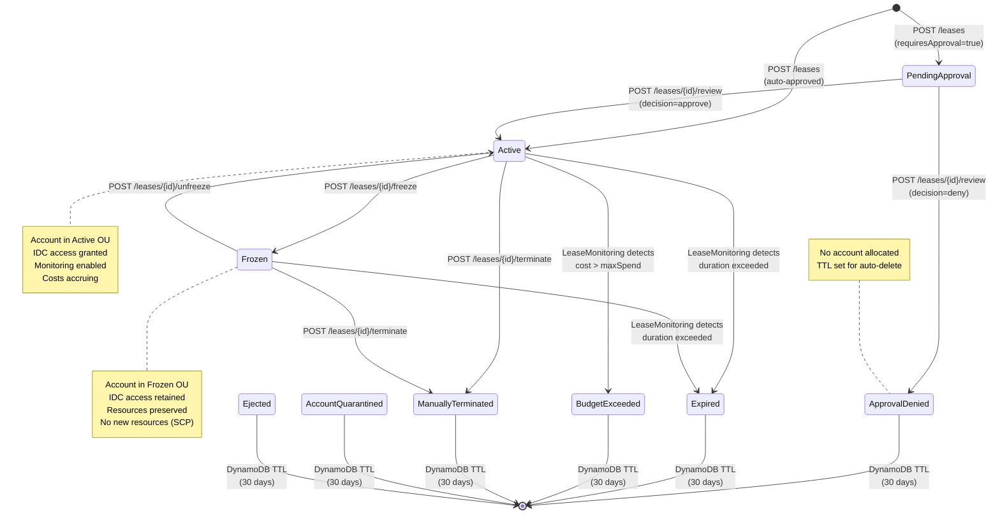
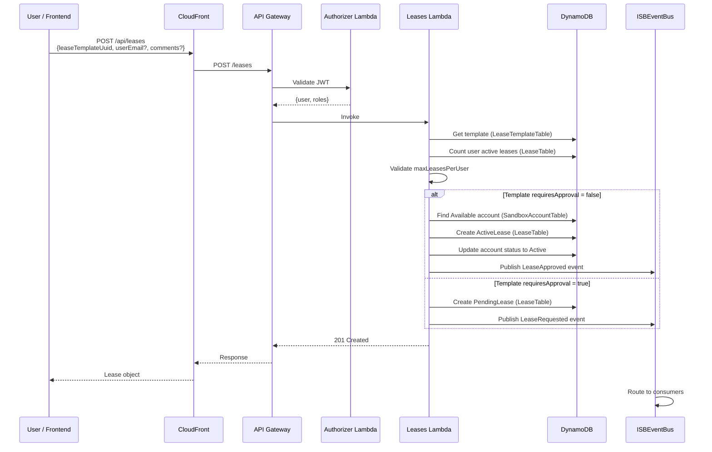
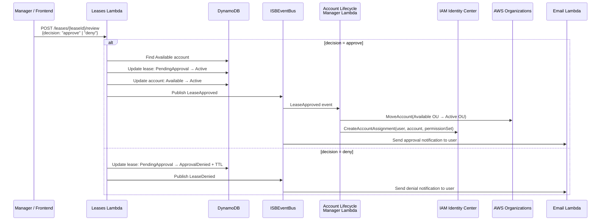
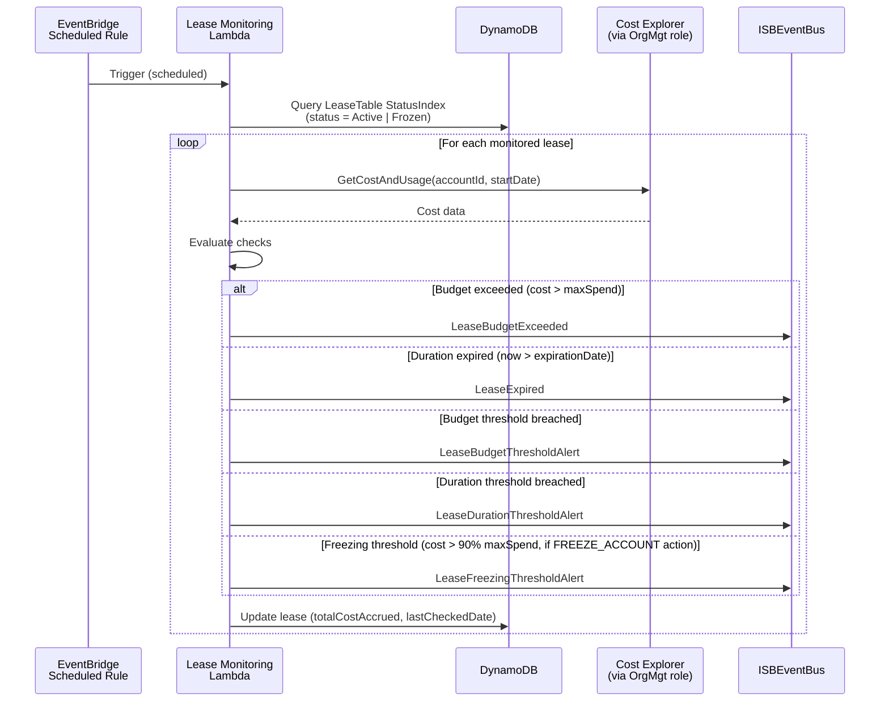
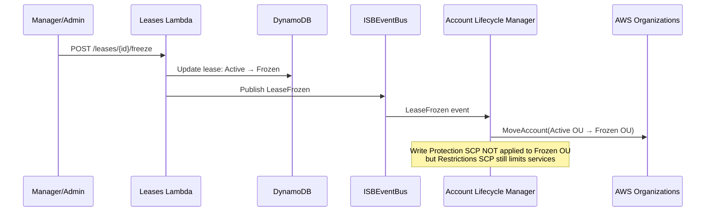
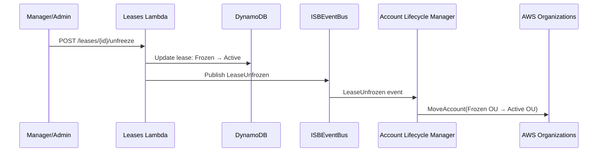
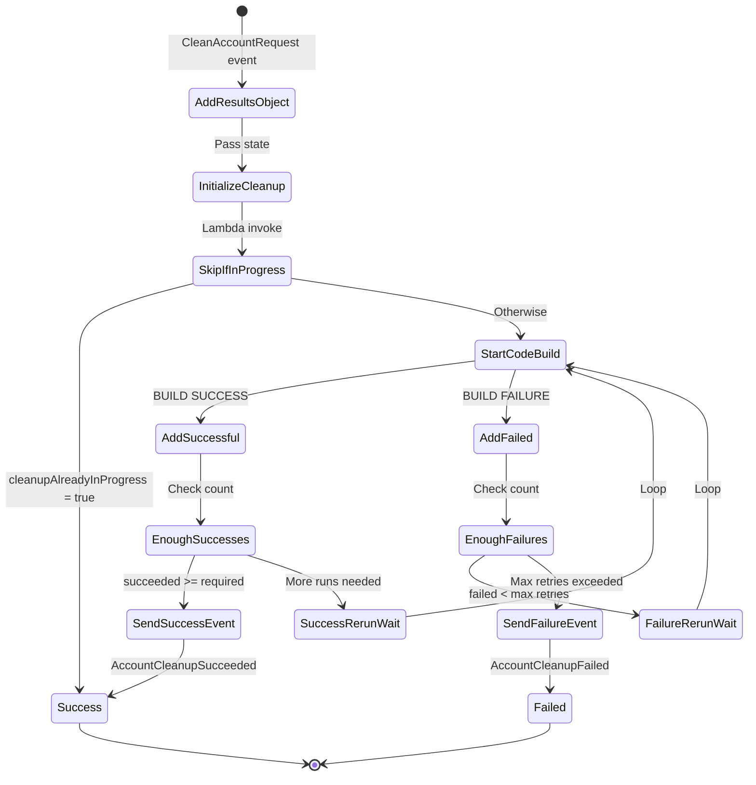
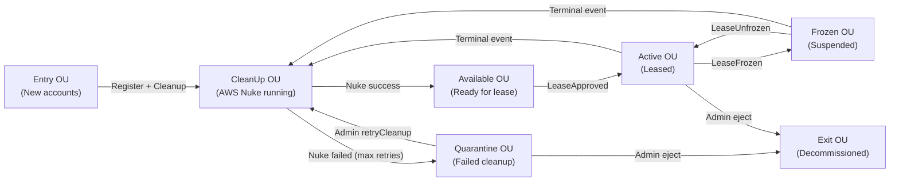

# Lease Lifecycle

> **Last Updated**: 2026-03-02
> **Source**: [co-cddo/innovation-sandbox-on-aws](https://github.com/co-cddo/innovation-sandbox-on-aws)
> **Captured SHA**: `cf75b87`

## Executive Summary

A lease represents a user's temporary access to a sandboxed AWS account within the Innovation Sandbox ecosystem. Each lease passes through a well-defined state machine, from request through approval, active monitoring, and eventual termination with automated account cleanup. The lifecycle is orchestrated by the Leases Lambda (API-driven state changes), the Lease Monitoring Lambda (scheduled budget/duration checks), and the Account Lifecycle Manager Lambda (event-driven OU transitions and IDC assignments). Account cleanup is handled by a Step Functions state machine that invokes CodeBuild running AWS Nuke in a container.

## Complete Lease State Machine

```mermaid
stateDiagram-v2
    [*] --> PendingApproval: POST /leases<br/>(requiresApproval=true)
    [*] --> Active: POST /leases<br/>(auto-approved)

    PendingApproval --> Active: POST /leases/{id}/review<br/>(decision=approve)
    PendingApproval --> ApprovalDenied: POST /leases/{id}/review<br/>(decision=deny)

    Active --> Frozen: POST /leases/{id}/freeze
    Active --> ManuallyTerminated: POST /leases/{id}/terminate
    Active --> Expired: LeaseMonitoring detects<br/>duration exceeded
    Active --> BudgetExceeded: LeaseMonitoring detects<br/>cost > maxSpend

    Frozen --> Active: POST /leases/{id}/unfreeze
    Frozen --> ManuallyTerminated: POST /leases/{id}/terminate
    Frozen --> Expired: LeaseMonitoring detects<br/>duration exceeded

    ApprovalDenied --> [*]: DynamoDB TTL<br/>(30 days)
    Expired --> [*]: DynamoDB TTL<br/>(30 days)
    BudgetExceeded --> [*]: DynamoDB TTL<br/>(30 days)
    ManuallyTerminated --> [*]: DynamoDB TTL<br/>(30 days)
    AccountQuarantined --> [*]: DynamoDB TTL<br/>(30 days)
    Ejected --> [*]: DynamoDB TTL<br/>(30 days)

    note right of Active
        Account in Active OU
        IDC access granted
        Monitoring enabled
        Costs accruing
    end note

    note right of Frozen
        Account in Frozen OU
        IDC access retained
        Resources preserved
        No new resources (SCP)
    end note

    note left of ApprovalDenied
        No account allocated
        TTL set for auto-delete
    end note
```

## Lease States

| State | Schema | Account Allocated | OU | Monitoring | Terminal |
|-------|--------|:-----------------:|----:|:----------:|:--------:|
| `PendingApproval` | `PendingLeaseSchema` | No | -- | No | No |
| `ApprovalDenied` | `ApprovalDeniedLeaseSchema` | No | -- | No | Yes |
| `Active` | `MonitoredLeaseSchema` | Yes | Active | Yes | No |
| `Frozen` | `MonitoredLeaseSchema` | Yes | Frozen | Yes | No |
| `Expired` | `ExpiredLeaseSchema` | Yes (cleanup queued) | CleanUp | No | Yes |
| `BudgetExceeded` | `ExpiredLeaseSchema` | Yes (cleanup queued) | CleanUp | No | Yes |
| `ManuallyTerminated` | `ExpiredLeaseSchema` | Yes (cleanup queued) | CleanUp | No | Yes |
| `AccountQuarantined` | `ExpiredLeaseSchema` | Yes (quarantined) | Quarantine | No | Yes |
| `Ejected` | `ExpiredLeaseSchema` | Yes (ejected) | Exit | No | Yes |

**Source**: `source/common/data/lease/lease.ts`

---

## Phase 1: Lease Request

### Sequence Diagram

```mermaid
sequenceDiagram
    participant User as User / Frontend
    participant CF as CloudFront
    participant APIGW as API Gateway
    participant Auth as Authorizer Lambda
    participant Leases as Leases Lambda
    participant DDB as DynamoDB
    participant EB as ISBEventBus

    User->>CF: POST /api/leases<br/>{leaseTemplateUuid, userEmail?, comments?}
    CF->>APIGW: POST /leases
    APIGW->>Auth: Validate JWT
    Auth-->>APIGW: {user, roles}
    APIGW->>Leases: Invoke

    Leases->>DDB: Get template (LeaseTemplateTable)
    Leases->>DDB: Count user active leases (LeaseTable)
    Leases->>Leases: Validate maxLeasesPerUser

    alt Template requiresApproval = false
        Leases->>DDB: Find Available account (SandboxAccountTable)
        Leases->>DDB: Create ActiveLease (LeaseTable)
        Leases->>DDB: Update account status to Active
        Leases->>EB: Publish LeaseApproved event
    else Template requiresApproval = true
        Leases->>DDB: Create PendingLease (LeaseTable)
        Leases->>EB: Publish LeaseRequested event
    end

    Leases-->>APIGW: 201 Created
    APIGW-->>CF: Response
    CF-->>User: Lease object

    EB->>EB: Route to consumers
```

### DynamoDB Writes

**Auto-approved path**:
1. `LeaseTable` INSERT: New `MonitoredLease` with status `Active`, `awsAccountId`, `startDate`, `expirationDate`, `approvedBy: "AUTO_APPROVED"`
2. `SandboxAccountTable` UPDATE: Account status from `Available` to `Active`, set lease association

**Pending approval path**:
1. `LeaseTable` INSERT: New `PendingLease` with status `PendingApproval`
2. No account table changes

**Validation rules** (from global AppConfig):
- Template must exist and be active
- User's concurrent active lease count < `maxLeasesPerUser` (default 3)
- If auto-approved, at least one account must be in `Available` status
- If `userEmail` differs from requester, requester must be Manager or Admin

**Source**: `source/lambdas/api/leases/src/leases-handler.ts`

---

## Phase 2: Lease Approval

### Sequence Diagram

```mermaid
sequenceDiagram
    participant Manager as Manager / Frontend
    participant Leases as Leases Lambda
    participant DDB as DynamoDB
    participant EB as ISBEventBus
    participant ALM as Account Lifecycle<br/>Manager Lambda
    participant IDC as IAM Identity Center
    participant Orgs as AWS Organizations
    participant Email as Email Lambda

    Manager->>Leases: POST /leases/{leaseId}/review<br/>{decision: "approve" | "deny"}

    alt decision = approve
        Leases->>DDB: Find Available account
        Leases->>DDB: Update lease: PendingApproval → Active
        Leases->>DDB: Update account: Available → Active
        Leases->>EB: Publish LeaseApproved
        EB->>ALM: LeaseApproved event
        ALM->>Orgs: MoveAccount(Available OU → Active OU)
        ALM->>IDC: CreateAccountAssignment(user, account, permissionSet)
        EB->>Email: Send approval notification to user
    else decision = deny
        Leases->>DDB: Update lease: PendingApproval → ApprovalDenied + TTL
        Leases->>EB: Publish LeaseDenied
        EB->>Email: Send denial notification to user
    end
```

### Account Lifecycle Manager Actions on LeaseApproved

The Account Lifecycle Manager Lambda handles the physical account provisioning:

1. **Move account to Active OU**: `organizations:MoveAccount` from Available OU to Active OU
2. **Grant IDC access**: `sso:CreateAccountAssignment` with the user's permission set (User, Manager, or Admin PS)
3. **Update DynamoDB**: Record the IDC assignment state on the account

The Write Protection SCP is removed when leaving the Available OU (it only applies to Available, CleanUp, Quarantine, Entry, and Exit OUs), enabling the user to create resources.

**Source**: `source/lambdas/account-management/account-lifecycle-management/src/account-lifecycle-manager.ts`

---

## Phase 3: Active Lease Monitoring

### Monitoring Schedule

The `LeaseMonitoringLambda` runs on a scheduled EventBridge rule and evaluates all `Active` and `Frozen` leases.

```mermaid
sequenceDiagram
    participant EB as EventBridge<br/>Scheduled Rule
    participant LM as Lease Monitoring<br/>Lambda
    participant DDB as DynamoDB
    participant CE as Cost Explorer<br/>(via OrgMgt role)
    participant EventBus as ISBEventBus

    EB->>LM: Trigger (scheduled)
    LM->>DDB: Query LeaseTable StatusIndex<br/>(status = Active | Frozen)

    loop For each monitored lease
        LM->>CE: GetCostAndUsage(accountId, startDate)
        CE-->>LM: Cost data

        LM->>LM: Evaluate checks

        alt Budget exceeded (cost > maxSpend)
            LM->>EventBus: LeaseBudgetExceeded
        else Duration expired (now > expirationDate)
            LM->>EventBus: LeaseExpired
        else Budget threshold breached
            LM->>EventBus: LeaseBudgetThresholdAlert
        else Duration threshold breached
            LM->>EventBus: LeaseDurationThresholdAlert
        else Freezing threshold (cost > 90% maxSpend, if FREEZE_ACCOUNT action)
            LM->>EventBus: LeaseFreezingThresholdAlert
        end

        LM->>DDB: Update lease (totalCostAccrued, lastCheckedDate)
    end
```

### Alert-to-Action Mapping

| Alert Event | Current State | Action | New State |
|-------------|---------------|--------|-----------|
| `LeaseBudgetExceeded` | Active/Frozen | Terminate lease, queue cleanup | BudgetExceeded |
| `LeaseExpired` | Active/Frozen | Terminate lease, queue cleanup | Expired |
| `LeaseBudgetThresholdAlert` | Active | Send notification only | Active (unchanged) |
| `LeaseDurationThresholdAlert` | Active | Send notification only | Active (unchanged) |
| `LeaseFreezingThresholdAlert` | Active | Freeze account | Frozen |

### Threshold Configuration

Thresholds are defined per lease template:

**Budget thresholds**: `[{ dollarsSpent: number, action: "ALERT" | "FREEZE_ACCOUNT" }]`
- `ALERT`: Publishes `LeaseBudgetThresholdAlert` (notification only)
- `FREEZE_ACCOUNT`: Publishes `LeaseFreezingThresholdAlert` (triggers freeze)

**Duration thresholds**: `[{ hoursRemaining: number, action: "ALERT" | "FREEZE_ACCOUNT" }]`
- Same action types as budget thresholds

**Source**: `source/lambdas/account-management/lease-monitoring/src/lease-monitoring-handler.ts`

---

## Phase 4: Lease Freeze and Unfreeze

### Freeze Flow

```mermaid
sequenceDiagram
    participant User as Manager/Admin
    participant Leases as Leases Lambda
    participant DDB as DynamoDB
    participant EB as ISBEventBus
    participant ALM as Account Lifecycle Manager
    participant Orgs as AWS Organizations

    User->>Leases: POST /leases/{id}/freeze
    Leases->>DDB: Update lease: Active → Frozen
    Leases->>EB: Publish LeaseFrozen

    EB->>ALM: LeaseFrozen event
    ALM->>Orgs: MoveAccount(Active OU → Frozen OU)
    Note over ALM: Write Protection SCP NOT applied to Frozen OU<br/>but Restrictions SCP still limits services
```

### Unfreeze Flow

```mermaid
sequenceDiagram
    participant User as Manager/Admin
    participant Leases as Leases Lambda
    participant DDB as DynamoDB
    participant EB as ISBEventBus
    participant ALM as Account Lifecycle Manager
    participant Orgs as AWS Organizations

    User->>Leases: POST /leases/{id}/unfreeze
    Leases->>DDB: Update lease: Frozen → Active
    Leases->>EB: Publish LeaseUnfrozen

    EB->>ALM: LeaseUnfrozen event
    ALM->>Orgs: MoveAccount(Frozen OU → Active OU)
```

Freezing preserves existing resources but the Frozen OU may have additional restrictions. Unfreezing restores full access. Both operations require Manager or Admin role.

**Source**: `source/common/events/lease-frozen-event.ts`, `lease-unfrozen-event.ts`

---

## Phase 5: Lease Termination and Cleanup

### Termination Triggers

A lease enters a terminal state through three paths:
1. **Manual termination**: `POST /leases/{id}/terminate` (Manager/Admin)
2. **Budget exceeded**: Lease Monitoring detects `totalCostAccrued > maxSpend`
3. **Duration expired**: Lease Monitoring detects `now > expirationDate`

### Account Lifecycle Manager on Terminal Events

The Account Lifecycle Manager handles the tracked events `LeaseBudgetExceeded`, `LeaseExpired`, and processes the transition:

1. Update lease record to terminal status (`Expired` / `BudgetExceeded` / `ManuallyTerminated`)
2. Set `endDate` and `ttl` on the lease
3. Revoke IDC access: `sso:DeleteAccountAssignment`
4. Move account to CleanUp OU: `organizations:MoveAccount`
5. Publish `CleanAccountRequest` event to trigger the cleanup Step Function

### Account Cleaner Step Function

```mermaid
stateDiagram-v2
    [*] --> AddResultsObject: CleanAccountRequest event

    AddResultsObject --> InitializeCleanup: Pass state
    InitializeCleanup --> SkipIfInProgress: Lambda invoke

    SkipIfInProgress --> Success: cleanupAlreadyInProgress = true
    SkipIfInProgress --> StartCodeBuild: Otherwise

    StartCodeBuild --> AddSuccessful: BUILD SUCCESS
    StartCodeBuild --> AddFailed: BUILD FAILURE

    AddSuccessful --> EnoughSuccesses: Check count

    EnoughSuccesses --> SendSuccessEvent: succeeded >= required
    EnoughSuccesses --> SuccessRerunWait: More runs needed
    SuccessRerunWait --> StartCodeBuild: Loop

    SendSuccessEvent --> Success: AccountCleanupSucceeded

    AddFailed --> EnoughFailures: Check count

    EnoughFailures --> FailureRerunWait: failed < max retries
    FailureRerunWait --> StartCodeBuild: Loop

    EnoughFailures --> SendFailureEvent: Max retries exceeded
    SendFailureEvent --> Failed: AccountCleanupFailed

    Success --> [*]
    Failed --> [*]
```

**Key parameters** (from Global AppConfig `cleanup` section):
- `numberOfSuccessfulAttemptsToFinishCleanup`: Number of consecutive AWS Nuke successes required (default: 2)
- `waitBeforeRerunSuccessfulAttemptSeconds`: Delay between successful runs (default: 30s)
- `numberOfFailedAttemptsToCancelCleanup`: Max failures before quarantine (default: 3)
- `waitBeforeRetryFailedAttemptSeconds`: Delay between failed retries (default: 5s)
- Step Function total timeout: 12 hours
- CodeBuild timeout: 60 minutes per run

### AWS Nuke Execution

CodeBuild runs an AWS Nuke container that:
1. Assumes the `IntermediateRole` in the hub account
2. Then assumes the `{namespace}_IsbCleanupRole` in the target sandbox account
3. Loads nuke config from AppConfig (with placeholder substitution)
4. Deletes all resources except those in the blocklist/filters
5. Returns exit code to Step Functions

**Protected resources** (from `nuke-config.yaml`):
- CloudFormation StackSet instances (`StackSet-Isb-*`)
- AWS Control Tower resources (trails, rules, roles, functions, logs)
- SSO-related roles (`AWSReservedSSO_*`)
- `OrganizationAccountAccessRole`
- StackSet execution roles (`stacksets-exec-*`)
- SAML providers (`AWSSSO`)
- Config Service recorders/channels

**Source**: `source/infrastructure/lib/components/account-cleaner/step-function.ts`, `cleanup-buildspec.yaml`, `source/infrastructure/lib/components/config/nuke-config.yaml`

---

## Phase 6: Post-Cleanup

### On AccountCleanupSucceeded

The Account Lifecycle Manager:
1. Moves account from CleanUp OU to Available OU
2. Resets the account record in SandboxAccountTable (clears lease association, sets status to `Available`)
3. Account is now ready for the next lease

### On AccountCleanupFailed

The Account Lifecycle Manager:
1. Moves account from CleanUp OU to Quarantine OU
2. Updates account status to `Quarantine`
3. Updates lease status to `AccountQuarantined`
4. Publishes `AccountQuarantined` event
5. Sends admin notification for manual review

### Admin Recovery Options

- **Retry cleanup**: `POST /accounts/{id}/retryCleanup` -- moves account back to CleanUp OU and re-triggers cleanup
- **Eject account**: `POST /accounts/{id}/eject` -- moves account to Exit OU, removes from pool permanently

---

## Account OU Transition Diagram

```mermaid
graph LR
    ENTRY["Entry OU<br/>(New accounts)"]
    AVAILABLE["Available OU<br/>(Ready for lease)"]
    ACTIVE["Active OU<br/>(Leased)"]
    FROZEN["Frozen OU<br/>(Suspended)"]
    CLEANUP["CleanUp OU<br/>(AWS Nuke running)"]
    QUARANTINE["Quarantine OU<br/>(Failed cleanup)"]
    EXIT["Exit OU<br/>(Decommissioned)"]

    ENTRY -->|"Register + Cleanup"| CLEANUP
    CLEANUP -->|"Nuke success"| AVAILABLE
    AVAILABLE -->|"LeaseApproved"| ACTIVE
    ACTIVE -->|"LeaseFrozen"| FROZEN
    FROZEN -->|"LeaseUnfrozen"| ACTIVE
    ACTIVE -->|"Terminal event"| CLEANUP
    FROZEN -->|"Terminal event"| CLEANUP
    CLEANUP -->|"Nuke failed (max retries)"| QUARANTINE
    QUARANTINE -->|"Admin retryCleanup"| CLEANUP
    QUARANTINE -->|"Admin eject"| EXIT
    ACTIVE -->|"Admin eject"| EXIT
```

Each OU has specific SCPs applied:
- **Available, CleanUp, Quarantine, Entry, Exit**: Write Protection SCP (blocks create/modify)
- **Active**: Full access within allowed services and regions
- **Frozen**: Full access but practically limited (no active user sessions)
- **All OUs**: AWS Nuke Supported Services SCP, Restrictions SCP, Protect ISB SCP, Limit Regions SCP

---

## EventBridge Event Routing

### Event-to-Lambda Routing

| Event | Rule Target | Delivery | Concurrency |
|-------|------------|----------|-------------|
| `LeaseApproved`, `LeaseBudgetExceeded`, `LeaseExpired`, `AccountCleanupSucceeded`, `AccountCleanupFailed`, `AccountDriftDetected`, `LeaseFreezingThresholdAlert` | Account Lifecycle Manager | SQS -> Lambda | Reserved: 1 |
| `CleanAccountRequest` | Account Cleaner Step Function | Direct | -- |
| `LeaseRequested`, `LeaseApproved`, `LeaseDenied`, `LeaseTerminated`, `LeaseFrozen`, `LeaseUnfrozen`, alerts | Email Notification Lambda | SQS -> Lambda | -- |
| All events | CloudWatch Logs | Direct | -- |

The Account Lifecycle Manager uses reserved concurrency of 1 to ensure serialized processing of events, preventing race conditions in account OU transitions and DynamoDB updates.

**Source**: `source/infrastructure/lib/components/events/isb-internal-core.ts`, `source/infrastructure/lib/components/account-management/account-lifecycle-management-lambda.ts`

---

## Error Handling and Recovery

### SQS-based Retry Pattern

Events routed through SQS queues benefit from:
- **Visibility timeout**: Prevents re-processing during Lambda execution
- **Max receive count**: 3 retries before DLQ
- **Max event age**: 4 hours for lifecycle events
- **DLQ**: Dead letter queue for manual investigation

### Step Function Error Handling

- The `InitializeCleanupLambda` invoke has a catch-all that publishes `AccountCleanupFailed`
- The CodeBuild step has a catch-all that increments the failure counter and retries
- The entire state machine has a 12-hour timeout

### Idempotency

- The `InitializeCleanupLambda` checks if cleanup is already in progress (by querying the `cleanupExecutionContext` on the account record) and skips if so
- Lease state transitions use DynamoDB conditional writes to prevent conflicting updates

---

## DynamoDB Query Patterns

| Query | Method | Key/Index | Filter |
|-------|--------|-----------|--------|
| Get lease by ID | Query | PK: `userEmail`, SK: `uuid` | -- |
| User's leases | Query | PK: `userEmail` | Optional status filter |
| Leases by status | Query | GSI `StatusIndex` PK: `status` | -- |
| Available accounts | Scan | -- | `status = "Available"` |
| Account by ID | GetItem | PK: `awsAccountId` | -- |
| Template by ID | GetItem | PK: `uuid` | -- |

Note: The `StatusIndex` GSI on LeaseTable uses `status` as partition key and `originalLeaseTemplateUuid` as sort key, enabling efficient queries for all leases in a given state.

---

## Related Documentation

- [10-isb-core-architecture.md](./10-isb-core-architecture.md) -- CDK stacks, Lambda catalog, API endpoints
- [12-isb-frontend.md](./12-isb-frontend.md) -- Frontend UI for lease management
- [13-isb-customizations.md](./13-isb-customizations.md) -- CDDO extensions (Costs, Deployer, Approver)
- [05-service-control-policies.md](./05-service-control-policies.md) -- SCP analysis per OU

---
*Generated from source analysis. See [00-repo-inventory.md](./00-repo-inventory.md) for full inventory.*
