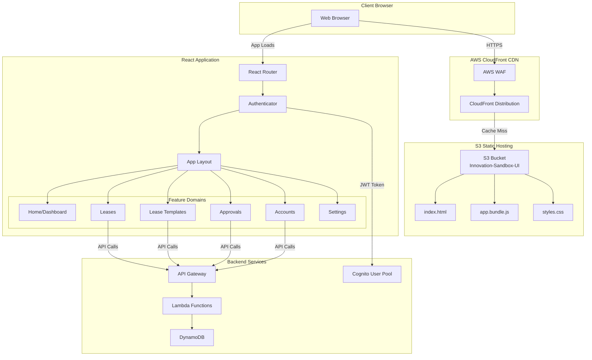
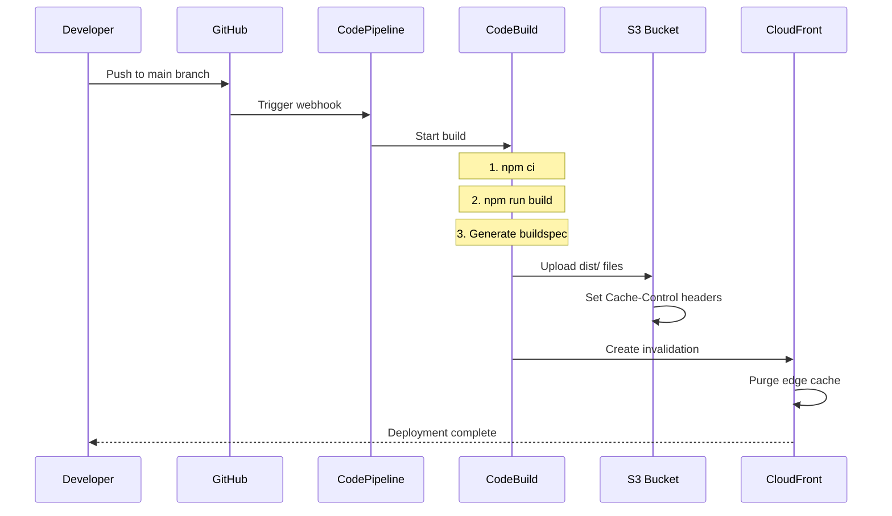
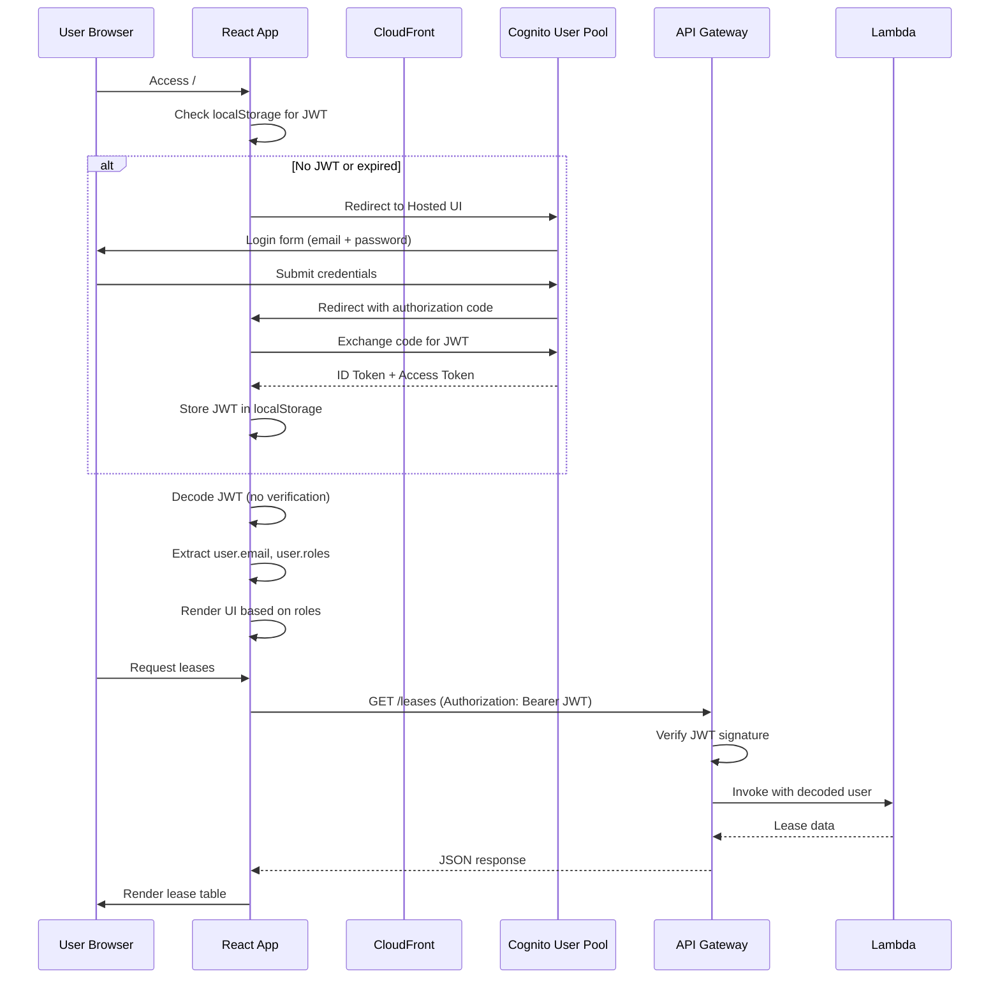

# ISB Frontend Architecture

## Executive Summary

The Innovation Sandbox (ISB) Frontend is a modern React 18 single-page application (SPA) built with TypeScript, Vite, and AWS Cloudscape Design System. It provides the administrative interface for managing sandbox account leases, templates, approvals, and pool capacity across the NDX AWS organization.

**Key Capabilities:**
- Lease request and management interface
- Template administration and configuration
- Approval workflow for managers
- Account pool monitoring and health metrics
- Real-time status updates via API polling
- Role-based access control (Admin, Manager, User)

**Technology Stack:**
- React 18.3 with TypeScript 5.5
- Vite 7.2 (build tool and dev server)
- AWS Cloudscape Design System 3.0
- TanStack Query (React Query) 5.74 for API state management
- React Router 6.30 for navigation

**Hosting:** S3 static hosting + CloudFront CDN

**Status:** Production (Phase 3 Core Component)

---

## Architecture Overview

### Application Structure



### Folder Structure

```
source/frontend/
├── public/                           # Static assets
│   ├── markdown/                     # Help documentation (MD files)
│   │   ├── home.md
│   │   ├── leases.md
│   │   ├── request.md
│   │   ├── approvals.md
│   │   ├── accounts.md
│   │   ├── lease-templates.md
│   │   └── settings.md
│   ├── favicon.ico
│   ├── logo192.png
│   ├── logo512.png
│   └── manifest.json
├── src/
│   ├── assets/                       # Global styles and images
│   │   ├── images/logo.png
│   │   └── styles/
│   │       ├── app.scss              # Application-wide styles
│   │       ├── base.scss             # CSS reset and base
│   │       └── util.scss             # Utility classes
│   ├── components/                   # Shared/reusable components
│   │   ├── AccountsSummary/          # Pool status widget
│   │   ├── AppContext/               # Global app state
│   │   ├── AppLayout/                # Main layout + navigation
│   │   ├── Authenticator/            # Auth wrapper
│   │   ├── BudgetProgressBar/        # Budget visualization
│   │   ├── Form/                     # Form context/helpers
│   │   ├── Loader/                   # Loading spinners
│   │   ├── Markdown/                 # MD renderer
│   │   ├── ThresholdSettings/        # Budget/duration thresholds
│   │   └── Toast/                    # Notifications
│   ├── domains/                      # Feature-based organization
│   │   ├── home/                     # Dashboard
│   │   │   ├── components/
│   │   │   │   ├── AccountsPanel.tsx
│   │   │   │   ├── ApprovalsPanel.tsx
│   │   │   │   ├── LeasePanel.tsx
│   │   │   │   └── MyLeases.tsx
│   │   │   └── pages/Home.tsx
│   │   ├── leases/                   # Lease management
│   │   │   ├── components/
│   │   │   ├── pages/
│   │   │   │   ├── ListLeases.tsx
│   │   │   │   ├── RequestLease.tsx
│   │   │   │   ├── AssignLease.tsx   # Manager assigns to user
│   │   │   │   ├── UpdateLease.tsx   # Edit/extend lease
│   │   │   │   ├── ListApprovals.tsx
│   │   │   │   └── ApprovalDetails.tsx
│   │   │   ├── service.ts            # API calls
│   │   │   ├── hooks.ts              # React Query hooks
│   │   │   ├── helpers.ts
│   │   │   └── types.ts
│   │   ├── leaseTemplates/           # Template admin
│   │   │   ├── components/
│   │   │   │   ├── BasicDetailsForm.tsx
│   │   │   │   ├── BudgetForm.tsx
│   │   │   │   ├── DurationForm.tsx
│   │   │   │   └── CostReportForm.tsx
│   │   │   ├── pages/
│   │   │   │   ├── ListLeaseTemplates.tsx
│   │   │   │   ├── AddLeaseTemplate.tsx
│   │   │   │   └── UpdateLeaseTemplate.tsx
│   │   │   └── formFields/
│   │   ├── accounts/                 # Pool management
│   │   │   ├── pages/
│   │   │   │   ├── ListAccounts.tsx
│   │   │   │   └── AddAccounts.tsx
│   │   │   └── service.ts
│   │   └── settings/                 # Global configuration
│   │       └── pages/Settings.tsx
│   ├── hooks/                        # Custom React hooks
│   │   └── useModal.tsx
│   ├── App.tsx                       # Root component + routing
│   └── main.tsx                      # Entry point
├── index.html                        # HTML template
├── package.json
├── vite.config.ts
└── tsconfig.json
```

---

## Build Process & Deployment

### Vite Build Configuration

**File:** `/Users/cns/httpdocs/cddo/ndx-try-arch/repos/innovation-sandbox-on-aws/source/frontend/vite.config.ts`

```typescript
import react from "@vitejs/plugin-react";
import path from "path";
import { defineConfig } from "vite";

export default defineConfig({
  resolve: {
    alias: {
      "@amzn/innovation-sandbox-frontend": path.resolve(__dirname, "./src"),
    },
  },
  plugins: [react()],
  build: {
    chunkSizeWarningLimit: 3000,
    rollupOptions: {
      onwarn(warning, defaultHandler) {
        // Custom warning suppression
        if (warning.code === "UNRESOLVED_IMPORT") {
          return;
        }
        defaultHandler(warning);
      },
    },
  },
});
```

### Package Scripts

**File:** `/Users/cns/httpdocs/cddo/ndx-try-arch/repos/innovation-sandbox-on-aws/source/frontend/package.json`

```json
{
  "scripts": {
    "dev": "vite",                                      // Dev server (port 5173)
    "start": "vite",                                    // Alias for dev
    "build": "tsc --noEmit && vite build",              // Type check + production build
    "lint": "eslint . --ext ts,tsx && stylelint ...",   // Code quality
    "lint:fix": "eslint . --fix && stylelint --fix",    // Auto-fix
    "preview": "vite preview",                          // Preview production build
    "test": "vitest run --coverage"                     // Unit tests
  }
}
```

### Build Output

```
dist/
├── assets/
│   ├── app-[hash].js           # Application bundle (~2.8MB)
│   ├── app-[hash].css          # Compiled styles
│   ├── vendor-[hash].js        # Third-party libraries (code-split)
│   └── logo-[hash].png         # Assets with hashed filenames
└── index.html                  # Entry HTML with injected script tags
```

### Deployment Pipeline



**Build Steps:**
1. Install dependencies (`npm ci`)
2. TypeScript compilation check (`tsc --noEmit`)
3. Vite production build (`vite build`)
4. Upload to S3 with versioned filenames
5. CloudFront cache invalidation for `index.html`

---

## Hosting Architecture

### S3 Static Website Configuration

**Bucket:** `innovation-sandbox-ui-<account-id>`

**Configuration:**
- **Static website hosting:** Enabled
- **Index document:** `index.html`
- **Error document:** `index.html` (SPA routing)
- **Versioning:** Enabled (optional)
- **Encryption:** AES-256 (SSE-S3)
- **Public access:** Blocked (CloudFront only)

**Bucket Policy:**
```json
{
  "Version": "2012-10-17",
  "Statement": [
    {
      "Effect": "Allow",
      "Principal": {
        "Service": "cloudfront.amazonaws.com"
      },
      "Action": "s3:GetObject",
      "Resource": "arn:aws:s3:::innovation-sandbox-ui-*/*",
      "Condition": {
        "StringEquals": {
          "AWS:SourceArn": "arn:aws:cloudfront::123456789012:distribution/E1ABCD"
        }
      }
    }
  ]
}
```

### CloudFront Distribution

**Distribution ID:** `E1ABCD` (example)

**Configuration:**

| Setting | Value | Purpose |
|---------|-------|---------|
| **Origin** | `innovation-sandbox-ui.s3.amazonaws.com` | S3 bucket |
| **Origin Access** | Origin Access Control (OAC) | Secure S3 access |
| **Viewer Protocol** | HTTPS Only | Security |
| **Allowed Methods** | GET, HEAD, OPTIONS | Read-only |
| **Cached Methods** | GET, HEAD | Performance |
| **Compression** | gzip, Brotli | Bandwidth savings |
| **Default TTL** | 86400 (24 hours) | Static assets |
| **Custom Error Response** | 404 → /index.html (200) | SPA routing |
| **WAF Integration** | AWS WAF Web ACL | DDoS/bot protection |

**Cache Behaviors:**

| Path Pattern | TTL | Headers | Purpose |
|--------------|-----|---------|---------|
| `/assets/*` | 1 year | None | Immutable JS/CSS (hashed filenames) |
| `/index.html` | 0 (no cache) | All | Always fetch latest SPA shell |
| `/markdown/*` | 1 hour | None | Help documentation |
| Default | 24 hours | Authorization | API proxy (if applicable) |

**Security Headers (Custom Response Headers):**
```yaml
Strict-Transport-Security: max-age=31536000; includeSubDomains
X-Content-Type-Options: nosniff
X-Frame-Options: DENY
X-XSS-Protection: 1; mode=block
Referrer-Policy: strict-origin-when-cross-origin
```

---

## Authentication Flow

### Cognito Integration



### Authenticator Component

**File:** `/Users/cns/httpdocs/cddo/ndx-try-arch/repos/innovation-sandbox-on-aws/source/frontend/src/components/Authenticator/index.tsx`

**Key Responsibilities:**
1. Check for JWT token in localStorage
2. Decode JWT to extract user object
3. Validate token expiration (client-side)
4. Redirect to Cognito Hosted UI if unauthenticated
5. Provide user context to child components
6. Handle token refresh (if refresh token present)

**JWT Structure:**
```json
{
  "header": {
    "alg": "RS256",
    "typ": "JWT"
  },
  "payload": {
    "sub": "550e8400-e29b-41d4-a716-446655440000",
    "email": "user@example.gov.uk",
    "cognito:groups": ["IsbUsers"],
    "user": {
      "email": "user@example.gov.uk",
      "roles": ["User"]
    },
    "exp": 1735689600,
    "iat": 1735603200
  }
}
```

**Role Mapping:**
- **Cognito Group:** `IsbAdmins` → **App Role:** `Admin`
- **Cognito Group:** `IsbManagers` → **App Role:** `Manager`
- **Cognito Group:** `IsbUsers` → **App Role:** `User`

---

## API Integration

### Service Layer Pattern

Each domain has a `service.ts` file encapsulating API calls:

**File:** `/Users/cns/httpdocs/cddo/ndx-try-arch/repos/innovation-sandbox-on-aws/source/frontend/src/domains/leases/service.ts`

```typescript
import { apiClient } from '@amzn/innovation-sandbox-frontend/lib/api';

export const leaseService = {
  // List all leases (with optional filters)
  listLeases: async (filters?: LeaseFilters) => {
    const params = new URLSearchParams(filters);
    return apiClient.get(`/leases?${params}`);
  },

  // Get single lease by ID
  getLease: async (leaseId: string) => {
    return apiClient.get(`/leases/${leaseId}`);
  },

  // Create new lease
  createLease: async (payload: CreateLeaseRequest) => {
    return apiClient.post('/leases', payload);
  },

  // Update lease (extend, modify)
  updateLease: async (leaseId: string, updates: UpdateLeaseRequest) => {
    return apiClient.put(`/leases/${leaseId}`, updates);
  },

  // Terminate lease
  deleteLease: async (leaseId: string) => {
    return apiClient.delete(`/leases/${leaseId}`);
  },

  // Approve pending lease (managers only)
  approveLease: async (leaseId: string, decision: 'APPROVED' | 'DENIED', reason?: string) => {
    return apiClient.post(`/leases/${leaseId}/review`, { decision, reason });
  },

  // Freeze lease
  freezeLease: async (leaseId: string) => {
    return apiClient.post(`/leases/${leaseId}/freeze`);
  },

  // Unfreeze lease
  unfreezeLease: async (leaseId: string) => {
    return apiClient.post(`/leases/${leaseId}/unfreeze`);
  },
};
```

### API Client Configuration

```typescript
// src/lib/api.ts
import axios from 'axios';

const API_BASE_URL = import.meta.env.VITE_API_URL || '/api';

export const apiClient = axios.create({
  baseURL: API_BASE_URL,
  timeout: 30000,
  headers: {
    'Content-Type': 'application/json',
  },
});

// Request interceptor: Add JWT token
apiClient.interceptors.request.use((config) => {
  const token = localStorage.getItem('idToken');
  if (token) {
    config.headers.Authorization = `Bearer ${token}`;
  }
  return config;
});

// Response interceptor: Handle errors
apiClient.interceptors.response.use(
  (response) => response.data,
  (error) => {
    if (error.response?.status === 401) {
      // Token expired, redirect to login
      localStorage.removeItem('idToken');
      window.location.href = '/login';
    }
    return Promise.reject(error);
  }
);
```

### React Query Hooks

**File:** `/Users/cns/httpdocs/cddo/ndx-try-arch/repos/innovation-sandbox-on-aws/source/frontend/src/domains/leases/hooks.ts`

```typescript
import { useQuery, useMutation, useQueryClient } from '@tanstack/react-query';
import { leaseService } from './service';

// Fetch all leases (with caching)
export const useLeases = (filters?: LeaseFilters) => {
  return useQuery({
    queryKey: ['leases', filters],
    queryFn: () => leaseService.listLeases(filters),
    staleTime: 30000, // 30 seconds
  });
};

// Fetch single lease
export const useLease = (leaseId: string) => {
  return useQuery({
    queryKey: ['lease', leaseId],
    queryFn: () => leaseService.getLease(leaseId),
    enabled: !!leaseId,
  });
};

// Create lease mutation
export const useCreateLease = () => {
  const queryClient = useQueryClient();

  return useMutation({
    mutationFn: leaseService.createLease,
    onSuccess: () => {
      queryClient.invalidateQueries({ queryKey: ['leases'] });
    },
  });
};

// Update lease mutation
export const useUpdateLease = () => {
  const queryClient = useQueryClient();

  return useMutation({
    mutationFn: ({ leaseId, updates }: { leaseId: string; updates: UpdateLeaseRequest }) =>
      leaseService.updateLease(leaseId, updates),
    onSuccess: (_, variables) => {
      queryClient.invalidateQueries({ queryKey: ['lease', variables.leaseId] });
      queryClient.invalidateQueries({ queryKey: ['leases'] });
    },
  });
};
```

**Benefits:**
- **Caching:** Avoid redundant API calls
- **Background refetching:** Keep data fresh
- **Optimistic updates:** Instant UI feedback
- **Cache invalidation:** Automatic data refresh on mutations

---

## Page Components

### 1. Home / Dashboard

**File:** `/Users/cns/httpdocs/cddo/ndx-try-arch/repos/innovation-sandbox-on-aws/source/frontend/src/domains/home/pages/Home.tsx`

**Route:** `/`

**Components:**
- **MyLeases:** User's active leases (compact cards)
- **LeasePanel:** Quick stats (active, pending, expired)
- **AccountsPanel:** Pool capacity (pie chart + table)
- **ApprovalsPanel:** Pending approvals (managers only)

**Data Sources:**
- `GET /leases?ownerId={currentUser.email}`
- `GET /accounts`
- `GET /leases?status=PendingApproval` (managers)

### 2. Request Lease

**File:** `/Users/cns/httpdocs/cddo/ndx-try-arch/repos/innovation-sandbox-on-aws/source/frontend/src/domains/leases/pages/RequestLease.tsx`

**Route:** `/request`

**Form Fields:**
1. **Lease Template** (dropdown)
   - Fetches from `GET /templates?visibility=PUBLIC`
   - Displays template name, duration, budget
2. **User Email** (text, optional for admins/managers)
   - Defaults to current user
   - Admins can create leases for others
3. **Comments** (textarea, optional)
   - Justification for lease request

**Submission Flow:**
1. Validate form (client-side)
2. `POST /leases` with payload
3. Show success toast
4. Redirect to `/leases` or `/` (depending on auto-approve)

**Auto-Approve Logic:**
- If user has `Admin` role → immediate approval
- If template allows auto-approve → immediate approval
- Otherwise → `PendingApproval` state

### 3. List Leases

**File:** `/Users/cns/httpdocs/cddo/ndx-try-arch/repos/innovation-sandbox-on-aws/source/frontend/src/domains/leases/pages/ListLeases.tsx`

**Route:** `/leases`

**Features:**
- **Filters:** Status, Owner, Template, Date range
- **Sorting:** Creation date, Expiration date, Budget
- **Pagination:** 25/50/100 per page
- **Actions:**
  - **View:** Navigate to `/leases/{leaseId}`
  - **Edit:** Navigate to `/leases/edit/{leaseId}`
  - **Terminate:** Confirm modal → `DELETE /leases/{leaseId}`
  - **Freeze/Unfreeze:** `POST /leases/{leaseId}/freeze|unfreeze`
  - **Extend:** Open extend modal → `PUT /leases/{leaseId}`

**Columns:**
| Column | Data | Format |
|--------|------|--------|
| Lease ID | `uuid.substring(0, 8)` | Truncated UUID |
| Owner | `userEmail` | Email |
| Account | `accountId` | AWS Account ID |
| Status | `status` | Badge (color-coded) |
| Template | `templateName` | Link |
| Budget | `maxSpend` | Currency (`$123.45`) |
| Duration | `durationHours` | Human readable (`3 days`) |
| Expires | `expiresAt` | Relative time (`in 2 hours`) |
| Actions | - | Button group |

### 4. List Approvals

**File:** `/Users/cns/httpdocs/cddo/ndx-try-arch/repos/innovation-sandbox-on-aws/source/frontend/src/domains/leases/pages/ListApprovals.tsx`

**Route:** `/approvals`

**Access:** Managers and Admins only

**Features:**
- List leases with `status=PendingApproval`
- Quick approve/deny actions
- Bulk selection for batch operations
- Filter by requester, template, date

**Actions:**
- **Approve:** `POST /leases/{leaseId}/review` with `decision=APPROVED`
- **Deny:** `POST /leases/{leaseId}/review` with `decision=DENIED` + reason

### 5. Approval Details

**File:** `/Users/cns/httpdocs/cddo/ndx-try-arch/repos/innovation-sandbox-on-aws/source/frontend/src/domains/leases/pages/ApprovalDetails.tsx`

**Route:** `/approvals/{leaseId}`

**Displays:**
- Requester information (email, organization)
- Requested template details
- Budget and duration
- Comments/justification
- User's lease history (previous leases, compliance)
- Account availability status

**Decision Form:**
- **Approve Button:** Green, prominent
- **Deny Button:** Red, requires reason (textarea)
- **Comments:** Manager can add notes

### 6. Assign Lease (Manager Feature)

**File:** `/Users/cns/httpdocs/cddo/ndx-try-arch/repos/innovation-sandbox-on-aws/source/frontend/src/domains/leases/pages/AssignLease.tsx`

**Route:** `/assign`

**Access:** Managers and Admins only

**Purpose:** Create lease on behalf of another user

**Form Fields:**
- User email (required, autocomplete from Identity Center)
- Lease template
- Custom budget/duration (optional override)
- Comments

**Submission:** `POST /leases` with `userEmail` + `createdBy` metadata

### 7. List Lease Templates

**File:** `/Users/cns/httpdocs/cddo/ndx-try-arch/repos/innovation-sandbox-on-aws/source/frontend/src/domains/leaseTemplates/pages/ListLeaseTemplates.tsx`

**Route:** `/lease_templates`

**Access:** All users (view), Admins only (create/edit)

**Features:**
- Filter by visibility (PUBLIC, PRIVATE)
- Search by name
- Sort by creation date, usage count
- Clone template (create copy)

**Actions:**
- **Create:** Navigate to `/lease_templates/new` (admins)
- **Edit:** Navigate to `/lease_templates/edit/{uuid}` (admins)
- **Delete:** Soft delete (set `isActive=false`)
- **Clone:** Duplicate template with new name

### 8. Add/Update Lease Template

**File:** `/Users/cns/httpdocs/cddo/ndx-try-arch/repos/innovation-sandbox-on-aws/source/frontend/src/domains/leaseTemplates/pages/AddLeaseTemplate.tsx`

**Route:** `/lease_templates/new` or `/lease_templates/edit/{uuid}`

**Form Sections:**
1. **Basic Details** (`BasicDetailsForm.tsx`)
   - Template name
   - Description
   - Visibility (PUBLIC/PRIVATE)
   - Cost report group

2. **Budget Configuration** (`BudgetForm.tsx`)
   - Default budget (USD)
   - Budget thresholds (e.g., 75%, 90%)
   - Auto-freeze on threshold breach

3. **Duration Configuration** (`DurationForm.tsx`)
   - Default duration (hours)
   - Duration thresholds (e.g., 4 hours remaining)
   - Max extension allowed

4. **Cost Reporting** (`CostReportForm.tsx`)
   - Cost report group (for aggregation)
   - Notification settings

**Validation:**
- Name required (unique)
- Budget > 0
- Duration > 0 and < max (global config)
- Thresholds in ascending order

### 9. List Accounts

**File:** `/Users/cns/httpdocs/cddo/ndx-try-arch/repos/innovation-sandbox-on-aws/source/frontend/src/domains/accounts/pages/ListAccounts.tsx`

**Route:** `/accounts`

**Access:** Admins only

**Features:**
- View all pool accounts
- Filter by status (AVAILABLE, LEASED, QUARANTINE, CLEANUP)
- Sort by last cleaned date
- Bulk operations (move to OU, mark for cleanup)

**Columns:**
| Column | Data | Format |
|--------|------|--------|
| Account ID | `accountId` | AWS Account ID |
| Status | `status` | Status indicator (colored) |
| Current Lease | `leaseUuid` | Link (if leased) |
| OU Path | `ouPath` | Organization path |
| Last Cleaned | `lastCleanedAt` | Relative time |
| Created | `createdAt` | Date |
| Actions | - | Button group |

**Actions:**
- **View Details:** Modal with full account metadata
- **Force Cleanup:** Trigger cleanup manually
- **Quarantine:** Move to quarantine OU
- **Remove from Pool:** Soft delete

### 10. Add Accounts

**File:** `/Users/cns/httpdocs/cddo/ndx-try-arch/repos/innovation-sandbox-on-aws/source/frontend/src/domains/accounts/pages/AddAccounts.tsx`

**Route:** `/accounts/new`

**Access:** Admins only

**Form:**
- **Account IDs:** Textarea (one per line, supports bulk)
- **Initial OU:** Dropdown (organization units)
- **Tags:** Key-value pairs

**Validation:**
- Account ID format (12 digits)
- Account exists in AWS Organizations
- Account not already in pool

**Submission:** `POST /accounts` with array of account objects

### 11. Settings

**File:** `/Users/cns/httpdocs/cddo/ndx-try-arch/repos/innovation-sandbox-on-aws/source/frontend/src/domains/settings/pages/Settings.tsx`

**Route:** `/settings`

**Access:** Admins only

**Configuration Sections:**
1. **Global Settings** (from AppConfig)
   - Maintenance mode toggle
   - Max leases per user
   - Max budget
   - Max duration
   - TTL for expired leases

2. **Cleanup Configuration**
   - Failed attempts before quarantine
   - Retry delay
   - Successful attempts to finish

3. **AWS Nuke Configuration**
   - Protected resources
   - Excluded resource types
   - Nuke config file upload

**API Endpoints:**
- `GET /configurations/global` → Fetch settings
- `PUT /configurations/global` → Update settings
- `GET /configurations/nuke` → Fetch nuke config
- `PUT /configurations/nuke` → Update nuke config

---

## State Management

### AppContext

**File:** `/Users/cns/httpdocs/cddo/ndx-try-arch/repos/innovation-sandbox-on-aws/source/frontend/src/components/AppContext/index.tsx`

**Purpose:** Global application state (user, config, maintenance mode)

```typescript
interface AppContextType {
  user: {
    email: string;
    roles: ('Admin' | 'Manager' | 'User')[];
  } | null;
  config: {
    maintenanceMode: boolean;
    maxLeasesPerUser: number;
    maxBudget: number;
    maxDurationHours: number;
  };
  setUser: (user: AppContextType['user']) => void;
  setConfig: (config: AppContextType['config']) => void;
}

export const AppContext = createContext<AppContextType | undefined>(undefined);

export const AppContextProvider = ({ children }) => {
  const [user, setUser] = useState<AppContextType['user']>(null);
  const [config, setConfig] = useState<AppContextType['config']>({
    maintenanceMode: false,
    maxLeasesPerUser: 3,
    maxBudget: 5000,
    maxDurationHours: 168,
  });

  // Fetch user from JWT on mount
  useEffect(() => {
    const token = localStorage.getItem('idToken');
    if (token) {
      const decoded = decodeJWT(token);
      setUser(decoded.user);
    }
  }, []);

  // Fetch global config on mount
  useEffect(() => {
    fetch('/api/configurations/global')
      .then(res => res.json())
      .then(data => setConfig(data));
  }, []);

  return (
    <AppContext.Provider value={{ user, config, setUser, setConfig }}>
      {children}
    </AppContext.Provider>
  );
};

export const useAppContext = () => {
  const context = useContext(AppContext);
  if (!context) {
    throw new Error('useAppContext must be used within AppContextProvider');
  }
  return context;
};
```

### TanStack Query Cache

**File:** `/Users/cns/httpdocs/cddo/ndx-try-arch/repos/innovation-sandbox-on-aws/source/frontend/src/App.tsx`

```typescript
const queryClient = new QueryClient({
  defaultOptions: {
    queries: {
      refetchOnWindowFocus: false,   // Don't refetch on tab focus
      refetchOnMount: false,          // Don't refetch on component mount
      retry: false,                   // Don't retry failed requests
      staleTime: 30000,               // Data fresh for 30 seconds
    },
  },
});
```

**Cache Keys:**
- `['leases']` → All leases
- `['lease', leaseId]` → Single lease
- `['templates']` → All templates
- `['template', templateId]` → Single template
- `['accounts']` → All accounts
- `['account', accountId]` → Single account
- `['approvals']` → Pending approvals
- `['config', 'global']` → Global configuration

**Invalidation Strategy:**
- On mutation success, invalidate related queries
- Manual refresh button in UI
- Automatic background refetch (configurable per query)

---

## UI Components Library

### AWS Cloudscape Design System

**Package:** `@cloudscape-design/components` v3.0.957

**Key Components Used:**

| Component | Usage | File |
|-----------|-------|------|
| `Table` | Data tables (leases, accounts, templates) | `ListLeases.tsx` |
| `Form` | Form layouts | `RequestLease.tsx` |
| `FormField` | Form field wrapper | All forms |
| `Input` | Text inputs | All forms |
| `Select` | Dropdowns | Template selection |
| `Button` | Primary/secondary actions | All pages |
| `Modal` | Dialogs (confirm, details) | Delete confirmations |
| `SpaceBetween` | Layout spacing | All pages |
| `Container` | Content boxes | Dashboard panels |
| `Header` | Page/section headers | All pages |
| `StatusIndicator` | Status badges | Lease status |
| `ProgressBar` | Budget/duration progress | Lease details |
| `Flashbar` | Toast notifications | Success/error messages |
| `Pagination` | Table pagination | All tables |

### Custom Components

**1. BudgetProgressBar**

**File:** `/Users/cns/httpdocs/cddo/ndx-try-arch/repos/innovation-sandbox-on-aws/source/frontend/src/components/BudgetProgressBar/index.tsx`

```tsx
interface BudgetProgressBarProps {
  current: number;      // Current spend
  max: number;          // Budget limit
  thresholds?: number[]; // Warning thresholds (e.g., [75, 90])
}

export const BudgetProgressBar = ({ current, max, thresholds = [75, 90] }) => {
  const percentage = (current / max) * 100;
  const color = percentage >= thresholds[1] ? 'red' :
                percentage >= thresholds[0] ? 'orange' : 'green';

  return (
    <ProgressBar
      value={percentage}
      variant={color}
      label={`$${current.toFixed(2)} / $${max.toFixed(2)}`}
      description={`${percentage.toFixed(1)}% of budget`}
    />
  );
};
```

**2. AccountsSummary (Pie Chart + Table)**

**File:** `/Users/cns/httpdocs/cddo/ndx-try-arch/repos/innovation-sandbox-on-aws/source/frontend/src/components/AccountsSummary/index.tsx`

**Purpose:** Visualize pool account distribution

**Data:**
```typescript
interface AccountSummary {
  AVAILABLE: number;
  LEASED: number;
  QUARANTINE: number;
  CLEANUP: number;
}
```

**Components:**
- `AccountsPieChart` → Pie chart visualization
- `AccountsSummaryTable` → Breakdown table
- `NoAccounts` → Empty state
- `AccountsLoading` → Loading skeleton

**3. ThresholdSettings**

**File:** `/Users/cns/httpdocs/cddo/ndx-try-arch/repos/innovation-sandbox-on-aws/source/frontend/src/components/ThresholdSettings/index.tsx`

**Purpose:** Configure budget/duration thresholds in templates

**Features:**
- Add/remove thresholds dynamically
- Validation (ascending order, 0-100%)
- Drag-and-drop reordering (optional)

---

## Routing & Navigation

### React Router Configuration

**File:** `/Users/cns/httpdocs/cddo/ndx-try-arch/repos/innovation-sandbox-on-aws/source/frontend/src/App.tsx`

```tsx
const routes = [
  { path: "/", Element: Home },
  { path: "/request", Element: RequestLease },
  { path: "/assign", Element: AssignLease },              // Managers+
  { path: "/settings", Element: Settings },               // Admins only
  { path: "/lease_templates", Element: ListLeaseTemplates },
  { path: "/lease_templates/new", Element: AddLeaseTemplate }, // Admins only
  { path: "/lease_templates/edit/:uuid", Element: UpdateLeaseTemplate }, // Admins only
  { path: "/accounts", Element: ListAccounts },           // Admins only
  { path: "/accounts/new", Element: AddAccounts },        // Admins only
  { path: "/approvals", Element: ListApprovals },         // Managers+
  { path: "/approvals/:leaseId", Element: ApprovalDetails }, // Managers+
  { path: "/leases", Element: ListLeases },
  { path: "/leases/edit/:leaseId", Element: UpdateLease },
];
```

### Navigation Menu

**File:** `/Users/cns/httpdocs/cddo/ndx-try-arch/repos/innovation-sandbox-on-aws/source/frontend/src/components/AppLayout/constants.tsx`

```typescript
export const navigationItems = [
  { type: "link", text: "Home", href: "/" },
  { type: "link", text: "Request Lease", href: "/request" },
  { type: "link", text: "My Leases", href: "/leases" },
  {
    type: "section",
    text: "Management",
    items: [
      { type: "link", text: "Approvals", href: "/approvals", roles: ['Manager', 'Admin'] },
      { type: "link", text: "Assign Lease", href: "/assign", roles: ['Manager', 'Admin'] },
      { type: "link", text: "Lease Templates", href: "/lease_templates", roles: ['Admin'] },
      { type: "link", text: "Account Pool", href: "/accounts", roles: ['Admin'] },
      { type: "link", text: "Settings", href: "/settings", roles: ['Admin'] },
    ],
  },
  { type: "divider" },
  { type: "link", text: "Help", href: "/help", external: true },
];
```

**Role-Based Filtering:**
```tsx
const filteredNav = navigationItems.filter(item => {
  if (item.roles) {
    return item.roles.some(role => user.roles.includes(role));
  }
  return true;
});
```

---

## Monitoring & Error Handling

### Error Boundaries

```tsx
class ErrorBoundary extends React.Component {
  state = { hasError: false };

  static getDerivedStateFromError(error) {
    return { hasError: true };
  }

  componentDidCatch(error, errorInfo) {
    console.error('React Error:', error, errorInfo);
    // Send to monitoring service (e.g., Sentry)
  }

  render() {
    if (this.state.hasError) {
      return <ErrorPanel message="Something went wrong. Please refresh the page." />;
    }
    return this.props.children;
  }
}
```

### Toast Notifications

**Library:** `react-toastify` v11.0.2

**Usage:**
```tsx
import { toast } from 'react-toastify';

// Success
toast.success('Lease created successfully!');

// Error
toast.error('Failed to create lease. Please try again.');

// Warning
toast.warn('Budget threshold exceeded (75%)');

// Info
toast.info('Lease expires in 4 hours');
```

### API Error Handling

```tsx
try {
  await leaseService.createLease(payload);
  toast.success('Lease created!');
  navigate('/leases');
} catch (error) {
  if (error.response?.status === 400) {
    toast.error(`Validation error: ${error.response.data.message}`);
  } else if (error.response?.status === 403) {
    toast.error('You do not have permission to create leases');
  } else if (error.response?.status === 409) {
    toast.error('No accounts available. Please try again later.');
  } else {
    toast.error('Failed to create lease. Please try again.');
  }
  console.error('Create lease error:', error);
}
```

---

## Performance Optimizations

### Code Splitting

```tsx
// Lazy load heavy components
const Settings = lazy(() => import('./domains/settings/pages/Settings'));
const AddLeaseTemplate = lazy(() => import('./domains/leaseTemplates/pages/AddLeaseTemplate'));

// Wrap in Suspense
<Suspense fallback={<FullPageLoader />}>
  <Routes>
    <Route path="/settings" element={<Settings />} />
    <Route path="/lease_templates/new" element={<AddLeaseTemplate />} />
  </Routes>
</Suspense>
```

### Memoization

```tsx
import { memo, useMemo } from 'react';

// Memoize expensive computations
const LeaseTable = memo(({ leases }) => {
  const sortedLeases = useMemo(() => {
    return leases.sort((a, b) => b.createdAt - a.createdAt);
  }, [leases]);

  return <Table items={sortedLeases} />;
});
```

### Virtual Scrolling

For large tables (>500 rows), consider `react-window`:

```tsx
import { FixedSizeList } from 'react-window';

<FixedSizeList
  height={600}
  itemCount={leases.length}
  itemSize={50}
>
  {({ index, style }) => (
    <div style={style}>
      <LeaseRow lease={leases[index]} />
    </div>
  )}
</FixedSizeList>
```

---

## Security Considerations

### Content Security Policy (CSP)

CloudFront response headers:

```
Content-Security-Policy:
  default-src 'self';
  script-src 'self' 'unsafe-inline' 'unsafe-eval';
  style-src 'self' 'unsafe-inline';
  img-src 'self' data: https:;
  font-src 'self' data:;
  connect-src 'self' https://*.execute-api.us-west-2.amazonaws.com;
```

### XSS Protection

- All user input sanitized via React's default escaping
- Markdown rendering uses `react-markdown` with strict settings
- No `dangerouslySetInnerHTML` usage

### CSRF Protection

- SameSite cookies for session management
- JWT tokens stored in localStorage (not cookies)
- API requests include CORS headers

---

## Related Documentation

- [10-isb-core-architecture.md](/Users/cns/httpdocs/cddo/ndx-try-arch/docs/10-isb-core-architecture.md) - Backend API architecture
- [11-lease-lifecycle.md](/Users/cns/httpdocs/cddo/ndx-try-arch/docs/11-lease-lifecycle.md) - Lease state machine
- [20-approver-system.md](/Users/cns/httpdocs/cddo/ndx-try-arch/docs/20-approver-system.md) - Approval workflow integration
- [01-upstream-analysis.md](/Users/cns/httpdocs/cddo/ndx-try-arch/docs/01-upstream-analysis.md) - Upstream solution comparison

---

**Document Version:** 1.0
**Last Updated:** 2026-02-03
**Status:** Production System
