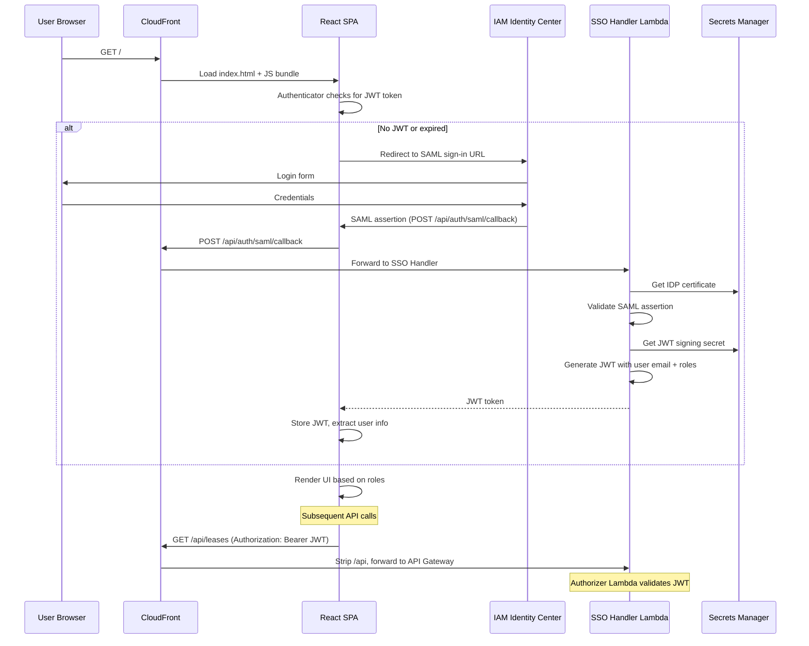
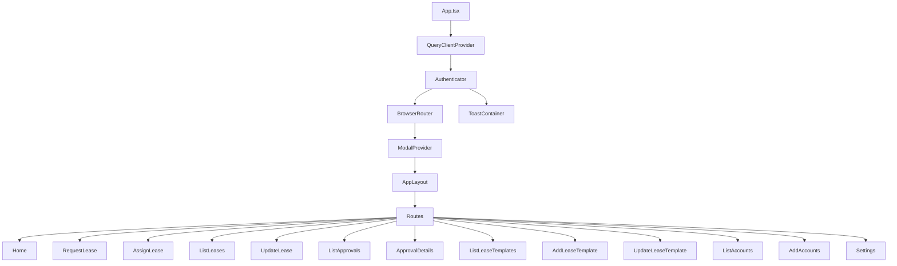

# ISB Frontend

> **Last Updated**: 2026-03-02
> **Source**: [co-cddo/innovation-sandbox-on-aws](https://github.com/co-cddo/innovation-sandbox-on-aws)
> **Captured SHA**: `cf75b87`

## Executive Summary

The Innovation Sandbox frontend is a React 18 single-page application built with TypeScript, Vite 7.2, and the AWS Cloudscape Design System. It provides a role-based interface for end users to request sandbox accounts, for managers to approve requests, and for admins to manage the account pool and configuration. The frontend is built at CDK synth time, deployed to S3, and served through a CloudFront distribution that also proxies API requests to the API Gateway backend. Authentication uses SAML 2.0 SSO via IAM Identity Center, with JWT tokens for subsequent API calls.

## Architecture Overview

```mermaid
graph TB
    subgraph "User Browser"
        SPA[React SPA]
        RQ[TanStack Query<br/>Cache]
        RR[React Router<br/>Client-side routing]
    end

    subgraph "CloudFront Distribution"
        CF_DEFAULT["Default Behavior<br/>S3 Origin (static assets)"]
        CF_API["/api/* Behavior<br/>API Gateway Origin"]
        CF_FN_REDIRECT[CF Function:<br/>Path Redirect to index.html]
        CF_FN_REWRITE[CF Function:<br/>Strip /api prefix]
        RESP_HEADERS[Response Headers Policy<br/>CSP, HSTS, X-Frame-Options]
    end

    subgraph "S3 Hosting"
        S3[S3 Bucket<br/>KMS encrypted, versioned]
        OAC[Origin Access Control]
    end

    subgraph "API Layer"
        WAF[AWS WAF v2]
        APIGW[API Gateway REST API]
        AUTH_LAMBDA[Authorizer Lambda]
    end

    subgraph "Backend Services"
        LEASES_API[/leases]
        TEMPLATES_API[/leaseTemplates]
        ACCOUNTS_API[/accounts]
        CONFIG_API[/configurations]
        SSO_API[/auth/*]
    end

    SPA -->|HTTPS GET /| CF_DEFAULT
    CF_DEFAULT --> CF_FN_REDIRECT
    CF_FN_REDIRECT --> OAC
    OAC --> S3
    CF_DEFAULT --> RESP_HEADERS

    SPA -->|HTTPS /api/*| CF_API
    CF_API --> CF_FN_REWRITE
    CF_FN_REWRITE --> WAF
    WAF --> APIGW
    APIGW --> AUTH_LAMBDA
    AUTH_LAMBDA --> LEASES_API
    AUTH_LAMBDA --> TEMPLATES_API
    AUTH_LAMBDA --> ACCOUNTS_API
    AUTH_LAMBDA --> CONFIG_API
    APIGW --> SSO_API
```

---

## Technology Stack

| Layer | Technology | Version | Purpose |
|-------|-----------|---------|---------|
| Framework | React | 18.3.1 | UI component library |
| Language | TypeScript | 5.5.4 | Type-safe development |
| Build Tool | Vite | 7.2.2 | Dev server and production bundler |
| UI Library | AWS Cloudscape Design System | 3.0.957 | AWS-native component library |
| Data Fetching | TanStack Query (React Query) | 5.74.4 | Server state management with caching |
| Routing | React Router | 6.30.1 | Client-side SPA routing |
| Notifications | react-toastify | 11.0.2 | Toast notification system |
| Markdown | react-markdown | 9.0.3 | Help page rendering |
| Animation | framer-motion | 11.3.28 | Page transitions |
| Icons | react-icons | 5.3.0 | Icon library |
| Date | moment | 2.30.1 | Date formatting |
| Styling | SCSS | via sass 1.77.8 | Custom styles |
| Testing | Vitest + Testing Library | -- | Unit and component testing |
| Mocking | MSW | 2.3.1 | API mocking for tests |

**Source**: `source/frontend/package.json`

---

## Application Structure

### Folder Layout

```
source/frontend/
  public/
    markdown/                     # Help documentation (rendered with react-markdown)
      home.md, leases.md, request.md, approvals.md,
      accounts.md, lease-templates.md, settings.md
    favicon.ico, logo192.png, logo512.png, manifest.json
  src/
    assets/
      images/logo.png
      styles/
        app.scss                  # Application-wide styles
        base.scss                 # CSS reset and base
        util.scss                 # Utility classes
    components/                   # Shared/reusable components
      AccountsSummary/            # Pool status pie chart + table
      Animate/                    # Page transition wrapper
      AppContext/                 # Global app state provider
      AppLayout/                  # Main layout shell with navigation
      Authenticator/              # Auth check wrapper
      BudgetProgressBar/          # Budget visualization
      Form/                       # Form context and helpers
      FullPageLoader/             # Loading spinner
      Loader/                     # Inline loader
      Markdown/                   # Markdown renderer component
      ThresholdSettings/          # Budget/duration threshold editor
      Toast/                      # Toast notification helper
    domains/                      # Feature-based module organization
      home/
        components/
          AccountsPanel.tsx       # Pool capacity summary
          ApprovalsPanel.tsx      # Pending approvals count
          LeasePanel.tsx          # Lease statistics
          MyLeases.tsx            # User's active leases
        pages/Home.tsx            # Dashboard page
      leases/
        components/               # Lease-specific UI components
        pages/
          ListLeases.tsx          # Lease table with filters
          RequestLease.tsx        # New lease request form
          AssignLease.tsx         # Manager assigns to user
          UpdateLease.tsx         # Edit/extend lease
          ListApprovals.tsx       # Pending approval queue
          ApprovalDetails.tsx     # Review and approve/deny
        service.ts                # API calls for leases
        hooks.ts                  # React Query hooks
        helpers.ts                # Utility functions
        types.ts                  # TypeScript interfaces
      leaseTemplates/
        components/
          BasicDetailsForm.tsx    # Name, description, visibility
          BudgetForm.tsx          # Budget and thresholds
          DurationForm.tsx        # Duration and thresholds
          CostReportForm.tsx      # Cost reporting group
        pages/
          ListLeaseTemplates.tsx  # Template catalog
          AddLeaseTemplate.tsx    # Create new template
          UpdateLeaseTemplate.tsx # Edit existing template
        formFields/               # Reusable form field components
      accounts/
        pages/
          ListAccounts.tsx        # Pool account inventory
          AddAccounts.tsx         # Register new accounts
        service.ts                # API calls for accounts
      settings/
        pages/Settings.tsx        # Global configuration editor
    helpers/
      AuthService.ts              # SAML SSO login/logout helpers
    hooks/
      useModal.tsx                # Modal state management
      useUser.tsx                 # Current user context hook
    lib/
      api.ts                      # Axios-based API client
    App.tsx                       # Root component with routes
    main.tsx                      # Entry point (React.createRoot)
  index.html                      # HTML template
  package.json
  vite.config.ts
  tsconfig.json
```

**Source**: `source/frontend/src/`

---

## Routing and Pages

### Route Configuration

All routes are defined in `App.tsx`:

```typescript
const routes = [
  { path: "/",                          Element: Home },
  { path: "/request",                   Element: RequestLease },
  { path: "/assign",                    Element: AssignLease },
  { path: "/settings",                  Element: Settings },
  { path: "/lease_templates",           Element: ListLeaseTemplates },
  { path: "/lease_templates/new",       Element: AddLeaseTemplate },
  { path: "/lease_templates/edit/:uuid", Element: UpdateLeaseTemplate },
  { path: "/accounts",                  Element: ListAccounts },
  { path: "/accounts/new",             Element: AddAccounts },
  { path: "/approvals",                Element: ListApprovals },
  { path: "/approvals/:leaseId",       Element: ApprovalDetails },
  { path: "/leases",                   Element: ListLeases },
  { path: "/leases/edit/:leaseId",     Element: UpdateLease },
];
```

### Role-Based Access

Routes are filtered in the navigation sidebar based on user roles:

| Route | User | Manager | Admin | Description |
|-------|:----:|:-------:|:-----:|-------------|
| `/` (Home) | Yes | Yes | Yes | Dashboard with lease stats and panels |
| `/request` | Yes | Yes | Yes | Request a new sandbox lease |
| `/leases` | Yes | Yes | Yes | View own leases (all leases for Manager/Admin) |
| `/leases/edit/:leaseId` | Yes | Yes | Yes | Update/extend a lease |
| `/assign` | -- | Yes | Yes | Create lease on behalf of another user |
| `/approvals` | -- | Yes | Yes | View and action pending approval queue |
| `/approvals/:leaseId` | -- | Yes | Yes | Detailed approval review |
| `/lease_templates` | Yes | Yes | Yes | Browse lease templates (create/edit for Admin/Manager) |
| `/lease_templates/new` | -- | Yes | Yes | Create new template |
| `/lease_templates/edit/:uuid` | -- | Yes | Yes | Edit existing template |
| `/accounts` | -- | -- | Yes | Pool account management |
| `/accounts/new` | -- | -- | Yes | Register new accounts |
| `/settings` | -- | -- | Yes | Global configuration (AppConfig) |

**Source**: `source/frontend/src/App.tsx`, `source/lambdas/api/authorizer/src/authorization-map.ts`

---

## Authentication Flow

### SAML SSO with IAM Identity Center


```mermaid
sequenceDiagram
    participant Browser as User Browser
    participant CF as CloudFront
    participant App as React SPA
    participant IDC as IAM Identity Center
    participant SSO as SSO Handler Lambda
    participant SM as Secrets Manager

    Browser->>CF: GET /
    CF->>App: Load index.html + JS bundle

    App->>App: Authenticator checks for JWT token
    alt No JWT or expired
        App->>IDC: Redirect to SAML sign-in URL
        IDC->>Browser: Login form
        Browser->>IDC: Credentials
        IDC->>App: SAML assertion (POST /api/auth/saml/callback)
        App->>CF: POST /api/auth/saml/callback
        CF->>SSO: Forward to SSO Handler
        SSO->>SM: Get IDP certificate
        SSO->>SSO: Validate SAML assertion
        SSO->>SM: Get JWT signing secret
        SSO->>SSO: Generate JWT with user email + roles
        SSO-->>App: JWT token
        App->>App: Store JWT, extract user info
    end

    App->>App: Render UI based on roles

    Note over App: Subsequent API calls
    App->>CF: GET /api/leases (Authorization: Bearer JWT)
    CF->>SSO: Strip /api, forward to API Gateway
    Note over SSO: Authorizer Lambda validates JWT
```

The `Authenticator` component (`source/frontend/src/components/Authenticator/index.tsx`) wraps the entire application. It uses the `useUser` hook to check for a valid JWT token. If no user is found, it calls `AuthService.login()` which redirects the browser to the IAM Identity Center sign-in URL (configured in AppConfig's `auth.idpSignInUrl`).

The JWT contains:
- `email`: User's email address
- Roles derived from IDC group membership (Admin, Manager, User)
- Expiry based on `auth.sessionDurationInMinutes` (default: 60 minutes)

The JWT signing secret is stored in Secrets Manager and rotated every 30 days.

**Source**: `source/frontend/src/components/Authenticator/index.tsx`, `source/lambdas/api/sso-handler/`

---

## State Management

### TanStack Query Configuration

```typescript
const queryClient = new QueryClient({
  defaultOptions: {
    queries: {
      refetchOnWindowFocus: false,
      refetchOnMount: false,
      retry: false,
    },
  },
});
```

This conservative configuration avoids excessive API calls. Data is cached and only refreshed on explicit user action or mutation invalidation.

**Cache key patterns**:
- `['leases', filters]` -- Lease list
- `['lease', leaseId]` -- Single lease
- `['leaseTemplates']` -- Template list
- `['leaseTemplate', uuid]` -- Single template
- `['accounts']` -- Account list
- `['configurations']` -- AppConfig settings

### API Client

The frontend makes API calls to `/api/*` which CloudFront proxies to API Gateway. Each request includes the JWT token in the `Authorization` header.

The service layer pattern uses separate `service.ts` files per domain:
- `source/frontend/src/domains/leases/service.ts`
- `source/frontend/src/domains/accounts/service.ts`
- etc.

React Query hooks in `hooks.ts` wrap service calls with caching, invalidation, and loading state management.

---

## Key Pages

### Home Dashboard

**Route**: `/`
**Component**: `domains/home/pages/Home.tsx`

The dashboard displays four panels:
- **MyLeases**: Current user's active leases with status badges
- **LeasePanel**: Quick statistics (active, pending, expired counts)
- **AccountsPanel**: Pool capacity visualization (available vs. leased vs. quarantine)
- **ApprovalsPanel**: Pending approval count (Manager/Admin only)

### Request Lease

**Route**: `/request`
**Component**: `domains/leases/pages/RequestLease.tsx`

Form fields:
1. **Lease Template** (dropdown): Fetches from `/leaseTemplates` (PUBLIC visibility for Users, all for Admins/Managers)
2. **Comments** (textarea, optional): Justification for the request
3. **Terms of Service**: Displayed from AppConfig `termsOfService`, must be accepted

Submission triggers `POST /leases` with the selected template UUID and comments.

### Assign Lease

**Route**: `/assign`
**Component**: `domains/leases/pages/AssignLease.tsx`
**Access**: Manager and Admin only

Allows creating a lease on behalf of another user. Additional field for target user email. Uses `POST /leases` with the `userEmail` field set to the target.

### List Leases

**Route**: `/leases`
**Component**: `domains/leases/pages/ListLeases.tsx`

Cloudscape Table with:
- Filtering by status, template, owner
- Sorting by creation date, expiration date
- Pagination
- Actions: View, Edit, Terminate, Freeze/Unfreeze

### Approval Queue

**Route**: `/approvals`
**Component**: `domains/leases/pages/ListApprovals.tsx`
**Access**: Manager and Admin only

Lists all `PendingApproval` leases with approve/deny quick actions.

### Approval Details

**Route**: `/approvals/:leaseId`
**Component**: `domains/leases/pages/ApprovalDetails.tsx`
**Access**: Manager and Admin only

Displays full lease request details (requester, template, budget, duration, comments) with Approve and Deny buttons. Deny requires a reason.

### Lease Templates

**Route**: `/lease_templates`
**Component**: `domains/leaseTemplates/pages/ListLeaseTemplates.tsx`

Catalog of available lease templates. Admins and Managers can create/edit/delete templates.

### Template Editor

**Route**: `/lease_templates/new` or `/lease_templates/edit/:uuid`
**Components**: `AddLeaseTemplate.tsx`, `UpdateLeaseTemplate.tsx`

Multi-section form:
1. **BasicDetailsForm**: Name, description, visibility (PUBLIC/PRIVATE), requires approval toggle
2. **BudgetForm**: Max spend, budget thresholds with actions (ALERT/FREEZE_ACCOUNT)
3. **DurationForm**: Duration in hours, duration thresholds with actions
4. **CostReportForm**: Cost reporting group assignment

### Account Pool

**Route**: `/accounts`
**Component**: `domains/accounts/pages/ListAccounts.tsx`
**Access**: Admin only

Displays all pool accounts with status, lease association, and actions (retry cleanup, eject).

### Add Accounts

**Route**: `/accounts/new`
**Component**: `domains/accounts/pages/AddAccounts.tsx`
**Access**: Admin only

Displays unregistered accounts found in sandbox OUs (via `GET /accounts/unregistered`) and allows bulk registration.

### Settings

**Route**: `/settings`
**Component**: `domains/settings/pages/Settings.tsx`
**Access**: Admin only

Configuration editor for AppConfig profiles:
- Global settings (maintenance mode, lease limits, auth, notifications)
- Nuke configuration (protected resources, settings)
- Reporting configuration

---

## Hosting Infrastructure

### S3 Bucket

- KMS-encrypted with customer-managed key
- Versioning enabled
- Public access blocked (CloudFront OAC only)
- Deletion protection in production mode

### CloudFront Distribution

| Setting | Value |
|---------|-------|
| Default origin | S3 bucket via Origin Access Control (OAC) |
| API origin | API Gateway REST API (`/api/*`) |
| Viewer protocol | HTTPS redirect |
| Price class | All edge locations |
| HTTP version | HTTP/2 |
| Minimum TLS | TLS 1.2 (2019 policy) |
| IPv6 | Disabled |
| Default root object | `index.html` |

**Cache behaviors**:

| Path | Origin | Cache | Function |
|------|--------|-------|----------|
| Default (`/*`) | S3 | CACHING_OPTIMIZED | `IsbS3OriginPathRedirectCloudFrontFunction` (SPA routing) |
| `/api/*` | API Gateway | CACHING_DISABLED | `IsbPathRewriteCloudFrontFunction` (strip `/api` prefix) |

**CloudFront Functions**:

1. **Path Redirect** (`IsbS3OriginPathRedirectCloudFrontFunction`): Rewrites requests without a file extension to `/index.html`, enabling client-side routing (e.g., `/leases` serves `index.html`, not a 404).

2. **API Path Rewrite** (`IsbPathRewriteCloudFrontFunction`): Strips the `/api` prefix before forwarding to API Gateway (e.g., `/api/leases` becomes `/leases`).

### Security Headers

The CloudFront Response Headers Policy enforces:

| Header | Value |
|--------|-------|
| `Content-Security-Policy` | `default-src 'none'; script-src 'self'; style-src 'self'; img-src 'self' data:; font-src 'self' data:; connect-src 'self'; manifest-src 'self'; frame-ancestors 'none'; base-uri 'none'; object-src 'none'; upgrade-insecure-requests;` |
| `Strict-Transport-Security` | `max-age=46656000; includeSubDomains` (540 days) |
| `X-Content-Type-Options` | `nosniff` |
| `X-Frame-Options` | `DENY` |
| `Referrer-Policy` | `no-referrer` |
| `Cache-Control` | `no-store, no-cache` |

**Source**: `source/infrastructure/lib/components/cloudfront/cloudfront-ui-api.ts`

---

## Build and Deployment

### Build Process

The frontend is built at CDK synth time by the `buildFrontend()` function in the CloudFront construct:

1. `npm run build` is executed in `source/frontend/`
2. TypeScript type checking (`tsc --incremental --noEmit`)
3. Vite production build (`vite build`)
4. Output to `source/frontend/dist/`
5. CDK's `BucketDeployment` uploads `dist/` to S3
6. CloudFront invalidation triggered for `/*`

### Vite Configuration

```typescript
export default defineConfig({
  resolve: {
    alias: {
      "@amzn/innovation-sandbox-frontend": path.resolve(__dirname, "./src"),
    },
  },
  plugins: [react()],
  build: {
    chunkSizeWarningLimit: 3000,
  },
});
```

The `@amzn/innovation-sandbox-frontend` alias maps to `src/`, enabling clean imports throughout the codebase.

**Source**: `source/frontend/vite.config.ts`

---

## Cloudscape Design System Components

The frontend uses AWS Cloudscape Design System exclusively for UI components. Key components in use:

| Component | Usage |
|-----------|-------|
| `Table` | Lease lists, account lists, template lists |
| `Form`, `FormField`, `Input`, `Select`, `Textarea` | All forms (request, template, settings) |
| `Button`, `SpaceBetween`, `Box` | Layouts and actions |
| `Container`, `Header` | Page sections |
| `StatusIndicator` | Lease and account status badges |
| `ProgressBar` | Budget consumption visualization |
| `Flashbar` | Inline notification banners |
| `Modal` | Confirmation dialogs |
| `Pagination` | Table pagination |
| `SideNavigation` | Navigation sidebar |
| `TopNavigation` | App header with user menu |
| `PieChart` | Account pool distribution |
| `Tabs` | Settings page sections |

Additional library: `@aws-northstar/ui` (1.4.2) extends Cloudscape with higher-level components.

---

## Component Hierarchy


```mermaid
graph TD
    App["App.tsx"]
    QC["QueryClientProvider"]
    AUTH["Authenticator"]
    ROUTER["BrowserRouter"]
    MODAL["ModalProvider"]
    LAYOUT["AppLayout"]
    ROUTES["Routes"]
    TOAST["ToastContainer"]

    App --> QC
    QC --> AUTH
    AUTH --> ROUTER
    AUTH --> TOAST
    ROUTER --> MODAL
    MODAL --> LAYOUT
    LAYOUT --> ROUTES

    ROUTES --> HOME["Home"]
    ROUTES --> REQ["RequestLease"]
    ROUTES --> ASSIGN["AssignLease"]
    ROUTES --> LEASES["ListLeases"]
    ROUTES --> EDIT["UpdateLease"]
    ROUTES --> APPROVALS["ListApprovals"]
    ROUTES --> APPROVAL_DETAIL["ApprovalDetails"]
    ROUTES --> TEMPLATES["ListLeaseTemplates"]
    ROUTES --> ADD_TEMPLATE["AddLeaseTemplate"]
    ROUTES --> EDIT_TEMPLATE["UpdateLeaseTemplate"]
    ROUTES --> ACCOUNTS["ListAccounts"]
    ROUTES --> ADD_ACCOUNTS["AddAccounts"]
    ROUTES --> SETTINGS["Settings"]
```

The component hierarchy wraps every page in:
1. **QueryClientProvider**: TanStack Query cache
2. **Authenticator**: JWT check, SSO redirect if unauthenticated
3. **BrowserRouter**: Client-side routing
4. **ModalProvider**: Global modal state
5. **AppLayout**: Cloudscape shell with side navigation and top bar

---

## Testing

The frontend uses Vitest with Testing Library for unit and component tests:

- **Test runner**: Vitest (`vitest run --coverage`)
- **DOM environment**: jsdom
- **Component testing**: `@testing-library/react` with `@testing-library/user-event`
- **API mocking**: MSW (Mock Service Worker) for intercepting API calls

Tests are located alongside their source files or in dedicated test directories.

**Source**: `source/frontend/package.json`

---

## Related Documentation

- [10-isb-core-architecture.md](./10-isb-core-architecture.md) -- Backend API and Lambda architecture
- [11-lease-lifecycle.md](./11-lease-lifecycle.md) -- Lease state machine that the UI drives
- [13-isb-customizations.md](./13-isb-customizations.md) -- CDDO customizations including UI considerations
- [60-auth-architecture.md](./60-auth-architecture.md) -- Full authentication architecture

---
*Generated from source analysis. See [00-repo-inventory.md](./00-repo-inventory.md) for full inventory.*
