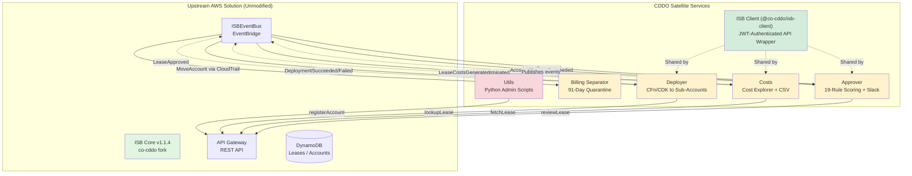
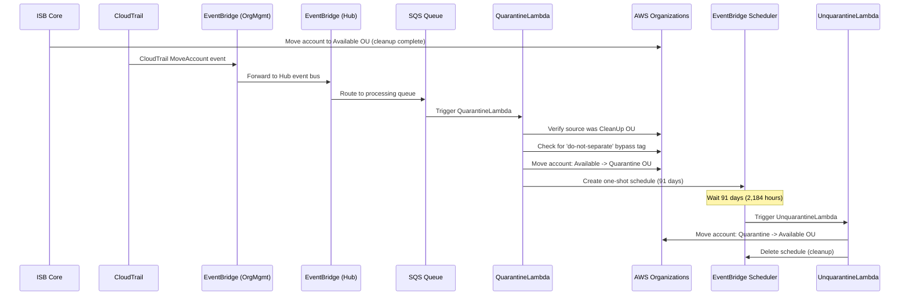
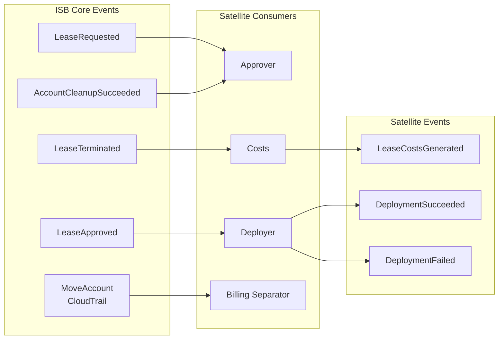

# ISB CDDO Customizations

> **Last Updated**: 2026-03-06
> **Source**: [co-cddo/innovation-sandbox-on-aws](https://github.com/co-cddo/innovation-sandbox-on-aws)
> **Captured SHA**: `cf75b87`

## Executive Summary

The UK Government's Central Digital and Data Office (CDDO) operates a fork of the AWS Innovation Sandbox on AWS solution (v1.1.4, solution ID SO0284) to support cross-government cloud experimentation and digital skills training. The fork follows a **non-invasive extension pattern**: the upstream codebase remains completely unmodified, with all CDDO-specific functionality delivered through six satellite repositories that integrate via EventBridge events and the ISB REST API. This architecture provides a clean merge path for upstream upgrades while enabling rapid iteration on government-specific features.

**Key findings:**

- **Zero core code divergence** -- the fork at SHA `cf75b87` has no changes to upstream source code
- **Seven satellite services** -- Approver, Billing Separator, Costs, Deployer, Client library, OU Metrics, and Utils scripts
- **Eight releases behind upstream** -- v1.1.4 vs v1.2.1 (12 upstream commits)
- **Event-driven integration** -- satellites subscribe to and publish on the ISB EventBridge bus
- **UK government adaptations** -- `@dsit.gov.uk` email domain, `ndx` namespace, `us-east-1`/`us-west-2` regions, Slack-based approval workflow, 91-day billing quarantine

## Customization Strategy

### Non-Invasive Extension Architecture


```mermaid
graph TB
    subgraph "Upstream AWS Solution (Unmodified)"
        CORE[ISB Core v1.1.4<br/>co-cddo fork]
        API[API Gateway<br/>REST API]
        EB[ISBEventBus<br/>EventBridge]
        DDB[(DynamoDB<br/>Leases / Accounts)]
    end

    subgraph "CDDO Satellite Services"
        APPROVER[Approver<br/>19-Rule Scoring + Slack]
        BILLING[Billing Separator<br/>91-Day Quarantine]
        COSTS[Costs<br/>Cost Explorer + CSV]
        DEPLOYER[Deployer<br/>CFn/CDK to Sub-Accounts]
        CLIENT["ISB Client (@co-cddo/isb-client)<br/>JWT-Authenticated API Wrapper"]
        UTILS[Utils<br/>Python Admin Scripts]
    end

    EB -->|LeaseRequested| APPROVER
    EB -->|AccountCleanupSucceeded| APPROVER
    EB -->|MoveAccount via CloudTrail| BILLING
    EB -->|LeaseTerminated| COSTS
    EB -->|LeaseApproved| DEPLOYER

    APPROVER -->|reviewLease| API
    COSTS -->|fetchLease| API
    DEPLOYER -->|lookupLease| API
    UTILS -->|registerAccount| API

    APPROVER -.->|Publishes events| EB
    COSTS -.->|LeaseCostsGenerated| EB
    DEPLOYER -.->|DeploymentSucceeded/Failed| EB

    CLIENT -.->|Shared by| APPROVER
    CLIENT -.->|Shared by| COSTS
    CLIENT -.->|Shared by| DEPLOYER

    style CORE fill:#e1f5e1
    style APPROVER fill:#fff3cd
    style BILLING fill:#fff3cd
    style COSTS fill:#fff3cd
    style DEPLOYER fill:#fff3cd
    style CLIENT fill:#d4edda
    style UTILS fill:#f8d7da
```

**Benefits of this approach:**

1. **Clean merge path** -- no conflicts when pulling upstream updates (zero code divergence confirmed by `git diff`)
2. **Independent lifecycles** -- each satellite deploys and scales independently via its own CDK stack
3. **Modular enablement** -- satellites can be disabled without affecting core ISB functionality
4. **Shared client library** -- `@co-cddo/isb-client` provides authenticated ISB API access to all TypeScript satellites
5. **Contribute back** -- generic improvements can be submitted upstream as pull requests

---

## Fork Status

### Version Comparison

| Aspect | Upstream (aws-solutions) | CDDO Fork (co-cddo) |
|--------|--------------------------|---------------------|
| **Current Version** | v1.2.0 | v1.1.4 |
| **Releases Behind** | -- | 6 (v1.1.5, v1.1.6, v1.1.7, v1.1.8, v1.2.0) |
| **Upstream Commits Ahead** | 10 | -- |
| **Files Changed** | 451 | 0 (clean fork) |
| **Lines Added (upstream)** | +50,515 | -- |
| **Lines Removed (upstream)** | -18,274 | -- |
| **Fork SHA** | -- | `cf75b87` |
| **License** | Apache 2.0 | Apache 2.0 (unchanged) |

### Missing Upstream Features

Since the CDDO fork was taken at v1.1.4, the following upstream releases have been made:

| Version | Key Changes |
|---------|-------------|
| **v1.1.5** | Security patch: `qs` library vulnerability fix |
| **v1.1.6** | Security patches: `@remix-run/router`, `glib2`, `libcap`, `python3` |
| **v1.1.7** | AWS Nuke upgrade to v3.63.2 (fixes SCP-protected log group deletion) |
| **v1.1.8** | Undisclosed changes (merge commit only) |
| **v1.2.0** | Major release -- likely includes blueprints feature and significant refactoring (451 files changed, 50K+ insertions) |

**Upgrade recommendation**: Upgrade to at least v1.1.7 for security patches and Nuke fixes. Evaluate v1.2.0 carefully as the large changeset (50K+ lines) may introduce breaking changes requiring satellite service updates.

---

## CDDO Satellite Services

### 1. Approver (innovation-sandbox-on-aws-approver)

**Repository**: [co-cddo/innovation-sandbox-on-aws-approver](https://github.com/co-cddo/innovation-sandbox-on-aws-approver)
**Technology**: TypeScript, CDK, Node.js 20+, esbuild, Vitest
**Purpose**: Automated lease approval with 19-rule scoring engine, AI-enhanced risk assessment, business hours enforcement, and Slack-based manual review workflow.

**Architecture**:

The approver replaces ISB's built-in manual approval flow. ISB routes all lease requests with `requiresManualApproval=true` to EventBridge; the approver listens for `LeaseRequested` events and makes autonomous approval decisions via a state machine.

**State Machine**:

```
RECEIVED -> VALIDATING -> TIMING_CHECK -> ACCOUNT_AVAILABILITY_CHECK -> SCORING -> DECIDING -> [APPROVED | DENIED | ESCALATED | DELAYED | ERROR]
```

Terminal states:
- **APPROVED** -- score below threshold (default: 20), auto-approved via ISB API
- **DENIED** -- high-risk request, auto-denied
- **ESCALATED** -- borderline score, sent to Slack for manual review
- **DELAYED** -- outside business hours or no accounts available, queued via SQS

**Scoring Engine** (19 rules):

| Rule | Weight | Type | Description |
|------|--------|------|-------------|
| `allow_list_override` | -100 | Bonus | Guarantees approval for allow-listed users |
| `verified_gov_domain` | -5 | Bonus | Domain in ukps-domains allowlist |
| `familiar_template` | -1 | Bonus | Previously used template successfully |
| `manual_early_termination` | -2 | Bonus | Responsible early termination history |
| `org_clean_record` | -2 | Bonus | Domain has 5+ leases with zero negatives in 90d |
| `expired_leases` | +2 | Penalty | Per expired lease in last 30 days |
| `budget_exceeded` | +5 | Penalty | Per budget exceeded lease in last 30 days |
| `first_time_user` | +5 | Penalty | No previous lease history |
| `first_time_user_group_mailbox_compound` | +20 | Penalty | First lease AND group mailbox detected (AI) |
| `cooldown_violation` | +10 | Penalty | Request within 1 hour of previous lease |
| `outside_target_audience` | +50 | Penalty | Domain NOT in local authority allowlist |
| `group_mailbox_detected` | +20 | Penalty | AI detected group email pattern (Bedrock) |
| `org_recent_negative` | +3 | Penalty | Same domain had negative outcomes in 30d |
| `template_hopper` | +2 | Penalty | 3+ leases never repeating a template |
| `end_of_window` | +2 | Penalty | Request in final 2 hours (5-7pm London) |
| `budget_amount` | +1/unit | Per-unit | +1 per $10 of budget requested |
| `duration_requested` | +1/unit | Per-unit | +1 per 8 hours of duration |
| `user_rate_limit` | +5/excess | Rate limit | Per request beyond 2/hour |
| `org_rate_limit` | +3 | Rate limit | Triggered if 5+ org users submit in 1 hour |

**Auto-approve threshold**: Score must be strictly less than 20 (configurable via `AUTO_APPROVE_THRESHOLD` env var).

**Infrastructure (CDK)**:
- DynamoDB: `ApproverIdempotency` table (idempotent processing), `ApproverQueuePosition` table (FIFO queue when no accounts available)
- S3: Domain allowlist bucket (populated from [ukps-domains](https://github.com/govuk-digital-backbone/ukps-domains))
- SQS: Delay queue with DLQ (out-of-hours/no-account requests)
- SNS: `isb-approval-notifications` topic for Slack integration
- Amazon Bedrock: AI-based group mailbox detection
- AWS Chatbot: Slack channel configuration with Approve/Deny custom actions
- EventBridge Scheduler: 30-minute queue check for pending requests
- CloudWatch: Error rate, latency, DLQ depth, and Slack action alarms

**Slack Integration**:
- Notifications sent via SNS to Amazon Q Developer (Chatbot) Slack channel
- Custom actions: `isb-approve` and `isb-deny` buttons invoke separate Lambda functions
- `SlackApproveLambda` and `SlackDenyLambda` call the ISB API `/leases/{id}/review` endpoint
- CloudWatch dashboard: `ISB-Approver-Slack-Actions`

**Source**: `/Users/CNesbittSmith/httpdocs/ndx-try-arch/repos/innovation-sandbox-on-aws-approver/`

---

### 2. Billing Separator (innovation-sandbox-on-aws-billing-seperator)

**Repository**: [co-cddo/innovation-sandbox-on-aws-billing-seperator](https://github.com/co-cddo/innovation-sandbox-on-aws-billing-seperator)
**Technology**: TypeScript, CDK, Node.js 22, Jest
**Purpose**: 91-day quarantine of sandbox accounts after cleanup to prevent billing data attribution leakage between successive leaseholders.

**Problem**: When a sandbox account is recycled, AWS Cost and Usage Report (CUR) data for the previous leaseholder may still be accumulating. If the account is immediately reassigned, the new leaseholder's billing view would include residual charges from the previous tenant.

**Architecture**:

The billing separator deploys across two stacks:

- **OrgMgmtStack** (Org Management account): EventBridge rule forwarding CloudTrail `MoveAccount` events to the Hub account's custom event bus
- **HubStack** (Hub account): Event bus, SQS queue, two Lambda functions, EventBridge Scheduler group

**Flow**:


```mermaid
sequenceDiagram
    participant ISB as ISB Core
    participant CT as CloudTrail
    participant EB1 as EventBridge (OrgMgmt)
    participant EB2 as EventBridge (Hub)
    participant SQS as SQS Queue
    participant QL as QuarantineLambda
    participant ORG as AWS Organizations
    participant SCHED as EventBridge Scheduler
    participant UQL as UnquarantineLambda

    ISB->>ORG: Move account to Available OU (cleanup complete)
    CT->>EB1: CloudTrail MoveAccount event
    EB1->>EB2: Forward to Hub event bus
    EB2->>SQS: Route to processing queue
    SQS->>QL: Trigger QuarantineLambda

    QL->>ORG: Verify source was CleanUp OU
    QL->>ORG: Check for 'do-not-separate' bypass tag
    QL->>ORG: Move account: Available -> Quarantine OU
    QL->>SCHED: Create one-shot schedule (91 days)

    Note over SCHED: Wait 91 days (2,184 hours)

    SCHED->>UQL: Trigger UnquarantineLambda
    UQL->>ORG: Move account: Quarantine -> Available OU
    UQL->>SCHED: Delete schedule (cleanup)
```

**Key Constants** (from `source/lambdas/shared/constants.ts`):
- `QUARANTINE_DURATION_HOURS`: 2,184 (91 days)
- `SCHEDULER_GROUP`: `isb-billing-separator`
- `BYPASS_QUARANTINE_TAG_KEY`: `do-not-separate` (AWS Organizations tag to skip quarantine)
- `MAX_SQS_RECORDS_PER_BATCH`: 10

**Features**:
- Idempotent processing (skips accounts already in Quarantine status)
- Bypass tag (`do-not-separate`) for emergency account recycling
- Cross-account role chain using ISB's own `fromTemporaryIsbOrgManagementCredentials` utility
- SQS partial batch response pattern for reliable event processing
- CloudWatch alarms for DLQ depth, Lambda errors, and EventBridge rule delivery failures
- ISB Commons dependency via git submodule (`deps/isb/source/common`)

**Source**: `/Users/CNesbittSmith/httpdocs/ndx-try-arch/repos/innovation-sandbox-on-aws-billing-seperator/`

---

### 3. Costs (innovation-sandbox-on-aws-costs)

**Repository**: [co-cddo/innovation-sandbox-on-aws-costs](https://github.com/co-cddo/innovation-sandbox-on-aws-costs)
**Technology**: TypeScript, CDK, Node.js, Vitest, Zod (v4), X-Ray tracing
**Purpose**: Automated cost collection for terminated leases with delayed execution, CSV reporting, and EventBridge event emission.

**Architecture**:

Two Lambda functions orchestrated by EventBridge Scheduler:

1. **Scheduler Handler** -- triggered by `LeaseTerminated` events, creates a one-shot EventBridge Schedule that fires after a configurable delay (default 8 hours via `BILLING_PADDING_HOURS`) to allow billing data to settle
2. **Cost Collector Handler** -- triggered by the scheduled event, performs the full cost collection pipeline:
   - Fetches lease details from ISB API (via `@co-cddo/isb-client`)
   - Assumes role in orgManagement account for Cost Explorer access
   - Calculates billing window with configurable padding
   - Queries Cost Explorer with pagination
   - Generates CSV report
   - Uploads to S3 with SHA-256 checksum integrity verification
   - Generates presigned URL (7-day expiry, configurable via `PRESIGNED_URL_EXPIRY_DAYS`)
   - Emits `LeaseCostsGenerated` event to EventBridge
   - Publishes CloudWatch business metrics (TotalCost, ResourceCount, ProcessingDuration)
   - Deletes the scheduler schedule (best-effort, auto-delete also configured)

3. **Cleanup Handler** -- handles orphaned schedule cleanup

**CDK Infrastructure**:
- `CostCollectionStack` (Hub account): S3 bucket, Lambda functions, EventBridge rules, Scheduler group
- `CostExplorerRoleStack` (OrgMgmt account): IAM role for cross-account Cost Explorer access

**Source**: `/Users/CNesbittSmith/httpdocs/ndx-try-arch/repos/innovation-sandbox-on-aws-costs/`

---

### 4. Deployer (innovation-sandbox-on-aws-deployer)

**Repository**: [co-cddo/innovation-sandbox-on-aws-deployer](https://github.com/co-cddo/innovation-sandbox-on-aws-deployer)
**Technology**: TypeScript, CDK, Node.js 22, esbuild, Vitest
**Purpose**: Automatically deploy CloudFormation templates and CDK applications to sandbox sub-accounts when leases are approved.

**Deployment Flow**:

1. **Event parsing** -- validates incoming `LeaseApproved` EventBridge event
2. **Lease lookup** -- fetches lease details from DynamoDB to get `accountId` and `templateName`
3. **Template handling** -- detects scenario type (CDK vs CloudFormation), fetches from GitHub
4. **Template validation** -- validates CloudFormation template structure
5. **Role assumption** -- assumes role in target sub-account via STS
6. **CDK bootstrap** -- ensures target account has CDKToolkit stack (CDK scenarios only)
7. **Stack deployment** -- creates/updates CloudFormation stack with parameters mapped from lease data
8. **Event emission** -- publishes `DeploymentSucceeded` or `DeploymentFailed` to EventBridge

**CDK Scenario Support**:
- Auto-detects CDK projects via `cdk.json` presence
- Sparse clones scenario from GitHub (only needed files)
- Installs dependencies securely (`npm ci --ignore-scripts`)
- Synthesizes CDK to CloudFormation (`cdk synth`)

**CDK Infrastructure**:
- `DeployerStack` (Hub account): Lambda function, EventBridge rules, Secrets Manager integration
- `GithubOidcStack`: OIDC provider for GitHub Actions CI/CD

**Environment Variables**:

| Variable | Purpose |
|----------|---------|
| `GITHUB_REPO` | Scenario repository (e.g., `co-cddo/ndx_try_aws_scenarios`) |
| `GITHUB_BRANCH` | Branch to fetch from (e.g., `main`) |
| `TARGET_ROLE_NAME` | Assumable role in sub-accounts (e.g., `ndx_IsbUsersPS`) |
| `DEPLOY_REGION` | Target deployment region |

**Source**: `/Users/CNesbittSmith/httpdocs/ndx-try-arch/repos/innovation-sandbox-on-aws-deployer/`

---

### 5. ISB Client (@co-cddo/isb-client)

**Repository**: [co-cddo/innovation-sandbox-on-aws-client](https://github.com/co-cddo/innovation-sandbox-on-aws-client)
**Technology**: TypeScript, Node.js 20+, Jest, Yarn 4
**Version**: 2.0.1 (distributed as tarball via GitHub Releases)
**Purpose**: Shared authenticated API client for satellite services to interact with the ISB REST API.

**Features**:
- JWT token signing using HS256 with secret from Secrets Manager
- Automatic token caching with 60-second pre-expiry refresh
- Secret cache invalidation on 401/403 responses (handles secret rotation)
- JSend response format parsing
- Paginated list endpoint support
- Read operations (`fetchLease`, `fetchLeaseByKey`, `fetchAccount`, `fetchTemplate`, `fetchAllAccounts`)
- Write operations (`reviewLease`, `registerAccount`)
- Graceful degradation -- returns `null` on 404, 5xx, or network errors for read operations
- Configurable timeout (default 5 seconds)
- Correlation ID propagation via `X-Correlation-Id` header

**Usage by satellites**:

| Satellite | ISB Client Version | Operations Used |
|-----------|-------------------|-----------------|
| Approver | v2.0.1 | `fetchLease`, `fetchAccount`, `fetchAllAccounts`, `reviewLease` |
| Costs | v2.0.0 | `fetchLease` (via `getLeaseDetails`) |
| Deployer | v2.0.0 | `fetchLease` (via `lookupLease`) |

**Source**: `/Users/CNesbittSmith/httpdocs/ndx-try-arch/repos/innovation-sandbox-on-aws-client/`

---

### 6. Utils (innovation-sandbox-on-aws-utils)

**Repository**: [co-cddo/innovation-sandbox-on-aws-utils](https://github.com/co-cddo/innovation-sandbox-on-aws-utils)
**Technology**: Python 3, boto3
**Purpose**: CLI scripts for manual operational tasks that complement the ISB web interface.

**Scripts**:

| Script | Purpose |
|--------|---------|
| `create_sandbox_pool_account.py` | Create and register new pool accounts (Organizations + ISB API) |
| `create_user.py` | Create Identity Center users and add to `ndx_IsbUsersGroup` |
| `assign_lease.py` | Assign leases via API, optionally configure local SSO profiles |
| `terminate_lease.py` | Terminate all active leases for a user |
| `force_release_account.py` | Force-release stuck accounts |
| `clean_console_state.py` | Clean AWS Console state (recently visited services, favorites, theme) from recycled accounts via undocumented CCS API |

**Key Constants** (from `create_sandbox_pool_account.py`):

| Constant | Value |
|----------|-------|
| `ENTRY_OU` | `ou-2laj-2by9v0sr` |
| `SANDBOX_READY_OU` | `ou-2laj-oihxgbtr` |
| `BILLING_VIEW_ARN` | `arn:aws:billing::955063685555:billingview/custom-466e2613-e09b-4787-a93a-736f0fb1564b` |
| Account email pattern | `ndx-try-provider+gds-ndx-try-aws-pool-NNN@dsit.gov.uk` |
| Account name pattern | `pool-NNN` |

**Authentication**: All scripts use AWS SSO profiles (`NDX/orgManagement`, `NDX/InnovationSandboxHub`) and generate HS256 JWT tokens using the ISB signing secret from Secrets Manager.

**Source**: `/Users/CNesbittSmith/httpdocs/ndx-try-arch/repos/innovation-sandbox-on-aws-utils/`

---

## Configuration Customizations

### Global Configuration (global-config.yaml)

The ISB core is configured via AWS AppConfig profiles. Key CDDO-specific settings:

```yaml
maintenanceMode: true               # Controlled rollout
leases:
  requireMaxBudget: true
  maxBudget: 50                     # USD (upstream default: 5000)
  requireMaxDuration: true
  maxDurationHours: 168             # 7 days
  maxLeasesPerUser: 3
  ttl: 30                           # Days
cleanup:
  numberOfFailedAttemptsToCancelCleanup: 3
  waitBeforeRetryFailedAttemptSeconds: 5
  numberOfSuccessfulAttemptsToFinishCleanup: 2
  waitBeforeRerunSuccessfulAttemptSeconds: 30
```

| Setting | CDDO | Upstream Default | Rationale |
|---------|------|------------------|-----------|
| `maintenanceMode` | `true` | `false` | Controlled rollout for government users |
| `maxBudget` | $50 | $5,000 | Cost control for training/experimentation |
| `maxDurationHours` | 168 | 168 | Same (7 days) |
| `maxLeasesPerUser` | 3 | 3 | Same |

### Nuke Configuration (nuke-config.yaml)

Protected resources for AWS Nuke account cleanup:

```yaml
# Protected from deletion
CloudFormationStack:
  - type: glob
    value: StackSet-Isb-*          # ISB-managed StackSet stacks

IAMRole:
  - type: exact
    value: OrganizationAccountAccessRole
  - type: glob
    value: AWSReservedSSO_*        # SSO-provisioned roles
  - type: contains
    value: AWSControlTower         # Control Tower roles

# Excluded resource types
S3Object                           # Bucket deletion handles objects
ConfigServiceConfigurationRecorder # Preserved for audit
ConfigServiceDeliveryChannel       # Preserved for audit
```

These protections are consistent with the upstream defaults and ensure that ISB infrastructure, SSO roles, and Control Tower configurations survive account recycling.

### Deployment Configuration

| Parameter | CDDO Value | Upstream Default |
|-----------|-----------|------------------|
| `NAMESPACE` | `ndx` | `myisb` |
| `HUB_ACCOUNT_ID` | `955063685555` | Configurable |
| `AWS_REGIONS` | `us-east-1`, `us-west-2` | Configurable |
| `ADMIN_GROUP_NAME` | `ndx_IsbAdmins` | Configurable |
| `MANAGER_GROUP_NAME` | `ndx_IsbManagers` | Configurable |
| `USER_GROUP_NAME` | `ndx_IsbUsers` | Configurable |

The `ndx` namespace prefixes all CloudFormation stack names, IAM roles, and resource identifiers, ensuring isolation from any other ISB deployments in the same AWS Organization.

---

## UK Government Adaptations

### Email Domain

All account and user emails use the `@dsit.gov.uk` domain (Department for Science, Innovation and Technology):
- Pool account emails: `ndx-try-provider+gds-ndx-try-aws-pool-NNN@dsit.gov.uk`
- User emails: `{name}@dsit.gov.uk`

### Region Strategy

ISB is deployed exclusively in `us-east-1` and `us-west-2`:
- **us-east-1**: Required for AWS Organizations API, IAM Identity Center
- **us-west-2**: Primary compute region for Lambda, DynamoDB, API Gateway, CloudFront
- Production UK government workloads would typically use `eu-west-2` (London); sandbox accounts use US regions for cost optimization and broader service availability

### Domain-Based Access Control

The approver service integrates with the [ukps-domains](https://github.com/govuk-digital-backbone/ukps-domains) dataset -- a curated list of UK public sector email domains. This enables:
- Automatic `-5` scoring bonus for verified government domains
- Automatic `+50` scoring penalty for non-local-authority domains
- AI-enhanced group mailbox detection via Amazon Bedrock

### Business Hours Enforcement

The approver enforces UK business hours (London timezone):
- Requests outside business hours are delayed to the next processing window via SQS
- Requests in the final 2 hours (5-7pm London) receive a `+2` scoring penalty
- A 30-minute EventBridge Scheduler polls the queue for delayed requests

### Slack-Based Operations

Manual lease approval/denial is handled via Slack rather than the ISB web console:
- Amazon Q Developer (Chatbot) integration with configurable Slack workspace and channel
- Custom actions with "Approve" and "Deny" buttons on notification messages
- Dedicated Lambda functions for each action (`ApproverSlackApprove`, `ApproverSlackDeny`)
- CloudWatch dashboard for Slack action monitoring

### Billing Data Isolation

The billing separator addresses a UK government requirement for clean billing attribution between successive sandbox leaseholders:
- 91-day quarantine period ensures all residual CUR data has been finalized
- Bypass mechanism via `do-not-separate` AWS Organizations tag for emergency recycling
- Custom billing view (ARN: `arn:aws:billing::955063685555:billingview/custom-...`) aggregates costs across all pool accounts

### Console State Cleanup

The `clean_console_state.py` utility addresses an upstream limitation: AWS Nuke cannot clean AWS Management Console preferences (recently visited services, favorites, theme) because they are stored in the Console Control Service (CCS) -- an undocumented internal AWS service outside the account resource plane. The script calls the CCS `UpdateCallerSettings` and `DeleteCallerDashboard` APIs directly.

---

## Integration Architecture

### Event Flow Summary


```mermaid
graph LR
    subgraph "ISB Core Events"
        E1[LeaseRequested]
        E2[LeaseApproved]
        E3[LeaseTerminated]
        E4[AccountCleanupSucceeded]
        E5[MoveAccount<br/>CloudTrail]
    end

    subgraph "Satellite Consumers"
        A[Approver]
        D[Deployer]
        C[Costs]
        B[Billing Separator]
    end

    subgraph "Satellite Events"
        SE1[LeaseCostsGenerated]
        SE2[DeploymentSucceeded]
        SE3[DeploymentFailed]
    end

    E1 --> A
    E4 --> A
    E2 --> D
    E3 --> C
    E5 --> B

    C --> SE1
    D --> SE2
    D --> SE3
```

### Cross-Service Dependencies

| Satellite | Depends On | ISB API Endpoints Used | EventBridge Events Consumed | EventBridge Events Produced |
|-----------|-----------|------------------------|---------------------------|---------------------------|
| Approver | ISB Client v2.0.1, Bedrock, ukps-domains S3 | `GET /leases/{id}`, `GET /accounts`, `POST /leases/{id}/review` | `LeaseRequested`, `AccountCleanupSucceeded` | -- |
| Billing Separator | ISB Commons (git submodule) | -- (uses DynamoDB directly) | CloudTrail `MoveAccount` | -- |
| Costs | ISB Client v2.0.0 | `GET /leases/{id}` | `LeaseTerminated` (via Scheduler) | `LeaseCostsGenerated` |
| Deployer | ISB Client v2.0.0, GitHub API | `GET /leases/{id}` (via DynamoDB direct) | `LeaseApproved` | `DeploymentSucceeded`, `DeploymentFailed` |
| Utils | ISB API (direct HTTP) | `POST /accounts`, `GET /leaseTemplates`, `POST /leases`, `POST /leases/{id}/terminate` | -- | -- |

---

## Comparison Summary

| Aspect | Upstream AWS Solution | CDDO Fork + Satellites |
|--------|----------------------|------------------------|
| **Version** | v1.2.0 | v1.1.4 (core) |
| **Core Code Changes** | N/A | None (clean fork) |
| **Extension Services** | None | 6 satellites |
| **Lease Approval** | Manual (web UI) | Automated (19-rule scoring + Slack escalation) |
| **Cost Tracking** | None | Automated CSV reports with presigned URLs |
| **Scenario Deployment** | Manual | Automated (CFn + CDK from GitHub) |
| **Billing Isolation** | None | 91-day quarantine |
| **API Client** | None | Shared `@co-cddo/isb-client` library |
| **Admin Tooling** | Web UI only | Web UI + 6 Python CLI scripts |
| **Console Cleanup** | aws-nuke only | aws-nuke + CCS API cleanup |
| **Max Budget** | $5,000 | $50 |
| **Namespace** | `myisb` | `ndx` |
| **Email Domain** | Configurable | `@dsit.gov.uk` |
| **Regions** | Configurable | `us-east-1`, `us-west-2` only |
| **AI Integration** | None | Amazon Bedrock (email pattern analysis) |
| **Chat Integration** | None | Slack via Amazon Q Developer |

---

## Upgrade Path

### Recommended Strategy

The clean fork pattern means upgrading is straightforward:

1. **Fetch upstream changes**: `git fetch upstream && git merge upstream/main`
2. **Resolve conflicts**: Expect conflicts only in configuration files (`.env`, `global-config.yaml`) -- use CDDO values
3. **Test**: `npm ci && npm run build && npm test`
4. **Validate satellite compatibility**: Verify ISB API response schemas and EventBridge event schemas have not changed
5. **Deploy**: Enable maintenance mode, deploy upgraded stacks, smoke test, disable maintenance mode

**Risk assessment**: Low for v1.1.5-v1.1.8 (security patches). Medium for v1.2.0 (major release with 50K+ line changes that may alter event schemas or API contracts used by satellites).

**Estimated effort**: 2-4 hours for v1.1.7, 1-2 days for v1.2.0 (including satellite service validation).

---

## References

- [ISB Core Architecture](./10-isb-core-architecture.md) -- CDK stacks, Lambda catalog, API endpoints, EventBridge events
- [Lease Lifecycle](./11-lease-lifecycle.md) -- State machine, account OU transitions, cleanup workflow
- [ISB Frontend](./12-isb-frontend.md) -- React UI, authentication flow, CloudFront hosting
- [Upstream Repository](https://github.com/aws-solutions/innovation-sandbox-on-aws)
- [CDDO Fork](https://github.com/co-cddo/innovation-sandbox-on-aws)
- [ISB Client](https://github.com/co-cddo/innovation-sandbox-on-aws-client)
- [Approver](https://github.com/co-cddo/innovation-sandbox-on-aws-approver)
- [Billing Separator](https://github.com/co-cddo/innovation-sandbox-on-aws-billing-seperator)
- [Costs](https://github.com/co-cddo/innovation-sandbox-on-aws-costs)
- [Deployer](https://github.com/co-cddo/innovation-sandbox-on-aws-deployer)
- [Utils](https://github.com/co-cddo/innovation-sandbox-on-aws-utils)
