# ISB CDDO Customizations

## Executive Summary

The UK government's Central Digital & Data Office (CDDO) has forked the AWS Innovation Sandbox on AWS solution to support cross-government cloud experimentation and training initiatives. This document analyzes the co-cddo fork's customizations, divergence from upstream, and UK-specific adaptations.

**Key Findings:**
- **Minimal Code Divergence:** Fork maintains upstream code compatibility
- **Extension Architecture:** Custom functionality via external satellites
- **Version Status:** v1.1.4 (3 releases behind upstream v1.1.7)
- **Customization Strategy:** Non-invasive extensions for easy upgrade path

**Custom Components:**
1. innovation-sandbox-on-aws-costs (Lease cost collection)
2. innovation-sandbox-on-aws-deployer (CloudFormation/CDK deployment)
3. innovation-sandbox-on-aws-approver (Enhanced approval workflow)
4. innovation-sandbox-on-aws-utils (Account provisioning scripts)

---

## Fork Status Analysis

### Version Comparison

| Aspect | Upstream (aws-solutions) | CDDO Fork (co-cddo) |
|--------|--------------------------|---------------------|
| **Current Version** | v1.1.7 (2026-01-20) | v1.1.4 (2025-12-16) |
| **Version Lag** | - | 3 releases behind (1 month) |
| **Primary Language** | TypeScript (98.6%) | TypeScript (98.6%) |
| **License** | Apache 2.0 | Apache 2.0 (unchanged) |
| **Stars** | 47 | 2 |
| **Forks** | 15 | 0 (no further forks) |

### Missing Upstream Features

**Not yet in CDDO fork (as of v1.1.4):**

**From v1.1.7 (2026-01-20):**
- AWS Nuke upgrade to v3.63.2 (fixes SCP-protected log group deletion issues)

**From v1.1.6 (2026-01-12):**
- Security patches: @remix-run/router, glib2, libcap, python3

**From v1.1.5 (2026-01-05):**
- Critical: `qs` library vulnerability fix (CVE-2022-24999)

**Recommendation:** Upgrade to v1.1.7 to receive security patches and AWS Nuke fixes.

---

## Customization Strategy Overview

### Non-Invasive Extension Pattern


**Benefits of this approach:**
1. **Clean merge path:** No conflicts when pulling upstream updates
2. **Modular architecture:** Extensions can be enabled/disabled independently
3. **Separate lifecycles:** CDDO components can evolve without blocking upstream upgrades
4. **Contribute back:** Generic improvements can be submitted to AWS as PRs

---

## CDDO Custom Components

### 1. Innovation Sandbox Costs (innovation-sandbox-on-aws-costs)

**Repository:** https://github.com/co-cddo/innovation-sandbox-on-aws-costs

**Purpose:** Automated cost collection for terminated leases with 24-hour delay

**Architecture:**


**Key Features:**
- **24-hour delay:** Waits for AWS billing data to settle
- **Cross-account:** Assumes role in orgManagement for Cost Explorer access
- **ISB API integration:** Fetches lease details via JWT-authenticated Lambda-to-Lambda calls
- **CSV reports:** Service-level cost breakdown
- **Presigned URLs:** Secure 7-day download links
- **3-year retention:** S3 lifecycle policy for compliance

**Event Schema:**

**Input:** `LeaseTerminated`
```json
{
  "detail-type": "LeaseTerminated",
  "source": "isb",
  "detail": {
    "leaseId": {
      "userEmail": "user@example.com",
      "uuid": "550e8400-e29b-41d4-a716-446655440000"
    },
    "accountId": "123456789012",
    "reason": { "type": "Expired" }
  }
}
```

**Output:** `LeaseCostsGenerated`
```json
{
  "detail-type": "LeaseCostsGenerated",
  "source": "isb-costs",
  "detail": {
    "leaseId": "550e8400-e29b-41d4-a716-446655440000",
    "accountId": "123456789012",
    "totalCost": 150.50,
    "currency": "USD",
    "startDate": "2026-01-15",
    "endDate": "2026-02-03",
    "csvUrl": "https://bucket.s3.amazonaws.com/lease.csv?signature=...",
    "urlExpiresAt": "2026-02-10T12:00:00.000Z",
    "userEmail": "user@example.gov.uk"
  }
}
```

**Deployment:**
- **Technology:** TypeScript Lambda (Node.js 22)
- **IAM:** Assume role in orgManagement account for Cost Explorer
- **S3 Bucket:** `isb-lease-costs-{account-id}` (us-west-2)
- **Scheduler:** EventBridge Scheduler (one-shot schedules)

**Source Code Location:** `/Users/cns/httpdocs/cddo/ndx-try-arch/repos/innovation-sandbox-on-aws-costs/`

---

### 2. Innovation Sandbox Deployer (innovation-sandbox-on-aws-deployer)

**Repository:** https://github.com/co-cddo/innovation-sandbox-on-aws-deployer

**Purpose:** Automatically deploy CloudFormation templates and CDK apps to approved sandbox accounts

**Architecture:**


**Key Features:**

**CDK Support:**
- Auto-detects CDK projects via `cdk.json` presence
- Supports CDK in root folder or `/cdk` subfolder
- Sparse clones scenario from GitHub (efficient, only needed files)
- Installs dependencies securely (`npm ci --ignore-scripts`)
- Synthesizes CDK to CloudFormation (`cdk synth`)
- Supports TypeScript and JavaScript CDK apps

**CloudFormation Support:**
- Fetches templates from GitHub raw URLs
- Parameter enrichment from lease data
- Stack naming: `isb-{leaseId}-{templateName}`

**Security:**
- Cross-account deployment via assumable IAM role (`ndx_IsbUsersPS`)
- GitHub token from Secrets Manager (private repos)
- No postinstall scripts executed (supply chain attack protection)

**Deployment Events:**

**Input:** `LeaseApproved`
```json
{
  "detail-type": "LeaseApproved",
  "source": "isb",
  "detail": {
    "leaseId": {
      "userEmail": "user@example.com",
      "uuid": "550e8400-e29b-41d4-a716-446655440000"
    },
    "accountId": "123456789012",
    "approvedBy": "manager@example.com"
  }
}
```

**Output:** `DeploymentSucceeded` / `DeploymentFailed`
```json
{
  "detail-type": "DeploymentSucceeded",
  "source": "isb-deployer",
  "detail": {
    "leaseId": "550e8400-e29b-41d4-a716-446655440000",
    "accountId": "123456789012",
    "stackName": "isb-lease-550e8400-my-scenario",
    "stackId": "arn:aws:cloudformation:...",
    "templateName": "my-scenario",
    "scenarioType": "cdk" | "cloudformation"
  }
}
```

**Deployment:**
- **Technology:** TypeScript Lambda (Node.js 22)
- **Timeout:** 15 minutes (CDK synthesis can be slow)
- **Memory:** 3008 MB (for npm install + cdk synth)
- **GitHub Integration:** Fetches from `co-cddo/ndx_try_aws_scenarios`
- **IAM:** AssumeRole permissions for target accounts

**Environment Variables:**
| Variable | Value | Purpose |
|----------|-------|---------|
| `LEASE_TABLE_NAME` | `isb-leases` | DynamoDB table |
| `GITHUB_REPO` | `co-cddo/ndx_try_aws_scenarios` | Scenario repository |
| `GITHUB_BRANCH` | `main` | Branch to fetch from |
| `GITHUB_PATH` | `cloudformation/scenarios` | Scenario directory |
| `TARGET_ROLE_NAME` | `ndx_IsbUsersPS` | Assumable role in sub-accounts |

**Source Code Location:** `/Users/cns/httpdocs/cddo/ndx-try-arch/repos/innovation-sandbox-on-aws-deployer/`

---

### 3. Innovation Sandbox Approver (innovation-sandbox-on-aws-approver)

**Repository:** https://github.com/co-cddo/innovation-sandbox-on-aws-approver

**Purpose:** Enhanced approval workflow with risk scoring (assumed, not in local repos)

**Expected Architecture (based on upstream pattern):**


**Expected Features:**
- Multi-rule scoring engine (user history, org policy, budget)
- AI-enhanced risk assessment (Amazon Bedrock)
- Automated approval/rejection thresholds
- Manual review queue for borderline cases
- Audit trail in DynamoDB

**Status:** Not present in local repos, assumed to be deployed separately

---

### 4. Innovation Sandbox Utils (innovation-sandbox-on-aws-utils)

**Repository:** https://github.com/co-cddo/innovation-sandbox-on-aws-utils

**Purpose:** Python script for manual account pool provisioning

**Tool:** `create_sandbox_pool_account.py`

**Workflow:**

```mermaid
sequenceDiagram
    participant SCRIPT as Python Script
    participant ORG as AWS Organizations
    participant ENTRY as Entry OU
    participant LAMBDA as ISB Lambda
    participant READY as Ready OU

    SCRIPT->>ORG: List existing pool-NNN accounts
    SCRIPT->>SCRIPT: Determine next number (e.g., pool-009)
    SCRIPT->>ORG: CreateAccount (pool-009)
    ORG-->>SCRIPT: Account ID: 123456789012

    SCRIPT->>ORG: MoveAccount (root → Entry OU)
    SCRIPT->>ORG: Add to billing view
    SCRIPT->>LAMBDA: Invoke ISB Lambda (register account)
    LAMBDA->>LAMBDA: Trigger cleanup workflow

    Note over LAMBDA: Innovation Sandbox cleanup (8-12 minutes)

    LAMBDA->>ORG: MoveAccount (Entry OU → Ready OU)
    SCRIPT->>SCRIPT: Poll for OU move
    SCRIPT->>SCRIPT: Report completion
```



**Key Steps:**

1. **SSO Authentication:** Validates AWS SSO sessions (`NDX/orgManagement`, `NDX/InnovationSandboxHub`)
2. **List Accounts:** Finds all `pool-NNN` accounts
3. **Create Account:** Creates next sequential account (e.g., `pool-009`)
4. **Move to Entry OU:** Moves to `ou-2laj-2by9v0sr`
5. **Add to Billing View:** Adds to custom billing view for cost tracking
6. **Register with ISB:** Invokes ISB Lambda directly with mock JWT
7. **Wait for Cleanup:** Polls until account moved to Ready OU (`ou-2laj-oihxgbtr`)
8. **Report:** Total time (typically 12-15 minutes)

**Account Naming:**
- Pattern: `pool-NNN` (e.g., `pool-001`, `pool-002`)
- Email: `ndx-try-provider+gds-ndx-try-aws-pool-NNN@dsit.gov.uk`

**Configuration:**
| Constant | Value | Description |
|----------|-------|-------------|
| `ENTRY_OU` | `ou-2laj-2by9v0sr` | OU for registration |
| `SANDBOX_READY_OU` | `ou-2laj-oihxgbtr` | OU after cleanup |
| `BILLING_VIEW_ARN` | `arn:aws:billing::955063685555:billingview/...` | Cost tracking |

**Usage:**

**Create new account:**
```bash
source venv/bin/activate
python create_sandbox_pool_account.py
```

**Recover partially provisioned account:**
```bash
python create_sandbox_pool_account.py 123456789012
```

**Output:**
```
============================================================
🆕 STEP 3: Create new account
============================================================
   Account name: pool-009
   Email: ndx-try-provider+gds-ndx-try-aws-pool-009@dsit.gov.uk
   ✅ Account created: 123456789012

============================================================
📝 STEP 5: Register with Innovation Sandbox
============================================================
   ✅ Registered successfully!
   📄 Status: CleanUp

============================================================
🎉 COMPLETE
============================================================
   Account: pool-009 (123456789012)
   ⏱️  Total time: 12m 34s
```

**Source Code Location:** `/Users/cns/httpdocs/cddo/ndx-try-arch/repos/innovation-sandbox-on-aws-utils/create_sandbox_pool_account.py`

---

## Configuration Customizations

### Global Configuration (global-config.yaml)

**CDDO Customizations:**

```yaml
# Maintenance mode (disable new lease requests)
maintenanceMode: true

# Budget constraints
leases:
  requireMaxBudget: true
  maxBudget: 50              # USD (upstream default: 5000)
  requireMaxDuration: true
  maxDurationHours: 168       # 7 days (upstream default: 168)
  maxLeasesPerUser: 3        # Concurrent leases (upstream default: 3)
  ttl: 30                     # Days (upstream default: 30)

# Cleanup configuration
cleanup:
  numberOfFailedAttemptsToCancelCleanup: 3
  waitBeforeRetryFailedAttemptSeconds: 5
  numberOfSuccessfulAttemptsToFinishCleanup: 2
  waitBeforeRerunSuccessfulAttemptSeconds: 30
```

**Comparison with Upstream Defaults:**

| Setting | CDDO | Upstream | Rationale |
|---------|------|----------|-----------|
| `maintenanceMode` | `true` | `false` | Controlled rollout |
| `maxBudget` | `$50` | `$5000` | Cost control for training |
| `maxDurationHours` | `168` (7 days) | `168` | Same |
| `maxLeasesPerUser` | `3` | `3` | Same |

---

### AWS Nuke Configuration (nuke-config.yaml)

**CDDO Customizations:**

**Protected Resources:**
```yaml
CloudFormationStack:
  - type: glob
    value: StackSet-Isb-*          # Protect ISB-managed stacks

IAMRole:
  - type: exact
    value: OrganizationAccountAccessRole
  - type: glob
    value: AWSReservedSSO_*        # Protect SSO roles
  - type: contains
    value: AWSControlTower         # Protect Control Tower roles
```

**Settings:**
```yaml
NoDryRun: true                     # Execute deletions (not simulation)
Force:
  DeleteProtection: true           # Ignore deletion protection
  GovernanceRetention: true        # Bypass governance retention
  LegalHold: true                  # Remove legal holds
```

**Excluded Resource Types:**
```yaml
S3Object                           # Optimized: bucket deletion handles objects
ConfigServiceConfigurationRecorder # Preserved for audit
ConfigServiceDeliveryChannel       # Preserved for audit
```

**Comparison with Upstream:**
- **Same protection patterns** for Control Tower, SSO, OrganizationAccountAccessRole
- **Same exclusions** for Config Service (audit requirements)
- **No CDDO-specific exclusions** detected

---

## UK Government Specific Adaptations

### 1. Email Domain

**CDDO:** `@dsit.gov.uk` (Department for Science, Innovation & Technology)

**Example:**
- Account email: `ndx-try-provider+gds-ndx-try-aws-pool-001@dsit.gov.uk`
- User email: `user.name@dsit.gov.uk`

### 2. AWS Region Preference

**Primary Region:** `us-west-2` (Oregon)

**Rationale:**
- Not UK region due to data sovereignty flexibility for sandbox environments
- Cost optimization (US regions cheaper than EU)
- Service availability (newer services launch in US first)

**Note:** Production workloads would use `eu-west-2` (London) for data sovereignty.

### 3. Organizational Units

**CDDO-Specific OUs:**
- **Entry OU:** `ou-2laj-2by9v0sr` (new accounts land here)
- **Ready OU:** `ou-2laj-oihxgbtr` (post-cleanup, available for leases)

### 4. Billing View

**Custom Billing View ARN:** `arn:aws:billing::955063685555:billingview/custom-466e2613-e09b-4787-a93a-736f0fb1564b`

**Purpose:** Aggregate costs for all pool accounts for cross-government chargeback

### 5. Training Integration

**Use Case:** Support for October-December 2025 tech certification program

**Features:**
- 200+ free learning pathways for civil/public servants
- AWS exam vouchers with 4-month validity
- Sandbox accounts for hands-on training

**Reference:** https://cddo.blog.gov.uk/2025/10/01/ready-to-grow-your-digital-skills-get-tech-certified-this-autumn/

---

## Deployment Configuration

### Environment Setup

**CDDO .env File:**

```bash
# Common
HUB_ACCOUNT_ID=955063685555        # InnovationSandboxHub account
NAMESPACE="ndx"                     # Stack namespace

# Account Pool Stack
PARENT_OU_ID="ou-2laj-abcdef1234"  # Organization root OU
AWS_REGIONS="us-west-2"             # Primary region only

# IDC Stack
IDENTITY_STORE_ID="d-0000000000"
SSO_INSTANCE_ARN="arn:aws:sso:::instance/ssoins-xxxxx"
ADMIN_GROUP_NAME="ndx_IsbAdmins"
MANAGER_GROUP_NAME="ndx_IsbManagers"
USER_GROUP_NAME="ndx_IsbUsers"

# Compute Stack
ORG_MGT_ACCOUNT_ID=123456789012     # orgManagement account
IDC_ACCOUNT_ID=955063685555         # Same as hub
ACCEPT_SOLUTION_TERMS_OF_USE="Accept"
```

**Key Differences from Upstream:**
- **Namespace:** `ndx` instead of default `myisb`
- **Single region:** `us-west-2` only (upstream supports multi-region)
- **Group names:** `ndx_Isb*` prefix for UK organization

---

## Integration Architecture

### Event-Driven Integration


**Event Flow:**

1. **Lease Created:** ISB Core → Approver (risk scoring)
2. **Lease Approved:** ISB Core → Deployer (CloudFormation deployment)
3. **Lease Terminated:** ISB Core → Costs (cost collection after 24h)
4. **Costs Generated:** Costs → Billing View (aggregation)

---

## Comparison Table

| Aspect | Upstream AWS Solution | CDDO Fork |
|--------|----------------------|-----------|
| **Version** | v1.1.7 | v1.1.4 (3 releases behind) |
| **Core Code Changes** | N/A | None (clean fork) |
| **Extensions** | None | 4 satellites (Costs, Deployer, Approver, Utils) |
| **Primary Region** | Configurable | `us-west-2` |
| **Max Budget** | $5000 | $50 (100x lower) |
| **Email Domain** | Example domains | `@dsit.gov.uk` |
| **Namespace** | `myisb` | `ndx` |
| **Billing Integration** | None | Custom billing view |
| **Cost Collection** | Manual | Automated (24h delay) |
| **Template Deployment** | Manual | Automated (EventBridge-driven) |
| **CDK Support** | No | Yes (deployer satellite) |
| **Account Provisioning** | Manual | Semi-automated (Python script) |

---

## Upgrade Path

### Recommended Upgrade Strategy

**Goal:** Upgrade CDDO fork from v1.1.4 → v1.1.7

**Steps:**

1. **Review Upstream Changelog**
   - Read `CHANGELOG.md` for v1.1.5, v1.1.6, v1.1.7
   - Identify breaking changes (none expected)

2. **Pull Upstream Changes**
   ```bash
   cd repos/innovation-sandbox-on-aws
   git remote add upstream https://github.com/aws-solutions/innovation-sandbox-on-aws.git
   git fetch upstream
   git merge upstream/main
   ```

3. **Resolve Conflicts (if any)**
   - Expect conflicts in `.env` (use CDDO version)
   - Expect conflicts in `global-config.yaml` (use CDDO version)

4. **Test Locally**
   - `npm ci`
   - `npm run build`
   - `npm test`

5. **Deploy to Test Environment**
   - `npm run deploy:all`
   - Verify existing leases unaffected
   - Test new lease creation

6. **Upgrade Satellite Services**
   - Update Costs satellite to use new event schemas (if changed)
   - Update Deployer to use new API endpoints (if changed)

7. **Deploy to Production**
   - Enable maintenance mode
   - Deploy upgraded stacks
   - Smoke test
   - Disable maintenance mode

**Risk Assessment:** **Low** (no code divergence, only version lag)

**Estimated Effort:** 2-4 hours (including testing)

---

## Future Customization Recommendations

### 1. UK Data Sovereignty

**Requirement:** Move to `eu-west-2` (London) region for production

**Changes:**
- Update `AWS_REGIONS` in `.env` to `eu-west-2`
- Migrate S3 buckets and DynamoDB tables
- Update CloudFront distribution origin

### 2. GDS Design System

**Requirement:** Replace AWS Cloudscape with UK GOV.UK Design System

**Changes:**
- Replace `@cloudscape-design/components` with `govuk-frontend`
- Update frontend components to use GOV.UK styles
- Maintain accessibility (WCAG 2.1 AA)

### 3. Enhanced Cost Tracking

**Requirement:** Tag-based cost allocation by department

**Changes:**
- Add `department` field to lease template
- Auto-tag all resources with `Department:{value}` tag
- Query Cost Explorer by tag for departmental reports

### 4. Multi-Tenancy

**Requirement:** Separate pools for different government departments

**Changes:**
- Add `tenantId` field to leases and accounts
- Implement tenant-level quotas and budgets
- Isolate UI views by tenant (row-level security)

### 5. Integration with GDS Common Platform

**Requirement:** Integrate with GDS Notify for email notifications

**Changes:**
- Replace AWS SES with GDS Notify API
- Update email templates to use GOV.UK branding
- Add SMS notifications for critical events

---

## Security & Compliance

### UK Government Security Classifications

**Current:** OFFICIAL (public sector unclassified data)

**Future Considerations:**
- **OFFICIAL-SENSITIVE:** Enhanced encryption, audit logging
- **SECRET:** Dedicated AWS account, PrivateLink, on-premises HSM

### GDPR Compliance

**Personal Data Processing:**
- User emails stored in DynamoDB (encrypted at rest)
- CloudWatch logs may contain PII (email addresses)
- Retention: 30 days (lease TTL) + 90 days (CloudWatch logs)

**Data Subject Rights:**
- Right to access: Export user's leases via API
- Right to deletion: Anonymize user email after 30 days

### Audit Trail

**Requirements:**
- CloudTrail enabled (all API calls logged)
- DynamoDB Streams to S3 (lease state changes)
- Searchable audit log (Athena queries on S3)

---

## Cost Analysis

### CDDO Fork Additional Costs

| Component | Monthly Cost (1000 leases/month) |
|-----------|----------------------------------|
| **Costs Satellite** | £15.00 |
| - EventBridge Scheduler | £2.00 (1000 schedules) |
| - Lambda (cost collection) | £5.00 (1000 invocations × 30s) |
| - S3 (CSV storage) | £5.00 (100 GB × 3 years) |
| - Cost Explorer API | £3.00 (1000 queries) |
| **Deployer Satellite** | £25.00 |
| - Lambda (CDK synthesis) | £20.00 (1000 invocations × 5min × 3GB) |
| - GitHub API calls | £0.00 (free tier) |
| - CloudFormation | £5.00 (1000 stacks) |
| **Approver Satellite** | £20.00 (estimated) |
| **Utils** | £0.00 (manual script, no infrastructure) |
| **Total Additional Costs** | **£60.00/month** |

**Baseline ISB Core Cost:** $65.25/month (£50/month)

**Total CDDO Fork Cost:** **£110/month** (baseline + extensions)

**Per-Lease Cost:** £0.11 (CDDO extensions only)

---

## Monitoring & Observability

### CloudWatch Dashboards

**CDDO Custom Dashboards:**

1. **Cost Collection Dashboard**
   - Scheduler executions (success/failure)
   - Cost Explorer API latency
   - S3 upload success rate
   - Presigned URL generation errors

2. **Deployer Dashboard**
   - Deployment success rate (by scenario type)
   - CDK synthesis duration
   - CloudFormation stack creation time
   - GitHub API rate limit usage

3. **Cross-Government Metrics**
   - Leases by department
   - Budget consumption by department
   - Compliance rate (clean account returns)

### Alarms

**Critical Alarms:**
- Cost collection failure rate > 5% (5min, 2 datapoints)
- Deployer timeout > 10% (5min, 3 datapoints)
- Billing view update failure (immediate)

---

## Documentation & Training

### CDDO-Specific Documentation

**Required Documentation:**
1. **Onboarding Guide** for civil servants (how to request a lease)
2. **Manager Guide** (approval workflow, monitoring)
3. **Admin Guide** (pool management, troubleshooting)
4. **Scenario Development Guide** (creating CloudFormation/CDK scenarios)

**Training Materials:**
1. **Video Tutorial:** Requesting and using a sandbox account
2. **Workshop:** Building AWS scenarios for training
3. **FAQ:** Common issues and resolutions

---

## References

- **Upstream Repository:** https://github.com/aws-solutions/innovation-sandbox-on-aws
- **CDDO Fork:** https://github.com/co-cddo/innovation-sandbox-on-aws
- **Costs Satellite:** https://github.com/co-cddo/innovation-sandbox-on-aws-costs
- **Deployer Satellite:** https://github.com/co-cddo/innovation-sandbox-on-aws-deployer
- **Utils:** https://github.com/co-cddo/innovation-sandbox-on-aws-utils
- **CDDO Blog:** https://cddo.blog.gov.uk/
- **Upstream Analysis Doc:** [01-upstream-analysis.md](/Users/cns/httpdocs/cddo/ndx-try-arch/docs/01-upstream-analysis.md)
- **ISB Core Doc:** [10-isb-core-architecture.md](/Users/cns/httpdocs/cddo/ndx-try-arch/docs/10-isb-core-architecture.md)

---

**Document Version:** 1.0
**Last Updated:** 2026-02-03
**Status:** Production System (CDDO Fork Analysis)
