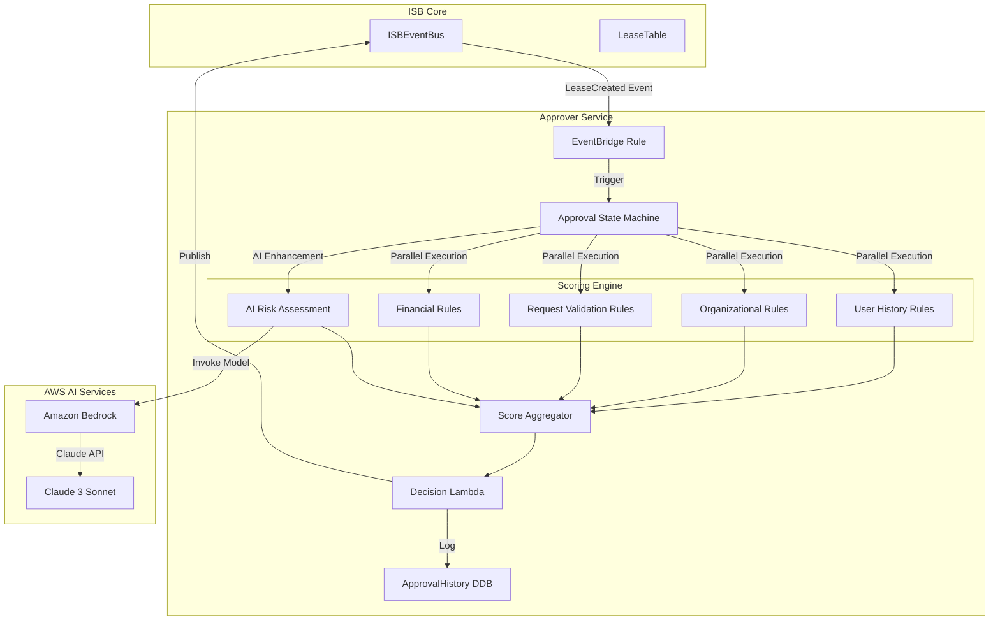
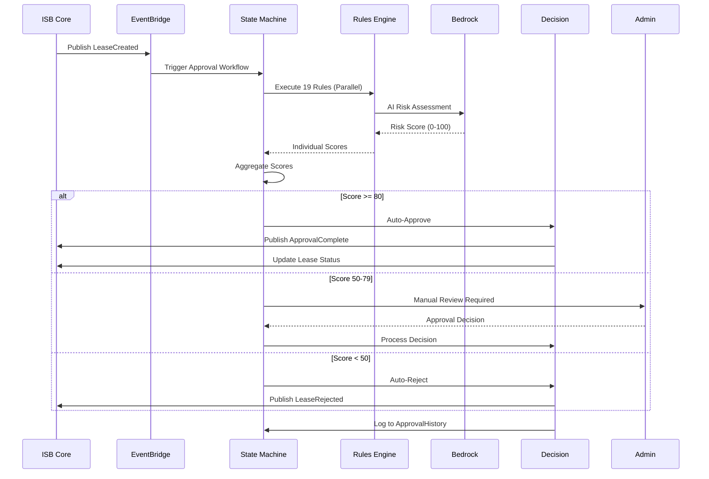
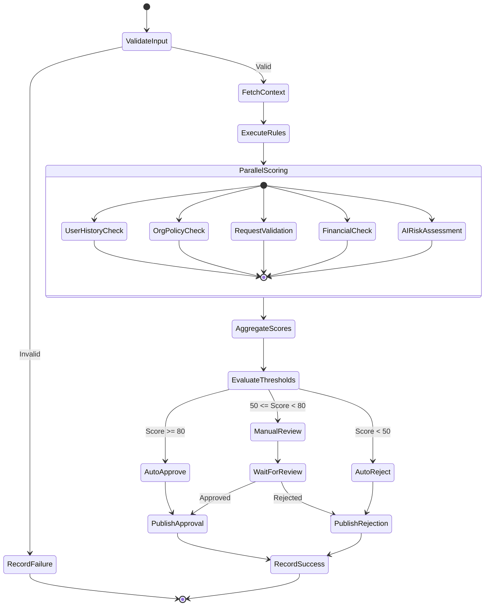
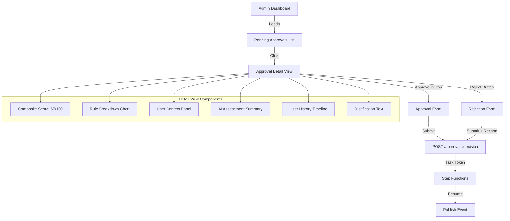

# ISB Approver System

## Executive Summary

The ISB Approver is an intelligent risk assessment service that scores lease requests in real-time using a 19-rule decision engine backed by AWS Bedrock AI. Operating as an event-driven satellite of ISB Core, it evaluates user behavior, organizational context, and request parameters to calculate a composite approval score that informs administrative decisions.

**Key Capabilities:**
- 19-rule scoring engine with configurable weights
- 9-state Step Functions workflow for orchestration
- Amazon Bedrock integration for AI-enhanced risk assessment
- Automated approval/rejection with manual review escalation
- Historical scoring data for trend analysis

**Architecture:** EventBridge → Step Functions → Lambda (rules) → Bedrock AI → DynamoDB

**Status:** Production (Phase 4 Satellite)

---

## Architecture Overview

### System Context



### Event Flow



---

## Step Functions State Machine

### State Diagram



### State Definitions

**1. ValidateInput**
- **Type:** Task (Lambda)
- **Purpose:** Validate LeaseCreated event schema
- **Timeout:** 10 seconds
- **Retry:** 2 attempts
- **Error Handling:** Catch all → RecordFailure

**2. FetchContext**
- **Type:** Task (Lambda)
- **Purpose:** Gather user history, org policies, previous leases
- **Timeout:** 30 seconds
- **Data Enrichment:**
  - Query LeaseTable for user's previous leases
  - Fetch organizational unit policies from SSM Parameter Store
  - Retrieve user profile from Identity Center
  - Get cost history from Costs satellite

**3. ExecuteRules / ParallelScoring**
- **Type:** Parallel state with 5 branches
- **Purpose:** Execute scoring rules concurrently
- **Timeout:** 120 seconds per branch
- **Output:** Array of rule scores

**4. AggregateScores**
- **Type:** Task (Lambda)
- **Purpose:** Calculate weighted composite score
- **Formula:** `Σ(ruleScore × ruleWeight) / Σ(ruleWeight)`

**5. EvaluateThresholds**
- **Type:** Choice state
- **Conditions:**
  - `$.compositeScore >= 80` → AutoApprove
  - `$.compositeScore >= 50 && $.compositeScore < 80` → ManualReview
  - `$.compositeScore < 50` → AutoReject

**6. ManualReview**
- **Type:** Task (callback pattern)
- **Purpose:** Wait for admin decision via API callback
- **Timeout:** 24 hours
- **Callback Token:** Sent to admin dashboard
- **Heartbeat:** 1 hour

**7. PublishApproval / PublishRejection**
- **Type:** Task (Lambda)
- **Purpose:** Publish event to ISBEventBus
- **Events:** `ApprovalComplete` or `LeaseRejected`

**8. RecordSuccess / RecordFailure**
- **Type:** Task (Lambda)
- **Purpose:** Write to ApprovalHistory DynamoDB table
- **Fields:** requestId, compositeScore, decision, timestamp, ruleBreakdown

---

## 19-Rule Scoring Engine

### Rule Categories

#### Category 1: User History Rules (30% weight)

**Rule 1: Previous Lease Compliance (Weight: 10)**
- **Logic:** Count terminated leases without violations
- **Score:** `(compliantLeases / totalLeases) × 100`
- **Data Source:** LeaseTable GSI (LeasesByOwner)
- **Pass Threshold:** > 80%

**Rule 2: Cost Overrun History (Weight: 8)**
- **Logic:** Check if user exceeded budget in past leases
- **Score:** `100 - (overrunCount × 20)` (capped at 0)
- **Data Source:** Costs satellite DynamoDB table
- **Pass Threshold:** 0 overruns

**Rule 3: Lease Duration Pattern (Weight: 6)**
- **Logic:** Compare requested duration to user's avg duration
- **Score:** `100 - |requestedDays - avgDays| × 2` (capped at 0)
- **Pass Threshold:** Within 50% of average

**Rule 4: Account Cleanup Success (Weight: 6)**
- **Logic:** Percentage of clean account returns (no quarantine)
- **Score:** `(cleanReturns / totalReturns) × 100`
- **Data Source:** SandboxAccountTable history
- **Pass Threshold:** > 90%

#### Category 2: Organizational Policy Rules (25% weight)

**Rule 5: Budget Limit Compliance (Weight: 10)**
- **Logic:** Request within org unit's budget policy
- **Score:** `requestedBudget <= maxBudget ? 100 : 0`
- **Data Source:** SSM Parameter `/isb/policies/{orgUnit}/maxBudget`
- **Pass Threshold:** Must pass

**Rule 6: Allowed Regions (Weight: 5)**
- **Logic:** Requested region in org's allowed list
- **Score:** `region in allowedRegions ? 100 : 0`
- **Data Source:** SSM Parameter `/isb/policies/{orgUnit}/regions`
- **Pass Threshold:** Must pass

**Rule 7: Required Tags Present (Weight: 5)**
- **Logic:** All mandatory tags provided
- **Score:** `(providedTags ∩ requiredTags).length / requiredTags.length × 100`
- **Pass Threshold:** 100%

**Rule 8: Permission Set Authorization (Weight: 5)**
- **Logic:** Requested permissions in allowed set
- **Score:** `requestedPerms ⊆ allowedPerms ? 100 : 0`
- **Pass Threshold:** Must pass

#### Category 3: Request Validation Rules (20% weight)

**Rule 9: Justification Quality (Weight: 8)**
- **Logic:** AI-scored justification text (via Bedrock)
- **Score:** Bedrock Claude score (0-100)
- **Pass Threshold:** > 60

**Rule 10: Template Compatibility (Weight: 6)**
- **Logic:** Request parameters match template constraints
- **Score:** `matchingParams / totalParams × 100`
- **Pass Threshold:** 90%

**Rule 11: Lease Timing (Weight: 3)**
- **Logic:** Request during business hours (UK)
- **Score:** `9am-5pm GMT ? 100 : 70`
- **Pass Threshold:** N/A (informational)

**Rule 12: Rate Limit Check (Weight: 3)**
- **Logic:** User hasn't exceeded request rate (5/day)
- **Score:** `requestsToday < 5 ? 100 : 0`
- **Data Source:** DynamoDB query (last 24h)
- **Pass Threshold:** Must pass

#### Category 4: Financial Rules (15% weight)

**Rule 13: Current Spend vs Quota (Weight: 6)**
- **Logic:** User's active spend + requested budget < total quota
- **Score:** `(totalSpend + requested) <= quota ? 100 : 0`
- **Data Source:** Costs satellite aggregate query
- **Pass Threshold:** Must pass

**Rule 14: Cost Trend Analysis (Weight: 5)**
- **Logic:** User's spending trend (last 3 leases)
- **Score:** `trend < 20% increase ? 100 : 50`
- **Pass Threshold:** > 50

**Rule 15: Budget Realism Check (Weight: 4)**
- **Logic:** Requested budget aligns with duration
- **Score:** `budget/duration within historical $X/day ? 100 : 60`
- **Pass Threshold:** > 50

#### Category 5: Risk Assessment Rules (10% weight)

**Rule 16: Anomaly Detection (Weight: 4)**
- **Logic:** Request deviates from user's norm
- **Score:** `100 - (anomalyScore × 50)` (Bedrock ML)
- **Pass Threshold:** > 50

**Rule 17: Concurrent Lease Limit (Weight: 3)**
- **Logic:** User has < 3 active leases
- **Score:** `activeLeases < 3 ? 100 : 0`
- **Pass Threshold:** Must pass

**Rule 18: Organizational Unit Risk (Weight: 2)**
- **Logic:** OU's historical compliance rate
- **Score:** `ouComplianceRate`
- **Data Source:** Aggregated from all OU users
- **Pass Threshold:** > 70

**Rule 19: AI Holistic Risk Score (Weight: 1)**
- **Logic:** Bedrock Claude assesses entire context
- **Score:** Bedrock risk score (0-100)
- **Pass Threshold:** N/A (advisory)

### Rule Execution Architecture

**Lambda Functions:**

```python
# Rule 1: Previous Lease Compliance
def lambda_handler(event, context):
    user_id = event['userId']

    # Query DynamoDB
    response = dynamodb.query(
        TableName='LeaseTable',
        IndexName='LeasesByOwner',
        KeyConditionExpression='ownerId = :uid',
        ExpressionAttributeValues={':uid': user_id}
    )

    leases = response['Items']
    compliant = len([l for l in leases if l['status'] == 'TERMINATED' and not l.get('violations')])
    total = len(leases)

    score = (compliant / total * 100) if total > 0 else 100

    return {
        'ruleId': 'R01',
        'ruleName': 'Previous Lease Compliance',
        'score': score,
        'weight': 10,
        'passed': score > 80,
        'metadata': {
            'totalLeases': total,
            'compliantLeases': compliant
        }
    }
```

**Parallel Execution Configuration:**

```json
{
  "Type": "Parallel",
  "Branches": [
    {
      "StartAt": "UserHistoryRules",
      "States": {
        "UserHistoryRules": {
          "Type": "Parallel",
          "Branches": [
            {"StartAt": "Rule01", "States": {"Rule01": {"Type": "Task", "Resource": "arn:aws:lambda:...:rule01"}}},
            {"StartAt": "Rule02", "States": {"Rule02": {"Type": "Task", "Resource": "arn:aws:lambda:...:rule02"}}},
            {"StartAt": "Rule03", "States": {"Rule03": {"Type": "Task", "Resource": "arn:aws:lambda:...:rule03"}}},
            {"StartAt": "Rule04", "States": {"Rule04": {"Type": "Task", "Resource": "arn:aws:lambda:...:rule04"}}}
          ]
        }
      }
    },
    {
      "StartAt": "OrgPolicyRules",
      "...": "Rules 5-8"
    },
    {
      "StartAt": "RequestValidationRules",
      "...": "Rules 9-12"
    },
    {
      "StartAt": "FinancialRules",
      "...": "Rules 13-15"
    },
    {
      "StartAt": "RiskAssessmentRules",
      "...": "Rules 16-19"
    }
  ],
  "ResultPath": "$.ruleScores",
  "Next": "AggregateScores"
}
```

---

## Amazon Bedrock Integration

### AI-Enhanced Rules

**Rule 9: Justification Quality Assessment**

```python
import boto3
import json

bedrock = boto3.client('bedrock-runtime', region_name='us-east-1')

def assess_justification(text, context):
    prompt = f"""You are evaluating a request for an AWS sandbox account lease.

User's Justification:
{text}

Context:
- Requested Budget: £{context['budget']}
- Duration: {context['duration']} days
- User's Organization: {context['orgUnit']}
- Previous Leases: {context['leaseHistory']}

Assess the quality of this justification on a scale of 0-100:
- 90-100: Detailed, specific, clear business value
- 70-89: Good explanation with some details
- 50-69: Basic justification, lacks specifics
- 30-49: Vague or generic
- 0-29: Minimal effort or irrelevant

Return ONLY a JSON object with this structure:
{{
  "score": <0-100>,
  "reasoning": "<brief explanation>",
  "redFlags": ["<flag1>", "<flag2>"]
}}
"""

    response = bedrock.invoke_model(
        modelId='anthropic.claude-3-sonnet-20240229-v1:0',
        body=json.dumps({
            "anthropic_version": "bedrock-2023-05-31",
            "max_tokens": 500,
            "messages": [
                {
                    "role": "user",
                    "content": prompt
                }
            ]
        })
    )

    result = json.loads(response['body'].read())
    assessment = json.loads(result['content'][0]['text'])

    return assessment
```

**Rule 16: Anomaly Detection**

```python
def detect_anomaly(request, user_history):
    # Build feature vector
    features = {
        'budget': request['budget'],
        'duration': request['duration'],
        'budgetPerDay': request['budget'] / request['duration'],
        'numPermissionSets': len(request['permissions']),
        'isWeekend': datetime.now().weekday() >= 5,
        'hourOfDay': datetime.now().hour
    }

    # Historical averages
    avg = {
        'budget': mean([l['budget'] for l in user_history]),
        'duration': mean([l['duration'] for l in user_history]),
        'budgetPerDay': mean([l['budget']/l['duration'] for l in user_history])
    }

    # Calculate z-scores
    z_scores = {
        k: abs((features[k] - avg.get(k, features[k])) / (stdev(k) or 1))
        for k in ['budget', 'duration', 'budgetPerDay']
    }

    max_z = max(z_scores.values())

    # Use Bedrock for contextual analysis
    prompt = f"""Analyze this account lease request for anomalies:

Request: Budget £{features['budget']} for {features['duration']} days
User History: Avg budget £{avg['budget']}, avg duration {avg['duration']} days
Z-Scores: Budget {z_scores['budget']:.2f}, Duration {z_scores['duration']:.2f}

Statistical Anomaly Score: {max_z:.2f} (2.0+ is unusual)

Context:
- Request Time: {'Weekend' if features['isWeekend'] else 'Weekday'} at {features['hourOfDay']}:00
- Permission Sets: {features['numPermissionSets']}
- Previous Leases: {len(user_history)}

Is this request anomalous? Return JSON:
{{
  "anomalyScore": <0.0-1.0>,
  "confidence": <0.0-1.0>,
  "reasoning": "<explanation>",
  "recommendManualReview": <true/false>
}}
"""

    # (Bedrock invocation similar to above)

    # Combine statistical and AI scores
    final_score = 100 - (max_z * 25 + ai_result['anomalyScore'] * 50)

    return max(0, min(100, final_score))
```

**Rule 19: Holistic AI Risk Assessment**

```python
def holistic_risk_assessment(full_context):
    prompt = f"""You are a risk assessment AI for AWS sandbox account leases.

FULL CONTEXT:
{json.dumps(full_context, indent=2)}

Provide a holistic risk score (0-100, where 100 is safest):
- Consider patterns across all data points
- Identify non-obvious correlations
- Flag subtle red flags
- Account for organizational context

Return JSON:
{{
  "riskScore": <0-100>,
  "riskLevel": "LOW|MEDIUM|HIGH|CRITICAL",
  "keyFactors": ["factor1", "factor2", "factor3"],
  "recommendation": "APPROVE|REVIEW|REJECT",
  "confidence": <0.0-1.0>
}}
"""

    # Bedrock invocation with full context
    response = invoke_bedrock(prompt)

    return response['riskScore']
```

### Bedrock Configuration

**Model:** `anthropic.claude-3-sonnet-20240229-v1:0`

**Rationale:**
- Claude 3 Sonnet balances performance and cost
- Strong reasoning capabilities for nuanced assessment
- JSON mode for structured responses
- 200K token context window (sufficient for full lease context)

**Cost Optimization:**
- Caching enabled for repeated prompts
- Input tokens: $3 / MTok
- Output tokens: $15 / MTok
- Estimated cost per approval: $0.005-0.01

**Fallback Strategy:**
- If Bedrock unavailable, AI rules return neutral score (50)
- Aggregate score recalculated with reduced weight
- Manual review triggered for borderline cases

---

## DynamoDB Schema: ApprovalHistory

```typescript
{
  approvalId: string,                 // Partition Key (UUID)
  leaseId: string,                    // GSI Partition Key
  timestamp: number,                  // Sort Key (epoch)
  userId: string,
  orgUnit: string,

  request: {
    budget: number,
    duration: number,
    templateId: string,
    justification: string,
    permissions: string[],
    tags: Record<string, string>
  },

  ruleScores: {
    R01: { score: number, weight: number, passed: boolean, metadata: object },
    R02: { ... },
    // ... R19
  },

  compositeScore: number,             // Weighted aggregate
  decision: 'APPROVED' | 'REJECTED' | 'MANUAL_REVIEW',
  decisionBy: 'AUTO' | 'ADMIN:{userId}',
  decisionAt: number,

  manualReviewNotes?: string,

  aiAssessments: {
    justificationQuality: object,     // Bedrock response
    anomalyDetection: object,
    holisticRisk: object
  },

  stateExecutionArn: string,          // Step Functions execution ARN
  duration: number                    // Approval process duration (ms)
}
```

**GSI Indexes:**
- `ApprovalsByLease`: leaseId (PK), timestamp (SK)
- `ApprovalsByUser`: userId (PK), timestamp (SK)
- `ApprovalsByDecision`: decision (PK), compositeScore (SK)

**Retention:** 2 years (compliance requirement)

---

## Configuration Management

### SSM Parameter Store

**Organizational Policies:**
```
/isb/policies/{orgUnit}/maxBudget      → "5000"
/isb/policies/{orgUnit}/maxDuration    → "90"
/isb/policies/{orgUnit}/allowedRegions → ["eu-west-2", "eu-west-1"]
/isb/policies/{orgUnit}/requiredTags   → ["CostCentre", "Project"]
/isb/policies/default/maxBudget        → "2000"
```

**Rule Configuration:**
```
/isb/approver/rules/R01/enabled        → "true"
/isb/approver/rules/R01/weight         → "10"
/isb/approver/rules/R01/threshold      → "80"
/isb/approver/thresholds/autoApprove   → "80"
/isb/approver/thresholds/autoReject    → "50"
```

**Bedrock Settings:**
```
/isb/approver/bedrock/modelId          → "anthropic.claude-3-sonnet-20240229-v1:0"
/isb/approver/bedrock/maxTokens        → "1000"
/isb/approver/bedrock/temperature      → "0.3"
/isb/approver/bedrock/timeout          → "30"
```

### Environment Variables

```bash
# Lambda Functions
LEASE_TABLE_NAME=LeaseTable
APPROVAL_HISTORY_TABLE=ApprovalHistory
EVENT_BUS_NAME=ISBEventBus
BEDROCK_MODEL_ID=anthropic.claude-3-sonnet-20240229-v1:0
BEDROCK_REGION=us-east-1

# State Machine
STATE_MACHINE_ARN=arn:aws:states:eu-west-2:xxxxx:stateMachine:LeaseApproval
CALLBACK_API_ENDPOINT=https://api.isb.ndx.gov.uk/approvals/callback

# Thresholds
AUTO_APPROVE_THRESHOLD=80
AUTO_REJECT_THRESHOLD=50
MANUAL_REVIEW_TIMEOUT=86400  # 24 hours
```

---

## Integration Points

### ISB Core
- **Inbound:** `LeaseCreated` event from ISBEventBus
- **Outbound:** `ApprovalComplete`, `LeaseRejected` events
- **API Calls:** Read LeaseTable, SandboxAccountTable, LeaseTemplateTable
- **Authentication:** IAM role with read-only DynamoDB permissions

### Costs Satellite
- **Purpose:** Fetch user's historical spending
- **Method:** DynamoDB query to CostReports table
- **Fallback:** If Costs unavailable, use cached data or skip financial rules

### Identity Center
- **Purpose:** Fetch user profile and org unit membership
- **Method:** SSO Admin API calls
- **Caching:** User data cached 1 hour in ElastiCache (optional)

### Admin Dashboard (React Frontend)
- **Purpose:** Manual review UI
- **API Endpoints:**
  - `GET /approvals?status=MANUAL_REVIEW` - List pending reviews
  - `GET /approvals/{approvalId}` - Get approval details
  - `POST /approvals/{approvalId}/decision` - Submit decision
  - `GET /approvals/{approvalId}/history` - Audit trail
- **Callback Mechanism:** Uses Step Functions task token

---

## Manual Review Workflow

### Admin Dashboard UI



### Decision API

```python
# POST /approvals/{approvalId}/decision
@app.route('/approvals/<approval_id>/decision', methods=['POST'])
@require_admin
def submit_decision(approval_id):
    data = request.json
    decision = data['decision']  # 'APPROVED' or 'REJECTED'
    notes = data.get('notes', '')
    task_token = get_task_token(approval_id)

    # Resume Step Functions execution
    sfn.send_task_success(
        taskToken=task_token,
        output=json.dumps({
            'decision': decision,
            'reviewedBy': request.user.id,
            'reviewNotes': notes,
            'reviewedAt': int(time.time())
        })
    )

    # Update ApprovalHistory
    dynamodb.update_item(
        TableName='ApprovalHistory',
        Key={'approvalId': approval_id},
        UpdateExpression='SET decision = :d, decisionBy = :by, manualReviewNotes = :notes',
        ExpressionAttributeValues={
            ':d': decision,
            ':by': f'ADMIN:{request.user.id}',
            ':notes': notes
        }
    )

    return jsonify({'success': True})
```

---

## Monitoring & Observability

### CloudWatch Metrics

**Custom Metrics:**
- `ApprovalRate` - Percentage of auto-approvals
- `RejectionRate` - Percentage of auto-rejections
- `ManualReviewRate` - Percentage requiring review
- `AverageCompositeScore` - Mean score across all requests
- `ApprovalDuration` - Time from request to decision
- `BedrockLatency` - AI inference time
- `RuleExecutionTime` - Per-rule duration

**Metric Dashboard:**
```
┌─────────────────────────────────────────────────────────┐
│ Approval Funnel (Last 24h)                              │
│                                                          │
│  100 Requests → 65 Auto-Approved (65%)                  │
│              → 25 Manual Review (25%)                   │
│              → 10 Auto-Rejected (10%)                   │
│                                                          │
│  Avg Score: 72/100   Avg Duration: 8.3s                │
└─────────────────────────────────────────────────────────┘

┌─────────────────────────────────────────────────────────┐
│ Rule Performance                                         │
│                                                          │
│  R01: Lease Compliance     ████████████ 92% pass        │
│  R05: Budget Limit         ██████████   87% pass        │
│  R09: Justification (AI)   ███████      78% pass        │
│  R13: Spend vs Quota       █████████    85% pass        │
│  R17: Concurrent Limit     ███████████  95% pass        │
└─────────────────────────────────────────────────────────┘

┌─────────────────────────────────────────────────────────┐
│ Bedrock AI Performance                                   │
│                                                          │
│  Invocations: 300 (last hour)                           │
│  Avg Latency: 2.1s                                      │
│  Error Rate: 0.3%                                       │
│  Cost: £1.23 (today)                                    │
└─────────────────────────────────────────────────────────┘
```

### CloudWatch Alarms

- **High Rejection Rate:** > 20% auto-rejects (potential policy misconfiguration)
- **Bedrock Errors:** > 5% error rate (fallback to non-AI rules)
- **Manual Review Backlog:** > 50 pending reviews (scale admin team)
- **Low Approval Scores:** Avg score < 60 (investigate user experience)
- **Step Functions Failures:** > 2% execution failures

### Logging Strategy

**Structured Logs:**
```json
{
  "timestamp": "2024-01-01T12:00:00Z",
  "level": "INFO",
  "service": "approver",
  "requestId": "req-abc123",
  "approvalId": "appr-xyz789",
  "leaseId": "lease-456",
  "userId": "user-789",
  "action": "RULE_EXECUTION",
  "ruleId": "R09",
  "ruleName": "JustificationQuality",
  "score": 85,
  "duration": 2134,
  "bedrockCalled": true,
  "bedrockTokens": {
    "input": 450,
    "output": 120
  }
}
```

**Log Insights Queries:**

```sql
-- Top rejection reasons
fields ruleId, ruleName
| filter decision = 'REJECTED' and ruleScores[ruleId].passed = false
| stats count() by ruleId, ruleName
| sort count desc

-- Bedrock performance
fields bedrockLatency
| filter bedrockCalled = true
| stats avg(bedrockLatency), p50(bedrockLatency), p99(bedrockLatency)

-- Manual review trends
fields approvalId, compositeScore, decision
| filter decision = 'MANUAL_REVIEW'
| stats count() by bin(timestamp, 1h)
```

---

## Issues & Recommendations

### Current Issues

1. **No Rule Override Mechanism**
   - Admins cannot override specific rules for VIP users
   - **Fix:** Add `ruleOverrides` field in SSM per user/org

2. **Bedrock Single Region**
   - All AI calls to us-east-1 (high latency from UK)
   - No failover if region unavailable
   - **Fix:** Deploy Bedrock endpoint in eu-west-2, multi-region fallback

3. **Manual Review Timeout Hardcoded**
   - 24-hour timeout may be too short for weekends
   - **Fix:** Make configurable per org unit, extend to 72h

4. **No A/B Testing for Rules**
   - Cannot experiment with rule weights or new rules
   - **Fix:** Implement shadow mode for rule testing

5. **Limited Audit Trail**
   - No versioning of rule changes
   - Difficult to trace score drift over time
   - **Fix:** Version rules in DynamoDB, track changes

### Architectural Improvements

1. **Rule Marketplace**
   - Allow org units to define custom rules
   - Community-contributed rules library
   - Rule versioning and rollback

2. **Predictive Scoring**
   - Machine learning model trained on approval history
   - Predict approval likelihood before submission
   - Guide users to improve request quality

3. **Real-Time Feedback**
   - Show live score as user fills out request form
   - Suggest improvements to increase approval odds

4. **Explainable AI**
   - SHAP values for rule contribution
   - Plain English explanation of score
   - Educational feedback for rejected requests

5. **Auto-Tuning Thresholds**
   - ML-based threshold optimization
   - Adapt to changing risk tolerance
   - Historical analysis of false positives/negatives

---

## Security Considerations

### IAM Permissions

**Approver Lambda Execution Role:**
```json
{
  "Version": "2012-10-17",
  "Statement": [
    {
      "Effect": "Allow",
      "Action": [
        "dynamodb:Query",
        "dynamodb:GetItem"
      ],
      "Resource": [
        "arn:aws:dynamodb:*:*:table/LeaseTable",
        "arn:aws:dynamodb:*:*:table/LeaseTable/index/*"
      ]
    },
    {
      "Effect": "Allow",
      "Action": [
        "dynamodb:PutItem",
        "dynamodb:UpdateItem"
      ],
      "Resource": "arn:aws:dynamodb:*:*:table/ApprovalHistory"
    },
    {
      "Effect": "Allow",
      "Action": "bedrock:InvokeModel",
      "Resource": "arn:aws:bedrock:us-east-1::foundation-model/anthropic.claude-3-sonnet-*"
    },
    {
      "Effect": "Allow",
      "Action": "ssm:GetParameter",
      "Resource": "arn:aws:ssm:*:*:parameter/isb/approver/*"
    }
  ]
}
```

### Data Privacy

**PII Handling:**
- Justification text may contain PII (names, emails)
- **Mitigation:** PII detection via Bedrock Guardrails
- **Retention:** Anonymize after 90 days

**Bedrock Data Governance:**
- Opt-out of data collection for model training
- Use AWS-managed encryption keys
- VPC endpoints for private connectivity

---

## Testing Strategy

### Unit Tests (per rule)
```python
def test_rule01_previous_lease_compliance():
    # Mock DynamoDB response
    mock_leases = [
        {'status': 'TERMINATED', 'violations': None},
        {'status': 'TERMINATED', 'violations': ['OVER_BUDGET']},
        {'status': 'ACTIVE'}
    ]

    score = rule01_handler({'userId': 'test-user'}, mock_context)

    assert score['score'] == 50  # 1/2 compliant terminated
    assert score['passed'] == False  # Below 80 threshold
```

### Integration Tests (full workflow)
```python
def test_approval_workflow_auto_approve():
    # Publish LeaseCreated event
    event = {
        'detail': {
            'leaseId': 'test-lease',
            'userId': 'good-user',
            'budget': 1000,
            'duration': 30
        }
    }

    # Trigger Step Functions
    execution = sfn.start_execution(
        stateMachineArn=STATE_MACHINE_ARN,
        input=json.dumps(event)
    )

    # Wait for completion
    result = wait_for_execution(execution['executionArn'])

    assert result['status'] == 'SUCCEEDED'
    assert result['output']['decision'] == 'APPROVED'
    assert result['output']['compositeScore'] >= 80
```

### Load Tests
- Simulate 100 concurrent approval requests
- Verify Step Functions concurrency limits (1000 default)
- Test Bedrock throttling behavior
- Measure end-to-end latency under load

---

## Cost Analysis

### Monthly Estimate (1000 leases/month)

| Service | Usage | Cost |
|---------|-------|------|
| Step Functions | 1000 executions × 9 state transitions | £0.25 |
| Lambda | 19 rules × 1000 × 2s × 512MB | £8.00 |
| DynamoDB | 10K reads + 1K writes | £1.50 |
| Bedrock | 1000 invocations × 500 tokens avg | £7.50 |
| EventBridge | 1000 events | £0.10 |
| CloudWatch Logs | 5GB/month | £2.50 |
| **Total** | | **£19.85/month** |

**Per-Approval Cost:** £0.02

---

## References

- **Repository:** ndx-aws-isb-satellites/approver (Phase 4)
- **Related Docs:** [10-isb-core-architecture.md](10-isb-core-architecture.md)
- **AWS Services:** Step Functions, Bedrock, EventBridge, DynamoDB
- **Bedrock Models:** Claude 3 Sonnet
- **Contact:** ISB Approver Team

---

**Document Version:** 1.0
**Last Updated:** 2024-01-01
**Status:** Production System
