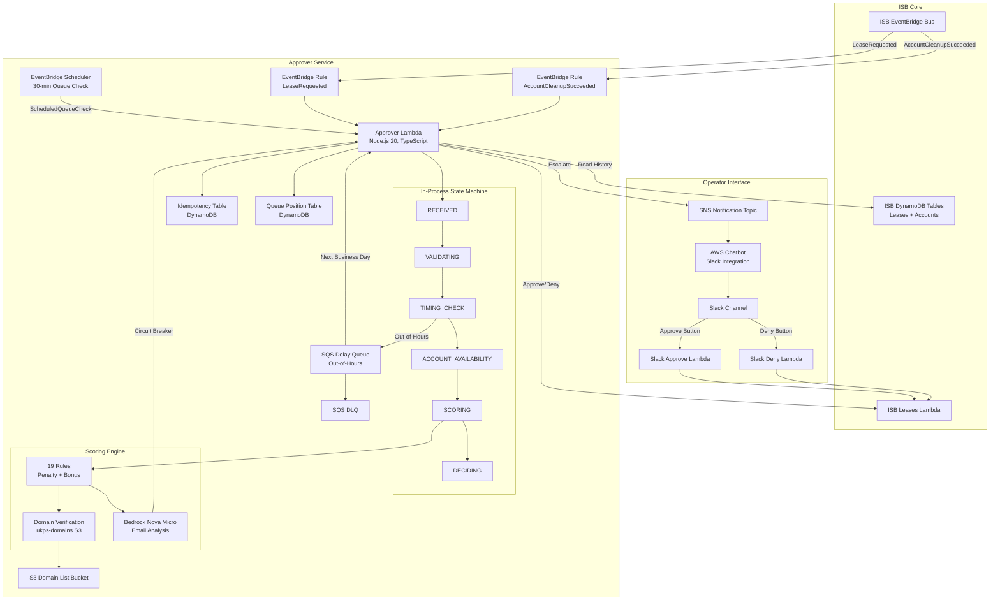
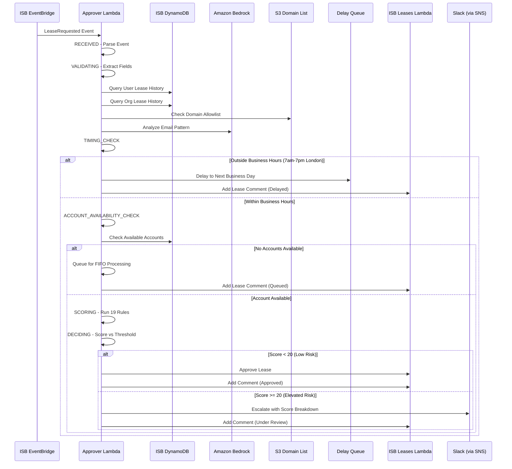

# Approver System

> **Last Updated**: 2026-03-02
> **Source**: [innovation-sandbox-on-aws-approver](https://github.com/co-cddo/innovation-sandbox-on-aws-approver)
> **Captured SHA**: `be062e7`

## Executive Summary

The ISB Approver is an intelligent, event-driven lease approval service that transforms manual approval bottlenecks into an automated, score-based decision system for the Innovation Sandbox. It evaluates `LeaseRequested` events using a 19-rule scoring engine with configurable weights, AI-powered email analysis via Amazon Bedrock (Nova Micro), and UK government domain verification. The system targets instant approval for 80%+ of legitimate requests, while escalating higher-risk requests to operators via Slack with full score breakdowns and one-click approve/deny actions.

## Architecture Overview

The Approver operates as a single Lambda function subscribing to three event sources: `LeaseRequested` events and `AccountCleanupSucceeded` events from the ISB EventBridge bus, plus a 30-minute scheduled queue check. It implements an in-process state machine pattern (not AWS Step Functions) to orchestrate the decision flow, with SQS for out-of-hours delay queueing and DynamoDB for idempotency tracking and queue position management.

### Component Architecture

```mermaid
graph TB
    subgraph "ISB Core"
        ISB_EB[ISB EventBridge Bus]
        ISB_DDB[ISB DynamoDB Tables<br/>Leases + Accounts]
        ISB_LAMBDA[ISB Leases Lambda]
    end

    subgraph "Approver Service"
        EB_RULE1[EventBridge Rule<br/>LeaseRequested]
        EB_RULE2[EventBridge Rule<br/>AccountCleanupSucceeded]
        EB_SCHED[EventBridge Scheduler<br/>30-min Queue Check]

        LAMBDA[Approver Lambda<br/>Node.js 20, TypeScript]

        subgraph "In-Process State Machine"
            SM_RECV[RECEIVED]
            SM_VALID[VALIDATING]
            SM_TIME[TIMING_CHECK]
            SM_ACCT[ACCOUNT_AVAILABILITY]
            SM_SCORE[SCORING]
            SM_DECIDE[DECIDING]
        end

        subgraph "Scoring Engine"
            RULES[19 Rules<br/>Penalty + Bonus]
            DOMAIN[Domain Verification<br/>ukps-domains S3]
            AI[Bedrock Nova Micro<br/>Email Analysis]
        end

        SQS[SQS Delay Queue<br/>Out-of-Hours]
        SQS_DLQ[SQS DLQ]
        IDEMP_DDB[Idempotency Table<br/>DynamoDB]
        QUEUE_DDB[Queue Position Table<br/>DynamoDB]
        S3_DOMAINS[S3 Domain List Bucket]
    end

    subgraph "Operator Interface"
        SNS[SNS Notification Topic]
        CHATBOT[AWS Chatbot<br/>Slack Integration]
        SLACK[Slack Channel]
        APPROVE_FN[Slack Approve Lambda]
        DENY_FN[Slack Deny Lambda]
    end

    ISB_EB -->|LeaseRequested| EB_RULE1
    ISB_EB -->|AccountCleanupSucceeded| EB_RULE2
    EB_SCHED -->|ScheduledQueueCheck| LAMBDA
    EB_RULE1 --> LAMBDA
    EB_RULE2 --> LAMBDA

    LAMBDA --> SM_RECV --> SM_VALID --> SM_TIME --> SM_ACCT --> SM_SCORE --> SM_DECIDE

    SM_SCORE --> RULES
    RULES --> DOMAIN
    RULES --> AI
    DOMAIN --> S3_DOMAINS
    AI -->|Circuit Breaker| LAMBDA

    SM_TIME -->|Out-of-Hours| SQS
    SQS --> SQS_DLQ
    SQS -->|Next Business Day| LAMBDA

    LAMBDA --> IDEMP_DDB
    LAMBDA --> QUEUE_DDB
    LAMBDA -->|Approve/Deny| ISB_LAMBDA
    LAMBDA -->|Read History| ISB_DDB
    LAMBDA -->|Escalate| SNS
    SNS --> CHATBOT --> SLACK

    SLACK -->|Approve Button| APPROVE_FN --> ISB_LAMBDA
    SLACK -->|Deny Button| DENY_FN --> ISB_LAMBDA
```

### Decision Flow

```mermaid
sequenceDiagram
    participant ISB as ISB EventBridge
    participant Lambda as Approver Lambda
    participant DDB as ISB DynamoDB
    participant Bedrock as Amazon Bedrock
    participant S3 as S3 Domain List
    participant SQS as Delay Queue
    participant ISB_API as ISB Leases Lambda
    participant Slack as Slack (via SNS)

    ISB->>Lambda: LeaseRequested Event
    Lambda->>Lambda: RECEIVED - Parse Event

    Lambda->>Lambda: VALIDATING - Extract Fields
    Lambda->>DDB: Query User Lease History
    Lambda->>DDB: Query Org Lease History
    Lambda->>S3: Check Domain Allowlist
    Lambda->>Bedrock: Analyze Email Pattern

    Lambda->>Lambda: TIMING_CHECK

    alt Outside Business Hours (7am-7pm London)
        Lambda->>SQS: Delay to Next Business Day
        Lambda->>ISB_API: Add Lease Comment (Delayed)
    else Within Business Hours
        Lambda->>Lambda: ACCOUNT_AVAILABILITY_CHECK
        Lambda->>DDB: Check Available Accounts

        alt No Accounts Available
            Lambda->>Lambda: Queue for FIFO Processing
            Lambda->>ISB_API: Add Lease Comment (Queued)
        else Account Available
            Lambda->>Lambda: SCORING - Run 19 Rules
            Lambda->>Lambda: DECIDING - Score vs Threshold

            alt Score < 20 (Low Risk)
                Lambda->>ISB_API: Approve Lease
                Lambda->>ISB_API: Add Comment (Approved)
            else Score >= 20 (Elevated Risk)
                Lambda->>Slack: Escalate with Score Breakdown
                Lambda->>ISB_API: Add Comment (Under Review)
            end
        end
    end
```

## Scoring Engine

The scoring engine evaluates 19 rules synchronously within a single Lambda invocation. Each rule returns a point value (positive for penalties, negative for bonuses). The composite score determines the decision: scores below 20 are auto-approved; scores of 20 or above are escalated for manual review.

**Source**: `src/scoring/engine.ts`, `src/scoring/rules.ts`

### Penalty Rules (Increase Risk Score)

| Rule | Weight | Trigger |
|------|--------|---------|
| `expired_leases` | +2 each | Expired lease in last 30 days |
| `budget_exceeded` | +5 each | Budget exceeded in last 30 days |
| `first_time_user` | +5 | No previous leases |
| `first_time_user_group_mailbox_compound` | +20 | First lease + group mailbox |
| `cooldown_violation` | +10 | Request within 1hr of previous lease end |
| `outside_target_audience` | +50 | Non-local-government domain |
| `group_mailbox_detected` | +20 | AI-detected group/shared mailbox |
| `org_recent_negative` | +3 | Same-domain issues in last 30 days |
| `template_hopper` | +2 | 3+ leases never repeating template |
| `end_of_window` | +2 | Request in final 2 hours (5-7pm London) |
| `user_rate_limit` | +5 per | Excess requests beyond 2/hour |
| `org_rate_limit` | +3 | 5+ users from same org in last hour |
| `budget_amount` | +1 per $10 | Higher budgets = more scrutiny |
| `duration_requested` | +1 per 8hrs | Longer durations = more scrutiny |

### Bonus Rules (Decrease Risk Score)

| Rule | Weight | Trigger |
|------|--------|---------|
| `allow_list_override` | -100 | User on operator allow-list |
| `verified_gov_domain` | -5 | Domain in ukps-domains list |
| `familiar_template` | -1 | Previously used template successfully |
| `manual_early_termination` | -2 each | Responsible early termination |
| `org_clean_record` | -2 | Domain clean for 90 days with 5+ leases |

## In-Process State Machine

The approver implements an enum-based state machine within the Lambda function rather than using AWS Step Functions. This design keeps latency low (single Lambda invocation) while maintaining clear state transitions and audit trails.

**Source**: `src/state-machine/types.ts`, `src/state-machine/orchestrator.ts`, `src/state-machine/handlers.ts`

**States**: `RECEIVED` -> `VALIDATING` -> `TIMING_CHECK` -> `ACCOUNT_AVAILABILITY_CHECK` -> `SCORING` -> `DECIDING` -> Terminal state (`APPROVED`, `DENIED`, `ESCALATED`, `DELAYED`, `ERROR`)

Each state transition is recorded in a `stateHistory` array on the `StateContext`, providing a complete audit trail of the decision process including timestamps and durations.

## Infrastructure (CDK)

The Approver deploys as a single CDK stack (`ApproverStack`) containing:

**Source**: `cdk/lib/approver-stack.ts`, `cdk/config/environments.ts`

| Resource | Purpose |
|----------|---------|
| **Approver Lambda** | Main decision engine (Node.js 20, TypeScript) |
| **Slack Approve Lambda** | Handles Slack approve button clicks |
| **Slack Deny Lambda** | Handles Slack deny button clicks |
| **DynamoDB: ApproverIdempotency** | Lambda Powertools idempotency (TTL-based) |
| **DynamoDB: ApproverQueuePosition** | FIFO queue tracking with GSI for position ordering |
| **S3: Domain List Bucket** | Cached ukps-domains allowlist (1-hour TTL) |
| **SQS: Delay Queue + DLQ** | Out-of-hours request buffering |
| **SNS: Notification Topic** | Escalation notifications to Slack |
| **AWS Chatbot: Slack Channel** | Slack workspace integration |
| **Chatbot Custom Actions** | Approve/Deny buttons on Slack notifications |
| **EventBridge Rules** | LeaseRequested + AccountCleanupSucceeded on ISB bus |
| **EventBridge Scheduler** | 30-minute queue check schedule |
| **CloudWatch Alarms** | DLQ depth, error rate, latency, Slack action errors, SNS failures |
| **CloudWatch Dashboard** | Slack actions invocations, errors, duration |

## Key Integration Points

### ISB Core
- **Inbound Events**: `LeaseRequested`, `AccountCleanupSucceeded` from ISB EventBridge
- **Outbound**: Direct Lambda invocation of ISB Leases Lambda for approve/deny actions
- **Data Access**: Reads ISB DynamoDB tables (Leases, Accounts) for user/org history
- **ISB Client**: Uses `@co-cddo/isb-client` npm package for typed API calls

### Amazon Bedrock
- **Model**: Amazon Nova Micro (`us.amazon.nova-micro-v1:0`)
- **Purpose**: Detect group/shared mailbox patterns in email addresses
- **Resilience**: Circuit breaker with 60-second recovery; falls back to rule-based heuristics
- **Region**: us-east-1

### Slack Integration
- SNS -> AWS Chatbot -> Slack channel for escalation notifications
- Custom Actions with Approve/Deny buttons invoke dedicated Lambda functions
- Reference numbers (ISB-YYYY-NNNN) for tracking
- Deep links to ISB console for manual review

### Business Hours
- Window: 7am-7pm London time, weekdays only
- UK bank holidays detected via gov.uk calendar API
- Out-of-hours requests queued to SQS with delay until next business day
- Queue expires after 5 business days with automatic denial

## Technology Stack

| Component | Technology |
|-----------|------------|
| Runtime | Node.js 20, TypeScript 5.7 (strict mode) |
| Infrastructure | AWS CDK v2.170+ |
| Build | esbuild (CJS output, externalize AWS SDK) |
| Testing | Vitest with 800+ tests |
| Validation | Zod schemas for event parsing |
| Logging | AWS Lambda Powertools structured JSON logging |
| Metrics | AWS Lambda Powertools custom CloudWatch metrics |
| Idempotency | AWS Lambda Powertools with DynamoDB backend |
| CI/CD | GitHub Actions with OIDC (no long-lived credentials) |

## Observability

- **Structured Logging**: JSON CloudWatch logs with correlation IDs, score breakdowns, state transitions
- **Custom Metrics**: Decision counts, score distributions, per-rule trigger rates, Bedrock latency
- **CloudWatch Alarms**: DLQ depth >5, error rate >1%, p95 latency >5s, Slack action failures, SNS delivery failures
- **Audit Trail**: 7-year CloudWatch log retention (GDPR compliance)
- **Dashboard**: Slack actions invocations, errors, and duration graphs

## Testing

The repository contains 800+ tests organized across:
- `test/scoring/` - Scoring engine and individual rule tests
- `test/state-machine/` - Orchestrator and handler state transition tests
- `test/lib/` - Utility function tests (business hours, circuit breaker, domain verification, email analysis)
- `test/handlers/` - Slack approve/deny handler tests
- `test/services/` - AWS service integration tests (DynamoDB, SQS, Bedrock, SNS)
- `cdk/test/` - CDK infrastructure assertion tests

**Source**: `test/` directory (28+ test files), `cdk/test/` directory

---
*Generated from source analysis of `innovation-sandbox-on-aws-approver` at SHA `be062e7`. See [00-repo-inventory.md](./00-repo-inventory.md) for full inventory.*
