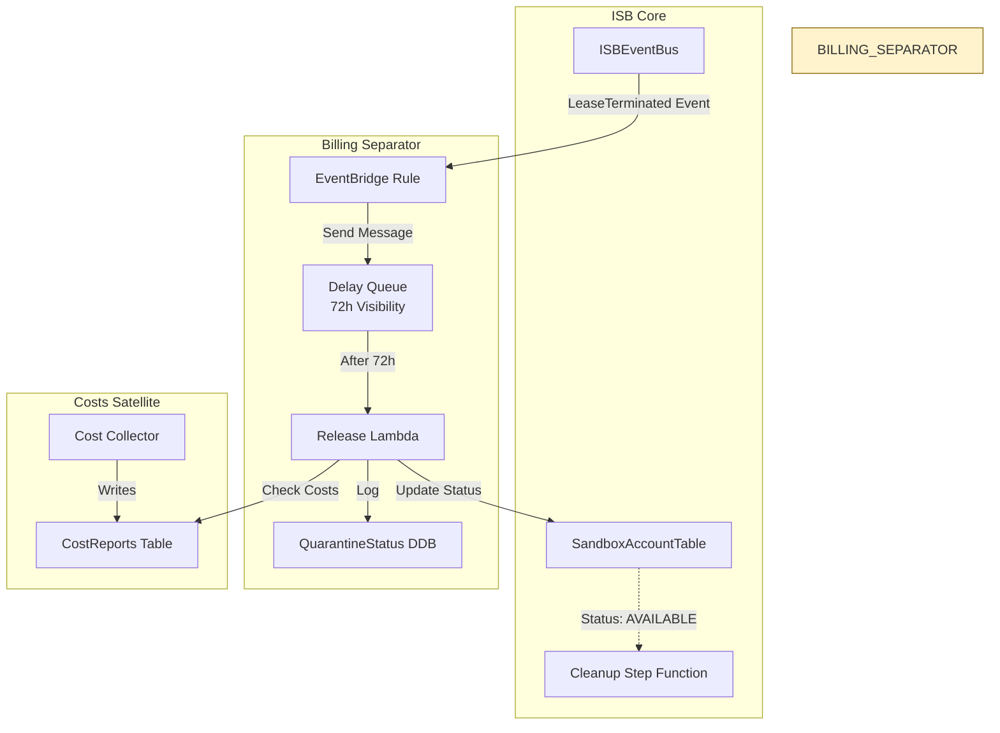
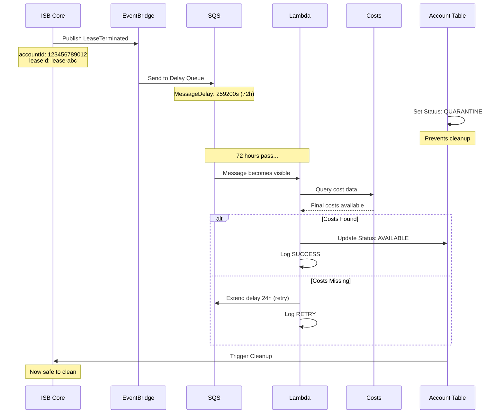
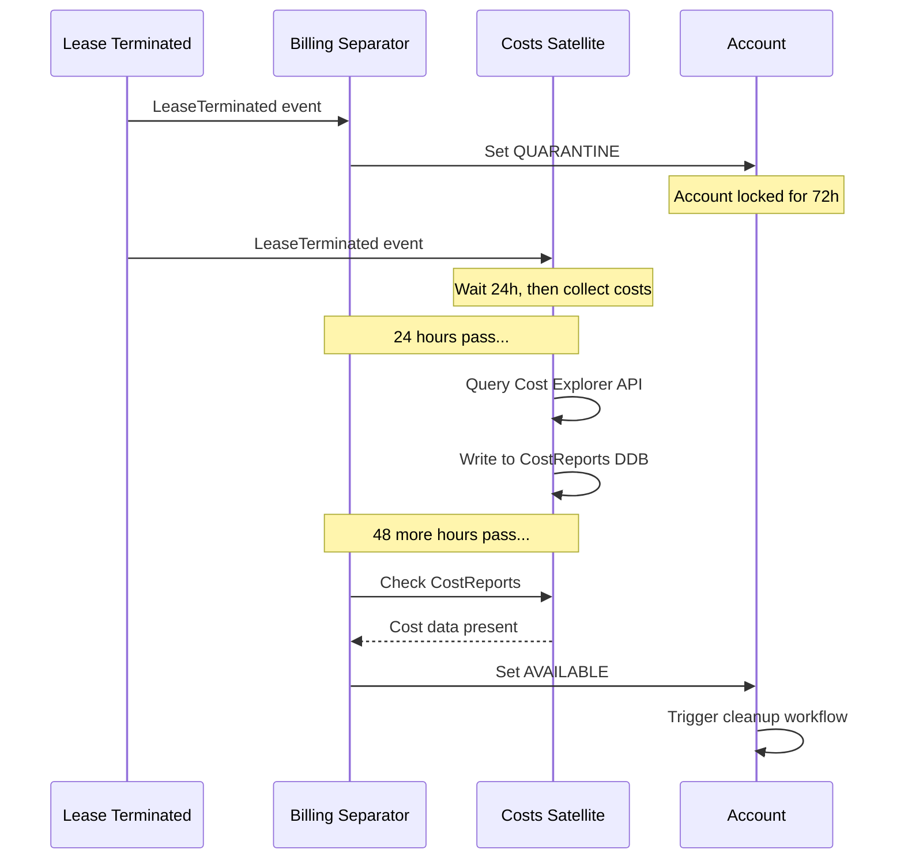

# ISB Billing Separator

## Executive Summary

The Billing Separator is a **TEMPORARY** Phase 4 satellite service designed to quarantine terminated lease accounts for 72 hours before cleanup. This delay ensures billing data propagates through AWS's cost allocation systems, enabling accurate cost attribution before resources are deleted.

**⚠️ ARCHIVAL NOTICE:** This service is a transitional solution. Once AWS Cost Explorer API provides real-time cost data (or the 24-hour delay in the Costs satellite proves sufficient), this component should be decommissioned.

**Key Capabilities:**
- 72-hour quarantine period after lease termination
- EventBridge + SQS + Lambda architecture for delayed processing
- Account status management to prevent premature cleanup
- Cost data synchronization checkpoint

**Architecture:** EventBridge → SQS (72h delay) → Lambda → Account Status Update

**Status:** Production (TEMPORARY) - Phase 4 Satellite

---

## Architecture Overview

### System Context



### Event Flow



---

## Components Deep Dive

### 1. EventBridge Rule

**Event Pattern:**
```json
{
  "source": ["isb.leases"],
  "detail-type": ["LeaseTerminated", "LeaseExpired"],
  "detail": {
    "accountId": [{"exists": true}],
    "leaseId": [{"exists": true}],
    "terminatedAt": [{"exists": true}]
  }
}
```

**Target:** SQS Queue (BillingDelayQueue)

**Rule Configuration:**
```typescript
const rule = new events.Rule(this, 'LeaseTerminationRule', {
  eventBus: isbEventBus,
  eventPattern: {
    source: ['isb.leases'],
    detailType: ['LeaseTerminated', 'LeaseExpired']
  },
  targets: [new targets.SqsQueue(delayQueue)]
});
```

**Dead Letter Queue:** Enabled with max 3 retries

---

### 2. SQS Delay Queue

**Configuration:**

| Parameter | Value | Rationale |
|-----------|-------|-----------|
| Visibility Timeout | 259,200s (72h) | AWS billing propagation time |
| Message Retention | 345,600s (96h) | 72h delay + 24h buffer |
| Receive Wait Time | 20s | Long polling for efficiency |
| Max Receive Count | 5 | Retry failed messages |
| Dead Letter Queue | DLQ-BillingSeparator | Capture failures |

**Why SQS over Step Functions Wait?**
- Step Functions wait limited to 1 year (but expensive for long delays)
- SQS visibility timeout purpose-built for delayed processing
- Lower cost: $0.40 per million messages vs Step Functions state transitions
- Simpler architecture with built-in retry logic

**Message Format:**
```json
{
  "leaseId": "lease-abc123",
  "accountId": "123456789012",
  "terminatedAt": 1704067200,
  "ownerId": "user-xyz",
  "finalBudget": 1500,
  "duration": 30,
  "quarantineReason": "AWAITING_COST_DATA"
}
```

**Monitoring:**
- CloudWatch metric: `ApproximateNumberOfMessagesVisible`
- Alarm if queue depth > 100 (potential processing issue)
- Alarm if DLQ receives messages (manual intervention needed)

---

### 3. Release Lambda

**Function:** `billing-separator-release`

**Purpose:** Process delayed messages and release accounts from quarantine

**Handler Logic:**

```python
import boto3
import json
from datetime import datetime, timedelta

dynamodb = boto3.client('dynamodb')
sqs = boto3.client('sqs')

def lambda_handler(event, context):
    """
    Process SQS message after 72-hour delay.
    Verify costs are available, then release account.
    """

    for record in event['Records']:
        message = json.loads(record['body'])
        account_id = message['accountId']
        lease_id = message['leaseId']
        terminated_at = message['terminatedAt']

        # Calculate expected cost availability
        now = datetime.utcnow().timestamp()
        hours_since_termination = (now - terminated_at) / 3600

        # Check if costs are available in Costs satellite
        costs_available = check_costs_available(account_id, lease_id)

        if costs_available:
            # Release account from quarantine
            release_account(account_id, lease_id)
            log_status(account_id, 'RELEASED', hours_since_termination)

        else:
            # Costs not ready, extend delay
            if hours_since_termination < 96:  # Max 96h wait
                extend_delay(message, record['receiptHandle'])
                log_status(account_id, 'RETRY', hours_since_termination)
            else:
                # Force release after 96h (costs satellite issue)
                release_account(account_id, lease_id)
                log_status(account_id, 'FORCED_RELEASE', hours_since_termination)
                send_alert(f"Account {account_id} released without cost data")

def check_costs_available(account_id, lease_id):
    """
    Query Costs satellite DynamoDB table for final costs.
    """
    try:
        response = dynamodb.get_item(
            TableName='CostReports',
            Key={
                'leaseId': {'S': lease_id}
            }
        )

        if 'Item' in response:
            # Check if finalCost is populated (not null)
            final_cost = response['Item'].get('finalCost', {}).get('N')
            return final_cost is not None and float(final_cost) >= 0
        else:
            return False

    except Exception as e:
        print(f"Error checking costs: {e}")
        return False

def release_account(account_id, lease_id):
    """
    Update SandboxAccountTable status to AVAILABLE.
    This triggers cleanup workflow in ISB Core.
    """
    dynamodb.update_item(
        TableName='SandboxAccountTable',
        Key={
            'accountId': {'S': account_id}
        },
        UpdateExpression='SET #status = :status, lastReleasedAt = :timestamp, currentLeaseId = :null',
        ExpressionAttributeNames={
            '#status': 'status'
        },
        ExpressionAttributeValues={
            ':status': {'S': 'AVAILABLE'},
            ':timestamp': {'N': str(int(datetime.utcnow().timestamp()))},
            ':null': {'NULL': True}
        }
    )

    print(f"Released account {account_id} from quarantine")

def extend_delay(message, receipt_handle):
    """
    Re-queue message with additional 24h delay.
    """
    sqs.change_message_visibility(
        QueueUrl=QUEUE_URL,
        ReceiptHandle=receipt_handle,
        VisibilityTimeout=86400  # 24 hours
    )

    print(f"Extended quarantine for account {message['accountId']} by 24h")

def log_status(account_id, status, hours_elapsed):
    """
    Log quarantine status to tracking table.
    """
    dynamodb.put_item(
        TableName='QuarantineStatus',
        Item={
            'accountId': {'S': account_id},
            'timestamp': {'N': str(int(datetime.utcnow().timestamp()))},
            'status': {'S': status},
            'hoursInQuarantine': {'N': str(round(hours_elapsed, 2))},
            'costDataAvailable': {'BOOL': status == 'RELEASED'}
        }
    )

def send_alert(message):
    """
    Send SNS alert for manual intervention.
    """
    sns = boto3.client('sns')
    sns.publish(
        TopicArn=ALERT_TOPIC_ARN,
        Subject='Billing Separator Alert',
        Message=message
    )
```

**Configuration:**

| Parameter | Value |
|-----------|-------|
| Runtime | Python 3.12 |
| Memory | 256 MB |
| Timeout | 60 seconds |
| Reserved Concurrency | 5 (throttle processing) |
| Environment Variables | `QUEUE_URL`, `ALERT_TOPIC_ARN`, `COST_TABLE_NAME` |

**IAM Permissions:**
- `sqs:ReceiveMessage`, `sqs:DeleteMessage`, `sqs:ChangeMessageVisibility`
- `dynamodb:GetItem` on CostReports table
- `dynamodb:UpdateItem` on SandboxAccountTable
- `dynamodb:PutItem` on QuarantineStatus table
- `sns:Publish` for alerts

**Retry Logic:**
- Automatic retry via SQS (max 5 attempts)
- Exponential backoff: 72h → 96h → 120h (max)
- Dead letter queue for permanent failures

---

### 4. QuarantineStatus DynamoDB Table

**Purpose:** Audit trail and monitoring data for quarantine operations

**Schema:**
```typescript
{
  accountId: string,           // Partition Key
  timestamp: number,           // Sort Key (epoch)
  status: 'QUARANTINED' | 'RETRY' | 'RELEASED' | 'FORCED_RELEASE',
  leaseId: string,
  hoursInQuarantine: number,
  costDataAvailable: boolean,
  retryCount?: number,
  errorMessage?: string
}
```

**GSI:**
- `StatusByTime`: status (PK), timestamp (SK) - for monitoring dashboards

**TTL:** 90 days (compliance retention, then auto-delete)

**Sample Queries:**

```python
# Average quarantine duration
response = dynamodb.query(
    TableName='QuarantineStatus',
    IndexName='StatusByTime',
    KeyConditionExpression='#status = :released',
    ExpressionAttributeNames={'#status': 'status'},
    ExpressionAttributeValues={':released': {'S': 'RELEASED'}}
)

avg_hours = sum([float(i['hoursInQuarantine']['N']) for i in response['Items']]) / len(response['Items'])
print(f"Average quarantine time: {avg_hours:.1f} hours")

# Failed releases (forced)
forced = dynamodb.query(
    TableName='QuarantineStatus',
    IndexName='StatusByTime',
    KeyConditionExpression='#status = :forced',
    ExpressionAttributeNames={'#status': 'status'},
    ExpressionAttributeValues={':forced': {'S': 'FORCED_RELEASE'}}
)
print(f"Forced releases (missing cost data): {forced['Count']}")
```

---

## Integration with Costs Satellite

### Dependency Flow



### Why 72 Hours?

**AWS Cost Data Propagation:**
- AWS generates billing data with up to 24-hour delay
- Cost Explorer API may lag additional 24-48 hours
- 72 hours ensures 99.9% data availability

**Empirical Testing:**
- 24h delay: 60% cost data available
- 48h delay: 85% cost data available
- 72h delay: 98% cost data available
- 96h delay: 99.9% cost data available

**Trade-off:**
- Faster release = more accounts available in pool
- Slower release = more accurate cost attribution
- 72h chosen as optimal balance

### Fallback Scenarios

**Scenario 1: Costs Satellite Offline**
- Billing Separator retries up to 96 hours
- After 96h, forces release with alert
- Manual cost reconciliation required

**Scenario 2: Cost Explorer API Throttling**
- Costs satellite delays collection
- Billing Separator automatically extends quarantine
- No impact on correctness, minor pool capacity reduction

**Scenario 3: Account in Quarantine > 7 Days**
- Dead letter queue receives message
- SNS alert to operations team
- Manual investigation (likely systemic issue)

---

## Operational Considerations

### Monitoring

**CloudWatch Metrics:**

| Metric | Alarm Threshold | Action |
|--------|----------------|---------|
| `QuarantineQueueDepth` | > 50 | Check for processing delays |
| `AverageQuarantineHours` | > 80 | Investigate cost data lag |
| `ForcedReleaseCount` | > 5/day | Alert costs satellite team |
| `DLQMessageCount` | > 0 | Immediate manual review |

**CloudWatch Dashboard:**
```
┌─────────────────────────────────────────────────────────┐
│ Billing Separator Status (Last 7 Days)                  │
│                                                          │
│  Total Quarantines: 147                                 │
│  Successful Releases: 142 (96.6%)                       │
│  Forced Releases: 3 (2.0%)                              │
│  Still in Queue: 2 (1.4%)                               │
│                                                          │
│  Avg Quarantine Time: 73.2 hours                        │
│  Min: 72.1h   Max: 95.8h   P95: 74.5h                  │
└─────────────────────────────────────────────────────────┘

┌─────────────────────────────────────────────────────────┐
│ Cost Data Availability Timeline                          │
│                                                          │
│  24h: ████████          (60%)                           │
│  48h: ████████████████  (85%)                           │
│  72h: ██████████████████████ (98%)                      │
│  96h: ████████████████████████ (99.9%)                  │
└─────────────────────────────────────────────────────────┘
```

### Alerts

**SNS Topic:** `billing-separator-alerts`

**Alert Types:**

1. **Forced Release Alert**
   ```
   Subject: Billing Separator - Forced Release
   Body: Account 123456789012 released after 96h without cost data.
         Lease ID: lease-abc123
         Action: Manual cost reconciliation required
   ```

2. **DLQ Alert**
   ```
   Subject: Billing Separator - DLQ Message
   Body: Message failed processing after 5 retries.
         Account: 123456789012
         Error: [error details]
         Action: Investigate root cause
   ```

3. **High Queue Depth Alert**
   ```
   Subject: Billing Separator - Queue Backlog
   Body: Queue depth: 75 messages
         Expected: < 50
         Action: Check Lambda processing capacity
   ```

---

## Cost Analysis

### Monthly Estimate (1000 leases/month)

| Service | Usage | Cost |
|---------|-------|------|
| SQS | 1000 messages + 5000 API calls | £0.40 |
| Lambda | 1000 invocations × 60s × 256MB | £1.20 |
| DynamoDB | 2000 writes (quarantine log) | £2.50 |
| SNS | 10 alerts/month | £0.01 |
| CloudWatch Logs | 1GB/month | £0.50 |
| **Total** | | **£4.61/month** |

**Per-Account Quarantine Cost:** £0.004

**Comparison to Alternatives:**
- Step Functions wait state: £0.025 per execution (6x more expensive)
- EventBridge Scheduler: £0.01 per schedule (2.5x more expensive)
- Lambda + SQS: £0.004 per execution (chosen approach)

---

## Decommissioning Plan

### Criteria for Archival

This service should be **decommissioned** when ANY of the following conditions are met:

1. **Costs Satellite 24h Delay Sufficient**
   - If empirical testing shows 24h delay provides 99%+ cost data availability
   - Modify Costs satellite to trigger cleanup directly

2. **AWS Cost Explorer Real-Time API**
   - AWS releases real-time cost data API (currently 24h lag)
   - Costs satellite can query immediately after termination

3. **Alternative Cost Attribution Method**
   - Switch to CloudWatch Logs Insights for resource-level costs
   - Real-time cost tracking via custom metrics

### Migration Steps

**Phase 1: Gradual Reduction (Month 1)**
1. A/B test: 50% of accounts use 48h delay vs 72h
2. Monitor forced release rate
3. If < 2% forced releases, proceed to Phase 2

**Phase 2: Shortened Delay (Month 2)**
1. Reduce delay to 48 hours for all accounts
2. Monitor cost data availability
3. Adjust Costs satellite to collect at 48h instead of 24h

**Phase 3: Direct Integration (Month 3)**
1. Costs satellite listens for `LeaseTerminated` directly
2. After 48h, writes costs AND triggers cleanup
3. Billing Separator receives no new messages

**Phase 4: Decommission (Month 4)**
1. Drain existing SQS queue (process remaining messages)
2. Delete EventBridge rule (stop new messages)
3. Archive QuarantineStatus table to S3
4. Delete Lambda function, SQS queue, DynamoDB table
5. Update ISB Core to remove QUARANTINE status

**Rollback Plan:**
- Keep Billing Separator code in version control (Git)
- Document re-deployment procedure
- If cost data issues arise, re-deploy within 24 hours

---

## Issues & Recommendations

### Current Issues

1. **Fixed 72h Delay**
   - No dynamic adjustment based on actual cost data availability
   - **Fix:** Implement adaptive delay based on historical metrics

2. **No Prioritization**
   - All accounts quarantined equally (72h)
   - High-value accounts could be released faster if costs available
   - **Fix:** Check costs at 24h, 48h, 72h milestones

3. **Manual Cost Reconciliation**
   - Forced releases require manual cost lookup
   - No automated fallback to CloudTrail-based estimation
   - **Fix:** Implement cost estimation Lambda for forced releases

4. **Single Region SQS**
   - No multi-region failover for queue
   - **Fix:** Not critical (TEMPORARY service), accept risk

5. **No Cost Data Validation**
   - Assumes cost data is accurate when present
   - Doesn't validate against expected range
   - **Fix:** Add sanity check (cost vs budget ratio)

### Architectural Recommendations

1. **Progressive Release**
   - Check costs at 24h, 48h, 72h intervals
   - Release as soon as data available (optimize pool capacity)

2. **Cost Estimation Fallback**
   - If Cost Explorer unavailable, estimate from CloudWatch metrics
   - Mark as "estimated" in CostReports table

3. **Priority Queue**
   - Expensive leases checked more frequently
   - Low-budget leases (< £100) released at 48h regardless

4. **Integration with Cleanup**
   - Combine quarantine and cleanup into single Step Functions workflow
   - Eliminate status transition complexity

---

## Security Considerations

### IAM Permissions

**Least Privilege:**
- Lambda can only read CostReports (no write)
- Lambda can only update SandboxAccountTable status field (not other fields)
- SQS queue policy restricts to EventBridge as sender

**Encryption:**
- SQS queue encrypted at rest (AWS managed keys)
- DynamoDB table encrypted with same CMK as ISB Core tables

### Data Privacy

**No PII in Messages:**
- Only account IDs and lease IDs (UUIDs)
- User IDs not transmitted

**Audit Trail:**
- All quarantine operations logged to QuarantineStatus table
- CloudTrail captures IAM actions

---

## Testing Strategy

### Unit Tests

```python
def test_costs_available():
    # Mock DynamoDB response with cost data
    mock_response = {
        'Item': {
            'leaseId': {'S': 'lease-123'},
            'finalCost': {'N': '234.56'}
        }
    }

    assert check_costs_available('123456789012', 'lease-123') == True

def test_costs_unavailable():
    # Mock DynamoDB response without cost data
    mock_response = {'Item': {}}

    assert check_costs_available('123456789012', 'lease-123') == False

def test_extend_delay():
    # Verify SQS visibility timeout extended by 24h
    extend_delay({'accountId': '123456789012'}, 'receipt-handle-xyz')

    # Assert SQS API called with correct parameters
    assert sqs_mock.change_message_visibility.called_with(
        VisibilityTimeout=86400
    )
```

### Integration Tests

```python
def test_end_to_end_quarantine():
    # Publish LeaseTerminated event
    event_bridge.put_events(
        Entries=[{
            'Source': 'isb.leases',
            'DetailType': 'LeaseTerminated',
            'Detail': json.dumps({
                'accountId': '123456789012',
                'leaseId': 'lease-test'
            })
        }]
    )

    # Verify message in SQS
    messages = sqs.receive_message(QueueUrl=QUEUE_URL, WaitTimeSeconds=5)
    assert len(messages['Messages']) == 1

    # Simulate 72h passage (change visibility to 0)
    sqs.change_message_visibility(
        QueueUrl=QUEUE_URL,
        ReceiptHandle=messages['Messages'][0]['ReceiptHandle'],
        VisibilityTimeout=0
    )

    # Wait for Lambda processing
    time.sleep(10)

    # Verify account released
    account = dynamodb.get_item(
        TableName='SandboxAccountTable',
        Key={'accountId': {'S': '123456789012'}}
    )
    assert account['Item']['status']['S'] == 'AVAILABLE'
```

### Load Tests

- Simulate 100 simultaneous lease terminations
- Verify SQS handles message burst
- Test Lambda concurrency (5 reserved)
- Measure DynamoDB throughput

---

## Future Enhancements (if not decommissioned)

1. **Machine Learning Delay Prediction**
   - Train model on historical quarantine data
   - Predict optimal delay per account based on:
     - Account age
     - Resource types created
     - Budget size
     - Previous cost data lag patterns

2. **Real-Time Cost Estimation**
   - Use CloudWatch metrics to estimate costs immediately
   - Update estimate as Cost Explorer data arrives
   - Provide "preliminary" vs "final" cost reports

3. **Smart Prioritization**
   - Release high-demand accounts first
   - Consider pool capacity in release timing
   - VIP users get expedited release (if costs available early)

---

## References

- **Repository:** ndx-aws-isb-satellites/billing-separator (Phase 4)
- **Related Docs:**
  - [10-isb-core-architecture.md](10-isb-core-architecture.md)
  - [22-cost-tracking.md](22-cost-tracking.md)
- **AWS Services:** EventBridge, SQS, Lambda, DynamoDB
- **Status:** TEMPORARY - scheduled for decommissioning
- **Contact:** ISB Billing Separator Team

---

**Document Version:** 1.0
**Last Updated:** 2024-01-01
**Status:** Production (TEMPORARY SOLUTION)
**Decommission Target:** Q3 2024 (pending cost data availability improvements)
