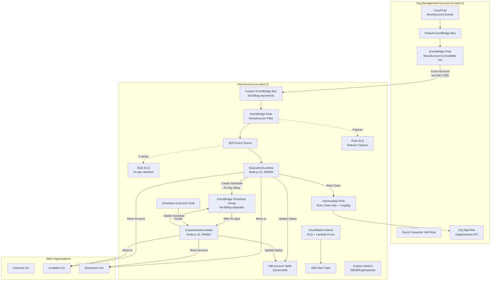
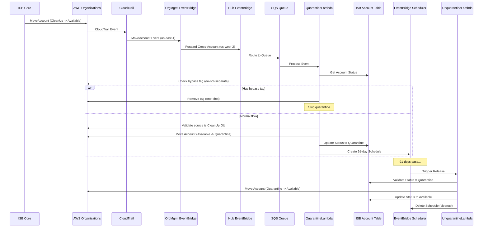

# Billing Separator

> **Last Updated**: 2026-03-02
> **Source**: [innovation-sandbox-on-aws-billing-seperator](https://github.com/co-cddo/innovation-sandbox-on-aws-billing-seperator)
> **Captured SHA**: `f8f1bdc`

## Executive Summary

The ISB Billing Separator is an explicitly temporary workaround that enforces a hard 91-day quarantine on sandbox accounts after cleanup, preventing billing attribution errors and quota exhaustion for subsequent users. It intercepts CloudTrail `MoveAccount` events via cross-account EventBridge forwarding from the Organization Management account (us-east-1) to the Hub account (us-west-2), redirecting accounts from the Available OU to a Quarantine OU. After 91 days, an EventBridge Scheduler triggers release back to Available. The entire repository is intended for archival once ISB implements native hard cooldown support (upstream issue #70).

## Architecture Overview

The system deploys as two CDK stacks across two AWS accounts. The OrgMgmtStack in the Organization Management account (us-east-1) captures CloudTrail `MoveAccount` events and forwards them cross-account. The HubStack in the Hub account (us-west-2) processes events via SQS, moves accounts to quarantine, and schedules delayed release.

### Component Architecture


```mermaid
graph TB
    subgraph "Org Management Account (us-east-1)"
        CT[CloudTrail<br/>MoveAccount Events]
        EB_DEFAULT[Default EventBridge Bus]
        EB_RULE_ORG[EventBridge Rule<br/>MoveAccount to Available OU]
        IAM_FWD[Event Forwarder IAM Role]
        IAM_ORG_MGT[Org Mgt Role<br/>Organizations API]
    end

    subgraph "Hub Account (us-west-2)"
        EB_CUSTOM[Custom EventBridge Bus<br/>isb-billing-sep-events]
        EB_RULE_HUB[EventBridge Rule<br/>MoveAccount Filter]
        SQS_Q[SQS Event Queue]
        SQS_DLQ[SQS DLQ<br/>14-day retention]
        RULE_DLQ[Rule DLQ<br/>Delivery Failures]

        Q_LAMBDA[QuarantineLambda<br/>Node.js 22, ARM64]
        UQ_LAMBDA[UnquarantineLambda<br/>Node.js 22, ARM64]

        SCHED_GROUP[EventBridge Scheduler Group<br/>isb-billing-separator]
        SCHED_ROLE[Scheduler Execution Role]

        ISB_DDB[ISB Account Table<br/>DynamoDB]
        IAM_INTER[Intermediate Role<br/>Role Chain Hub -> OrgMgt]

        SNS_ALERTS[SNS Alert Topic]
        CW_ALARMS[CloudWatch Alarms<br/>DLQ + Lambda Errors]
        CW_METRICS[Custom Metrics<br/>ISB/BillingSeparator]
    end

    subgraph "AWS Organizations"
        OU_CLEANUP[CleanUp OU]
        OU_AVAILABLE[Available OU]
        OU_QUARANTINE[Quarantine OU]
    end

    CT --> EB_DEFAULT
    EB_DEFAULT --> EB_RULE_ORG
    EB_RULE_ORG -->|Cross-Account<br/>via IAM_FWD| EB_CUSTOM
    EB_CUSTOM --> EB_RULE_HUB
    EB_RULE_HUB --> SQS_Q
    EB_RULE_HUB -.->|Failures| RULE_DLQ
    SQS_Q --> Q_LAMBDA
    SQS_Q -.->|5 retries| SQS_DLQ

    Q_LAMBDA -->|Move Account| OU_AVAILABLE
    Q_LAMBDA -->|Move to| OU_QUARANTINE
    Q_LAMBDA -->|Create Schedule<br/>91-day delay| SCHED_GROUP
    Q_LAMBDA -->|Update Status| ISB_DDB
    Q_LAMBDA -->|Role Chain| IAM_INTER --> IAM_ORG_MGT

    SCHED_GROUP -->|After 91 days| UQ_LAMBDA
    SCHED_ROLE -->|Invoke| UQ_LAMBDA
    UQ_LAMBDA -->|Move Account| OU_QUARANTINE
    UQ_LAMBDA -->|Move to| OU_AVAILABLE
    UQ_LAMBDA -->|Update Status| ISB_DDB
    UQ_LAMBDA -->|Delete Schedule| SCHED_GROUP

    CW_ALARMS --> SNS_ALERTS
```

### Event Flow


```mermaid
sequenceDiagram
    participant ISB as ISB Core
    participant Orgs as AWS Organizations
    participant CT as CloudTrail
    participant OrgEB as OrgMgmt EventBridge
    participant HubEB as Hub EventBridge
    participant SQS as SQS Queue
    participant QLambda as QuarantineLambda
    participant DDB as ISB Account Table
    participant Sched as EventBridge Scheduler
    participant UQLambda as UnquarantineLambda

    ISB->>Orgs: MoveAccount (CleanUp -> Available)
    Orgs->>CT: CloudTrail Event
    CT->>OrgEB: MoveAccount Event (us-east-1)
    OrgEB->>HubEB: Forward Cross-Account (us-west-2)
    HubEB->>SQS: Route to Queue

    SQS->>QLambda: Process Event

    QLambda->>DDB: Get Account Status
    QLambda->>Orgs: Check bypass tag (do-not-separate)

    alt Has bypass tag
        QLambda->>Orgs: Remove tag (one-shot)
        Note over QLambda: Skip quarantine
    else Normal flow
        QLambda->>Orgs: Validate source is CleanUp OU
        QLambda->>Orgs: Move Account (Available -> Quarantine)
        QLambda->>DDB: Update Status to Quarantine
        QLambda->>Sched: Create 91-day Schedule
    end

    Note over Sched: 91 days pass...

    Sched->>UQLambda: Trigger Release
    UQLambda->>DDB: Validate Status = Quarantine
    UQLambda->>Orgs: Move Account (Quarantine -> Available)
    UQLambda->>DDB: Update Status to Available
    UQLambda->>Sched: Delete Schedule (cleanup)
```

## Core Components

### OrgMgmtStack (us-east-1)

Deployed to the Organization Management account. Contains a single EventBridge rule that captures `MoveAccount` CloudTrail events where the destination is the Available OU, forwarding them cross-account to the Hub's custom event bus via an IAM role.

**Source**: `lib/org-mgmt-stack.ts`

Additionally creates a self-managed IAM role (`isb-billing-sep-org-mgt-{env}`) that grants Organizations API access (`MoveAccount`, `DescribeOrganizationalUnit`, `ListOrganizationalUnitsForParent`, `ListTagsForResource`, `UntagResource`) to the Hub account's intermediate role.

### HubStack (us-west-2)

The main compute stack containing all processing resources.

**Source**: `lib/hub-stack.ts`

| Resource | Purpose |
|----------|---------|
| Custom EventBridge Bus | Receives forwarded events from OrgMgmt |
| EventBridge Rule | Filters MoveAccount events to Available OU |
| SQS Queue + DLQ | Event buffering with 5 retries, 14-day DLQ retention |
| Rule DLQ | EventBridge rule delivery failures |
| QuarantineLambda | Intercepts and quarantines accounts (30s timeout, ARM64) |
| UnquarantineLambda | Releases accounts after 91 days (30s timeout, ARM64) |
| Scheduler Group | `isb-billing-separator` group for one-shot schedules |
| Intermediate IAM Role | Hub-side of cross-account role chain |
| SNS Alert Topic | Operational alarm notifications |
| CloudWatch Alarms | DLQ depth, Lambda errors, rule DLQ |
| CloudWatch Metric Filters | QuarantineSuccessCount, UnquarantineSuccessCount, QuarantineBypassTagCount |

### QuarantineLambda

Processes SQS events containing CloudTrail MoveAccount data. For each event:

1. Validates the account exists in ISB tracking (DynamoDB)
2. Checks idempotency (skips if already in Quarantine)
3. Validates source is CleanUp OU (fresh lookup via ISB commons `SandboxOuService`)
4. Checks for `do-not-separate` bypass tag (one-shot skip, tag consumed on use)
5. Moves account from Available to Quarantine OU via ISB's transactional move
6. Creates an EventBridge Scheduler one-shot schedule for 91-day release

Uses SQS partial batch response pattern for granular failure handling.

**Source**: `source/lambdas/quarantine/handler.ts`

### UnquarantineLambda

Triggered directly by EventBridge Scheduler after 91 days. For each invocation:

1. Validates scheduler payload via Zod schema
2. Checks account exists and is in Quarantine status
3. Moves account from Quarantine to Available OU
4. Deletes the triggering schedule (idempotent, handles ResourceNotFoundException)

**Source**: `source/lambdas/unquarantine/handler.ts`

### Quarantine Bypass

New accounts with no billing history can skip quarantine using the `do-not-separate` tag:

```bash
aws organizations tag-resource \
  --resource-id 023138541607 \
  --tags Key=do-not-separate,Value=
```

The tag is consumed on use (one-shot). If tag check fails, quarantine proceeds normally (fail-safe).

## Cross-Account Role Chain

Both Lambda functions use ISB's cross-account credential chain:

Lambda Execution Role -> Intermediate Role (Hub) -> Org Mgt Role (OrgMgmt Account)

The intermediate role is trusted by both Lambda execution roles and has permission to assume the OrgMgt role. The OrgMgt role grants Organizations API access and is trusted by the intermediate role.

**Source**: ISB commons `fromTemporaryIsbOrgManagementCredentials`

## Why 91 Days

AWS billing operates on calendar-month boundaries. A 91-day quarantine (approximately 3 full billing months) ensures:

1. **Billing attribution**: Previous user's charges fully settle before account reuse
2. **Quota recovery**: AWS service quotas reset across billing periods (upstream issue #88)
3. **Safety margin**: Covers edge cases in AWS billing data propagation

## Temporary Nature

This repository is explicitly temporary. The README states: "This entire repository should be archived and the infrastructure destroyed once ISB implements native cooldown support."

**Known limitations**:
- Race condition between MoveAccount event and quarantine interception
- ISB UI/API shows quarantined accounts as "Available"
- Two additional CDK stacks across two accounts add operational complexity
- Manual reconciliation required if solution is removed mid-quarantine

## Technology Stack

| Component | Technology |
|-----------|------------|
| Runtime | Node.js 22, TypeScript, ARM64 |
| Infrastructure | AWS CDK v2.240+ |
| ISB Integration | Git submodule (`deps/isb/`) for ISB commons |
| Build | esbuild with NodejsFunction construct |
| Testing | Jest with CDK assertions |
| Validation | Zod v4 schemas |
| Tracing | AWS X-Ray (active on both Lambdas) |
| Logging | JSON structured logging |
| CI/CD | GitHub Actions with OIDC |

## Observability

- **CloudWatch Alarms**: DLQ depth >=3, QuarantineLambda errors >=3, UnquarantineLambda errors >=3, Rule DLQ >=1
- **Custom Metrics** (ISB/BillingSeparator namespace): `QuarantineSuccessCount`, `UnquarantineSuccessCount`, `QuarantineBypassTagCount`
- **X-Ray Tracing**: Active on both Lambda functions
- **Structured Logging**: JSON with action, accountId, timestamp, and contextual details
- **SNS Alerts**: Email subscription support for operational notifications

---
*Generated from source analysis of `innovation-sandbox-on-aws-billing-seperator` at SHA `f8f1bdc`. See [00-repo-inventory.md](./00-repo-inventory.md) for full inventory. Cross-references: [10-isb-core-architecture.md](./10-isb-core-architecture.md), [22-cost-tracking.md](./22-cost-tracking.md).*
