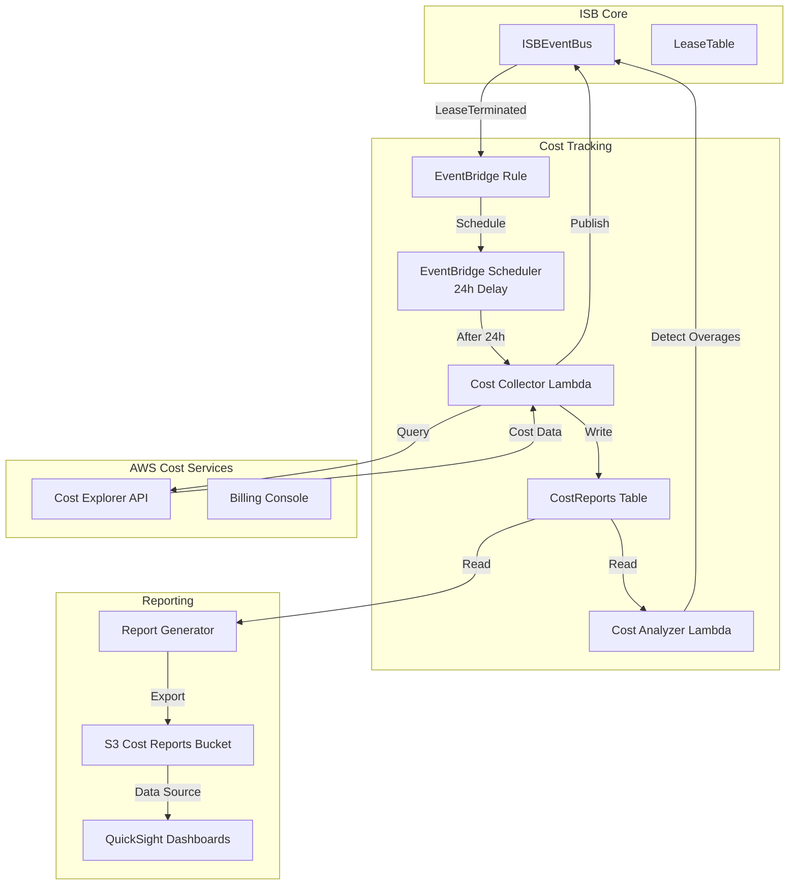
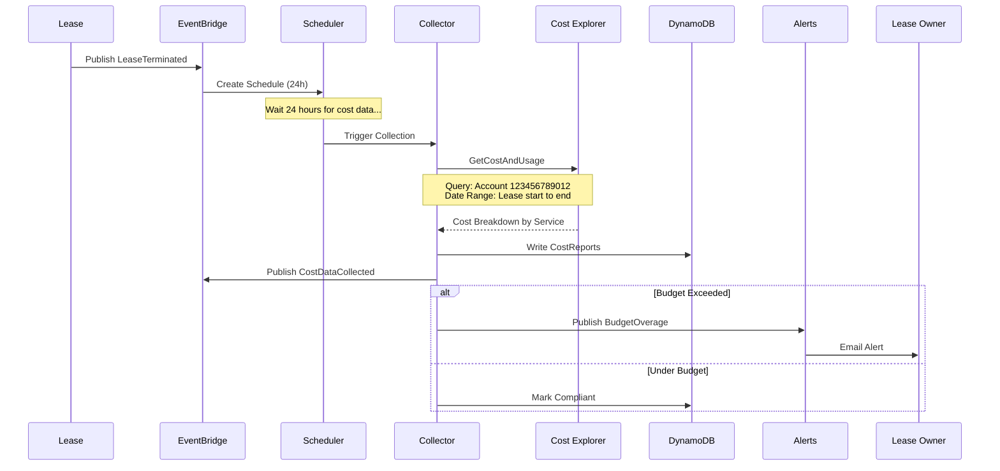

# ISB Cost Tracking System

## Executive Summary

The Cost Tracking satellite (Costs) is a Phase 4 service that collects, attributes, and reports AWS spending for leased sandbox accounts. By integrating with AWS Cost Explorer API after a 24-hour delay, it provides accurate per-lease cost breakdowns, budget compliance tracking, and chargeback reporting.

**Key Capabilities:**
- Automated cost collection 24 hours after lease termination
- Granular cost attribution by service, region, and resource
- Budget overage detection and alerting
- Chargeback reports for financial reconciliation
- Historical cost trend analysis

**Architecture:** EventBridge → Lambda (24h delay) → Cost Explorer API → DynamoDB → Reports

**Status:** Production - Phase 4 Satellite

---

## Architecture Overview

### System Context



### Event Flow



---

## Components Deep Dive

### 1. EventBridge Scheduler

**Why Scheduler vs SQS Delay Queue?**
- More precise timing (can schedule exact timestamp)
- No 15-minute minimum like SQS
- Simpler than Step Functions wait state
- Cost: $1.00 per million schedules (cheap for low volume)

**Schedule Configuration:**

```typescript
const schedule = new scheduler.CfnSchedule(this, 'CostCollectionSchedule', {
  flexibleTimeWindow: {
    mode: 'FLEXIBLE',
    maximumWindowInMinutes: 60  // Collect anytime within 1h window
  },
  scheduleExpression: 'rate(24 hours)',  // Overridden per lease
  target: {
    arn: costCollectorLambda.functionArn,
    roleArn: schedulerRole.roleArn,
    input: JSON.stringify({
      leaseId: '${lease.leaseId}',
      accountId: '${lease.accountId}',
      startDate: '${lease.createdAt}',
      endDate: '${lease.terminatedAt}'
    })
  }
});
```

**Dynamic Schedule Creation:**

```python
# In LeaseTerminated event handler
def create_collection_schedule(event):
    scheduler = boto3.client('scheduler')

    terminated_at = event['detail']['terminatedAt']
    collection_time = terminated_at + 86400  # 24 hours later

    schedule_name = f"cost-collection-{event['detail']['leaseId']}"

    scheduler.create_schedule(
        Name=schedule_name,
        ScheduleExpression=f"at({datetime.fromtimestamp(collection_time).isoformat()})",
        FlexibleTimeWindow={'Mode': 'OFF'},
        Target={
            'Arn': COST_COLLECTOR_ARN,
            'RoleArn': SCHEDULER_ROLE_ARN,
            'Input': json.dumps(event['detail'])
        },
        # Delete after execution
        ActionAfterCompletion='DELETE'
    )
```

---

### 2. Cost Collector Lambda

**Function:** `cost-tracker-collector`

**Purpose:** Query AWS Cost Explorer API and persist cost data

**Handler Logic:**

```python
import boto3
from datetime import datetime, timedelta
import json

ce = boto3.client('ce')
dynamodb = boto3.client('dynamodb')
events = boto3.client('events')

def lambda_handler(event, context):
    """
    Collect cost data for a terminated lease.
    Called 24 hours after lease termination to allow billing data to propagate.
    """

    lease_id = event['leaseId']
    account_id = event['accountId']
    start_date = event['startDate']  # Epoch timestamp
    end_date = event['terminatedAt']

    # Convert to date strings for Cost Explorer
    start = datetime.fromtimestamp(start_date).strftime('%Y-%m-%d')
    end = datetime.fromtimestamp(end_date).strftime('%Y-%m-%d')

    print(f"Collecting costs for lease {lease_id}, account {account_id}")
    print(f"Date range: {start} to {end}")

    # Query Cost Explorer with account filter
    cost_data = query_cost_explorer(account_id, start, end)

    # Calculate totals and breakdowns
    analysis = analyze_costs(cost_data, event)

    # Write to DynamoDB
    persist_cost_data(lease_id, account_id, analysis)

    # Publish event
    publish_cost_event(lease_id, analysis)

    # Check budget compliance
    if analysis['totalCost'] > event.get('budget', float('inf')):
        publish_overage_alert(lease_id, analysis)

    return {
        'statusCode': 200,
        'leaseId': lease_id,
        'totalCost': analysis['totalCost'],
        'overBudget': analysis['overBudget']
    }

def query_cost_explorer(account_id, start_date, end_date):
    """
    Query AWS Cost Explorer API for account-specific costs.
    """

    response = ce.get_cost_and_usage(
        TimePeriod={
            'Start': start_date,
            'End': end_date
        },
        Granularity='DAILY',
        Metrics=['UnblendedCost', 'UsageQuantity'],
        GroupBy=[
            {'Type': 'DIMENSION', 'Key': 'SERVICE'},
            {'Type': 'DIMENSION', 'Key': 'REGION'}
        ],
        Filter={
            'Dimensions': {
                'Key': 'LINKED_ACCOUNT',
                'Values': [account_id]
            }
        }
    )

    return response

def analyze_costs(cost_data, lease_context):
    """
    Parse Cost Explorer response and calculate breakdowns.
    """

    total_cost = 0.0
    daily_costs = []
    service_breakdown = {}
    region_breakdown = {}

    for day in cost_data['ResultsByTime']:
        date = day['TimePeriod']['Start']
        day_total = 0.0

        for group in day['Groups']:
            service = group['Keys'][0]
            region = group['Keys'][1]
            amount = float(group['Metrics']['UnblendedCost']['Amount'])

            day_total += amount
            total_cost += amount

            # Aggregate by service
            service_breakdown[service] = service_breakdown.get(service, 0.0) + amount

            # Aggregate by region
            region_breakdown[region] = region_breakdown.get(region, 0.0) + amount

        daily_costs.append({
            'date': date,
            'cost': round(day_total, 2)
        })

    # Sort breakdowns by cost
    top_services = sorted(service_breakdown.items(), key=lambda x: x[1], reverse=True)[:10]
    top_regions = sorted(region_breakdown.items(), key=lambda x: x[1], reverse=True)[:5]

    # Calculate cost per day
    duration_days = len(daily_costs)
    cost_per_day = total_cost / duration_days if duration_days > 0 else 0.0

    return {
        'leaseId': lease_context['leaseId'],
        'accountId': lease_context['accountId'],
        'totalCost': round(total_cost, 2),
        'budget': lease_context.get('budget', 0),
        'overBudget': total_cost > lease_context.get('budget', float('inf')),
        'variance': round(total_cost - lease_context.get('budget', 0), 2),
        'variancePercent': round((total_cost / lease_context.get('budget', 1) - 1) * 100, 1),
        'duration': duration_days,
        'costPerDay': round(cost_per_day, 2),
        'dailyCosts': daily_costs,
        'topServices': [{'service': s, 'cost': round(c, 2)} for s, c in top_services],
        'topRegions': [{'region': r, 'cost': round(c, 2)} for r, c in top_regions],
        'collectedAt': int(datetime.utcnow().timestamp())
    }

def persist_cost_data(lease_id, account_id, analysis):
    """
    Write cost analysis to DynamoDB.
    """

    dynamodb.put_item(
        TableName='CostReports',
        Item={
            'leaseId': {'S': lease_id},
            'accountId': {'S': account_id},
            'totalCost': {'N': str(analysis['totalCost'])},
            'budget': {'N': str(analysis['budget'])},
            'overBudget': {'BOOL': analysis['overBudget']},
            'variance': {'N': str(analysis['variance'])},
            'variancePercent': {'N': str(analysis['variancePercent'])},
            'duration': {'N': str(analysis['duration'])},
            'costPerDay': {'N': str(analysis['costPerDay'])},
            'dailyCosts': {'S': json.dumps(analysis['dailyCosts'])},
            'topServices': {'S': json.dumps(analysis['topServices'])},
            'topRegions': {'S': json.dumps(analysis['topRegions'])},
            'collectedAt': {'N': str(analysis['collectedAt'])},
            'dataSource': {'S': 'AWS_COST_EXPLORER'}
        }
    )

def publish_cost_event(lease_id, analysis):
    """
    Publish CostDataCollected event to ISBEventBus.
    """

    events.put_events(
        Entries=[
            {
                'Source': 'isb.costs',
                'DetailType': 'CostDataCollected',
                'Detail': json.dumps({
                    'leaseId': lease_id,
                    'totalCost': analysis['totalCost'],
                    'budget': analysis['budget'],
                    'overBudget': analysis['overBudget']
                }),
                'EventBusName': EVENT_BUS_NAME
            }
        ]
    )

def publish_overage_alert(lease_id, analysis):
    """
    Publish BudgetOverage event for alerting.
    """

    events.put_events(
        Entries=[
            {
                'Source': 'isb.costs',
                'DetailType': 'BudgetOverage',
                'Detail': json.dumps({
                    'leaseId': lease_id,
                    'accountId': analysis['accountId'],
                    'totalCost': analysis['totalCost'],
                    'budget': analysis['budget'],
                    'variance': analysis['variance'],
                    'variancePercent': analysis['variancePercent']
                }),
                'EventBusName': EVENT_BUS_NAME
            }
        ]
    )
```

**Configuration:**

| Parameter | Value |
|-----------|-------|
| Runtime | Python 3.12 |
| Memory | 512 MB |
| Timeout | 300 seconds (Cost Explorer can be slow) |
| Reserved Concurrency | 10 |
| Environment Variables | `EVENT_BUS_NAME`, `COST_TABLE_NAME` |

**IAM Permissions:**
- `ce:GetCostAndUsage` (Cost Explorer read)
- `dynamodb:PutItem` on CostReports table
- `events:PutEvents` on ISBEventBus
- `logs:CreateLogGroup`, `logs:CreateLogStream`, `logs:PutLogEvents`

**Error Handling:**
- Retry Cost Explorer calls up to 3 times (exponential backoff)
- If Cost Explorer unavailable, publish `CostCollectionFailed` event
- Dead letter queue for permanent failures
- Manual retry via Step Functions (initiated by ops team)

---

### 3. DynamoDB Schema: CostReports

```typescript
{
  leaseId: string,                    // Partition Key
  accountId: string,                  // GSI Partition Key
  collectedAt: number,                // Sort Key (epoch timestamp)

  // Cost Summary
  totalCost: number,                  // GBP
  budget: number,                     // Allocated budget
  overBudget: boolean,
  variance: number,                   // totalCost - budget
  variancePercent: number,            // (variance / budget) * 100

  // Temporal Data
  duration: number,                   // Lease duration in days
  costPerDay: number,                 // Average daily spend
  dailyCosts: string,                 // JSON array: [{date, cost}]

  // Breakdowns
  topServices: string,                // JSON: [{service, cost}] top 10
  topRegions: string,                 // JSON: [{region, cost}] top 5

  // Metadata
  dataSource: 'AWS_COST_EXPLORER' | 'ESTIMATED',
  ownerId: string,                    // User who owned lease
  orgUnit: string,                    // Organizational unit
  tags: Record<string, string>,       // Cost allocation tags

  // Chargeback
  chargebackGenerated: boolean,
  chargebackAmount: number,
  chargebackDate?: number
}
```

**GSI Indexes:**

1. **CostsByAccount**
   - Partition Key: `accountId`
   - Sort Key: `collectedAt`
   - Purpose: Query all costs for a specific account

2. **CostsByOwner**
   - Partition Key: `ownerId`
   - Sort Key: `collectedAt`
   - Purpose: User-specific cost history

3. **OverBudgetLeases**
   - Partition Key: `overBudget`
   - Sort Key: `variancePercent` (descending)
   - Purpose: Identify worst budget overages

**Retention:** Indefinite (business intelligence requirement)

**Backup:** Daily automated backups, cross-region replication to eu-west-1

---

### 4. Cost Analyzer Lambda

**Function:** `cost-tracker-analyzer`

**Purpose:** Detect spending anomalies and trends

**Analysis Types:**

1. **Overage Detection**
   - Flag leases exceeding budget by > 10%
   - Publish alerts for overages > 50%

2. **Service Anomalies**
   - Identify unusual service spend (e.g., $500 on NAT Gateway for dev lease)
   - Compare to peer leases with similar templates

3. **Cost Trends**
   - Calculate user's average spend over last 5 leases
   - Detect 3+ consecutive increases

4. **Optimization Opportunities**
   - Identify leases with high EC2 costs but low utilization (from CloudWatch)
   - Suggest Savings Plans or Reserved Instances

**Handler Logic:**

```python
def analyze_lease_costs(lease_id):
    """
    Perform multi-dimensional cost analysis.
    """

    # Fetch cost report
    report = dynamodb.get_item(
        TableName='CostReports',
        Key={'leaseId': {'S': lease_id}}
    )

    cost_data = report['Item']

    # Analysis 1: Budget compliance
    budget_analysis = analyze_budget_compliance(cost_data)

    # Analysis 2: Service-level anomalies
    service_analysis = analyze_service_costs(cost_data)

    # Analysis 3: Historical trends
    trend_analysis = analyze_user_trends(cost_data['ownerId'])

    # Analysis 4: Optimization opportunities
    optimization = identify_savings_opportunities(cost_data)

    # Combine results
    full_analysis = {
        'leaseId': lease_id,
        'budgetCompliance': budget_analysis,
        'serviceAnomalies': service_analysis,
        'trends': trend_analysis,
        'optimizations': optimization,
        'analyzedAt': int(datetime.utcnow().timestamp())
    }

    # Write to DynamoDB
    dynamodb.put_item(
        TableName='CostAnalysis',
        Item=full_analysis
    )

    # Publish insights event
    if service_analysis['anomaliesDetected'] > 0:
        publish_anomaly_alert(full_analysis)

    return full_analysis

def analyze_service_costs(cost_data):
    """
    Detect abnormal service spending.
    """

    services = json.loads(cost_data['topServices'])
    anomalies = []

    for svc in services:
        # Get historical avg for this service
        avg_cost = get_avg_service_cost(svc['service'])

        if svc['cost'] > avg_cost * 2:  # 2x above average
            anomalies.append({
                'service': svc['service'],
                'cost': svc['cost'],
                'expected': avg_cost,
                'deviation': round(svc['cost'] / avg_cost, 2)
            })

    return {
        'anomaliesDetected': len(anomalies),
        'anomalies': anomalies
    }
```

---

## Reporting & Dashboards

### Report Types

**1. Chargeback Report (CSV)**

Generated monthly for finance team.

```csv
OrgUnit,OwnerEmail,LeaseID,AccountID,StartDate,EndDate,Duration,Budget,ActualCost,Variance
Innovation,user1@gov.uk,lease-001,123456789012,2024-01-01,2024-01-31,30,£1000,£856.34,-£143.66
Innovation,user2@gov.uk,lease-002,123456789013,2024-01-05,2024-01-20,15,£500,£623.12,+£123.12
Digital,user3@gov.uk,lease-003,123456789014,2024-01-10,2024-02-10,31,£2000,£1923.45,-£76.55
```

**Generation Logic:**

```python
def generate_monthly_chargeback(year, month):
    """
    Export all lease costs for given month to CSV.
    """

    # Query DynamoDB for leases in date range
    start_ts = int(datetime(year, month, 1).timestamp())
    end_ts = int(datetime(year, month + 1, 1).timestamp())

    response = dynamodb.scan(
        TableName='CostReports',
        FilterExpression='collectedAt BETWEEN :start AND :end',
        ExpressionAttributeValues={
            ':start': {'N': str(start_ts)},
            ':end': {'N': str(end_ts)}
        }
    )

    # Convert to CSV
    csv_data = ['OrgUnit,OwnerEmail,LeaseID,AccountID,StartDate,EndDate,Duration,Budget,ActualCost,Variance']

    for item in response['Items']:
        row = [
            item['orgUnit']['S'],
            item['ownerId']['S'],
            item['leaseId']['S'],
            item['accountId']['S'],
            format_date(item['startDate']),
            format_date(item['endDate']),
            item['duration']['N'],
            f"£{item['budget']['N']}",
            f"£{item['totalCost']['N']}",
            f"£{item['variance']['N']}"
        ]
        csv_data.append(','.join(row))

    # Upload to S3
    s3 = boto3.client('s3')
    s3.put_object(
        Bucket=REPORTS_BUCKET,
        Key=f'chargeback/{year}/{month:02d}/chargeback-report.csv',
        Body='\n'.join(csv_data),
        ContentType='text/csv'
    )

    return f's3://{REPORTS_BUCKET}/chargeback/{year}/{month:02d}/chargeback-report.csv'
```

**2. QuickSight Dashboards**

**Dashboard 1: Executive Summary**
```
┌─────────────────────────────────────────────────────────────┐
│ ISB Costs - Monthly Overview (January 2024)                 │
├─────────────────────────────────────────────────────────────┤
│ Total Spend: £45,234.56                                     │
│ Total Budget: £50,000.00                                    │
│ Utilization: 90.5%                                          │
│ Leases: 147 (142 under budget, 5 over budget)              │
└─────────────────────────────────────────────────────────────┘

┌─────────────────────────────────────────────────────────────┐
│ Top 5 Cost Drivers (Services)                               │
│                                                              │
│ 1. EC2                 £18,234.12  (40.3%)                  │
│ 2. S3                  £8,923.45   (19.7%)                  │
│ 3. RDS                 £6,543.21   (14.5%)                  │
│ 4. Lambda              £3,234.56   (7.1%)                   │
│ 5. VPC (NAT Gateway)   £2,987.33   (6.6%)                   │
└─────────────────────────────────────────────────────────────┘

┌─────────────────────────────────────────────────────────────┐
│ Cost Trend (Last 6 Months)                                   │
│                                                              │
│ £50K ┤                                             ●         │
│ £40K ┤                               ●         ●             │
│ £30K ┤               ●         ●                             │
│ £20K ┤     ●     ●                                           │
│ £10K ┤ ●                                                     │
│      └─────────────────────────────────────────────          │
│      Aug  Sep  Oct  Nov  Dec  Jan                           │
└─────────────────────────────────────────────────────────────┘
```

**Dashboard 2: Organizational Unit Breakdown**

```
┌─────────────────────────────────────────────────────────────┐
│ Cost by Organizational Unit (January 2024)                  │
├──────────────────────┬──────────────┬───────────┬──────────┤
│ Org Unit             │ Leases       │ Spend     │ Budget   │
├──────────────────────┼──────────────┼───────────┼──────────┤
│ Innovation           │ 45           │ £18,234   │ £20,000  │
│ Digital Services     │ 38           │ £15,432   │ £15,000  │
│ Data & Analytics     │ 32           │ £9,876    │ £10,000  │
│ Security             │ 22           │ £1,234    │ £3,000   │
│ Infrastructure       │ 10           │ £458      │ £2,000   │
└──────────────────────┴──────────────┴───────────┴──────────┘
```

**Dashboard 3: Overage Analysis**

```
┌─────────────────────────────────────────────────────────────┐
│ Budget Overages (Worst Offenders)                           │
├─────────┬──────────┬─────────┬────────────┬────────────────┤
│ Lease   │ Owner    │ Budget  │ Actual     │ Variance       │
├─────────┼──────────┼─────────┼────────────┼────────────────┤
│ lease-A │ user1    │ £500    │ £1,234.56  │ +£734 (+147%)  │
│ lease-B │ user2    │ £1,000  │ £1,876.34  │ +£876 (+88%)   │
│ lease-C │ user3    │ £2,000  │ £2,543.21  │ +£543 (+27%)   │
└─────────┴──────────┴─────────┴────────────┴────────────────┘

Root Causes:
- lease-A: Accidentally left RDS instance running 24/7
- lease-B: Large S3 data ingestion (10TB)
- lease-C: High EC2 instance types (m5.8xlarge × 5)
```

**QuickSight Data Source:**
- DynamoDB connector (direct query)
- Refresh: Every 1 hour
- SPICE dataset for performance (refresh daily)

---

## Integration Points

### ISB Core
- **Inbound:** `LeaseTerminated` event
- **Outbound:** `CostDataCollected`, `BudgetOverage` events
- **API Calls:** Read LeaseTable for enrichment (owner, org unit, tags)

### Billing Separator
- **Dependency:** Billing Separator reads CostReports to verify data availability
- **Contract:** CostReports must have `finalCost` populated within 72 hours

### Approver System
- **Integration:** Approver queries CostReports for user's spending history
- **Usage:** Rule 2 (Cost Overrun History), Rule 14 (Cost Trend Analysis)

### Finance Systems (External)
- **Method:** CSV exports to shared S3 bucket
- **Schedule:** Monthly on 1st of month (for previous month)
- **Format:** Standardized chargeback CSV
- **Encryption:** SSE-KMS with finance team's CMK

---

## Cost Explorer API Usage

### Query Optimization

**Cost Explorer Quotas:**
- 100 requests per hour (strict limit)
- Throttling at 5 TPS (transactions per second)

**Optimization Strategies:**

1. **Batch Processing**
   - Collect costs for multiple leases in single API call (if same date range)
   - Use `Filter` with multiple account IDs

2. **Caching**
   - Cache Cost Explorer results in DynamoDB (already done)
   - Never re-query for same lease/date range

3. **Rate Limiting**
   - Lambda reserved concurrency = 10 (prevents throttling)
   - Exponential backoff on `ThrottlingException`

4. **Date Range Alignment**
   - Round lease dates to midnight UTC (aligns with CE granularity)
   - Avoid querying partial days

**Example Optimized Query:**

```python
def query_cost_explorer_batch(account_ids, start_date, end_date):
    """
    Query costs for multiple accounts in single API call.
    """

    response = ce.get_cost_and_usage(
        TimePeriod={
            'Start': start_date,
            'End': end_date
        },
        Granularity='DAILY',
        Metrics=['UnblendedCost'],
        GroupBy=[
            {'Type': 'DIMENSION', 'Key': 'LINKED_ACCOUNT'},
            {'Type': 'DIMENSION', 'Key': 'SERVICE'}
        ],
        Filter={
            'Dimensions': {
                'Key': 'LINKED_ACCOUNT',
                'Values': account_ids  # Up to 100 accounts
            }
        }
    )

    # Parse response and split by account
    costs_by_account = {}
    for result in response['ResultsByTime']:
        for group in result['Groups']:
            account_id = group['Keys'][0]
            # ... (rest of parsing logic)

    return costs_by_account
```

---

## Monitoring & Observability

### CloudWatch Metrics

| Metric | Description | Alarm Threshold |
|--------|-------------|----------------|
| `CostCollectionSuccessRate` | % successful collections | < 95% |
| `CostExplorerLatency` | API response time | > 30s |
| `CostExplorerThrottles` | Throttling exceptions | > 5/hour |
| `OverBudgetLeaseCount` | Leases exceeding budget | > 10/day |
| `AverageCostPerLease` | Mean spend per lease | Informational |

### CloudWatch Dashboards

```
┌─────────────────────────────────────────────────────────┐
│ Cost Tracking System Health                             │
│                                                          │
│ Collections Today: 47                                   │
│ Success Rate: 100% (47/47)                              │
│ Avg Collection Time: 8.3s                               │
│ Cost Explorer API Calls: 52/100 (52% quota used)       │
└─────────────────────────────────────────────────────────┘

┌─────────────────────────────────────────────────────────┐
│ Budget Compliance (Today)                                │
│                                                          │
│ Under Budget: 42 (89%)                                  │
│ Over Budget: 5 (11%)                                    │
│                                                          │
│ Largest Overage: £734.56 (lease-xyz, +147%)            │
└─────────────────────────────────────────────────────────┘
```

### Alerts

**SNS Topic:** `cost-tracking-alerts`

**Alert Types:**

1. **Budget Overage Alert (to user)**
   ```
   Subject: Budget Overage - Lease lease-abc123
   Body:
   Your lease has exceeded its budget:
   - Lease ID: lease-abc123
   - Account: 123456789012
   - Budget: £1,000.00
   - Actual Cost: £1,234.56
   - Overage: +£234.56 (+23.5%)

   Top cost drivers:
   1. EC2: £567.89
   2. S3: £345.67
   3. RDS: £234.56

   Please review your resource usage.
   ```

2. **Collection Failure Alert (to ops)**
   ```
   Subject: Cost Collection Failed - lease-abc123
   Body:
   Failed to collect cost data after 3 retries.
   Error: ThrottlingException from Cost Explorer API

   Action Required: Manually retry or investigate quota issues.
   ```

---

## Issues & Recommendations

### Current Issues

1. **24-Hour Delay Insufficient for 100% Coverage**
   - ~85% of cost data available at 24h
   - 15% of leases require 48-72h for complete data
   - **Fix:** Implement progressive collection (24h, 48h, 72h checks)

2. **No Real-Time Cost Tracking**
   - Users unaware of spending until lease ends
   - No proactive alerts during active lease
   - **Fix:** Implement daily cost checks for active leases (with real-time CloudWatch metrics)

3. **Cost Explorer API Quota Constraints**
   - 100 requests/hour limit can bottleneck at scale
   - **Fix:** Batch queries, implement queueing system for high volume

4. **No Cost Forecasting**
   - Cannot predict final cost based on current trajectory
   - **Fix:** Add ML model to forecast costs at 25%, 50%, 75% of lease duration

5. **Limited Granularity**
   - Daily granularity misses hourly spikes
   - Cannot attribute costs to specific resources
   - **Fix:** Integrate CloudWatch Contributor Insights for resource-level costs

### Architectural Recommendations

1. **Real-Time Cost Streaming**
   - Ingest CloudWatch Logs for Lambda invocations, EC2 hours, S3 requests
   - Calculate estimated costs in real-time
   - Alert users when 50%, 75%, 90% of budget consumed

2. **Cost Optimization Recommendations**
   - Analyze underutilized resources (e.g., EC2 with < 10% CPU)
   - Suggest rightsizing or deletion
   - Integration with AWS Compute Optimizer

3. **Predictive Budgeting**
   - Train ML model on historical lease costs
   - Suggest budget amounts when creating lease
   - Warn if budget is unrealistic for requested duration

4. **Chargeback Automation**
   - Integrate with finance ERP system (API)
   - Automatic journal entries for cost allocation
   - Eliminate manual CSV export

5. **Cost Anomaly Detection (AWS Native)**
   - Use AWS Cost Anomaly Detection service
   - Receive alerts for unusual spending patterns
   - Integration with ISB event bus

---

## Security Considerations

### IAM Permissions

**Cost Collector Lambda Role:**
```json
{
  "Version": "2012-10-17",
  "Statement": [
    {
      "Effect": "Allow",
      "Action": "ce:GetCostAndUsage",
      "Resource": "*",
      "Condition": {
        "DateGreaterThan": {
          "ce:TimePeriodStart": "2024-01-01"
        }
      }
    },
    {
      "Effect": "Allow",
      "Action": ["dynamodb:PutItem", "dynamodb:GetItem"],
      "Resource": "arn:aws:dynamodb:*:*:table/CostReports"
    }
  ]
}
```

**Least Privilege:**
- No write access to LeaseTable (read-only for enrichment)
- Cannot modify billing settings
- Scoped to specific DynamoDB tables

### Data Privacy

**PII Handling:**
- Cost data does not contain PII
- Owner ID is UUID (not email)
- Email addresses retrieved from Identity Center only for notifications

**Data Retention:**
- Cost reports retained indefinitely (business intelligence)
- Consider anonymization after 3 years for GDPR compliance

---

## Testing Strategy

### Unit Tests

```python
def test_query_cost_explorer():
    # Mock Cost Explorer response
    mock_response = {
        'ResultsByTime': [
            {
                'TimePeriod': {'Start': '2024-01-01'},
                'Groups': [
                    {
                        'Keys': ['EC2', 'eu-west-2'],
                        'Metrics': {'UnblendedCost': {'Amount': '123.45'}}
                    }
                ]
            }
        ]
    }

    with patch('boto3.client') as mock_ce:
        mock_ce.return_value.get_cost_and_usage.return_value = mock_response

        result = query_cost_explorer('123456789012', '2024-01-01', '2024-01-31')

        assert result is not None
        assert 'ResultsByTime' in result

def test_analyze_costs():
    cost_data = {
        'ResultsByTime': [
            {'Groups': [{'Keys': ['EC2', 'eu-west-2'], 'Metrics': {'UnblendedCost': {'Amount': '100.00'}}}]}
        ]
    }

    analysis = analyze_costs(cost_data, {'leaseId': 'test', 'budget': 150})

    assert analysis['totalCost'] == 100.0
    assert analysis['overBudget'] == False
    assert analysis['variance'] == -50.0
```

### Integration Tests

```python
def test_end_to_end_cost_collection():
    # Create test lease
    lease_id = 'test-lease-' + str(uuid.uuid4())

    # Publish LeaseTerminated event
    events.put_events(
        Entries=[{
            'Source': 'isb.leases',
            'DetailType': 'LeaseTerminated',
            'Detail': json.dumps({
                'leaseId': lease_id,
                'accountId': '123456789012',
                'startDate': int((datetime.utcnow() - timedelta(days=30)).timestamp()),
                'terminatedAt': int(datetime.utcnow().timestamp()),
                'budget': 1000
            })
        }]
    )

    # Wait 24 hours (simulated by changing schedule time)
    scheduler.update_schedule(
        Name=f'cost-collection-{lease_id}',
        ScheduleExpression='at(2024-01-01T00:00:00)'  # Immediate trigger
    )

    # Wait for Lambda execution
    time.sleep(30)

    # Verify cost report created
    response = dynamodb.get_item(
        TableName='CostReports',
        Key={'leaseId': {'S': lease_id}}
    )

    assert 'Item' in response
    assert float(response['Item']['totalCost']['N']) > 0
```

---

## Cost Analysis

### Monthly Estimate (1000 leases/month)

| Service | Usage | Cost |
|---------|-------|------|
| EventBridge Scheduler | 1000 schedules | £1.00 |
| Lambda | 1000 × 60s × 512MB | £3.00 |
| Cost Explorer API | 1000 requests | £10.00 |
| DynamoDB | 10K writes + 50K reads | £6.50 |
| S3 (reports) | 100MB storage + transfers | £0.50 |
| CloudWatch Logs | 5GB/month | £2.50 |
| **Total** | | **£23.50/month** |

**Per-Lease Cost:** £0.02

**Note:** Cost Explorer API is most expensive component ($0.01/request)

---

## References

- **Repository:** ndx-aws-isb-satellites/costs (Phase 4)
- **Related Docs:**
  - [10-isb-core-architecture.md](10-isb-core-architecture.md)
  - [21-billing-separator.md](21-billing-separator.md)
- **AWS Services:** Cost Explorer, EventBridge Scheduler, Lambda, DynamoDB, QuickSight
- **Contact:** ISB Cost Tracking Team

---

**Document Version:** 1.0
**Last Updated:** 2024-01-01
**Status:** Production System
