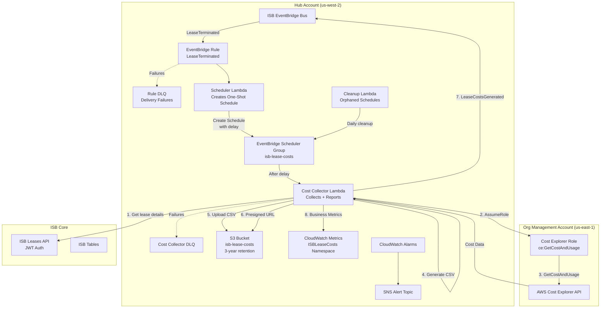
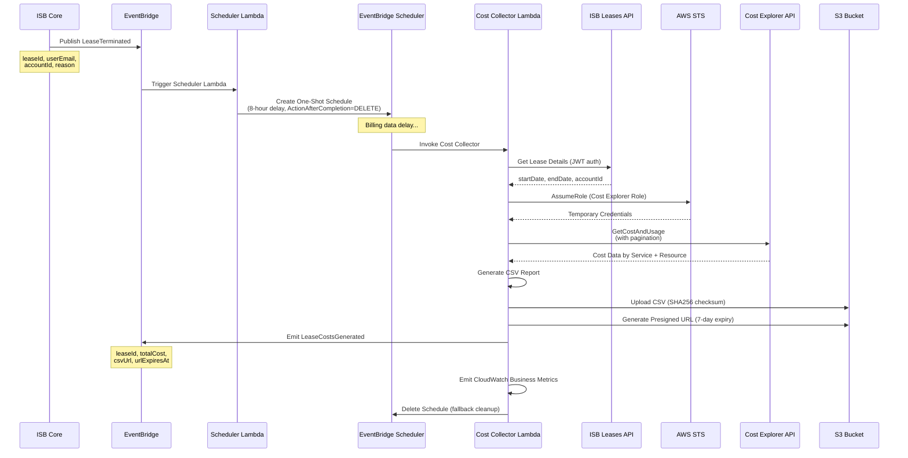

# Cost Tracking

> **Last Updated**: 2026-03-02
> **Source**: [innovation-sandbox-on-aws-costs](https://github.com/co-cddo/innovation-sandbox-on-aws-costs)
> **Captured SHA**: `cf659bb`

## Executive Summary

The ISB Cost Tracking service automatically collects billing data when Innovation Sandbox leases terminate, generating per-lease CSV cost reports stored in S3 with presigned download URLs. It operates as an event-driven satellite that listens for `LeaseTerminated` events, delays collection by a configurable window (default 8 hours with padding up to 168 hours) to allow AWS billing data to settle, then queries Cost Explorer cross-account in the Organization Management account and emits `LeaseCostsGenerated` events for downstream consumers.

## Architecture Overview

The system uses a two-Lambda pipeline: a Scheduler Lambda creates one-shot EventBridge Scheduler entries on lease termination, and a Cost Collector Lambda executes the actual cost collection after the delay. Both deploy to the Hub account (us-west-2) via CDK, with a separate role stack deployed to the Organization Management account for cross-account Cost Explorer access.

### Component Architecture


```mermaid
graph TB
    subgraph "Hub Account (us-west-2)"
        ISB_EB[ISB EventBridge Bus]
        EB_RULE[EventBridge Rule<br/>LeaseTerminated]
        RULE_DLQ[Rule DLQ<br/>Delivery Failures]

        SCHED_FN[Scheduler Lambda<br/>Creates One-Shot Schedule]
        SCHED_GROUP[EventBridge Scheduler Group<br/>isb-lease-costs]

        COLLECTOR_FN[Cost Collector Lambda<br/>Collects + Reports]
        COLLECTOR_DLQ[Cost Collector DLQ]

        CLEANUP_FN[Cleanup Lambda<br/>Orphaned Schedules]

        S3_BUCKET[S3 Bucket<br/>isb-lease-costs<br/>3-year retention]

        CW_METRICS[CloudWatch Metrics<br/>ISBLeaseCosts Namespace]
        CW_ALARMS[CloudWatch Alarms]
        SNS_ALERTS[SNS Alert Topic]
    end

    subgraph "Org Management Account (us-east-1)"
        CE_ROLE[Cost Explorer Role<br/>ce:GetCostAndUsage]
        CE_API[AWS Cost Explorer API]
    end

    subgraph "ISB Core"
        ISB_API[ISB Leases API<br/>JWT Auth]
        ISB_DDB[ISB Tables]
    end

    ISB_EB -->|LeaseTerminated| EB_RULE
    EB_RULE --> SCHED_FN
    EB_RULE -.->|Failures| RULE_DLQ

    SCHED_FN -->|Create Schedule<br/>with delay| SCHED_GROUP

    SCHED_GROUP -->|After delay| COLLECTOR_FN
    COLLECTOR_FN -.->|Failures| COLLECTOR_DLQ

    COLLECTOR_FN -->|1. Get lease details| ISB_API
    COLLECTOR_FN -->|2. AssumeRole| CE_ROLE
    CE_ROLE -->|3. GetCostAndUsage| CE_API
    CE_API -->|Cost Data| COLLECTOR_FN
    COLLECTOR_FN -->|4. Generate CSV| COLLECTOR_FN
    COLLECTOR_FN -->|5. Upload CSV| S3_BUCKET
    COLLECTOR_FN -->|6. Presigned URL| S3_BUCKET
    COLLECTOR_FN -->|7. LeaseCostsGenerated| ISB_EB
    COLLECTOR_FN -->|8. Business Metrics| CW_METRICS

    CLEANUP_FN -->|Daily cleanup| SCHED_GROUP
    CW_ALARMS --> SNS_ALERTS
```

### Event Flow


```mermaid
sequenceDiagram
    participant ISB as ISB Core
    participant EB as EventBridge
    participant SchedFn as Scheduler Lambda
    participant Sched as EventBridge Scheduler
    participant Collector as Cost Collector Lambda
    participant API as ISB Leases API
    participant STS as AWS STS
    participant CE as Cost Explorer API
    participant S3 as S3 Bucket

    ISB->>EB: Publish LeaseTerminated
    Note over ISB: leaseId, userEmail,<br/>accountId, reason

    EB->>SchedFn: Trigger Scheduler Lambda
    SchedFn->>Sched: Create One-Shot Schedule<br/>(8-hour delay, ActionAfterCompletion=DELETE)

    Note over Sched: Billing data delay...

    Sched->>Collector: Invoke Cost Collector
    Collector->>API: Get Lease Details (JWT auth)
    API-->>Collector: startDate, endDate, accountId

    Collector->>STS: AssumeRole (Cost Explorer Role)
    STS-->>Collector: Temporary Credentials

    Collector->>CE: GetCostAndUsage<br/>(with pagination)
    CE-->>Collector: Cost Data by Service + Resource

    Collector->>Collector: Generate CSV Report
    Collector->>S3: Upload CSV (SHA256 checksum)
    Collector->>S3: Generate Presigned URL (7-day expiry)

    Collector->>EB: Emit LeaseCostsGenerated
    Note over EB: leaseId, totalCost,<br/>csvUrl, urlExpiresAt

    Collector->>Collector: Emit CloudWatch Business Metrics
    Collector->>Sched: Delete Schedule (fallback cleanup)
```

## Core Components

### Scheduler Lambda

Triggered by `LeaseTerminated` events on the ISB EventBridge bus. Creates a one-shot EventBridge Scheduler entry with a configurable delay (default 8 hours, controlled by `BILLING_PADDING_HOURS`). The schedule is configured with `ActionAfterCompletion=DELETE` for automatic cleanup.

**Source**: `src/lambdas/scheduler-handler.ts`

### Cost Collector Lambda

The main processing function, triggered by EventBridge Scheduler after the billing delay. Executes a 10-step pipeline:

1. **Validate Payload**: Zod schema validation of scheduler payload
2. **Get Lease Details**: ISB API call with JWT authentication
3. **Assume Role**: Cross-account STS AssumeRole for Cost Explorer access
4. **Calculate Billing Window**: Lease start/end with configurable padding
5. **Query Cost Explorer**: `GetCostAndUsage` with pagination, grouped by SERVICE and resource
6. **Generate CSV**: Structured cost report with service-level breakdown
7. **Upload to S3**: With SHA256 checksum verification
8. **Generate Presigned URL**: 7-day valid download link
9. **Emit Event**: `LeaseCostsGenerated` to ISB EventBridge bus
10. **Emit Metrics**: Custom CloudWatch business metrics (TotalCost, ResourceCount, ProcessingDuration)

**Source**: `src/lambdas/cost-collector-handler.ts`

### Cleanup Lambda

Daily maintenance function that identifies and removes orphaned schedules in the scheduler group. Handles edge cases where schedule auto-deletion fails.

**Source**: `src/lambdas/cleanup-handler.ts`

### Supporting Libraries

| Module | Purpose | Source |
|--------|---------|--------|
| `cost-explorer.ts` | Cost Explorer query with pagination | `src/lib/cost-explorer.ts` |
| `csv-generator.ts` | CSV report generation | `src/report-generator.ts` |
| `s3-uploader.ts` | S3 upload with checksum + presigned URLs | `src/lib/s3-uploader.ts` |
| `event-emitter.ts` | EventBridge event emission | `src/lib/event-emitter.ts` |
| `assume-role.ts` | Cross-account STS role assumption | `src/lib/assume-role.ts` |
| `isb-api-client.ts` | ISB API calls with JWT auth | `src/lib/isb-api-client.ts` |
| `date-utils.ts` | Billing window calculation | `src/lib/date-utils.ts` |
| `schemas.ts` | Zod schemas for validation | `src/lib/schemas.ts` |

## Event Schemas

### Input: LeaseTerminated

```json
{
  "detail-type": "LeaseTerminated",
  "source": "isb",
  "detail": {
    "leaseId": { "userEmail": "user@example.com", "uuid": "550e8400-..." },
    "accountId": "123456789012",
    "reason": { "type": "Expired" }
  }
}
```

### Output: LeaseCostsGenerated

```json
{
  "detail-type": "LeaseCostsGenerated",
  "source": "isb-costs",
  "detail": {
    "leaseId": "550e8400-...",
    "accountId": "123456789012",
    "totalCost": 150.50,
    "currency": "USD",
    "startDate": "2026-01-15",
    "endDate": "2026-02-03",
    "csvUrl": "https://bucket.s3.amazonaws.com/lease.csv?signature=...",
    "urlExpiresAt": "2026-02-10T12:00:00.000Z"
  }
}
```

## Infrastructure (CDK)

The infrastructure is organized into L3 constructs within the `infra/` directory:

**Source**: `infra/lib/cost-collection-stack.ts`, `infra/lib/cost-explorer-role-stack.ts`

### CostCollectionStack (Hub Account, us-west-2)

| Construct | Resources |
|-----------|-----------|
| `LeaseCostsStorage` | S3 bucket (3-year lifecycle), bucket policy |
| `CostCollectorFunction` | Scheduler Lambda, Cost Collector Lambda, Cost Collector DLQ, IAM roles |
| `LeaseCostsObservability` | CloudWatch alarms, SNS topic, alarm actions |
| Stack-level | EventBridge rule, rule DLQ, scheduler group |

### CostExplorerRoleStack (Org Management Account, us-east-1)

Deploys a single IAM role (`IsbCostExplorerAccess`) with `ce:GetCostAndUsage` permission, trusting the Cost Collector Lambda's execution role in the Hub account.

## Cross-Account Architecture

Cost Explorer data lives in the Organization Management account (where billing is consolidated), not in the Hub account. The Cost Collector Lambda assumes a cross-account role to query costs:

```
Cost Collector Lambda (Hub, us-west-2)
  -> STS AssumeRole -> IsbCostExplorerAccess (OrgMgmt, us-east-1)
    -> ce:GetCostAndUsage (read-only)
```

The role ARN is validated at module load time with a regex check to fail fast on deployment order errors.

## Technology Stack

| Component | Technology |
|-----------|------------|
| Runtime | Node.js (TypeScript, ESM) |
| Infrastructure | AWS CDK v2.240+ with L3 constructs |
| Testing | Vitest with coverage, performance tests |
| Validation | Zod v4 schemas |
| Precision | decimal.js for financial calculations |
| Tracing | AWS X-Ray SDK (`aws-xray-sdk-core`) |
| ISB Client | `@co-cddo/isb-client` v2.0.0 |
| CLI | Commander.js for local execution |
| CI/CD | GitHub Actions |

## Observability

- **X-Ray Tracing**: Subsegments for ISB API, Cost Explorer, CSV Generation, S3 Upload
- **Custom Metrics** (ISBLeaseCosts namespace): `TotalCost`, `ResourceCount`, `ProcessingDuration` with AccountId dimension
- **CloudWatch Alarms**: Lambda errors, DLQ messages, high Lambda duration, EventBridge rule delivery failures
- **Structured Logging**: JSON with component, leaseId, accountId, elapsed time at each step
- **S3 Integrity**: SHA256 checksums on upload with verification

## Storage and Retention

- **S3 Bucket**: `isb-lease-costs-{account}` with 3-year lifecycle policy
- **CSV Format**: Per-lease cost reports with service-level breakdown
- **Presigned URLs**: 7-day valid download links emitted in `LeaseCostsGenerated` events
- **Schedule Cleanup**: Automatic via `ActionAfterCompletion=DELETE`, fallback manual deletion, daily cleanup Lambda for orphans

---
*Generated from source analysis of `innovation-sandbox-on-aws-costs` at SHA `cf659bb`. See [00-repo-inventory.md](./00-repo-inventory.md) for full inventory. Cross-references: [10-isb-core-architecture.md](./10-isb-core-architecture.md), [21-billing-separator.md](./21-billing-separator.md).*
