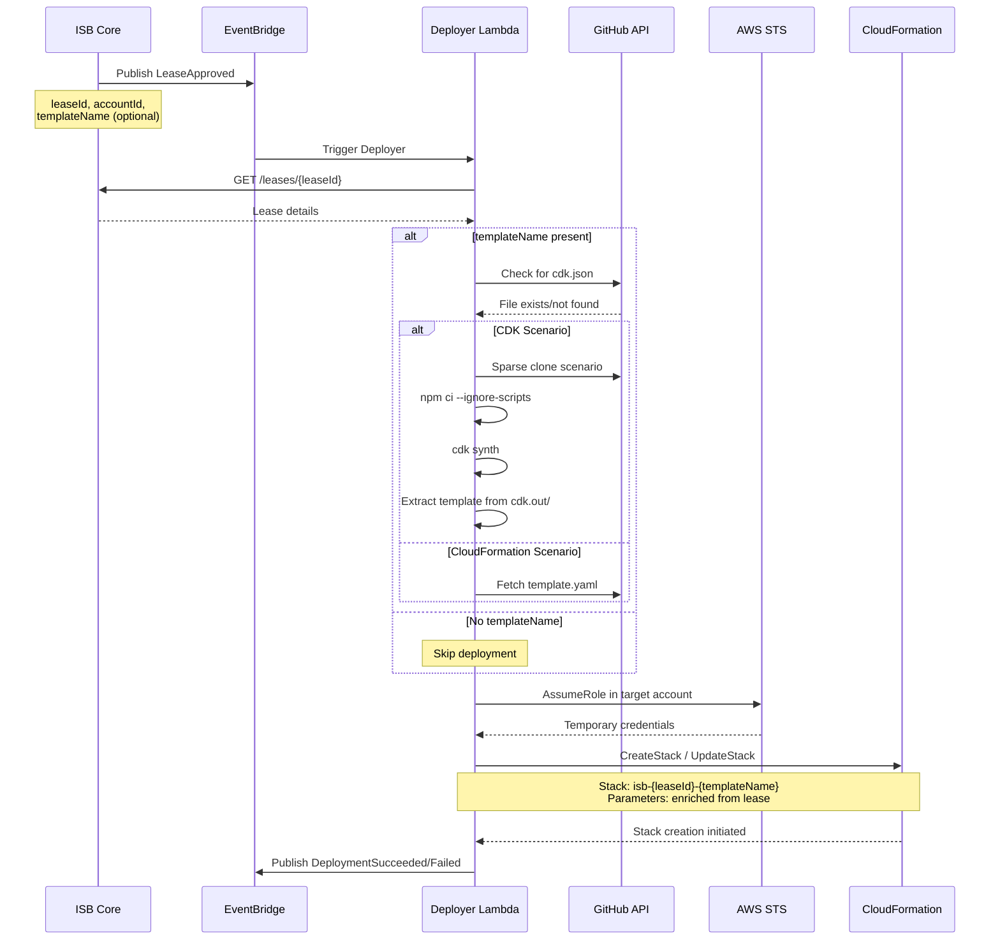

# ISB Deployer System

## Executive Summary

The Innovation Sandbox Deployer (`innovation-sandbox-on-aws-deployer`) is a TypeScript-based serverless service that automatically provisions CloudFormation templates and CDK applications into approved sandbox accounts. Operating as a Phase 4 satellite, it transforms the lease approval workflow into an automated infrastructure delivery pipeline.

**Key Capabilities:**
- Automatic CloudFormation template deployment on lease approval
- CDK application synthesis and deployment
- GitHub integration for scenario management
- Cross-account deployment via IAM role assumption
- Parameter enrichment from lease metadata
- Deployment status event publishing

**Architecture:** EventBridge → Lambda → GitHub → CDK Synth → CloudFormation (Cross-Account)

**Technology Stack:** Node.js 22, TypeScript, AWS SDK v3, GitHub API

**Status:** Production (Phase 4 Satellite)

---

## Architecture Overview

### System Context

```mermaid
graph TB
    subgraph "ISB Core Account"
        CORE_EB[ISBEventBus]
        LEASE_API[ISB API]
    end

    subgraph "Deployer Service"
        EB_RULE[EventBridge Rule]
        DEPLOYER[Deployer Lambda<br/>Node.js 22, 3GB RAM]
        TMP[/tmp/clone-dir]
    end

    subgraph "GitHub"
        REPO[ndx_try_aws_scenarios]
        CDK_SCENARIO[scenarios/my-cdk-app/]
        CFN_SCENARIO[scenarios/my-cfn-template/]
    end

    subgraph "Target Sandbox Account"
        IAM_ROLE[ndx_IsbUsersPS]
        CFN[CloudFormation]
        RESOURCES[AWS Resources]
    end

    CORE_EB -->|LeaseApproved event| EB_RULE
    EB_RULE -->|Trigger| DEPLOYER
    DEPLOYER -->|GET /leases/{id}| LEASE_API
    DEPLOYER -->|Check cdk.json| REPO

    DEPLOYER -->|Sparse clone| CDK_SCENARIO
    DEPLOYER -->|Or fetch| CFN_SCENARIO
    CDK_SCENARIO -->|npm ci| TMP
    TMP -->|cdk synth| TMP
    TMP -->|Extract template| DEPLOYER

    DEPLOYER -->|AssumeRole| IAM_ROLE
    DEPLOYER -->|CreateStack| CFN
    CFN -->|Provision| RESOURCES

    DEPLOYER -->|Publish event| CORE_EB
```

### Event Flow



---

## Components Deep Dive

### 1. EventBridge Rule

**Rule Name:** `isb-deployer-lease-approved-rule`

**Event Pattern:**
```json
{
  "source": ["isb"],
  "detail-type": ["LeaseApproved"],
  "detail": {
    "leaseId": [{"exists": true}],
    "accountId": [{"exists": true}]
  }
}
```

**Target:** Deployer Lambda (`isb-deployer-lambda`)

---

### 2. Deployer Lambda

**Function:** `isb-deployer-lambda`

**Configuration:**
| Setting | Value |
|---------|-------|
| Runtime | Node.js 22 |
| Memory | 3008 MB (for CDK synthesis) |
| Timeout | 15 minutes |
| Ephemeral Storage | 10 GB (/tmp for git clone) |
| Reserved Concurrency | 5 |

**Environment Variables:**
- `LEASE_TABLE_NAME`: DynamoDB table name
- `GITHUB_REPO`: `co-cddo/ndx_try_aws_scenarios`
- `GITHUB_BRANCH`: `main`
- `GITHUB_PATH`: `cloudformation/scenarios`
- `GITHUB_TOKEN_SECRET_ARN`: Secrets Manager ARN (for private repos)
- `TARGET_ROLE_NAME`: `ndx_IsbUsersPS`

**IAM Permissions:**
- `dynamodb:GetItem` (read lease details)
- `sts:AssumeRole` (cross-account deployment)
- `secretsmanager:GetSecretValue` (GitHub token)
- `cloudformation:CreateStack`, `UpdateStack`, `DescribeStacks`
- `events:PutEvents` (publish deployment status)

**Handler Logic:**

```typescript
import { EventBridgeHandler } from 'aws-lambda';
import { exec } from 'child_process';
import { promisify } from 'util';
import * as path from 'path';
import * as fs from 'fs';

const execAsync = promisify(exec);

export const handler: EventBridgeHandler<'LeaseApproved', LeaseApprovedDetail, void> = async (event) => {
  const { leaseId, accountId } = event.detail;

  console.log(`Deployment triggered for lease ${leaseId.uuid}, account ${accountId}`);

  try {
    // 1. Fetch lease details from ISB API
    const lease = await fetchLeaseDetails(leaseId);

    if (!lease.templateName) {
      console.log('No template specified, skipping deployment');
      return;
    }

    console.log(`Deploying scenario: ${lease.templateName}`);

    // 2. Detect scenario type (CDK vs CloudFormation)
    const scenarioType = await detectScenarioType(lease.templateName);

    let templateBody: string;

    if (scenarioType === 'cdk' || scenarioType === 'cdk-subfolder') {
      // 3a. CDK Scenario: Clone, synthesize, extract template
      templateBody = await processCdkScenario(lease.templateName, scenarioType);
    } else {
      // 3b. CloudFormation Scenario: Fetch template from GitHub
      templateBody = await fetchCloudFormationTemplate(lease.templateName);
    }

    // 4. Enrich parameters from lease data
    const parameters = enrichParameters(templateBody, lease);

    // 5. Assume role in target account
    const credentials = await assumeRoleInTargetAccount(accountId);

    // 6. Deploy CloudFormation stack
    const stackName = `isb-${leaseId.uuid}-${lease.templateName}`;
    const stackId = await deployCloudFormationStack(
      stackName,
      templateBody,
      parameters,
      accountId,
      credentials
    );

    console.log(`Deployment successful: ${stackId}`);

    // 7. Publish success event
    await publishDeploymentEvent({
      leaseId: leaseId.uuid,
      accountId,
      stackName,
      stackId,
      templateName: lease.templateName,
      scenarioType,
      status: 'SUCCEEDED',
    });

  } catch (error) {
    console.error('Deployment failed:', error);

    // Publish failure event
    await publishDeploymentEvent({
      leaseId: leaseId.uuid,
      accountId,
      templateName: lease.templateName,
      status: 'FAILED',
      errorMessage: error.message,
    });

    throw error;
  }
};

async function detectScenarioType(scenarioName: string): Promise<'cdk' | 'cdk-subfolder' | 'cloudformation'> {
  // Check for cdk.json in scenario root
  const rootCdkExists = await githubFileExists(`${GITHUB_PATH}/${scenarioName}/cdk.json`);
  if (rootCdkExists) return 'cdk';

  // Check for cdk.json in /cdk subdirectory
  const subfolderCdkExists = await githubFileExists(`${GITHUB_PATH}/${scenarioName}/cdk/cdk.json`);
  if (subfolderCdkExists) return 'cdk-subfolder';

  // Default to CloudFormation
  return 'cloudformation';
}

async function processCdkScenario(scenarioName: string, type: 'cdk' | 'cdk-subfolder'): Promise<string> {
  const cloneDir = `/tmp/scenario-${Date.now()}`;
  const cdkPath = type === 'cdk' ? cloneDir : path.join(cloneDir, 'cdk');

  try {
    // Sparse clone scenario folder from GitHub
    await sparseCloneScenario(scenarioName, cloneDir);

    // Install dependencies
    console.log('Installing dependencies...');
    await execAsync(`cd ${cdkPath} && npm ci --ignore-scripts`, { timeout: 300000 });

    // Determine CDK version from package.json
    const packageJson = JSON.parse(fs.readFileSync(path.join(cdkPath, 'package.json'), 'utf8'));
    const cdkVersion = packageJson.dependencies['aws-cdk-lib'] || packageJson.devDependencies['aws-cdk-lib'];

    // Install matching CDK CLI
    console.log(`Installing CDK CLI ${cdkVersion}...`);
    await execAsync(`npm install -g aws-cdk@${cdkVersion}`, { timeout: 180000 });

    // Synthesize CDK app
    console.log('Synthesizing CDK app...');
    await execAsync(`cd ${cdkPath} && cdk synth --quiet`, { timeout: 300000 });

    // Extract CloudFormation template from cdk.out/
    const cdkOutDir = path.join(cdkPath, 'cdk.out');
    const files = fs.readdirSync(cdkOutDir);
    const templateFile = files.find(f => f.endsWith('.template.json') && !f.includes('asset'));

    if (!templateFile) {
      throw new Error('No CloudFormation template found in cdk.out/');
    }

    const templatePath = path.join(cdkOutDir, templateFile);
    const templateBody = fs.readFileSync(templatePath, 'utf8');

    console.log(`Template extracted: ${templateFile} (${templateBody.length} bytes)`);

    return templateBody;

  } finally {
    // Cleanup
    fs.rmSync(cloneDir, { recursive: true, force: true });
  }
}

async function sparseCloneScenario(scenarioName: string, targetDir: string): Promise<void> {
  const repoUrl = `https://github.com/${GITHUB_REPO}.git`;
  const scenarioPath = `${GITHUB_PATH}/${scenarioName}`;

  console.log(`Sparse cloning ${scenarioPath}...`);

  await execAsync(`
    git clone --depth 1 --filter=blob:none --sparse ${repoUrl} ${targetDir} &&
    cd ${targetDir} &&
    git sparse-checkout set ${scenarioPath} &&
    git checkout ${GITHUB_BRANCH}
  `, { timeout: 180000 });
}

async function fetchCloudFormationTemplate(scenarioName: string): Promise<string> {
  const url = `https://raw.githubusercontent.com/${GITHUB_REPO}/${GITHUB_BRANCH}/${GITHUB_PATH}/${scenarioName}/template.yaml`;

  console.log(`Fetching template from ${url}...`);

  const response = await fetch(url, {
    headers: {
      Authorization: `token ${await getGitHubToken()}`,
    },
  });

  if (!response.ok) {
    throw new Error(`Failed to fetch template: ${response.statusText}`);
  }

  return response.text();
}

async function enrichParameters(templateBody: string, lease: Lease): Promise<CloudFormationParameter[]> {
  // Parse template to extract parameter definitions
  const template = JSON.parse(templateBody);
  const parameterDefs = template.Parameters || {};

  const parameters: CloudFormationParameter[] = [];

  // Map lease data to CloudFormation parameters
  const leaseMapping = {
    LeaseId: lease.uuid,
    AccountId: lease.awsAccountId,
    UserEmail: lease.userEmail,
    Budget: lease.maxSpend.toString(),
    Duration: lease.leaseDurationInHours.toString(),
  };

  for (const [paramName, paramDef] of Object.entries(parameterDefs)) {
    if (leaseMapping[paramName]) {
      parameters.push({
        ParameterKey: paramName,
        ParameterValue: leaseMapping[paramName],
      });
    } else if (paramDef.Default) {
      // Use default value from template
      parameters.push({
        ParameterKey: paramName,
        ParameterValue: paramDef.Default,
      });
    }
  }

  return parameters;
}

async function deployCloudFormationStack(
  stackName: string,
  templateBody: string,
  parameters: CloudFormationParameter[],
  accountId: string,
  credentials: Credentials
): Promise<string> {
  const cfnClient = new CloudFormationClient({
    region: 'us-west-2',
    credentials,
  });

  // Check if stack exists
  let stackExists = false;
  try {
    await cfnClient.send(new DescribeStacksCommand({ StackName: stackName }));
    stackExists = true;
  } catch (error) {
    if (error.name !== 'ValidationError') throw error;
  }

  const command = stackExists
    ? new UpdateStackCommand({
        StackName: stackName,
        TemplateBody: templateBody,
        Parameters: parameters,
        Capabilities: ['CAPABILITY_IAM', 'CAPABILITY_NAMED_IAM'],
      })
    : new CreateStackCommand({
        StackName: stackName,
        TemplateBody: templateBody,
        Parameters: parameters,
        Capabilities: ['CAPABILITY_IAM', 'CAPABILITY_NAMED_IAM'],
        Tags: [
          { Key: 'ManagedBy', Value: 'InnovationSandbox' },
          { Key: 'LeaseId', Value: lease.uuid },
        ],
      });

  const response = await cfnClient.send(command);

  return response.StackId;
}
```

---

### 3. GitHub Integration

**Repository Structure:**

```
co-cddo/ndx_try_aws_scenarios/
└── cloudformation/
    └── scenarios/
        ├── simple-ec2/              # CloudFormation scenario
        │   └── template.yaml
        ├── three-tier-web/          # CDK scenario
        │   ├── cdk.json
        │   ├── package.json
        │   ├── tsconfig.json
        │   └── lib/
        │       └── stack.ts
        └── lambda-api/              # CDK subfolder scenario
            ├── README.md
            └── cdk/
                ├── cdk.json
                ├── package.json
                └── lib/
                    └── stack.ts
```

**GitHub API Calls:**

1. **Check for cdk.json:**
```typescript
async function githubFileExists(path: string): Promise<boolean> {
  const url = `https://api.github.com/repos/${GITHUB_REPO}/contents/${path}?ref=${GITHUB_BRANCH}`;

  const response = await fetch(url, {
    headers: {
      Authorization: `token ${await getGitHubToken()}`,
      Accept: 'application/vnd.github.v3+json',
    },
  });

  return response.ok;
}
```

2. **Sparse Clone:**
```bash
git clone --depth 1 --filter=blob:none --sparse https://github.com/co-cddo/ndx_try_aws_scenarios.git /tmp/clone
cd /tmp/clone
git sparse-checkout set cloudformation/scenarios/my-scenario
git checkout main
```

**Benefits of Sparse Clone:**
- Only downloads needed files (not entire repo)
- Faster than full clone (seconds vs minutes)
- Reduces /tmp storage usage

---

## CDK Synthesis Process

### CDK Scenario Example

**File:** `cloudformation/scenarios/three-tier-web/lib/stack.ts`

```typescript
import * as cdk from 'aws-cdk-lib';
import * as ec2 from 'aws-cdk-lib/aws-ec2';
import * as elbv2 from 'aws-cdk-lib/aws-elasticloadbalancingv2';
import * as rds from 'aws-cdk-lib/aws-rds';

export class ThreeTierWebStack extends cdk.Stack {
  constructor(scope: cdk.App, id: string, props?: cdk.StackProps) {
    super(scope, id, props);

    // VPC
    const vpc = new ec2.Vpc(this, 'VPC', {
      maxAzs: 2,
    });

    // Application Load Balancer
    const alb = new elbv2.ApplicationLoadBalancer(this, 'ALB', {
      vpc,
      internetFacing: true,
    });

    // RDS Database
    const database = new rds.DatabaseInstance(this, 'Database', {
      engine: rds.DatabaseInstanceEngine.postgres({ version: rds.PostgresEngineVersion.VER_15_3 }),
      instanceType: ec2.InstanceType.of(ec2.InstanceClass.T3, ec2.InstanceSize.MICRO),
      vpc,
    });

    new cdk.CfnOutput(this, 'ALBEndpoint', {
      value: alb.loadBalancerDnsName,
    });
  }
}
```

**Synthesis Command:**
```bash
cdk synth --quiet
```

**Output:** `cdk.out/ThreeTierWebStack.template.json`

```json
{
  "Resources": {
    "VPC8CACB7F2": {
      "Type": "AWS::EC2::VPC",
      "Properties": {
        "CidrBlock": "10.0.0.0/16",
        "EnableDnsHostnames": true,
        "EnableDnsSupport": true
      }
    },
    "ALB8B1F9E3A": {
      "Type": "AWS::ElasticLoadBalancingV2::LoadBalancer",
      "Properties": {
        "Scheme": "internet-facing",
        "Subnets": [...]
      }
    },
    "Database4C7F3F2A": {
      "Type": "AWS::RDS::DBInstance",
      "Properties": {
        "DBInstanceClass": "db.t3.micro",
        "Engine": "postgres",
        "EngineVersion": "15.3"
      }
    }
  },
  "Outputs": {
    "ALBEndpoint": {
      "Value": { "Fn::GetAtt": ["ALB8B1F9E3A", "DNSName"] }
    }
  }
}
```

### CDK Requirements

**package.json:**
```json
{
  "dependencies": {
    "aws-cdk-lib": "^2.100.0",
    "constructs": "^10.0.0"
  },
  "devDependencies": {
    "aws-cdk": "^2.100.0",
    "typescript": "^5.0.0"
  }
}
```

**Constraints:**
- **Single stack only:** App must produce exactly one CloudFormation template
- **No assets:** S3 buckets or ECR images not supported (use inline Lambda code)
- **No custom resources:** Unless bundled in template

---

## Cross-Account Deployment

### IAM Role in Target Account

**Role Name:** `ndx_IsbUsersPS`

**Trust Policy:**
```json
{
  "Version": "2012-10-17",
  "Statement": [{
    "Effect": "Allow",
    "Principal": {
      "AWS": "arn:aws:iam::955063685555:role/isb-deployer-lambda-role"
    },
    "Action": "sts:AssumeRole"
  }]
}
```

**Permissions Policy:**
```json
{
  "Version": "2012-10-17",
  "Statement": [
    {
      "Effect": "Allow",
      "Action": [
        "cloudformation:CreateStack",
        "cloudformation:UpdateStack",
        "cloudformation:DeleteStack",
        "cloudformation:DescribeStacks",
        "cloudformation:DescribeStackEvents"
      ],
      "Resource": "arn:aws:cloudformation:*:*:stack/isb-*/*"
    },
    {
      "Effect": "Allow",
      "Action": "*",
      "Resource": "*",
      "Condition": {
        "StringEquals": {
          "cloudformation:StackName": ["isb-*"]
        }
      }
    }
  ]
}
```

**Assumption:**
```typescript
import { STSClient, AssumeRoleCommand } from '@aws-sdk/client-sts';

const sts = new STSClient({ region: 'us-west-2' });

const credentials = await sts.send(new AssumeRoleCommand({
  RoleArn: `arn:aws:iam::${accountId}:role/${TARGET_ROLE_NAME}`,
  RoleSessionName: `isb-deployer-${leaseId}`,
  DurationSeconds: 3600,
}));
```

---

## Event Schemas

### Input: LeaseApproved

```json
{
  "detail-type": "LeaseApproved",
  "source": "isb",
  "detail": {
    "leaseId": {
      "userEmail": "user@example.gov.uk",
      "uuid": "550e8400-e29b-41d4-a716-446655440000"
    },
    "accountId": "123456789012",
    "approvedBy": "manager@example.gov.uk"
  }
}
```

### Output: DeploymentSucceeded

```json
{
  "detail-type": "DeploymentSucceeded",
  "source": "isb-deployer",
  "detail": {
    "leaseId": "550e8400-e29b-41d4-a716-446655440000",
    "accountId": "123456789012",
    "stackName": "isb-550e8400-three-tier-web",
    "stackId": "arn:aws:cloudformation:us-west-2:123456789012:stack/isb-550e8400-three-tier-web/abc123",
    "templateName": "three-tier-web",
    "scenarioType": "cdk"
  }
}
```

### Output: DeploymentFailed

```json
{
  "detail-type": "DeploymentFailed",
  "source": "isb-deployer",
  "detail": {
    "leaseId": "550e8400-e29b-41d4-a716-446655440000",
    "accountId": "123456789012",
    "templateName": "three-tier-web",
    "errorMessage": "CDK synthesis failed: npm ci exited with code 1",
    "errorDetails": "..."
  }
}
```

---

## Monitoring & Observability

### CloudWatch Metrics

| Metric | Description |
|--------|-------------|
| `DeploymentSuccessRate` | % successful deployments |
| `CdkSynthesisDuration` | Time to synthesize CDK apps |
| `GitCloneDuration` | Time to sparse clone scenario |
| `CloudFormationDeployDuration` | Time to create/update stack |

### CloudWatch Dashboard

```
┌─────────────────────────────────────────────────────────┐
│ Deployer Status (Last 24h)                              │
│                                                          │
│  Deployments: 47                                        │
│  Success: 45 (95.7%)                                    │
│  Failures: 2 (4.3%)                                     │
│                                                          │
│  Avg Deployment Time:                                   │
│  - CDK Scenarios: 8m 34s                                │
│  - CloudFormation: 1m 12s                               │
└─────────────────────────────────────────────────────────┘
```

---

## Related Documentation

- [10-isb-core-architecture.md](/Users/cns/httpdocs/cddo/ndx-try-arch/docs/10-isb-core-architecture.md) - ISB Core integration
- [13-isb-customizations.md](/Users/cns/httpdocs/cddo/ndx-try-arch/docs/13-isb-customizations.md) - CDDO customizations

---

**Document Version:** 1.0
**Last Updated:** 2026-02-03
**Status:** Production System (Phase 4 Satellite)
