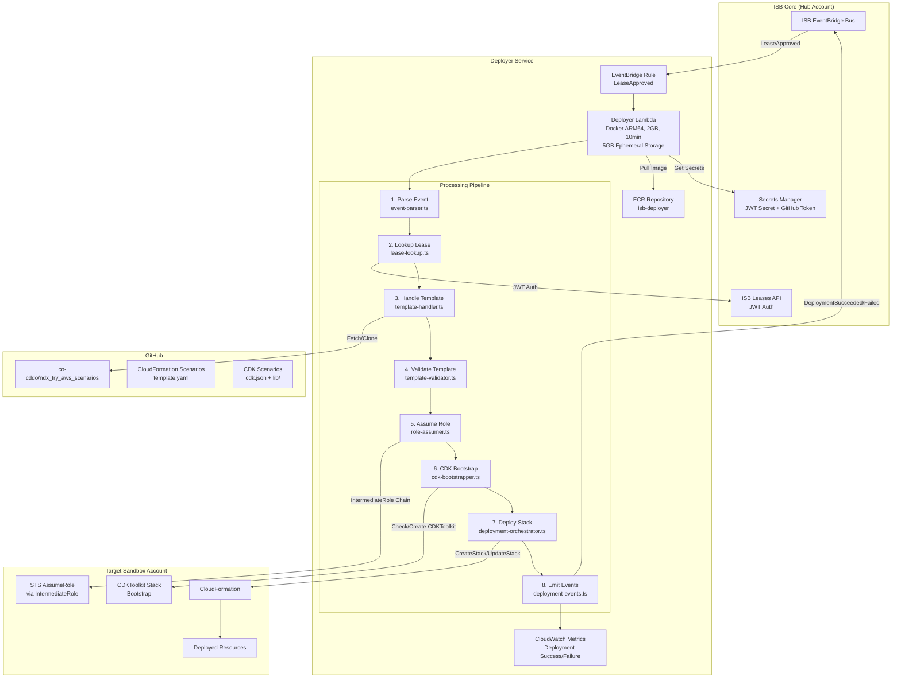
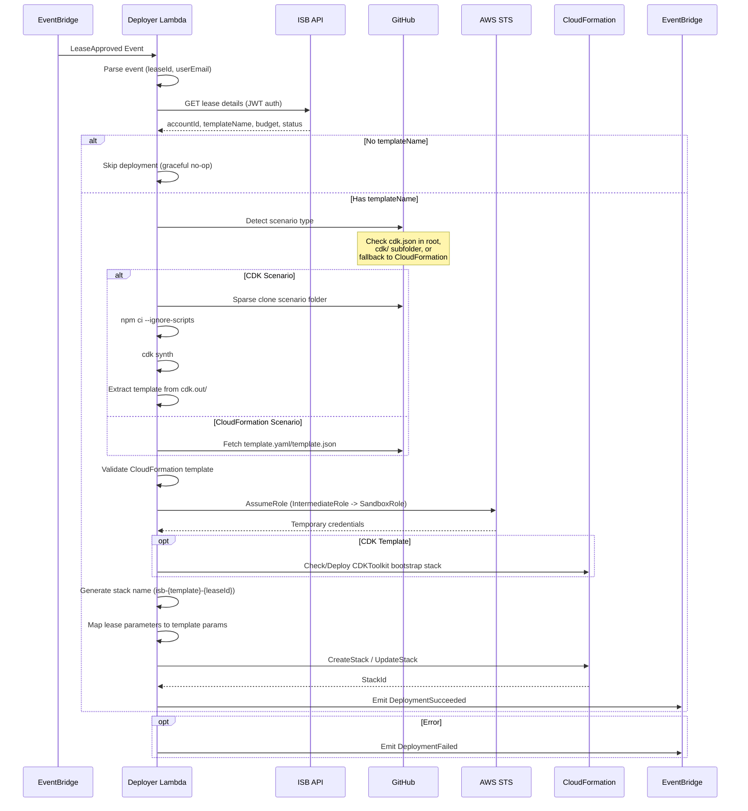

# ISB Deployer

> **Last Updated**: 2026-03-02
> **Source**: [innovation-sandbox-on-aws-deployer](https://github.com/co-cddo/innovation-sandbox-on-aws-deployer)
> **Captured SHA**: `c2a85a0`

## Executive Summary

The ISB Deployer is a container-based Lambda service that automatically deploys CloudFormation templates and CDK-synthesized stacks into approved sandbox accounts when leases are approved. Triggered by `LeaseApproved` events on the ISB EventBridge bus, it fetches scenario templates from a GitHub repository, assumes a cross-account role in the target sandbox account, and creates CloudFormation stacks with parameters mapped from the lease metadata. The repository is now archived, as the deployer functionality has been superseded by Innovation Sandbox's built-in blueprint pattern (upstream issue #34).

## Architecture Overview

The Deployer operates as a single container-based Lambda function (ARM64, Docker image from ECR) that subscribes to `LeaseApproved` events. It supports three scenario types: raw CloudFormation templates, CDK applications (root-level `cdk.json`), and CDK subfolder applications (`cdk/cdk.json`). For CDK scenarios, the Lambda performs git sparse cloning, dependency installation, CDK synthesis, and CDK bootstrapping in the target account before deploying the synthesized template.

### Component Architecture


```mermaid
graph TB
    subgraph "ISB Core (Hub Account)"
        ISB_EB[ISB EventBridge Bus]
        ISB_API[ISB Leases API<br/>JWT Auth]
        ISB_SECRETS[Secrets Manager<br/>JWT Secret + GitHub Token]
    end

    subgraph "Deployer Service"
        EB_RULE[EventBridge Rule<br/>LeaseApproved]
        LAMBDA[Deployer Lambda<br/>Docker ARM64, 2GB, 10min<br/>5GB Ephemeral Storage]

        subgraph "Processing Pipeline"
            PARSE[1. Parse Event<br/>event-parser.ts]
            LOOKUP[2. Lookup Lease<br/>lease-lookup.ts]
            TEMPLATE[3. Handle Template<br/>template-handler.ts]
            VALIDATE[4. Validate Template<br/>template-validator.ts]
            ASSUME[5. Assume Role<br/>role-assumer.ts]
            BOOTSTRAP[6. CDK Bootstrap<br/>cdk-bootstrapper.ts]
            DEPLOY[7. Deploy Stack<br/>deployment-orchestrator.ts]
            EMIT[8. Emit Events<br/>deployment-events.ts]
        end

        ECR[ECR Repository<br/>isb-deployer]
        METRICS[CloudWatch Metrics<br/>Deployment Success/Failure]
    end

    subgraph "GitHub"
        GH_REPO[co-cddo/ndx_try_aws_scenarios]
        GH_CFN[CloudFormation Scenarios<br/>template.yaml]
        GH_CDK[CDK Scenarios<br/>cdk.json + lib/]
    end

    subgraph "Target Sandbox Account"
        STS[STS AssumeRole<br/>via IntermediateRole]
        CFN[CloudFormation]
        CDK_TOOLKIT[CDKToolkit Stack<br/>Bootstrap]
        RESOURCES[Deployed Resources]
    end

    ISB_EB -->|LeaseApproved| EB_RULE --> LAMBDA
    LAMBDA --> PARSE --> LOOKUP
    LOOKUP -->|JWT Auth| ISB_API
    LOOKUP --> TEMPLATE
    TEMPLATE -->|Fetch/Clone| GH_REPO
    TEMPLATE --> VALIDATE --> ASSUME
    ASSUME -->|IntermediateRole Chain| STS
    ASSUME --> BOOTSTRAP
    BOOTSTRAP -->|Check/Create CDKToolkit| CDK_TOOLKIT
    BOOTSTRAP --> DEPLOY
    DEPLOY -->|CreateStack/UpdateStack| CFN
    CFN --> RESOURCES
    DEPLOY --> EMIT
    EMIT -->|DeploymentSucceeded/Failed| ISB_EB
    EMIT --> METRICS

    LAMBDA -->|Pull Image| ECR
    LAMBDA -->|Get Secrets| ISB_SECRETS
```

### Deployment Flow


```mermaid
sequenceDiagram
    participant EB as EventBridge
    participant Lambda as Deployer Lambda
    participant API as ISB API
    participant GH as GitHub
    participant STS as AWS STS
    participant CFN as CloudFormation
    participant EB2 as EventBridge

    EB->>Lambda: LeaseApproved Event

    Lambda->>Lambda: Parse event (leaseId, userEmail)
    Lambda->>API: GET lease details (JWT auth)
    API-->>Lambda: accountId, templateName, budget, status

    alt No templateName
        Lambda->>Lambda: Skip deployment (graceful no-op)
    else Has templateName
        Lambda->>GH: Detect scenario type
        Note over GH: Check cdk.json in root,<br/>cdk/ subfolder, or<br/>fallback to CloudFormation

        alt CDK Scenario
            Lambda->>GH: Sparse clone scenario folder
            Lambda->>Lambda: npm ci --ignore-scripts
            Lambda->>Lambda: cdk synth
            Lambda->>Lambda: Extract template from cdk.out/
        else CloudFormation Scenario
            Lambda->>GH: Fetch template.yaml/template.json
        end

        Lambda->>Lambda: Validate CloudFormation template
        Lambda->>STS: AssumeRole (IntermediateRole -> SandboxRole)
        STS-->>Lambda: Temporary credentials

        opt CDK Template
            Lambda->>CFN: Check/Deploy CDKToolkit bootstrap stack
        end

        Lambda->>Lambda: Generate stack name (isb-{template}-{leaseId})
        Lambda->>Lambda: Map lease parameters to template params
        Lambda->>CFN: CreateStack / UpdateStack
        CFN-->>Lambda: StackId

        Lambda->>EB2: Emit DeploymentSucceeded
    end

    opt Error
        Lambda->>EB2: Emit DeploymentFailed
    end
```

## Processing Pipeline

The Lambda handler (`src/handler.ts`) executes an 8-step pipeline:

| Step | Module | Purpose |
|------|--------|---------|
| 1. Parse Event | `event-parser.ts` | Extract leaseId and userEmail from LeaseApproved event |
| 2. Lookup Lease | `lease-lookup.ts` | ISB API call (JWT auth) to get accountId, templateName |
| 3. Handle Template | `template-handler.ts` | Detect type, fetch/clone, CDK synth if needed |
| 4. Validate Template | `template-validator.ts` | CloudFormation structure validation |
| 5. Assume Role | `role-assumer.ts` | ISB double role chain to target account |
| 6. CDK Bootstrap | `cdk-bootstrapper.ts` | Ensure CDKToolkit stack exists (CDK scenarios only) |
| 7. Deploy | `deployment-orchestrator.ts` | CreateStack/UpdateStack with mapped parameters |
| 8. Emit Events | `deployment-events.ts` | DeploymentSucceeded or DeploymentFailed to EventBridge |

**Source**: `src/handler.ts`, `src/modules/`

### Scenario Detection

The scenario detector (`src/modules/scenario-detector.ts`) checks for:
1. `cdk.json` in scenario root -> CDK scenario
2. `cdk/cdk.json` in scenario subfolder -> CDK subfolder scenario
3. Neither -> CloudFormation scenario (expects `template.yaml` or `template.json`)

### CDK Synthesis

For CDK scenarios, the Lambda performs in-container synthesis:
1. Sparse clone the scenario folder from GitHub (minimal download)
2. `npm ci --ignore-scripts` (install dependencies)
3. `cdk synth` (synthesize CloudFormation template)
4. Extract the generated `.template.json` from `cdk.out/`

**Source**: `src/modules/cdk-synthesizer.ts`, `src/modules/scenario-fetcher.ts`

### Parameter Mapping

The parameter mapper (`src/modules/parameter-mapper.ts`) maps lease metadata to CloudFormation parameters. Template parameters with names matching lease fields (e.g., `LeaseId`, `AccountId`, `UserEmail`, `Budget`) are automatically populated.

### Template Reference Parsing

Templates can be referenced in ISB as either plain names (e.g., `council-chatbot`) or as GitHub references (e.g., `owner/repo@branch:path/to/scenario`). The template reference parser (`src/modules/template-ref-parser.ts`) handles both formats.

## Infrastructure (CDK)

**Source**: `infrastructure/cdk/lib/deployer-stack.ts`, `infrastructure/cdk/lib/github-oidc-stack.ts`

### DeployerStack

| Resource | Configuration |
|----------|---------------|
| ECR Repository | `isb-deployer-{env}`, image scan on push |
| Docker Lambda | ARM64, 2048MB memory, 10-min timeout, 5GB ephemeral storage |
| IAM Role | SecretsManager (JWT + GitHub token), STS AssumeRole, EventBridge PutEvents, ECR pull |
| EventBridge Rule | `LeaseApproved` on ISB event bus |

### GitHub OIDC Stack

Configures OIDC federation for GitHub Actions CI/CD deployment without long-lived credentials.

### Container Image

The Lambda runs as a Docker container (built via `infrastructure/docker/Dockerfile`) that includes:
- Node.js runtime
- git (for sparse cloning)
- npm (for CDK dependency installation)
- AWS CDK CLI
- CDK bootstrap template (`src/templates/cdk-bootstrap.yaml`)

### StackSet Sandbox Role

A CloudFormation StackSet template (`infrastructure/stackset-sandbox-role.yaml`) provisions the IAM role in each sandbox account that the deployer assumes for CloudFormation operations.

## Cross-Account Deployment

The deployer uses ISB's double role chain pattern:

```
Deployer Lambda (Hub Account)
  -> IntermediateRole (Hub Account)
    -> SandboxAccountRole (Target Sandbox)
      -> CloudFormation operations
```

CloudFormation stacks deploy to us-east-1 in target accounts (configured via `DEPLOY_REGION` environment variable).

## Event Schemas

### Input: LeaseApproved

```json
{
  "detail-type": "LeaseApproved",
  "source": "isb",
  "detail": {
    "leaseId": { "userEmail": "user@example.gov.uk", "uuid": "550e8400-..." },
    "accountId": "123456789012",
    "approvedBy": "manager@example.gov.uk"
  }
}
```

### Output: DeploymentSucceeded / DeploymentFailed

Emitted to the default EventBridge bus with deployment result details including stackId, action (created/exists), templateName, and error information for failures.

## Archived Status

This repository is archived. The README states: "The deployer functionality has been superseded by Innovation Sandbox's built-in blueprint pattern, removing the need for a separate deployer service."

The built-in ISB blueprint pattern (upstream issue #34) provides native template deployment without a separate satellite service, simplifying the architecture.

## Technology Stack

| Component | Technology |
|-----------|------------|
| Runtime | Node.js 22, TypeScript, Docker container |
| Architecture | ARM64 |
| Build | esbuild (CJS bundle, externalize AWS SDK) |
| Infrastructure | AWS CDK with separate infra package |
| Testing | Vitest with coverage |
| ISB Client | `@co-cddo/isb-client` v2.0.0 |
| Template Parsing | js-yaml for YAML CloudFormation templates |
| Metrics | Custom CloudWatch metrics (success/failure/duration) |
| CI/CD | GitHub Actions with OIDC |

## Observability

- **Custom Metrics**: `DEPLOYMENT_SUCCESS`, `DEPLOYMENT_FAILURE`, `TEMPLATE_RESOLUTION_DURATION`, `DEPLOYMENT_DURATION`, `INVOCATION_DURATION`, `STACK_CREATE`, `STACK_EXISTS`
- **Structured Logging**: Correlation IDs (leaseId), step-by-step event logging
- **Error Categorization**: `categorizeError()` classifies failures for operational triage
- **EventBridge Events**: Both success and failure events emitted for downstream monitoring

---
*Generated from source analysis of `innovation-sandbox-on-aws-deployer` at SHA `c2a85a0`. See [00-repo-inventory.md](./00-repo-inventory.md) for full inventory. Cross-references: [10-isb-core-architecture.md](./10-isb-core-architecture.md), [13-isb-customizations.md](./13-isb-customizations.md).*
