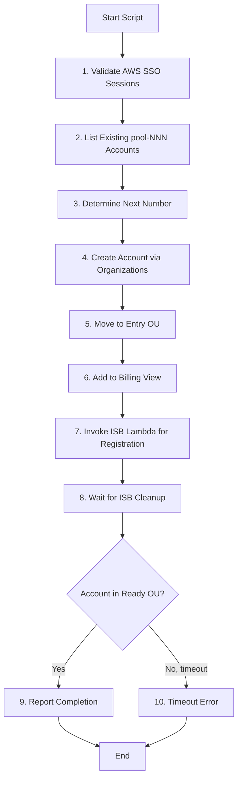

# ISB Utils - Account Pool Provisioning

## Executive Summary

The Innovation Sandbox Utils (`innovation-sandbox-on-aws-utils`) repository contains a Python script for semi-automated provisioning of pool accounts. This manual tool streamlines the multi-step process of creating, configuring, and registering AWS accounts into the Innovation Sandbox pool.

**Key Tool:** `create_sandbox_pool_account.py`

**Purpose:** Automate the 7-step workflow for adding new accounts to the sandbox pool

**Use Case:** Capacity expansion when pool runs low

**Technology:** Python 3, boto3, AWS Organizations, AWS SSO

**Status:** Production utility (manual execution)

---

## Tool Overview

### create_sandbox_pool_account.py

**File:** `/Users/cns/httpdocs/cddo/ndx-try-arch/repos/innovation-sandbox-on-aws-utils/create_sandbox_pool_account.py`

**Purpose:** Create and register a new pool account with automated naming, OU placement, billing setup, and ISB registration.

**Workflow:**



---

## Prerequisites

### AWS SSO Profiles

**Required Profiles:**

1. **NDX/orgManagement**
   - Access to AWS Organizations API
   - Permissions: `organizations:CreateAccount`, `organizations:MoveAccount`

2. **NDX/InnovationSandboxHub**
   - Access to ISB Lambda functions
   - Permissions: `lambda:InvokeFunction`

**Configuration:** `~/.aws/config`

```ini
[profile NDX/orgManagement]
sso_start_url = https://ndx.awsapps.com/start
sso_region = us-east-1
sso_account_id = 123456789012
sso_role_name = OrganizationAccountAccessRole
region = us-east-1

[profile NDX/InnovationSandboxHub]
sso_start_url = https://ndx.awsapps.com/start
sso_region = us-east-1
sso_account_id = 955063685555
sso_role_name = InnovationSandboxAdminRole
region = us-west-2
```

### Python Environment

```bash
# Create virtual environment
python3 -m venv venv
source venv/bin/activate

# Install dependencies
pip install boto3
```

---

## Usage

### Create New Account

```bash
source venv/bin/activate
python create_sandbox_pool_account.py
```

**Output:**
```
============================================================
🔑 STEP 1: AWS SSO Authentication
============================================================
  ✅ NDX/orgManagement - session valid
  ✅ NDX/InnovationSandboxHub - session valid

============================================================
📋 STEP 2: List existing pool accounts
============================================================
Fetching accounts from AWS Organizations...

📊 Found 8 accounts starting with 'pool-':

Account ID      Name                                     Status       Email
----------------------------------------------------------------------------------------------------
449788867583    pool-001                                 ACTIVE       ndx-try-provider+gds-ndx-try-aws-pool-001@dsit.gov.uk
...

   Total: 8 pool accounts

============================================================
🆕 STEP 3: Create new account
============================================================
   Account name: pool-009
   Email: ndx-try-provider+gds-ndx-try-aws-pool-009@dsit.gov.uk
   Request ID: car-abc123...
   ✅ Account created: 123456789012

============================================================
📦 STEP 4: Move to Entry OU
============================================================
   📍 From: r-2laj
   📍 To:   ou-2laj-2by9v0sr
   ✅ Move complete

============================================================
💰 STEP 4.5: Add to Billing View
============================================================
   📊 Fetching current billing view...
   📝 Adding account (total will be 9 accounts)
   ✅ Added account to billing view

============================================================
📝 STEP 5: Register with Innovation Sandbox
============================================================
   🎯 Account: 123456789012
   λ  Lambda: ISB-AccountsLambdaFunction-ndx
   ✅ Registered successfully!
   📄 Status: CleanUp

============================================================
🧹 STEP 6: Wait for Innovation Sandbox cleanup
============================================================
⏳ Waiting for Innovation Sandbox cleanup...
   Target OU: ou-2laj-oihxgbtr
   ✅ Account moved to target OU after 8m 45s!

============================================================
🎉 COMPLETE
============================================================
   Account: pool-009 (123456789012)
   ⏱️  Total time: 12m 34s
```

### Recover Partially Provisioned Account

If the script fails partway through, resume by providing the account ID:

```bash
python create_sandbox_pool_account.py 123456789012
```

**Recovery Logic:**
- **In root OU:** Moves to Entry OU, then registers
- **In Entry OU:** Skips account creation, proceeds to registration
- **In Ready OU:** Reports as already complete
- **Elsewhere:** Returns error (may be in use)

---

## Implementation Details

### 1. SSO Authentication

```python
def check_sso_session(profile_name):
    """Check if SSO session is valid for the given profile."""
    try:
        session = boto3.Session(profile_name=profile_name)
        sts = session.client('sts')
        sts.get_caller_identity()
        return True
    except Exception:
        return False

def ensure_sso_login(profile_name):
    """Ensure SSO login for the given profile, only prompting if needed."""
    if check_sso_session(profile_name):
        print(f"  ✅ {profile_name} - session valid")
        return

    print(f"  🔐 {profile_name} - logging in...")
    result = subprocess.run(
        ["aws", "sso", "login", "--profile", profile_name],
        capture_output=False,
    )
    if result.returncode != 0:
        raise RuntimeError(f"❌ SSO login failed for profile {profile_name}")
    print(f"  ✅ {profile_name} - login successful")
```

### 2. List Existing Accounts

```python
def get_all_accounts(session):
    """Retrieve all accounts from AWS Organizations with pagination."""
    client = session.client('organizations')
    accounts = []
    paginator = client.get_paginator('list_accounts')

    for page in paginator.paginate():
        accounts.extend(page['Accounts'])

    return accounts

def get_next_pool_number(pool_accounts):
    """Find the highest pool number and return the next one."""
    max_number = 0
    pattern = re.compile(r'^pool-(\d{3})$')

    for acc in pool_accounts:
        match = pattern.match(acc['Name'])
        if match:
            number = int(match.group(1))
            if number > max_number:
                max_number = number

    return max_number + 1
```

### 3. Create Account

```python
def create_pool_account(session, account_name, email):
    """Create a new AWS account in the organization."""
    client = session.client('organizations')

    response = client.create_account(
        Email=email,
        AccountName=account_name,
    )

    request_id = response['CreateAccountStatus']['Id']
    print(f"   Request ID: {request_id}")

    # Poll for completion
    while True:
        status_response = client.describe_create_account_status(
            CreateAccountRequestId=request_id
        )
        status = status_response['CreateAccountStatus']

        if status['State'] == 'SUCCEEDED':
            print(f"\r   ✅ Account created: {status['AccountId']}{' ' * 20}")
            return status['AccountId']
        elif status['State'] == 'FAILED':
            print(f"\r   ❌ Failed: {status.get('FailureReason', 'Unknown')}{' ' * 20}")
            return None
        else:
            print(f"\r   ⏳ {status['State']}...", end="", flush=True)
            time.sleep(5)
```

**Account Naming Convention:**
- Pattern: `pool-NNN` (zero-padded 3 digits)
- Examples: `pool-001`, `pool-009`, `pool-123`

**Email Pattern:**
- Format: `ndx-try-provider+gds-ndx-try-aws-pool-NNN@dsit.gov.uk`
- Uses Gmail-style `+` addressing for unique emails

### 4. Move to Entry OU

```python
ENTRY_OU = "ou-2laj-2by9v0sr"  # Entry OU for new accounts
ROOT_ID = None  # Populated at runtime

def move_account_to_ou(session, account_id, destination_ou_id, source_parent_id=None):
    """Move an account to a specific OU."""
    client = session.client('organizations')

    # If source not provided, get current parent
    if source_parent_id is None:
        source_parent_id = get_account_ou(session, account_id)

    print(f"   📍 From: {source_parent_id}")
    print(f"   📍 To:   {destination_ou_id}")

    client.move_account(
        AccountId=account_id,
        SourceParentId=source_parent_id,
        DestinationParentId=destination_ou_id,
    )

    print(f"   ✅ Move complete")

def get_account_ou(session, account_id):
    """Get the OU that an account is currently in."""
    client = session.client('organizations')
    response = client.list_parents(ChildId=account_id)
    if response['Parents']:
        return response['Parents'][0]['Id']
    return None
```

**OU Structure:**
- **Root:** `r-2laj` (organization root)
- **Entry OU:** `ou-2laj-2by9v0sr` (for registration)
- **Ready OU:** `ou-2laj-oihxgbtr` (post-cleanup, available for leases)

### 5. Add to Billing View

```python
BILLING_VIEW_ARN = "arn:aws:billing::955063685555:billingview/custom-466e2613-e09b-4787-a93a-736f0fb1564b"

def add_account_to_billing_view(session, account_id):
    """Add an account to the custom billing view.

    Uses read-modify-write pattern since there's no incremental add API.
    Continues with warning on failure (non-blocking).
    """
    try:
        billing_client = session.client('billing')

        # Get current billing view
        print(f"   📊 Fetching current billing view...")
        response = billing_client.get_billing_view(arn=BILLING_VIEW_ARN)
        billing_view = response['billingView']

        # Get existing accounts from the filter expression
        data_filter = billing_view.get('dataFilterExpression', {})
        dimensions = data_filter.get('dimensions', {})
        existing_accounts = dimensions.get('values', [])

        # Check if account already exists
        if account_id in existing_accounts:
            print(f"   ℹ️  Account {account_id} already in billing view")
            return True

        # Add new account
        updated_accounts = existing_accounts + [account_id]
        print(f"   📝 Adding account (total will be {len(updated_accounts)} accounts)")

        # Update billing view
        billing_client.update_billing_view(
            arn=BILLING_VIEW_ARN,
            dataFilterExpression={
                'dimensions': {
                    'key': 'LINKED_ACCOUNT',
                    'values': updated_accounts
                }
            }
        )

        print(f"   ✅ Added account to billing view")
        return True

    except Exception as e:
        print(f"   ⚠️  Warning: Failed to add to billing view: {e}")
        print(f"   ℹ️  Continuing anyway (non-blocking)")
        return False
```

### 6. Register with ISB Lambda

```python
def create_mock_jwt():
    """Create a mock JWT token for direct Lambda invocation.

    The Lambda only decodes the JWT (doesn't verify signature), so we can
    create an unsigned token with the required user structure.
    """
    header = {"alg": "none", "typ": "JWT"}
    payload = {
        "user": {
            "email": "admin@innovation-sandbox.local",
            "roles": ["Admin"],
        }
    }

    def b64_encode(data):
        return base64.urlsafe_b64encode(
            json.dumps(data).encode()
        ).rstrip(b'=').decode()

    return f"{b64_encode(header)}.{b64_encode(payload)}."

def register_account_with_isb(session, account_id):
    """Register account with Innovation Sandbox via Lambda invocation."""
    lambda_client = session.client('lambda')

    # Create mock JWT for authentication
    jwt_token = create_mock_jwt()

    # Invoke Lambda
    payload = {
        "requestContext": {
            "http": {"method": "POST", "path": "/accounts"}
        },
        "headers": {
            "authorization": f"Bearer {jwt_token}"
        },
        "body": json.dumps({
            "awsAccountId": account_id
        })
    }

    print(f"   🎯 Account: {account_id}")
    print(f"   λ  Lambda: ISB-AccountsLambdaFunction-ndx")

    response = lambda_client.invoke(
        FunctionName='ISB-AccountsLambdaFunction-ndx',
        InvocationType='RequestResponse',
        Payload=json.dumps(payload)
    )

    result = json.loads(response['Payload'].read())

    if result.get('statusCode') == 200:
        print(f"   ✅ Registered successfully!")
        body = json.loads(result['body'])
        print(f"   📄 Status: {body['data']['accountStatus']}")
        return True
    else:
        print(f"   ❌ Registration failed: {result.get('body')}")
        return False
```

**JWT Bypass:**
- ISB API Gateway Authorizer only decodes JWT (doesn't verify signature)
- Script creates unsigned JWT with Admin role
- Allows direct Lambda invocation without CloudFront authentication

### 7. Wait for ISB Cleanup

```python
SANDBOX_READY_OU = "ou-2laj-oihxgbtr"

def wait_for_cleanup(session, account_id, max_wait=3600, check_interval=5):
    """Wait for Innovation Sandbox to move account to Ready OU."""
    print(f"⏳ Waiting for Innovation Sandbox cleanup...")
    print(f"   Target OU: {SANDBOX_READY_OU}")

    start_time = time.time()

    while True:
        current_ou = get_account_ou(session, account_id)

        if current_ou == SANDBOX_READY_OU:
            elapsed = int(time.time() - start_time)
            elapsed_str = format_duration(elapsed)
            print(f"\r   ✅ Account moved to target OU after {elapsed_str}!{' ' * 20}")
            return True

        elapsed = int(time.time() - start_time)
        if elapsed > max_wait:
            print(f"\r   ❌ Timeout after {format_duration(elapsed)}{' ' * 20}")
            return False

        elapsed_str = format_duration(elapsed)
        print(f"\r   ⏳ Current OU: {current_ou} (elapsed: {elapsed_str})", end="", flush=True)
        time.sleep(check_interval)

def format_duration(seconds):
    """Format seconds as human-readable duration."""
    minutes = seconds // 60
    secs = seconds % 60
    if minutes == 0:
        return f"{secs}s"
    else:
        return f"{minutes}m {secs}s"
```

**Typical Cleanup Duration:** 8-12 minutes

**ISB Cleanup Steps (Automatic):**
1. Account nuke (delete all resources)
2. Verification (check account is clean)
3. Move to Ready OU

---

## Configuration Constants

| Constant | Value | Description |
|----------|-------|-------------|
| `ENTRY_OU` | `ou-2laj-2by9v0sr` | OU for new accounts |
| `SANDBOX_READY_OU` | `ou-2laj-oihxgbtr` | OU for available accounts |
| `ROOT_ID` | `r-2laj` (runtime) | Organization root |
| `BILLING_VIEW_ARN` | `arn:aws:billing::955063685555:...` | Custom billing view |
| `check_interval` | `5` seconds | Polling frequency |
| `max_wait` | `3600` seconds (1 hour) | Timeout for cleanup |

---

## Error Handling

### Common Errors

**1. SSO Session Expired**
```
❌ SSO login failed for profile NDX/orgManagement
```
**Solution:** Re-run `aws sso login --profile NDX/orgManagement`

**2. Account Creation Failed**
```
❌ Failed: Email already in use
```
**Solution:** Check if account already exists, or use different email

**3. Lambda Invocation Failed**
```
❌ Registration failed: {"statusCode": 500}
```
**Solution:** Check Lambda logs in CloudWatch, verify IAM permissions

**4. Cleanup Timeout**
```
❌ Timeout after 1h 0m
```
**Solution:** Check ISB cleanup Step Function, may need manual intervention

### Recovery Strategies

**Partial Provisioning:**
- Script tracks progress and can resume from any step
- Run with account ID to skip creation: `python create_sandbox_pool_account.py 123456789012`

**Manual Cleanup:**
- If script fails, account may be in Entry OU
- Manually delete account via AWS Organizations console
- Or continue from where script left off

---

## Manual vs Automated Usage

### When to Use This Script

**Use Case:** Pool capacity expansion

**Frequency:** As needed (typically monthly)

**Trigger:** CloudWatch alarm when available accounts < 5

**Example Workflow:**
```bash
# Check current pool size
python create_sandbox_pool_account.py --dry-run

# Create 5 new accounts
for i in {1..5}; do
  python create_sandbox_pool_account.py
  sleep 60  # Wait between creations to avoid rate limits
done
```

### Comparison with Full Automation

| Aspect | Manual Script | Full Automation (Future) |
|--------|--------------|--------------------------|
| **Trigger** | Human-initiated | CloudWatch alarm → Lambda |
| **Approval** | Implicit (operator runs script) | Auto-approved if capacity < threshold |
| **Error Handling** | Operator investigates | Alerts to ops team |
| **Cost** | $0 (no infrastructure) | ~£10/month (Lambda + EventBridge) |
| **Flexibility** | Can customize per run | Rigid policy-based |

**Recommendation:** Keep manual for now (low frequency), automate if pool churn increases

---

## Monitoring & Observability

### CloudWatch Insights (Post-Script)

After running script, verify account appears in ISB:

```python
# Query CloudWatch Logs for ISB Lambda execution
aws logs filter-log-events \
  --log-group-name /aws/lambda/ISB-AccountsLambdaFunction-ndx \
  --filter-pattern "123456789012" \
  --start-time $(date -u +%s)000
```

### Billing View Verification

```bash
aws billing get-billing-view \
  --arn arn:aws:billing::955063685555:billingview/custom-466e2613-e09b-4787-a93a-736f0fb1564b \
  --profile NDX/orgManagement \
  --query 'billingView.dataFilterExpression.dimensions.values' \
  --output json
```

---

## Future Enhancements

### 1. Bulk Account Creation

```bash
# Create N accounts in parallel
python create_sandbox_pool_account.py --count 10
```

**Implementation:**
- ThreadPoolExecutor for parallel creation
- Max 5 concurrent (to avoid rate limits)
- Consolidated status reporting

### 2. Lambda-Based Automation

**Architecture:**
```
CloudWatch Alarm (capacity < 5) → SNS → Lambda → Organizations API
```

**Benefits:**
- No manual intervention
- Faster response time
- Automatic retry on failure

**Challenges:**
- Error handling complexity
- Quota management (1 account creation per 30 seconds)

### 3. Configuration File

**YAML Config:**
```yaml
account_pool:
  naming_pattern: pool-{number:03d}
  email_template: ndx-try-provider+gds-ndx-try-aws-pool-{number:03d}@dsit.gov.uk
  entry_ou: ou-2laj-2by9v0sr
  ready_ou: ou-2laj-oihxgbtr
  billing_view_arn: arn:aws:billing::955063685555:...

sso:
  org_management_profile: NDX/orgManagement
  isb_hub_profile: NDX/InnovationSandboxHub

cleanup:
  timeout: 3600
  check_interval: 5
```

---

## Security Considerations

### IAM Permissions

**Least Privilege:**
- Script only creates accounts, moves to OU, and invokes Lambda
- Cannot delete accounts or modify existing ones
- No access to production resources

**SSO Role Permissions:**
```json
{
  "Version": "2012-10-17",
  "Statement": [
    {
      "Effect": "Allow",
      "Action": [
        "organizations:CreateAccount",
        "organizations:DescribeCreateAccountStatus",
        "organizations:ListAccounts",
        "organizations:MoveAccount",
        "organizations:ListParents"
      ],
      "Resource": "*"
    },
    {
      "Effect": "Allow",
      "Action": "lambda:InvokeFunction",
      "Resource": "arn:aws:lambda:*:*:function:ISB-*"
    }
  ]
}
```

### Email Security

**Gmail-Style + Addressing:**
- All emails route to single inbox: `ndx-try-provider@dsit.gov.uk`
- `+pool-001` suffix allows filtering
- No need to create 100+ email addresses

**Risk:** If someone discovers pattern, they could create accounts with same email

**Mitigation:** Email domain (`@dsit.gov.uk`) controlled by DSIT, prevents external abuse

---

## Testing Strategy

### Unit Tests (Future)

```python
def test_get_next_pool_number():
    pool_accounts = [
        {'Name': 'pool-001', 'Id': '123'},
        {'Name': 'pool-003', 'Id': '456'},
    ]
    assert get_next_pool_number(pool_accounts) == 4

def test_format_duration():
    assert format_duration(65) == "1m 5s"
    assert format_duration(30) == "30s"
    assert format_duration(600) == "10m 0s"
```

### Integration Tests

```bash
# Dry-run mode (simulates without creating)
python create_sandbox_pool_account.py --dry-run

# Verify SSO sessions
python -c "from create_sandbox_pool_account import check_sso_session; assert check_sso_session('NDX/orgManagement')"
```

---

## Cost Analysis

### Per-Account Creation Cost

| Service | Cost |
|---------|------|
| AWS Organizations | Free |
| Lambda Invocation (ISB) | £0.000002 |
| Billing API Calls | Free |
| **Total** | **~£0.00** |

**Note:** Script itself is free (no infrastructure), only pays for AWS API calls

---

## Related Documentation

- [10-isb-core-architecture.md](/Users/cns/httpdocs/cddo/ndx-try-arch/docs/10-isb-core-architecture.md) - ISB Core architecture
- [13-isb-customizations.md](/Users/cns/httpdocs/cddo/ndx-try-arch/docs/13-isb-customizations.md) - CDDO customizations

---

**Document Version:** 1.0
**Last Updated:** 2026-02-03
**Status:** Production Utility (Manual Execution)
