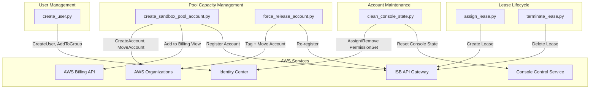
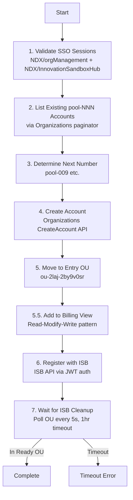

# ISB Utils

> **Last Updated**: 2026-03-02
> **Source**: [innovation-sandbox-on-aws-utils](https://github.com/co-cddo/innovation-sandbox-on-aws-utils)
> **Captured SHA**: `aa7e781`

## Executive Summary

The ISB Utils repository is a collection of Python CLI scripts for manual operational management of the Innovation Sandbox account pool and lease lifecycle. These tools automate multi-step AWS workflows that span Organizations, Identity Center, the ISB API, and the billing separator, providing operators with reliable scripts for pool capacity expansion, lease management, account recovery, and console state cleanup. All scripts authenticate via AWS SSO profiles and communicate with the ISB API using self-signed JWTs.

## Tool Inventory

The repository contains six standalone Python scripts, each addressing a specific operational workflow:

| Script | Purpose | Key APIs Used |
|--------|---------|---------------|
| `create_sandbox_pool_account.py` | Create and register new pool accounts | Organizations, Billing, ISB Lambda |
| `assign_lease.py` | Assign a lease from a template for a user | ISB API (JWT auth) |
| `terminate_lease.py` | Terminate all active leases for a user | ISB API (JWT auth) |
| `force_release_account.py` | Force-release quarantined accounts | Organizations, ISB API |
| `create_user.py` | Create Identity Center users and add to ISB group | Identity Store |
| `clean_console_state.py` | Reset AWS Console state on recycled accounts | SSO Admin, CCS API |

### Operational Workflow Overview

```mermaid
graph TB
    subgraph "Pool Capacity Management"
        CREATE[create_sandbox_pool_account.py]
        FORCE[force_release_account.py]
    end

    subgraph "Lease Lifecycle"
        ASSIGN[assign_lease.py]
        TERMINATE[terminate_lease.py]
    end

    subgraph "User Management"
        USER[create_user.py]
    end

    subgraph "Account Maintenance"
        CLEAN[clean_console_state.py]
    end

    subgraph "AWS Services"
        ORGS[AWS Organizations]
        IDC[Identity Center]
        ISB_API[ISB API Gateway]
        BILLING[AWS Billing API]
        CCS[Console Control Service]
    end

    CREATE -->|CreateAccount, MoveAccount| ORGS
    CREATE -->|Add to Billing View| BILLING
    CREATE -->|Register Account| ISB_API

    FORCE -->|Tag + Move Account| ORGS
    FORCE -->|Re-register| ISB_API

    ASSIGN -->|Create Lease| ISB_API
    TERMINATE -->|Delete Lease| ISB_API

    USER -->|CreateUser, AddToGroup| IDC

    CLEAN -->|Assign/Remove PermissionSet| IDC
    CLEAN -->|Reset Console State| CCS
```

## create_sandbox_pool_account.py

The primary pool provisioning tool. Automates a 7-step workflow for adding new AWS accounts to the Innovation Sandbox pool.

**Source**: `create_sandbox_pool_account.py` (28,999 bytes)

### Workflow

```mermaid
graph TD
    START[Start] --> SSO[1. Validate SSO Sessions<br/>NDX/orgManagement + NDX/InnovationSandboxHub]
    SSO --> LIST[2. List Existing pool-NNN Accounts<br/>via Organizations paginator]
    LIST --> NUMBER[3. Determine Next Number<br/>pool-009 etc.]
    NUMBER --> CREATE[4. Create Account<br/>Organizations CreateAccount API]
    CREATE --> MOVE[5. Move to Entry OU<br/>ou-2laj-2by9v0sr]
    MOVE --> BILLING[5.5. Add to Billing View<br/>Read-Modify-Write pattern]
    BILLING --> REGISTER[6. Register with ISB<br/>ISB API via JWT auth]
    REGISTER --> WAIT[7. Wait for ISB Cleanup<br/>Poll OU every 5s, 1hr timeout]
    WAIT -->|In Ready OU| DONE[Complete]
    WAIT -->|Timeout| FAIL[Timeout Error]
```

### Key Implementation Details

- **Account naming**: Pattern `pool-NNN` (zero-padded 3 digits), determined by scanning existing accounts
- **Email pattern**: `ndx-try-provider+gds-ndx-try-aws-pool-NNN@dsit.gov.uk` (Gmail-style `+` addressing)
- **OU structure**: Root (`r-2laj`) -> Entry OU (`ou-2laj-2by9v0sr`) -> Ready OU (`ou-2laj-oihxgbtr`) after ISB cleanup
- **Billing view**: Uses read-modify-write pattern on custom billing view (`arn:aws:billing::955063685555:billingview/custom-466e2613-...`)
- **ISB registration**: Calls ISB API Gateway with self-signed JWT (Admin role)
- **Recovery**: Can resume from any step by providing account ID as argument
- **Cleanup wait**: Polls account OU every 5 seconds, typical duration 8-12 minutes, 1-hour timeout

## assign_lease.py

Assigns a lease from a named ISB template for a specified user (or the current SSO identity).

**Source**: `assign_lease.py` (18,608 bytes)

- Authenticates via SSO profiles (NDX/orgManagement for identity, NDX/InnovationSandboxHub for secrets)
- Retrieves JWT signing secret from Secrets Manager
- Constructs signed JWT with user identity
- Calls ISB API `POST /leases` with template name
- Monitors lease until it reaches Active or terminal state
- Tracks active leases across statuses: Active, Frozen, Provisioning, PendingApproval

## terminate_lease.py

Terminates all active leases for a user.

**Source**: `terminate_lease.py` (12,386 bytes)

- Lists all leases for the target user via ISB API
- Filters for active statuses (Active, Frozen, Provisioning, PendingApproval)
- Calls ISB API `DELETE /leases/{leaseId}` for each active lease
- Confirms termination with status polling

## force_release_account.py

Force-releases quarantined accounts from the billing separator's 91-day hold, bypassing the normal quarantine period.

**Source**: `force_release_account.py` (11,044 bytes)

- Accepts specific account IDs or `--all` flag for bulk operation
- Tags each account with `do-not-separate` (billing separator bypass tag)
- Moves accounts from Quarantine OU to Entry OU
- Re-registers with ISB API to trigger a cleanup cycle
- The billing separator respects the `do-not-separate` tag and skips quarantine on the next cycle

This tool is the operational complement to the billing separator's bypass tag feature documented in [21-billing-separator.md](./21-billing-separator.md).

## create_user.py

Creates a user in AWS Identity Center and adds them to the ISB users group.

**Source**: `create_user.py` (6,997 bytes)

- Uses NDX/orgManagement profile for Identity Store API access
- Discovers the Identity Store ID from SSO Admin
- Creates user with provided email and name
- Adds user to `ndx_IsbUsersGroup` for ISB access
- Handles existing user detection

## clean_console_state.py

Resets AWS Management Console state (recently visited services, favorites, dashboard, theme, locale) on recycled sandbox accounts. This state persists across account recycling because it is stored by the Console Control Service (CCS), an undocumented internal AWS service that stores per-principal user preference data outside the account's resource plane.

**Source**: `clean_console_state.py` (31,796 bytes)

### Approach

1. Discovers sandbox accounts from the AWS Organizations OU structure
2. Temporarily assigns the current user's SSO principal to each ISB permission set
3. Obtains SSO role credentials for each permission set assignment
4. Calls CCS APIs (undocumented) to reset console state for that principal
5. Removes the temporary permission set assignments

Uses SigV4 authentication for the CCS API calls. Note that CCS state is per-caller (keyed on full assumed-role ARN including session name), so the script must be run with credentials for each user whose console state needs cleaning.

## Authentication Pattern

All scripts share a common authentication pattern:

1. **SSO Session Validation**: Check if existing SSO session is valid via `sts:GetCallerIdentity`
2. **SSO Login**: Prompt for login only if session is expired
3. **JWT Construction**: For ISB API calls, retrieve the JWT signing secret from Secrets Manager and construct a signed JWT with HMAC-SHA256
4. **API Calls**: Use the signed JWT as a Bearer token against the ISB API Gateway

The ISB API base URL and JWT secret path are configured either as constants in the scripts or via environment variables (`ISB_API_BASE_URL`, `ISB_JWT_SECRET_PATH`).

### Required SSO Profiles

| Profile | Account | Purpose |
|---------|---------|---------|
| `NDX/orgManagement` | Organization Management | Organizations API, Identity Store API |
| `NDX/InnovationSandboxHub` | Hub (955063685555) | Secrets Manager, ISB Lambda invocation |

## Configuration Constants

Key constants shared across scripts:

| Constant | Value | Description |
|----------|-------|-------------|
| SSO Start URL | `https://d-9267e1e371.awsapps.com/start` | AWS SSO portal |
| ISB API Base URL | `https://1ewlxhaey6.execute-api.us-west-2.amazonaws.com/prod/` | ISB API Gateway |
| JWT Secret Path | `/InnovationSandbox/ndx/Auth/JwtSecret` | Secrets Manager path |
| Entry OU | `ou-2laj-2by9v0sr` | OU for new account registration |
| Ready OU | `ou-2laj-oihxgbtr` | OU for available accounts post-cleanup |
| Pool OU | `ou-2laj-4dyae1oa` | Parent sandbox OU |
| Active OU | `ou-2laj-sre4rnjs` | OU for accounts with active leases |
| ISB Users Group | `ndx_IsbUsersGroup` | Identity Center group for ISB access |
| Billing View ARN | `arn:aws:billing::955063685555:billingview/custom-466e2613-...` | Custom billing view |

## Technology Stack

| Component | Technology |
|-----------|------------|
| Language | Python 3.x |
| Dependencies | boto3, botocore (SigV4 for CCS) |
| Authentication | AWS SSO via CLI profiles |
| ISB Auth | HMAC-SHA256 signed JWTs |
| Package Management | pip with venv |
| Execution | Manual CLI invocation |

## Error Handling

All scripts implement:
- SSO session validation with automatic re-login prompts
- Step-by-step progress reporting with visual indicators
- Recovery from partial execution (e.g., `create_sandbox_pool_account.py` can resume from any step)
- Timeout handling with configurable wait periods
- Non-blocking failures for optional steps (e.g., billing view update)

## Security Considerations

- **No long-lived credentials**: All access via SSO session tokens
- **JWT signing**: Uses Secrets Manager for signing secret, constructs minimal JWTs
- **Least privilege**: Scripts use separate SSO profiles scoped to required permissions
- **Email security**: Pool account emails use `+` addressing to a single controlled inbox (`ndx-try-provider@dsit.gov.uk`)
- **CCS API access**: Requires temporary permission set assignments, cleaned up after use

---
*Generated from source analysis of `innovation-sandbox-on-aws-utils` at SHA `aa7e781`. See [00-repo-inventory.md](./00-repo-inventory.md) for full inventory. Cross-references: [10-isb-core-architecture.md](./10-isb-core-architecture.md), [21-billing-separator.md](./21-billing-separator.md), [11-lease-lifecycle.md](./11-lease-lifecycle.md).*
