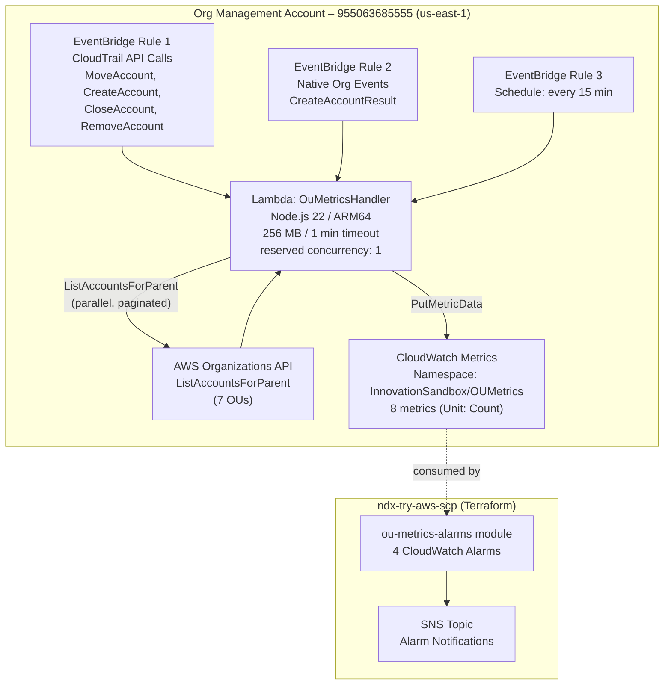
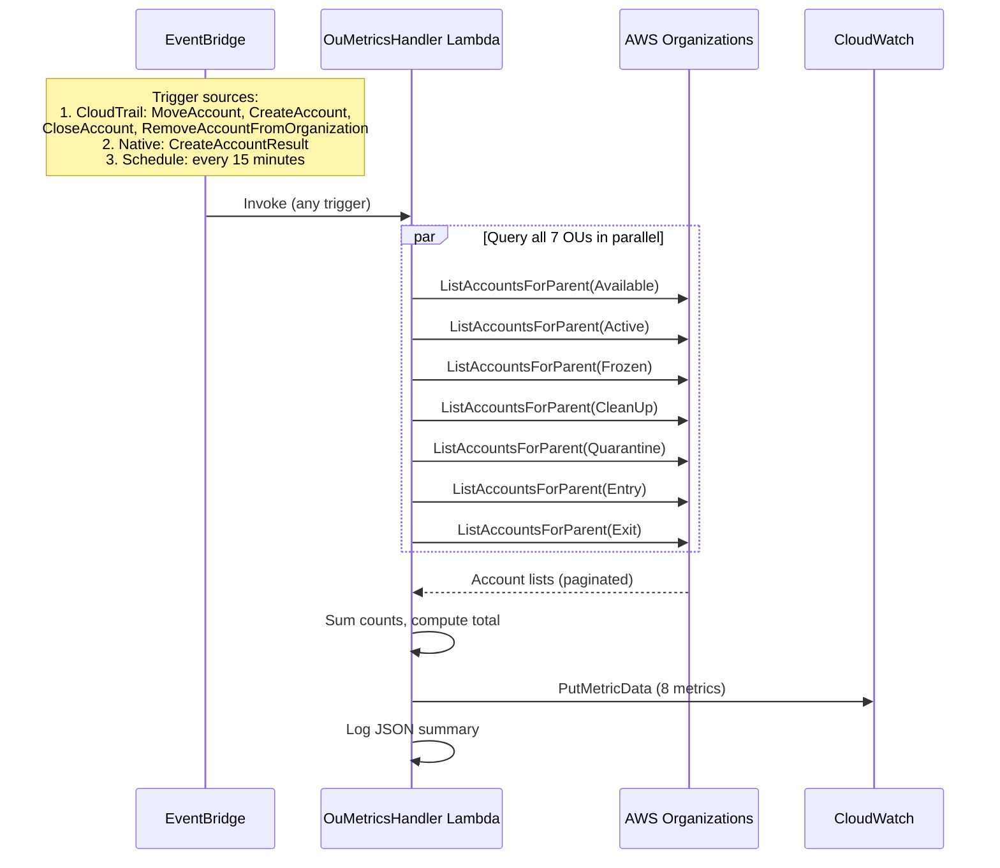

# OU Account Metrics (Stop-Gap)

> **Last Updated**: 2026-03-06
> **Source**: [co-cddo/innovation-sandbox-on-aws-ou-metrics](https://github.com/co-cddo/innovation-sandbox-on-aws-ou-metrics)
> **Captured SHA**: `ae49b62`

## Executive Summary

The OU Account Metrics service is a stop-gap CDK application that publishes CloudWatch custom metrics for account counts across the seven Innovation Sandbox (ISB) Organisational Units. It fills a gap in the upstream ISB solution, which only emits OU account counts as structured logs and provides no CloudWatch metrics for alarming or dashboarding. This service is intended to be retired when upstream [issue #110](https://github.com/aws-solutions/innovation-sandbox-on-aws/issues/110) adds native metric support.

## Architecture

The service deploys a single Lambda function into the AWS Organizations management account (`955063685555`) in `us-east-1`. Three EventBridge rules trigger the Lambda: two event-driven rules for real-time responsiveness and one scheduled rule for staleness prevention.

### Event-Driven Triggers

Each invocation performs a full recount of all seven OUs regardless of the trigger source, making it idempotent and tolerant of missed events.

## Key Components

### Lambda Handler

**Source**: `lambda/handler.ts`

The handler reads OU IDs from the `OU_IDS` environment variable (JSON map of OU name to OU ID) and the metric namespace from `METRIC_NAMESPACE`. On invocation it:

1. Queries all 7 OUs in parallel using `paginateListAccountsForParent` from the AWS SDK v3
2. Counts accounts in each OU
3. Computes a total across all OUs
4. Publishes 8 metrics (7 per-OU counts + 1 total) via a single `PutMetricData` call
5. Logs the counts as structured JSON

The Lambda is configured with `reservedConcurrentExecutions: 1` to prevent concurrent executions from publishing conflicting metric values.

### CDK Stack

**Source**: `lib/ou-metrics-stack.ts`

The `OuMetricsStack` provisions:

| Resource | Configuration |
|----------|---------------|
| Lambda function | Node.js 22, ARM64, 256 MB, 1 minute timeout, reserved concurrency 1 |
| IAM policy | `organizations:ListAccountsForParent` on `*`; `cloudwatch:PutMetricData` on `*` with namespace condition |
| EventBridge Rule 1 | CloudTrail API calls: `MoveAccount`, `CreateAccount`, `CloseAccount`, `RemoveAccountFromOrganization` |
| EventBridge Rule 2 | Native Organizations events: `CreateAccountResult` |
| EventBridge Rule 3 | Scheduled rate: every 15 minutes |
| Lambda target config | Max event age 6 hours, 3 retry attempts |

## Metrics Reference

All metrics are published to the `InnovationSandbox/OUMetrics` namespace with `Unit: Count` and no dimensions.

| Metric Name | Description |
|---|---|
| `AvailableAccounts` | Accounts in the Available OU -- ready to be leased to users |
| `ActiveAccounts` | Accounts in the Active OU -- currently leased to a sandbox user |
| `FrozenAccounts` | Accounts in the Frozen OU -- lease expired, pending cleanup |
| `CleanUpAccounts` | Accounts in the CleanUp OU -- resources being destroyed |
| `QuarantineAccounts` | Accounts in the Quarantine OU -- cleanup failed, needs manual intervention |
| `EntryAccounts` | Accounts in the Entry OU -- transitional, being moved into the pool |
| `ExitAccounts` | Accounts in the Exit OU -- transitional, being moved out of the pool |
| `TotalManagedAccounts` | Sum of all 7 OU counts above |

## Alarm Integration

The companion Terraform module `ndx-try-aws-scp/modules/ou-metrics-alarms/` consumes the metrics published by this service and creates four CloudWatch alarms. It is deployed separately as part of the SCP/Terraform infrastructure in the management account.

**Source**: `modules/ou-metrics-alarms/main.tf`, `variables.tf`, `outputs.tf` in [ndx-try-aws-scp](https://github.com/co-cddo/ndx-try-aws-scp)

| Alarm | Metric | Condition | Rationale |
|---|---|---|---|
| `low-available-accounts` | `AvailableAccounts` | `< 30` (configurable) for 1 datapoint | Pool running low; users may not be able to get a sandbox |
| `stuck-entry-accounts` | `EntryAccounts` | `> 0` for 4 consecutive datapoints (~1 hour) | Accounts stuck transitioning into the pool |
| `stuck-exit-accounts` | `ExitAccounts` | `> 0` for 4 consecutive datapoints (~1 hour) | Accounts stuck transitioning out of the pool |
| `metrics-stale` | `TotalManagedAccounts` | `INSUFFICIENT_DATA` for ~30 minutes | Lambda may have failed or been disabled; uses `treat_missing_data = "breaching"` |

All alarms publish to a configurable SNS topic for both ALARM and OK transitions. The evaluation period defaults to 900 seconds (15 minutes), matching the Lambda's heartbeat schedule.

### Terraform Variables

| Variable | Type | Default | Description |
|---|---|---|---|
| `namespace` | `string` | `"ndx"` | ISB namespace prefix for alarm names |
| `sns_topic_arn` | `string` | (required) | SNS topic ARN for notifications |
| `available_accounts_threshold` | `number` | `30` | Threshold below which the low-available alarm fires |
| `metric_period_seconds` | `number` | `900` | Evaluation period in seconds |
| `tags` | `map(string)` | `{}` | Resource tags |

## OU Mapping

These OU IDs are configured in `cdk.json` and are specific to the NDX ISB deployment.

| OU Name | OU ID | ISB Lifecycle Stage |
|---|---|---|
| Available | `ou-2laj-oihxgbtr` | Ready pool -- accounts waiting to be leased |
| Active | `ou-2laj-sre4rnjs` | In use -- leased to a sandbox user |
| Frozen | `ou-2laj-jpffue7g` | Lease expired -- pending cleanup |
| CleanUp | `ou-2laj-x3o8lbk8` | Cleanup in progress -- resources being destroyed |
| Quarantine | `ou-2laj-mmagoake` | Cleanup failed -- requires manual intervention |
| Entry | `ou-2laj-2by9v0sr` | Transitional -- being moved into the pool |
| Exit | `ou-2laj-s1t02mrz` | Transitional -- being moved out of the pool |

## Dependencies

### Runtime

| Dependency | Version | Purpose |
|---|---|---|
| `@aws-sdk/client-organizations` | `^3.750.0` | Organizations API for `ListAccountsForParent` |
| `@aws-sdk/client-cloudwatch` | `^3.750.0` | CloudWatch API for `PutMetricData` |
| `aws-cdk-lib` | `^2.180.0` | CDK infrastructure definitions |
| `constructs` | `^10.4.2` | CDK construct base |

### Dev

| Dependency | Version | Purpose |
|---|---|---|
| `typescript` | `^5.7.0` | Type checking |
| `vitest` | `^3.0.0` | Unit and snapshot tests |
| `tsx` | `^4.19.0` | TypeScript execution |
| `aws-cdk` | `^2.180.0` | CDK CLI |

## Integration Points

### Upstream (data sources)

- **AWS Organizations** -- the Lambda queries the Organizations API directly in the management account; no cross-account role assumption is needed since the Lambda itself runs in the management account.

### Downstream (consumers)

- **CloudWatch Alarms** -- the `ou-metrics-alarms` Terraform module in `ndx-try-aws-scp` creates alarms against the published metrics (see [41-terraform-scp.md](./41-terraform-scp.md)).
- **CloudWatch Dashboards** -- operators can build dashboards against the `InnovationSandbox/OUMetrics` namespace for real-time pool visibility.
- **ISB Core** -- the metrics complement the lease lifecycle described in [11-lease-lifecycle.md](./11-lease-lifecycle.md) by providing external observability of account movements between OUs.

### Deployment

- Deployed via CDK to account `955063685555` (Org Management) in `us-east-1` using the `NDX/orgManagement` SSO profile.
- The region is hardcoded to `us-east-1` because Organizations CloudTrail events flow through the org trail's home region.

## Issues Discovered

1. **Stop-gap nature**: This service exists only because the upstream ISB solution does not publish OU account metrics natively ([issue #110](https://github.com/aws-solutions/innovation-sandbox-on-aws/issues/110)). It should be retired when the upstream fix is released.

2. **Management account deployment**: The Lambda runs in the Organizations management account, which is a sensitive security context. This is unavoidable because `ListAccountsForParent` can only be called from the management account or a delegated administrator, and ISB does not configure a delegated administrator for Organizations.

3. **No dimensions on metrics**: Metrics are published as bare names without CloudWatch dimensions. This is sufficient for the single-deployment NDX use case, but would not support multi-environment metric separation without namespace changes.

4. **Single-region constraint**: The stack is hardcoded to `us-east-1`. If the Organizations trail home region changes, the EventBridge rules for CloudTrail events would stop matching.

5. **No dead-letter queue**: The Lambda target is configured with retry attempts (3) and max event age (6 hours), but there is no DLQ for permanently failed invocations. The 15-minute heartbeat schedule mitigates this -- a missed event-driven invocation will be corrected by the next scheduled run.

6. **Reserved concurrency of 1**: While this prevents conflicting concurrent metric publications, it means that a burst of Organization events could be throttled. The retry configuration (3 attempts, 6-hour max age) handles this, but operators should be aware that metric publication may lag during high-activity periods.

---
*Generated from source analysis of `innovation-sandbox-on-aws-ou-metrics` at SHA `ae49b62`. See [00-repo-inventory.md](./00-repo-inventory.md) for full inventory. Cross-references: [10-isb-core-architecture.md](./10-isb-core-architecture.md), [11-lease-lifecycle.md](./11-lease-lifecycle.md), [02-aws-organization.md](./02-aws-organization.md), [41-terraform-scp.md](./41-terraform-scp.md).*
