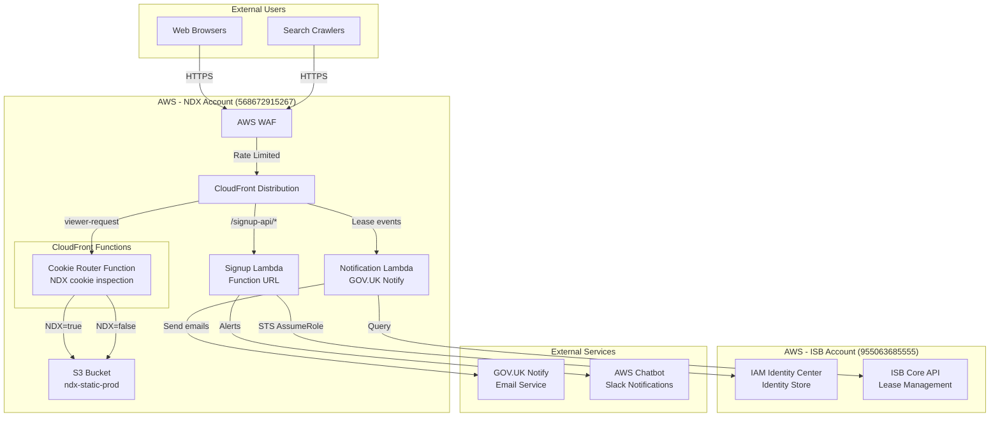
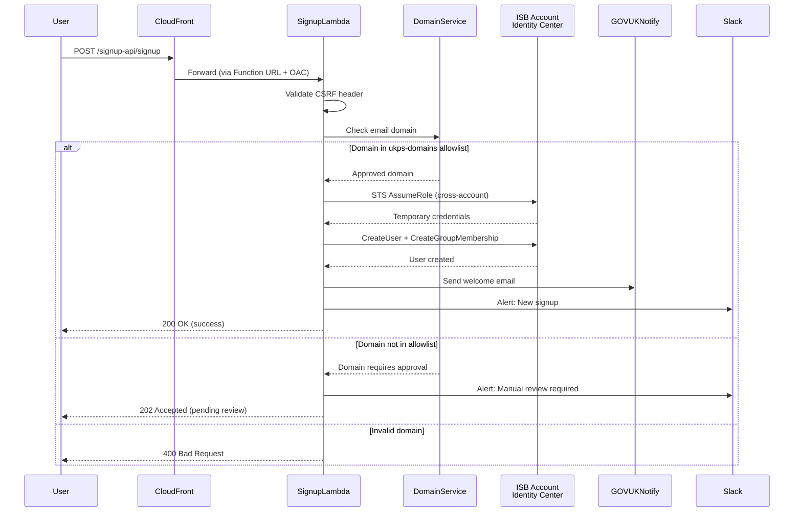
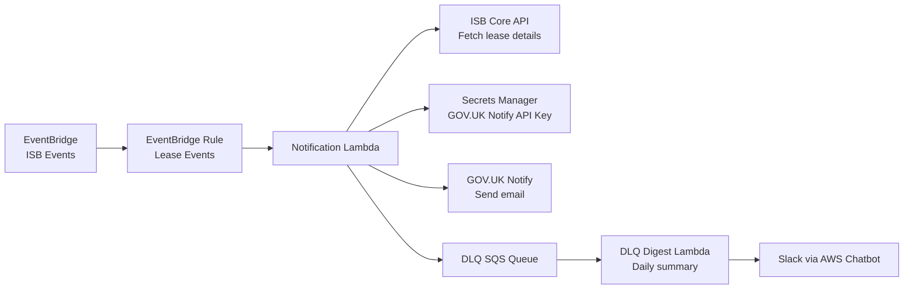

# NDX Website

## Executive Summary

The NDX (National Digital Exchange) website is a public-facing static site built with Eleventy (11ty) v3.x and hosted on AWS using CloudFront + S3. It serves as the primary informational platform for the NDX initiative, featuring a service catalogue, "Try Before You Buy" functionality, user signup flows, and educational content for UK local government digital transformation.

**Key Capabilities:**
- Static site generation with Eleventy 11ty v3.x
- GOV.UK Design System integration (WCAG 2.2 AA compliant)
- CloudFront distribution with cookie-based routing
- Lambda-powered user signup system
- Catalogue of cloud services with Try integration
- WAF-protected with rate limiting

**Technology Stack:** TypeScript, Node.js 20, Eleventy, AWS CDK, CloudFront, S3, Lambda Function URLs

**Hosting Architecture:** CloudFront → S3 (static assets) + Lambda (signup API)

**Status:** Production (Alpha phase)

---

## Architecture Overview

### System Context



---

## Eleventy Static Site Architecture

### Configuration Analysis

**File:** `/Users/cns/httpdocs/cddo/ndx-try-arch/repos/ndx/eleventy.config.js`

The Eleventy configuration implements a sophisticated build pipeline:

#### Key Features

**1. TypeScript Bundling with esbuild**
- Two separate bundles: `try.bundle.js` and `signup.bundle.js`
- Development mode: Watch mode with sourcemaps
- Production mode: Minified, no sourcemaps
- Target: ES2020, ESM format
- Entry points:
  - `src/try/main.ts` → Try Before You Buy interactions
  - `src/signup/main.ts` → Signup form functionality

**2. GOV.UK Eleventy Plugin Integration**
```javascript
eleventyConfig.addPlugin(govukEleventyPlugin, {
  titleSuffix: "ALPHA",
  header: {
    productName: "National Digital Exchange",
    phaseBanner: {
      tag: { text: "Alpha" }
    }
  },
  stylesheets: ["/assets/styles.css"],
  scripts: ["/assets/try.bundle.js"],
  serviceNavigation: {
    navigation: [
      { text: "Home", href: "/" },
      { text: "About", href: "/About/" },
      { text: "Catalogue", href: "/catalogue/tags/try-before-you-buy/" },
      { text: "Try", href: "/try" },
      { text: "Optimise", href: "/optimise/" }
    ]
  }
})
```

**3. Collections**

| Collection | Purpose | Filter Logic |
|------------|---------|-------------|
| `catalogue` | All service catalogue items | `src/catalogue/**/*.md`, sorted alphabetically |
| `catalogueByTag` | Services grouped by tags | Tagged items indexed by tag name |
| `catalogueTryable` | Try-enabled services | Filtered by `try: true` metadata |
| `challenges` | Innovation challenges | `src/challenges/**/*.md`, sorted by date |
| `news` | News articles | `src/discover/news/**/*.md` |
| `event` | Events | `src/discover/events/**/*.md` |
| `casestudy` | Case studies | `src/discover/case-studies/**/*.md` |
| `productAssessments` | Product reviews | `src/product-assessments/**/*.md` |

**4. Content Validation**

UUID Validation for Try Metadata:
```javascript
function validateTryMetadata(data, inputPath) {
  if (data.try_id && !isValidUUID(data.try_id)) {
    console.warn(`⚠️ Invalid try_id format in ${inputPath}`)
  }
  if (data.try_id && data.try !== true) {
    console.warn(`⚠️ ${inputPath} has try_id but try is not set to true`)
  }
}
```

**5. Mermaid Diagram Support**

Plugin: `eleventy-mermaid-transform`
- Transforms Mermaid code blocks to SVG at build time
- Theme: default
- Eliminates client-side rendering dependency

**6. Remote Image Fetching**

Plugin: `eleventy-remote-images`
- Fetches external images at build time (img.shields.io, cdn.jsdelivr.net)
- Reduces external dependencies for better performance
- Caches images locally in `_site/`

---

## Site Structure

### Source Directory Organization

```
src/
├── About/                      # About NDX pages
├── accessibility.md            # WCAG accessibility statement
├── assets/                     # Static assets
│   ├── styles.scss            # Main stylesheet (compiled)
│   ├── try.bundle.js          # Try functionality (esbuild output)
│   ├── signup.bundle.js       # Signup forms (esbuild output)
│   └── catalogue/             # Service logos and images
├── begin/                      # Getting started guides
│   ├── check-assumptions.md
│   ├── get-access.md
│   └── review-bill-of-materials.md
├── catalogue/                  # Service catalogue
│   ├── anthropic/
│   ├── aws/
│   ├── cloudflare/
│   ├── govuk/
│   ├── microsoft/
│   └── tags/                  # Tag landing pages
├── challenges/                 # Innovation challenges
├── cookies.md                  # Cookie policy
├── discover/                   # News, events, case studies
│   ├── news/
│   ├── events/
│   └── case-studies/
├── optimise/                   # Optimization resources
├── privacy.md                  # Privacy policy
├── product-assessments/        # Product reviews
├── reviews/                    # User reviews
├── robots.txt                  # Search engine directives
├── signup/                     # Signup flow pages
├── try/                        # Try Before You Buy functionality
│   └── main.ts                # Try bundle entry point
└── _includes/                  # Nunjucks templates
    ├── layouts/
    │   ├── page.njk
    │   ├── product-try.njk
    │   ├── signup-page.njk
    │   └── try-page.njk
    └── components/
```

### Key Content Types

**1. Service Catalogue Items**

Example: `src/catalogue/aws/council-chatbot.md`

Frontmatter schema:
```yaml
---
title: Council Chatbot (24/7 AI Resident Support)
description: Intelligent chatbot powered by Amazon Bedrock
image: /assets/catalogue/aws/aws-logo.svg
vendor: AWS
tags:
  - AI
  - try-before-you-buy
  - Amazon
try: true
try_id: 550e8400-e29b-41d4-a716-446655440000
deployment_time: "15 minutes"
estimated_cost: "Free (within AWS Free Tier)"
---
```

**2. Try-Enabled Products**

Requirements for Try integration:
- `try: true` in frontmatter
- Valid UUID in `try_id` field
- Corresponding CloudFormation template in `ndx_try_aws_scenarios`
- Deployment metadata (time, cost)

**3. Layouts**

| Layout | Purpose | Used For |
|--------|---------|----------|
| `page.njk` | Base layout | Standard content pages |
| `product-try.njk` | Try-enabled products | Catalogue items with try: true |
| `signup-page.njk` | Signup forms | User registration pages |
| `try-page.njk` | Try console | Try Before You Buy interface |

---

## Infrastructure: CDK Stack

### Main Stack Components

**File:** `/Users/cns/httpdocs/cddo/ndx-try-arch/repos/ndx/infra/lib/ndx-stack.ts`

#### 1. S3 Bucket for Static Assets

```typescript
const bucket = new s3.Bucket(this, "StaticSiteBucket", {
  bucketName: config.bucketName,         // ndx-static-prod
  encryption: s3.BucketEncryption.S3_MANAGED,
  blockPublicAccess: s3.BlockPublicAccess.BLOCK_ALL,
  versioned: true,                        // Rollback capability
  removalPolicy: cdk.RemovalPolicy.RETAIN // Protect production data
})
```

**Security Features:**
- All public access blocked (CloudFront-only via OAC)
- Server-side encryption (S3-managed keys)
- Versioning enabled for rollback
- Bucket policy restricts to CloudFront service principal

**Bucket Policy:**
```json
{
  "Sid": "AllowCloudFrontServicePrincipal",
  "Effect": "Allow",
  "Principal": {
    "Service": "cloudfront.amazonaws.com"
  },
  "Action": "s3:GetObject",
  "Resource": "arn:aws:s3:::ndx-static-prod/*",
  "Condition": {
    "StringEquals": {
      "AWS:SourceArn": "arn:aws:cloudfront::ACCOUNT:distribution/DIST_ID"
    }
  }
}
```

#### 2. CloudFront Distribution Integration

**Strategy:** Modify existing CloudFront distribution (not managed by CDK)

**Custom Resource Lambda:**
- Function: `AddCloudFrontOriginFunction`
- Runtime: Node.js 20
- Purpose: Add/update origins and cache behaviors via CloudFront API
- Permissions: `cloudfront:GetDistribution`, `cloudfront:UpdateDistribution`

**Origins Added:**

| Origin ID | Domain | Purpose | OAC Type |
|-----------|--------|---------|----------|
| `ndx-static-prod-origin` | `ndx-static-prod.s3.eu-west-2.amazonaws.com` | Static site assets | S3 |
| `ndx-signup-lambda-origin` | `{lambda-url}.lambda-url.eu-west-2.on.aws` | Signup API | Lambda |

#### 3. Cookie-Based Routing

**CloudFront Function:** `ndx-cookie-router`

**Location:** `/Users/cns/httpdocs/cddo/ndx-try-arch/repos/ndx/infra/lib/functions/cookie-router.js`

**Purpose:** Inspect `NDX` cookie and route to appropriate S3 origin

**Function Logic:**
```javascript
function handler(event) {
  var request = event.request;
  var cookies = request.cookies;

  // Check for NDX cookie
  if (cookies.NDX && cookies.NDX.value === 'true') {
    // Route to ndx-static-prod origin
    request.origin = {
      s3: {
        domainName: 'ndx-static-prod.s3.eu-west-2.amazonaws.com',
        region: 'eu-west-2',
        authMethod: 'origin-access-control',
        path: ''
      }
    };
  }

  return request;
}
```

**Attached to:** Default cache behavior, `viewer-request` event

#### 4. Cache Policy

**Name:** `NdxCookieRoutingPolicy`

**Configuration:**
```typescript
new cloudfront.CachePolicy(this, "NdxCookieRoutingPolicy", {
  defaultTtl: cdk.Duration.seconds(86400),      // 1 day
  minTtl: cdk.Duration.seconds(1),
  maxTtl: cdk.Duration.seconds(31536000),       // 1 year
  cookieBehavior: cloudfront.CacheCookieBehavior.allowList("NDX"),
  queryStringBehavior: cloudfront.CacheQueryStringBehavior.all(),
  headerBehavior: cloudfront.CacheHeaderBehavior.none(),
  enableAcceptEncodingGzip: true,
  enableAcceptEncodingBrotli: true
})
```

**Rationale:**
- Forward only `NDX` cookie to CloudFront Function
- Users without cookie share cache (efficiency)
- Query strings forwarded for analytics

#### 5. Response Headers Policy

**Name:** `NdxSecurityHeadersPolicy`

**Security Headers:**
```javascript
{
  "Content-Security-Policy": [
    "upgrade-insecure-requests",
    "default-src 'none'",
    "object-src 'none'",
    "script-src 'self'",
    "style-src 'self'",
    "img-src 'self' data: https://www.google-analytics.com",
    "font-src 'self' data:",
    "connect-src 'self' https://www.google-analytics.com https://analytics.google.com https://region1.google-analytics.com",
    "manifest-src 'self'",
    "frame-ancestors 'none'",
    "base-uri 'none'"
  ].join("; "),
  "X-Frame-Options": "DENY",
  "X-Content-Type-Options": "nosniff",
  "Referrer-Policy": "no-referrer",
  "Strict-Transport-Security": "max-age=46656000; includeSubdomains"
}
```

**CSP Allows:**
- Google Analytics 4 Measurement Protocol
- Self-hosted scripts and styles
- Data URIs for images and fonts

#### 6. Signup Lambda Cache Behavior

**Path Pattern:** `/signup-api/*`

**Origin:** Lambda Function URL (from `infra-signup/`)

**Cache Policy:** AWS managed `4135ea2d-6df8-44a3-9df3-4b5a84be39ad` (CachingDisabled)

**Origin Request Policy:** AWS managed `b689b0a8-53d0-40ab-baf2-68738e2966ac` (AllViewerExceptHostHeader)

**OAC:** Lambda OAC with SigV4 signing

---

## Signup Flow Infrastructure

### Architecture Diagram



### Signup Lambda Stack

**Repository:** `/Users/cns/httpdocs/cddo/ndx-try-arch/repos/ndx/infra-signup/`

**Stack File:** `lib/signup-stack.ts`

#### Lambda Function

**Handler:** `lib/lambda/signup/handler.ts`

**Configuration:**
```typescript
const signupFunction = new lambdaNodejs.NodejsFunction(this, 'SignupFunction', {
  runtime: lambda.Runtime.NODEJS_20_X,
  handler: 'handler',
  entry: path.join(__dirname, 'lambda/signup/handler.ts'),
  timeout: cdk.Duration.seconds(30),
  memorySize: 512,
  environment: {
    IDENTITY_STORE_ID: process.env.IDENTITY_STORE_ID,
    GROUP_ID: process.env.GROUP_ID,
    CROSS_ACCOUNT_ROLE_ARN: process.env.CROSS_ACCOUNT_ROLE_ARN,
    DOMAIN_ALLOWLIST_CACHE_TTL: '300'  // 5 minutes
  }
})
```

**IAM Permissions:**
- `sts:AssumeRole` on cross-account role
- Lambda execution basics (CloudWatch Logs)
- Function URL invocation (via CloudFront OAC)

#### Services Architecture

**File:** `lib/lambda/signup/services.ts`

**1. Domain Service**
- Fetches UK public sector domains from `ukps-domains` list
- Caches allowlist for 5 minutes (ADR-044)
- Validates email domain against allowlist
- Handles unlisted domains (manual approval flow)

**2. Identity Store Service**
- Assumes cross-account role in ISB account
- Creates user in IAM Identity Center
- Adds user to "NDX Users" group
- Scoped permissions (ADR-043):
  - `identitystore:CreateUser` (scoped to IDENTITY_STORE_ID)
  - `identitystore:CreateGroupMembership` (scoped to GROUP_ID)

**3. Notification Service**
- Sends emails via GOV.UK Notify
- Posts to Slack via AWS Chatbot
- Event-driven architecture (EventBridge)

#### Cross-Account Role

**Template:** `isb-cross-account-role.yaml`

**Deployed to:** ISB Account (955063685555)

**Trust Policy:**
```json
{
  "Effect": "Allow",
  "Principal": {
    "AWS": "arn:aws:iam::568672915267:root"
  },
  "Action": "sts:AssumeRole",
  "Condition": {
    "StringEquals": {
      "sts:ExternalId": "ndx-signup-external-id"
    }
  }
}
```

**Permissions:**
```json
{
  "Effect": "Allow",
  "Action": [
    "identitystore:CreateUser",
    "identitystore:ListUsers",
    "identitystore:DescribeUser",
    "identitystore:CreateGroupMembership"
  ],
  "Resource": [
    "arn:aws:identitystore::955063685555:identitystore/d-xxxxxxxxxx",
    "arn:aws:identitystore:::group/d-xxxxxxxxxx/xxxxxxxx-xxxx-xxxx-xxxx-xxxxxxxxxxxx"
  ]
}
```

---

## Notification Stack

**File:** `/Users/cns/httpdocs/cddo/ndx-try-arch/repos/ndx/infra/lib/notification-stack.ts`

### Purpose

Send email notifications when ISB lease events occur:
- Lease approved
- Lease terminated
- Lease expired
- Deployment complete

### Architecture



### Event Patterns

**Subscribed Events:**
- `isb.leases.LeaseApproved`
- `isb.leases.LeaseTerminated`
- `isb.leases.LeaseExpired`
- `isb.leases.DeploymentComplete`

**Event Source:** ISBEventBus (cross-account EventBridge)

### Lambda Handler

**File:** `lib/lambda/notification/handler.ts`

**Processing Steps:**
1. Validate event schema
2. Check idempotency (DynamoDB deduplication)
3. Enrich event data (fetch from ISB API)
4. Select email template based on event type
5. Send via GOV.UK Notify API
6. Handle failures (DLQ for retry)

**Templates:**

| Event Type | Template ID | Variables |
|------------|-------------|-----------|
| LeaseApproved | `approved-template-id` | accountId, accessUrl, expiresAt |
| LeaseTerminated | `terminated-template-id` | accountId, costReport, leaseId |
| LeaseExpired | `expired-template-id` | accountId, leaseId |
| DeploymentComplete | `deployment-template-id` | scenarioName, resourceUrls |

### Dead Letter Queue

**Purpose:** Capture failed notifications for manual review

**Processing:**
- DLQ Digest Lambda runs daily (EventBridge schedule)
- Aggregates failed messages
- Sends summary to Slack
- Operators can retry or investigate

---

## WAF Stack

**File:** `/Users/cns/httpdocs/cddo/ndx-try-arch/repos/ndx/infra/lib/waf-stack.ts`

### Purpose

Protect NDX website from abuse and cost attacks (ADR-046)

### WAF Rules

**1. Rate Limiting**
```typescript
const rateLimitRule = new wafv2.CfnWebACL.RuleProperty({
  name: 'RateLimit',
  priority: 1,
  statement: {
    rateBasedStatement: {
      limit: 100,                    // 100 requests per 5 minutes
      aggregateKeyType: 'IP'
    }
  },
  action: { block: {} }
})
```

**2. Signup API Rate Limit**
```typescript
const signupRateLimitRule = new wafv2.CfnWebACL.RuleProperty({
  name: 'SignupRateLimit',
  priority: 2,
  statement: {
    rateBasedStatement: {
      limit: 5,                      // 5 signups per 5 minutes
      aggregateKeyType: 'IP',
      scopeDownStatement: {
        byteMatchStatement: {
          searchString: '/signup-api/',
          fieldToMatch: { uriPath: {} },
          textTransformations: [{ priority: 0, type: 'LOWERCASE' }]
        }
      }
    }
  },
  action: { block: {} }
})
```

**3. AWS Managed Rules**
- `AWSManagedRulesCommonRuleSet` - OWASP Top 10
- `AWSManagedRulesKnownBadInputsRuleSet` - Known attack patterns

**4. Geographic Restrictions**
- Optional country allowlist (configured via CDK context)
- Default: No restrictions (global access)

### CloudWatch Metrics

**Custom Metrics:**
- `WAFBlockedRequests` - Blocked request count
- `WAFAllowedRequests` - Allowed request count
- `WAFRateLimitTriggered` - Rate limit activations

**Alarms:**
- High block rate (> 100 blocks/min)
- Signup abuse (> 50 signup attempts/5min)

---

## Deployment Pipeline

### GitHub Actions Workflows

**Location:** `.github/workflows/`

#### 1. CI Workflow (`ci.yaml`)

**Triggers:**
- Push to `main`
- Pull requests

**Jobs:**
- `lint` - ESLint + Prettier
- `test` - Jest unit tests
- `build` - Eleventy build
- `accessibility` - Pa11y a11y tests
- `lighthouse` - Lighthouse CI performance

**Accessibility Testing:**
```yaml
- name: Run Pa11y
  run: |
    yarn start:prod &
    sleep 5
    yarn test:pa11y
```

**Pa11y Configuration:** `.pa11yci.json`
```json
{
  "defaults": {
    "standard": "WCAG2AA",
    "runners": ["axe", "htmlcs"],
    "chromeLaunchConfig": {
      "args": ["--no-sandbox"]
    }
  },
  "urls": [
    "http://localhost:8080/",
    "http://localhost:8080/catalogue/",
    "http://localhost:8080/signup/"
  ]
}
```

#### 2. Infrastructure Workflow (`infra.yaml`)

**Triggers:**
- Push to `main` (when `infra/**` or `infra-signup/**` changes)
- Manual workflow dispatch

**Jobs:**

| Job | Description | Account | Outputs |
|-----|-------------|---------|---------|
| `ndx-stack-deploy` | Deploy main CDK stack | NDX (568672915267) | CloudFront distribution details |
| `signup-cdk-deploy` | Deploy signup Lambda | NDX | Lambda Function URL |
| `isb-cross-account-role-deploy` | Deploy cross-account role | ISB (955063685555) | Role ARN |
| `notification-stack-deploy` | Deploy notification Lambda | NDX | Lambda ARN |
| `waf-stack-deploy` | Deploy WAF rules | NDX (us-east-1) | WebACL ARN |

**Deployment Order:**
1. ISB cross-account role (prerequisite)
2. Signup Lambda stack
3. Main NDX stack (adds CloudFront behaviors)
4. Notification stack
5. WAF stack (us-east-1 region for CloudFront)

**OIDC Configuration:**

NDX Account:
```yaml
- name: Configure AWS Credentials
  uses: aws-actions/configure-aws-credentials@v4
  with:
    role-to-assume: arn:aws:iam::568672915267:role/GitHubActions-InfraDeploy
    role-session-name: github-actions-ndx-deploy
    aws-region: eu-west-2
```

ISB Account:
```yaml
- name: Configure AWS Credentials (ISB)
  uses: aws-actions/configure-aws-credentials@v4
  with:
    role-to-assume: arn:aws:iam::955063685555:role/GitHubActions-ISB-InfraDeploy
    role-session-name: github-actions-isb-deploy
    aws-region: eu-west-2
```

#### 3. Test Workflow (`test.yml`)

**Triggers:**
- Pull requests
- Push to `main`

**Jobs:**
- `unit-tests` - Jest tests for TypeScript modules
- `integration-tests` - API endpoint testing
- `e2e-tests` - Playwright end-to-end tests

**E2E Test Scenarios:**
- Signup form submission
- Catalogue browsing
- Try Before You Buy flow

---

## Content Management

### Adding a Try-Enabled Service

**Step 1:** Create catalogue entry

`src/catalogue/vendor/service-name.md`
```yaml
---
title: Service Name
description: Brief description
image: /assets/catalogue/vendor/logo.svg
vendor: Vendor Name
tags:
  - AI
  - try-before-you-buy
try: true
try_id: 550e8400-e29b-41d4-a716-446655440000  # Generate new UUID
deployment_time: "15 minutes"
estimated_cost: "Free"
---

# Service Name

Full service description...

## Key Features
- Feature 1
- Feature 2

## Use Cases
- Use case 1
- Use case 2
```

**Step 2:** Add CloudFormation template to `ndx_try_aws_scenarios`

See [docs/32-scenarios-microsite.md](32-scenarios-microsite.md) for details.

**Step 3:** Test locally

```bash
yarn dev
# Visit http://localhost:8080/catalogue/vendor/service-name/
```

**Step 4:** Deploy

```bash
git add .
git commit -m "Add Service Name to Try catalogue"
git push origin main
```

### Content Frontmatter Schema

**Standard Page:**
```yaml
---
title: Page Title
description: SEO description
layout: page.njk
eleventyNavigation:
  key: Page Key
  parent: Parent Key (optional)
  order: 1
---
```

**Catalogue Item:**
```yaml
---
title: Service Name
description: Service description
image: /path/to/logo.svg
vendor: Vendor Name
tags: [tag1, tag2]
try: true  # Enable Try Before You Buy
try_id: UUID  # Required if try: true
deployment_time: "X minutes"
estimated_cost: "Cost estimate"
---
```

**Challenge:**
```yaml
---
title: Challenge Title
date: 2026-01-15
department: DEFRA
difficulty: intermediate
persona: technical
description: Challenge description
---
```

---

## Monitoring & Observability

### CloudWatch Metrics

**NDX Stack Metrics:**

| Metric Name | Namespace | Description |
|-------------|-----------|-------------|
| `CloudFrontRequests` | AWS/CloudFront | Total requests to distribution |
| `CloudFrontBytesDownloaded` | AWS/CloudFront | Data transferred |
| `4xxErrorRate` | AWS/CloudFront | Client error rate |
| `5xxErrorRate` | AWS/CloudFront | Server error rate |
| `CacheMissRate` | AWS/CloudFront | Cache effectiveness |

**Signup Lambda Metrics:**

| Metric Name | Namespace | Description |
|-------------|-----------|-------------|
| `SignupSuccess` | NDX/Signup | Successful signups |
| `SignupPendingApproval` | NDX/Signup | Signups awaiting approval |
| `SignupError` | NDX/Signup | Failed signup attempts |
| `DomainCacheHit` | NDX/Signup | Domain allowlist cache hits |
| `CrossAccountCallDuration` | NDX/Signup | STS AssumeRole latency |

**WAF Metrics:**

| Metric Name | Namespace | Description |
|-------------|-----------|-------------|
| `BlockedRequests` | AWS/WAFV2 | Blocked by WAF rules |
| `AllowedRequests` | AWS/WAFV2 | Passed WAF rules |
| `CountedRequests` | AWS/WAFV2 | Counted but not blocked |

### CloudWatch Alarms

**Critical Alarms:**

| Alarm Name | Condition | Action |
|------------|-----------|--------|
| `NDX-HighErrorRate` | 5xx errors > 5% for 5 minutes | SNS notification |
| `NDX-CloudFrontDown` | No requests for 10 minutes | SNS + PagerDuty |
| `NDX-SignupFailures` | > 10 signup errors in 5 minutes | SNS + Slack |
| `NDX-WAFBlockStorm` | > 1000 blocks in 5 minutes | SNS (potential attack) |
| `NDX-S3BucketAccessDenied` | S3 403 errors > 0 | SNS (OAC misconfiguration) |

**Warning Alarms:**

| Alarm Name | Condition | Action |
|------------|-----------|--------|
| `NDX-HighCacheMissRate` | Cache miss rate > 50% for 30 minutes | SNS |
| `NDX-SlowResponseTime` | P99 latency > 5s for 10 minutes | SNS |
| `NDX-HighDataTransfer` | Data transfer > 1TB/day | SNS (cost alert) |

### Logging Strategy

**CloudFront Logs:**
- Standard logs disabled (cost optimization)
- Real-time logs to Kinesis (optional for debugging)

**Lambda Logs:**
- CloudWatch Log Groups: `/aws/lambda/ndx-signup-*`
- Retention: 30 days
- Structured JSON logging:
```json
{
  "timestamp": "2026-02-03T12:00:00Z",
  "level": "INFO",
  "requestId": "abc-123",
  "action": "SIGNUP_CREATE",
  "email": "user@example.gov.uk",
  "domain": "example.gov.uk",
  "domainApproved": true,
  "duration": 1234
}
```

**EventBridge Logs:**
- Archive enabled (7 days)
- Replay capability for failed notifications

---

## Security Considerations

### Authentication & Authorization

**Public Website:**
- No authentication required
- Rate limiting via WAF

**Signup API:**
- CSRF protection via custom header (ADR-045)
- Domain validation (ukps-domains allowlist)
- Cross-account role with scoped permissions

**IAM Identity Center Integration:**
- Users created in ISB account Identity Store
- Group membership: "NDX Users"
- No direct API keys or passwords (SSO only)

### Data Protection

**PII Handling:**
- Email addresses processed in Lambda (encrypted in transit)
- No PII stored in logs (email redacted after validation)
- GOV.UK Notify handles email delivery (UK-based, GDPR compliant)

**Encryption:**
- S3 bucket: S3-managed encryption (SSE-S3)
- Lambda environment variables: AWS managed KMS key
- Secrets Manager: AWS managed KMS key
- CloudFront: TLS 1.2+ enforced

### Network Security

**CloudFront:**
- TLS 1.2 minimum
- HTTP → HTTPS redirect
- Custom domain: `ndx.digital.cabinet-office.gov.uk`
- Certificate: ACM certificate in us-east-1

**S3 Bucket:**
- All public access blocked
- CloudFront OAC only
- Bucket policy restricts to specific distribution

**Lambda Function URL:**
- AWS_IAM auth type
- CloudFront OAC signs requests (SigV4)
- No direct public access

---

## Performance Optimization

### CloudFront Caching Strategy

**Static Assets:**
- Cache-Control: `max-age=31536000, immutable`
- Versioned filenames (e.g., `styles.abc123.css`)
- Cache hit ratio target: > 95%

**HTML Pages:**
- Cache-Control: `max-age=86400, must-revalidate`
- Cookie-based routing for personalization
- Stale-while-revalidate for resilience

**API Endpoints:**
- No caching (CachingDisabled policy)
- AllViewerExceptHostHeader origin request policy

### Build Optimization

**Eleventy Build:**
- Incremental builds in development (watch mode)
- Minification in production (esbuild)
- Image optimization (remote images fetched at build time)

**Asset Pipeline:**
- TypeScript → esbuild → minified JS
- SCSS → Sass → minified CSS
- Mermaid diagrams → pre-rendered SVG

**Build Performance:**
- Development: ~5 seconds
- Production: ~30 seconds (full rebuild)
- Deploy: ~2 minutes (CloudFront invalidation)

### Lambda Cold Start Optimization

**Signup Lambda:**
- Runtime: Node.js 20 (fastest cold start)
- Memory: 512MB (balance cost vs performance)
- Bundling: esbuild (reduces package size)
- Dependencies: Minimized (only essential libraries)
- Cold start: ~800ms
- Warm invocation: ~50ms

---

## Disaster Recovery

### Backup Strategy

**S3 Bucket:**
- Versioning enabled (rollback capability)
- Cross-region replication: Disabled (cost optimization)
- Manual backup before major deployments

**Infrastructure as Code:**
- CDK stacks in version control (Git)
- CloudFormation change sets for review
- Stack drift detection enabled

### Rollback Procedures

**Static Site Rollback:**
```bash
# Revert to previous version
aws s3 cp s3://ndx-static-prod/ s3://ndx-static-prod-backup/ --recursive
aws s3 sync s3://ndx-static-prod-backup-PREVIOUS/ s3://ndx-static-prod/
aws cloudfront create-invalidation --distribution-id DIST_ID --paths "/*"
```

**Infrastructure Rollback:**
```bash
# Revert CDK stack
cd infra
git checkout PREVIOUS_COMMIT
yarn cdk deploy NdxStaticStack --require-approval never
```

**Lambda Rollback:**
```bash
# Use Lambda versioning
aws lambda update-alias \
  --function-name ndx-signup \
  --name production \
  --function-version PREVIOUS_VERSION
```

### Recovery Time Objectives

| Component | RTO | RPO | Recovery Procedure |
|-----------|-----|-----|-------------------|
| Static Site | 15 minutes | 0 (versioned) | S3 version rollback + invalidation |
| Signup Lambda | 5 minutes | 0 (stateless) | Lambda alias update |
| CloudFront | 0 (HA) | N/A | Multi-edge distribution |
| Infrastructure | 30 minutes | Latest commit | CDK redeploy |

---

## Cost Analysis

### Monthly Cost Estimate (Production)

**Assumptions:**
- 100,000 page views/month
- 500 signups/month
- 10GB data transfer/month

| Service | Usage | Monthly Cost |
|---------|-------|-------------|
| **CloudFront** | 100K requests + 10GB data | $1.20 |
| **S3** | 1GB storage + 100K requests | $0.50 |
| **Lambda (Signup)** | 500 invocations × 512MB × 1s | $0.10 |
| **Lambda (Notifications)** | 2000 invocations × 256MB × 500ms | $0.20 |
| **WAF** | 100K requests × 2 rules | $6.00 |
| **EventBridge** | 2000 events | $0.02 |
| **Secrets Manager** | 2 secrets | $1.00 |
| **CloudWatch Logs** | 500MB logs | $0.25 |
| **Route 53** | 1 hosted zone + 100K queries | $0.90 |
| **GOV.UK Notify** | 500 emails | Free (250K/year allowance) |
| **Total** | | **~£10/month** |

**Cost Optimization:**
- CloudFront invalidations limited (use versioned filenames)
- Lambda memory right-sized (512MB for signup, 256MB for notifications)
- S3 lifecycle policy for old versions (delete after 90 days)
- WAF rules minimized (only essential protection)

---

## Troubleshooting Guide

### Common Issues

**1. CloudFront Serving Stale Content**

**Symptoms:**
- Changes not visible after deployment
- Old version cached

**Solution:**
```bash
# Create invalidation
aws cloudfront create-invalidation \
  --distribution-id DIST_ID \
  --paths "/*"

# Or use CDK output
yarn cdk deploy NdxStaticStack --outputs-file outputs.json
```

**Prevention:**
- Use versioned filenames for assets
- Set appropriate Cache-Control headers

---

**2. Signup Lambda 403 Errors**

**Symptoms:**
- "Access Denied" errors in Lambda logs
- Users cannot sign up

**Root Causes:**
- Cross-account role trust policy misconfigured
- IAM permissions insufficient
- External ID mismatch

**Solution:**
```bash
# Verify cross-account role
aws sts assume-role \
  --role-arn arn:aws:iam::955063685555:role/ndx-signup-cross-account-role \
  --role-session-name test \
  --external-id ndx-signup-external-id

# Check Lambda environment variables
aws lambda get-function-configuration \
  --function-name ndx-signup \
  --query 'Environment.Variables'
```

---

**3. WAF Blocking Legitimate Traffic**

**Symptoms:**
- 403 errors from valid users
- High WAF blocked request count

**Solution:**
```bash
# Check WAF logs
aws wafv2 get-sampled-requests \
  --web-acl-arn WEB_ACL_ARN \
  --rule-metric-name RateLimit \
  --scope CLOUDFRONT \
  --time-window StartTime=EPOCH,EndTime=EPOCH

# Temporarily disable rule (emergency only)
aws wafv2 update-web-acl ...
```

---

**4. Slow Page Load Times**

**Symptoms:**
- Lighthouse performance score < 90
- CloudWatch metrics show high latency

**Diagnosis:**
```bash
# Check CloudFront cache hit ratio
aws cloudwatch get-metric-statistics \
  --namespace AWS/CloudFront \
  --metric-name CacheHitRate \
  --dimensions Name=DistributionId,Value=DIST_ID \
  --start-time 2026-02-03T00:00:00Z \
  --end-time 2026-02-03T23:59:59Z \
  --period 3600 \
  --statistics Average
```

**Solutions:**
- Optimize images (WebP format)
- Enable Brotli compression
- Preload critical assets
- Lazy load non-critical content

---

## Future Enhancements

### Planned Features

**1. User Dashboard (Epic 8)**
- User profile management
- Active leases display
- Cost tracking per user
- Lease history

**2. Advanced Analytics (Epic 9)**
- Google Analytics 4 integration
- Custom event tracking
- Conversion funnels
- User journey analysis

**3. Content Personalization (Epic 10)**
- Role-based content (technical vs non-technical)
- Saved services (bookmarks)
- Personalized recommendations

**4. Multi-Language Support (Epic 11)**
- Welsh language (legal requirement)
- Translation workflow
- Language switching UI

**5. Progressive Web App (Epic 12)**
- Service worker for offline access
- Install prompt
- Push notifications (lease expiry reminders)

---

## Related Documentation

- [31-signup-flow.md](31-signup-flow.md) - Detailed signup flow analysis
- [32-scenarios-microsite.md](32-scenarios-microsite.md) - Try scenarios integration
- [00-repo-inventory.md](00-repo-inventory.md) - Repository overview
- [10-isb-core-architecture.md](10-isb-core-architecture.md) - ISB integration
- [20-approver-system.md](20-approver-system.md) - Approval workflow

---

## Source Files Referenced

### Key Configuration Files

| File Path | Purpose | Lines |
|-----------|---------|-------|
| `/repos/ndx/eleventy.config.js` | Eleventy build configuration | 353 |
| `/repos/ndx/infra/lib/ndx-stack.ts` | Main CDK stack | 375 |
| `/repos/ndx/infra-signup/lib/signup-stack.ts` | Signup Lambda stack | ~200 |
| `/repos/ndx/infra/lib/notification-stack.ts` | Notification Lambda stack | ~300 |
| `/repos/ndx/infra/lib/waf-stack.ts` | WAF configuration | ~150 |
| `/repos/ndx/infra/lib/functions/cookie-router.js` | CloudFront Function | ~50 |

### Source Repositories

- **Main Website:** `/repos/ndx/`
- **Signup Infrastructure:** `/repos/ndx/infra-signup/`
- **Scenarios Microsite:** `/repos/ndx_try_aws_scenarios/` (see [32-scenarios-microsite.md](32-scenarios-microsite.md))

---

**Document Version:** 1.0
**Last Updated:** 2026-02-03
**Status:** Production (Alpha Phase)
