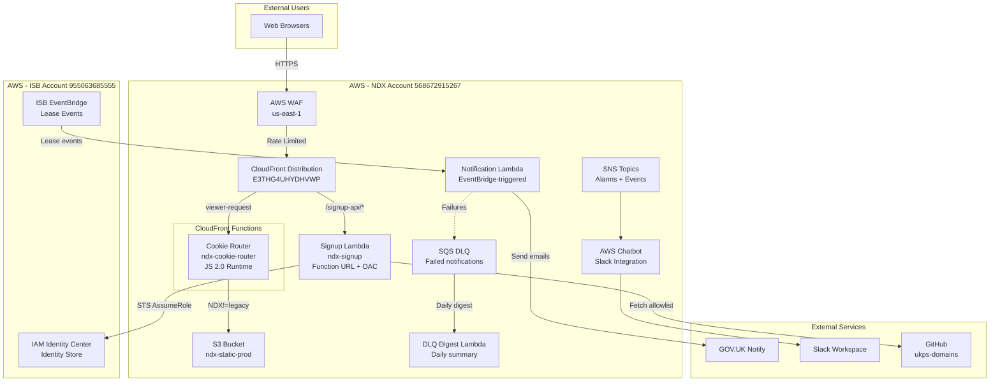

# NDX Website

> **Last Updated**: 2026-03-02
> **Source**: [https://github.com/co-cddo/ndx](https://github.com/co-cddo/ndx)
> **Captured SHA**: `a5bf368`

## Executive Summary

The National Digital Exchange (NDX) website is a public-facing static site built with Eleventy (11ty) v3.x and hosted on AWS using CloudFront and S3. It serves as the primary informational platform for the NDX initiative, providing a service catalogue with "Try Before You Buy" integration, a self-service signup system for UK public sector employees, and educational content on UK local government digital transformation. Infrastructure is managed through AWS CDK across two accounts (NDX and ISB), with a cookie-based CloudFront routing strategy that allows the NDX static site to coexist on the same distribution as the Innovation Sandbox UI.

## Architecture Overview


```mermaid
graph TB
    subgraph "External Users"
        BROWSER[Web Browsers]
    end

    subgraph "AWS - NDX Account 568672915267"
        WAF[AWS WAF<br/>us-east-1]
        CF[CloudFront Distribution<br/>E3THG4UHYDHVWP]

        subgraph "CloudFront Functions"
            COOKIE_ROUTER[Cookie Router<br/>ndx-cookie-router<br/>JS 2.0 Runtime]
        end

        S3[S3 Bucket<br/>ndx-static-prod]
        SIGNUP_LAMBDA[Signup Lambda<br/>ndx-signup<br/>Function URL + OAC]
        NOTIF_LAMBDA[Notification Lambda<br/>EventBridge-triggered]
        DLQ[SQS DLQ<br/>Failed notifications]
        DLQ_DIGEST[DLQ Digest Lambda<br/>Daily summary]
        SNS_ALERTS[SNS Topics<br/>Alarms + Events]
        CHATBOT[AWS Chatbot<br/>Slack Integration]
    end

    subgraph "AWS - ISB Account 955063685555"
        IDC[IAM Identity Center<br/>Identity Store]
        ISB_EVENTBUS[ISB EventBridge<br/>Lease Events]
    end

    subgraph "External Services"
        NOTIFY[GOV.UK Notify]
        SLACK[Slack Workspace]
        GITHUB_DOMAINS[GitHub<br/>ukps-domains]
    end

    BROWSER -->|HTTPS| WAF
    WAF -->|Rate Limited| CF
    CF -->|viewer-request| COOKIE_ROUTER
    COOKIE_ROUTER -->|NDX!=legacy| S3
    CF -->|/signup-api/*| SIGNUP_LAMBDA
    SIGNUP_LAMBDA -->|STS AssumeRole| IDC
    SIGNUP_LAMBDA -->|Fetch allowlist| GITHUB_DOMAINS
    ISB_EVENTBUS -->|Lease events| NOTIF_LAMBDA
    NOTIF_LAMBDA -->|Send emails| NOTIFY
    NOTIF_LAMBDA -.->|Failures| DLQ
    DLQ -->|Daily digest| DLQ_DIGEST
    SNS_ALERTS --> CHATBOT
    CHATBOT --> SLACK
```

## Eleventy Static Site Configuration

**File**: `repos/ndx/eleventy.config.js` (353 lines)

The Eleventy configuration implements a multi-bundle build pipeline with GOV.UK Design System integration.

### GOV.UK Plugin Configuration

The site uses `@x-govuk/govuk-eleventy-plugin` v8.3.1 with the following navigation structure:

| Navigation Item | Path |
|-----------------|------|
| Home | `/` |
| About | `/About/` |
| Catalogue | `/catalogue/tags/try-before-you-buy/` |
| Try | `/try` |
| Optimise | `/optimise/` |

The site is branded as "National Digital Exchange" in Alpha phase, with a user research link in the phase banner pointing to ConsentKit.

### TypeScript Bundling with esbuild

Two separate JavaScript bundles are produced via esbuild:

| Bundle | Entry Point | Output | Purpose |
|--------|------------|--------|---------|
| Try | `src/try/main.ts` | `src/assets/try.bundle.js` | Try Before You Buy interactions |
| Signup | `src/signup/main.ts` | `src/assets/signup.bundle.js` | Signup form functionality |

Both bundles target ES2020 in ESM format. In development mode, esbuild uses context-based watch mode with sourcemaps; in production, bundles are minified without sourcemaps.

### Eleventy Collections

| Collection | Source Glob | Sort | Purpose |
|------------|-----------|------|---------|
| `catalogue` | `src/catalogue/**/*.md` | Alphabetical by title | Service catalogue items |
| `catalogueByTag` | Same as catalogue | Grouped by tag name | Tag-indexed services |
| `catalogueTryable` | Same, filtered `try: true` | Alphabetical | Try-enabled services only |
| `challenges` | `src/challenges/**/*.md` | Date descending | Innovation challenges |
| `reviews` | `src/reviews/**/*.md` | Date descending | User reviews |
| `news` | `src/discover/news/**/*.md` | Default | News articles |
| `event` | `src/discover/events/**/*.md` | Default | Events |
| `casestudy` | `src/discover/case-studies/**/*.md` | Default | Case studies |
| `productAssessments` | `src/product-assessments/**/*.md` | Date descending | Product reviews |

### Content Validation

UUID validation is enforced at build time for Try metadata on catalogue items. The build warns if `try_id` is not a valid UUID or if a `try_id` is present without `try: true`.

### Plugins

- **Mermaid Transform** (`lib/eleventy-mermaid-transform.js`): Converts Mermaid code blocks to SVG at build time, eliminating client-side rendering.
- **Remote Images** (`lib/eleventy-remote-images.js`): Fetches images from `img.shields.io` and `cdn.jsdelivr.net` at build time to reduce external dependencies.
- **Remote Include**: Shortcode that fetches content from GitHub via `cdn.jsdelivr.net`, with relative image URL rewriting.

## Site Structure

```
src/
├── About/                      # About NDX pages
├── _includes/                  # Nunjucks templates
├── acceptable-use-policy.md    # AUP
├── accessibility.md            # WCAG 2.2 AA statement
├── assets/                     # Static assets (CSS, JS bundles, images)
├── begin/                      # Getting started guides
├── catalogue/                  # Service catalogue (aws/, anthropic/, cloudflare/, govuk/, microsoft/)
│   └── tags/                   # Tag landing pages
├── challenges/                 # Innovation challenges
├── cookies.md                  # Cookie policy
├── index.md                    # Homepage
├── optimise/                   # Optimisation resources
├── privacy.md                  # Privacy policy
├── product-assessments/        # Product reviews
├── reviews/                    # User reviews
├── robots.txt                  # Search engine directives
├── sass/                       # SCSS source files
├── signup/                     # Signup flow pages (8 files)
├── signup.md                   # Signup landing page
├── try/                        # Try Before You Buy functionality (12 files)
└── todo.md                     # Internal tracker
```

### Catalogue Item Frontmatter Schema

```yaml
---
title: Service Name
description: Brief description
image: /assets/catalogue/vendor/logo.svg
vendor: Vendor Name
tags: [AI, try-before-you-buy]
try: true                                              # Enable Try integration
try_id: 550e8400-e29b-41d4-a716-446655440000           # Valid UUID required
deployment_time: "15 minutes"
estimated_cost: "Free"
---
```

## Infrastructure: CDK Stacks

The NDX infrastructure is split across four CDK stacks plus one CloudFormation template, deployed to the NDX account (568672915267) with one cross-account deployment to the ISB account (955063685555).

### NdxStaticStack (`infra/lib/ndx-stack.ts`)

Provisions the S3 bucket and integrates with the existing CloudFront distribution.

**S3 Bucket** (`ndx-static-prod`):
- SSE-S3 encryption, all public access blocked
- Versioning enabled for rollback, `RETAIN` removal policy
- Bucket policy restricts `s3:GetObject` to CloudFront service principal scoped to distribution ARN

**CloudFront Integration**:
- Imports existing distribution `E3THG4UHYDHVWP` (not CDK-managed)
- Custom Resource Lambda (`AddCloudFrontOriginFunction`, Node.js 20) adds origins and cache behaviors via CloudFront API
- Two origins added: S3 origin with OAC, and Lambda Function URL origin with SigV4 OAC

**Cookie Router Function** (`ndx-cookie-router`, CloudFront JS 2.0):
- If `NDX=legacy` cookie present: routes to legacy ISB SPA origin, rewrites all non-file URIs to `/index.html`
- Otherwise: routes to `ndx-static-prod` S3 origin with OAC, rewrites directory-style URLs to `index.html`
- Safety routing for `/signup-api/*` and `/api/*` paths to their dedicated origins

**Cache Policy** (`NdxCookieRoutingPolicy`):
- Default TTL: 1 day, Max: 1 year
- Forwards only the `NDX` cookie
- All query strings forwarded
- Gzip and Brotli compression enabled

**Response Headers Policy** (`NdxSecurityHeadersPolicy`):
- Content Security Policy allowing Google Analytics 4 Measurement Protocol
- `X-Frame-Options: DENY`, `X-Content-Type-Options: nosniff`
- `Referrer-Policy: no-referrer`
- HSTS: 540 days with includeSubdomains

**Signup Lambda Cache Behavior** (`/signup-api/*`):
- Origin: Lambda Function URL with SigV4 OAC
- Cache policy: AWS managed CachingDisabled
- Origin request policy: AllViewerExceptHostHeader

### WafStack (`infra/lib/waf-stack.ts`)

Deployed to **us-east-1** (required for CloudFront WAF).

- Rate-based rule: 10 requests per 5-minute window per IP, scoped to `/signup-api/signup`
- Custom 429 response body with JSON error message
- CloudWatch Logs (`aws-waf-logs-ndx-signup`, 90-day retention)
- Sampled requests enabled for forensics

### NdxNotificationStack (`infra/lib/notification-stack.ts`)

Event-driven notification system processing ISB lease lifecycle events.

**Components**:
- Notification Lambda (Node.js 20, 512MB, 30s timeout) with X-Ray tracing
- EventBridge rules subscribing to ISB event bus for lease events
- GOV.UK Notify integration for user emails (Secrets Manager for API key)
- AWS Chatbot integration for Slack ops alerts (EventBridge to SNS to Chatbot)
- SQS Dead Letter Queue (14-day retention) with daily digest Lambda
- CloudWatch dashboard with alarm thresholds for DLQ depth, Lambda errors, secret rotation, deliverability rates

**Notification Lambda Modules** (33 files in `infra/lib/lambda/notification/`):
- `handler.ts`: Main event processor
- `enrichment.ts`: Event data enrichment from ISB API
- `templates.ts`: GOV.UK Notify email template management
- `validation.ts`: Event schema validation
- `idempotency.ts`: DynamoDB-based deduplication
- `ownership.ts`: Lease ownership tracking
- `notify-sender.ts`: GOV.UK Notify API integration
- `secrets.ts`: Secrets Manager client with rotation tracking
- `dlq-digest-handler.ts`: Daily DLQ summary for Slack

### SignupStack (`infra-signup/lib/signup-stack.ts`)

See [31-signup-flow.md](31-signup-flow.md) for detailed analysis.

### GitHub Actions Stack (`infra/lib/github-actions-stack.ts`)

Provisions OIDC roles for GitHub Actions CI/CD pipelines.

## Deployment Pipeline

### CI Workflow (`ci.yaml`)

Triggers on push to `main`, pull requests, and merge queue.

**Path-based optimization**: Frontend changes (files outside `infra/` and `docs/`) trigger build/test/deploy. Infrastructure-only changes skip frontend jobs.

| Job | Description | Parallelism |
|-----|-------------|-------------|
| `build` | Eleventy build, lint (Prettier), artifact upload | Single |
| `test-unit` | Jest unit tests | Single |
| `test-e2e` | Playwright E2E tests | 2 shards |
| `test-a11y` | Playwright accessibility tests | 2 shards |
| `deploy-s3` | S3 sync + CloudFront invalidation | Only on `main` merge |
| `semver` | Semantic version generation | Single |

**Deployment** (main branch only):
1. Download build artifact
2. OIDC authentication via `GitHubActions-NDX-ContentDeploy` role
3. `aws s3 sync` to `ndx-static-prod` with `max-age=3600`
4. Smoke test: validate `index.html` exists
5. CloudFront invalidation (`/*`)

### Infrastructure Workflow (`infra.yaml`)

Triggers on push to `main`, pull requests, and merge queue.

| Job | Trigger | Account | Description |
|-----|---------|---------|-------------|
| `infra-unit-tests` | `infra/**` changes | N/A | Jest unit tests for CDK stacks |
| `cdk-diff` | PR only (non-fork) | NDX (readonly) | CDK diff posted as PR comment |
| `cdk-deploy` | Main merge | NDX (568672915267) | Deploy all CDK stacks |
| `signup-infra-unit-tests` | `infra-signup/**` changes | N/A | Jest tests for signup stack |
| `signup-cdk-deploy` | Main merge | NDX (568672915267) | Deploy signup Lambda |
| `isb-cross-account-role-deploy` | Main merge | ISB (955063685555) | Deploy cross-account IAM role |

**Security measures**:
- OIDC authentication (no long-lived credentials)
- Fork PRs blocked from assuming AWS roles (both at workflow and IAM level)
- Separate readonly (`InfraDiff`) and deploy (`InfraDeploy`) roles
- `step-security/harden-runner` on all jobs

### Deploy Script (`scripts/deploy.sh`)

Manual deployment script for local use:
1. Validates `_site/` directory exists
2. `aws s3 sync` with `NDX/InnovationSandboxHub` profile
3. File count validation between local and remote
4. Smoke tests: `index.html`, CSS, JS files
5. CloudFront invalidation for distribution `E3THG4UHYDHVWP`

## Testing Strategy

| Layer | Tool | Coverage |
|-------|------|----------|
| Unit Tests | Jest 30 + ts-jest | TypeScript modules, lib plugins |
| E2E Tests | Playwright 1.58 | Auth, catalogue, signup, smoke, try flows |
| Accessibility | Playwright + axe-core | WCAG 2.2 AA compliance per page |
| Lint | Prettier 3.8 | Code formatting (120 char width, no semicolons) |
| Infrastructure | Jest | CDK snapshot and assertion tests |

**Local E2E setup** requires mitmproxy (`scripts/mitmproxy-addon.py`) running on port 8081 to intercept and mock ISB API calls during development.

## Environment Variables

| Variable | Description | Default |
|----------|-------------|---------|
| `AWS_SSO_PORTAL_URL` | AWS SSO portal for console access | `https://d-9267e1e371.awsapps.com/start` |
| `API_BASE_URL` | Innovation Sandbox API base URL | `/api` |
| `REQUEST_TIMEOUT` | API request timeout (ms) | `10000` |
| `PATH_PREFIX` | Eleventy path prefix | `/` |

## Security Posture

- **TLS**: 1.2+ enforced on CloudFront, HSTS 540 days
- **CSP**: Restrictive policy with `default-src 'none'`, only self and Google Analytics allowed
- **WAF**: Rate limiting on signup API (10 req/5min per IP)
- **S3**: All public access blocked, OAC-only via CloudFront
- **Lambda**: IAM auth on Function URL, SigV4 signing via OAC
- **OIDC**: GitHub Actions uses short-lived tokens, no stored credentials
- **Fork Protection**: CDK diff/deploy blocked for fork PRs at workflow and IAM level

## Related Documentation

- [31-signup-flow.md](31-signup-flow.md) - Detailed signup flow analysis
- [32-scenarios-microsite.md](32-scenarios-microsite.md) - Try scenarios integration
- [00-repo-inventory.md](00-repo-inventory.md) - Repository overview
- [10-isb-core-architecture.md](10-isb-core-architecture.md) - ISB core architecture
- [23-deployer.md](23-deployer.md) - ISB deployer integration

## Source Files Referenced

| File Path | Purpose | Lines |
|-----------|---------|-------|
| `repos/ndx/eleventy.config.js` | Eleventy build configuration | 353 |
| `repos/ndx/package.json` | Dependencies and scripts | 74 |
| `repos/ndx/infra/lib/ndx-stack.ts` | Main CDK stack | 374 |
| `repos/ndx/infra/lib/notification-stack.ts` | Notification infrastructure | 1000+ |
| `repos/ndx/infra/lib/waf-stack.ts` | WAF rate limiting | 182 |
| `repos/ndx/infra/lib/config.ts` | Environment configuration | ~200 |
| `repos/ndx/infra/lib/functions/cookie-router.js` | CloudFront Function | 66 |
| `repos/ndx/infra/lib/functions/add-cloudfront-origin.ts` | Custom Resource Lambda | 500+ |
| `repos/ndx/infra-signup/lib/signup-stack.ts` | Signup Lambda stack | 371 |
| `repos/ndx/scripts/deploy.sh` | Manual deploy script | 74 |
| `repos/ndx/.github/workflows/ci.yaml` | CI pipeline | 331 |
| `repos/ndx/.github/workflows/infra.yaml` | Infrastructure pipeline | 431 |

---
*Generated from source analysis. See [00-repo-inventory.md](./00-repo-inventory.md) for full inventory.*
