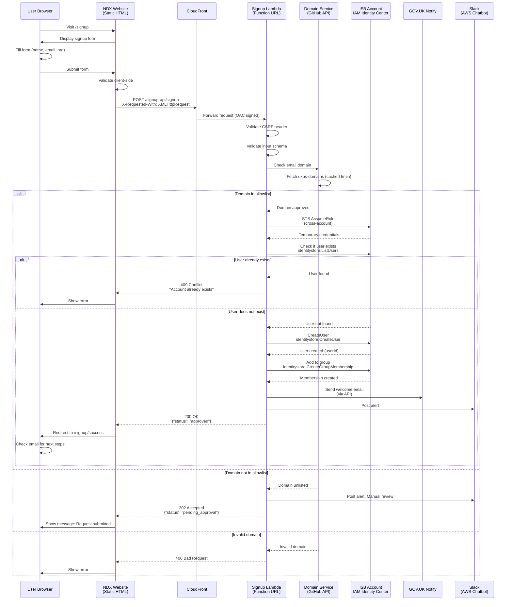

# NDX Signup Flow

## Executive Summary

The NDX Signup Flow is an end-to-end user registration system that enables UK public sector employees to self-service create accounts for accessing the NDX Try Before You Buy platform. The system integrates domain validation using the `ukps-domains` allowlist, cross-account IAM Identity Center user provisioning, and an approval workflow for unlisted domains.

**Key Capabilities:**
- Self-service account creation with email validation
- Automated domain verification against UK public sector domain allowlist
- Cross-account user provisioning in IAM Identity Center (ISB account)
- Manual approval workflow for unlisted domains
- GOV.UK Notify email notifications
- Slack alerting for operators
- CSRF protection and rate limiting

**Technology Stack:** TypeScript, Node.js 20, AWS Lambda Function URLs, IAM Identity Center, EventBridge, GOV.UK Notify

**Integration Points:** ukps-domains (GitHub), ISB IAM Identity Center, GOV.UK Notify, Slack (AWS Chatbot)

**Status:** Production (Alpha phase)

---

## Architecture Overview

### End-to-End Flow Diagram

---

## Related Documentation

- [30-ndx-website.md](30-ndx-website.md) - Main website architecture
- [00-repo-inventory.md](00-repo-inventory.md) - Repository overview
- [10-isb-core-architecture.md](10-isb-core-architecture.md) - ISB integration

---

## Source Files Referenced

| File Path | Purpose |
|-----------|---------|
| `/repos/ndx/src/signup/main.ts` | Frontend entry point |
| `/repos/ndx/infra-signup/lib/lambda/signup/handler.ts` | Lambda handler |
| `/repos/ndx/infra-signup/lib/lambda/signup/domain-service.ts` | Domain validation |
| `/repos/ndx/infra-signup/lib/signup-stack.ts` | CDK stack |

---

**Document Version:** 1.0
**Last Updated:** 2026-02-03
**Status:** Production (Alpha Phase)
