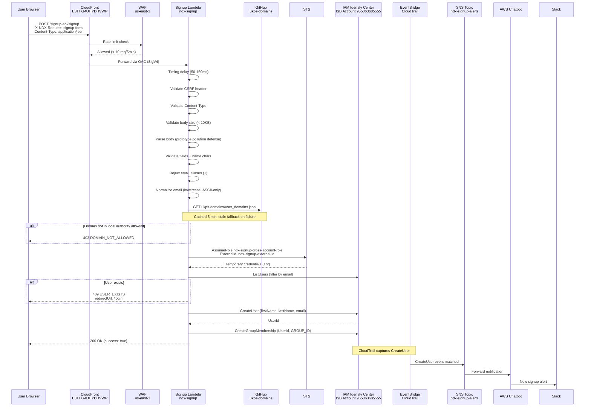
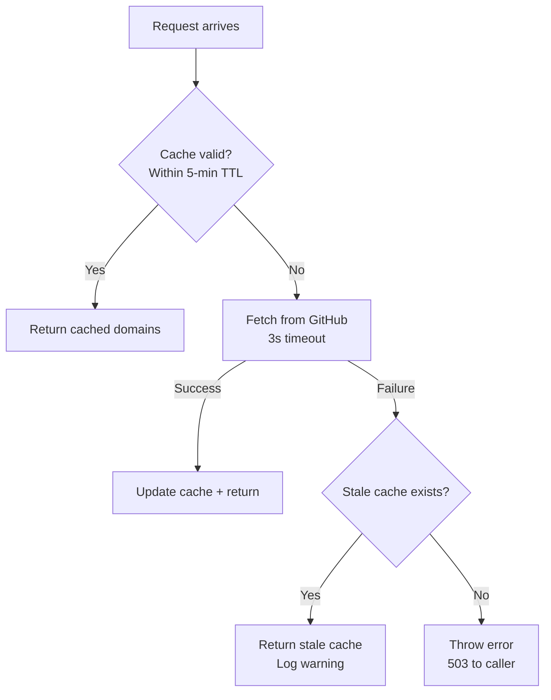
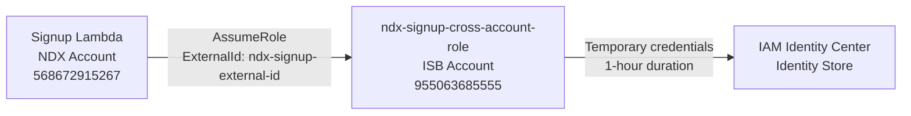

# Signup Flow

> **Last Updated**: 2026-03-06
> **Source**: [https://github.com/co-cddo/ndx](https://github.com/co-cddo/ndx)
> **Captured SHA**: `b846188`

## Executive Summary

The NDX Signup Flow is a self-service user registration system that provisions accounts for UK local government employees in the Innovation Sandbox's IAM Identity Center. The system validates email domains against the `ukps-domains` allowlist (filtered to local authority entries), creates users cross-account via STS role assumption, and provides operator alerting through AWS Chatbot to Slack. The entire flow is fronted by CloudFront with OAC-signed Lambda Function URL invocations, CSRF protection, WAF rate limiting, and structured JSON logging with PII redaction.

## End-to-End Signup Flow


```mermaid
sequenceDiagram
    participant User as User Browser
    participant CF as CloudFront<br/>E3THG4UHYDHVWP
    participant WAF as WAF<br/>us-east-1
    participant Lambda as Signup Lambda<br/>ndx-signup
    participant GitHub as GitHub<br/>ukps-domains
    participant STS as STS
    participant IDC as IAM Identity Center<br/>ISB Account 955063685555
    participant EB as EventBridge<br/>CloudTrail
    participant SNS as SNS Topic<br/>ndx-signup-alerts
    participant Chatbot as AWS Chatbot
    participant Slack as Slack

    User->>CF: POST /signup-api/signup<br/>X-NDX-Request: signup-form<br/>Content-Type: application/json
    CF->>WAF: Rate limit check
    WAF-->>CF: Allowed (< 10 req/5min)
    CF->>Lambda: Forward via OAC (SigV4)

    Lambda->>Lambda: Timing delay (50-150ms)
    Lambda->>Lambda: Validate CSRF header
    Lambda->>Lambda: Validate Content-Type
    Lambda->>Lambda: Validate body size (< 10KB)
    Lambda->>Lambda: Parse body (prototype pollution defense)
    Lambda->>Lambda: Validate fields + name chars
    Lambda->>Lambda: Reject email aliases (+)
    Lambda->>Lambda: Normalize email (lowercase, ASCII-only)

    Lambda->>GitHub: GET ukps-domains/user_domains.json
    Note over Lambda,GitHub: Cached 5 min, stale fallback on failure

    alt Domain not in local authority allowlist
        Lambda-->>User: 403 DOMAIN_NOT_ALLOWED
    end

    Lambda->>STS: AssumeRole ndx-signup-cross-account-role<br/>ExternalId: ndx-signup-external-id
    STS-->>Lambda: Temporary credentials (1hr)

    Lambda->>IDC: ListUsers (filter by email)
    alt User exists
        Lambda-->>User: 409 USER_EXISTS<br/>redirectUrl: /login
    end

    Lambda->>IDC: CreateUser (firstName, lastName, email)
    IDC-->>Lambda: UserId

    Lambda->>IDC: CreateGroupMembership (UserId, GROUP_ID)

    Lambda-->>User: 200 OK {success: true}

    Note over IDC,EB: CloudTrail captures CreateUser
    EB->>SNS: CreateUser event matched
    SNS->>Chatbot: Forward notification
    Chatbot->>Slack: New signup alert
```

## Lambda Handler Architecture

**File**: `repos/ndx/infra-signup/lib/lambda/signup/handler.ts` (463 lines)

The handler exposes three endpoints behind the `/signup-api/` path prefix:

| Method | Path | Purpose | Story |
|--------|------|---------|-------|
| GET | `/signup-api/health` | Infrastructure verification | 1.2 |
| GET | `/signup-api/domains` | Fetch allowed domain list | 1.3 |
| POST | `/signup-api/signup` | Create user account | 1.4 |

### Request Validation Chain

The signup endpoint applies a strict validation pipeline before any business logic:

1. **Timing delay** (50-150ms random): Prevents timing-based information leakage
2. **Body size check**: Rejects requests exceeding 10KB
3. **Content-Type validation**: Requires `application/json`
4. **CSRF validation**: Requires `X-NDX-Request: signup-form` header (ADR-045)
5. **JSON parsing**: Prototype pollution defense (rejects `__proto__` keys)
6. **Required fields**: `firstName`, `lastName`, `email`, `domain`
7. **Name validation**: Max 100 characters, forbidden character regex from shared `@ndx/signup-types`
8. **Email validation**: Max 254 characters (RFC 5321), rejects `+` aliases
9. **Email normalization**: Lowercase, ASCII-only (Unicode homoglyph defense), strip `+` suffix

### Security Headers

All Lambda responses include:

```
Content-Security-Policy: default-src 'none'
X-Content-Type-Options: nosniff
X-Frame-Options: DENY
Referrer-Policy: strict-origin-when-cross-origin
Strict-Transport-Security: max-age=31536000; includeSubDomains
X-Request-ID: {correlationId}
```

### Structured Logging

All log entries use JSON format with `level`, `message`, `correlationId`, and `domain` (never the full email). PII is never written to logs per NFR22.

## Domain Service

**File**: `repos/ndx/infra-signup/lib/lambda/signup/domain-service.ts` (248 lines)

Fetches and caches the UK public sector domain allowlist from GitHub.

### Data Source

```
https://raw.githubusercontent.com/govuk-digital-backbone/ukps-domains/main/data/user_domains.json
```

The response follows this structure:

```json
{
  "version": "...",
  "domains": [
    {
      "domain_pattern": "birmingham.gov.uk",
      "organisation_type_id": "local_authority",
      "notes": "Local authority: Birmingham City",
      "source": "..."
    }
  ]
}
```

### Filtering and Transformation

Only domains with `organisation_type_id === "local_authority"` are included. Each entry is transformed to a `DomainInfo` object with the organisation name extracted from the notes field (e.g., `"Local authority: Birmingham City"` becomes `"Birmingham City"`).

### Caching Strategy (ADR-044)


```mermaid
flowchart TD
    REQ[Request arrives] --> CACHE_CHECK{Cache valid?<br/>Within 5-min TTL}
    CACHE_CHECK -->|Yes| RETURN_CACHED[Return cached domains]
    CACHE_CHECK -->|No| FETCH_GITHUB[Fetch from GitHub<br/>3s timeout]

    FETCH_GITHUB -->|Success| UPDATE_CACHE[Update cache + return]
    FETCH_GITHUB -->|Failure| STALE_CHECK{Stale cache exists?}
    STALE_CHECK -->|Yes| RETURN_STALE[Return stale cache<br/>Log warning]
    STALE_CHECK -->|No| ERROR[Throw error<br/>503 to caller]
```

- Module-level cache persists across warm Lambda invocations
- 5-minute TTL per ADR-044 and NFR12
- 3-second fetch timeout to prevent Lambda hangs
- Graceful fallback to stale cache on GitHub unavailability (NFR18, NFR21)

## Identity Store Service

**File**: `repos/ndx/infra-signup/lib/lambda/signup/identity-store-service.ts` (371 lines)

Manages user creation in AWS IAM Identity Center via cross-account STS role assumption.

### Cross-Account Access Pattern


```mermaid
flowchart LR
    LAMBDA[Signup Lambda<br/>NDX Account<br/>568672915267] -->|AssumeRole<br/>ExternalId: ndx-signup-external-id| ROLE[ndx-signup-cross-account-role<br/>ISB Account<br/>955063685555]
    ROLE -->|Temporary credentials<br/>1-hour duration| IDC[IAM Identity Center<br/>Identity Store]
```

**Credential caching**: STS credentials are cached at module level with a 5-minute expiry buffer. The `IdentitystoreClient` is reused across invocations and only recreated when credentials refresh.

**Default region**: `us-west-2` (configurable via `AWS_REGION` environment variable).

### User Creation Sequence

1. `ListUsers` with email filter to check existence
2. If exists: return 409 Conflict with redirect to `/login`
3. `CreateUser` with `UserName` (email), `DisplayName`, `Name` (given/family), and `Emails`
4. `CreateGroupMembership` to add user to the NDX Users group
5. Race condition handling: `ConflictException` from `CreateUser` returns 409

Note: IAM Identity Center's "Send email OTP for users created from API" setting handles password setup. The Lambda does not send a welcome email directly.

## Cross-Account IAM Role

**File**: `repos/ndx/infra-signup/isb-cross-account-role.yaml`

Deployed to the ISB account (955063685555) via CloudFormation.

**Trust Policy**:
- Principal: The Lambda execution role ARN in the NDX account
- Condition: External ID `ndx-signup-external-id`

**Permissions** (scoped per ADR-043):

| Action | Resource Scope |
|--------|---------------|
| `identitystore:CreateUser` | Identity store ARN |
| `identitystore:ListUsers` | Identity store ARN + `user/*` |
| `identitystore:DescribeUser` | Identity store ARN + `user/*` |
| `identitystore:CreateGroupMembership` | Identity store ARN + `user/*` + specific group ARN |

## Signup Infrastructure Stack

**File**: `repos/ndx/infra-signup/lib/signup-stack.ts` (371 lines)

### Lambda Function

| Property | Value |
|----------|-------|
| Runtime | Node.js 20 |
| Memory | 256 MB |
| Timeout | 30 seconds |
| Function Name | `ndx-signup` |
| Tracing | X-Ray Active |
| Bundling | esbuild, minified, sourcemaps |
| Log Retention | 90 days (THREE_MONTHS) |
| Log Group | `/aws/lambda/ndx-signup` |

**Environment Variables**:
- `IDENTITY_STORE_ID`: IAM Identity Center store ID
- `GROUP_ID`: NDX Users group ID
- `CROSS_ACCOUNT_ROLE_ARN`: Role in ISB account
- `ENVIRONMENT`: prod/test
- `LOG_LEVEL`: INFO (prod) or DEBUG (test)
- `NODE_OPTIONS`: `--enable-source-maps`

### Function URL + CloudFront OAC

The Lambda Function URL uses `AWS_IAM` auth type. CloudFront signs requests using SigV4 via Origin Access Control. Both `lambda:InvokeFunctionUrl` and `lambda:InvokeFunction` permissions are granted to the CloudFront service principal, scoped to the distribution ARN.

### Operator Alerting (Story 3.1)

**EventBridge Rule** (`ndx-signup-createuser-alert`):
- Source: `aws.sso-directory`
- Detail Type: `AWS API Call via CloudTrail`
- Event: `CreateUser` from `sso-directory.amazonaws.com`
- Target: SNS topic `ndx-signup-alerts`

**SNS Topic** (`ndx-signup-alerts`):
- Cross-account resource policy allows AWS Chatbot in NDX account (568672915267) to subscribe
- Chatbot forwards formatted notifications to configured Slack channel

### WAF Rate Limiting (Story 3.2)

See [30-ndx-website.md](30-ndx-website.md) for WAF stack details. The WAF is deployed to us-east-1 and scoped to `/signup-api/signup` with a limit of 10 requests per 5-minute window per IP, returning a 429 JSON response.

## Shared Types

**Package**: `@ndx/signup-types` (referenced via path mapping, ADR-048)

Shared between frontend signup form and backend Lambda to ensure consistent validation:
- `SignupRequest` interface: `firstName`, `lastName`, `email`, `domain`
- `SignupErrorCode` enum: `INVALID_EMAIL`, `DOMAIN_NOT_ALLOWED`, `USER_EXISTS`, `CSRF_INVALID`, `INVALID_CONTENT_TYPE`, `SERVER_ERROR`
- `ERROR_MESSAGES` mapping
- `FORBIDDEN_NAME_CHARS` regex
- `DomainInfo` interface: `domain`, `orgName`

## Error Responses

| Status | Code | Condition |
|--------|------|-----------|
| 200 | `{success: true}` | User created successfully |
| 400 | `REQUEST_TOO_LARGE` | Body exceeds 10KB |
| 400 | `INVALID_CONTENT_TYPE` | Not `application/json` or malformed JSON |
| 400 | `INVALID_EMAIL` | Missing fields, name too long, bad chars, email too long, `+` alias |
| 403 | `CSRF_INVALID` | Missing or invalid `X-NDX-Request` header |
| 403 | `DOMAIN_NOT_ALLOWED` | Email domain not in local authority allowlist |
| 404 | `NOT_FOUND` | Unknown endpoint |
| 409 | `USER_EXISTS` | Account already registered (includes `redirectUrl: /login`) |
| 429 | `RATE_LIMITED` | WAF rate limit exceeded |
| 500 | `SERVER_ERROR` | Identity Store or internal failure |
| 503 | `SERVICE_UNAVAILABLE` | Domain service or GitHub unavailable |

## CI/CD Pipeline

The signup infrastructure is deployed via the `infra.yaml` workflow:

1. **Unit Tests** (`signup-infra-unit-tests`): Jest tests on `infra-signup/` changes
2. **Signup CDK Deploy** (`signup-cdk-deploy`): Deploys Lambda to NDX account via OIDC role `GitHubActions-NDX-InfraDeploy`
3. **ISB Cross-Account Role Deploy** (`isb-cross-account-role-deploy`): Deploys IAM role to ISB account via OIDC role `GitHubActions-ISB-InfraDeploy`

All jobs use `step-security/harden-runner` with egress audit and pinned action SHAs.

## Related Documentation

- [30-ndx-website.md](30-ndx-website.md) - Main website architecture (CloudFront, S3, WAF)
- [32-scenarios-microsite.md](32-scenarios-microsite.md) - Scenarios microsite
- [10-isb-core-architecture.md](10-isb-core-architecture.md) - ISB core with IAM Identity Center
- [00-repo-inventory.md](00-repo-inventory.md) - Repository overview

## Source Files Referenced

| File Path | Purpose | Lines |
|-----------|---------|-------|
| `repos/ndx/infra-signup/lib/lambda/signup/handler.ts` | Lambda handler with routing and validation | 463 |
| `repos/ndx/infra-signup/lib/lambda/signup/domain-service.ts` | Domain allowlist fetching and caching | 248 |
| `repos/ndx/infra-signup/lib/lambda/signup/identity-store-service.ts` | Cross-account IAM Identity Center client | 371 |
| `repos/ndx/infra-signup/lib/lambda/signup/services.ts` | Shared domain logic (normalize, validate) | 103 |
| `repos/ndx/infra-signup/lib/signup-stack.ts` | CDK stack definition | 371 |
| `repos/ndx/infra-signup/isb-cross-account-role.yaml` | Cross-account IAM role (CloudFormation) | 80 |
| `repos/ndx/infra-signup/isb-github-actions-role.yaml` | GitHub Actions OIDC role for ISB | ~100 |
| `repos/ndx/infra/lib/waf-stack.ts` | WAF rate limiting for signup API | 182 |
| `repos/ndx/.github/workflows/infra.yaml` | CI/CD pipeline for signup infrastructure | 431 |

---
*Generated from source analysis. See [00-repo-inventory.md](./00-repo-inventory.md) for full inventory.*
