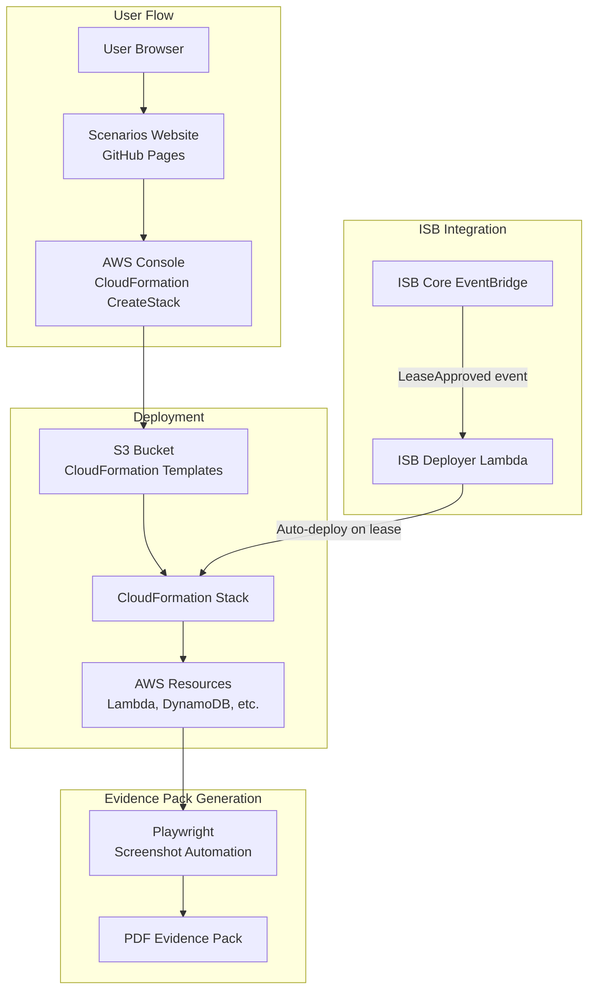
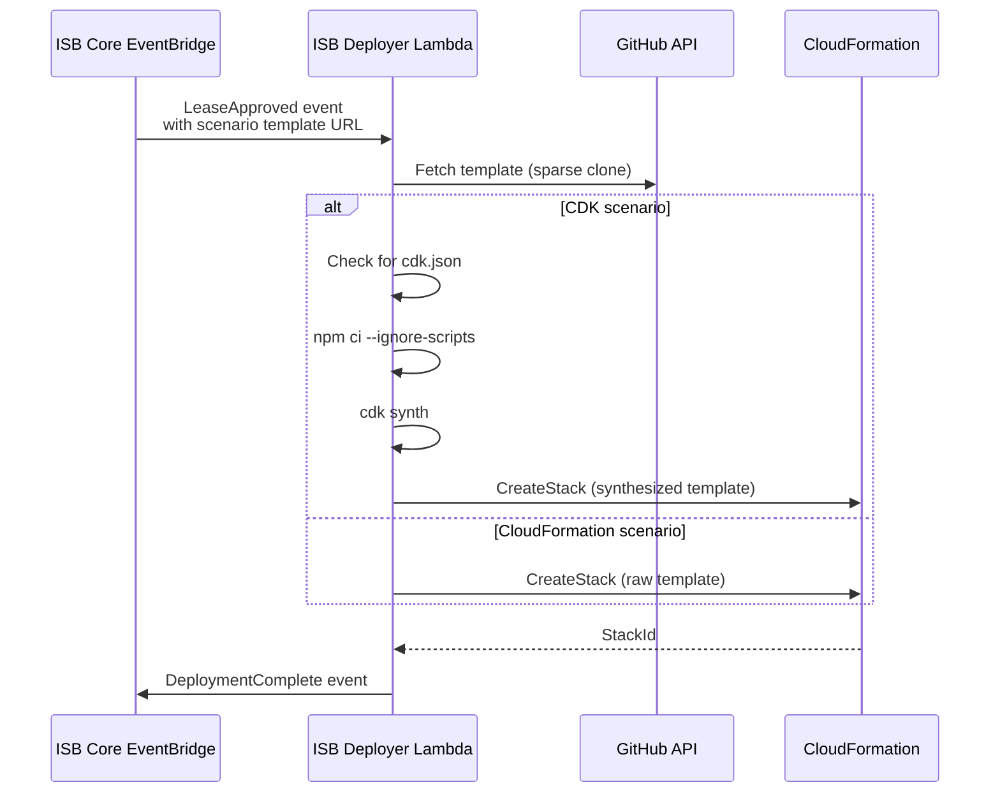
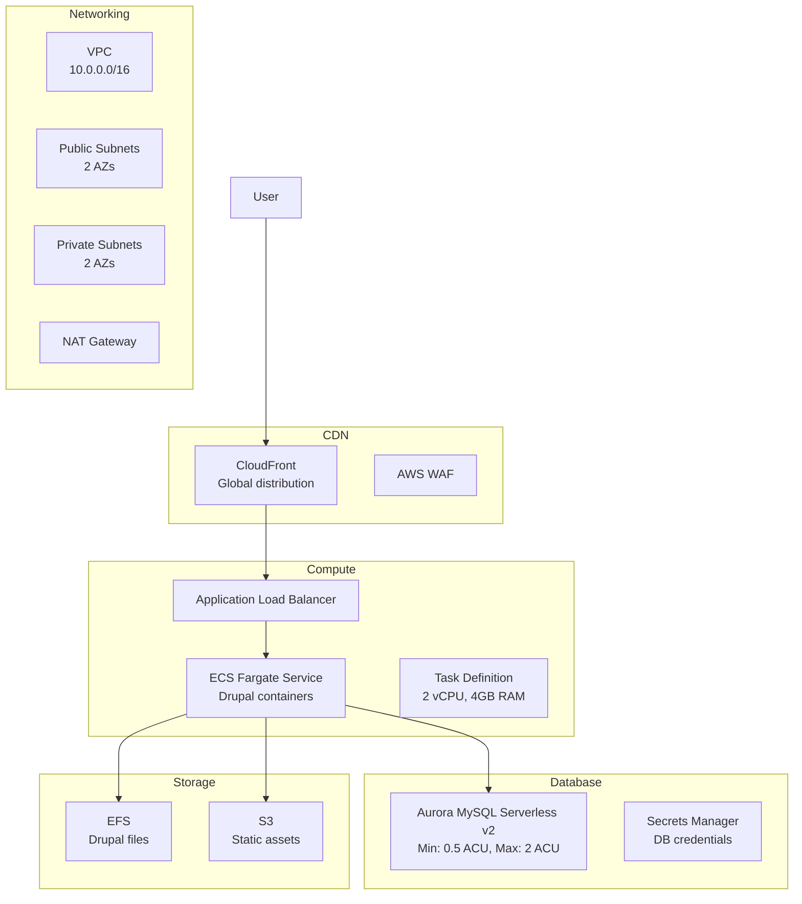
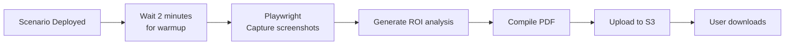

# NDX Try AWS Scenarios Microsite

## Executive Summary

The NDX Try AWS Scenarios microsite is a static website built with Eleventy 11ty that showcases 7 pre-built AWS scenario CloudFormation templates. Users can deploy fully functional AWS applications with one click, generate evidence packs (committee-ready PDFs), and explore real-world use cases designed for UK local government.

**Key Capabilities:**
- 7 production-ready AWS scenarios (Council Chatbot, Planning AI, FOI Redaction, Smart Car Park, Text to Speech, QuickSight Dashboard, LocalGov Drupal)
- One-click CloudFormation deployment
- Evidence pack generation (automated screenshots + ROI analysis)
- GOV.UK Design System (WCAG 2.2 AA compliant)
- Integration with ISB deployer for automatic provisioning

**Technology Stack:** Eleventy 11ty, CloudFormation, AWS CDK (LocalGov Drupal), Lambda, Step Functions

**Hosting:** GitHub Pages (static site), S3 (CloudFormation templates)

**Status:** Production

---

## Architecture Overview



---

## Scenarios Catalog

| Scenario | Description | AWS Services | Deployment Time | Cost |
|----------|-------------|--------------|-----------------|------|
| **Council Chatbot** | 24/7 AI resident support | Bedrock (Claude), Lambda, DynamoDB | 10 min | ~£10/month |
| **Planning AI** | Planning application processing | Bedrock (Claude), Textract, S3 | 12 min | ~£15/month |
| **FOI Redaction** | Sensitive data redaction | Bedrock (Claude), Comprehend, S3 | 10 min | ~£8/month |
| **Smart Car Park** | IoT parking availability | IoT Core, Lambda, DynamoDB, QuickSight | 15 min | ~£12/month |
| **Text to Speech** | Accessibility audio generation | Polly, S3, CloudFront | 8 min | ~£5/month |
| **QuickSight Dashboard** | Service analytics | QuickSight, Athena, S3, Glue | 20 min | ~£20/month |
| **LocalGov Drupal** | Full Drupal CMS stack | ECS Fargate, RDS Aurora, CloudFront | 30 min | ~£50/month |

---

## Eleventy Configuration

**File:** `/Users/cns/httpdocs/cddo/ndx-try-arch/repos/ndx_try_aws_scenarios/eleventy.config.js`

**Key Features:**
- GOV.UK Design System integration
- YAML data files for scenario metadata
- Custom filters for CloudFormation deploy URLs
- Tag-based filtering (AI, IoT, Analytics)
- Walkthrough step rendering

**Collections:**
```javascript
{
  scenarios: all scenario markdown files,
  scenariosByCategory: grouped by AI/IoT/Analytics tags,
  walkthroughs: step-by-step guides
}
```

---

## CloudFormation Templates

### Directory Structure

```
cloudformation/
├── scenarios/
│   ├── council-chatbot/
│   │   ├── template.yaml           # Main CloudFormation template
│   │   ├── functions/              # Lambda function code
│   │   └── README.md
│   ├── foi-redaction/
│   ├── localgov-drupal/
│   │   ├── cdk/                    # CDK-based deployment
│   │   │   ├── lib/
│   │   │   │   ├── constructs/
│   │   │   │   │   ├── networking.ts
│   │   │   │   │   ├── compute.ts (ECS Fargate)
│   │   │   │   │   ├── database.ts (RDS Aurora)
│   │   │   │   │   ├── storage.ts (EFS)
│   │   │   │   │   └── cloudfront.ts
│   │   │   │   └── localgov-drupal-stack.ts
│   │   │   └── bin/app.ts
│   │   └── drupal/                 # Drupal application code
│   ├── planning-ai/
│   ├── quicksight-dashboard/
│   ├── smart-car-park/
│   └── text-to-speech/
├── functions/                      # Shared Lambda functions
└── layers/                         # Lambda layers
```

### Template S3 Hosting

**Bucket:** `ndx-scenarios-templates-prod`

**Deployment Process:**
```bash
# Build CloudFormation templates
yarn build:templates

# Upload to S3
aws s3 sync cloudformation/scenarios/ s3://ndx-scenarios-templates-prod/ \
  --exclude "*.md" \
  --exclude "node_modules/*" \
  --acl public-read
```

**Deploy URL Generation:**
```javascript
eleventyConfig.addFilter('deployUrl', (scenario) => {
  const region = scenario.deployment.region || 'eu-west-2'
  const templateUrl = encodeURIComponent(scenario.deployment.templateS3Url)
  const stackName = `ndx-try-${scenario.id}-${Date.now()}`
  
  return `https://console.aws.amazon.com/cloudformation/home?region=${region}#/stacks/create/review` +
    `?templateURL=${templateUrl}` +
    `&stackName=${stackName}`
})
```

---

## ISB Deployer Integration

### Auto-Deployment on Lease Approval



**Event Schema:**
```json
{
  "detail-type": "LeaseApproved",
  "source": "isb.leases",
  "detail": {
    "leaseId": "lease-123",
    "accountId": "123456789012",
    "templateUrl": "https://github.com/co-cddo/ndx_try_aws_scenarios/tree/main/cloudformation/scenarios/council-chatbot",
    "parameters": {
      "Environment": "sandbox"
    }
  }
}
```

---

## LocalGov Drupal CDK Stack

**File:** `/Users/cns/httpdocs/cddo/ndx-try-arch/repos/ndx_try_aws_scenarios/cloudformation/scenarios/localgov-drupal/cdk/lib/localgov-drupal-stack.ts`

### Architecture



**Key Constructs:**

| Construct | File | Resources |
|-----------|------|-----------|
| `NetworkingConstruct` | `lib/constructs/networking.ts` | VPC, Subnets, NAT Gateway, Security Groups |
| `ComputeConstruct` | `lib/constructs/compute.ts` | ECS Cluster, Fargate Service, ALB, Task Definition |
| `DatabaseConstruct` | `lib/constructs/database.ts` | Aurora Serverless v2, Secrets Manager |
| `StorageConstruct` | `lib/constructs/storage.ts` | EFS, S3 bucket |
| `CloudFrontConstruct` | `lib/constructs/cloudfront.ts` | CloudFront distribution, WAF, OAC |

---

## Evidence Pack Generation

### Automated Screenshot Pipeline

**File:** `/Users/cns/httpdocs/cddo/ndx-try-arch/repos/ndx_try_aws_scenarios/cloudformation/screenshot-automation/`

**Purpose:** Generate committee-ready PDF evidence packs with:
- Automated screenshots of deployed applications
- ROI analysis
- Technical specifications
- Cost breakdown
- Security posture

**Technology:** Playwright + Puppeteer + PDFKit

**Workflow:**


**Playwright Test:**
```typescript
// File: tests/localgov-drupal-ai-screenshots.spec.ts
test('Capture Drupal homepage screenshot', async ({ page }) => {
  const url = process.env.DRUPAL_URL || 'http://localhost:8080'
  
  await page.goto(url)
  await page.waitForLoadState('networkidle')
  
  await page.screenshot({
    path: 'evidence-pack/01-homepage.png',
    fullPage: true
  })
})
```

**PDF Generation:**
```typescript
import PDFDocument from 'pdfkit'

function generateEvidencePack(scenario: Scenario): Buffer {
  const doc = new PDFDocument()
  
  // Title page
  doc.fontSize(24).text(`${scenario.title} Evidence Pack`, 100, 100)
  doc.fontSize(12).text(`Generated: ${new Date().toISOString()}`, 100, 150)
  
  // Screenshots
  doc.addPage()
  doc.fontSize(18).text('Application Screenshots', 100, 50)
  doc.image('evidence-pack/01-homepage.png', 100, 100, { width: 400 })
  
  // ROI Analysis
  doc.addPage()
  doc.fontSize(18).text('Return on Investment', 100, 50)
  doc.fontSize(12).text(`Estimated monthly cost: £${scenario.monthlyCost}`, 100, 100)
  doc.text(`Time saved: ${scenario.timeSaved} hours/week`, 100, 130)
  
  return doc.outputBuffer()
}
```

---

## Deployment Process

### Manual Deployment (User-Initiated)

**Step 1:** User visits scenarios website

**Step 2:** User selects scenario (e.g., Council Chatbot)

**Step 3:** Click "Deploy to AWS" button

**Step 4:** Redirected to AWS Console CloudFormation CreateStack page

**Step 5:** Review parameters, acknowledge IAM, click "Create stack"

**Step 6:** Wait 10-30 minutes for deployment

**Step 7:** Access application via Outputs tab (e.g., `ApplicationUrl`)

### Automatic Deployment (ISB Integration)

**Triggered by:** LeaseApproved event with `templateUrl` parameter

**ISB Deployer Lambda:**
1. Receives EventBridge event
2. Fetches template from GitHub (sparse clone)
3. Detects CDK vs CloudFormation
4. Synthesizes CDK stack if needed
5. Creates CloudFormation stack in sandbox account
6. Polls for stack completion
7. Publishes `DeploymentComplete` event with outputs

---

## Testing Strategy

### Unit Tests

**Playwright Tests:**
```bash
# Visual regression tests
yarn test:visual

# Keyboard navigation tests
yarn test:a11y

# Screenshot capture tests
yarn test:screenshots
```

### Smoke Tests

**Scenario Validation:**
```bash
# Deploy all scenarios to test account
for scenario in council-chatbot foi-redaction planning-ai; do
  aws cloudformation create-stack \
    --stack-name test-$scenario \
    --template-url https://ndx-scenarios-templates-prod.s3.eu-west-2.amazonaws.com/$scenario/template.yaml \
    --capabilities CAPABILITY_IAM
done

# Validate outputs
aws cloudformation describe-stacks --stack-name test-council-chatbot --query 'Stacks[0].Outputs'
```

---

## Cost Analysis

### Monthly Cost Per Scenario

| Scenario | Compute | Storage | Data Transfer | Total |
|----------|---------|---------|---------------|-------|
| Council Chatbot | £8 (Lambda) | £1 (DynamoDB) | £1 | £10 |
| Planning AI | £10 (Lambda) | £3 (S3) | £2 | £15 |
| FOI Redaction | £6 (Lambda) | £1 (S3) | £1 | £8 |
| Smart Car Park | £8 (IoT Core) | £2 (DynamoDB) | £2 | £12 |
| Text to Speech | £4 (Polly) | £1 (S3) | £0 (CloudFront free tier) | £5 |
| QuickSight Dashboard | £15 (QuickSight) | £3 (S3 + Athena) | £2 | £20 |
| LocalGov Drupal | £35 (ECS Fargate) | £10 (RDS Aurora) | £5 | £50 |

**Total for All 7 Scenarios:** ~£120/month (well within ISB budget limits)

---

## Related Documentation

- [30-ndx-website.md](30-ndx-website.md) - Main NDX website
- [23-deployer.md](23-deployer.md) - ISB deployer integration
- [00-repo-inventory.md](00-repo-inventory.md) - Repository overview

---

## Source Files Referenced

| File Path | Purpose |
|-----------|---------|
| `/repos/ndx_try_aws_scenarios/eleventy.config.js` | Site configuration |
| `/repos/ndx_try_aws_scenarios/cloudformation/scenarios/` | CloudFormation templates (7 scenarios) |
| `/repos/ndx_try_aws_scenarios/cloudformation/scenarios/localgov-drupal/cdk/` | LocalGov Drupal CDK stack |
| `/repos/ndx_try_aws_scenarios/tests/` | Playwright E2E tests |

---

**Document Version:** 1.0
**Last Updated:** 2026-02-03
**Status:** Production
