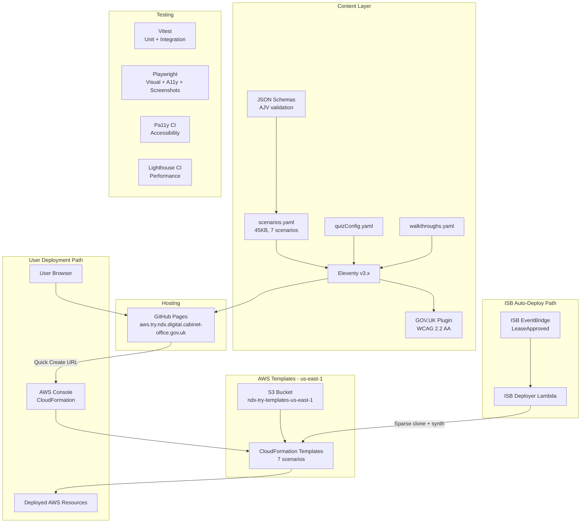
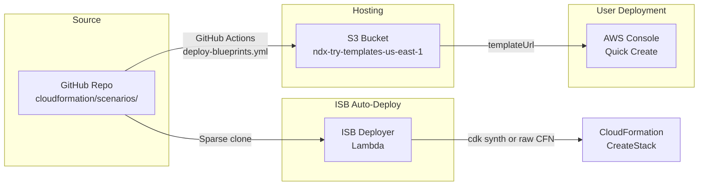

# Scenarios Microsite

> **Last Updated**: 2026-03-02
> **Source**: [https://github.com/co-cddo/ndx_try_aws_scenarios](https://github.com/co-cddo/ndx_try_aws_scenarios)
> **Captured SHA**: `fcb5c08`

## Executive Summary

The NDX Try AWS Scenarios microsite is a static website built with Eleventy v3.x that showcases pre-built AWS scenario CloudFormation templates for UK local government evaluation. The site provides scenario discovery (with quiz-based recommendation), CloudFormation Quick Create deployment URLs, step-by-step walkthroughs, and evidence pack generation. All scenarios deploy to us-east-1, are validated at build time against JSON schemas using AJV, and integrate with the Innovation Sandbox deployer for automatic provisioning on lease approval.

## Architecture Overview


```mermaid
graph TB
    subgraph "Content Layer"
        ELEVENTY[Eleventy v3.x] --> GOVUK[GOV.UK Plugin<br/>WCAG 2.2 AA]
        YAML[scenarios.yaml<br/>45KB, 7 scenarios] --> ELEVENTY
        SCHEMA[JSON Schemas<br/>AJV validation] --> YAML
        QUIZ[quizConfig.yaml] --> ELEVENTY
        WALKTHROUGHS[walkthroughs.yaml] --> ELEVENTY
    end

    subgraph "Hosting"
        GH_PAGES[GitHub Pages<br/>aws.try.ndx.digital.cabinet-office.gov.uk]
    end

    subgraph "AWS Templates - us-east-1"
        S3_TEMPLATES[S3 Bucket<br/>ndx-try-templates-us-east-1]
        CF_TEMPLATES[CloudFormation Templates<br/>7 scenarios]
        S3_TEMPLATES --> CF_TEMPLATES
    end

    subgraph "User Deployment Path"
        USER[User Browser] --> GH_PAGES
        GH_PAGES -->|Quick Create URL| AWS_CONSOLE[AWS Console<br/>CloudFormation]
        AWS_CONSOLE --> CF_TEMPLATES
        CF_TEMPLATES --> RESOURCES[Deployed AWS Resources]
    end

    subgraph "ISB Auto-Deploy Path"
        ISB_EB[ISB EventBridge<br/>LeaseApproved] --> DEPLOYER[ISB Deployer Lambda]
        DEPLOYER -->|Sparse clone + synth| CF_TEMPLATES
    end

    subgraph "Testing"
        VITEST[Vitest<br/>Unit + Integration]
        PLAYWRIGHT[Playwright<br/>Visual + A11y + Screenshots]
        PA11Y[Pa11y CI<br/>Accessibility]
        LIGHTHOUSE[Lighthouse CI<br/>Performance]
    end

    ELEVENTY --> GH_PAGES
```

## Scenarios Catalogue

The site features 7 production-ready scenarios defined in `src/_data/scenarios.yaml`, validated against `schemas/scenario.schema.json` at build time.

| Scenario | ID | Difficulty | Time | Region | AWS Services |
|----------|-----|-----------|------|--------|-------------|
| LocalGov Drupal with AI | `localgov-drupal` | Beginner | 40 min | us-east-1 | Bedrock, Polly, Translate, Textract, Fargate, Aurora, EFS |
| Council Chatbot | `council-chatbot` | Beginner | 15 min | us-east-1 | Bedrock, Lambda, S3 |
| Planning AI | `planning-ai` | Intermediate | 30 min | us-east-1 | Bedrock, Textract, S3 |
| FOI Redaction | `foi-redaction` | Intermediate | 25 min | us-east-1 | Bedrock, Comprehend, S3 |
| Smart Car Park | `smart-car-park` | Advanced | 45 min | us-east-1 | IoT Core, Lambda, DynamoDB, QuickSight |
| Text to Speech | `text-to-speech` | Beginner | 15 min | us-east-1 | Polly, S3, CloudFront |
| QuickSight Dashboard | `quicksight-dashboard` | Intermediate | 30 min | us-east-1 | QuickSight, Athena, S3, Glue |

Each scenario includes detailed metadata: business outcomes, prerequisites, skill tags, related scenarios, success metrics with ROI projections, security posture, and total cost of ownership projections.

### Scenario Data Model

Each scenario in `scenarios.yaml` follows a comprehensive schema:

```yaml
- id: "council-chatbot"                    # URL-safe identifier
  name: "Council Chatbot"                  # Display name
  headline: "..."                          # One-line summary
  bestFor: "..."                           # Target use case
  description: "..."                       # Full description
  difficulty: "beginner"                   # beginner | intermediate | advanced
  timeEstimate: "15 minutes"              # Human-readable estimate
  primaryPersona: "service-manager"        # service-manager | technical | finance | leadership
  isMostPopular: true                      # Featured badge
  featured: true                           # Show on homepage
  status: "active"                         # active | coming-soon | archived
  deployment:
    templateUrl: "https://..."             # S3 HTTPS URL for CloudFormation
    templateS3Url: "s3://..."             # S3 protocol URL
    region: "us-east-1"                   # Deployment region
    stackNamePrefix: "ndx-try-..."        # Max 114 chars (128 - timestamp)
    parameters: [...]                      # CloudFormation parameters
    capabilities: [CAPABILITY_IAM, ...]    # Required capabilities
    deploymentTime: "3 to 5 minutes"       # Realistic estimate
    deploymentPhases: [...]                # Phase descriptions
    outputs: [...]                         # Expected stack outputs
  success_metrics:
    roi:
      annual_savings: 40000               # GBP
      payback_months: 2
      committee_language: "..."           # Ready-made summary for reports
  security_posture:
    certifications: [...]                  # ISO 27001, SOC 2, etc.
    data_residency: "US (us-east-1)"
    encryption: "AES-256 at rest, TLS 1.3 in transit"
```

## Eleventy Configuration

**File**: `repos/ndx_try_aws_scenarios/eleventy.config.js` (265 lines)

### GOV.UK Plugin Setup

Uses `@x-govuk/govuk-eleventy-plugin` v8.3.1 with the GOV.UK rebrand enabled. The site is branded as "NDX:Try AWS Scenarios" in Alpha phase.

| Setting | Value |
|---------|-------|
| Product Name | NDX:Try AWS Scenarios |
| Phase | Alpha |
| Stylesheets | `/assets/application.css`, `/assets/css/custom.css` |
| URL | `https://aws.try.ndx.digital.cabinet-office.gov.uk` |
| Path Prefix | `GITHUB_PAGES_PATH_PREFIX` env var or `/` |

### Data Handling

YAML data files are loaded via `js-yaml` through a custom data extension. The site uses Nunjucks for all template engines.

### Custom Filters

| Filter | Purpose |
|--------|---------|
| `findScenarioById` | Look up scenario by ID from the scenarios array |
| `capitalize` | Capitalize first character |
| `difficultyColor` | Map difficulty to GOV.UK tag colour (green/yellow/red) |
| `personaColor` | Map persona to tag colour (blue/purple/turquoise/orange) |
| `categoryColor` | Map category to tag colour (blue/green/purple) |
| `scenarioCategory` | Derive category (ai/iot/analytics) from scenario tags |
| `walkthroughSteps` | Return step count for a scenario (currently hardcoded to 4) |
| `slug` | URL-safe slug generation |
| `regionName` | Map AWS region codes to friendly names (e.g., `us-east-1` to `N. Virginia`) |
| `deployUrl` | Generate CloudFormation Quick Create URL from scenario deployment config |
| `getRelatedScenarios` | Cross-link related scenarios |
| `readableDate` | Human-readable date formatting (en-GB) |
| `isAllowedReturnUrl` | Validate return URLs against allowlist |

### CloudFormation Deploy URL Generation

The `deployUrl` filter constructs a CloudFormation Quick Create URL:

```
https://console.aws.amazon.com/cloudformation/home?region={region}#/stacks/quickcreate
  ?templateURL={encoded-s3-url}
  &stackName={prefix}-{timestamp}
  &param_Environment=sandbox
  &param_KnowledgeBaseSource=council-sample-data
```

**Validation applied**:
- Parameter names must match `^[a-zA-Z][a-zA-Z0-9-]*$` and be under 255 characters
- Parameter values must be under 4096 characters
- Stack name prefix truncated to ensure total name stays under 128 characters

### Return URL Allowlist

Only URLs matching these domains are accepted as return URLs:
- `localhost`, `127.0.0.1` (development)
- `ndx-try.service.gov.uk` (production)
- `github.io` (GitHub Pages)

## Project Structure

```
ndx_try_aws_scenarios/
├── src/
│   ├── _data/                      # YAML data files
│   │   ├── scenarios.yaml          # 7 scenario definitions (45KB)
│   │   ├── site.yaml               # Global site config
│   │   ├── quizConfig.yaml         # Scenario recommendation quiz
│   │   ├── walkthroughs.yaml       # Walkthrough step definitions
│   │   ├── navigation.yaml         # Site navigation
│   │   ├── phaseConfig.yaml        # Phase configuration
│   │   ├── pathways.yaml           # User pathways
│   │   ├── forms.yaml              # Form definitions
│   │   ├── chatbot-sample-questions.yaml
│   │   ├── foi-sample-documents.yaml
│   │   ├── planning-sample-documents.yaml
│   │   ├── quicksight-sample-data.yaml
│   │   ├── smart-car-park-sample-data.yaml
│   │   ├── text-to-speech-sample-data.yaml
│   │   ├── evidence-pack-sample.yaml
│   │   ├── success-stories.yaml
│   │   ├── sample-data-config.yaml
│   │   ├── exploration/            # Per-scenario exploration guides
│   │   ├── experiments/            # Experiment definitions
│   │   ├── extend/                 # Extension guides
│   │   ├── architecture/           # Architecture data
│   │   └── screenshots/            # Screenshot metadata per scenario
│   ├── _includes/                  # Nunjucks templates
│   ├── assets/                     # CSS, images
│   ├── lib/                        # Client-side JavaScript modules
│   ├── scenarios/                  # Scenario detail pages
│   └── walkthroughs/               # Walkthrough pages
├── cloudformation/
│   ├── scenarios/                  # Per-scenario CloudFormation templates
│   │   ├── council-chatbot/
│   │   ├── foi-redaction/
│   │   ├── localgov-drupal/        # CDK-based (includes cdk/ subdirectory)
│   │   ├── planning-ai/
│   │   ├── quicksight-dashboard/
│   │   ├── smart-car-park/
│   │   └── text-to-speech/
│   ├── functions/                  # Shared Lambda functions
│   │   └── sample-data-seeder/     # Seeds sample data on deployment
│   ├── isb-hub/                    # ISB hub CDK stack
│   └── screenshot-automation/      # Playwright screenshot pipeline
├── schemas/                        # JSON schemas for validation
│   ├── scenario.schema.json        # Scenario data schema (25KB)
│   ├── quiz-config.schema.json     # Quiz config schema
│   └── sample-data.schema.json     # Sample data schema
├── scripts/                        # Build and utility scripts
│   ├── validate-schema.js          # AJV schema validation
│   ├── optimize-images.js          # Image optimization
│   ├── run-accessibility-tests.js  # Pa11y runner
│   ├── generate-manifest.mjs       # Manifest generation
│   ├── check-screenshots.js        # Screenshot validation
│   └── verify-reference-stack.mjs  # Stack verification
└── tests/                          # Test files
```

## Schema Validation

**File**: `repos/ndx_try_aws_scenarios/scripts/validate-schema.js` (218 lines)

Build-time validation runs before Eleventy build (`npm run build` executes `validate:schema && eleventy`).

### Validated Schemas

| Schema | Data File | Purpose |
|--------|-----------|---------|
| `scenario.schema.json` (25KB) | `scenarios.yaml` | Full scenario metadata validation |
| `quiz-config.schema.json` (4KB) | `quizConfig.yaml` | Quiz question/option validation |
| `sample-data.schema.json` (7KB) | Sample data files | Sample data structure validation |

### Validation Engine

Uses AJV (Another JSON Validator) with `ajv-formats` for URI and date validation. Errors are output with actionable guidance:

```
[1]
  - Path: /scenarios/0/deployment
    Error: must have required property 'templateUrl'
    ACTION: Add missing field "templateUrl"
```

## CloudFormation Templates

Templates are hosted on S3 at `ndx-try-templates-us-east-1` in **us-east-1**.

### Template Distribution


```mermaid
flowchart LR
    subgraph "Source"
        REPO[GitHub Repo<br/>cloudformation/scenarios/]
    end

    subgraph "Hosting"
        S3[S3 Bucket<br/>ndx-try-templates-us-east-1]
    end

    subgraph "User Deployment"
        CONSOLE[AWS Console<br/>Quick Create]
    end

    subgraph "ISB Auto-Deploy"
        DEPLOYER[ISB Deployer<br/>Lambda]
    end

    REPO -->|GitHub Actions<br/>deploy-blueprints.yml| S3
    S3 -->|templateUrl| CONSOLE
    REPO -->|Sparse clone| DEPLOYER
    DEPLOYER -->|cdk synth or raw CFN| CFN[CloudFormation<br/>CreateStack]
```

### Scenario Template Structures

Most scenarios use plain CloudFormation YAML templates. The LocalGov Drupal scenario is the exception, using a full CDK stack with TypeScript constructs:

**LocalGov Drupal CDK Stack** (`cloudformation/scenarios/localgov-drupal/cdk/`):
- `lib/constructs/networking.ts`: VPC, subnets, NAT Gateway
- `lib/constructs/compute.ts`: ECS Fargate service, ALB, task definition
- `lib/constructs/database.ts`: Aurora Serverless v2 MySQL
- `lib/constructs/storage.ts`: EFS, S3 bucket
- `lib/constructs/cloudfront.ts`: CloudFront distribution, WAF, OAC

### Sample Data Seeder

**Directory**: `cloudformation/functions/sample-data-seeder/`

A Python Lambda function deployed alongside scenarios to seed realistic sample data (council service data, chatbot knowledge bases, etc.) into the deployed resources. Includes its own CloudFormation template and deploy script.

### ISB Hub Stack

**Directory**: `cloudformation/isb-hub/`

A CDK project that deploys supporting infrastructure in the ISB hub account for scenario management.

## ISB Deployer Integration

When a lease is approved in the Innovation Sandbox, the deployer Lambda:

1. Receives `LeaseApproved` event with `templateUrl` pointing to this repo
2. Performs sparse clone from GitHub
3. Detects CDK vs CloudFormation (checks for `cdk.json`)
4. For CDK scenarios: runs `npm ci --ignore-scripts` then `cdk synth`
5. Creates CloudFormation stack in the sandbox account
6. Polls for completion and publishes `DeploymentComplete` event

See [23-deployer.md](23-deployer.md) for full deployer architecture.

## Testing Strategy

### Test Configuration

**Vitest** (`vitest.config.ts`):
- Environment: Node
- Includes: `tests/unit/**/*.test.ts`, `tests/integration/**/*.test.ts`
- Coverage: V8 provider, reports in text/json/html

**Playwright** (`playwright.config.ts`):
- Projects: Desktop Chrome (1280x800) and Mobile iPhone SE (375x667)
- Web server: `npx http-server _site -p 8080`
- Retries: 2 in CI, 0 locally
- Workers: 1 in CI (deterministic), auto locally
- Screenshot diff: 10% pixel ratio threshold

### Test Types

| Type | Command | Tool | Purpose |
|------|---------|------|---------|
| Schema Validation | `npm run validate:schema` | AJV | Validate scenarios.yaml at build |
| Unit Tests | `npm test` | Vitest | Data transformation, filter logic |
| Integration Tests | `npm run test:unit` | Vitest | Cross-module integration |
| Accessibility | `npm run test:a11y` | Pa11y CI | WCAG 2.2 AA compliance |
| Full A11y Audit | `npm run test:a11y:full` | Custom Pa11y runner | Extended accessibility testing |
| Lighthouse | `npm run test:lighthouse` | Lighthouse CI | Performance metrics |
| Screenshot Capture | `npm run test:screenshots` | Playwright | Automated screenshots |
| Visual Regression | `npm run test:visual` | Playwright + pixelmatch | Visual diff testing |
| Drupal Screenshots | `npm run test:drupal-screenshots` | Playwright | Drupal-specific captures |
| E2E Tests | `npm run test:playwright` | Playwright | Full end-to-end flows |

### Lighthouse Configuration

**File**: `repos/ndx_try_aws_scenarios/lighthouserc.js`

Lighthouse CI is configured for automated performance auditing as part of the build pipeline.

## CI/CD Pipeline

### GitHub Actions Workflows

| Workflow | Trigger | Purpose |
|----------|---------|---------|
| `build-deploy.yml` | Push to `main` | Build site, deploy to GitHub Pages |
| `deploy-blueprints.yml` | Push to `main` (cloudformation changes) | Upload templates to S3 |
| `docker-build.yml` | Push to `main` | Build Docker containers (for Drupal scenario) |

### Deployment Targets

| Asset | Destination | Method |
|-------|------------|--------|
| Static site | GitHub Pages | `build-deploy.yml` |
| CloudFormation templates | S3 `ndx-try-templates-us-east-1` | `deploy-blueprints.yml` |
| Docker images | Container registry | `docker-build.yml` |

## Site Configuration

**File**: `repos/ndx_try_aws_scenarios/src/_data/site.yaml`

| Setting | Value |
|---------|-------|
| Name | NDX:Try AWS |
| URL | `https://aws.try.ndx.digital.cabinet-office.gov.uk` |
| Accessibility | WCAG 2.2 AA |
| License | MIT (Open Government Licence v3.0 for content) |
| Contact | ndx@dsit.gov.uk |

**Feature Flags**:
- `quizEnabled`: true (scenario recommendation quiz active)
- `evidencePackEnabled`: false (evidence pack generation not yet in production)
- `analyticsEnabled`: false (Google Analytics not yet active)

**Trust Indicators** displayed on the site:
- 50+ councils engaged
- 15 minutes to first insight
- Zero commitment, zero cost

## Dependencies

| Package | Version | Purpose |
|---------|---------|---------|
| `@11ty/eleventy` | ^3.0.0 | Static site generator |
| `@x-govuk/govuk-eleventy-plugin` | ^8.3.1 | GOV.UK Design System integration |
| `govuk-frontend` | 6.1.0 | GOV.UK Frontend components |
| `jspdf` | ^4.2.0 | Client-side PDF evidence pack generation |
| `ajv` / `ajv-formats` | ^8.18.0 / ^3.0.1 | JSON schema validation |
| `@playwright/test` | ^1.58.2 | E2E and visual testing |
| `vitest` | ^4.0.18 | Unit and integration testing |
| `pa11y-ci` | ^4.0.1 | Accessibility testing |
| `@lhci/cli` | ^0.15.1 | Lighthouse CI |
| `sharp` | ^0.34.5 | Image optimization |
| `pixelmatch` / `pngjs` | ^7.1.0 / ^7.0.0 | Visual regression testing |

**Node.js requirement**: >= 22.0.0

## Related Documentation

- [30-ndx-website.md](30-ndx-website.md) - Main NDX website (catalogue references scenarios)
- [31-signup-flow.md](31-signup-flow.md) - Signup flow (users sign up then deploy scenarios)
- [23-deployer.md](23-deployer.md) - ISB deployer (auto-deploys scenario templates)
- [00-repo-inventory.md](00-repo-inventory.md) - Repository overview

## Source Files Referenced

| File Path | Purpose | Size |
|-----------|---------|------|
| `repos/ndx_try_aws_scenarios/eleventy.config.js` | Eleventy configuration with filters | 265 lines |
| `repos/ndx_try_aws_scenarios/package.json` | Dependencies and scripts | 69 lines |
| `repos/ndx_try_aws_scenarios/src/_data/scenarios.yaml` | 7 scenario definitions | 45KB |
| `repos/ndx_try_aws_scenarios/src/_data/site.yaml` | Global site configuration | 67 lines |
| `repos/ndx_try_aws_scenarios/schemas/scenario.schema.json` | Scenario validation schema | 25KB |
| `repos/ndx_try_aws_scenarios/schemas/quiz-config.schema.json` | Quiz validation schema | 4KB |
| `repos/ndx_try_aws_scenarios/scripts/validate-schema.js` | Build-time schema validation | 218 lines |
| `repos/ndx_try_aws_scenarios/vitest.config.ts` | Unit test configuration | 15 lines |
| `repos/ndx_try_aws_scenarios/playwright.config.ts` | E2E test configuration | 55 lines |
| `repos/ndx_try_aws_scenarios/lighthouserc.js` | Lighthouse CI configuration | - |
| `repos/ndx_try_aws_scenarios/cloudformation/scenarios/` | 7 scenario CloudFormation templates | 275+ files |
| `repos/ndx_try_aws_scenarios/cloudformation/isb-hub/` | ISB hub CDK stack | 6 files |
| `repos/ndx_try_aws_scenarios/cloudformation/functions/sample-data-seeder/` | Sample data Lambda | 4 files |

---
*Generated from source analysis. See [00-repo-inventory.md](./00-repo-inventory.md) for full inventory.*
