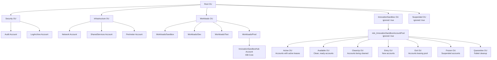
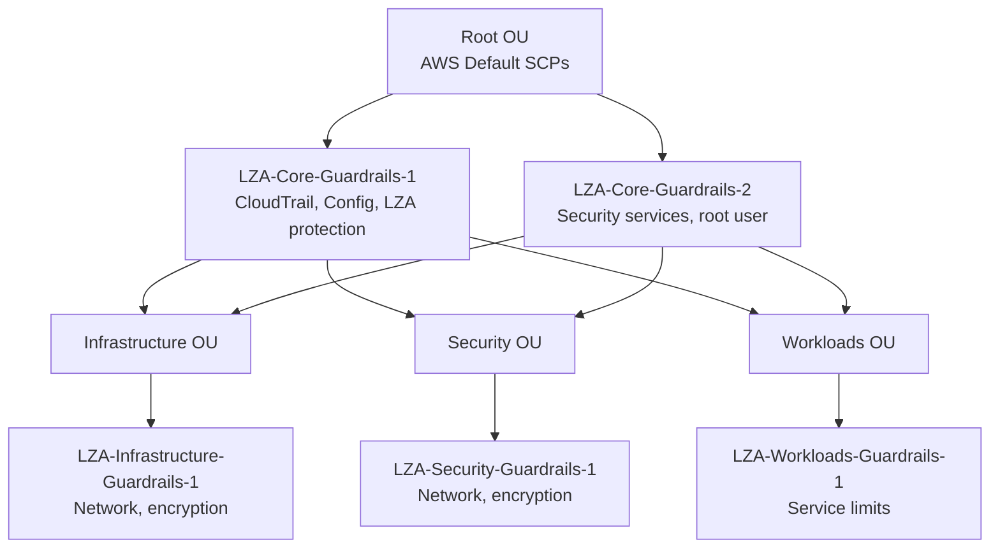

# LZA Configuration

## Executive Summary

The Landing Zone Accelerator (LZA) configuration establishes the AWS organizational structure for NDX:Try AWS. It defines accounts, organizational units (OUs), service control policies (SCPs), and security baselines across all accounts in the organization.

**Key Capabilities:**
- AWS Control Tower integration (v4.0)
- 7 account structure (Management, Audit, LogArchive, SharedServices, Network, Perimeter, ISB Hub)
- Innovation Sandbox OU hierarchy with 8 sub-OUs for account lifecycle management
- Service Control Policies (SCPs) for security and cost guardrails
- Centralized logging and security monitoring

**Technology:** AWS Landing Zone Accelerator v1.14.1

**Configuration Version:** v1.1.0

**Status:** Production

---

## Organizational Structure



---

## Configuration Files

### 1. Global Config (`global-config.yaml`)

**Key Settings:**

| Setting | Value | Purpose |
|---------|-------|---------|
| `homeRegion` | `eu-west-2` | Primary region for LZA resources |
| `enabledRegions` | `[eu-west-2, eu-west-1]` | Allowed AWS regions |
| `managementAccountAccessRole` | `AWSControlTowerExecution` | Cross-account orchestration role |
| `cloudwatchLogRetentionInDays` | 365 | Compliance requirement |
| `terminationProtection` | true | Prevent accidental deletion |

**Control Tower Configuration:**
```yaml
controlTower:
  enable: true
  landingZone:
    version: "4.0"
    logging:
      loggingBucketRetentionDays: 365
      accessLoggingBucketRetentionDays: 365
      organizationTrail: true
    security:
      enableIdentityCenterAccess: true
```

**Control Tower Controls (Sample):**
- `CONFIG.CLOUDTRAIL.DT.5` - S3 data events logging
- `CONFIG.LOGS.DT.1` - CloudWatch log encryption
- `CONFIG.IAM.DT.6` - IAM group membership check
- `CONFIG.EC2.DT.17` - Internet gateway authorization
- `CONFIG.SECURITYHUB.DT.1` - Security Hub enabled

---

### 2. Organization Config (`organization-config.yaml`)

**Organizational Units:**

```yaml
organizationalUnits:
  - name: Security
  - name: Infrastructure
  - name: Suspended
    ignore: true
  - name: Workloads
  - name: Workloads/Sandbox
  - name: Workloads/Dev
  - name: Workloads/Test
  - name: Workloads/Prod
  - name: InnovationSandbox
    ignore: true  # Managed by ISB
  - name: InnovationSandbox/ndx_InnovationSandboxAccountPool
    ignore: true
  - name: InnovationSandbox/ndx_InnovationSandboxAccountPool/Active
    ignore: true
  - name: InnovationSandbox/ndx_InnovationSandboxAccountPool/Available
    ignore: true
  - name: InnovationSandbox/ndx_InnovationSandboxAccountPool/CleanUp
    ignore: true
  - name: InnovationSandbox/ndx_InnovationSandboxAccountPool/Entry
    ignore: true
  - name: InnovationSandbox/ndx_InnovationSandboxAccountPool/Exit
    ignore: true
  - name: InnovationSandbox/ndx_InnovationSandboxAccountPool/Frozen
    ignore: true
  - name: InnovationSandbox/ndx_InnovationSandboxAccountPool/Quarantine
    ignore: true
```

**Quarantine New Accounts:**
```yaml
quarantineNewAccounts:
  enable: true
  scpPolicyName: "{{ AcceleratorPrefix }}-Quarantine-New-Object"
```

---

### 3. Accounts Config (`accounts-config.yaml`)

**Mandatory Accounts:**

| Account | Email | OU | Purpose |
|---------|-------|-----|---------|
| Management | ndx-try-provider+gds-ndx-try-aws@dsit.gov.uk | Root | AWS Organizations management |
| LogArchive | ndx-try-provider+gds-ndx-try-aws-log-archive@dsit.gov.uk | Security | Centralized logging |
| Audit | ndx-try-provider+gds-ndx-try-aws-audit@dsit.gov.uk | Security | Security auditing and compliance |

**Workload Accounts:**

| Account | Email | OU | Purpose |
|---------|-------|-----|---------|
| SharedServices | ndx-try-provider+gds-ndx-try-aws-shared-services@dsit.gov.uk | Infrastructure | Shared infrastructure services |
| Network | ndx-try-provider+gds-ndx-try-aws-network@dsit.gov.uk | Infrastructure | Network hub (Transit Gateway, VPCs) |
| Perimeter | ndx-try-provider+gds-ndx-try-aws-perimeter@dsit.gov.uk | Infrastructure | Perimeter security (WAF, Shield) |
| InnovationSandboxHub | ndx-try-provider+gds-ndx-try-aws-isb-hub@dsit.gov.uk | Workloads/Prod | ISB Core application |

---

### 4. Network Config (`network-config.yaml`)

**VPC Architecture:**
```yaml
vpcs:
  - name: Shared-Services-VPC
    region: eu-west-2
    cidr: 10.0.0.0/16
    subnets:
      - name: Public-A
        availabilityZone: a
        cidr: 10.0.1.0/24
        type: public
      - name: Private-A
        availabilityZone: a
        cidr: 10.0.10.0/24
        type: private
    natGateways:
      - subnet: Public-A
```

**Transit Gateway:** (Optional - not currently configured)

---

### 5. Security Config (`security-config.yaml`)

**AWS Config Rules:**
- All Config rules enabled for compliance monitoring
- Organization-wide trail via Control Tower
- Security Hub enabled in all accounts
- GuardDuty enabled with central aggregation

**CloudWatch Log Groups:**
- Encryption required (KMS)
- 365-day retention
- Cross-account log aggregation

---

### 6. IAM Config (`iam-config.yaml`)

**Centralized IAM Policies:**
```yaml
policies:
  - name: deny-root-user
    description: Deny all actions by root user
    policy: iam-policies/deny-root-user.json
```

**Role Sets:**
- Admin role (break-glass access)
- ReadOnly role (auditing)
- Developer role (limited permissions)

---

## Service Control Policies

### SCP Hierarchy



### SCP Analysis

**File:** `service-control-policies/lza-core-guardrails-1.json`

**Protections:**
- Deny CloudTrail deletion/modification
- Deny AWS Config deletion/modification
- Deny LZA-managed resource modification
- Protect CloudWatch Logs

**File:** `service-control-policies/lza-core-guardrails-2.json`

**Protections:**
- Deny GuardDuty, Security Hub, Macie modifications
- Deny root account usage
- Protect organization SCPs

**Comparison with ndx-try-aws-scp:** See [41-terraform-scp.md](41-terraform-scp.md)

---

## Deployment Process

### Initial Deployment

```bash
# 1. Bootstrap Control Tower in Management account
# (Manual via AWS Console)

# 2. Clone LZA repository
git clone https://github.com/co-cddo/ndx-try-aws-lza.git

# 3. Customize configuration
# Edit *.yaml files with organization-specific values

# 4. Deploy LZA installer stack
aws cloudformation create-stack \
  --stack-name AWSAccelerator-Installer \
  --template-url https://aws-accelerator-installer.s3.amazonaws.com/latest/installer.yaml \
  --parameters \
    ParameterKey=RepositoryName,ParameterValue=ndx-try-aws-lza \
    ParameterKey=BranchName,ParameterValue=main \
  --capabilities CAPABILITY_NAMED_IAM

# 5. LZA pipeline executes automatically
# - Creates CodePipeline
# - Runs CDK deployment
# - Provisions accounts and OUs
# - Applies SCPs and guardrails

# 6. Verify deployment
aws organizations list-organizational-units-for-parent --parent-id r-xxxx
```

### Update Procedure

```bash
# 1. Make changes to YAML files
git add .
git commit -m "Update LZA configuration"
git push origin main

# 2. LZA pipeline auto-triggers on push
# 3. Review changes in CodePipeline
# 4. Manual approval gate (if configured)
# 5. Deployment completes
```

---

## Integration with Innovation Sandbox

### OU Lifecycle Management

**Innovation Sandbox OUs (ignored by LZA):**

```yaml
- name: InnovationSandbox
  ignore: true  # ISB manages this hierarchy
```

**Why ignored?**
- ISB Core dynamically moves accounts between OUs
- LZA would conflict with ISB's account management
- ISB uses AWS Organizations API directly

**Coordination:**
- LZA creates the InnovationSandbox parent OU
- LZA creates sub-OUs (Active, Available, CleanUp, etc.)
- LZA does not manage accounts within these OUs
- ISB takes over after initial OU creation

---

## Monitoring & Observability

### CloudWatch Metrics

**LZA Pipeline:**
- CodePipeline execution status
- CDK deployment success/failure
- Stack drift detection

**Control Tower:**
- Guardrail compliance status
- Account provisioning events
- OU changes

### Alarms

- LZA pipeline failures
- Stack drift detected
- SCP enforcement violations

---

## Related Documentation

- [05-service-control-policies.md](05-service-control-policies.md) - Detailed SCP analysis
- [41-terraform-scp.md](41-terraform-scp.md) - Terraform SCP comparison
- [02-aws-organization.md](02-aws-organization.md) - Organization structure

---

## Source Files Referenced

| File Path | Purpose |
|-----------|---------|
| `/repos/ndx-try-aws-lza/global-config.yaml` | Global LZA settings |
| `/repos/ndx-try-aws-lza/organization-config.yaml` | OU structure and SCPs |
| `/repos/ndx-try-aws-lza/accounts-config.yaml` | Account definitions |
| `/repos/ndx-try-aws-lza/network-config.yaml` | VPC and networking |
| `/repos/ndx-try-aws-lza/security-config.yaml` | Security baselines |
| `/repos/ndx-try-aws-lza/iam-config.yaml` | IAM policies and roles |
| `/repos/ndx-try-aws-lza/service-control-policies/` | SCP JSON files |

---

**Document Version:** 1.0
**Last Updated:** 2026-02-03
**Status:** Production
