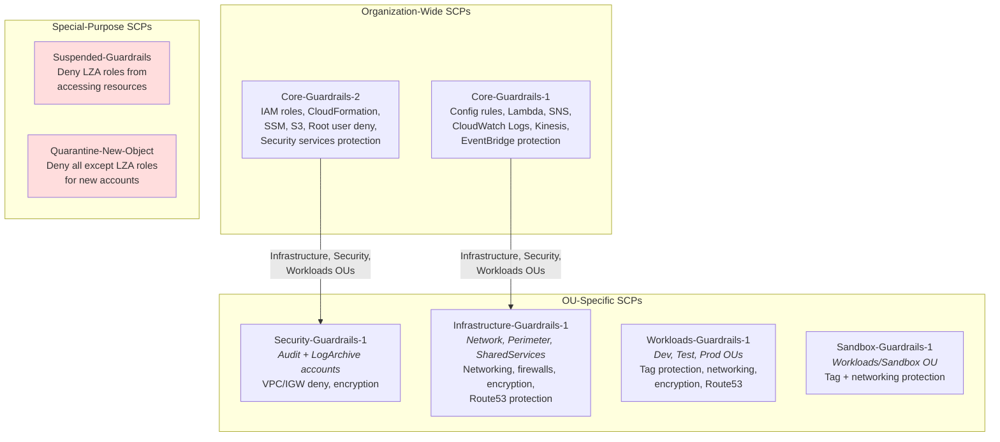

# LZA Configuration

> **Last Updated**: 2026-03-02
> **Source**: [https://github.com/co-cddo/ndx-try-aws-lza](https://github.com/co-cddo/ndx-try-aws-lza)
> **Captured SHA**: `6d70ae3`

## Executive Summary

The Landing Zone Accelerator (LZA) configuration defines the entire AWS organizational structure for NDX:Try, establishing a multi-account hierarchy with Control Tower integration, service control policies, security baselines, centralized logging, and backup policies. Built on LZA Universal Configuration v1.1.0 (LZA v1.14.1), it manages 7 core accounts across 5 organizational units while deliberately delegating Innovation Sandbox account lifecycle management to the ISB platform via `ignore: true` directives on all sandbox-related OUs.

## Configuration Overview

The repository consists of 7 primary YAML configuration files, 8 SCP JSON policies, 2 IAM policies, 2 SSM automation documents, and supporting policy files across 10 directories. All configuration values support variable substitution through `replacements-config.yaml`, enabling environment-specific deployments from a single template.

### Resolved Variable Replacements

The `replacements-config.yaml` file defines all parameterised values used across the configuration:

| Variable | Value | Purpose |
|----------|-------|---------|
| `AcceleratorPrefix` | `AWSAccelerator` | Resource naming prefix |
| `HomeRegion` | `us-west-2` | Primary region for LZA resources |
| `EnabledRegions` | `us-west-2`, `us-east-1`, `eu-west-2` | Allowed AWS regions |
| `BudgetsEmail` | `ndx-try-provider+gds-ndx-try-aws-budgets@dsit.gov.uk` | Budget alert recipient |
| `SecurityHigh` | `ndx-try-provider+gds-ndx-try-aws-security-high@dsit.gov.uk` | High-severity security alerts |
| `SecurityMedium` | `ndx-try-provider+gds-ndx-try-aws-security-medium@dsit.gov.uk` | Medium-severity security alerts |
| `SecurityLow` | `ndx-try-provider+gds-ndx-try-aws-security-low@dsit.gov.uk` | Low-severity security alerts |
| `GlobalCidr` | `10.0.0.0/8` | IPAM global pool |
| `TransitGatewayASN` | `64512` | BGP ASN for Transit Gateway |

---

## Organizational Structure


```mermaid
graph TB
    ROOT["Root OU<br/>Management Account"]

    ROOT --> SECURITY["Security OU"]
    ROOT --> INFRA["Infrastructure OU"]
    ROOT --> WORKLOADS["Workloads OU"]
    ROOT --> ISB["InnovationSandbox OU<br/><i>ignore: true</i>"]
    ROOT --> SUSPENDED["Suspended OU<br/><i>ignore: true</i>"]

    SECURITY --> AUDIT["Audit Account<br/>ndx-try-provider+...audit@dsit.gov.uk"]
    SECURITY --> LOGARCHIVE["LogArchive Account<br/>ndx-try-provider+...log-archive@dsit.gov.uk"]

    INFRA --> SHARED["SharedServices Account"]
    INFRA --> NETWORK["Network Account"]
    INFRA --> PERIMETER["Perimeter Account"]

    WORKLOADS --> WL_SANDBOX["Workloads/Sandbox"]
    WORKLOADS --> WL_DEV["Workloads/Dev"]
    WORKLOADS --> WL_TEST["Workloads/Test"]
    WORKLOADS --> WL_PROD["Workloads/Prod"]

    WL_PROD --> ISB_HUB["InnovationSandboxHub Account<br/>ISB Core Application"]

    ISB --> POOL["ndx_InnovationSandboxAccountPool<br/><i>ignore: true</i>"]
    POOL --> ACTIVE["Active"]
    POOL --> AVAILABLE["Available"]
    POOL --> CLEANUP["CleanUp"]
    POOL --> ENTRY["Entry"]
    POOL --> EXIT["Exit"]
    POOL --> FROZEN["Frozen"]
    POOL --> QUARANTINE["Quarantine"]

    style ISB fill:#f9f,stroke:#333,stroke-dasharray: 5 5
    style POOL fill:#f9f,stroke:#333,stroke-dasharray: 5 5
    style ACTIVE fill:#f9f,stroke:#333,stroke-dasharray: 5 5
    style AVAILABLE fill:#f9f,stroke:#333,stroke-dasharray: 5 5
    style CLEANUP fill:#f9f,stroke:#333,stroke-dasharray: 5 5
    style ENTRY fill:#f9f,stroke:#333,stroke-dasharray: 5 5
    style EXIT fill:#f9f,stroke:#333,stroke-dasharray: 5 5
    style FROZEN fill:#f9f,stroke:#333,stroke-dasharray: 5 5
    style QUARANTINE fill:#f9f,stroke:#333,stroke-dasharray: 5 5
```

All InnovationSandbox OUs are marked `ignore: true` because the ISB platform dynamically moves accounts between these OUs during the lease lifecycle. LZA creates the OU structure but does not manage accounts within it.

---

## Account Definitions

### Mandatory Accounts (`accounts-config.yaml`)

| Account | Email | OU | Purpose |
|---------|-------|-----|---------|
| Management | `ndx-try-provider+gds-ndx-try-aws@dsit.gov.uk` | Root | AWS Organizations management |
| LogArchive | `ndx-try-provider+gds-ndx-try-aws-log-archive@dsit.gov.uk` | Security | Centralized log aggregation |
| Audit | `ndx-try-provider+gds-ndx-try-aws-audit@dsit.gov.uk` | Security | Security auditing and compliance |

### Workload Accounts

| Account | Email | OU | Purpose |
|---------|-------|-----|---------|
| SharedServices | `ndx-try-provider+gds-ndx-try-aws-shared-services@dsit.gov.uk` | Infrastructure | Shared infrastructure, Identity Center delegation |
| Network | `ndx-try-provider+gds-ndx-try-aws-network@dsit.gov.uk` | Infrastructure | Network hub |
| Perimeter | `ndx-try-provider+gds-ndx-try-aws-perimeter@dsit.gov.uk` | Infrastructure | Perimeter security |
| InnovationSandboxHub | `ndx-try-provider+gds-ndx-try-aws-isb-hub@dsit.gov.uk` | Workloads/Prod | ISB Core application host |

---

## Global Configuration (`global-config.yaml`)

### Core Settings

| Setting | Value | Purpose |
|---------|-------|---------|
| `homeRegion` | `us-west-2` (via replacement) | Primary region for all LZA resources |
| `enabledRegions` | `us-west-2`, `us-east-1`, `eu-west-2` | Operational regions |
| `managementAccountAccessRole` | `AWSControlTowerExecution` | Cross-account orchestration |
| `cloudwatchLogRetentionInDays` | 365 | Compliance log retention |
| `terminationProtection` | `true` | Prevent accidental stack deletion |
| `useV2Stacks` | `true` | LZA v2 networking stacks |
| `centralizeBuckets` | `true` | Centralised CDK asset buckets |

### Control Tower Integration

Control Tower v4.0 is enabled with organization-wide CloudTrail, IAM Identity Center access, and 365-day log retention for both general and access logging buckets. LZA defers CloudTrail management to Control Tower to avoid duplication (`cloudtrail.enable: false`).

### Control Tower Controls

11 detective and preventive controls are deployed to Security, Infrastructure, and all Workloads sub-OUs:

| Control | Identifier | Purpose |
|---------|------------|---------|
| CONFIG.CLOUDTRAIL.DT.5 | `1m3wi9y66gi199vwyqmu4lm4l` | S3 data events logging |
| CONFIG.LOGS.DT.1 | `497wrm2xnk1wxlf4obrdo7mej` | CloudWatch log encryption |
| CONFIG.IAM.DT.6 | `3jw8po9x95lr2nob65iaqhqir` | IAM groups have users |
| CONFIG.IAM.DT.5 | `bi738zni6ovf9d6dagobqtk6g` | No inline policies |
| CONFIG.EC2.DT.17 | `1d908j9c0qtyr5vq7mora1ht2` | Internet gateway authorization |
| AWS-GR_NO_UNRESTRICTED_ROUTE_TO_IGW | `b8pjfqosgkgknznstduvel4rh` | No unrestricted IGW routes |
| CONFIG.SAGEMAKER.DT.3 | `3b7ib9mi87kcw90atgx2nboax` | SageMaker KMS encryption |
| CONFIG.SECURITYHUB.DT.1 | `1klk5z4sby5l0cfx65dmq2dsk` | Security Hub enabled |
| BACKUP_PLAN_MIN_FREQUENCY | `dagreqi0i3fitenunuuo4q64t` | Backup frequency check |
| BACKUP_RECOVERY_POINT_MANUAL_DELETE | `d1wltz1jx8c4aok5062g4kzz3` | Recovery point delete protection |
| CONFIG.EC2.DT.10 | `aqh482zxh1libhd8e5pff5r1w` | EC2 backup plan coverage |

### Central Root User Management

Root credentials management and root sessions are centrally managed:
```yaml
centralRootUserManagement:
  enable: true
  capabilities:
    rootCredentialsManagement: true
    allowRootSessions: true
```

### Budget Configuration

A $2,000/month organizational budget is configured on the Management account with notification thresholds at 50%, 75%, 80%, 90%, and 100% of actual spend, sending alerts to the budgets email address.

### Logging Architecture

Logs are centralized in the LogArchive account with the following lifecycle:

| Bucket Type | Retention | Glacier IR Transition | Purpose |
|-------------|-----------|----------------------|---------|
| Access Log | 1000 days | After 365 days | S3 access logs |
| Central Log | 1000 days | After 365 days | Aggregated logs |
| ELB Log | 1000 days | After 365 days | Load balancer access logs |

Session Manager logs are sent to CloudWatch Logs with the `EC2-Default-SSM-Role` attached for SSM connectivity. CloudWatch Logs use dynamic partitioning configured via `dynamic-partitioning/log-filters.json`.

### Cost and Usage Reports

Monthly CUR reports are generated in Parquet format with refresh of closed reports enabled, stored under the `cur` S3 prefix with a 365-day lifecycle.

---

## Service Control Policies

### SCP Architecture


```mermaid
graph TB
    subgraph "Organization-Wide SCPs"
        CORE1["Core-Guardrails-1<br/>Config rules, Lambda, SNS,<br/>CloudWatch Logs, Kinesis,<br/>EventBridge protection"]
        CORE2["Core-Guardrails-2<br/>IAM roles, CloudFormation,<br/>SSM, S3, Root user deny,<br/>Security services protection"]
    end

    subgraph "OU-Specific SCPs"
        SEC_G["Security-Guardrails-1<br/><i>Audit + LogArchive accounts</i><br/>VPC/IGW deny, encryption"]
        INFRA_G["Infrastructure-Guardrails-1<br/><i>Network, Perimeter, SharedServices</i><br/>Networking, firewalls, encryption,<br/>Route53 protection"]
        WL_G["Workloads-Guardrails-1<br/><i>Dev, Test, Prod OUs</i><br/>Tag protection, networking,<br/>encryption, Route53"]
        SB_G["Sandbox-Guardrails-1<br/><i>Workloads/Sandbox OU</i><br/>Tag + networking protection"]
    end

    subgraph "Special-Purpose SCPs"
        SUSP["Suspended-Guardrails<br/>Deny LZA roles from<br/>accessing resources"]
        QUAR["Quarantine-New-Object<br/>Deny all except LZA roles<br/>for new accounts"]
    end

    CORE1 --> |"Infrastructure, Security,<br/>Workloads OUs"| INFRA_G
    CORE2 --> |"Infrastructure, Security,<br/>Workloads OUs"| SEC_G

    style SUSP fill:#fdd
    style QUAR fill:#fdd
```

### SCP Details

**Core-Guardrails-1** (Infrastructure, Security, Workloads OUs): Protects LZA-managed AWS Config rules, Lambda functions, SNS topics, CloudWatch Log groups, Kinesis/Firehose streams, and EventBridge rules from modification by non-LZA roles.

**Core-Guardrails-2** (Infrastructure, Security, Workloads OUs): Protects LZA IAM roles from modification, prevents CloudFormation stack deletion, protects SSM parameters and S3 buckets, denies root user access, and blocks modifications to GuardDuty, Security Hub, Macie, IAM Access Analyzer, EBS encryption defaults, VPC defaults, RAM sharing, and public S3 access blocks.

**Security-Guardrails-1** (Audit, LogArchive accounts): Denies creation of internet gateways and VPCs, and enforces encryption for EFS and RDS.

**Infrastructure-Guardrails-1** (Network, Perimeter, SharedServices accounts): Comprehensive networking protection denying unauthorized VPC, subnet, Transit Gateway, NAT gateway, route, and IPAM modifications. Protects Network Firewall resources. Enforces EFS and RDS encryption. Protects Route53 VPC associations and endpoint DNS records.

**Workloads-Guardrails-1** (Dev, Test, Prod OUs): Protects Accelerator-tagged EC2 resources, denies networking modifications for Accelerator-tagged resources, enforces EFS and RDS encryption.

**Sandbox-Guardrails-1** (Workloads/Sandbox OU): Protects Accelerator-tagged EC2 resources and denies networking modifications for tagged resources. Enforces EFS and RDS encryption.

**Suspended-Guardrails**: Denies all actions for LZA provisioning roles (`AWSControlTowerExecution`, `AWSAccelerator*`, `cdk-accel*`), effectively blocking LZA from managing suspended accounts.

**Quarantine-New-Object**: Denies all actions for non-LZA roles, preventing any user activity in newly created accounts until LZA provisioning completes.

### Exempt Role Patterns

All SCPs exempt the following role ARN patterns from restrictions:
- `arn:aws:iam::*:role/AWSAccelerator*`
- `arn:aws:iam::*:role/AWSControlTowerExecution`
- `arn:aws:iam::*:role/cdk-accel*`

---

## Resource Control Policies

A Resource Control Policy (`Core-Rcp-Guardrails`) is deployed to Infrastructure, Security, and Workloads OUs implementing a data perimeter:

- **S3 data perimeter**: Denies external write operations to S3 from principals outside the organization
- **Confused deputy protection**: Denies AWS service-to-service calls when the source organization does not match
- **Secure transport enforcement**: Denies unencrypted (non-TLS) access to S3, SQS, KMS, Secrets Manager, and STS
- **KMS key protection**: Prevents modification of Accelerator-tagged KMS keys by non-LZA roles
- **Control Tower log protection**: Protects the Control Tower log bucket from unauthorized access

---

## Declarative Policies

A VPC Block Public Access declarative policy (`lza-core-vpc-block-public-access.json`) is deployed to Security, Workloads/Dev, Workloads/Test, Workloads/Prod OUs and the Network and SharedServices accounts. It enforces `block_bidirectional` mode on internet gateway access with exclusions allowed for legitimate use cases.

---

## Security Configuration (`security-config.yaml`)

### Central Security Services

| Service | Configuration | Delegated Admin |
|---------|--------------|-----------------|
| Macie | Enabled, 15-min policy finding frequency, publish policy findings | Audit |
| GuardDuty | Enabled with S3 and EKS protection, S3 export every 6 hours | Audit |
| Security Hub | Enabled with region aggregation | Audit |
| IAM Access Analyzer | Enabled | Audit |
| EBS Default Encryption | Enabled | - |
| S3 Public Access Block | Enabled | - |
| SCP Revert Changes | Enabled | - |

### Security Hub Standards

| Standard | Enabled | Deployment |
|----------|---------|------------|
| AWS Foundational Security Best Practices v1.0.0 | Yes | Root OU |
| NIST SP 800-53 Rev. 5 | Yes | Root OU |
| CIS AWS Foundations Benchmark v3.0.0 | Yes | Root OU |
| CIS AWS Foundations Benchmark v1.2.0 | No | - |

### AWS Config Rules

26 Config rules are deployed organization-wide with 2 automated remediations:

**Automated Remediations:**
1. **EC2 Instance Profile Attachment**: Automatically attaches the `EC2-Default-SSM-Role` instance profile to EC2 instances that lack one, using the `Attach-IAM-Instance-Profile` SSM document
2. **ELB Logging Enablement**: Automatically enables access logging on Elastic Load Balancers using the `SSM-ELB-Enable-Logging` SSM document

### IAM Password Policy

Minimum 14 characters, uppercase, lowercase, symbols, numbers required. 90-day maximum age, 24-password reuse prevention.

---

## IAM Configuration (`iam-config.yaml`)

### Identity Center

IAM Identity Center is enabled with `SharedServices` as the delegated admin account.

### Policy Sets

Two IAM policies are deployed to all accounts (excluding Management):
- **End-User-Policy**: Sample end-user permission boundary (`iam-policies/sample-end-user-policy.json`)
- **Default-SSM-S3-Policy**: SSM agent S3 access for instance management (`iam-policies/ssm-s3-policy.json`)

### Role Sets

Two roles are deployed to all accounts (excluding Management):
- **Backup-Role**: Assumed by `backup.amazonaws.com` with AWS managed backup/restore policies
- **EC2-Default-SSM-Role**: Instance profile for EC2 with SSM, CloudWatch Agent, and the SSM S3 policy. Bounded by the End-User-Policy

---

## Network Configuration (`network-config.yaml`)

The network configuration is currently minimal:
- Default VPCs are **not deleted** (`delete: false`)
- No Transit Gateways configured
- No VPCs defined
- No endpoint policies applied

### IPAM Address Plan (from replacements)

A comprehensive RFC 1918 IPAM plan is defined in the replacements configuration using the `10.0.0.0/8` global pool:

| Pool | CIDR | Available IPs |
|------|------|---------------|
| Global | `10.0.0.0/8` | 16,777,216 |
| Regional (Home) | `10.0.0.0/12` | 1,048,576 |
| Ingress VPC | `10.0.0.0/20` | 4,096 |
| Egress VPC | `10.0.16.0/24` | 256 |
| Inspection VPC | `10.0.17.0/24` | 256 |
| Endpoints VPC | `10.0.20.0/22` | 1,024 |
| SharedServices VPC | `10.0.24.0/21` | 2,048 |
| Sandbox VPCs | `10.2.0.0/15` | 131,072 |
| Dev Workloads | `10.4.0.0/14` | 262,144 |
| Test Workloads | `10.8.0.0/14` | 262,144 |
| Prod Workloads | `10.12.0.0/14` | 262,144 |

These IPAM allocations are defined but not yet deployed via network-config.yaml VPC definitions.

---

## Backup and Tagging Policies

### Backup Policy

A primary backup plan (`primary-backup-plan.json`) is deployed to Infrastructure and Workloads OUs via the `AWSAccelerator-BackupVault`. Backup vaults are created in Infrastructure, Dev, Test, and Prod OUs. The plan supports continuous, hourly, daily, weekly, and monthly schedules with VSS enabled for Windows, 1-year standard retention, 35-day continuous retention, and 2-year monthly retention.

### Tagging Policies

Two tagging policies enforce backup tag compliance:
- **OrgTagPolicy**: Enforces backup plan tag values across Infrastructure and Workloads OUs
- **S3TagPolicy**: S3-specific tagging for continuous backup support (S3 + RDS only)

---

## Repository Directory Structure

| Path | Contents | Purpose |
|------|----------|---------|
| `global-config.yaml` | Core LZA settings | Control Tower, logging, budgets, backup |
| `organization-config.yaml` | OU structure, SCPs, policies | Organization hierarchy and guardrails |
| `accounts-config.yaml` | Account definitions | 3 mandatory + 4 workload accounts |
| `iam-config.yaml` | Identity Center, policies, roles | IAM configuration |
| `network-config.yaml` | VPC/TGW configuration | Currently minimal |
| `security-config.yaml` | Security services, Config rules | Comprehensive security baseline |
| `replacements-config.yaml` | Variable substitutions | Environment-specific values |
| `service-control-policies/` | 8 SCP JSON files | Guardrail policies |
| `iam-policies/` | 2 IAM policy JSON files | End-user and SSM policies |
| `ssm-documents/` | 2 SSM automation YAML files | Remediation automations |
| `rcp-policies/` | 1 RCP JSON file | Resource control policies |
| `declarative-policies/` | 1 declarative policy JSON | VPC public access blocking |
| `backup-policies/` | 1 backup plan JSON | Organization backup policy |
| `tagging-policies/` | 2 tagging policy JSON files | Tag compliance enforcement |
| `event-bus-policies/` | 1 EventBridge policy JSON | Default event bus policy |
| `dynamic-partitioning/` | 1 log filter JSON file | CloudWatch log partitioning |
| `ssm-remediation-roles/` | 2 remediation role JSON files | Config rule remediation |
| `vpc-endpoint-policies/` | 1 default policy JSON | VPC endpoint access control |

---

## Integration with Innovation Sandbox

The LZA configuration establishes the InnovationSandbox OU hierarchy but marks all 8 sub-OUs with `ignore: true`. This is a deliberate design choice:

1. LZA creates the OU structure during initial deployment
2. LZA does not manage or monitor accounts within ignored OUs
3. The ISB platform uses AWS Organizations API to move accounts between Active, Available, CleanUp, Entry, Exit, Frozen, and Quarantine OUs during the lease lifecycle
4. The InnovationSandboxHub account in Workloads/Prod is **not** ignored and receives full LZA governance

The `quarantineNewAccounts` feature is enabled with the `AWSAccelerator-Quarantine-New-Object` SCP, which is applied to newly created accounts until LZA provisioning completes.

SCP revert changes (`scpRevertChangesConfig.enable: true`) is enabled in security-config.yaml. This can conflict with Terraform-managed SCPs from the [ndx-try-aws-scp](41-terraform-scp.md) repository -- the PROPOSAL.md in that repo documents the need to disable this for Terraform-managed SCPs to persist.

---

## Version History

| Date | Change | Version |
|------|--------|---------|
| 2025-11-17 | Added InnovationSandbox OUs to organization-config.yaml | v1.0.0 |
| 2025-12-15 | Restructured directory for GitHub configuration source | v1.0.0 |
| 2025-12-19 | Upgraded from LZA Universal Config v1.0.0 to v1.1.0 | v1.1.0 |

---

## Related Documentation

- [02-aws-organization.md](02-aws-organization.md) - Organization structure overview
- [05-service-control-policies.md](05-service-control-policies.md) - Detailed SCP analysis
- [41-terraform-scp.md](41-terraform-scp.md) - Terraform-managed Innovation Sandbox SCPs
- [42-terraform-resources.md](42-terraform-resources.md) - Organization-level Terraform resources

---

## Source Files Referenced

| File Path | Purpose |
|-----------|---------|
| `repos/ndx-try-aws-lza/global-config.yaml` | Global LZA settings |
| `repos/ndx-try-aws-lza/organization-config.yaml` | OU structure, SCPs, tagging, backup policies |
| `repos/ndx-try-aws-lza/accounts-config.yaml` | Account definitions |
| `repos/ndx-try-aws-lza/network-config.yaml` | VPC and networking (minimal) |
| `repos/ndx-try-aws-lza/security-config.yaml` | Security baselines and Config rules |
| `repos/ndx-try-aws-lza/iam-config.yaml` | IAM policies and roles |
| `repos/ndx-try-aws-lza/replacements-config.yaml` | Variable replacements |
| `repos/ndx-try-aws-lza/service-control-policies/*.json` | 8 SCP policy files |
| `repos/ndx-try-aws-lza/iam-policies/*.json` | 2 IAM policy files |
| `repos/ndx-try-aws-lza/ssm-documents/*.yaml` | 2 SSM automation documents |
| `repos/ndx-try-aws-lza/rcp-policies/lza-core-rcp-guardrails-1.json` | Resource control policy |
| `repos/ndx-try-aws-lza/declarative-policies/lza-core-vpc-block-public-access.json` | VPC public access policy |
| `repos/ndx-try-aws-lza/README.md` | Repository documentation and changelog |

---
*Generated from source analysis. See [00-repo-inventory.md](./00-repo-inventory.md) for full inventory.*
