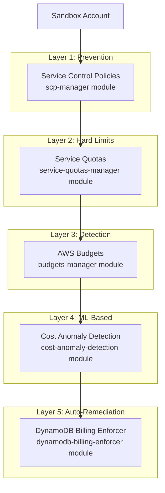
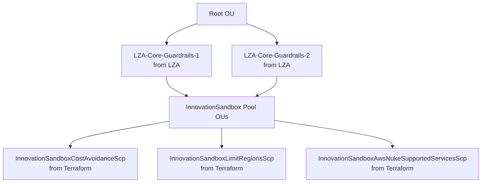
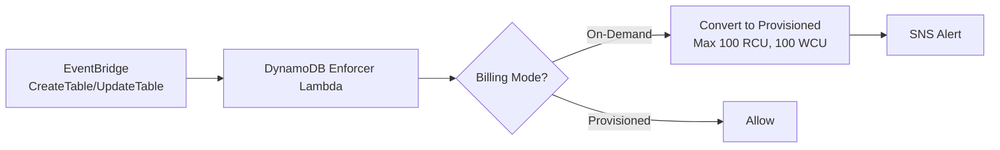

# Terraform SCP Management

## Executive Summary

The `ndx-try-aws-scp` repository implements a 5-layer defense-in-depth cost control system using Terraform modules. It provides Service Control Policies (SCPs), Service Quotas, AWS Budgets, Cost Anomaly Detection, and DynamoDB billing enforcement to protect 24-hour sandbox leases from cost attacks.

**Key Capabilities:**
- 5-layer defense architecture (SCPs, Quotas, Budgets, Anomaly Detection, DynamoDB Enforcer)
- Terraform-managed SCPs for Innovation Sandbox accounts
- Service quota templates (EC2: 64 vCPUs, Lambda: 25 concurrent, etc.)
- Daily budget: $50/day with aggressive alerting
- DynamoDB On-Demand auto-conversion to Provisioned mode

**Technology:** Terraform, AWS Organizations, Service Quotas, AWS Budgets, Cost Anomaly Detection

**Status:** Production

---

## Architecture Overview



---

## Module: scp-manager

**Purpose:** Create SCPs that PREVENT expensive AWS actions

**Key SCPs:**

| SCP Name | Purpose |
|----------|---------|
| `InnovationSandboxAwsNukeSupportedServicesScp` | Allowlist of permitted services |
| `InnovationSandboxLimitRegionsScp` | Region restrictions (eu-west-2, eu-west-1 + Bedrock exception) |
| `InnovationSandboxCostAvoidanceScp` | Comprehensive cost controls |

**Cost Controls:**
- EC2: Allowlist (t2, t3, t3a, m5, m6i small to xlarge), deny GPU/accelerated
- EBS: Block io1/io2, max 500GB volumes
- RDS: Instance class limits, Multi-AZ blocked
- 20+ expensive services blocked (SageMaker, EMR, Redshift, MSK, FSx)

---

## Module: service-quotas-manager

**Purpose:** Set hard limits on resource counts

**Key Quotas:**

| Service | Quota | Value | Purpose |
|---------|-------|-------|---------|
| EC2 | On-Demand vCPUs | 64 | ~16 t3.medium or ~8 t3.xlarge |
| EC2 | GPU instances | 0 | Cost protection |
| Lambda | Concurrent executions | 25 | Reduced from 100 to limit memory attacks |
| RDS | DB instances | 5 | Reasonable for testing |
| DynamoDB | Provisioned WCU | 1000 | ~$12/day |
| DynamoDB | Provisioned RCU | 1000 | ~$2/day |
| Bedrock | Tokens per model | Varies | Prevent API abuse |

---

## Comparison with LZA SCPs

### Overlap Analysis

**LZA SCPs (from docs/05-service-control-policies.md):**
- Protect CloudTrail, Config, LZA resources
- Deny root account usage
- Deny security service modifications

**Terraform SCPs (ndx-try-aws-scp):**
- Cost avoidance (instance types, service blocks)
- Region restrictions
- Service allowlist

**Verdict:** Complementary, not conflicting
- LZA SCPs: Security and compliance
- Terraform SCPs: Cost control
- Both can coexist on same accounts

### SCP Attachment Strategy



**Deployment:**
- LZA manages organization-wide SCPs
- Terraform manages Innovation Sandbox-specific SCPs
- No conflicts: Different policy names, different purposes

---

## Module: budgets-manager

**Purpose:** Detect overspending with aggressive alerting

**Budgets Created:**

| Budget Name | Amount | Alert Thresholds | SNS Topic |
|-------------|--------|------------------|-----------|
| Daily Budget | $50/day | 10%, 50%, 100% | ndx-budget-alerts |
| Monthly Budget | $1000/month | 80%, 100% | ndx-budget-alerts |
| CloudWatch Budget | $5/day | 100% | Critical - no quota for log ingestion |
| Lambda Budget | $10/day | 100% | ndx-budget-alerts |
| DynamoDB Budget | $5/day | 100% | ndx-budget-alerts |
| Bedrock Budget | $10/day | 100% | ndx-budget-alerts |
| EC2 Budget | $20/day | 100% | ndx-budget-alerts |
| RDS Budget | $10/day | 100% | ndx-budget-alerts |

---

## Module: cost-anomaly-detection

**Purpose:** ML-based unusual spending detection

**Configuration:**
- Anomaly threshold: $10 (daily alert)
- Immediate alert: >= daily budget
- Monitors: Services and linked accounts
- Learning period: ~2 weeks

---

## Module: dynamodb-billing-enforcer

**Purpose:** Auto-convert DynamoDB On-Demand to Provisioned mode

**Why needed?** DynamoDB On-Demand has UNLIMITED capacity, defeating all quotas.

**Implementation:**


**Cost Impact:**
- On-Demand: UNLIMITED (~$1000s/day if abused)
- Provisioned 100 RCU + 100 WCU: ~$1.87/day (safe)

---

## Deployment

```bash
cd environments/ndx-production
terraform init
terraform plan
terraform apply
```

**Module Outputs:**
- SCP policy IDs
- Service quota template ARN
- Budget ARNs
- Lambda function ARN (DynamoDB enforcer)

---

## Related Documentation

- [05-service-control-policies.md](05-service-control-policies.md) - Detailed SCP analysis
- [40-lza-configuration.md](40-lza-configuration.md) - LZA SCPs
- [00-repo-inventory.md](00-repo-inventory.md) - Repository overview

---

## Source Files Referenced

| File Path | Purpose |
|-----------|---------|
| `/repos/ndx-try-aws-scp/README.md` | Module documentation |
| `/repos/ndx-try-aws-scp/modules/scp-manager/` | SCP Terraform module |
| `/repos/ndx-try-aws-scp/modules/service-quotas-manager/` | Quota templates |
| `/repos/ndx-try-aws-scp/modules/budgets-manager/` | Budget definitions |
| `/repos/ndx-try-aws-scp/environments/ndx-production/` | Production config |

---

**Document Version:** 1.0
**Last Updated:** 2026-02-03
**Status:** Production
