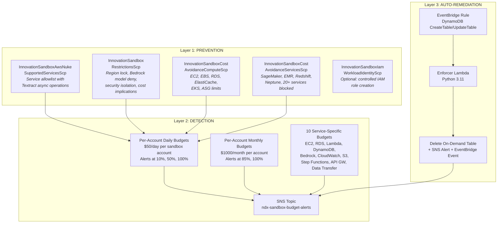
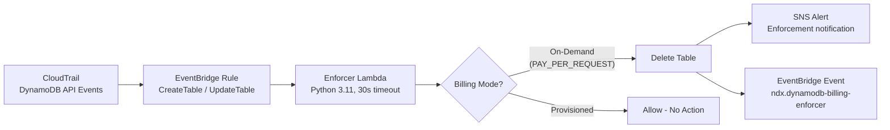
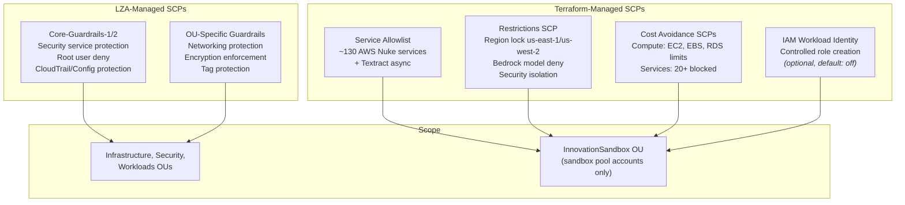

# Terraform SCP Management

> **Last Updated**: 2026-03-02
> **Source**: [https://github.com/co-cddo/ndx-try-aws-scp](https://github.com/co-cddo/ndx-try-aws-scp)
> **Captured SHA**: `912db2e`

## Executive Summary

The `ndx-try-aws-scp` repository implements a 3-layer defense-in-depth cost control system using Terraform modules to protect Innovation Sandbox 24-hour leases from cost abuse. The three layers are Service Control Policies (prevention), AWS Budgets with per-account isolation and service-specific tracking (detection), and a DynamoDB Billing Enforcer Lambda (auto-remediation). The system originated from a need to override and extend the default ISB SCPs to support NDX scenarios (Textract async operations, Bedrock cross-region inference) while simultaneously introducing comprehensive cost guardrails that the upstream ISB platform lacks.

## Design Context

The `PROPOSAL.md` in this repository documents the original problem statement: the Innovation Sandbox default SCPs were too restrictive for NDX scenarios (blocking Textract async operations and Bedrock cross-region inference) while simultaneously lacking cost controls. Investigation in January 2025 found that some issues were already resolved (Bedrock cross-region had an existing exception) while others required SCP modifications (Textract async operations) and entirely new SCPs (cost avoidance). The Terraform approach was chosen to take ownership of existing ISB-managed SCPs via `terraform import` and create new policies, avoiding conflicts with the LZA SCP revert mechanism.

---

## Architecture Overview


```mermaid
graph TB
    subgraph "Layer 1: PREVENTION"
        direction TB
        SCP_NUKE["InnovationSandboxAwsNuke<br/>SupportedServicesScp<br/><i>Service allowlist with<br/>Textract async operations</i>"]
        SCP_RESTRICT["InnovationSandbox<br/>RestrictionsScp<br/><i>Region lock, Bedrock model deny,<br/>security isolation, cost implications</i>"]
        SCP_COST_C["InnovationSandboxCost<br/>AvoidanceComputeScp<br/><i>EC2, EBS, RDS, ElastiCache,<br/>EKS, ASG limits</i>"]
        SCP_COST_S["InnovationSandboxCost<br/>AvoidanceServicesScp<br/><i>SageMaker, EMR, Redshift,<br/>Neptune, 20+ services blocked</i>"]
        SCP_IAM["InnovationSandboxIam<br/>WorkloadIdentityScp<br/><i>Optional: controlled IAM<br/>role creation</i>"]
    end

    subgraph "Layer 2: DETECTION"
        direction TB
        BUDGET_DAILY["Per-Account Daily Budgets<br/>$50/day per sandbox account<br/>Alerts at 10%, 50%, 100%"]
        BUDGET_MONTHLY["Per-Account Monthly Budgets<br/>$1000/month per account<br/>Alerts at 85%, 100%"]
        BUDGET_SVC["10 Service-Specific Budgets<br/>EC2, RDS, Lambda, DynamoDB,<br/>Bedrock, CloudWatch, S3,<br/>Step Functions, API GW, Data Transfer"]
        SNS["SNS Topic<br/>ndx-sandbox-budget-alerts"]
    end

    subgraph "Layer 3: AUTO-REMEDIATION"
        direction TB
        EB_RULE["EventBridge Rule<br/>DynamoDB CreateTable/UpdateTable"]
        LAMBDA["Enforcer Lambda<br/>Python 3.11"]
        ACTION["Delete On-Demand Table<br/>+ SNS Alert + EventBridge Event"]
    end

    SCP_NUKE --> BUDGET_DAILY
    SCP_RESTRICT --> BUDGET_DAILY
    SCP_COST_C --> BUDGET_DAILY
    SCP_COST_S --> BUDGET_DAILY
    BUDGET_DAILY --> SNS
    BUDGET_MONTHLY --> SNS
    BUDGET_SVC --> SNS
    EB_RULE --> LAMBDA --> ACTION
    ACTION --> SNS
```

---

## Module: scp-manager

**Location**: `modules/scp-manager/`

The SCP manager creates and attaches up to 5 Service Control Policies to the Innovation Sandbox pool OU. All policies exempt a standard set of administrative role ARN patterns from restrictions:

```
arn:aws:iam::*:role/InnovationSandbox-ndx*
arn:aws:iam::*:role/aws-reserved/sso.amazonaws.com/*AWSReservedSSO_ndx_IsbAdmins*
arn:aws:iam::*:role/stacksets-exec-*
arn:aws:iam::*:role/AWSControlTowerExecution
```

### SCPs Created

| SCP Name | Always Created | Attached To | Purpose |
|----------|---------------|-------------|---------|
| `InnovationSandboxAwsNukeSupportedServicesScp` | Yes | `sandbox_ou_id` | Allowlist of ~130 services via `NotAction` deny |
| `InnovationSandboxRestrictionsScp` | Yes | `sandbox_ou_id` | Region lock, Bedrock model deny, security isolation, cost implications, operational restrictions |
| `InnovationSandboxCostAvoidanceComputeScp` | When `enable_cost_avoidance = true` | `cost_avoidance_ou_id` or `sandbox_ou_id` | EC2, EBS, RDS, ElastiCache, EKS, ASG limits |
| `InnovationSandboxCostAvoidanceServicesScp` | When `enable_cost_avoidance = true` | `cost_avoidance_ou_id` or `sandbox_ou_id` | Block expensive ML/data/misc services |
| `InnovationSandboxIamWorkloadIdentityScp` | When `enable_iam_workload_identity = true` | `sandbox_ou_id` | Controlled IAM role/user creation with privilege escalation prevention |

The cost avoidance SCP is split into two policies (Compute and Services) due to the AWS 5,120 character limit per SCP.

### Service Allowlist (Nuke Supported Services)

The `InnovationSandboxAwsNukeSupportedServicesScp` uses a `NotAction` deny pattern to restrict sandbox accounts to approximately 130 services that AWS Nuke can clean up. Notable additions beyond the ISB defaults include Textract async operations:

- `textract:StartDocumentAnalysis`, `textract:StartDocumentTextDetection`
- `textract:StartExpenseAnalysis`, `textract:StartLendingAnalysis`
- `textract:GetDocumentAnalysis`, `textract:GetDocumentTextDetection`
- `textract:GetExpenseAnalysis`, `textract:GetLendingAnalysis`, `textract:GetLendingAnalysisSummary`

### Restrictions SCP

The restrictions SCP implements five categories of controls:

**Region Lock**: Denies all actions (except Bedrock) outside `us-east-1` and `us-west-2`. Bedrock is excluded to allow cross-region inference profiles.

**Expensive Bedrock Models**: Denies invocation of Claude Opus and Claude Sonnet models via ARN pattern matching on `anthropic.claude*opus*` and `anthropic.claude*sonnet*`.

**Security and Isolation**: Blocks account portal access, CloudTrail service-linked channel modification, Transit Gateway peer association, RAM resource sharing, SSM document permission modification, and WAF Firewall Manager disassociation. Also blocks `cloudtrail:LookupEvents` to prevent event log access by sandbox users.

**Cost Implications**: Blocks billing modifications, Cost Explorer configuration, reserved instance purchases, Savings Plans creation, and Shield subscriptions across 16 services.

**Operational Restrictions**: Blocks 40+ potentially dangerous or expensive actions including region enablement, CloudHSM usage, Direct Connect, Migration Hub, RoboMaker fleet management, Route53 Domains, and storage gateway operations.

### Compute Cost Controls

| Resource | Control | Default Values |
|----------|---------|----------------|
| EC2 Instance Types | Allowlist | t2.micro/small/medium, t3.micro-large, t3a.micro-large, m5.large/xlarge, m6i.large/xlarge |
| EC2 Denied Types | Explicit deny | p*, g*, inf*, trn*, dl*, u-*, *.metal*, *.12xlarge and larger |
| EBS Volume Types | Deny io1/io2 | io1, io2 blocked |
| EBS Volume Size | Max limit | 500 GB |
| RDS Instance Classes | Allowlist | db.t3.*, db.t4g.*, db.m5.large/xlarge, db.m6g/m6i.large/xlarge |
| RDS Multi-AZ | Configurable | Allowed (default: `true` in production) |
| ElastiCache Node Types | Allowlist | cache.t3.*, cache.t4g.*, cache.m5.large, cache.m6g.large |
| EKS Nodegroup Size | Max limit | 5 nodes |
| ASG Max Size | Max limit | 10 instances |
| Lambda Provisioned Concurrency | Blocked | PutProvisionedConcurrencyConfig denied |

### Expensive Services Blocked

SageMaker (endpoints, training jobs, tuning), EMR (RunJobFlow), Redshift (CreateCluster), GameLift (CreateFleet), plus 20+ additional services: Kafka, FSx, Kinesis streams, Dedicated Hosts, Reserved Instance purchases, Neptune, DocumentDB, MemoryDB, Elasticsearch/OpenSearch, Batch, Glue jobs/dev endpoints, Timestream, and QLDB.

### IAM Workload Identity SCP (Optional)

When enabled, this SCP allows sandbox users to create IAM roles and users for workloads (EC2 instance profiles, Lambda execution roles) while preventing privilege escalation. Users are blocked from creating or modifying roles matching protected patterns (`Admin*`, `OrganizationAccountAccessRole`, `AWSAccelerator*`, `AWSControlTower*`, `InnovationSandbox*`) and from passing or assuming these privileged roles.

---

## Module: budgets-manager

**Location**: `modules/budgets-manager/`

The budgets module implements dynamic per-account budget creation. The production environment's `main.tf` uses `aws_organizations_organizational_unit_descendant_accounts` to auto-discover all ACTIVE accounts in the sandbox pool OU, then creates individual budgets for each account. This eliminates manual account ID management and scales automatically as new pool accounts are added.

### Budget Types

**Per-Account Daily Budget**: $50/day per sandbox account with notifications at 10%, 50%, and 100% of actual spend. Each account gets its own isolated budget to prevent one account consuming another's allocation.

**Per-Account Monthly Budget**: $1000/month per sandbox account with notifications at 85% and 100% actual plus 100% forecasted spend.

**Consolidated Fallback**: If `sandbox_account_ids` is not provided, a single consolidated budget is created instead.

### Service-Specific Budgets

10 service-specific daily budgets provide granular visibility across all sandbox accounts:

| Service | Daily Limit | Alert Thresholds | Filter |
|---------|-------------|------------------|--------|
| EC2 Compute | $100 | 80%, 100% | Service filter |
| RDS | $30 | 80%, 100% | Service filter |
| Lambda | $50 | 80%, 100% | Service filter |
| DynamoDB | $50 | 80%, 100% | Service filter |
| Bedrock | $50 | 50%, 80%, 100% | Service filter |
| CloudWatch | configurable | 50%, 80%, 100% | Service filter |
| Step Functions | configurable | 80%, 100% | Service filter |
| S3 | configurable | 80%, 100% | Service filter |
| API Gateway | configurable | 80%, 100% | Service filter |
| Data Transfer | $20 | 80%, 100% | UsageType filter |

Bedrock and CloudWatch budgets include an additional 50% threshold for earlier detection due to their high abuse potential.

### Automated Actions

When `enable_automated_actions` is true, an IAM role is created allowing AWS Budgets to:
- Stop EC2 instances tagged with `ManagedBy: InnovationSandbox`
- Stop RDS instances and clusters
- Attach `AWSDenyAll` policy to users/roles (emergency lockdown)

---

## Module: dynamodb-billing-enforcer

**Location**: `modules/dynamodb-billing-enforcer/`

This module closes a critical cost control gap: DynamoDB On-Demand billing mode bypasses all WCU/RCU service quotas, allowing potentially unlimited costs.

### Architecture


```mermaid
flowchart LR
    CT["CloudTrail<br/>DynamoDB API Events"] --> EB["EventBridge Rule<br/>CreateTable / UpdateTable"]
    EB --> LF["Enforcer Lambda<br/>Python 3.11, 30s timeout"]
    LF --> CHECK{"Billing Mode?"}
    CHECK -->|"On-Demand<br/>(PAY_PER_REQUEST)"| DELETE["Delete Table"]
    CHECK -->|"Provisioned"| OK["Allow - No Action"]
    DELETE --> SNS_ALERT["SNS Alert<br/>Enforcement notification"]
    DELETE --> EB_EVENT["EventBridge Event<br/>ndx.dynamodb-billing-enforcer"]
```

### Implementation Details

- **Trigger**: EventBridge rule matching CloudTrail events for `dynamodb.amazonaws.com` with `CreateTable` or `UpdateTable` event names
- **Runtime**: Python 3.11 Lambda with 30-second timeout
- **Action**: Deletes On-Demand tables and publishes an SNS alert and EventBridge event
- **Exemptions**: Tables with name prefixes matching `exempt_table_prefixes` are not enforced
- **Log Retention**: 7 days (minimized for cost control)
- **Permissions**: `dynamodb:DescribeTable`, `dynamodb:DeleteTable`, `sns:Publish`, `events:PutEvents`

---

## Deployment

### State Management

Terraform state is stored in S3 with DynamoDB locking:

```
Bucket: ndx-terraform-state-955063685555
Key: scp-overrides/terraform.tfstate
Region: eu-west-2
DynamoDB Lock Table: ndx-terraform-locks
```

### Production Environment

```
environments/ndx-production/
  main.tf                 - Module orchestration with dynamic account discovery
  variables.tf            - Input variable definitions
  backend.tf              - S3 state backend configuration
  terraform.tfvars.example - Example configuration values
```

### Deployment Process

```bash
cd environments/ndx-production
terraform init
terraform plan
terraform apply
```

For first-time deployment with existing ISB-managed SCPs:

```bash
# Import existing SCPs into Terraform state
terraform import 'module.scp_manager.aws_organizations_policy.nuke_supported_services' p-xxxxxxxxx
terraform import 'module.scp_manager.aws_organizations_policy.restrictions' p-yyyyyyyyy
```

### GitHub Actions CI/CD

The `terraform.yaml` workflow provides automated plan on PR and apply on merge. The `production` environment in repository settings should be configured with required reviewers for approval gates before `terraform apply`.

### LZA Conflict Resolution

The LZA `scpRevertChangesConfig.enable: true` setting in `security-config.yaml` can revert Terraform-managed SCP changes. The PROPOSAL.md recommends setting this to `false` in the LZA configuration. The `InnovationSandboxRestrictionsScp` uses `lifecycle { prevent_destroy = true }` to prevent accidental Terraform destruction.

---

## Comparison with LZA SCPs

### Complementary Design


```mermaid
graph TB
    subgraph "LZA-Managed SCPs"
        direction TB
        LZA1["Core-Guardrails-1/2<br/>Security service protection<br/>Root user deny<br/>CloudTrail/Config protection"]
        LZA2["OU-Specific Guardrails<br/>Networking protection<br/>Encryption enforcement<br/>Tag protection"]
    end

    subgraph "Terraform-Managed SCPs"
        direction TB
        TF1["Service Allowlist<br/>~130 AWS Nuke services<br/>+ Textract async"]
        TF2["Restrictions SCP<br/>Region lock us-east-1/us-west-2<br/>Bedrock model deny<br/>Security isolation"]
        TF3["Cost Avoidance SCPs<br/>Compute: EC2, EBS, RDS limits<br/>Services: 20+ blocked"]
        TF4["IAM Workload Identity<br/>Controlled role creation<br/><i>(optional, default: off)</i>"]
    end

    subgraph "Scope"
        LZA_SCOPE["Infrastructure, Security,<br/>Workloads OUs"]
        TF_SCOPE["InnovationSandbox OU<br/>(sandbox pool accounts only)"]
    end

    LZA1 --> LZA_SCOPE
    LZA2 --> LZA_SCOPE
    TF1 --> TF_SCOPE
    TF2 --> TF_SCOPE
    TF3 --> TF_SCOPE
    TF4 --> TF_SCOPE
```

**LZA SCPs** focus on security and compliance: protecting CloudTrail, Config, GuardDuty, Security Hub, IAM roles, networking, and encryption. They are attached to Infrastructure, Security, and Workloads OUs.

**Terraform SCPs** focus on cost control and scenario enablement: service allowlists, region restrictions, compute/service cost limits, and Bedrock model restrictions. They are attached exclusively to the InnovationSandbox pool OU.

Both can coexist on sandbox accounts without conflict. LZA SCPs inherited through the organizational hierarchy provide the security baseline, while Terraform SCPs layered at the sandbox OU provide cost controls.

---

## Testing

The repository includes Python-based tests in `tests/`:
- `test_dynamodb_enforcer.py` - Tests for the DynamoDB billing enforcer Lambda
- `conftest.py` - pytest fixtures
- `requirements.txt` - Test dependencies

Additional documentation in `docs/`:
- `EVENTBRIDGE_EVENTS.md` - Event schemas emitted by the enforcer
- `GITHUB_ACTIONS_SETUP.md` - CI/CD configuration guide
- `SCP_CONSOLIDATION_ANALYSIS.md` - Analysis of SCP consolidation options

---

## Cost Protection Summary

### Maximum Bounded Daily Cost (All Defenses Active)

| Category | Protection Layer | Max Daily Cost |
|----------|-----------------|----------------|
| EC2 Compute | SCP (instance type limits) | ~$77 |
| EBS Storage | SCP (io1/io2 blocked, 500GB max) | ~$6 |
| RDS | SCP (instance class limits) | ~$22 |
| ElastiCache | SCP (node type limits) | ~$40 |
| Lambda | Budget ($50/day) | ~$50 |
| DynamoDB | Enforcer (table deletion) | ~$0 |
| Bedrock | Budget ($50/day) + model deny | ~$50 |
| CloudWatch | Budget (configurable) | ~$5+ |
| GPU/Expensive Services | SCP (blocked) | $0 |
| **Total Bounded** | | **~$250/day** |

### Attack Vector Coverage

| Vector | Layer 1 (SCP) | Layer 2 (Budget) | Layer 3 (Enforcer) |
|--------|---------------|------------------|---------------------|
| GPU Instances | Blocked | $100/day EC2 | - |
| Large EC2 | Type limit | $100/day EC2 | - |
| EBS io1/io2 | Blocked | via EC2 budget | - |
| RDS Multi-AZ | Configurable | $30/day RDS | - |
| Lambda Memory | No SCP key | $50/day Lambda | - |
| DynamoDB On-Demand | No SCP key | $50/day DynamoDB | Table deletion |
| CloudWatch Logs | No SCP key | Configurable | - |
| SageMaker/EMR/Redshift | Blocked | - | - |

---

## Related Documentation

- [05-service-control-policies.md](05-service-control-policies.md) - Comprehensive SCP analysis across all repos
- [40-lza-configuration.md](40-lza-configuration.md) - LZA configuration and LZA-managed SCPs
- [42-terraform-resources.md](42-terraform-resources.md) - Organization-level Terraform resources
- [00-repo-inventory.md](00-repo-inventory.md) - Repository overview

---

## Source Files Referenced

| File Path | Purpose |
|-----------|---------|
| `repos/ndx-try-aws-scp/PROPOSAL.md` | Design intent and investigation findings |
| `repos/ndx-try-aws-scp/README.md` | Module documentation and deployment guide |
| `repos/ndx-try-aws-scp/modules/scp-manager/main.tf` | SCP resource definitions (~720 lines) |
| `repos/ndx-try-aws-scp/modules/scp-manager/variables.tf` | SCP configuration variables |
| `repos/ndx-try-aws-scp/modules/budgets-manager/main.tf` | Budget resource definitions |
| `repos/ndx-try-aws-scp/modules/dynamodb-billing-enforcer/main.tf` | Lambda enforcer infrastructure |
| `repos/ndx-try-aws-scp/modules/dynamodb-billing-enforcer/lambda/index.py` | Enforcer Lambda code |
| `repos/ndx-try-aws-scp/environments/ndx-production/main.tf` | Production environment orchestration |
| `repos/ndx-try-aws-scp/environments/ndx-production/variables.tf` | Production variables |
| `repos/ndx-try-aws-scp/environments/ndx-production/backend.tf` | S3 state backend |
| `repos/ndx-try-aws-scp/environments/ndx-production/terraform.tfvars.example` | Example configuration |
| `repos/ndx-try-aws-scp/tests/test_dynamodb_enforcer.py` | Enforcer unit tests |
| `repos/ndx-try-aws-scp/scripts/bootstrap-backend.sh` | State backend bootstrap |
| `repos/ndx-try-aws-scp/scripts/import-existing-scps.sh` | SCP import automation |
| `repos/ndx-try-aws-scp/docs/EVENTBRIDGE_EVENTS.md` | Event schemas |
| `repos/ndx-try-aws-scp/docs/GITHUB_ACTIONS_SETUP.md` | CI/CD setup |
| `repos/ndx-try-aws-scp/docs/SCP_CONSOLIDATION_ANALYSIS.md` | SCP analysis |

---
*Generated from source analysis. See [00-repo-inventory.md](./00-repo-inventory.md) for full inventory.*
