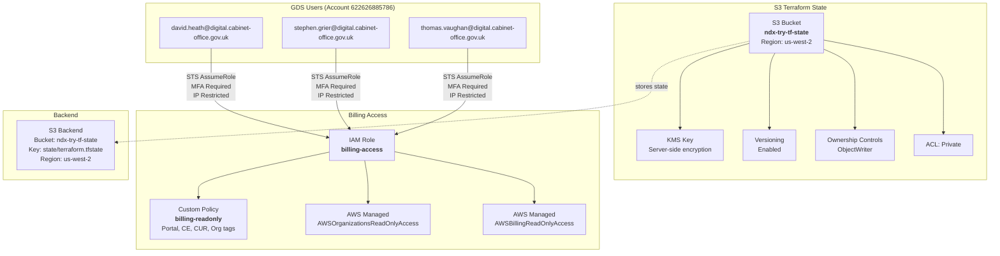
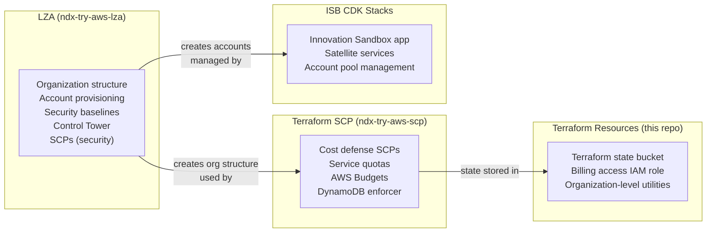

# Terraform Resources (Organization Management)

> **Last Updated**: 2026-03-02
> **Source**: [https://github.com/co-cddo/ndx-try-aws-terraform](https://github.com/co-cddo/ndx-try-aws-terraform)
> **Captured SHA**: `3a1ed1b`

## Executive Summary

The `ndx-try-aws-terraform` repository provides minimal Terraform configuration for NDX organization-level resources that fall outside the scope of both the Landing Zone Accelerator and the Innovation Sandbox platform. It provisions an encrypted, versioned S3 bucket for Terraform remote state storage and creates an IAM role granting MFA-protected, IP-restricted billing read-only access to three designated GDS users. The repository uses AWS provider v6.22+ with Terraform v1.14+ and stores its own state in the S3 bucket it creates.

## Resource Architecture



---

## Resources Managed

### 1. Terraform State S3 Bucket

The S3 bucket `ndx-try-tf-state` provides remote state storage for Terraform configurations across the NDX organization, including this repository's own state (bootstrapped locally, then migrated).

**Resource Configuration:**

| Resource | Type | Purpose |
|----------|------|---------|
| `aws_s3_bucket.ndx_try_tf_state` | `aws_s3_bucket` | Bucket `ndx-try-tf-state` |
| `aws_s3_bucket_versioning.ndx_try_tf_state_versioning` | `aws_s3_bucket_versioning` | Versioning enabled for rollback |
| `aws_s3_bucket_server_side_encryption_configuration.ndx_try_tf_state_encryption` | `aws_s3_bucket_server_side_encryption_configuration` | KMS encryption (aws:kms) |
| `aws_kms_key.ndx_try_tf_state_kms_key` | `aws_kms_key` | Dedicated encryption key (10-day deletion window) |
| `aws_s3_bucket_ownership_controls.private_storage` | `aws_s3_bucket_ownership_controls` | ObjectWriter ownership |
| `aws_s3_bucket_acl.ndx_try_tf_state_acl` | `aws_s3_bucket_acl` | Private ACL |

**Security Features:**
- KMS encryption with a dedicated key (not AWS-managed)
- Versioning enabled for state rollback capability
- Private ACL prevents public access
- ObjectWriter ownership controls ensure the bucket creator owns uploaded objects

### 2. Billing Access IAM Role

The `billing-access` IAM role grants read-only billing, cost, and organization visibility to three GDS (Government Digital Service) users. Access requires both MFA authentication and source IP restriction to GDS network ranges.

**Assume Role Conditions:**

| Condition | Type | Values |
|-----------|------|--------|
| MFA | `Bool: aws:MultiFactorAuthPresent` | `true` (required) |
| Source IP | `IpAddress: aws:SourceIp` | 6 GDS CIDR ranges |

**Allowed Source IPs:**

| CIDR | Network |
|------|---------|
| `217.196.229.77/32` | GovWifi |
| `217.196.229.79/32` | Brattain |
| `217.196.229.80/32` | GDS BYOD VPN |
| `217.196.229.81/32` | GDS VPN |
| `51.149.8.0/25` | GDS/CO VPN |
| `51.149.8.128/29` | GDS BYOD VPN |

**Attached Policies (3):**

| Policy | Type | Permissions |
|--------|------|-------------|
| `billing-readonly` | Custom | `aws-portal:View*`, `ce:Get*/List*/Describe*`, `health:Describe*`, `s3:HeadBucket`, `s3:ListAllMyBuckets`, `cur:DescribeReportDefinition`, `organizations:ListTagsForResource` |
| `AWSOrganizationsReadOnlyAccess` | AWS Managed | Full read-only access to Organizations |
| `AWSBillingReadOnlyAccess` | AWS Managed | Full read-only access to Billing console |

---

## Provider and Backend Configuration

### Provider (`terraform.tf`)

```hcl
terraform {
  required_providers {
    aws = {
      source  = "hashicorp/aws"
      version = "~> 6.22"
    }
  }
  required_version = ">= 1.14"
}
```

The AWS provider targets region `us-west-2` as the primary deployment region.

### Backend

State is stored in the S3 bucket that this same Terraform configuration creates:

```hcl
backend "s3" {
  bucket = "ndx-try-tf-state"
  key    = "state/terraform.tfstate"
  region = "us-west-2"
}
```

This creates a bootstrap dependency: the bucket must be created with local state first, then the backend is migrated to S3 via `terraform init -migrate-state`. The state stored in this bucket is also consumed by the `ndx-try-aws-scp` repository (stored at key `scp-overrides/terraform.tfstate` in the same bucket).

---

## Relationship to Other IaC Repositories

### IaC Responsibility Matrix



**No overlap between repositories:**
- **LZA** manages organizational structure, accounts, security baselines, and compliance SCPs
- **Terraform SCP** manages Innovation Sandbox cost defense layers
- **This repository** manages organization-level utility resources (state storage, billing access)
- **ISB CDK** manages the Innovation Sandbox application and satellite services

The S3 bucket in this repository serves as shared state infrastructure for both this repo (key: `state/terraform.tfstate`) and the SCP repo (key: `scp-overrides/terraform.tfstate`).

---

## Deployment

### Initial Bootstrap

```bash
# 1. Clone and init with local state
git clone https://github.com/co-cddo/ndx-try-aws-terraform.git
cd ndx-try-aws-terraform

# 2. Create S3 bucket (local state initially)
terraform init
terraform apply

# 3. Migrate state to S3
terraform init -migrate-state
```

### Ongoing Updates

```bash
terraform init
terraform plan
terraform apply
```

### Usage: Billing Access

```bash
# Assume billing role (requires MFA and GDS network)
aws sts assume-role \
  --role-arn arn:aws:iam::MANAGEMENT_ACCOUNT:role/billing-access \
  --role-session-name billing-session \
  --serial-number arn:aws:iam::622626885786:mfa/USER \
  --token-code 123456

# Query cost data
aws ce get-cost-and-usage \
  --time-period Start=2026-02-01,End=2026-03-01 \
  --granularity DAILY \
  --metrics BlendedCost
```

---

## Security Considerations

- The KMS key for the state bucket uses a 10-day deletion window, providing a safeguard against accidental key deletion
- The billing role requires both MFA and IP-based conditions, implementing defense-in-depth for privileged access
- The billing role is scoped to read-only actions across billing, cost, and organization services with no write permissions
- The S3 bucket does not have a DynamoDB lock table configured; consider adding state locking for concurrent access protection
- GDS user account ID (`622626885786`) is hardcoded as a trusted principal

---

## Related Documentation

- [40-lza-configuration.md](40-lza-configuration.md) - LZA organization structure and accounts
- [41-terraform-scp.md](41-terraform-scp.md) - Cost defense Terraform (uses this repo's state bucket)
- [00-repo-inventory.md](00-repo-inventory.md) - Repository overview

---

## Source Files Referenced

| File Path | Purpose |
|-----------|---------|
| `repos/ndx-try-aws-terraform/main.tf` | S3 bucket, KMS key, IAM role, and policy definitions |
| `repos/ndx-try-aws-terraform/terraform.tf` | Provider version constraints and S3 backend configuration |
| `repos/ndx-try-aws-terraform/README.md` | Repository context and scope description |

---
*Generated from source analysis. See [00-repo-inventory.md](./00-repo-inventory.md) for full inventory.*
