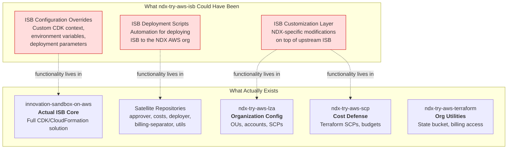

# NDX Try AWS ISB Repository

> **Last Updated**: 2026-03-02
> **Source**: [https://github.com/co-cddo/ndx-try-aws-isb](https://github.com/co-cddo/ndx-try-aws-isb)
> **Captured SHA**: `70bb7ec`

## Executive Summary

The `ndx-try-aws-isb` repository is an empty placeholder containing only a `.gitignore` file and an MIT license. Despite its name suggesting it would house Innovation Sandbox (ISB) configuration or customization for the NDX:Try platform, the repository has never been populated with source code, infrastructure definitions, or documentation. The actual ISB implementation resides in the `innovation-sandbox-on-aws` repository (upstream AWS solution fork) and its satellite repositories, while AWS organizational configuration is managed by `ndx-try-aws-lza` and `ndx-try-aws-terraform`.

## Repository Contents

The repository contains exactly two files beyond the `.git/` directory:

```
ndx-try-aws-isb/
  .git/            # Git repository metadata
  .gitignore       # Standard Node.js .gitignore file
  LICENSE          # MIT License, Copyright (c) 2025 Central Digital and Data Office
```

There is no source code, no infrastructure-as-code definitions, no configuration files, no GitHub Actions workflows, and no documentation.

---

## Intended Purpose Analysis

Based on naming conventions and cross-references across the NDX:Try ecosystem, this repository was likely intended to serve one or more of the following purposes:



### Evidence from Cross-References

The `ndx-try-aws-terraform` README explicitly references this repository:

> This repo **does not** contain Innovation Sandbox (ISB) files.
> ISB files are found in [ndx-try-aws-isb](https://github.com/co-cddo/ndx-try-aws-isb).

This suggests `ndx-try-aws-isb` was originally intended to house ISB-specific configuration. However, the ISB implementation was ultimately deployed directly from the upstream `innovation-sandbox-on-aws` fork, with NDX-specific extensions handled by the satellite repositories (approver, costs, deployer, billing-separator) and organizational configuration managed by `ndx-try-aws-lza` and `ndx-try-aws-scp`.

### License Context

The MIT License is dated 2025 and attributed to the "Central Digital and Data Office" (CDDO), consistent with the other NDX:Try repositories. The `.gitignore` follows a standard Node.js template, suggesting the original intent may have been a Node.js/TypeScript CDK project.

---

## Current State

| Attribute | Status |
|-----------|--------|
| Source code | None |
| Infrastructure definitions | None |
| Documentation | None |
| GitHub Actions workflows | None |
| Dependencies | None |
| Test suite | None |
| Last substantive commit | Initial repository creation |
| Active development | No |

---

## Where ISB Functionality Actually Lives

The Innovation Sandbox platform is distributed across multiple repositories, none of which is `ndx-try-aws-isb`:

| Repository | Function | Relationship |
|------------|----------|-------------|
| `innovation-sandbox-on-aws` | ISB Core platform (CDK + CloudFormation) | The actual ISB solution |
| `innovation-sandbox-on-aws-approver` | Automated lease approval (19-rule scoring engine) | Satellite service |
| `innovation-sandbox-on-aws-costs` | Post-lease cost collection | Satellite service |
| `innovation-sandbox-on-aws-deployer` | Scenario deployment to sandbox accounts | Satellite service |
| `innovation-sandbox-on-aws-billing-seperator` | 72-hour billing cooldown (temporary workaround) | Satellite service |
| `innovation-sandbox-on-aws-utils` | Pool account creation scripts | Utility |
| `ndx-try-aws-lza` | AWS organization structure and ISB OUs | Organization config |
| `ndx-try-aws-scp` | Cost defense SCPs for sandbox accounts | Cost controls |

---

## Recommendation

This repository should be considered for archival to reduce confusion and maintenance overhead. No active code or configuration depends on it, and the README in `ndx-try-aws-terraform` cross-references it misleadingly as the home for ISB files.

**If archiving:**
1. Archive the repository via GitHub settings
2. Update the `ndx-try-aws-terraform` README to point to `innovation-sandbox-on-aws` instead
3. Add an archived notice to the repository description

**If retaining for future use:**
1. Add a README explaining the intended purpose and current empty state
2. Document which specific ISB customizations would be housed here
3. Link to the actual ISB implementation repositories

---

## Related Documentation

- [10-isb-core-architecture.md](10-isb-core-architecture.md) - Actual ISB Core architecture (innovation-sandbox-on-aws)
- [40-lza-configuration.md](40-lza-configuration.md) - LZA organization structure including ISB OUs
- [41-terraform-scp.md](41-terraform-scp.md) - Terraform cost defense for sandbox accounts
- [00-repo-inventory.md](00-repo-inventory.md) - Full repository inventory

---

## Source Files Referenced

| File Path | Purpose |
|-----------|---------|
| `repos/ndx-try-aws-isb/.gitignore` | Standard Node.js .gitignore |
| `repos/ndx-try-aws-isb/LICENSE` | MIT License, CDDO 2025 |
| `repos/ndx-try-aws-terraform/README.md` | Cross-reference to this repository |

---
*Generated from source analysis. See [00-repo-inventory.md](./00-repo-inventory.md) for full inventory.*
