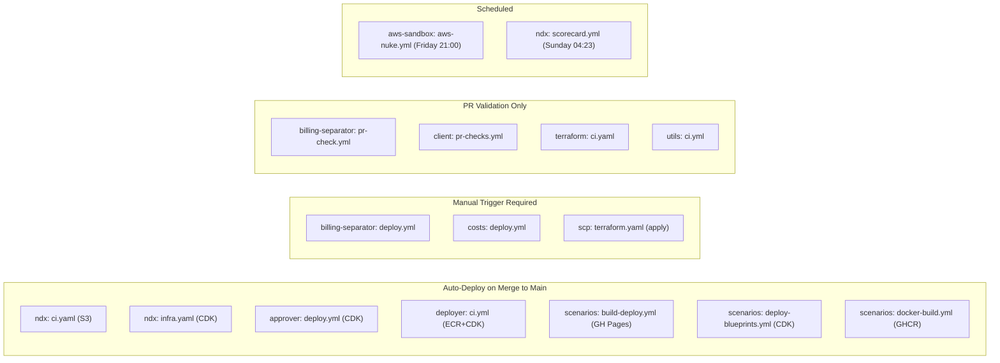

# GitHub Actions Workflow Inventory

> **Last Updated**: 2026-03-02
> **Sources**: All repositories under `repos/` with `.github/workflows/` directories

## Executive Summary

The NDX:Try AWS ecosystem uses GitHub Actions for automated CI/CD across 10 of 15 repositories, with 25 distinct workflow files implementing continuous integration, deployment, testing, security scanning, and scheduled maintenance. All deployment workflows use GitHub OIDC for credential-less AWS authentication, and the ecosystem spans multiple AWS accounts (568672915267 for the hub, 955063685555 for org management) in us-east-1 and us-west-2. Five repositories either lack CI/CD automation, contain only LZA configuration managed via the AWS console pipeline, or are limited to validation-only workflows.

## CI/CD Pipeline Overview

```mermaid
graph TB
    subgraph "NDX Website (ndx)"
        NDX_CI["ci.yaml<br/>Build + Test + Deploy S3"]
        NDX_INFRA["infra.yaml<br/>CDK Deploy Infrastructure"]
        NDX_TEST["test.yml<br/>Frontend Tests"]
        NDX_A11Y["accessibility.yml<br/>WCAG 2.2 AA"]
        NDX_SC["scorecard.yml<br/>Supply Chain Security"]
    end

    subgraph "Scenarios Microsite (ndx_try_aws_scenarios)"
        SCEN_BD["build-deploy.yml<br/>Build + Deploy GH Pages"]
        SCEN_BP["deploy-blueprints.yml<br/>Deploy CF Templates"]
        SCEN_DK["docker-build.yml<br/>Build Drupal Container"]
    end

    subgraph "ISB Satellite Repos"
        APP_D["approver: deploy.yml<br/>CDK Deploy Lambda"]
        BILL_D["billing-separator: deploy.yml<br/>CDK Deploy"]
        BILL_PR["billing-separator: pr-check.yml<br/>Validate PRs"]
        COST_CI["costs: ci.yml<br/>Build + Test"]
        COST_D["costs: deploy.yml<br/>CDK Deploy"]
        DEP_CI["deployer: ci.yml<br/>Build + ECR + CDK"]
        CLI_PR["client: pr-checks.yml<br/>Lint + Test"]
        CLI_REL["client: release.yml<br/>GitHub Release"]
        UTIL_CI["utils: ci.yml<br/>Placeholder CI"]
    end

    subgraph "Infrastructure Repos"
        SCP_TF["ndx-try-aws-scp: terraform.yaml<br/>TF Plan/Apply SCPs"]
        TF_CI["ndx-try-aws-terraform: ci.yaml<br/>TF Validate"]
    end

    subgraph "Legacy / Sandbox"
        AWS_NUKE["aws-sandbox: aws-nuke.yml<br/>Weekly Nuke"]
        AWS_ACCESS["aws-sandbox: deploy-access-lambda.yml<br/>TF Deploy"]
        AWS_IAM["aws-sandbox: update-iam.yml<br/>TF Deploy"]
        AWS_TAG["aws-sandbox: update-autotags.yml<br/>AutoTag (disabled)"]
        MISP_DOK["gc3-misp: docker-ok.yml<br/>TF Validate"]
        MISP_ECS["gc3-misp: ecs-efs.yml<br/>TF Validate"]
    end

    NDX_CI -->|"S3 + CloudFront"| AWS_HUB["AWS Hub Account<br/>568672915267"]
    NDX_INFRA -->|"CDK Deploy"| AWS_HUB
    NDX_INFRA -->|"Cross-Account"| AWS_ISB["AWS ISB Account<br/>955063685555"]
    APP_D -->|"CDK Deploy"| AWS_HUB
    COST_D -->|"CDK Deploy"| AWS_HUB
    DEP_CI -->|"ECR + CDK"| AWS_HUB
    BILL_D -->|"CDK Deploy"| AWS_HUB
    SCP_TF -->|"TF Apply"| AWS_ISB
    SCEN_BP -->|"CDK Deploy"| AWS_HUB
    AWS_NUKE -->|"Nuke Resources"| AWS_SANDBOX["AWS Sandbox Account"]
```

## Workflow Catalog

### Repository: ndx (NDX Website)

#### 1. ci.yaml -- CI Pipeline

| Property | Value |
|----------|-------|
| **File** | `.github/workflows/ci.yaml` |
| **Purpose** | Build, lint, test (unit + E2E + accessibility), and deploy static site to S3/CloudFront |
| **Triggers** | `push` (main), `pull_request` (main), `merge_group` (main), `workflow_dispatch` |
| **Region** | us-west-2 |
| **Node Version** | 20.17.0 (via `.nvmrc`) |

**Jobs:**
- `build` -- Build Eleventy site (with path filtering to skip if no frontend changes)
- `test-unit` -- Jest unit tests
- `test-e2e` -- Playwright E2E tests (sharded across 2 runners)
- `test-a11y` -- Playwright accessibility tests (sharded across 2 runners)
- `deploy-s3` -- Sync `_site/` to `s3://ndx-static-prod/`, invalidate CloudFront distribution `E3THG4UHYDHVWP`
- `semver` -- Generate semantic version number

**IAM Role:** `arn:aws:iam::568672915267:role/GitHubActions-NDX-ContentDeploy`

**Secrets/Variables:** None beyond OIDC role (hardcoded in workflow)

**Security:** Harden Runner (egress audit), pinned action SHAs, path-based change detection

#### 2. infra.yaml -- Infrastructure Pipeline

| Property | Value |
|----------|-------|
| **File** | `.github/workflows/infra.yaml` |
| **Purpose** | CDK infrastructure deployment for NDX website backend and signup system |
| **Triggers** | `push` (main), `pull_request` (main), `merge_group` (main), `workflow_dispatch` |
| **Region** | us-west-2 |

**Jobs:**
- `infra-unit-tests` -- CDK stack unit tests (path filtered to `infra/`)
- `infra-e2e-tests` -- GOV.UK Notify E2E tests (currently disabled)
- `cdk-diff` -- CDK diff on PRs with readonly role, comments on PR
- `cdk-deploy` -- Deploy CDK stacks on push to main
- `signup-infra-unit-tests` -- Tests for signup Lambda infrastructure
- `signup-cdk-deploy` -- Deploy signup Lambda to NDX account
- `isb-cross-account-role-deploy` -- Deploy CloudFormation cross-account role to ISB account

**IAM Roles:**
- `arn:aws:iam::568672915267:role/GitHubActions-NDX-InfraDiff` (readonly, PR diffs)
- `arn:aws:iam::568672915267:role/GitHubActions-NDX-InfraDeploy` (deploy)
- `arn:aws:iam::955063685555:role/GitHubActions-ISB-InfraDeploy` (cross-account)

**Secrets/Variables:**
- `NOTIFY_SANDBOX_API_KEY` (E2E tests, currently disabled)
- `NOTIFY_TEMPLATE_LEASE_APPROVED` (E2E tests, currently disabled)
- `ISB_NDX_USERS_GROUP_ID` (cross-account role deploy)

**Security:** Fork PRs explicitly blocked from assuming AWS roles (defense-in-depth)

#### 3. test.yml -- Frontend Tests

| Property | Value |
|----------|-------|
| **File** | `.github/workflows/test.yml` |
| **Purpose** | Run frontend unit tests and signup Lambda tests |
| **Triggers** | `push` (main), `pull_request` (main), `merge_group` (main) |

**Jobs:**
- `test` -- Unit tests (Jest), Playwright (currently disabled), mitmproxy integration, signup Lambda tests

#### 4. accessibility.yml -- Accessibility Tests

| Property | Value |
|----------|-------|
| **File** | `.github/workflows/accessibility.yml` |
| **Purpose** | WCAG 2.2 AA compliance testing via pa11y-ci and Lighthouse |
| **Triggers** | `push` (main), `pull_request` (main), `merge_group` (main) |

**Jobs:**
- `accessibility` -- pa11y-ci tests against built site
- `lighthouse` -- Lighthouse CI accessibility audit

#### 5. scorecard.yml -- Supply Chain Security

| Property | Value |
|----------|-------|
| **File** | `.github/workflows/scorecard.yml` |
| **Purpose** | OpenSSF Scorecard analysis for supply chain security |
| **Triggers** | `push` (main), `schedule` (weekly, Sundays), `branch_protection_rule` |

**Jobs:**
- `analysis` -- Run Scorecard, upload SARIF to code-scanning dashboard

---

### Repository: ndx_try_aws_scenarios (Scenarios Microsite)

#### 6. build-deploy.yml -- Build and Deploy to GitHub Pages

| Property | Value |
|----------|-------|
| **File** | `.github/workflows/build-deploy.yml` |
| **Purpose** | Validate schemas, build Eleventy site, run accessibility/Lighthouse tests, deploy to GitHub Pages |
| **Triggers** | `push` (main), `pull_request` (main), `merge_group` (main), `workflow_dispatch` |

**Jobs:**
- `validate-schema` -- Validate `scenarios.yaml` against JSON schema
- `build` -- Build Eleventy site, upload Pages artifact
- `accessibility` -- pa11y-ci tests
- `lighthouse` -- Lighthouse CI
- `deploy` -- Deploy to GitHub Pages (main only)

#### 7. deploy-blueprints.yml -- Deploy ISB Blueprints

| Property | Value |
|----------|-------|
| **File** | `.github/workflows/deploy-blueprints.yml` |
| **Purpose** | Synthesize CDK for LocalGov Drupal, deploy CloudFormation templates to ISB Hub |
| **Triggers** | `push` (main, specific paths), `workflow_dispatch` |
| **Region** | us-west-2 |

**IAM Role:** `arn:aws:iam::568672915267:role/isb-hub-github-actions-deploy`

**Jobs:**
- `synth-localgov-drupal` -- CDK synth, strip bootstrap cruft, validate template
- `deploy` -- Deploy to ISB Hub via CDK

#### 8. docker-build.yml -- Build LocalGov Drupal Container

| Property | Value |
|----------|-------|
| **File** | `.github/workflows/docker-build.yml` |
| **Purpose** | Build and publish LocalGov Drupal container to ghcr.io |
| **Triggers** | `push` (main, docker/drupal paths), `pull_request`, `workflow_dispatch` |
| **Registry** | `ghcr.io/co-cddo/ndx_try_aws_scenarios-localgov_drupal` |

**Jobs:**
- `changes` -- Check for Docker file changes (PR only)
- `build` -- Build and push multi-arch Docker image to GHCR

---

### Repository: innovation-sandbox-on-aws-approver

#### 9. deploy.yml -- Approver CI/CD

| Property | Value |
|----------|-------|
| **File** | `.github/workflows/deploy.yml` |
| **Purpose** | Build, test, and deploy the ISB Approver Lambda |
| **Triggers** | `push` (main), `pull_request` (main), `merge_group` (main) |
| **Region** | us-west-2 |

**IAM Role:** `arn:aws:iam::568672915267:role/GitHubActions-Approver-InfraDeploy`

**Auto-deploys on push to main.** Runs lint, typecheck, and tests on all events.

---

### Repository: innovation-sandbox-on-aws-billing-seperator

#### 10. deploy.yml -- Billing Separator Deployment

| Property | Value |
|----------|-------|
| **File** | `.github/workflows/deploy.yml` |
| **Purpose** | Validate and deploy the ISB Billing Separator CDK stack |
| **Triggers** | `push` (main), `workflow_dispatch` (with environment choice: dev/prod) |

**IAM Role:** `${{ secrets.AWS_ROLE_ARN }}` (per environment)

**Jobs:**
- `validate` -- Lint, test, build, CDK synth with test parameters
- `deploy` -- CDK deploy (manual trigger only via `workflow_dispatch`)

#### 11. pr-check.yml -- Billing Separator PR Validation

| Property | Value |
|----------|-------|
| **File** | `.github/workflows/pr-check.yml` |
| **Purpose** | Validate PRs: lint, test, build, CDK synth |
| **Triggers** | `pull_request` (main), `merge_group` (main) |

---

### Repository: innovation-sandbox-on-aws-costs

#### 12. ci.yml -- Costs CI

| Property | Value |
|----------|-------|
| **File** | `.github/workflows/ci.yml` |
| **Purpose** | Lint, test, build, CDK synth validation |
| **Triggers** | `push` (all branches), `pull_request` (main), `merge_group` |

#### 13. deploy.yml -- Costs Deployment

| Property | Value |
|----------|-------|
| **File** | `.github/workflows/deploy.yml` |
| **Purpose** | Deploy IsbCostCollectionStack via CDK |
| **Triggers** | `workflow_dispatch` only |
| **Region** | us-west-2 |

**IAM Role:** `${{ secrets.AWS_ROLE_ARN }}`

**Secrets/Variables:**
- `COST_EXPLORER_ROLE_ARN`, `ISB_API_BASE_URL`, `ISB_JWT_SECRET_PATH`, `COST_COLLECTOR_LAMBDA_ROLE_ARN`, `ISB_JWT_SECRET_KMS_KEY_ARN`
- Variables: `EVENT_BUS_NAME`, `ALERT_EMAIL`

---

### Repository: innovation-sandbox-on-aws-deployer

#### 14. ci.yml -- Deployer CI/CD Pipeline

| Property | Value |
|----------|-------|
| **File** | `.github/workflows/ci.yml` |
| **Purpose** | Full CI/CD: lint, typecheck, test, build Docker container, push to ECR, CDK deploy |
| **Triggers** | `push` (main), `pull_request` (main), `merge_group` (main), `workflow_dispatch` |
| **Region** | us-west-2 |

**Jobs:**
- `lint` -- ESLint + format check
- `typecheck` -- TypeScript type check
- `test` -- Tests with coverage, Codecov upload
- `build` -- Build Lambda handler, Docker image (ARM64), upload as artifact
- `deploy` -- Push image to ECR (`isb-deployer-prod`), CDK deploy `DeployerStack`, wait for Lambda update

**IAM Role:** `${{ secrets.AWS_DEPLOY_ROLE_ARN }}`

---

### Repository: innovation-sandbox-on-aws-client

#### 15. pr-checks.yml -- Client Library PR Checks

| Property | Value |
|----------|-------|
| **File** | `.github/workflows/pr-checks.yml` |
| **Purpose** | Lint, typecheck, test for the ISB TypeScript client library |
| **Triggers** | `push` (main), `pull_request` (main), `merge_group` |
| **Package Manager** | Yarn |

#### 16. release.yml -- Client Library Release

| Property | Value |
|----------|-------|
| **File** | `.github/workflows/release.yml` |
| **Purpose** | Build, pack, and create GitHub Release with tarball |
| **Triggers** | `push` (tags matching `v*.*.*`) |

---

### Repository: innovation-sandbox-on-aws-utils

#### 17. ci.yml -- Utils CI (Placeholder)

| Property | Value |
|----------|-------|
| **File** | `.github/workflows/ci.yml` |
| **Purpose** | Placeholder CI check (echo only) |
| **Triggers** | `push` (main), `pull_request` (main), `merge_group` |

---

### Repository: ndx-try-aws-scp (Terraform SCP Management)

#### 18. terraform.yaml -- Terraform SCP Pipeline

| Property | Value |
|----------|-------|
| **File** | `.github/workflows/terraform.yaml` |
| **Purpose** | Manage Service Control Policies via Terraform (plan/apply) |
| **Triggers** | `push` (main), `pull_request` (main), `merge_group` (main), `workflow_dispatch` (plan/apply) |
| **Region** | eu-west-2 |
| **Terraform Version** | 1.7.0 |

**Jobs:**
- `test` -- Python tests (pytest)
- `plan` -- Terraform plan, comment on PR, upload plan artifact
- `apply` -- Terraform apply (manual trigger with `apply` action only, requires `production` environment approval)

**IAM Role:** `${{ secrets.AWS_ROLE_ARN }}`

**Secrets/Variables:**
- `AWS_ROLE_ARN`, `SLACK_BUDGET_ALERT_EMAIL`

**Security:** Harden Runner, fork PRs blocked, environment approval required for apply

**Environment Variables (inline):**
- `TF_VAR_sandbox_ou_id`, `TF_VAR_managed_regions` (`us-east-1`, `us-west-2`), budget limits, OU IDs

---

### Repository: ndx-try-aws-terraform

#### 19. ci.yaml -- Terraform Validate

| Property | Value |
|----------|-------|
| **File** | `.github/workflows/ci.yaml` |
| **Purpose** | Validate Terraform configuration (format, init, validate) |
| **Triggers** | `push` (main), `pull_request` (main), `merge_group` (main) |

**No AWS credentials used.** Runs `terraform init -backend=false` and `terraform validate` only.

---

### Repository: aws-sandbox (Legacy)

#### 20. aws-nuke.yml -- Weekly Environment Nuke

| Property | Value |
|----------|-------|
| **File** | `.github/workflows/aws-nuke.yml` |
| **Purpose** | Run aws-nuke to clean up sandbox environment weekly |
| **Triggers** | `schedule` (every Friday at 21:00 UTC), `workflow_dispatch` |

**IAM Role:** `${{ secrets.AWS_ROLE_TO_ASSUME }}` (environment: `sandbox`)

#### 21. deploy-access-lambda.yml -- Deploy Access Lambda

| Property | Value |
|----------|-------|
| **File** | `.github/workflows/deploy-access-lambda.yml` |
| **Purpose** | Build and deploy access Lambda via Terraform |
| **Triggers** | `push` (main, `access/` paths), `workflow_dispatch` |

**Secrets:** `AWS_ROLE_TO_ASSUME`, `OIDC_CLIENT_ID`, `OIDC_CLIENT_SECRET`

#### 22. update-iam.yml -- Update IAM

| Property | Value |
|----------|-------|
| **File** | `.github/workflows/update-iam.yml` |
| **Purpose** | Deploy IAM configuration via Terraform |
| **Triggers** | `push` (main, `iam/` paths), `workflow_dispatch` |

**Secrets:** `AWS_ROLE_TO_ASSUME`, `OIDC_CLIENT_ID`

#### 23. update-autotags.yml -- Update AutoTags (Disabled)

| Property | Value |
|----------|-------|
| **File** | `.github/workflows/update-autotags.yml` |
| **Purpose** | Deploy GorillaStack AutoTag (currently disabled -- manual trigger only, noted as "not currently used") |
| **Triggers** | `workflow_dispatch` only |

---

### Repository: gc3-misp-sandbox-ec2

#### 24. docker-ok.yml -- MISP Terraform Validation

| Property | Value |
|----------|-------|
| **File** | `.github/workflows/docker-ok.yml` |
| **Purpose** | Terraform init/validate/plan for MISP sandbox |
| **Triggers** | `push` (docker-ok, misp-ecr-efs branches) |
| **Region** | eu-west-2 |

**IAM Role:** `arn:aws:iam::891377055542:role/paul.hallam-dev` (hardcoded)

#### 25. ecs-efs.yml -- MISP ECS/EFS Terraform

| Property | Value |
|----------|-------|
| **File** | `.github/workflows/ecs-efs.yml` |
| **Purpose** | Terraform init/validate/plan for MISP ECS/EFS |
| **Triggers** | `push` (misp-ecr-efs branch) |

**IAM Role:** `arn:aws:iam::891377055542:role/GithubActionsRole` (hardcoded)

---

## Repositories Without Workflows

| Repository | Reason |
|------------|--------|
| `innovation-sandbox-on-aws` | Upstream AWS solution -- deployed via CDK from local dev or CI in source repo |
| `ndx-try-aws-lza` | Landing Zone Accelerator config -- deployed via AWS LZA CodePipeline |
| `ndx-try-aws-isb` | Contains only LICENSE file -- placeholder/wrapper repo |

## Summary Statistics

| Metric | Count |
|--------|-------|
| Total workflow files | 25 |
| Repositories with workflows | 10 of 15 |
| Workflows using OIDC | 15 |
| CDK deployments | 8 |
| Terraform deployments | 4 |
| GitHub Pages deployments | 1 |
| S3/CloudFront deployments | 1 |
| ECR container pushes | 1 |
| GHCR container pushes | 1 |
| Scheduled workflows | 2 (nuke + scorecard) |
| Distinct IAM roles referenced | 10 |

## Deployment Trigger Summary

---
*Generated from source analysis of all `.github/workflows/` directories. See [00-repo-inventory.md](./00-repo-inventory.md) for full repository inventory.*
