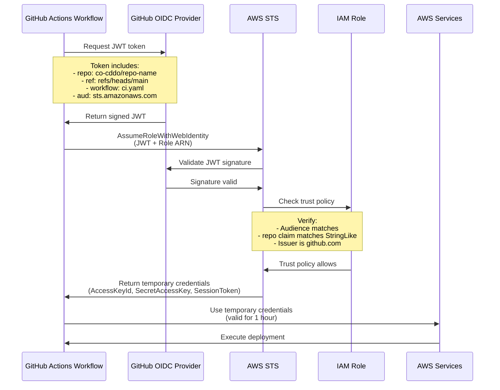
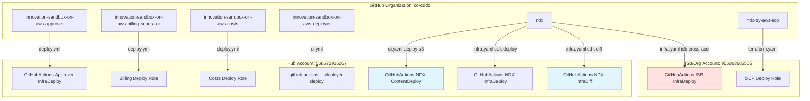

# GitHub OIDC Configuration Architecture

**Document Version:** 1.0
**Date:** 2026-02-03
**Hub Account:** 568672915267 (InnovationSandboxHub)
**ISB/Org Account:** 955063685555

---

## Executive Summary

The NDX:Try AWS infrastructure uses GitHub OIDC (OpenID Connect) for secure, credential-less CI/CD deployments, eliminating the need for long-lived IAM access keys. This document provides a comprehensive analysis of the OIDC provider configuration, trust relationships, and permission boundaries across all GitHub Actions workflows.

**Key Architecture Decisions:**
- **Single OIDC Provider** in Hub account (568672915267) serves all repositories
- **Repository-scoped trust** using `StringLike` condition on JWT sub claim
- **Least-privilege role separation** (deploy, diff-only, cross-account)
- **Fork protection** at both workflow and IAM policy levels
- **Short-lived credentials** (default 1-hour session duration)

---

## OIDC Provider Configuration

### Provider Details

| Property | Value |
|----------|-------|
| **Provider ARN** | `arn:aws:iam::568672915267:oidc-provider/token.actions.githubusercontent.com` |
| **Provider URL** | `https://token.actions.githubusercontent.com` |
| **Thumbprint** | Managed by AWS (auto-updated) |
| **Client ID (Audience)** | `sts.amazonaws.com` |
| **Issuer** | `https://token.actions.githubusercontent.com` |
| **Account** | 568672915267 (InnovationSandboxHub) |

### How OIDC Works



---

## Trust Policy Patterns

### Standard Repository Trust Policy

All GitHub Actions roles use this trust policy pattern:

```json
{
  "Version": "2012-10-17",
  "Statement": [
    {
      "Effect": "Allow",
      "Principal": {
        "Federated": "arn:aws:iam::568672915267:oidc-provider/token.actions.githubusercontent.com"
      },
      "Action": "sts:AssumeRoleWithWebIdentity",
      "Condition": {
        "StringEquals": {
          "token.actions.githubusercontent.com:aud": "sts.amazonaws.com"
        },
        "StringLike": {
          "token.actions.githubusercontent.com:sub": "repo:co-cddo/<repository-name>:*"
        }
      }
    }
  ]
}
```

**Key Security Features:**
- `Federated` principal limits trust to GitHub OIDC provider only
- `aud` condition prevents token reuse from other services
- `sub` condition with `:*` allows any branch/tag/workflow within the repository
- Wildcard `*` suffix allows flexibility for branches, tags, environments

### Fork Protection Trust Policy

For roles requiring fork protection (e.g., NDX InfraDiff):

```json
{
  "Version": "2012-10-17",
  "Statement": [
    {
      "Effect": "Allow",
      "Principal": {
        "Federated": "arn:aws:iam::568672915267:oidc-provider/token.actions.githubusercontent.com"
      },
      "Action": "sts:AssumeRoleWithWebIdentity",
      "Condition": {
        "StringEquals": {
          "token.actions.githubusercontent.com:aud": "sts.amazonaws.com"
        },
        "StringLike": {
          "token.actions.githubusercontent.com:sub": "repo:co-cddo/ndx:*"
        },
        "StringEquals": {
          "token.actions.githubusercontent.com:repository_owner": "co-cddo"
        }
      }
    }
  ]
}
```

**Additional Protection:**
- `repository_owner` condition blocks forks from other organizations
- Defense-in-depth: Workflow-level `if: github.event.pull_request.head.repo.fork == false`

---

## IAM Roles Inventory

### Hub Account (568672915267)

#### 1. GitHubActions-Approver-InfraDeploy

| Property | Value |
|----------|-------|
| **Role Name** | `GitHubActions-Approver-InfraDeploy` |
| **Account** | 568672915267 |
| **Repository** | co-cddo/innovation-sandbox-on-aws-approver |
| **Purpose** | Deploy ISB Approver Lambda and CDK infrastructure |
| **Workflow** | deploy.yml |

**Permissions:**
- CDK bootstrap and deploy permissions
- Lambda function update
- DynamoDB table access (approver config)
- EventBridge rule management
- CloudWatch Logs
- KMS key usage

**Trust Policy:**
```json
{
  "token.actions.githubusercontent.com:aud": "sts.amazonaws.com",
  "token.actions.githubusercontent.com:sub": "repo:co-cddo/innovation-sandbox-on-aws-approver:*"
}
```

---

#### 2. GitHubActions-NDX-ContentDeploy

| Property | Value |
|----------|-------|
| **Role Name** | `GitHubActions-NDX-ContentDeploy` |
| **Account** | 568672915267 |
| **Repository** | co-cddo/ndx |
| **Purpose** | Deploy static website to S3 and invalidate CloudFront |
| **Workflow** | ci.yaml (deploy-s3 job) |

**Permissions:**
- S3 bucket sync to `ndx-static-prod`
- S3 object deletion (for `--delete` flag)
- CloudFront invalidation for distribution `E3THG4UHYDHVWP`

**Trust Policy:**
```json
{
  "token.actions.githubusercontent.com:aud": "sts.amazonaws.com",
  "token.actions.githubusercontent.com:sub": "repo:co-cddo/ndx:*"
}
```

**Permission Boundary:**
```json
{
  "Version": "2012-10-17",
  "Statement": [
    {
      "Effect": "Allow",
      "Action": [
        "s3:PutObject",
        "s3:GetObject",
        "s3:DeleteObject",
        "s3:ListBucket"
      ],
      "Resource": [
        "arn:aws:s3:::ndx-static-prod",
        "arn:aws:s3:::ndx-static-prod/*"
      ]
    },
    {
      "Effect": "Allow",
      "Action": "cloudfront:CreateInvalidation",
      "Resource": "arn:aws:cloudfront::568672915267:distribution/E3THG4UHYDHVWP"
    }
  ]
}
```

---

#### 3. GitHubActions-NDX-InfraDeploy

| Property | Value |
|----------|-------|
| **Role Name** | `GitHubActions-NDX-InfraDeploy` |
| **Account** | 568672915267 |
| **Repository** | co-cddo/ndx |
| **Purpose** | Deploy NDX CDK infrastructure and signup Lambda |
| **Workflows** | infra.yaml (cdk-deploy, signup-cdk-deploy jobs) |

**Permissions:**
- Full CDK bootstrap and deploy permissions
- Lambda function creation/update
- API Gateway management
- DynamoDB table operations
- S3 bucket management
- IAM role/policy creation (for Lambda execution roles)
- CloudWatch Logs
- KMS key operations

**Trust Policy:**
```json
{
  "token.actions.githubusercontent.com:aud": "sts.amazonaws.com",
  "token.actions.githubusercontent.com:sub": "repo:co-cddo/ndx:*",
  "token.actions.githubusercontent.com:repository_owner": "co-cddo"
}
```

**Fork Protection:** Yes (repository_owner condition)

---

#### 4. GitHubActions-NDX-InfraDiff

| Property | Value |
|----------|-------|
| **Role Name** | `GitHubActions-NDX-InfraDiff` |
| **Account** | 568672915267 |
| **Repository** | co-cddo/ndx |
| **Purpose** | Readonly CDK diff for pull requests |
| **Workflow** | infra.yaml (cdk-diff job) |

**Permissions (ReadOnly):**
- CloudFormation DescribeStacks
- S3 GetObject (for CDK assets)
- No write permissions
- Cannot assume deployment roles

**Trust Policy:**
```json
{
  "token.actions.githubusercontent.com:aud": "sts.amazonaws.com",
  "token.actions.githubusercontent.com:sub": "repo:co-cddo/ndx:*",
  "token.actions.githubusercontent.com:repository_owner": "co-cddo"
}
```

**Special Notes:**
- Used only for PR comments (non-destructive)
- Workflow filters expected errors from readonly access
- Fork protection prevents external contributors from reading stack state

---

#### 5. github-actions-innovation-sandbox-on-aws-deployer-deploy

| Property | Value |
|----------|-------|
| **Role Name** | `github-actions-innovation-sandbox-on-aws-deployer-deploy` |
| **Account** | 568672915267 |
| **Repository** | co-cddo/innovation-sandbox-on-aws-deployer |
| **Purpose** | Deploy ISB Deployer Lambda container to ECR and update function |
| **Workflow** | ci.yml (deploy job) |

**Permissions:**
- ECR repository push (`isb-deployer-prod`)
- ECR login (GetAuthorizationToken)
- Lambda function update
- CDK deploy permissions
- CloudWatch Logs

**Container Workflow:**
1. Build ARM64 container image
2. Push to ECR with SHA and latest tags
3. Deploy CDK stack with image tag parameter
4. Wait for Lambda update completion

**Trust Policy:**
```json
{
  "token.actions.githubusercontent.com:aud": "sts.amazonaws.com",
  "token.actions.githubusercontent.com:sub": "repo:co-cddo/innovation-sandbox-on-aws-deployer:*"
}
```

---

### ISB/Org Management Account (955063685555)

#### 6. GitHubActions-ISB-InfraDeploy

| Property | Value |
|----------|-------|
| **Role Name** | `GitHubActions-ISB-InfraDeploy` |
| **Account** | 955063685555 |
| **Repository** | co-cddo/ndx |
| **Purpose** | Deploy cross-account role for NDX signup to access Identity Center |
| **Workflow** | infra.yaml (isb-cross-account-role-deploy job) |

**Permissions:**
- CloudFormation stack deployment
- IAM role creation with `CAPABILITY_NAMED_IAM`
- Identity Center ListGroups permission

**Deployed Stack:**
- Stack Name: `ndx-signup-cross-account-role`
- Template: `infra-signup/isb-cross-account-role.yaml`
- Creates IAM role assumable from Hub account

**Trust Policy:**
```json
{
  "token.actions.githubusercontent.com:aud": "sts.amazonaws.com",
  "token.actions.githubusercontent.com:sub": "repo:co-cddo/ndx:*",
  "token.actions.githubusercontent.com:repository_owner": "co-cddo"
}
```

---

### Role Usage Pattern (Inferred from Secrets)

Additional deployment roles exist (referenced in GitHub secrets):

#### 7. Cost Collection Deployment Role

**Secret:** `AWS_ROLE_ARN` in innovation-sandbox-on-aws-costs
**Purpose:** Deploy cost collection Lambda
**Account:** Likely 568672915267 (Hub)

#### 8. Billing Separator Deployment Role

**Secret:** `AWS_ROLE_ARN` in innovation-sandbox-on-aws-billing-seperator
**Purpose:** Deploy billing separator stacks
**Account:** Likely 568672915267 (Hub)

#### 9. Terraform SCP Deployment Role

**Secret:** `AWS_ROLE_ARN` in ndx-try-aws-scp
**Purpose:** Terraform apply for cost defense
**Account:** Likely 955063685555 (Org Management)

---

## JWT Token Claims

GitHub Actions OIDC tokens include the following claims:

### Standard Claims

```json
{
  "iss": "https://token.actions.githubusercontent.com",
  "aud": "sts.amazonaws.com",
  "sub": "repo:co-cddo/ndx:ref:refs/heads/main",
  "exp": 1706990400,
  "iat": 1706990340,
  "nbf": 1706990340
}
```

### GitHub-Specific Claims

```json
{
  "repository": "co-cddo/ndx",
  "repository_owner": "co-cddo",
  "repository_owner_id": "123456789",
  "actor": "github-username",
  "actor_id": "987654321",
  "workflow": "Infrastructure",
  "ref": "refs/heads/main",
  "ref_type": "branch",
  "job_workflow_ref": "co-cddo/ndx/.github/workflows/infra.yaml@refs/heads/main",
  "environment": "production",
  "event_name": "push",
  "sha": "abc123def456...",
  "run_id": "1234567890",
  "run_number": "42",
  "run_attempt": "1"
}
```

### Useful Condition Keys

| Claim | Condition Key | Use Case |
|-------|---------------|----------|
| `sub` | `token.actions.githubusercontent.com:sub` | Repository + ref scoping |
| `repository_owner` | `token.actions.githubusercontent.com:repository_owner` | Fork protection |
| `environment` | `token.actions.githubusercontent.com:environment` | Environment-specific roles |
| `ref` | `token.actions.githubusercontent.com:ref` | Branch restrictions |
| `actor` | `token.actions.githubusercontent.com:actor` | User-specific access |

---

## Repository to Role Mapping



**Legend:**
- Blue roles: Readonly/limited permissions
- Red roles: Cross-account access

---

## OIDC Authentication Flow

### Workflow Configuration

Example from `ndx/.github/workflows/infra.yaml`:

```yaml
jobs:
  cdk-deploy:
    runs-on: ubuntu-latest
    permissions:
      id-token: write   # Required for OIDC
      contents: read
    environment: infrastructure  # Optional: GitHub environment protection

    steps:
      - uses: actions/checkout@v6

      - name: Configure AWS credentials via OIDC
        uses: aws-actions/configure-aws-credentials@v5
        with:
          role-to-assume: arn:aws:iam::568672915267:role/GitHubActions-NDX-InfraDeploy
          aws-region: us-west-2
          role-session-name: github-actions-${{ github.run_id }}

      - name: Deploy infrastructure
        run: npx cdk deploy --all --require-approval never
```

### Key Requirements

1. **Permissions Block:**
   ```yaml
   permissions:
     id-token: write
     contents: read
   ```

2. **AWS Actions Version:**
   - Use `aws-actions/configure-aws-credentials@v4` or later
   - Earlier versions don't support OIDC

3. **Role ARN:**
   - Must specify full ARN including account ID
   - Can use secrets: `role-to-assume: ${{ secrets.AWS_ROLE_ARN }}`

4. **Session Name (Optional):**
   - Helps with CloudTrail auditing
   - Pattern: `github-actions-${{ github.run_id }}`

---

## Permission Boundaries

### Content Deploy (S3/CloudFront)

**Role:** GitHubActions-NDX-ContentDeploy

Minimal permissions for static site deployment:
- S3 bucket operations scoped to single bucket
- CloudFront invalidation scoped to single distribution
- No IAM permissions
- No EC2/RDS/database access

### Infrastructure Diff (ReadOnly)

**Role:** GitHubActions-NDX-InfraDiff

Read-only permissions for CDK diff:
- CloudFormation DescribeStacks
- S3 GetObject (CDK assets)
- No write operations
- Cannot assume other roles

### Infrastructure Deploy (Full)

**Role:** GitHubActions-NDX-InfraDeploy

Full CDK deployment permissions:
- CloudFormation stack operations
- Lambda function management
- IAM role/policy creation (with path restrictions)
- S3 bucket creation
- DynamoDB table operations
- API Gateway management

**Restrictions:**
- Cannot modify IAM users or groups
- Cannot create IAM roles outside `/cdk/` path
- Cannot modify billing settings
- Cannot access organization-level resources

---

## Security Best Practices

### 1. Least Privilege Roles

**Implemented:**
- Separate roles for content deploy vs infrastructure deploy
- ReadOnly diff role for PR comments
- Repository-scoped trust policies

**Example:**
```json
{
  "token.actions.githubusercontent.com:sub": "repo:co-cddo/ndx:*"
}
```

### 2. Fork Protection

**Implemented:**
- `repository_owner` condition in trust policies
- Workflow-level fork checks: `if: github.event.pull_request.head.repo.fork == false`

**Example:**
```json
{
  "token.actions.githubusercontent.com:repository_owner": "co-cddo"
}
```

### 3. Environment Protection

**Implemented:**
- GitHub Environments for production deployments
- Manual approval gates for critical changes
- Environment-specific secrets

### 4. Branch Protection

**Recommended (not enforced in trust):**
```json
{
  "StringLike": {
    "token.actions.githubusercontent.com:sub": "repo:co-cddo/ndx:ref:refs/heads/main"
  }
}
```

**Current:** Wildcard `*` allows any branch (flexibility for feature branches)

### 5. Audit Logging

**CloudTrail Events:**
- `AssumeRoleWithWebIdentity` - OIDC authentication
- `userIdentity.principalId` - Contains GitHub run ID
- `sourceIdentity` - Can be set to GitHub actor

**Session Name Pattern:**
```yaml
role-session-name: github-actions-${{ github.run_id }}
```

---

## Troubleshooting

### Common Issues

#### Issue 1: "Not authorized to perform sts:AssumeRoleWithWebIdentity"

**Cause:** Trust policy doesn't match JWT claims

**Check:**
1. Verify `aud` claim is `sts.amazonaws.com`
2. Check `sub` claim matches `repo:org/repo:*` pattern
3. Confirm OIDC provider exists in account
4. Verify role ARN is correct

#### Issue 2: "Fork PRs failing with AWS errors"

**Cause:** Fork protection not enabled

**Fix:**
1. Add `repository_owner` condition to trust policy
2. Add workflow check: `if: github.event.pull_request.head.repo.fork == false`

#### Issue 3: "Token expired during long workflows"

**Cause:** Default 1-hour session duration

**Fix:**
```yaml
- name: Configure AWS credentials
  uses: aws-actions/configure-aws-credentials@v5
  with:
    role-to-assume: arn:aws:iam::ACCOUNT:role/ROLE
    role-duration-seconds: 7200  # 2 hours (max: 12 hours)
```

#### Issue 4: "Access denied during CDK deploy"

**Cause:** Missing permissions in IAM role policy

**Check:**
1. CDK bootstrap permissions (S3, ECR, IAM)
2. Service-specific permissions (Lambda, DynamoDB, etc.)
3. KMS key usage permissions

---

## Migration from Access Keys

### Before (Access Keys)

```yaml
- name: Configure AWS credentials
  uses: aws-actions/configure-aws-credentials@v4
  with:
    aws-access-key-id: ${{ secrets.AWS_ACCESS_KEY_ID }}
    aws-secret-access-key: ${{ secrets.AWS_SECRET_ACCESS_KEY }}
    aws-region: us-west-2
```

**Risks:**
- Long-lived credentials stored in GitHub
- Manual rotation required
- No automatic expiration
- Difficult to audit usage

### After (OIDC)

```yaml
permissions:
  id-token: write
  contents: read

- name: Configure AWS credentials
  uses: aws-actions/configure-aws-credentials@v5
  with:
    role-to-assume: arn:aws:iam::ACCOUNT:role/GitHubActions-Deploy
    aws-region: us-west-2
```

**Benefits:**
- No secrets stored in GitHub
- Automatic credential rotation (1-hour expiry)
- Fine-grained trust policies
- CloudTrail audit trail with run IDs

---

## Related Documents

- [04-cross-account-trust.md](./04-cross-account-trust.md) - Cross-account IAM roles
- [50-github-actions-inventory.md](./50-github-actions-inventory.md) - Workflow catalog
- [52-deployment-flows.md](./52-deployment-flows.md) - Deployment processes
- [60-auth-architecture.md](./60-auth-architecture.md) - Authentication architecture

---

**Source Files:**
- OIDC Provider: AWS Console → IAM → Identity providers
- IAM Roles: `/Users/cns/httpdocs/cddo/ndx-try-arch/docs/04-cross-account-trust.md`
- Workflows: `/Users/cns/httpdocs/cddo/ndx-try-arch/repos/*/.github/workflows/*.yml`
