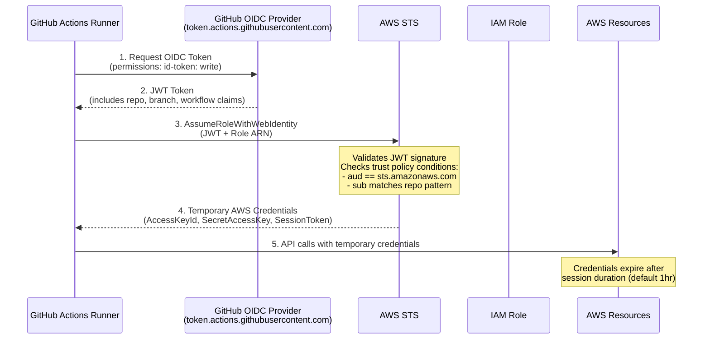
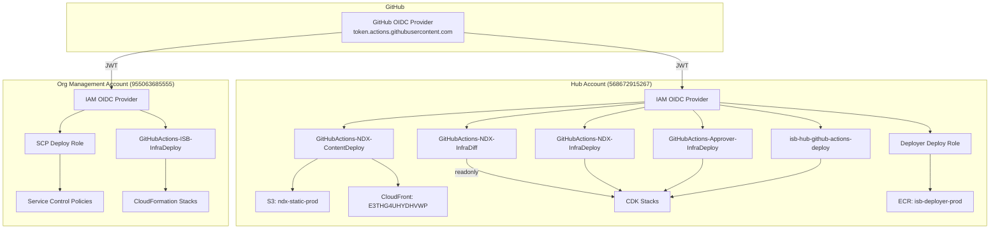

# OIDC Configuration

> **Last Updated**: 2026-03-02
> **Sources**: Workflow files across all repositories, `ndx-try-aws-scp/docs/GITHUB_ACTIONS_SETUP.md`, `innovation-sandbox-on-aws-billing-seperator/.github/workflows/deploy.yml`

## Executive Summary

All NDX:Try deployment workflows authenticate to AWS using GitHub Actions OIDC (OpenID Connect), eliminating the need for long-lived IAM access keys. The OIDC trust chain connects GitHub's identity provider to IAM roles in two primary AWS accounts: the Hub account (568672915267) and the Org Management/ISB account (955063685555). Each repository is scoped to specific IAM roles with least-privilege permissions, and several workflows implement additional security measures including fork protection and readonly diff roles.

## OIDC Trust Chain


```mermaid
sequenceDiagram
    participant GH as GitHub Actions Runner
    participant GHP as GitHub OIDC Provider<br/>(token.actions.githubusercontent.com)
    participant STS as AWS STS
    participant IAM as IAM Role
    participant AWS as AWS Resources

    GH->>GHP: 1. Request OIDC Token<br/>(permissions: id-token: write)
    GHP-->>GH: 2. JWT Token<br/>(includes repo, branch, workflow claims)
    GH->>STS: 3. AssumeRoleWithWebIdentity<br/>(JWT + Role ARN)
    Note over STS: Validates JWT signature<br/>Checks trust policy conditions:<br/>- aud == sts.amazonaws.com<br/>- sub matches repo pattern
    STS-->>GH: 4. Temporary AWS Credentials<br/>(AccessKeyId, SecretAccessKey, SessionToken)
    GH->>AWS: 5. API calls with temporary credentials
    Note over AWS: Credentials expire after<br/>session duration (default 1hr)
```

## OIDC Provider Configuration

The GitHub OIDC provider must be registered in each AWS account that workflows authenticate to. This is a one-time setup per account.

### Provider Details

| Property | Value |
|----------|-------|
| **Provider URL** | `https://token.actions.githubusercontent.com` |
| **Audience** | `sts.amazonaws.com` |
| **Thumbprint** | `6938fd4d98bab03faadb97b34396831e3780aea1` |

### Accounts with OIDC Providers

| Account | Account ID | Purpose |
|---------|------------|---------|
| NDX/InnovationSandboxHub | 568672915267 | Hub account for website, approver, deployer, costs, blueprints |
| gds-ndx-try-aws-org-management | 955063685555 | Organization management for SCPs, cross-account roles |
| AWS Sandbox (legacy) | (via secrets) | Legacy sandbox account for aws-nuke, access Lambda, IAM |
| MISP Sandbox | 891377055542 | GC3 MISP sandbox (hardcoded roles, legacy) |

### Setup Commands (One-Time Per Account)

As documented in `repos/ndx-try-aws-scp/docs/GITHUB_ACTIONS_SETUP.md`:

```bash
# Check if provider already exists
aws iam list-open-id-connect-providers

# Create the provider if not present
aws iam create-open-id-connect-provider \
  --url https://token.actions.githubusercontent.com \
  --client-id-list sts.amazonaws.com \
  --thumbprint-list 6938fd4d98bab03faadb97b34396831e3780aea1
```

**Source:** `repos/ndx-try-aws-scp/docs/GITHUB_ACTIONS_SETUP.md`

## IAM Role Inventory

### Hub Account (568672915267)

| IAM Role | Repository | Purpose | Trigger |
|----------|------------|---------|---------|
| `GitHubActions-NDX-ContentDeploy` | ndx | S3 sync + CloudFront invalidation | Push to main |
| `GitHubActions-NDX-InfraDiff` | ndx | Readonly CDK diff on PRs | Pull request |
| `GitHubActions-NDX-InfraDeploy` | ndx | CDK deploy (infra + signup) | Push to main |
| `GitHubActions-Approver-InfraDeploy` | innovation-sandbox-on-aws-approver | CDK deploy approver Lambda | Push to main |
| `isb-hub-github-actions-deploy` | ndx_try_aws_scenarios | Deploy ISB Hub blueprints via CDK | Push to main (path filtered) |
| `${{ secrets.AWS_ROLE_ARN }}` | innovation-sandbox-on-aws-billing-seperator | CDK deploy billing separator | Manual (workflow_dispatch) |
| `${{ secrets.AWS_ROLE_ARN }}` | innovation-sandbox-on-aws-costs | CDK deploy cost collection | Manual (workflow_dispatch) |
| `${{ secrets.AWS_DEPLOY_ROLE_ARN }}` | innovation-sandbox-on-aws-deployer | ECR push + CDK deploy | Push to main |

### Org Management Account (955063685555)

| IAM Role | Repository | Purpose | Trigger |
|----------|------------|---------|---------|
| `GitHubActions-ISB-InfraDeploy` | ndx | Deploy cross-account role for signup | Push to main |
| `${{ secrets.AWS_ROLE_ARN }}` | ndx-try-aws-scp | Terraform plan/apply SCPs | PR (plan), Manual (apply) |

### Legacy/Sandbox Accounts

| IAM Role | Repository | Account | Purpose |
|----------|------------|---------|---------|
| `${{ secrets.AWS_ROLE_TO_ASSUME }}` | aws-sandbox | (via secret) | Nuke, access Lambda, IAM |
| `paul.hallam-dev` | gc3-misp-sandbox-ec2 | 891377055542 | Terraform plan (hardcoded) |
| `GithubActionsRole` | gc3-misp-sandbox-ec2 | 891377055542 | Terraform plan (hardcoded) |

## Trust Policy Pattern

All IAM roles use a consistent trust policy pattern documented in the billing separator workflow and the SCP setup guide:

```json
{
  "Version": "2012-10-17",
  "Statement": [
    {
      "Effect": "Allow",
      "Principal": {
        "Federated": "arn:aws:iam::ACCOUNT_ID:oidc-provider/token.actions.githubusercontent.com"
      },
      "Action": "sts:AssumeRoleWithWebIdentity",
      "Condition": {
        "StringEquals": {
          "token.actions.githubusercontent.com:aud": "sts.amazonaws.com"
        },
        "StringLike": {
          "token.actions.githubusercontent.com:sub": "repo:OWNER/REPO:*"
        }
      }
    }
  ]
}
```

**Source:** `repos/innovation-sandbox-on-aws-billing-seperator/.github/workflows/deploy.yml` (lines 11-28)

### Condition Variations

Different roles use different `sub` claim patterns to control which branches can assume the role:

| Pattern | Meaning | Used By |
|---------|---------|---------|
| `repo:ORG/REPO:*` | Any branch, tag, or event | Most roles |
| `repo:ORG/REPO:ref:refs/heads/main` | Main branch only | Deploy roles (recommended) |

The NDX infra workflow implements two roles to distinguish operations:
- **InfraDiff** -- Can be assumed from any branch on the origin repo (for PR diffs)
- **InfraDeploy** -- Restricted to main branch (for actual deployments)

## Workflow Authentication Pattern

All workflows follow the same pattern using `aws-actions/configure-aws-credentials`:

```yaml
permissions:
  id-token: write   # Required for requesting the JWT
  contents: read    # Required for actions/checkout

jobs:
  deploy:
    steps:
      - name: Configure AWS credentials via OIDC
        uses: aws-actions/configure-aws-credentials@v4  # or v6
        with:
          role-to-assume: arn:aws:iam::ACCOUNT:role/ROLE_NAME
          aws-region: us-west-2  # or eu-west-2 for SCP
```

### Action Versions in Use

| Version | Repositories |
|---------|-------------|
| `aws-actions/configure-aws-credentials@v3` | gc3-misp-sandbox-ec2 (legacy) |
| `aws-actions/configure-aws-credentials@v4` | aws-sandbox, approver, deployer, scp, costs |
| `aws-actions/configure-aws-credentials@v6` | ndx (pinned SHA), billing-separator, scenarios |

## Security Architecture

### Full OIDC Flow with Account Mapping


```mermaid
graph TB
    subgraph "GitHub"
        GH_OIDC["GitHub OIDC Provider<br/>token.actions.githubusercontent.com"]
    end

    subgraph "Hub Account (568672915267)"
        OIDC_HUB["IAM OIDC Provider"]
        R1["GitHubActions-NDX-ContentDeploy"]
        R2["GitHubActions-NDX-InfraDiff"]
        R3["GitHubActions-NDX-InfraDeploy"]
        R4["GitHubActions-Approver-InfraDeploy"]
        R5["isb-hub-github-actions-deploy"]
        R6["Deployer Deploy Role"]

        S3["S3: ndx-static-prod"]
        CF["CloudFront: E3THG4UHYDHVWP"]
        CDK_H["CDK Stacks"]
        ECR["ECR: isb-deployer-prod"]
    end

    subgraph "Org Management Account (955063685555)"
        OIDC_ORG["IAM OIDC Provider"]
        R7["GitHubActions-ISB-InfraDeploy"]
        R8["SCP Deploy Role"]
        SCP["Service Control Policies"]
        CFN["CloudFormation Stacks"]
    end

    GH_OIDC -->|JWT| OIDC_HUB
    GH_OIDC -->|JWT| OIDC_ORG

    OIDC_HUB --> R1 --> S3
    R1 --> CF
    OIDC_HUB --> R2 -->|readonly| CDK_H
    OIDC_HUB --> R3 --> CDK_H
    OIDC_HUB --> R4 --> CDK_H
    OIDC_HUB --> R5 --> CDK_H
    OIDC_HUB --> R6 --> ECR

    OIDC_ORG --> R7 --> CFN
    OIDC_ORG --> R8 --> SCP
```

### Fork Protection

The NDX infrastructure workflow implements defense-in-depth fork protection:

1. **Workflow condition:** `github.event.pull_request.head.repo.fork == false`
2. **Explicit step check:** Additional `if` guard that exits with error for fork PRs
3. **IAM-level protection:** Role trust policy uses `repository_owner` condition

This is documented in `repos/ndx/.github/workflows/infra.yaml` (lines 121-146).

The SCP Terraform workflow also blocks forks via `github.event.pull_request.head.repo.fork == false` on the plan job.

### Role Separation

The NDX website uses three distinct roles following least-privilege:

| Role | Scope | When Used |
|------|-------|-----------|
| `GitHubActions-NDX-ContentDeploy` | S3 write, CloudFront invalidate only | ci.yaml deploy-s3 job |
| `GitHubActions-NDX-InfraDiff` | CDK readonly (cannot deploy or publish assets) | infra.yaml cdk-diff job |
| `GitHubActions-NDX-InfraDeploy` | Full CDK deploy permissions | infra.yaml cdk-deploy job |

### Session Naming

Some workflows use descriptive session names for CloudTrail audit trail:

```yaml
# SCP workflow
role-session-name: terraform-plan-${{ github.run_id }}
role-session-name: terraform-apply-${{ github.run_id }}

# aws-sandbox workflows
role-session-name: ${{ github.run_id }}-${{ github.event_name }}-${{ github.job }}
```

### Environment Protection Rules

Several workflows require GitHub environment approvals before deployment:

| Workflow | Environment | Purpose |
|----------|-------------|---------|
| ndx-try-aws-scp: terraform.yaml (apply) | `production` | Requires reviewer approval for SCP changes |
| innovation-sandbox-on-aws-deployer: ci.yml | `production` | Requires approval for Lambda deploy |
| innovation-sandbox-on-aws-costs: deploy.yml | `production` | Requires approval for cost stack deploy |
| ndx: infra.yaml | `infrastructure`, `isb-infrastructure` | Requires approval for CDK deploy |
| ndx: ci.yaml | `production` | Requires approval for S3 deploy |

## Secrets Usage

No long-lived AWS credentials are stored as GitHub secrets. The OIDC approach means secrets contain only role ARNs (not credentials):

| Secret Name | Repositories | Content |
|-------------|-------------|---------|
| `AWS_ROLE_ARN` | billing-separator, costs, scp | IAM role ARN for OIDC assumption |
| `AWS_DEPLOY_ROLE_ARN` | deployer | IAM role ARN for OIDC assumption |
| `AWS_ROLE_TO_ASSUME` | aws-sandbox | IAM role ARN (legacy pattern) |

Additional application secrets (not AWS credentials):
- `OIDC_CLIENT_ID`, `OIDC_CLIENT_SECRET` -- OAuth client for access Lambda
- `COST_EXPLORER_ROLE_ARN` -- Cross-account role for Cost Explorer queries
- `ISB_API_BASE_URL`, `ISB_JWT_SECRET_PATH`, `ISB_JWT_SECRET_KMS_KEY_ARN` -- ISB API integration
- `SLACK_BUDGET_ALERT_EMAIL` -- Budget alert recipient via Slack email integration
- `ISB_NDX_USERS_GROUP_ID` -- Identity Store group ID for cross-account role

## Adding OIDC for a New Repository

Follow this procedure when adding a new repository that needs AWS access:

1. **Ensure the OIDC provider exists** in the target AWS account (see setup commands above)
2. **Create an IAM role** with a trust policy scoped to the specific repo (use the trust policy template above, replacing `OWNER/REPO`)
3. **Attach permissions** following least-privilege (separate roles for readonly vs deploy operations)
4. **Add the role ARN** as a GitHub Actions secret (if not hardcoding) or directly in the workflow
5. **Configure the workflow** with `permissions: id-token: write` and the `aws-actions/configure-aws-credentials` action
6. **Set up GitHub environments** with required reviewers for production deployments
7. **Block fork PRs** from assuming roles (add workflow conditions and consider IAM-level `repository_owner` checks)

**Source:** `repos/ndx-try-aws-scp/docs/GITHUB_ACTIONS_SETUP.md`

---
*Generated from source analysis. See [50-github-actions-inventory.md](./50-github-actions-inventory.md) for full workflow inventory and [62-secrets-management.md](./62-secrets-management.md) for secrets documentation.*
