# Deployment Flows and Pipelines

**Document Version:** 1.0
**Date:** 2026-02-03
**Scope:** Per-repository deployment architectures and release processes

---

## Executive Summary

This document traces the deployment flow for each repository in the NDX:Try AWS ecosystem, documenting staging vs production deployments, manual approval gates, rollback mechanisms, and per-repo deployment diagrams.

**Deployment Categorization:**
- **Automated Deployment:** 5 repositories (auto-deploy on merge to main)
- **Manual Approval Required:** 3 repositories (workflow_dispatch only)
- **No CI/CD:** 4 repositories (manual operations)

---

## Deployment Strategy Matrix

| Repository | Strategy | Trigger | Approval | Target |
|-----------|----------|---------|----------|--------|
| innovation-sandbox-on-aws-approver | Auto | Push to main | None | Hub Account Lambda |
| innovation-sandbox-on-aws-billing-seperator | Manual | workflow_dispatch | Required | Hub Account CDK |
| innovation-sandbox-on-aws-costs | Manual | workflow_dispatch | Required | Hub Account Lambda |
| innovation-sandbox-on-aws-deployer | Auto | Push to main | Environment | Hub Account ECR/Lambda |
| innovation-sandbox-on-aws | Manual | Local CDK | Manual | Hub Account (all stacks) |
| innovation-sandbox-on-aws-utils | Manual | Python script | Manual | Org Management |
| ndx | Auto | Push to main | None (S3), Environment (CDK) | Hub Account S3/CDK |
| ndx_try_aws_scenarios | Auto | Push to main | None | GitHub Pages |
| ndx-try-aws-isb | N/A | Empty repo | N/A | N/A |
| ndx-try-aws-lza | Manual | AWS Console | Manual | Management Account |
| ndx-try-aws-scp | Manual | workflow_dispatch | Required | Org Management |
| ndx-try-aws-terraform | Manual | Local | Manual | Org Management |

---

## Repository Deployment Flows

### 1. innovation-sandbox-on-aws-approver

**Deployment Type:** Automated CDK Deployment
**Target:** Hub Account (568672915267)
**Stack:** ISB Approver Lambda + EventBridge Rule

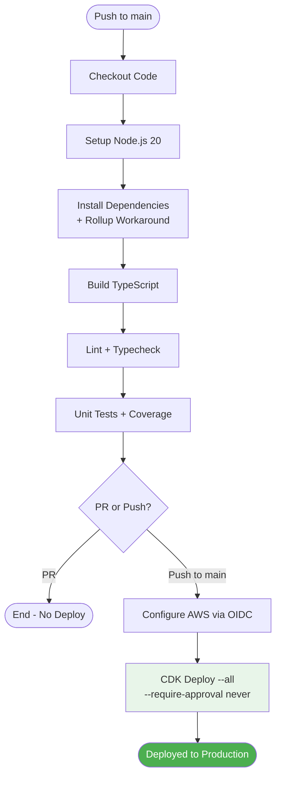

**Deployment Command:**
```bash
npm run build && npx cdk deploy --all --require-approval never
```

**OIDC Role:**
```
arn:aws:iam::568672915267:role/GitHubActions-Approver-InfraDeploy
```

**Resources Deployed:**
- Lambda Function: ISB Approver (risk scoring engine)
- EventBridge Rule: Trigger on LeaseRequested events
- DynamoDB Table: Approver configuration
- CloudWatch Logs: Approver function logs

**Rollback Mechanism:**
- Git revert + push to main (triggers re-deployment)
- Manual CDK rollback from local machine

**Approval Gates:** None (auto-deploy on merge)

**Source File:** `/Users/cns/httpdocs/cddo/ndx-try-arch/repos/innovation-sandbox-on-aws-approver/.github/workflows/deploy.yml`

---

### 2. innovation-sandbox-on-aws-billing-seperator

**Deployment Type:** Manual CDK Deployment (Gated)
**Target:** Hub Account (568672915267) + Org Management Account (955063685555)
**Stacks:** Hub Stack + Org Management Stack

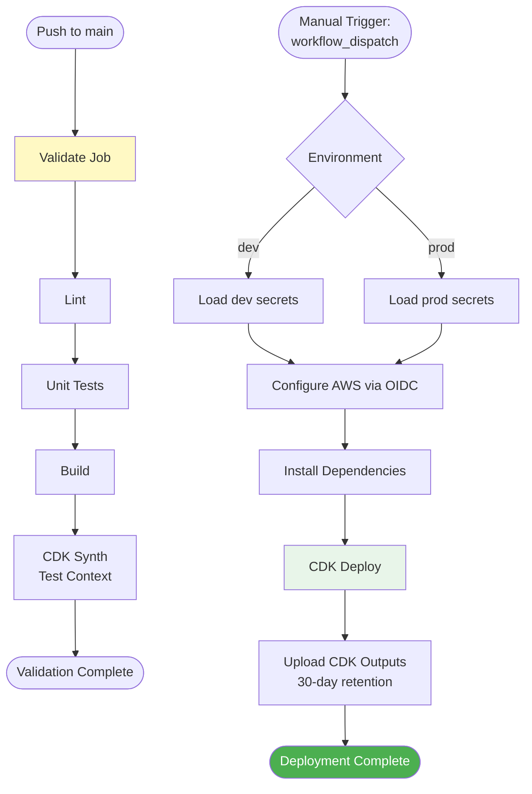

**Deployment Trigger:**
```yaml
workflow_dispatch:
  inputs:
    environment:
      type: choice
      options: [dev, prod]
```

**CDK Context (Test Synth):**
```bash
-c environment=test
-c hubAccountId=123456789012
-c orgMgmtAccountId=098765432109
-c accountTableName=isb-sandbox-accounts
-c sandboxOuId=ou-test-sandbox
-c availableOuId=ou-test-available
-c quarantineOuId=ou-test-quarantine
-c cleanupOuId=ou-test-cleanup
-c intermediateRoleArn=arn:aws:iam::123456789012:role/isb-hub-role
-c orgMgtRoleArn=arn:aws:iam::098765432109:role/isb-org-mgt-role
```

**Stacks Deployed:**
1. **Hub Stack (568672915267):**
   - EventBridge Custom Bus
   - SQS Queue for quarantine events
   - Lambda: QuarantineAccount
   - Lambda: UnquarantineAccount
   - EventBridge Scheduler Role

2. **Org Management Stack (955063685555):**
   - EventBridge Rule: Forward CloudTrail events to Hub
   - IAM Role: Cross-account event forwarding

**Approval Gates:**
- Manual workflow dispatch required
- GitHub Environment protection (if configured)

**Rollback Mechanism:**
- Manual workflow dispatch with previous commit
- Emergency: Direct CDK deployment from local machine

**Deprecation Notice:**
- **This stack is temporary** (pending ISB issue #70)
- Should be archived once native cooldown support added

**Source File:** `/Users/cns/httpdocs/cddo/ndx-try-arch/repos/innovation-sandbox-on-aws-billing-seperator/.github/workflows/deploy.yml`

---

### 3. innovation-sandbox-on-aws-costs

**Deployment Type:** Manual CDK Deployment (Gated)
**Target:** Hub Account (568672915267)
**Stack:** Cost Collection Lambda + S3 Bucket

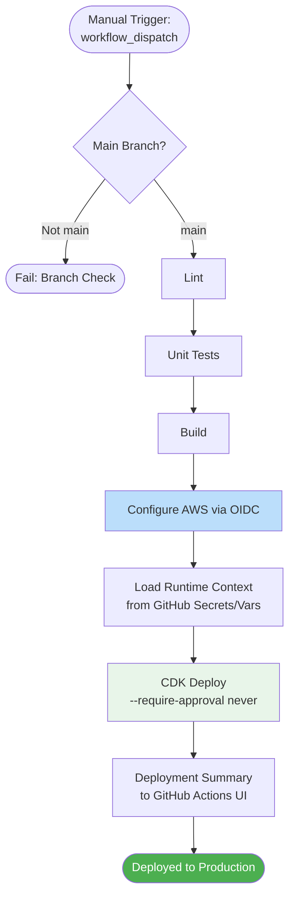

**Runtime Context (Production):**
```bash
--context eventBusName=${{ vars.EVENT_BUS_NAME }}
--context costExplorerRoleArn=${{ secrets.COST_EXPLORER_ROLE_ARN }}
--context isbLeasesLambdaArn=${{ secrets.ISB_LEASES_LAMBDA_ARN }}
--context alertEmail=${{ vars.ALERT_EMAIL }}
```

**GitHub Secrets:**
- `AWS_ROLE_ARN` - Deployment role
- `COST_EXPLORER_ROLE_ARN` - Cross-account Cost Explorer access
- `ISB_LEASES_LAMBDA_ARN` - ISB Leases Lambda for JWT validation

**GitHub Variables:**
- `EVENT_BUS_NAME` - EventBridge bus name
- `ALERT_EMAIL` - Cost anomaly alert email

**Resources Deployed:**
- Lambda Function: Cost Collector
- Lambda Function: Schedule Creator
- S3 Bucket: Cost reports with 3-year retention
- EventBridge Rule: Trigger on LeaseTerminated
- IAM Role: Cross-account Cost Explorer access

**Deployment Flow:**
1. User manually triggers workflow
2. Branch check ensures deployment from main
3. Lint + test + build pipeline
4. OIDC authentication to Hub account
5. CDK synthesizes with runtime context
6. Stack deployment
7. Outputs saved as artifact

**Approval Gates:**
- Manual trigger required
- GitHub Environment: production

**Rollback Mechanism:**
- Git revert + manual re-trigger
- Emergency: Local CDK destroy + redeploy

**Source File:** `/Users/cns/httpdocs/cddo/ndx-try-arch/repos/innovation-sandbox-on-aws-costs/.github/workflows/deploy.yml`

---

### 4. innovation-sandbox-on-aws-deployer

**Deployment Type:** Automated Container Deployment
**Target:** Hub Account ECR + Lambda (568672915267)
**Container:** ARM64 Lambda container

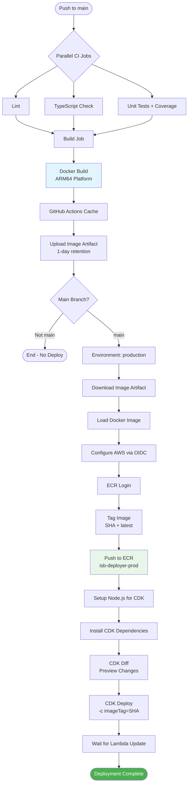

**Container Build:**
```yaml
Platform: linux/arm64
Context: .
Dockerfile: infrastructure/docker/Dockerfile
Cache: GitHub Actions cache (layer caching)
Tags:
  - isb-deployer:${{ github.sha }}
  - isb-deployer:latest
```

**ECR Push:**
```bash
ECR_REGISTRY=${{ steps.login-ecr.outputs.registry }}
ECR_REPOSITORY=isb-deployer-prod
IMAGE_TAG=${{ github.sha }}

docker tag isb-deployer:$IMAGE_TAG $ECR_REGISTRY/$ECR_REPOSITORY:$IMAGE_TAG
docker tag isb-deployer:$IMAGE_TAG $ECR_REGISTRY/$ECR_REPOSITORY:latest

docker push $ECR_REGISTRY/$ECR_REPOSITORY:$IMAGE_TAG
docker push $ECR_REGISTRY/$ECR_REPOSITORY:latest
```

**CDK Deployment:**
```bash
npx cdk deploy DeployerStack \
  --require-approval never \
  -c imageTag=${{ github.sha }}
```

**Lambda Update Wait:**
```bash
aws lambda wait function-updated-v2 --function-name isb-deployer-prod
```

**Resources Deployed:**
- ECR Repository: `isb-deployer-prod`
- Lambda Function: ISB Deployer (ARM64 container)
- EventBridge Rule: Trigger on LeaseApproved
- IAM Role: Deployer execution role with cross-account permissions

**Approval Gates:**
- Environment: production (GitHub environment protection)

**Rollback Mechanism:**
1. **Code Rollback:** Git revert + push (triggers rebuild)
2. **Image Rollback:** Manual ECR tag update + Lambda UpdateFunctionCode
3. **Emergency:** Local CDK deploy with previous image tag

**Source File:** `/Users/cns/httpdocs/cddo/ndx-try-arch/repos/innovation-sandbox-on-aws-deployer/.github/workflows/ci.yml`

---

### 5. innovation-sandbox-on-aws (Core ISB)

**Deployment Type:** Manual Local CDK Deployment
**Target:** Hub Account (568672915267)
**Stacks:** 4 CloudFormation stacks (AccountPool, IDC, Data, Compute)

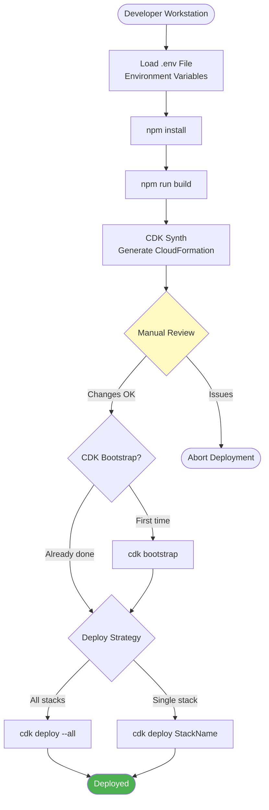

**Deployment Command (All Stacks):**
```bash
npx cdk deploy --all --require-approval broadening
```

**Stack Deployment Order:**
1. **AccountPool Stack** - Pool account management
2. **IDC Stack** - IAM Identity Center configuration
3. **Data Stack** - DynamoDB tables, KMS keys
4. **Compute Stack** - Lambda functions, API Gateway, Step Functions

**Environment Variables (.env):**
```bash
AWS_PROFILE=NDX/InnovationSandboxHub
AWS_REGION=us-west-2
NAMESPACE=ndx-try-isb
ORG_MANAGEMENT_ACCOUNT_ID=955063685555
IDENTITY_CENTER_INSTANCE_ARN=arn:aws:sso:::instance/...
```

**Manual Steps:**
1. Configure AWS SSO profile
2. Copy `.env.example` to `.env`
3. Update environment variables
4. Run CDK deployment
5. Manually configure IAM Identity Center custom SAML app
6. Paste IdP certificate into Secrets Manager secret

**Resources Deployed (70+ resources):**
- 3 DynamoDB Tables (Accounts, Leases, LeaseTemplates)
- 15+ Lambda Functions
- API Gateway REST API
- Step Functions State Machine (Account Cleaner)
- EventBridge Rules
- CloudWatch Log Groups
- KMS Keys
- S3 Buckets
- IAM Roles

**Approval Gates:** Manual CDK approval prompts

**Rollback Mechanism:**
- CDK rollback on deployment failure (automatic)
- Manual stack deletion and redeploy
- DynamoDB point-in-time recovery

**Why No CI/CD:**
- Core platform with infrequent changes
- Requires manual IdP configuration
- Complex multi-stack dependencies

**Source File:** `/Users/cns/httpdocs/cddo/ndx-try-arch/repos/innovation-sandbox-on-aws/README.md`

---

### 6. innovation-sandbox-on-aws-utils

**Deployment Type:** Manual Python Script Execution
**Target:** Org Management Account (955063685555) → Hub Account (568672915267)
**Purpose:** Create new pool accounts

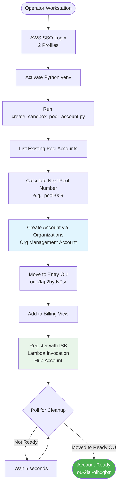

**Execution Steps:**

```bash
# 1. Setup environment
python3 -m venv venv
source venv/bin/activate
pip install boto3

# 2. Configure AWS SSO
aws sso login --profile NDX/orgManagement
aws sso login --profile NDX/InnovationSandboxHub

# 3. Run script
python create_sandbox_pool_account.py
```

**Script Operations:**
1. Validate SSO sessions
2. List existing pool accounts (finds highest number)
3. Create new account: `pool-NNN`
4. Move account: root → Entry OU
5. Add to billing view
6. Register with ISB Lambda (bypasses CloudFront auth)
7. Poll until account moved to Ready OU (cleanup complete)

**Timing:**
- Account creation: ~30 seconds
- ISB cleanup: ~5-10 minutes
- Total: ~10-15 minutes

**Manual Approval:** Operator must initiate script

**Rollback Mechanism:**
- Cannot delete AWS accounts (AWS limitation)
- Can move account to quarantine OU
- ISB will mark as unavailable

**Why Manual:**
- Infrequent operation (new pool accounts created rarely)
- Requires Organization-level permissions
- Multi-account coordination complex

**Source File:** `/Users/cns/httpdocs/cddo/ndx-try-arch/repos/innovation-sandbox-on-aws-utils/README.md`

---

### 7. ndx (Website + Infrastructure)

**Deployment Type:** Dual-track (Auto S3 + Gated CDK)
**Target:** Hub Account (568672915267)

#### 7a. Content Deployment (S3/CloudFront)

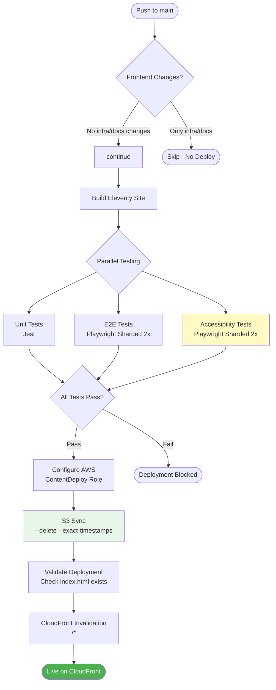

**S3 Deployment:**
```bash
aws s3 sync ./_site/ s3://ndx-static-prod/ \
  --delete \
  --exact-timestamps \
  --cache-control "public, max-age=3600" \
  --exclude ".DS_Store"
```

**CloudFront Invalidation:**
```bash
aws cloudfront create-invalidation \
  --distribution-id E3THG4UHYDHVWP \
  --paths "/*"
```

**OIDC Role:** `GitHubActions-NDX-ContentDeploy`

**Production URL:** `https://ndx.digital.cabinet-office.gov.uk`

---

#### 7b. Infrastructure Deployment (CDK)

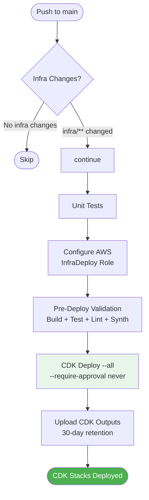

**Infrastructure Stacks:**
- NDX API Gateway
- Lambda Functions (Notifications, Signup)
- DynamoDB Tables
- S3 Buckets
- CloudFront Distribution (managed separately)

**OIDC Role:** `GitHubActions-NDX-InfraDeploy`

---

#### 7c. Signup Cross-Account Deployment

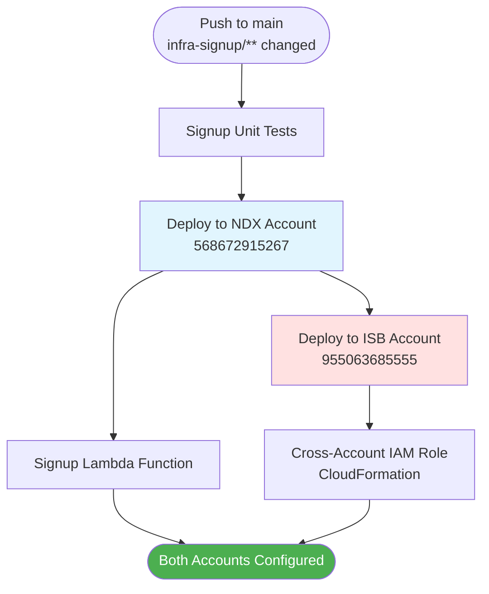

**Cross-Account Stack:**
```bash
aws cloudformation deploy \
  --template-file infra-signup/isb-cross-account-role.yaml \
  --stack-name ndx-signup-cross-account-role \
  --capabilities CAPABILITY_NAMED_IAM \
  --parameter-overrides GroupId=${{ secrets.ISB_NDX_USERS_GROUP_ID }}
```

**OIDC Roles:**
- NDX Account: `GitHubActions-NDX-InfraDeploy`
- ISB Account: `GitHubActions-ISB-InfraDeploy`

**Approval Gates:**
- Environment: infrastructure (for NDX)
- Environment: isb-infrastructure (for ISB)

**Source File:** `/Users/cns/httpdocs/cddo/ndx-try-arch/repos/ndx/.github/workflows/`

---

### 8. ndx_try_aws_scenarios

**Deployment Type:** Automated GitHub Pages Deployment
**Target:** GitHub Pages (CDN)

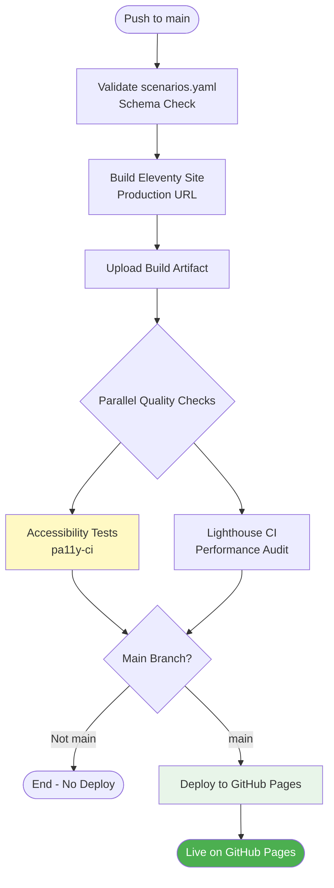

**Build Command:**
```bash
npm run build
# Environment: GITHUB_PAGES_URL=https://aws.try.ndx.digital.cabinet-office.gov.uk
```

**Accessibility Testing:**
```bash
pa11y-ci --config .pa11yci.json || echo "::warning::Some accessibility issues found"
```

**GitHub Pages Deployment:**
- Uses `actions/upload-pages-artifact@v4`
- Uses `actions/deploy-pages@v4`
- Automatic SSL via GitHub

**Production URL:** `https://aws.try.ndx.digital.cabinet-office.gov.uk`

**Approval Gates:** None (auto-deploy)

**Rollback Mechanism:**
- Git revert + push (triggers rebuild)
- GitHub Pages history (manual rollback via GitHub UI)

**Source File:** `/Users/cns/httpdocs/cddo/ndx-try-arch/repos/ndx_try_aws_scenarios/.github/workflows/build-deploy.yml`

---

### 9. ndx-try-aws-lza (Landing Zone Accelerator)

**Deployment Type:** Manual AWS Console Operations
**Target:** Management Account
**Purpose:** Update AWS LZA configuration

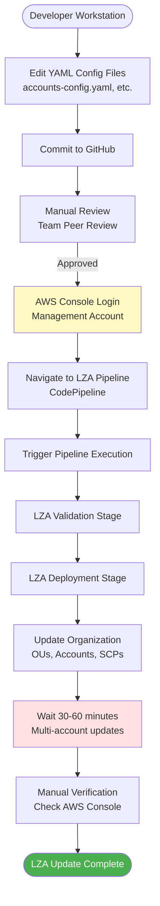

**Configuration Files:**
- `accounts-config.yaml` - Account definitions
- `global-config.yaml` - Global settings
- `iam-config.yaml` - IAM policies and roles
- `network-config.yaml` - VPC and networking
- `organization-config.yaml` - OU structure
- `security-config.yaml` - Security controls

**Manual Steps:**
1. Edit YAML files locally
2. Commit and push to GitHub
3. Create pull request for peer review
4. Merge to main
5. Log into Management Account AWS Console
6. Navigate to CodePipeline console
7. Find LZA pipeline
8. Trigger manual execution
9. Monitor pipeline stages
10. Verify changes in AWS Organizations console

**Deployment Time:** 30-60 minutes (multi-account updates)

**Approval Gates:**
- GitHub PR review
- Manual pipeline trigger
- AWS CloudFormation stack approvals

**Rollback Mechanism:**
- Git revert YAML files
- Re-trigger LZA pipeline
- Emergency: Manual AWS Console changes

**Why Manual:**
- Infrequent changes (monthly or less)
- Organization-wide impact
- Requires management account access
- LZA pipeline cannot be triggered from GitHub Actions

**Source File:** `/Users/cns/httpdocs/cddo/ndx-try-arch/repos/ndx-try-aws-lza/README.md`

---

### 10. ndx-try-aws-scp (Cost Defense)

**Deployment Type:** Manual Terraform Deployment (Gated)
**Target:** Org Management Account (955063685555)
**Purpose:** Deploy 5-layer cost defense system

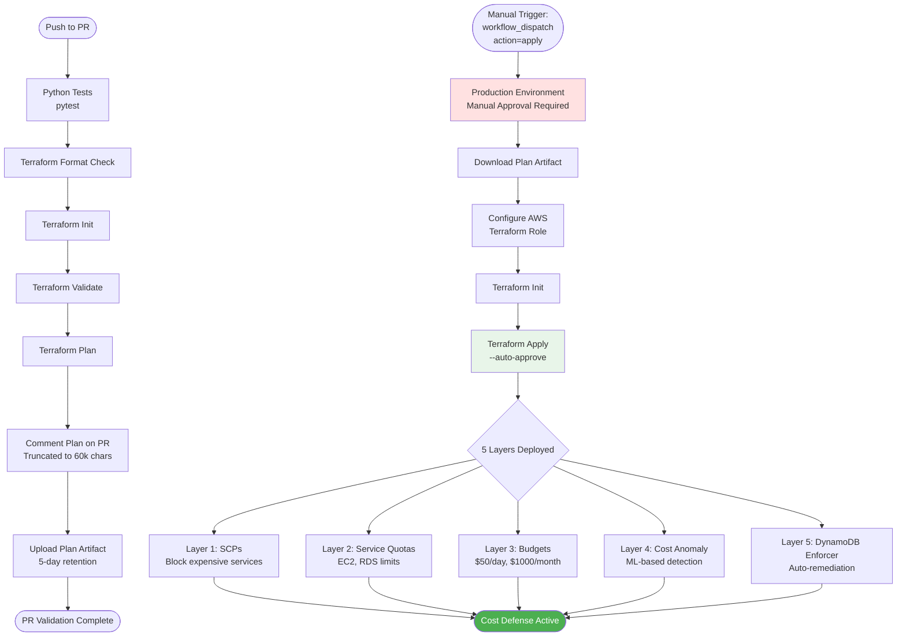

**Terraform Environment Variables:**
```yaml
TF_VAR_sandbox_ou_id: ou-2laj-4dyae1oa
TF_VAR_cost_avoidance_ou_id: ou-2laj-sre4rnjs
TF_VAR_sandbox_pool_ou_id: ou-2laj-sre4rnjs
TF_VAR_daily_budget_limit: "50"
TF_VAR_monthly_budget_limit: "1000"
TF_VAR_ec2_vcpu_quota: "64"
TF_VAR_budget_alert_emails: ${{ secrets.SLACK_BUDGET_ALERT_EMAIL }}
```

**Deployment Workflow:**
1. PR triggers plan (comments on PR)
2. Merge to main (no auto-apply)
3. Operator manually triggers `workflow_dispatch` with `action=apply`
4. Production environment approval required
5. Terraform downloads plan artifact from PR
6. Terraform apply with auto-approve flag

**Approval Gates:**
- **Double approval:**
  1. PR review and merge
  2. Workflow dispatch manual trigger
- Production environment protection

**Rollback Mechanism:**
- Git revert + manual apply
- Emergency: Local Terraform destroy specific resources

**Why Manual Apply:**
- Cost defense changes are critical
- Risk of blocking legitimate workloads
- Prevents accidental auto-deployment

**Source File:** `/Users/cns/httpdocs/cddo/ndx-try-arch/repos/ndx-try-aws-scp/.github/workflows/terraform.yaml`

---

### 11. ndx-try-aws-terraform

**Deployment Type:** Manual Local Terraform
**Target:** Org Management Account (955063685555)
**Purpose:** Organization-level S3 and billing config

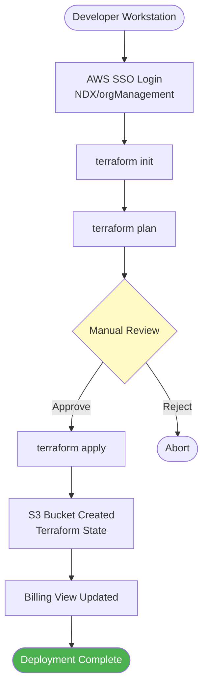

**Resources Managed:**
- S3 bucket for remote Terraform state
- Billing data visibility configuration
- Organization settings

**Manual Steps:**
```bash
# 1. Configure AWS profile
aws sso login --profile NDX/orgManagement

# 2. Initialize Terraform
terraform init

# 3. Plan changes
terraform plan

# 4. Apply (manual approval)
terraform apply
```

**Why Manual:**
- Minimal infrastructure (2-3 resources)
- Infrequent changes
- Foundational resources for other Terraform

**Source File:** `/Users/cns/httpdocs/cddo/ndx-try-arch/repos/ndx-try-aws-terraform/README.md`

---

## Rollback Strategies

### Automated Deployment Rollbacks

| Repository | Rollback Method | Time to Rollback |
|-----------|-----------------|------------------|
| approver | Git revert + push → auto-deploy | ~5 minutes |
| deployer | Git revert + push → rebuild container | ~10 minutes |
| ndx (content) | Git revert + push → S3 sync | ~3 minutes |
| scenarios | Git revert + push → GitHub Pages | ~5 minutes |

### Manual Deployment Rollbacks

| Repository | Rollback Method | Time to Rollback |
|-----------|-----------------|------------------|
| billing-seperator | workflow_dispatch with old commit | ~10 minutes |
| costs | workflow_dispatch with old commit | ~10 minutes |
| isb | Local CDK deploy previous version | ~20 minutes |
| lza | Git revert + LZA pipeline re-run | ~60 minutes |
| scp | Git revert + Terraform apply | ~15 minutes |

### Emergency Procedures

**Scenario 1: Broken deployment on auto-deploy repository**
1. Git revert commit immediately
2. Push to main (triggers auto-deploy)
3. Monitor deployment in GitHub Actions
4. If fails: Manual local CDK deployment

**Scenario 2: Cost defense misconfiguration**
1. Emergency: Manually detach SCP from OU in AWS Console
2. Fix Terraform configuration
3. Re-apply via workflow dispatch
4. Re-attach SCP

**Scenario 3: Website outage**
1. Check CloudFront distribution status
2. If S3 issue: Manual S3 upload from previous _site artifact
3. If CloudFront issue: Invalidate cache manually
4. Git revert if code issue

---

## Deployment Monitoring

### CloudWatch Dashboards

**Recommended (not yet implemented):**
- Deployment success/failure metrics
- CDK stack status
- Lambda deployment duration
- S3 sync file counts

### GitHub Actions Monitoring

**Available:**
- Workflow run history
- Artifact uploads/downloads
- Deployment summaries in GitHub UI
- OpenSSF Scorecard metrics

### AWS CloudTrail

**Audit Events:**
- `AssumeRoleWithWebIdentity` - OIDC authentication
- `CreateStack` / `UpdateStack` - CDK deployments
- `PutObject` - S3 content updates
- `UpdateFunctionCode` - Lambda deployments

**Query Pattern:**
```sql
fields @timestamp, userIdentity.principalId, eventName, requestParameters
| filter eventSource = "cloudformation.amazonaws.com"
| filter userIdentity.principalId =~ /GitHubActions/
| sort @timestamp desc
```

---

## Related Documents

- [50-github-actions-inventory.md](./50-github-actions-inventory.md) - Workflow catalog
- [51-oidc-configuration.md](./51-oidc-configuration.md) - OIDC authentication
- [53-manual-operations.md](./53-manual-operations.md) - Manual operation procedures

---

**Source Files:**
- Workflow files: `/Users/cns/httpdocs/cddo/ndx-try-arch/repos/*/.github/workflows/`
- README files: `/Users/cns/httpdocs/cddo/ndx-try-arch/repos/*/README.md`
