# Deployment Flows

> **Last Updated**: 2026-03-06
> **Sources**: GitHub Actions workflow files, README files, deployment scripts across all repositories

## Executive Summary

The NDX:Try ecosystem uses a combination of automated CI/CD pipelines and manual deployment procedures across 15 repositories. Automated deployments use GitHub Actions with OIDC authentication, deploying to AWS via CDK, Terraform, S3 sync, and CloudFormation. The ISB core (upstream AWS solution) is deployed manually via CDK from a developer workstation, while the Landing Zone Accelerator configuration is managed through AWS's own CodePipeline. All deployments target us-east-1 and us-west-2 exclusively.

## Deployment Architecture Overview

```mermaid
graph TB
    subgraph "Source Control"
        GH["GitHub (co-cddo org)"]
    end

    subgraph "CI/CD Engines"
        GHA["GitHub Actions"]
        LZA_PIPE["AWS CodePipeline<br/>(LZA)"]
        LOCAL["Developer Workstation<br/>(manual CDK/TF)"]
    end

    subgraph "AWS Hub Account (568672915267)"
        S3_WEB["S3: ndx-static-prod<br/>(NDX Website)"]
        CF_WEB["CloudFront: E3THG4UHYDHVWP"]
        CDK_INFRA["CDK Infrastructure Stacks<br/>(API GW, Lambda, DynamoDB)"]
        CDK_SIGNUP["CDK Signup Stack<br/>(Lambda + API GW)"]
        CDK_APPROVER["CDK Approver Stack<br/>(Lambda)"]
        CDK_COSTS["CDK Cost Collection Stack<br/>(Lambda + EventBridge)"]
        ECR_DEPLOYER["ECR: isb-deployer-prod"]
        CDK_DEPLOYER["CDK Deployer Stack<br/>(Lambda)"]
        CDK_HUB_BP["CDK ISB Hub Blueprints"]
    end

    subgraph "AWS ISB/Org Management (955063685555)"
        ISB_CORE["ISB Core Stacks<br/>(AccountPool, IDC, Data, Compute)"]
        SCP["Service Control Policies"]
        CFN_XACCT["CloudFormation Cross-Account Role"]
        TF_STATE_SCP["S3: ndx-terraform-state"]
    end

    subgraph "AWS Org Management"
        LZA_CONFIG["LZA Configuration"]
        TF_STATE_ORG["S3: ndx-try-tf-state"]
    end

    subgraph "GitHub Pages"
        GH_PAGES["Scenarios Microsite"]
    end

    subgraph "GHCR"
        GHCR_IMG["ghcr.io/co-cddo/<br/>localgov_drupal"]
    end

    GH --> GHA
    GH --> LZA_PIPE
    GH --> LOCAL

    GHA -->|"S3 sync"| S3_WEB --> CF_WEB
    GHA -->|"CDK deploy"| CDK_INFRA
    GHA -->|"CDK deploy"| CDK_SIGNUP
    GHA -->|"CDK deploy"| CDK_APPROVER
    GHA -->|"CDK deploy"| CDK_COSTS
    GHA -->|"Docker push"| ECR_DEPLOYER
    GHA -->|"CDK deploy"| CDK_DEPLOYER
    GHA -->|"CDK deploy"| CDK_HUB_BP
    GHA -->|"TF apply"| SCP
    GHA -->|"CF deploy"| CFN_XACCT
    GHA -->|"GH Pages"| GH_PAGES
    GHA -->|"Docker push"| GHCR_IMG

    LOCAL -->|"CDK deploy"| ISB_CORE
    LZA_PIPE -->|"LZA pipeline"| LZA_CONFIG
    LOCAL -->|"TF apply"| TF_STATE_ORG
```

## Flow 1: NDX Website Deployment

The NDX website (`ndx` repo) has the most sophisticated pipeline with separate content and infrastructure tracks.

### Content Deployment (ci.yaml)

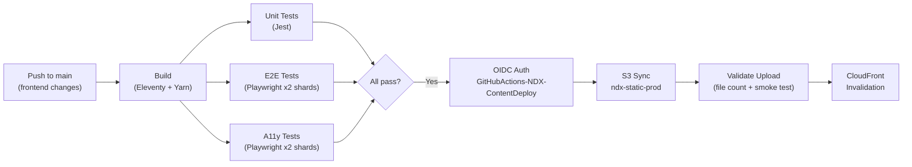
```mermaid
graph LR
    A["Push to main<br/>(frontend changes)"] --> B["Build<br/>(Eleventy + Yarn)"]
    B --> C["Unit Tests<br/>(Jest)"]
    B --> D["E2E Tests<br/>(Playwright x2 shards)"]
    B --> E["A11y Tests<br/>(Playwright x2 shards)"]
    C --> F{"All pass?"}
    D --> F
    E --> F
    F -->|Yes| G["OIDC Auth<br/>GitHubActions-NDX-ContentDeploy"]
    G --> H["S3 Sync<br/>ndx-static-prod"]
    H --> I["Validate Upload<br/>(file count + smoke test)"]
    I --> J["CloudFront<br/>Invalidation"]
```

**Key details:**
- Path filtering: Skips build/deploy if only `infra/` or `docs/` files changed
- Deployment target: `s3://ndx-static-prod/` in us-west-2
- CloudFront distribution: `E3THG4UHYDHVWP`
- Cache control: `public, max-age=3600`
- Post-deploy validation: File count comparison and `index.html` smoke test

**Source:** `repos/ndx/.github/workflows/ci.yaml`

### Infrastructure Deployment (infra.yaml)

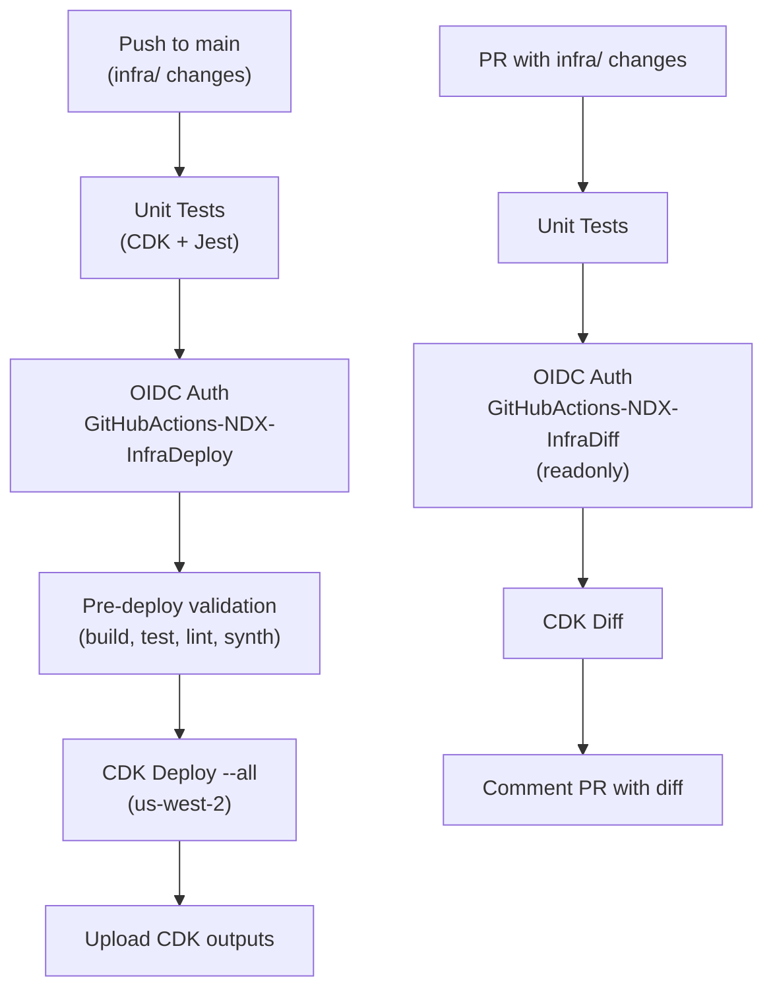
```mermaid
graph TB
    A["Push to main<br/>(infra/ changes)"] --> B["Unit Tests<br/>(CDK + Jest)"]
    B --> C["OIDC Auth<br/>GitHubActions-NDX-InfraDeploy"]
    C --> D["Pre-deploy validation<br/>(build, test, lint, synth)"]
    D --> E["CDK Deploy --all<br/>(us-west-2)"]
    E --> F["Upload CDK outputs"]

    G["PR with infra/ changes"] --> H["Unit Tests"]
    H --> I["OIDC Auth<br/>GitHubActions-NDX-InfraDiff<br/>(readonly)"]
    I --> J["CDK Diff"]
    J --> K["Comment PR with diff"]
```

The infrastructure pipeline also handles signup infrastructure and cross-account role deployment:
- **Signup CDK Deploy:** Deploys to Hub account (568672915267) using `GitHubActions-NDX-InfraDeploy`
- **ISB Cross-Account Role:** Deploys CloudFormation template to ISB account (955063685555) using `GitHubActions-ISB-InfraDeploy`

**Source:** `repos/ndx/.github/workflows/infra.yaml`

## Flow 2: ISB Core Deployment (Manual)

The upstream Innovation Sandbox on AWS solution is deployed manually from a developer workstation. There is no GitHub Actions CI/CD for the core ISB.

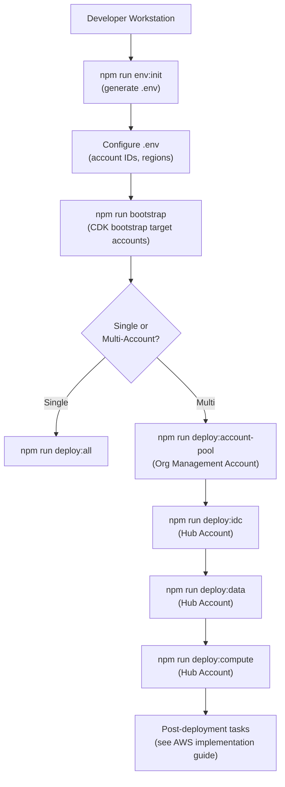
```mermaid
graph TB
    A["Developer Workstation"] --> B["npm run env:init<br/>(generate .env)"]
    B --> C["Configure .env<br/>(account IDs, regions)"]
    C --> D["npm run bootstrap<br/>(CDK bootstrap target accounts)"]
    D --> E{"Single or<br/>Multi-Account?"}
    E -->|Single| F["npm run deploy:all"]
    E -->|Multi| G["npm run deploy:account-pool<br/>(Org Management Account)"]
    G --> H["npm run deploy:idc<br/>(Hub Account)"]
    H --> I["npm run deploy:data<br/>(Hub Account)"]
    I --> J["npm run deploy:compute<br/>(Hub Account)"]
    J --> K["Post-deployment tasks<br/>(see AWS implementation guide)"]
```

**Stacks deployed (multi-account):**

| Stack | Account | Description |
|-------|---------|-------------|
| `InnovationSandbox-AccountPool` | Org Management | AWS Organizations OUs, account pool |
| `InnovationSandbox-IDC` | Hub | IAM Identity Center configuration |
| `InnovationSandbox-Data` | Hub | DynamoDB tables, S3 buckets |
| `InnovationSandbox-Compute` | Hub | Lambda functions, API Gateway, Step Functions |

**Prerequisites:**
- AWS CLI with appropriate credentials for both accounts
- Node.js 22
- Docker (for ECR image management)

**Source:** `repos/innovation-sandbox-on-aws/README.md`

## Flow 3: ISB Satellite Deployments

### Approver (Auto-deploy)

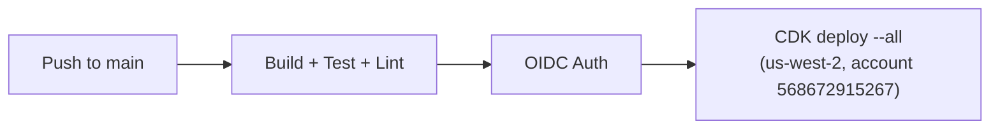
```mermaid
graph LR
    A["Push to main"] --> B["Build + Test + Lint"]
    B --> C["OIDC Auth"]
    C --> D["CDK deploy --all<br/>(us-west-2, account 568672915267)"]
```

Automatically deploys on every push to main. No manual gate.

**Source:** `repos/innovation-sandbox-on-aws-approver/.github/workflows/deploy.yml`

### Billing Separator (Manual deploy)

```mermaid
graph TB
    A["Push to main"] --> B["Validate Job<br/>(lint, test, build, CDK synth)"]
    C["workflow_dispatch<br/>(select: dev/prod)"] --> B
    B --> D{"workflow_dispatch?"}
    D -->|Yes| E["OIDC Auth"]
    E --> F["CDK deploy"]
    F --> G["Upload CDK outputs artifact"]
    D -->|No (push)| H["Validation only"]
```

Deploy requires manual `workflow_dispatch` trigger with environment selection (dev/prod). Push to main only runs validation.

**Source:** `repos/innovation-sandbox-on-aws-billing-seperator/.github/workflows/deploy.yml`

### Cost Collection (Manual deploy)

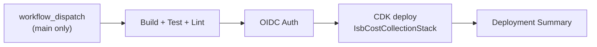
```mermaid
graph LR
    A["workflow_dispatch<br/>(main only)"] --> B["Build + Test + Lint"]
    B --> C["OIDC Auth"]
    C --> D["CDK deploy<br/>IsbCostCollectionStack"]
    D --> E["Deployment Summary"]
```

Deploy is `workflow_dispatch` only, with `production` environment protection. Requires multiple context variables passed to CDK.

**Source:** `repos/innovation-sandbox-on-aws-costs/.github/workflows/deploy.yml`

### Deployer (Auto-deploy with Docker)

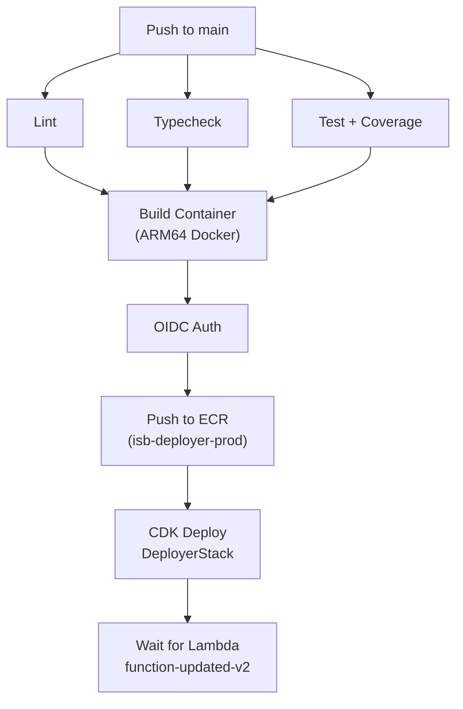
```mermaid
graph TB
    A["Push to main"] --> B["Lint"]
    A --> C["Typecheck"]
    A --> D["Test + Coverage"]
    B --> E["Build Container<br/>(ARM64 Docker)"]
    C --> E
    D --> E
    E --> F["OIDC Auth"]
    F --> G["Push to ECR<br/>(isb-deployer-prod)"]
    G --> H["CDK Deploy<br/>DeployerStack"]
    H --> I["Wait for Lambda<br/>function-updated-v2"]
```

This is the most complex pipeline: builds an ARM64 Docker image, pushes to ECR, then deploys via CDK. The Lambda waits for the new image to be active.

**Source:** `repos/innovation-sandbox-on-aws-deployer/.github/workflows/ci.yml`

### Client Library (Release on tag)

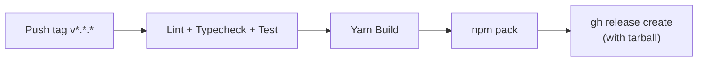
```mermaid
graph LR
    A["Push tag v*.*.*"] --> B["Lint + Typecheck + Test"]
    B --> C["Yarn Build"]
    C --> D["npm pack"]
    D --> E["gh release create<br/>(with tarball)"]
```

No AWS deployment. Produces a GitHub Release with an npm tarball.

**Source:** `repos/innovation-sandbox-on-aws-client/.github/workflows/release.yml`

## Flow 4: Scenarios Microsite Deployment

### Static Site (GitHub Pages)

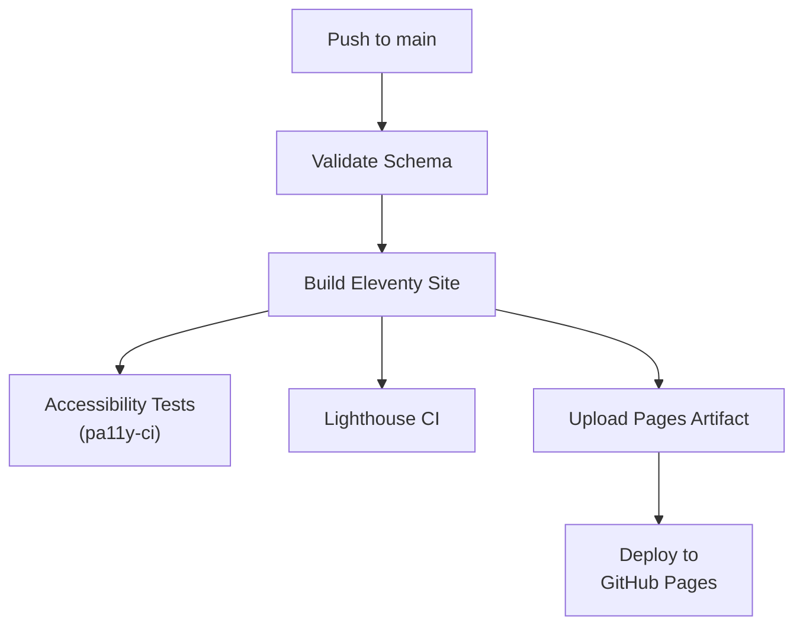
```mermaid
graph TB
    A["Push to main"] --> B["Validate Schema"]
    B --> C["Build Eleventy Site"]
    C --> D["Accessibility Tests<br/>(pa11y-ci)"]
    C --> E["Lighthouse CI"]
    C --> F["Upload Pages Artifact"]
    F --> G["Deploy to<br/>GitHub Pages"]
```

**Deployment target:** GitHub Pages at `https://aws.try.ndx.digital.cabinet-office.gov.uk`

**Source:** `repos/ndx_try_aws_scenarios/.github/workflows/build-deploy.yml`

### ISB Blueprints (CDK to Hub)

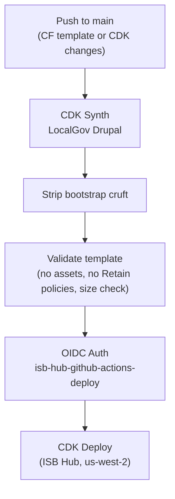
```mermaid
graph TB
    A["Push to main<br/>(CF template or CDK changes)"] --> B["CDK Synth<br/>LocalGov Drupal"]
    B --> C["Strip bootstrap cruft"]
    C --> D["Validate template<br/>(no assets, no Retain policies, size check)"]
    D --> E["OIDC Auth<br/>isb-hub-github-actions-deploy"]
    E --> F["CDK Deploy<br/>(ISB Hub, us-west-2)"]
```

Path-filtered to only trigger on changes to `cloudformation/scenarios/*/template.yaml`, `cloudformation/scenarios/localgov-drupal/cdk/**`, or `cloudformation/isb-hub/**`.

**Source:** `repos/ndx_try_aws_scenarios/.github/workflows/deploy-blueprints.yml`

### Docker Image (GHCR)

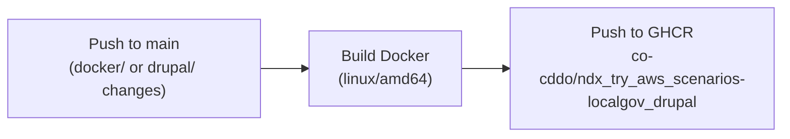
```mermaid
graph LR
    A["Push to main<br/>(docker/ or drupal/ changes)"] --> B["Build Docker<br/>(linux/amd64)"]
    B --> C["Push to GHCR<br/>co-cddo/ndx_try_aws_scenarios-localgov_drupal"]
```

Tags: `latest` (main only) and `sha-<commit>`.

**Source:** `repos/ndx_try_aws_scenarios/.github/workflows/docker-build.yml`

## Flow 5: Infrastructure (Terraform) Deployments

### SCP Management (ndx-try-aws-scp)

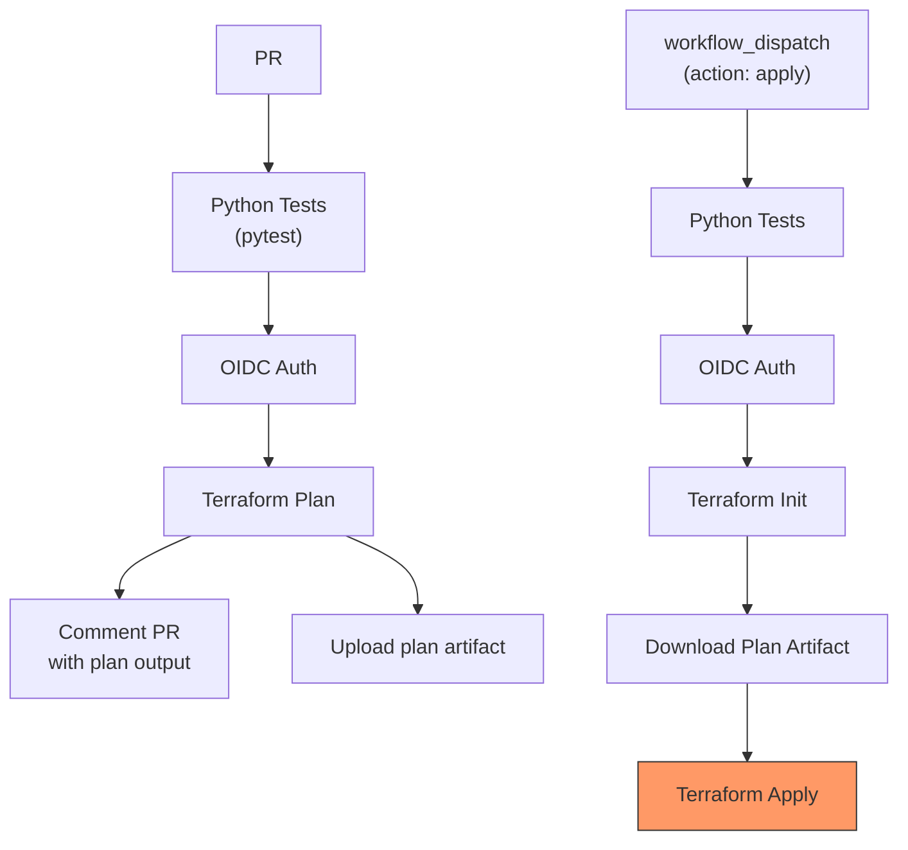
```mermaid
graph TB
    A["PR"] --> B["Python Tests<br/>(pytest)"]
    B --> C["OIDC Auth"]
    C --> D["Terraform Plan"]
    D --> E["Comment PR<br/>with plan output"]
    D --> F["Upload plan artifact"]

    G["workflow_dispatch<br/>(action: apply)"] --> H["Python Tests"]
    H --> I["OIDC Auth"]
    I --> J["Terraform Init"]
    J --> K["Download Plan Artifact"]
    K --> L["Terraform Apply"]

    style L fill:#f96,stroke:#333
```

**Key points:**
- Apply never runs automatically on merge -- always requires manual `workflow_dispatch` with `apply` action
- `production` environment with required reviewer approval
- Terraform state in S3 bucket `ndx-terraform-state-955063685555` with DynamoDB locking
- Working directory: `environments/ndx-production`
- Region: eu-west-2 (for state storage), SCPs are global

**Source:** `repos/ndx-try-aws-scp/.github/workflows/terraform.yaml`

### Terraform Validate (ndx-try-aws-terraform)

Validation only -- no deployment pipeline. Runs `terraform fmt -check`, `terraform init -backend=false`, and `terraform validate`. Actual changes to the org management account Terraform (billing roles, S3 state bucket) are applied manually.

**Source:** `repos/ndx-try-aws-terraform/.github/workflows/ci.yaml`

## Flow 6: Landing Zone Accelerator (LZA) Deployment

The LZA configuration is not deployed via GitHub Actions. Instead, it uses the AWS-native LZA CodePipeline:

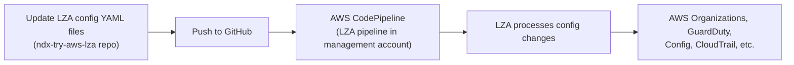
```mermaid
graph LR
    A["Update LZA config YAML files<br/>(ndx-try-aws-lza repo)"] --> B["Push to GitHub"]
    B --> C["AWS CodePipeline<br/>(LZA pipeline in management account)"]
    C --> D["LZA processes config changes"]
    D --> E["AWS Organizations, GuardDuty,<br/>Config, CloudTrail, etc."]
```

Configuration files include: `accounts-config.yaml`, `global-config.yaml`, `iam-config.yaml`, `network-config.yaml`, `organization-config.yaml`, `security-config.yaml`, and various policy JSON files.

The LZA repo README notes that the directory was restructured in December 2025 for the transition from S3/CodeCommit to GitHub as the configuration source.

**Source:** `repos/ndx-try-aws-lza/README.md`

## Flow 7: Legacy/Sandbox Deployments

### AWS Nuke (Scheduled)

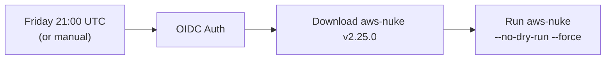
```mermaid
graph LR
    A["Friday 21:00 UTC<br/>(or manual)"] --> B["OIDC Auth"]
    B --> C["Download aws-nuke v2.25.0"]
    C --> D["Run aws-nuke<br/>--no-dry-run --force"]
```

Cleans up the legacy sandbox account weekly using the `nuke/config.yml` configuration.

**Source:** `repos/aws-sandbox/.github/workflows/aws-nuke.yml`

### Access Lambda and IAM (Terraform)

Both use Terraform with `auto-approve` and deploy on push to main when relevant paths change. These target the legacy sandbox account.

**Source:** `repos/aws-sandbox/.github/workflows/deploy-access-lambda.yml`, `repos/aws-sandbox/.github/workflows/update-iam.yml`

## Deployment Summary Matrix

| Component | Method | Trigger | Region | Automated? |
|-----------|--------|---------|--------|------------|
| NDX Website (content) | S3 sync + CloudFront | Push to main | us-west-2 | Yes |
| NDX Website (infra) | CDK | Push to main | us-west-2 | Yes |
| NDX Signup (infra) | CDK | Push to main | us-west-2 | Yes |
| NDX Cross-Account Role | CloudFormation | Push to main | us-west-2 | Yes |
| ISB Core | CDK (manual) | Manual | us-east-1 / us-west-2 | No |
| ISB Approver | CDK | Push to main | us-west-2 | Yes |
| ISB Billing Separator | CDK | workflow_dispatch | Configurable | Manual trigger |
| ISB Cost Collection | CDK | workflow_dispatch | us-west-2 | Manual trigger |
| ISB Deployer | ECR + CDK | Push to main | us-west-2 | Yes |
| ISB Client Library | npm pack + GH Release | Tag push | N/A | Yes |
| Scenarios Microsite | GitHub Pages | Push to main | N/A | Yes |
| Scenarios Blueprints | CDK | Push to main (path-filtered) | us-west-2 | Yes |
| LocalGov Drupal Image | GHCR | Push to main (path-filtered) | N/A | Yes |
| SCP Management | Terraform | Manual (apply) | eu-west-2 (state) | Plan auto, apply manual |
| Terraform Org Config | Terraform (manual) | Manual | us-west-2 | No |
| LZA Configuration | AWS CodePipeline | Pipeline trigger | Multiple | Yes (AWS-managed) |
| AWS Sandbox Nuke | aws-nuke | Friday 21:00 UTC | Configurable | Yes (scheduled) |

---
*Generated from source analysis. See [50-github-actions-inventory.md](./50-github-actions-inventory.md) for workflow details and [51-oidc-configuration.md](./51-oidc-configuration.md) for authentication configuration.*
