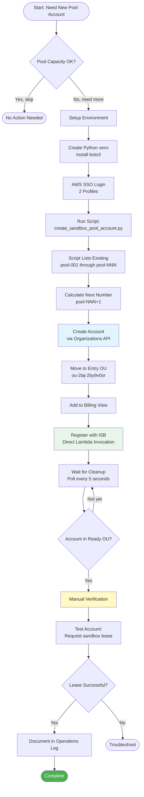
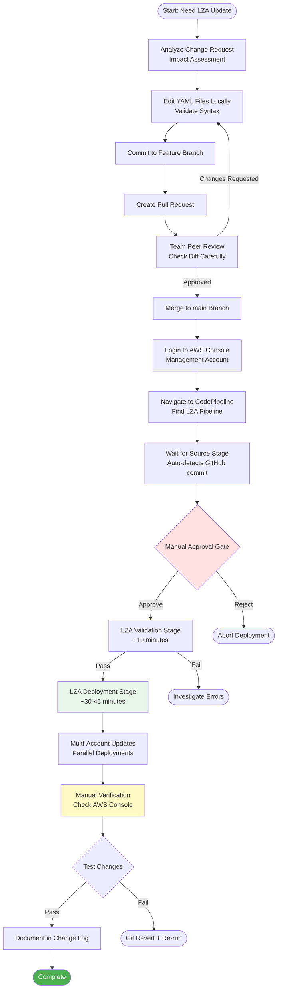
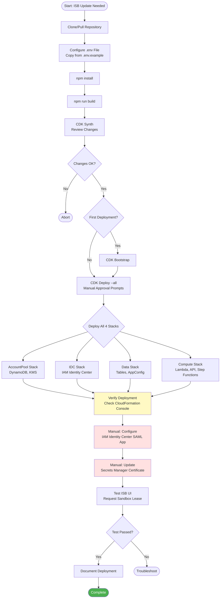

# Manual Operations Procedures

**Document Version:** 1.0
**Date:** 2026-02-03
**Scope:** Operations requiring manual intervention across NDX:Try AWS

---

## Executive Summary

While the NDX:Try AWS infrastructure employs extensive automation, several critical operations remain manual due to security requirements, infrequency, or architectural constraints. This document catalogs all manual operations, their procedures, required access, and mitigation strategies for operational overhead.

**Manual Operation Categories:**
1. **Pool Account Creation** - Infrequent (monthly or less)
2. **LZA Configuration Updates** - Organization-wide changes
3. **Core ISB Deployment** - Platform foundation
4. **Break-Glass Procedures** - Emergency access and recovery

---

## 1. Pool Account Creation

### Overview

| Property | Value |
|----------|-------|
| **Frequency** | Monthly or as needed |
| **Duration** | 10-15 minutes |
| **Required Access** | AWS Organizations (Org Management), ISB Hub |
| **Automation Level** | Semi-automated (Python script) |
| **Risk Level** | Low |

### Purpose

Create new AWS accounts for the Innovation Sandbox pool to accommodate growth in sandbox demand.

### Prerequisites

**AWS Access:**
- SSO Profile: `NDX/orgManagement` - For AWS Organizations operations
- SSO Profile: `NDX/InnovationSandboxHub` - For ISB Lambda invocation

**Software:**
- Python 3.x
- boto3 library
- AWS CLI configured with SSO

### Procedure



### Step-by-Step Instructions

#### 1. Setup Environment

```bash
# Clone repo if not already available
cd /path/to/innovation-sandbox-on-aws-utils

# Create virtual environment
python3 -m venv venv
source venv/bin/activate

# Install dependencies
pip install boto3
```

#### 2. Authenticate with AWS

```bash
# Login to both required profiles
aws sso login --profile NDX/orgManagement
aws sso login --profile NDX/InnovationSandboxHub

# Verify access
aws sts get-caller-identity --profile NDX/orgManagement
aws sts get-caller-identity --profile NDX/InnovationSandboxHub
```

#### 3. Run Pool Account Creation Script

```bash
# Run script (auto-calculates next pool number)
python create_sandbox_pool_account.py

# OR recover a partially-created account
python create_sandbox_pool_account.py <ACCOUNT_ID>
```

#### 4. Monitor Script Output

Expected output:
```
============================================================
🔑 STEP 1: AWS SSO Authentication
============================================================
  ✅ NDX/orgManagement - session valid
  ✅ NDX/InnovationSandboxHub - session valid

============================================================
📋 STEP 2: List existing pool accounts
============================================================
   Total: 8 pool accounts

============================================================
🆕 STEP 3: Create new account
============================================================
   Account name: pool-009
   Email: ndx-try-provider+gds-ndx-try-aws-pool-009@dsit.gov.uk
   ✅ Account created: 123456789012

============================================================
📦 STEP 4: Move to Entry OU
============================================================
   ✅ Move complete

============================================================
💰 STEP 4.5: Add to Billing View
============================================================
   ✅ Added account to billing view

============================================================
📝 STEP 5: Register with Innovation Sandbox
============================================================
   ✅ Registered successfully!
   📄 Status: CleanUp

============================================================
🧹 STEP 6: Wait for Innovation Sandbox cleanup
============================================================
   ✅ Account moved to target OU after 8m 45s!

============================================================
🎉 COMPLETE
============================================================
   Account: pool-009 (123456789012)
   ⏱️  Total time: 12m 34s
```

#### 5. Verify Account

```bash
# Check account status via AWS CLI
aws organizations describe-account \
  --account-id <NEW_ACCOUNT_ID> \
  --profile NDX/orgManagement

# Expected OU: ou-2laj-oihxgbtr (Ready OU)
```

#### 6. Test Account

1. Log into ISB UI: https://isb.try.ndx.digital.cabinet-office.gov.uk
2. Request a sandbox lease
3. Select the new pool account (should appear in dropdown)
4. Verify lease approval and account access

### Configuration Constants

Located in `create_sandbox_pool_account.py`:

```python
ENTRY_OU = "ou-2laj-2by9v0sr"          # Entry OU for registration
SANDBOX_READY_OU = "ou-2laj-oihxgbtr"  # Ready OU after cleanup
BILLING_VIEW_ARN = "arn:aws:billing::955063685555:billingview/custom-..."
POLL_INTERVAL = 5                       # seconds
MAX_WAIT_TIME = 3600                    # 1 hour
```

### Troubleshooting

**Issue: SSO token expired during execution**

```bash
# Re-authenticate without restarting script
aws sso login --profile NDX/orgManagement
aws sso login --profile NDX/InnovationSandboxHub

# If script already failed, re-run with account ID
python create_sandbox_pool_account.py <ACCOUNT_ID>
```

**Issue: Account stuck in Entry OU**

1. Check ISB cleanup logs in CloudWatch
2. Verify account table in DynamoDB
3. Manually invoke cleanup Step Function

**Issue: Account creation failed**

```bash
# Check account status
aws organizations describe-create-account-status \
  --create-account-request-id <REQUEST_ID> \
  --profile NDX/orgManagement

# If failed, investigate reason in output
# Common: Email already in use, service limit exceeded
```

### Recovery Procedures

**Scenario: Script crashed mid-execution**

```bash
# Find partially-created account
aws organizations list-accounts --profile NDX/orgManagement | \
  grep pool-

# Resume with account ID
python create_sandbox_pool_account.py <ACCOUNT_ID>
```

**Scenario: Account in wrong OU**

```bash
# Manually move account
aws organizations move-account \
  --account-id <ACCOUNT_ID> \
  --source-parent-id <CURRENT_OU> \
  --destination-parent-id ou-2laj-2by9v0sr \
  --profile NDX/orgManagement
```

### Why Manual?

- **Infrequent operation** - New pool accounts created monthly or less
- **Multi-account orchestration** - Requires coordination between Org Management and Hub accounts
- **Organization-level permissions** - Creating accounts requires sensitive permissions
- **Complexity not worth automating** - Script is already semi-automated

### Future Automation Opportunities

- Trigger script via Lambda on CloudWatch alarm (pool capacity low)
- Integrate with ISB API for automated registration
- Automated testing of new accounts

### Source File

`/Users/cns/httpdocs/cddo/ndx-try-arch/repos/innovation-sandbox-on-aws-utils/create_sandbox_pool_account.py`

---

## 2. LZA Configuration Updates

### Overview

| Property | Value |
|----------|-------|
| **Frequency** | Monthly or quarterly |
| **Duration** | 60-90 minutes |
| **Required Access** | AWS Management Account |
| **Automation Level** | Manual via AWS Console |
| **Risk Level** | High (organization-wide impact) |

### Purpose

Update AWS Landing Zone Accelerator (LZA) configuration to modify organization structure, accounts, OUs, SCPs, or network configuration.

### Prerequisites

**AWS Access:**
- SSO Profile: `NDX/managementAccount` or equivalent
- Permissions: AdministratorAccess in Management Account

**Knowledge:**
- LZA architecture and configuration file format
- Organization structure and dependencies
- Impact analysis of configuration changes

### LZA Configuration Files

Located in `ndx-try-aws-lza/`:

| File | Purpose |
|------|---------|
| `accounts-config.yaml` | Account definitions and workload OUs |
| `global-config.yaml` | Global settings, logging, CloudTrail |
| `iam-config.yaml` | IAM policies, roles, permission sets |
| `network-config.yaml` | VPC, subnets, Transit Gateway configuration |
| `organization-config.yaml` | OU structure, SCPs, quarantine policies |
| `security-config.yaml` | GuardDuty, SecurityHub, Config rules |
| `replacements-config.yaml` | Variable substitutions |

### Procedure



### Step-by-Step Instructions

#### 1. Analyze Change Request

Document the required change:
- What: Specific configuration change
- Why: Business justification
- Impact: Affected accounts, OUs, policies
- Risk: Potential for service disruption

#### 2. Edit Configuration Files

```bash
# Clone repo
git clone <repo-url>
cd ndx-try-aws-lza

# Create feature branch
git checkout -b feature/add-new-ou

# Edit YAML files (example: add new OU)
vim organization-config.yaml
```

**Example: Add Innovation Sandbox OU**

```yaml
organizationalUnits:
  - name: InnovationSandbox
    ignore: false
    scps:
      - cost-avoidance-scp
      - regional-restrictions
    quarantinePolicy:
      enable: true
      scpPolicyNames:
        - quarantine-deny-all
```

#### 3. Validate Configuration Locally

```bash
# YAML syntax validation
yamllint organization-config.yaml

# LZA-specific validation (if available)
# Note: Full validation happens in pipeline
```

#### 4. Create Pull Request

```bash
# Commit changes
git add organization-config.yaml
git commit -m "Add InnovationSandbox OU for ISB pool accounts"

# Push to GitHub
git push origin feature/add-new-ou

# Create PR via GitHub UI
# Assign to infrastructure team for review
```

#### 5. Peer Review

Reviewer checklist:
- [ ] YAML syntax is valid
- [ ] Change aligns with request
- [ ] No unintended modifications
- [ ] Dependencies are satisfied
- [ ] Naming conventions followed
- [ ] Documentation updated

#### 6. Merge to Main

After approval, merge via GitHub UI

#### 7. Trigger LZA Pipeline

```bash
# 1. Login to AWS Console (Management Account)
# 2. Navigate to: CodePipeline > Pipelines
# 3. Find pipeline: AWSAccelerator-Pipeline
# 4. Click "Release change" button
```

Alternatively, pipeline may auto-trigger from GitHub webhook.

#### 8. Monitor Pipeline Stages

**Source Stage (~1 min):**
- Pulls latest configuration from GitHub

**Build Stage (~5 min):**
- Validates YAML syntax
- Checks for configuration errors

**Deploy Stage (~30-45 min):**
- Updates CloudFormation stacks across all accounts
- Modifies organization structure
- Applies SCPs and policies

#### 9. Verify Changes

```bash
# Check Organization structure
aws organizations list-organizational-units-for-parent \
  --parent-id r-xxxx \
  --profile NDX/managementAccount

# Check SCPs attached to OU
aws organizations list-policies-for-target \
  --target-id ou-xxxx-xxxxxxxx \
  --filter SERVICE_CONTROL_POLICY \
  --profile NDX/managementAccount

# Check account placement
aws organizations list-accounts-for-parent \
  --parent-id ou-xxxx-xxxxxxxx \
  --profile NDX/managementAccount
```

#### 10. Test Changes

**Example: Test new OU**
1. Move test account to new OU
2. Verify SCPs are applied
3. Test that expected actions are allowed/denied

#### 11. Document Change

Update change log:

```markdown
## 2026-02-03: Added InnovationSandbox OU

**Change:** Created new OU for Innovation Sandbox pool accounts
**OU ID:** ou-2laj-4dyae1oa
**SCPs Applied:** cost-avoidance-scp, regional-restrictions
**Accounts Moved:** pool-001 through pool-008
**Verified By:** [Name]
**LZA Pipeline Run:** https://console.aws.amazon.com/codesuite/codepipeline/pipelines/AWSAccelerator-Pipeline/executions/abc123
```

### Common LZA Changes

#### Add New Organizational Unit

```yaml
# organization-config.yaml
organizationalUnits:
  - name: NewWorkloadOU
    ignore: false
```

#### Attach SCP to OU

```yaml
# organization-config.yaml
organizationalUnits:
  - name: InnovationSandbox
    scps:
      - cost-avoidance-scp  # Add this line
```

#### Add New Account

```yaml
# accounts-config.yaml
workloadAccounts:
  - name: new-account-name
    email: new-account+tag@dsit.gov.uk
    organizationalUnit: Sandbox
```

#### Update IAM Policy

```yaml
# iam-config.yaml
policies:
  - name: custom-readonly-policy
    policy: iam-policies/custom-readonly.json
```

### Troubleshooting

**Issue: LZA pipeline fails at validation stage**

1. Check CloudWatch Logs for pipeline
2. Review YAML syntax errors
3. Verify references to other resources exist
4. Check for circular dependencies

**Issue: Changes not applied to all accounts**

1. Check LZA execution logs in CloudWatch
2. Verify accounts are in correct OU
3. Check for account-level exceptions in config
4. Re-run pipeline

**Issue: SCP prevents expected actions**

1. Test SCP in isolation using AWS Policy Simulator
2. Check for conflicting SCPs in parent OUs
3. Verify SCP is attached to correct OU
4. Check for syntax errors in SCP JSON

### Rollback Procedure

```bash
# 1. Git revert the change
git revert <commit-hash>
git push origin main

# 2. Re-trigger LZA pipeline
# Navigate to AWS Console > CodePipeline > AWSAccelerator-Pipeline
# Click "Release change"

# 3. Monitor rollback
# Wait for pipeline to complete (~30-45 min)

# 4. Verify rollback successful
# Check Organization console for reverted configuration
```

### Why Manual?

- **Organization-wide impact** - Changes affect entire AWS Organization
- **Requires management account access** - High security threshold
- **Infrequent changes** - Monthly or quarterly updates
- **Complex dependencies** - Requires human judgment and validation
- **AWS Console integration** - CodePipeline cannot be triggered from GitHub Actions without additional setup

### Future Automation Opportunities

- GitHub Actions trigger for LZA pipeline (requires AWS role configuration)
- Automated validation of YAML syntax in PR
- Terraform for LZA configuration management

### Source Files

`/Users/cns/httpdocs/cddo/ndx-try-arch/repos/ndx-try-aws-lza/*.yaml`

---

## 3. Core ISB Deployment

### Overview

| Property | Value |
|----------|-------|
| **Frequency** | Quarterly or as needed |
| **Duration** | 30-60 minutes |
| **Required Access** | Hub Account (568672915267) |
| **Automation Level** | Manual CDK deployment |
| **Risk Level** | High (core platform) |

### Purpose

Deploy or update the core Innovation Sandbox on AWS (ISB) platform, including all Lambda functions, API Gateway, DynamoDB tables, and Step Functions.

### Prerequisites

**AWS Access:**
- SSO Profile: `NDX/InnovationSandboxHub`
- Permissions: AdministratorAccess or equivalent

**Software:**
- Node.js 18 or later
- AWS CDK CLI
- Git

**Environment Variables:**
- `.env` file configured (copy from `.env.example`)

### Procedure



### Step-by-Step Instructions

#### 1. Setup Environment

```bash
# Clone repository
git clone <isb-repo-url>
cd innovation-sandbox-on-aws

# Checkout desired version
git checkout main  # or specific tag

# Configure environment
cp .env.example .env
vim .env
```

**Required Environment Variables:**

```bash
# .env file
AWS_PROFILE=NDX/InnovationSandboxHub
AWS_REGION=us-west-2
NAMESPACE=ndx-try-isb
ORG_MANAGEMENT_ACCOUNT_ID=955063685555
IDENTITY_CENTER_INSTANCE_ARN=arn:aws:sso:::instance/ssoins-xxxxxxxxxxxx
IDENTITY_CENTER_IDENTITY_STORE_ID=d-xxxxxxxxxx
# ... additional variables per .env.example
```

#### 2. Install Dependencies

```bash
npm install
```

#### 3. Build Project

```bash
npm run build
```

#### 4. Synthesize CloudFormation

```bash
npx cdk synth --all
```

Review generated CloudFormation templates in `cdk.out/`.

#### 5. Bootstrap CDK (First Time Only)

```bash
npx cdk bootstrap aws://568672915267/us-west-2
```

#### 6. Deploy All Stacks

```bash
npx cdk deploy --all --require-approval broadening
```

**Approval Prompts:**
- IAM policy changes
- Security group modifications
- New IAM roles

Expected deployment order:
1. AccountPool Stack (~5 min)
2. IDC Stack (~3 min)
3. Data Stack (~5 min)
4. Compute Stack (~15 min)

#### 7. Monitor Deployment

```bash
# Watch CloudFormation console
# https://console.aws.amazon.com/cloudformation/home?region=us-west-2

# Or tail CloudFormation events
aws cloudformation describe-stack-events \
  --stack-name ndx-try-isb-compute \
  --max-items 20 \
  --profile NDX/InnovationSandboxHub
```

#### 8. Configure IAM Identity Center (Manual)

**Navigate to:**
AWS Console > IAM Identity Center > Applications

**Create SAML Application:**
1. Click "Add Application"
2. Select "Custom SAML 2.0 application"
3. Name: "Innovation Sandbox on AWS"
4. Download IdP metadata XML

**Configure Application:**
- ACS URL: `https://<cloudfront-url>/saml/acs`
- Entity ID: `urn:amazon:webservices:isb`
- Attribute mappings:
  - `Subject` → `${user:subject}`
  - `email` → `${user:email}`

#### 9. Update Secrets Manager Certificate

```bash
# Extract certificate from IdP metadata
# Copy X509Certificate value

# Update Secrets Manager secret
aws secretsmanager update-secret \
  --secret-id /isb/ndx-try-isb/Auth/IdpCert \
  --secret-string '<X509Certificate content>' \
  --profile NDX/InnovationSandboxHub
```

#### 10. Test Deployment

1. Navigate to ISB UI: `https://isb.try.ndx.digital.cabinet-office.gov.uk`
2. Login via IAM Identity Center
3. Request a sandbox lease
4. Verify lease approval (if auto-approve configured)
5. Access sandbox account
6. Terminate lease
7. Verify account cleanup

#### 11. Verify All Components

**DynamoDB Tables:**
```bash
aws dynamodb list-tables --profile NDX/InnovationSandboxHub | grep isb
```

**Lambda Functions:**
```bash
aws lambda list-functions --profile NDX/InnovationSandboxHub | grep ISB
```

**API Gateway:**
```bash
aws apigateway get-rest-apis --profile NDX/InnovationSandboxHub
```

**Step Functions:**
```bash
aws stepfunctions list-state-machines --profile NDX/InnovationSandboxHub
```

### Troubleshooting

**Issue: CDK deploy fails with "Template format error"**

```bash
# Check CDK version compatibility
npx cdk --version

# Clear CDK cache
rm -rf cdk.out
npx cdk synth --all
```

**Issue: IAM Identity Center integration fails**

1. Verify `IDENTITY_CENTER_INSTANCE_ARN` is correct
2. Check Identity Center is enabled in us-west-2
3. Verify SAML app configuration matches CloudFront URL

**Issue: Secrets Manager certificate mismatch**

1. Re-download IdP metadata from Identity Center
2. Extract X509Certificate (between `<X509Certificate>` tags)
3. Ensure no whitespace or newlines
4. Update secret and trigger JWT rotation

### Rollback Procedure

**Option 1: CDK Rollback**

```bash
# CloudFormation auto-rollback on failure
# Manually trigger rollback via console if needed
```

**Option 2: Redeploy Previous Version**

```bash
# Checkout previous commit
git checkout <previous-commit>

# Redeploy
npm install
npm run build
npx cdk deploy --all
```

**Option 3: Stack Deletion**

```bash
# CAUTION: Deletes all data
npx cdk destroy --all
```

### Why Manual?

- **Infrequent deployments** - Core platform is stable
- **Complex dependencies** - Identity Center integration requires manual configuration
- **Manual approval required** - IAM changes need review
- **Secrets management** - Certificate must be manually extracted and stored

### Future Automation Opportunities

- GitHub Actions workflow for CDK deployment
- Automated Identity Center configuration via API
- Secrets rotation automation

### Source Files

`/Users/cns/httpdocs/cddo/ndx-try-arch/repos/innovation-sandbox-on-aws/`

---

## 4. Break-Glass Procedures

### Overview

Emergency access procedures for critical incidents requiring immediate intervention.

### Scenario 1: Cost Overrun Emergency

**Situation:** Sandbox account incurring unexpected costs exceeding daily budget

**Immediate Actions:**

```bash
# 1. Identify account
aws ce get-cost-and-usage \
  --time-period Start=2026-02-01,End=2026-02-03 \
  --granularity DAILY \
  --metrics BlendedCost \
  --group-by Type=DIMENSION,Key=LINKED_ACCOUNT \
  --profile NDX/orgManagement

# 2. Move account to quarantine OU (blocks all actions except read)
aws organizations move-account \
  --account-id <ACCOUNT_ID> \
  --source-parent-id <CURRENT_OU> \
  --destination-parent-id ou-2laj-quarantine \
  --profile NDX/orgManagement

# 3. Trigger immediate account cleanup
aws stepfunctions start-execution \
  --state-machine-arn <CLEANUP_STATE_MACHINE_ARN> \
  --input '{"accountId":"<ACCOUNT_ID>"}' \
  --profile NDX/InnovationSandboxHub
```

### Scenario 2: API Gateway Outage

**Situation:** ISB API Gateway returning 5xx errors

**Immediate Actions:**

```bash
# 1. Check API Gateway logs
aws logs tail /aws/apigateway/isb-api --follow \
  --profile NDX/InnovationSandboxHub

# 2. Check Lambda function errors
aws logs tail /aws/lambda/ISB-LeasesLambdaFunction --follow \
  --profile NDX/InnovationSandboxHub

# 3. If Lambda issue: Redeploy previous version
aws lambda update-function-code \
  --function-name ISB-LeasesLambdaFunction \
  --s3-bucket <CDK_ASSETS_BUCKET> \
  --s3-key <PREVIOUS_VERSION_KEY> \
  --profile NDX/InnovationSandboxHub
```

### Scenario 3: DynamoDB Table Corruption

**Situation:** DynamoDB table data corruption or accidental deletion

**Immediate Actions:**

```bash
# 1. Enable point-in-time recovery (if not already enabled)
aws dynamodb update-continuous-backups \
  --table-name isb-sandbox-accounts \
  --point-in-time-recovery-specification PointInTimeRecoveryEnabled=true \
  --profile NDX/InnovationSandboxHub

# 2. Restore table from point-in-time
aws dynamodb restore-table-to-point-in-time \
  --source-table-name isb-sandbox-accounts \
  --target-table-name isb-sandbox-accounts-restored \
  --restore-date-time 2026-02-03T10:00:00Z \
  --profile NDX/InnovationSandboxHub

# 3. Swap tables (requires application downtime)
# - Update Lambda environment variables
# - Update AppConfig configuration
```

### Scenario 4: Unauthorized Access Attempt

**Situation:** Suspicious activity detected via CloudTrail

**Immediate Actions:**

```bash
# 1. Query CloudTrail for suspicious events
aws cloudtrail lookup-events \
  --lookup-attributes AttributeKey=Username,AttributeValue=<SUSPECTED_USER> \
  --start-time 2026-02-03T00:00:00Z \
  --profile NDX/InnovationSandboxHub

# 2. Revoke active sessions (if user is compromised)
aws iam delete-signing-certificate \
  --user-name <USER> \
  --certificate-id <CERT_ID> \
  --profile NDX/InnovationSandboxHub

# 3. Rotate JWT secret
aws secretsmanager rotate-secret \
  --secret-id /isb/ndx-try-isb/Auth/JwtSecret \
  --profile NDX/InnovationSandboxHub

# 4. Review and revoke active leases
# (Manual via ISB UI or direct DynamoDB update)
```

### Scenario 5: CloudFront Distribution Failure

**Situation:** ISB UI inaccessible due to CloudFront issue

**Immediate Actions:**

```bash
# 1. Check CloudFront distribution status
aws cloudfront get-distribution \
  --id <DISTRIBUTION_ID> \
  --profile NDX/InnovationSandboxHub

# 2. Check S3 bucket (origin)
aws s3 ls s3://<ISB_UI_BUCKET>/ --profile NDX/InnovationSandboxHub

# 3. Invalidate CloudFront cache
aws cloudfront create-invalidation \
  --distribution-id <DISTRIBUTION_ID> \
  --paths "/*" \
  --profile NDX/InnovationSandboxHub

# 4. If distribution is broken: Redeploy CDK stack
cd innovation-sandbox-on-aws
npx cdk deploy IsbComputeStack --require-approval never
```

### Emergency Contacts

| Role | Contact | Responsibilities |
|------|---------|------------------|
| Platform Lead | [Contact Info] | Overall platform decisions |
| AWS TAM | [Contact Info] | AWS support escalation |
| Security Team | [Contact Info] | Security incidents |
| On-Call Engineer | [PagerDuty/Slack] | 24/7 incident response |

### Escalation Path

1. **Level 1:** On-call engineer investigates (0-15 min)
2. **Level 2:** Platform lead engaged (15-30 min)
3. **Level 3:** AWS TAM engaged (30+ min)

---

## 5. Operational Runbooks

### Daily Operations Checklist

- [ ] Review CloudWatch alarms for any triggered alerts
- [ ] Check budget alerts for cost anomalies
- [ ] Review ISB lease queue for stuck leases
- [ ] Verify pool account availability (minimum 3 available)
- [ ] Check GitHub Actions workflow failures

### Weekly Operations Checklist

- [ ] Review CloudTrail logs for suspicious activity
- [ ] Check DynamoDB table metrics (read/write capacity)
- [ ] Verify backup policies are functioning
- [ ] Review Lambda function error rates
- [ ] Check API Gateway throttling metrics

### Monthly Operations Checklist

- [ ] Review and renew expiring certificates
- [ ] Audit IAM roles and policies for least privilege
- [ ] Check for AWS service updates affecting LZA
- [ ] Review and update cost budgets
- [ ] Test break-glass procedures
- [ ] Review and archive old CloudWatch logs

---

## Related Documents

- [50-github-actions-inventory.md](./50-github-actions-inventory.md) - CI/CD workflows
- [52-deployment-flows.md](./52-deployment-flows.md) - Deployment procedures
- [63-compliance.md](./63-compliance.md) - Compliance and security controls

---

**Source Files:**
- Pool account creation: `/Users/cns/httpdocs/cddo/ndx-try-arch/repos/innovation-sandbox-on-aws-utils/`
- LZA configuration: `/Users/cns/httpdocs/cddo/ndx-try-arch/repos/ndx-try-aws-lza/`
- ISB deployment: `/Users/cns/httpdocs/cddo/ndx-try-arch/repos/innovation-sandbox-on-aws/`
