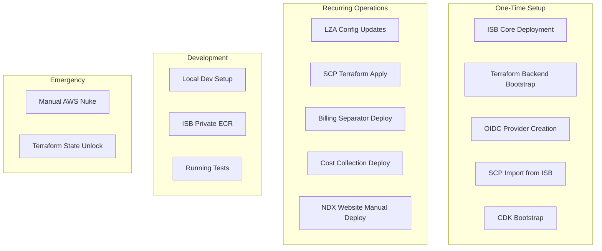
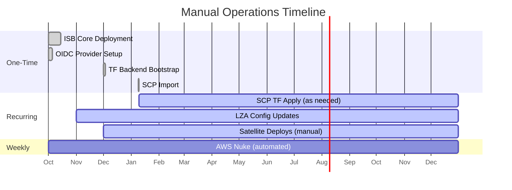

# Manual Operations

> **Last Updated**: 2026-03-06
> **Sources**: README files, scripts directories, docs directories, and workflow configurations across all repositories

## Executive Summary

While the NDX:Try ecosystem automates most deployments through GitHub Actions, several critical operations require manual intervention. These include the initial ISB core deployment, Terraform state bootstrapping, SCP import procedures, LZA configuration updates, NDX website emergency deployments, and local development environment setup. This document catalogues all manual procedures discovered across the 15 repositories, organized by frequency and criticality.

## Operations Index


```mermaid
graph TB
    subgraph "One-Time Setup"
        A["ISB Core Deployment"]
        B["Terraform Backend Bootstrap"]
        C["OIDC Provider Creation"]
        D["SCP Import from ISB"]
        E["CDK Bootstrap"]
    end

    subgraph "Recurring Operations"
        F["LZA Config Updates"]
        G["SCP Terraform Apply"]
        H["Billing Separator Deploy"]
        I["Cost Collection Deploy"]
        J["NDX Website Manual Deploy"]
    end

    subgraph "Development"
        K["Local Dev Setup"]
        L["ISB Private ECR"]
        M["Running Tests"]
    end

    subgraph "Emergency"
        N["Manual AWS Nuke"]
        O["Terraform State Unlock"]
    end
```

## One-Time Setup Operations

### 1. ISB Core Deployment

**Repository:** `innovation-sandbox-on-aws`
**Frequency:** One-time initial setup, occasional redeployment
**Prerequisites:** AWS CLI credentials for both org management and hub accounts, Node.js 22, Docker

The upstream Innovation Sandbox on AWS solution has no CI/CD pipeline and must be deployed manually.

#### Procedure

```bash
# 1. Clone and install
git clone <repo-url>
cd innovation-sandbox-on-aws
npm install

# 2. Generate environment configuration
npm run env:init

# 3. Edit .env file with account IDs, regions, and settings
# Required values documented in .env file comments

# 4. Bootstrap CDK in target accounts
npm run bootstrap

# 5a. Single-account deployment
npm run deploy:all

# 5b. Multi-account deployment (recommended for production)
npm run deploy:account-pool   # Org Management Account
npm run deploy:idc            # Hub Account
npm run deploy:data           # Hub Account
npm run deploy:compute        # Hub Account

# 6. Complete post-deployment tasks
# See: https://docs.aws.amazon.com/solutions/latest/innovation-sandbox-on-aws/post-deployment-configuration-tasks.html
```

#### Post-Deployment Tasks

After deployment, additional manual configuration is required as described in the AWS implementation guide. These include IAM Identity Center setup, account pool initialization, and user provisioning.

**Source:** `repos/innovation-sandbox-on-aws/README.md`

### 2. Terraform Backend Bootstrap (SCP)

**Repository:** `ndx-try-aws-scp`
**Frequency:** One-time per environment
**Target Account:** 955063685555 (Org Management)
**Region:** eu-west-2

This script creates the S3 bucket and DynamoDB table needed for Terraform remote state.

#### Procedure

```bash
# 1. Ensure you have credentials for the management account (955063685555)
aws sts get-caller-identity

# 2. Run the bootstrap script
cd repos/ndx-try-aws-scp
./scripts/bootstrap-backend.sh
```

#### What the Script Creates

| Resource | Name | Purpose |
|----------|------|---------|
| S3 Bucket | `ndx-terraform-state-955063685555` | Terraform state storage (versioned, encrypted, TLS enforced) |
| DynamoDB Table | `ndx-terraform-locks` | Terraform state locking |
| Bucket Policy | EnforceTLS | Denies non-HTTPS access |

The script includes safety checks:
- Verifies AWS CLI is configured
- Confirms the current account matches expected account (955063685555)
- Skips resource creation if already exists
- Enables versioning and AES-256 encryption
- Blocks public access

**Source:** `repos/ndx-try-aws-scp/scripts/bootstrap-backend.sh`

### 3. OIDC Provider Setup

**Repository:** `ndx-try-aws-scp` (documentation)
**Frequency:** One-time per AWS account
**Target Accounts:** 568672915267, 955063685555

#### Procedure

```bash
# 1. Check if provider already exists
aws iam list-open-id-connect-providers

# 2. Create the provider if not present
aws iam create-open-id-connect-provider \
  --url https://token.actions.githubusercontent.com \
  --client-id-list sts.amazonaws.com \
  --thumbprint-list 6938fd4d98bab03faadb97b34396831e3780aea1

# 3. Create the IAM role for the repository
aws iam create-role \
  --role-name GitHubActions-NDX-SCPDeploy \
  --assume-role-policy-document file://trust-policy.json \
  --description "Role for GitHub Actions to deploy SCP changes"

# 4. Attach the appropriate permission policy
aws iam attach-role-policy \
  --role-name GitHubActions-NDX-SCPDeploy \
  --policy-arn arn:aws:iam::955063685555:policy/GitHubActions-NDX-SCPDeploy-Policy

# 5. Configure GitHub repository secrets
# Settings -> Secrets and variables -> Actions
# Add: AWS_ROLE_ARN = arn:aws:iam::955063685555:role/GitHubActions-NDX-SCPDeploy

# 6. Create GitHub environment with required reviewers
# Settings -> Environments -> New environment -> "production"
```

**Source:** `repos/ndx-try-aws-scp/docs/GITHUB_ACTIONS_SETUP.md`

### 4. SCP Import from ISB CDK

**Repository:** `ndx-try-aws-scp`
**Frequency:** One-time (when migrating SCPs from ISB CDK to Terraform)
**Target Account:** 955063685555

#### Procedure

```bash
# 1. Ensure credentials for management account
aws sts get-caller-identity
# Expected: Account 955063685555

# 2. Find existing SCP Policy IDs
aws organizations list-policies --filter SERVICE_CONTROL_POLICY \
  --query 'Policies[?starts_with(Name, `InnovationSandbox`)].{Name:Name,Id:Id}'

# 3. Run the import script
cd repos/ndx-try-aws-scp
./scripts/import-existing-scps.sh

# 4. Review the plan
cd environments/ndx-production
terraform plan

# 5. Apply changes
terraform apply
```

**Known SCP Policy IDs (as of 2026-01-09):**
- `InnovationSandboxAwsNukeSupportedServicesScp`: `p-7pd0szg9`
- `InnovationSandboxLimitRegionsScp`: `p-02s3te0u`
- `InnovationSandboxProtectISBResourcesScp`: `p-gn4fu3co`
- `InnovationSandboxRestrictionsScp`: `p-6tw8eixp`
- `InnovationSandboxWriteProtectionScp`: `p-tyb1wjxv`

**Important warning from script:** After applying Terraform, the ISB CDK will show drift on these SCPs. Do NOT re-deploy the ISB Account Pool stack without re-applying Terraform.

**Source:** `repos/ndx-try-aws-scp/scripts/import-existing-scps.sh`

### 5. CDK Bootstrap

**Repository:** `innovation-sandbox-on-aws`
**Frequency:** One-time per account per region

Before deploying CDK stacks, each target account/region combination must be bootstrapped:

```bash
npm run bootstrap
```

This creates the CDK toolkit stack (`CDKToolkit`) with an S3 bucket for assets and IAM roles for deployment.

**Source:** `repos/innovation-sandbox-on-aws/README.md`

## Recurring Operations

### 6. LZA Configuration Updates

**Repository:** `ndx-try-aws-lza`
**Frequency:** As needed for organization policy changes
**Deployment:** AWS CodePipeline (not GitHub Actions)

The LZA configuration repository contains YAML files that are processed by the AWS Landing Zone Accelerator pipeline. Changes are committed to GitHub and picked up by the AWS-managed CodePipeline.

#### Files to Edit

| File | Purpose |
|------|---------|
| `accounts-config.yaml` | AWS account definitions |
| `global-config.yaml` | Global LZA settings |
| `iam-config.yaml` | IAM policies and roles |
| `network-config.yaml` | VPC, subnets, transit gateway |
| `organization-config.yaml` | OU structure, SCPs |
| `security-config.yaml` | GuardDuty, Config, CloudTrail |
| `replacements-config.yaml` | Variable replacements |

#### Procedure

```bash
# 1. Edit the relevant YAML file(s)
# 2. Commit and push to GitHub
# 3. AWS CodePipeline picks up the change automatically
# 4. Monitor pipeline execution in AWS Console
```

**Note on SCP conflicts:** LZA may revert SCP changes made by Terraform. If using the ndx-try-aws-scp Terraform alongside LZA, disable SCP revert in `security-config.yaml`:

```yaml
scpRevertChangesConfig:
  enable: false
```

**Source:** `repos/ndx-try-aws-lza/README.md`, `repos/ndx-try-aws-scp/README.md`

### 7. SCP Terraform Apply

**Repository:** `ndx-try-aws-scp`
**Frequency:** After merging PRs with SCP changes
**Trigger:** Manual `workflow_dispatch` in GitHub Actions

While `terraform plan` runs automatically on PRs, `terraform apply` must be triggered manually:

1. Navigate to GitHub Actions for the ndx-try-aws-scp repository
2. Select "Terraform SCP Management" workflow
3. Click "Run workflow"
4. Select action: `apply`
5. Approve the deployment in the `production` environment (requires reviewer approval)

**Source:** `repos/ndx-try-aws-scp/.github/workflows/terraform.yaml`

### 8. Billing Separator Deploy

**Repository:** `innovation-sandbox-on-aws-billing-seperator`
**Frequency:** After merging changes
**Trigger:** Manual `workflow_dispatch`

1. Navigate to GitHub Actions
2. Select "Deploy" workflow
3. Click "Run workflow"
4. Choose environment: `dev` or `prod`
5. Monitor deployment outputs in the step summary

**Source:** `repos/innovation-sandbox-on-aws-billing-seperator/.github/workflows/deploy.yml`

### 9. Cost Collection Deploy

**Repository:** `innovation-sandbox-on-aws-costs`
**Frequency:** After merging changes
**Trigger:** Manual `workflow_dispatch`

Requires `production` environment approval. Deploys `IsbCostCollectionStack` to us-west-2.

**Source:** `repos/innovation-sandbox-on-aws-costs/.github/workflows/deploy.yml`

### 10. NDX Website Manual Deploy

**Repository:** `ndx`
**Frequency:** Emergency or when CI/CD is unavailable

A manual deployment script exists for the NDX website:

```bash
# 1. Build the site
yarn build

# 2. Run the deploy script
./scripts/deploy.sh
```

The script performs:
- S3 sync to `s3://ndx-static-prod/` using AWS SSO profile `NDX/InnovationSandboxHub`
- File count validation
- Smoke tests (index.html, CSS, JS)
- CloudFront cache invalidation (distribution `E3THG4UHYDHVWP`)

**Prerequisites:** AWS SSO login: `aws sso login --profile NDX/InnovationSandboxHub`

**Source:** `repos/ndx/scripts/deploy.sh`

### 11. Terraform Org Management Apply

**Repository:** `ndx-try-aws-terraform`
**Frequency:** Rarely (for billing access changes)
**Deployment:** Manual from developer workstation

The org-level Terraform (billing roles, state bucket) has validation-only CI. Apply is manual:

```bash
cd repos/ndx-try-aws-terraform
terraform init
terraform plan
terraform apply
```

**State backend:** `s3://ndx-try-tf-state/state/terraform.tfstate` in us-west-2.

**Source:** `repos/ndx-try-aws-terraform/main.tf`, `repos/ndx-try-aws-terraform/terraform.tf`

## Development Operations

### 12. Local Development Setup (NDX Website)

**Repository:** `ndx`
**Purpose:** Validate local development environment for NDX Try features

```bash
# 1. Run the validation script
./scripts/validate-local-setup.sh

# Checks:
# - mitmproxy installed (CRITICAL)
# - Addon script exists (CRITICAL)
# - Port 8080 available
# - Port 8081 available
# - CA certificate generated

# 2. Install dependencies
yarn install

# 3. Start mitmproxy (Terminal 1)
yarn dev:proxy

# 4. Start dev server (Terminal 2)
yarn start

# 5. Run tests (Terminal 3)
yarn test         # Unit tests
yarn test:e2e     # E2E tests (requires mitmproxy)
```

**Source:** `repos/ndx/scripts/validate-local-setup.sh`, `repos/ndx/README.md`

### 13. ISB Private ECR Setup

**Repository:** `innovation-sandbox-on-aws`
**Purpose:** Use a custom ECR image for testing AWS Nuke modifications

```bash
# 1. Create a private ECR repository in the target account/region
# 2. Set environment variables in .env:
#    PRIVATE_ECR_REPO=innovation-sandbox
#    PRIVATE_ECR_REPO_REGION=us-west-2
# 3. Build and push
npm run docker:build-and-push
# 4. Redeploy the compute stack
npm run deploy:compute
```

**Source:** `repos/innovation-sandbox-on-aws/README.md`

### 14. ISB Solution Uninstall

**Repository:** `innovation-sandbox-on-aws`
**Purpose:** Complete removal of the ISB solution

```bash
# Full uninstall
npm run destroy:all

# Or destroy individual stacks:
npm run destroy:compute
npm run destroy:data
npm run destroy:idc
npm run destroy:account-pool
```

**Source:** `repos/innovation-sandbox-on-aws/README.md`

## Emergency Operations

### 15. Manual AWS Nuke

**Repository:** `aws-sandbox`
**Purpose:** Emergency cleanup of sandbox environment (outside the Friday schedule)

Can be triggered manually via GitHub Actions workflow_dispatch:
1. Navigate to Actions for the aws-sandbox repository
2. Select "Nuke AWS environment"
3. Click "Run workflow"

Or run locally:
```bash
# Download aws-nuke
wget https://github.com/rebuy-de/aws-nuke/releases/download/v2.25.0/aws-nuke-v2.25.0-linux-amd64.tar.gz
tar -xzf aws-nuke-v2.25.0-linux-amd64.tar.gz

# Run (DRY RUN first!)
./aws-nuke-v2.25.0-linux-amd64 -c nuke/config.yml --force --force-sleep 3

# Then with --no-dry-run
./aws-nuke-v2.25.0-linux-amd64 -c nuke/config.yml --force --force-sleep 3 --no-dry-run
```

**Source:** `repos/aws-sandbox/.github/workflows/aws-nuke.yml`

### 16. Terraform State Unlock

**Repository:** `ndx-try-aws-scp`
**Purpose:** Recover from stuck Terraform state lock

If a Terraform operation fails mid-execution, the state lock may be stuck. The gc3-misp-sandbox-ec2 workflow comments suggest this has occurred before:

```bash
# Find the lock ID from the error message
terraform force-unlock -force <LOCK_ID>
```

**Source:** `repos/gc3-misp-sandbox-ec2/.github/workflows/ecs-efs.yml` (commented-out unlock command)

## Operations Frequency Summary


```mermaid
gantt
    title Manual Operations Timeline
    dateFormat  YYYY-MM-DD
    axisFormat  %b

    section One-Time
    ISB Core Deployment           :done, 2025-10-01, 2025-10-15
    OIDC Provider Setup           :done, 2025-10-01, 2025-10-05
    TF Backend Bootstrap          :done, 2025-12-01, 2025-12-03
    SCP Import                    :done, 2026-01-09, 2026-01-10

    section Recurring
    SCP TF Apply (as needed)      :active, 2026-01-10, 2026-12-31
    LZA Config Updates            :active, 2025-11-01, 2026-12-31
    Satellite Deploys (manual)    :active, 2025-12-01, 2026-12-31

    section Weekly
    AWS Nuke (automated)          :2025-10-01, 2026-12-31
```

## Runbook Checklist

| Operation | Account | Credentials Needed | Documentation |
|-----------|---------|-------------------|---------------|
| ISB Core Deploy | 955063685555 + 568672915267 | AWS CLI (both accounts) | ISB README |
| TF Backend Bootstrap | 955063685555 | AWS CLI (mgmt account) | bootstrap-backend.sh |
| OIDC Provider Setup | Per account | AWS CLI (target account) | GITHUB_ACTIONS_SETUP.md |
| SCP Import | 955063685555 | AWS CLI (mgmt account) | import-existing-scps.sh |
| SCP TF Apply | 955063685555 | GitHub Actions (OIDC) | workflow_dispatch |
| NDX Website Manual Deploy | 568672915267 | AWS SSO (`NDX/InnovationSandboxHub`) | deploy.sh |
| LZA Config Update | Management account | Git push (CodePipeline) | ndx-try-aws-lza README |
| Billing Separator Deploy | 568672915267 | GitHub Actions (OIDC) | workflow_dispatch |
| Cost Collection Deploy | 568672915267 | GitHub Actions (OIDC) | workflow_dispatch |
| Org TF Apply | Management account | AWS CLI | Manual terraform |

---
*Generated from source analysis. See [52-deployment-flows.md](./52-deployment-flows.md) for automated deployment details and [00-repo-inventory.md](./00-repo-inventory.md) for full inventory.*
