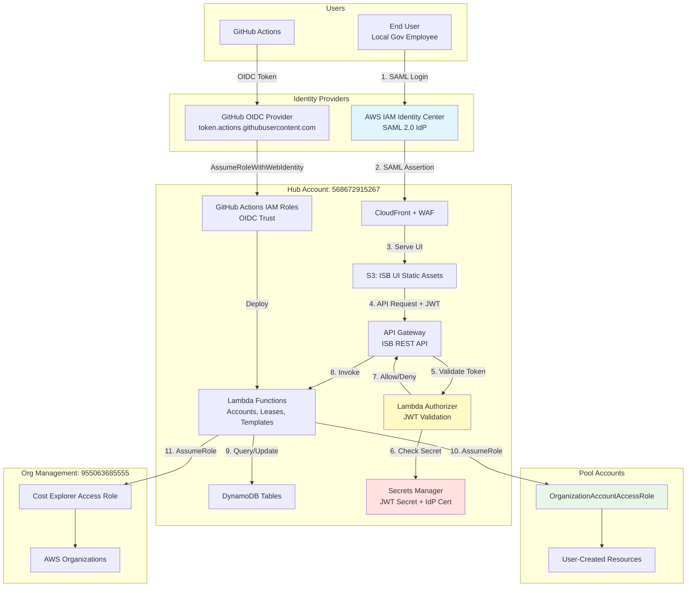
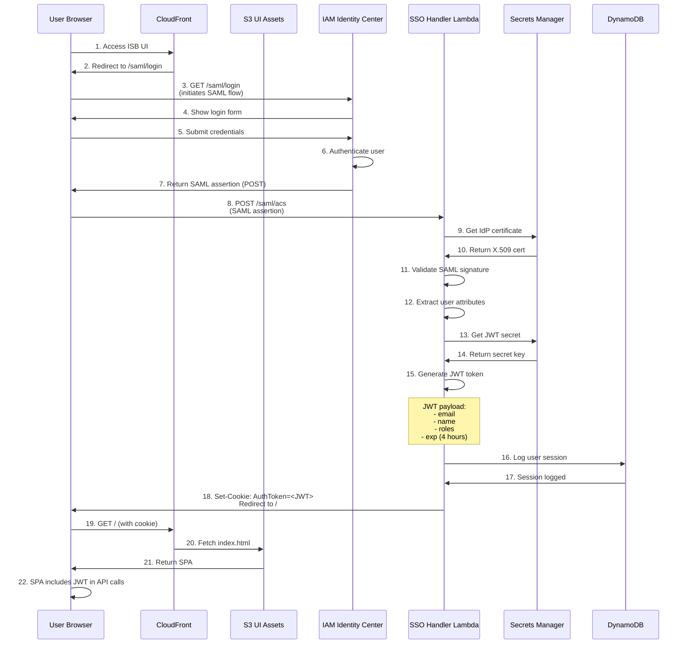
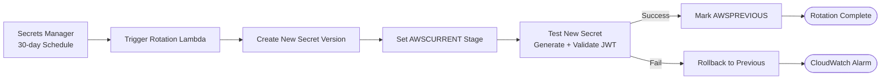
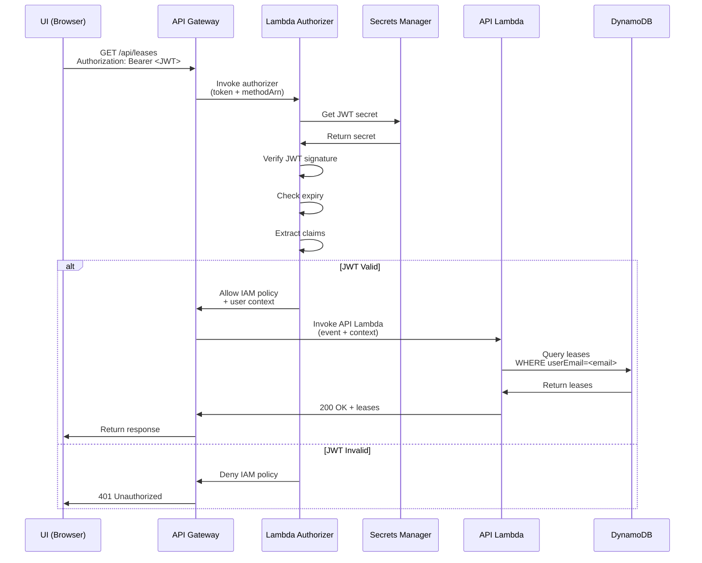

# Authentication Architecture

**Document Version:** 1.0
**Date:** 2026-02-03
**Hub Account:** 568672915267 (InnovationSandboxHub)

---

## Executive Summary

The NDX:Try AWS platform implements a multi-layered authentication architecture combining IAM Identity Center (formerly AWS SSO), SAML 2.0, JWT tokens, and cross-account IAM role assumption. This document provides a comprehensive analysis of authentication flows, IAM role structures, and API security mechanisms.

**Key Authentication Components:**
- **IAM Identity Center** - User identity provider with SAML 2.0
- **JWT Tokens** - Stateless API authentication with 30-day rotation
- **Cross-Account Roles** - Hub→Pool and Hub→Org access patterns
- **API Gateway Authorization** - Lambda authorizer with JWT validation
- **GitHub OIDC** - Credential-less CI/CD authentication

---

## Authentication Architecture Overview



---

## 1. IAM Identity Center (AWS SSO) Configuration

### Identity Source

| Property | Value |
|----------|-------|
| **Identity Source** | Identity Center Directory |
| **User Store** | AWS Managed |
| **Region** | us-west-2 |
| **Instance ARN** | `arn:aws:sso:::instance/ssoins-...` |
| **Identity Store ID** | `d-...` |

### SAML Application Configuration

**Application Name:** Innovation Sandbox on AWS

**SAML Settings:**
- **Application Start URL:** `https://isb.try.ndx.digital.cabinet-office.gov.uk`
- **ACS URL:** `https://<cloudfront-domain>/saml/acs`
- **Entity ID:** `urn:amazon:webservices:isb`
- **NameID Format:** `urn:oasis:names:tc:SAML:2.0:nameid-format:persistent`

**Attribute Mappings:**
```
Subject = ${user:subject}          → User unique identifier
email = ${user:email}              → User email address
name = ${user:name}                → Display name
department = ${user:department}    → Organization/Department
```

**IdP Certificate Storage:**
- Stored in AWS Secrets Manager
- Secret Name: `/isb/ndx-try-isb/Auth/IdpCert`
- Encryption: Customer-managed KMS key
- Rotation: Manual (when certificate rotates)

### User Groups

| Group Name | Purpose | Members |
|-----------|---------|---------|
| ISB-Admins | Platform administrators | Platform team |
| ISB-Users | Standard sandbox requesters | Local gov employees |
| ISB-Approvers | Manual lease approvers | Operations team |

### Permission Sets

**NDX-InnovationSandboxAccess:**
- Grants access to Hub account
- Policies: ReadOnlyAccess (for visibility)
- Session duration: 4 hours

**NDX-OrgManagement:**
- Grants access to Org Management account
- Policies: OrganizationsReadOnlyAccess
- Session duration: 1 hour

---

## 2. SAML Authentication Flow



### SAML Assertion Validation

**Lambda Handler:** `source/lambdas/helpers/sso-handler/src/sso-handler.ts`

**Validation Steps:**
1. Parse SAML assertion XML
2. Retrieve IdP certificate from Secrets Manager
3. Verify XML signature using X.509 certificate
4. Check assertion validity period
5. Validate audience restriction (Entity ID match)
6. Extract user attributes from assertion

**Security Controls:**
- Certificate validation prevents forged assertions
- Timestamp validation prevents replay attacks
- Audience restriction prevents cross-site attacks

---

## 3. JWT Token Management

### JWT Token Structure

**Header:**
```json
{
  "alg": "HS256",
  "typ": "JWT"
}
```

**Payload:**
```json
{
  "sub": "user-unique-id",
  "email": "user@example.gov.uk",
  "name": "User Name",
  "roles": ["user"],
  "iat": 1706990340,
  "exp": 1707004740
}
```

**Signature:**
```
HMACSHA256(
  base64UrlEncode(header) + "." +
  base64UrlEncode(payload),
  secret
)
```

### JWT Secret Management

| Property | Value |
|----------|-------|
| **Storage** | AWS Secrets Manager |
| **Secret Name** | `/isb/ndx-try-isb/Auth/JwtSecret` |
| **Encryption** | Customer-managed KMS key |
| **Rotation Schedule** | Every 30 days (automatic) |
| **Rotation Lambda** | `JwtSecretRotatorFunction` |
| **Password Length** | 32 characters |
| **Character Set** | Alphanumeric + symbols |

### JWT Secret Rotation Process



**Lambda Handler:** `source/lambdas/helpers/secret-rotator/src/secret-rotator-handler.ts`

**Rotation Steps:**
1. Generate new 32-character secret
2. Store as pending secret version
3. Test JWT generation with new secret
4. Promote to AWSCURRENT
5. Deprecate AWSPREVIOUS

**Considerations:**
- In-flight requests may use old JWT (4-hour expiry)
- Rotation happens at low-traffic times
- No user re-authentication required

---

## 4. API Gateway Authorization

### Lambda Authorizer

| Property | Value |
|----------|-------|
| **Type** | Token-based Lambda authorizer |
| **Token Source** | Authorization header |
| **Token Validation** | Bearer token (JWT) |
| **Cache TTL** | 5 minutes |
| **Lambda** | `AuthorizerLambdaFunction` |

### Authorization Flow



### IAM Policy Generation

**Allow Policy (JWT Valid):**
```json
{
  "Version": "2012-10-17",
  "Statement": [
    {
      "Effect": "Allow",
      "Action": "execute-api:Invoke",
      "Resource": "arn:aws:execute-api:us-west-2:568672915267:api-id/prod/*"
    }
  ],
  "context": {
    "email": "user@example.gov.uk",
    "userId": "user-unique-id",
    "roles": "user"
  }
}
```

**Deny Policy (JWT Invalid):**
```json
{
  "Version": "2012-10-17",
  "Statement": [
    {
      "Effect": "Deny",
      "Action": "execute-api:Invoke",
      "Resource": "*"
    }
  ]
}
```

**Cache Key:**
- Authorizer results cached for 5 minutes
- Cache key: JWT token
- Reduces Secrets Manager API calls
- Trade-off: Short revocation delay

---

## 5. Cross-Account IAM Roles

### Hub → Pool Account Access

**Role Name:** `OrganizationAccountAccessRole` (in each pool account)

**Trust Policy:**
```json
{
  "Version": "2012-10-17",
  "Statement": [
    {
      "Effect": "Allow",
      "Principal": {
        "AWS": "arn:aws:iam::568672915267:role/InnovationSandbox-ndx-IntermediateRole"
      },
      "Action": "sts:AssumeRole"
    }
  ]
}
```

**Permissions:**
- Full administrative access within pool account
- Used for account cleanup (AWS Nuke)
- User provisioning (IAM Identity Center)
- Resource deployment (CloudFormation)

**Assumed By:**
- ISB Lambda functions (via IntermediateRole)
- Account Cleaner Step Function

---

### Hub → Org Management Access

**Role Name:** `CostExplorerAccessRole` (in Org Management account)

**Trust Policy:**
```json
{
  "Version": "2012-10-17",
  "Statement": [
    {
      "Effect": "Allow",
      "Principal": {
        "AWS": "arn:aws:iam::568672915267:root"
      },
      "Action": "sts:AssumeRole",
      "Condition": {
        "StringEquals": {
          "sts:ExternalId": "<external-id>"
        }
      }
    }
  ]
}
```

**Permissions:**
- `ce:GetCostAndUsage` - Query Cost Explorer
- `ce:GetCostForecast` - Get cost forecasts
- `organizations:DescribeAccount` - Account metadata

**Assumed By:**
- Cost Collection Lambda
- Budget monitoring Lambda

---

### GitHub Actions → Hub Account

**Role Name:** `GitHubActions-*-Deploy` (multiple roles)

**Trust Policy:**
```json
{
  "Version": "2012-10-17",
  "Statement": [
    {
      "Effect": "Allow",
      "Principal": {
        "Federated": "arn:aws:iam::568672915267:oidc-provider/token.actions.githubusercontent.com"
      },
      "Action": "sts:AssumeRoleWithWebIdentity",
      "Condition": {
        "StringEquals": {
          "token.actions.githubusercontent.com:aud": "sts.amazonaws.com"
        },
        "StringLike": {
          "token.actions.githubusercontent.com:sub": "repo:co-cddo/<repo>:*"
        }
      }
    }
  ]
}
```

See [51-oidc-configuration.md](./51-oidc-configuration.md) for details.

---

## 6. Authentication Security Controls

### Token Security

| Control | Implementation |
|---------|----------------|
| **JWT Secret Rotation** | Automatic 30-day rotation |
| **Token Expiry** | 4-hour lifetime |
| **Signature Algorithm** | HMAC-SHA256 |
| **Secret Storage** | Secrets Manager with KMS encryption |
| **Secure Transmission** | HTTPS only (CloudFront + API Gateway) |

### SAML Security

| Control | Implementation |
|---------|----------------|
| **Assertion Signing** | Required (verified by Lambda) |
| **Certificate Validation** | X.509 certificate from Secrets Manager |
| **Timestamp Validation** | NotBefore/NotOnOrAfter checked |
| **Audience Restriction** | Entity ID match required |
| **Replay Protection** | Assertion ID tracking (not implemented) |

### Cross-Account Security

| Control | Implementation |
|---------|----------------|
| **External ID** | Required for Cost Explorer role |
| **Principal Restrictions** | Limited to specific Hub roles |
| **Permission Boundaries** | Administrative access scoped to pool accounts |
| **Audit Logging** | CloudTrail logs AssumeRole events |

---

## 7. Authentication Flows

### User Authentication (SAML)

1. User accesses ISB UI
2. CloudFront redirects to `/saml/login`
3. SAML request sent to IAM Identity Center
4. User authenticates with credentials
5. IdP returns SAML assertion
6. Lambda validates assertion and generates JWT
7. JWT stored in HTTP-only cookie
8. User accesses UI with JWT

### API Authentication (JWT)

1. UI includes JWT in Authorization header
2. API Gateway invokes Lambda authorizer
3. Authorizer validates JWT signature and expiry
4. If valid: Allow policy + user context
5. If invalid: Deny policy + 401 response

### Cross-Account Authentication

1. Lambda function assumes IntermediateRole
2. IntermediateRole assumes pool account role
3. STS returns temporary credentials
4. Lambda uses credentials for API calls
5. Credentials expire after 1 hour

### GitHub Actions Authentication (OIDC)

1. Workflow requests JWT from GitHub
2. GitHub issues signed JWT token
3. Workflow calls STS AssumeRoleWithWebIdentity
4. STS validates JWT with GitHub OIDC provider
5. STS checks trust policy conditions
6. STS returns temporary credentials (1-hour expiry)

---

## 8. Authentication Monitoring

### CloudWatch Metrics

**Custom Metrics:**
- `AuthenticationSuccess` - Successful SAML logins
- `AuthenticationFailure` - Failed logins
- `JWTValidationSuccess` - Valid JWT requests
- `JWTValidationFailure` - Invalid/expired JWT
- `CrossAccountAssumeRole` - Role assumption attempts

### CloudTrail Events

**Key Events to Monitor:**
- `AssumeRole` - Cross-account access
- `AssumeRoleWithWebIdentity` - GitHub Actions OIDC
- `GetSecretValue` - JWT secret access
- `UpdateSecret` - JWT rotation

### Security Alerts

| Alert | Condition | Action |
|-------|-----------|--------|
| High JWT Failure Rate | >10 failures/min | Notify security team |
| Unauthorized AssumeRole | Failed assume role attempts | Investigate source |
| Secrets Access Spike | >100 GetSecretValue/min | Check for DDoS/abuse |
| JWT Secret Update Failure | Rotation failed | Notify on-call engineer |

---

## Related Documents

- [51-oidc-configuration.md](./51-oidc-configuration.md) - GitHub OIDC details
- [04-cross-account-trust.md](./04-cross-account-trust.md) - IAM role inventory
- [62-secrets-management.md](./62-secrets-management.md) - Secrets architecture

---

**Source Files:**
- SAML Handler: `/Users/cns/httpdocs/cddo/ndx-try-arch/repos/innovation-sandbox-on-aws/source/lambdas/helpers/sso-handler/`
- JWT Rotator: `/Users/cns/httpdocs/cddo/ndx-try-arch/repos/innovation-sandbox-on-aws/source/lambdas/helpers/secret-rotator/`
- API Authorizer: `/Users/cns/httpdocs/cddo/ndx-try-arch/repos/innovation-sandbox-on-aws/source/lambdas/api/authorizer/`
- Auth API Stack: `/Users/cns/httpdocs/cddo/ndx-try-arch/repos/innovation-sandbox-on-aws/source/infrastructure/lib/components/api/auth-api.ts`
